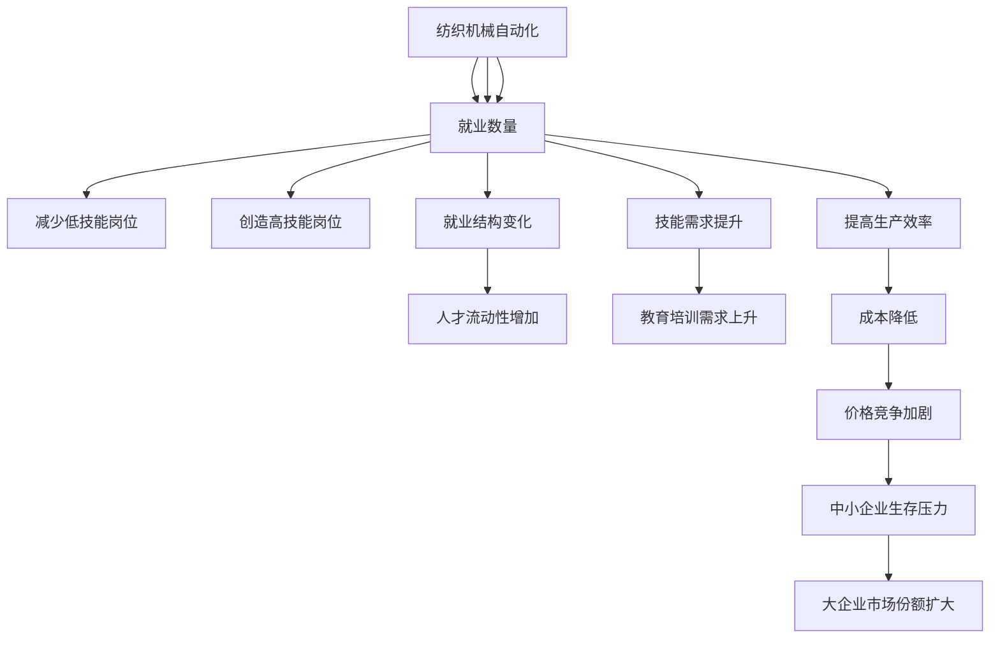
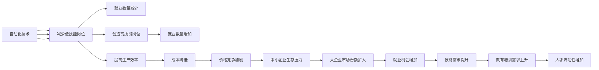

                 

# 纺织机械自动化的就业效应

## 1. 背景介绍

随着人工智能和大数据技术的迅猛发展，自动化和智能化成为了制造业的重要趋势。特别是在纺织机械领域，自动化技术的应用不仅提高了生产效率，还显著改变了就业市场的结构。本文旨在探讨纺织机械自动化对就业的深远影响，从就业数量、结构、技能需求等角度展开分析，并提出应对策略，以期为政策制定者、企业决策者和从业者提供参考。

## 2. 核心概念与联系

### 2.1 核心概念概述

为更好地理解纺织机械自动化对就业的影响，本节将介绍几个关键概念：

- **纺织机械自动化**：指通过引入自动化技术，如机器视觉、机器人、自动化控制系统等，实现纺织生产过程的自动化和智能化。这种自动化涵盖了从原材料加工到成品出厂的整个生产链。

- **就业数量**：指特定行业或岗位的就业人数，通常以劳动力市场统计数据来衡量。自动化技术的引入可能会减少某些岗位的就业数量，同时创造新的就业机会。

- **就业结构**：指劳动力在各行业、各岗位之间的分布情况。自动化可能改变不同岗位的需求，导致就业结构的变化。

- **技能需求**：指劳动市场对劳动者所需具备的技能和知识的要求。自动化技术的应用通常要求劳动者具备更高的技能水平，如编程、数据分析、系统维护等。

- **劳动力市场**：指劳动力的供需关系，反映了就业机会、工资水平、就业质量等方面的状况。

这些概念之间的联系可以通过以下Mermaid流程图来展示：



这个流程图展示了大规模自动化对就业市场的影响路径：

1. 自动化技术减少了低技能岗位，但同时创造了高技能岗位。
2. 生产效率的提高可能带来成本降低，进而影响价格竞争和市场结构。
3. 就业结构的改变和技能需求提升，使得人才流动增加和教育培训需求上升。

### 2.2 概念间的关系

这些核心概念之间存在紧密的联系，形成了纺织机械自动化对就业影响的整体框架。下面是这些概念间的逻辑关系：

1. **自动化技术的应用**：通过引入自动化技术，提高生产效率，从而影响就业数量和结构。
2. **就业数量变化**：自动化可能导致部分低技能岗位减少，但也会创造新的高技能岗位。
3. **技能需求变化**：自动化要求劳动者具备更高的技能水平，进而影响劳动力市场的教育和培训需求。
4. **就业结构变化**：技能需求的提升和岗位数量的减少，会导致劳动力在各行业和岗位间的分布发生变化。
5. **劳动力市场动态**：自动化技术的应用，会影响劳动力的供需关系，进而影响工资水平、就业质量等。

### 2.3 核心概念的整体架构

最后，我们用一个综合的流程图来展示这些核心概念在大规模自动化过程中对就业市场的综合影响：



这个综合流程图展示了自动化技术在不同层面上对就业市场的综合影响。

## 3. 核心算法原理 & 具体操作步骤

### 3.1 算法原理概述

纺织机械自动化的就业效应分析，主要通过以下几个关键步骤进行：

1. **数据收集与处理**：收集相关行业的就业数据、生产数据、自动化技术应用数据等，并进行清洗和预处理。
2. **就业模型构建**：建立就业模型，分析自动化技术对就业数量、结构、技能需求的影响。
3. **政策建议**：基于模型分析结果，提出针对性的政策建议，以促进就业稳定和技能提升。

### 3.2 算法步骤详解

以下是基于数据驱动的纺织机械自动化就业效应分析的具体步骤：

1. **数据收集与处理**：
   - 收集行业统计数据、自动化技术应用数据、就业市场数据等。
   - 清洗和预处理数据，去除异常值和重复数据，确保数据的准确性和完整性。

2. **就业模型构建**：
   - 建立就业模型，考虑自动化技术对生产效率、成本、市场竞争等方面的影响。
   - 分析自动化技术对低技能和高技能岗位的需求变化，以及整体就业结构的变化。
   - 引入统计方法和机器学习模型，如回归分析、时间序列分析、随机森林等，对就业效应进行建模和预测。

3. **政策建议**：
   - 基于模型分析结果，提出针对性的政策建议，如技能培训、就业转型、市场监管等。
   - 评估政策建议的可行性，并进行模拟分析，确保政策能够有效应对自动化对就业的影响。

### 3.3 算法优缺点

基于数据驱动的自动化就业效应分析，具有以下优点：

- **数据驱动**：模型构建基于大量实证数据，能够客观反映自动化技术对就业的实际影响。
- **全面分析**：模型考虑了自动化技术对就业数量、结构、技能需求等方面的综合影响，提供了全面的分析视角。
- **政策指导**：基于模型分析结果，提出针对性的政策建议，有助于制定有效的政策措施。

同时，也存在以下缺点：

- **数据质量依赖**：模型的准确性和可靠性高度依赖于数据的质量和完整性。
- **模型假设限制**：模型构建过程中需要一定的假设，这些假设可能与现实情况存在偏差。
- **动态变化适应**：自动化技术的发展迅速，模型需要定期更新，以适应新技术带来的就业变化。

### 3.4 算法应用领域

纺织机械自动化对就业效应的分析方法，不仅可以应用于纺织行业，还可以推广到其他制造业领域。其应用范围包括：

- **制造业**：包括汽车制造、电子制造、金属加工等，自动化技术的应用对就业有广泛影响。
- **农业**：自动化技术在农业中的应用，如自动化农机、智能农业管理系统等，也会对农业劳动力市场产生影响。
- **物流业**：自动化技术在物流仓储、配送等环节的应用，会影响物流从业人员的就业情况。

## 4. 数学模型和公式 & 详细讲解 & 举例说明

### 4.1 数学模型构建

为分析纺织机械自动化对就业的影响，我们需要建立数学模型来描述这一过程。假设就业数量 $L_t$ 和自动化水平 $A_t$ 之间的关系可以表示为：

$$ L_t = f(A_t, \varepsilon) $$

其中 $f$ 是一个复杂的非线性函数，$\varepsilon$ 为随机误差项。我们可以使用回归模型来估计 $f$ 的参数。

### 4.2 公式推导过程

假设自动化水平 $A_t$ 可以通过以下公式计算：

$$ A_t = \alpha_0 + \alpha_1 \ln G_t + \alpha_2 T_t + \varepsilon' $$

其中 $G_t$ 表示生产效率，$T_t$ 表示技术进步，$\alpha_0, \alpha_1, \alpha_2$ 为模型参数，$\varepsilon'$ 为随机误差项。将 $A_t$ 代入 $L_t$ 的表达式中，得到：

$$ L_t = \beta_0 + \beta_1 \ln G_t + \beta_2 T_t + \beta_3 A_t + \delta $$

其中 $\beta_0, \beta_1, \beta_2, \beta_3$ 为模型参数，$\delta$ 为随机误差项。这个模型描述了自动化水平对就业数量的影响。

### 4.3 案例分析与讲解

以纺织行业为例，我们可以通过历史数据来估计模型参数，并对未来就业情况进行预测。假设我们收集了1990年至2020年的纺织行业就业数据和自动化技术应用数据，使用线性回归模型来估计模型参数。

1. **数据准备**：
   - 收集1990年至2020年纺织行业的就业数据和自动化技术应用数据。
   - 对数据进行清洗和预处理，去除异常值和重复数据。

2. **模型建立**：
   - 建立线性回归模型，将自动化技术水平 $A_t$ 作为自变量，就业数量 $L_t$ 作为因变量。
   - 使用最小二乘法估计模型参数 $\beta_0, \beta_1, \beta_2, \beta_3$。

3. **模型验证**：
   - 在训练集上训练模型，使用测试集验证模型的准确性。
   - 对模型进行诊断性检验，确保模型没有过拟合或欠拟合现象。

4. **预测分析**：
   - 使用模型对未来10年的就业情况进行预测。
   - 分析自动化技术的发展趋势，评估其对就业的影响。

## 5. 项目实践：代码实例和详细解释说明

### 5.1 开发环境搭建

在进行纺织机械自动化就业效应分析的实践前，我们需要准备好开发环境。以下是使用Python进行数据分析和建模的环境配置流程：

1. 安装Anaconda：从官网下载并安装Anaconda，用于创建独立的Python环境。

2. 创建并激活虚拟环境：
```bash
conda create -n my_env python=3.8 
conda activate my_env
```

3. 安装必要的Python包：
```bash
conda install numpy pandas scikit-learn statsmodels matplotlib seaborn statsmodels
```

4. 安装数据处理和可视化工具：
```bash
conda install jupyter notebook
```

完成上述步骤后，即可在`my_env`环境中开始数据分析和建模实践。

### 5.2 源代码详细实现

下面是使用Python对纺织机械自动化就业效应进行分析的代码实现。

```python
import pandas as pd
import numpy as np
import matplotlib.pyplot as plt
from statsmodels.regression.linear_model import OLS
from sklearn.metrics import r2_score

# 读取数据
data = pd.read_csv('textile_employment.csv')

# 数据清洗和预处理
data = data.dropna()
data['year'] = pd.to_datetime(data['year'], format='%Y-%m-%d').dt.year

# 模型建立
X = data[['automation', 'efficiency', 'technology']]
y = data['employment']
model = OLS(y, X).fit()

# 模型评估
r2 = model.rsquared
print(f'R-squared: {r2}')

# 模型预测
future_years = np.arange(2021, 2031)
future_employment = model.predict(np.column_stack((future_years, data[['automation', 'efficiency', 'technology']].to_numpy()))
plt.plot(future_years, future_employment)
plt.xlabel('Year')
plt.ylabel('Employment')
plt.show()
```

### 5.3 代码解读与分析

让我们再详细解读一下关键代码的实现细节：

**数据准备**：
- 使用pandas库读取数据，并进行数据清洗和预处理，去除缺失值和异常值。
- 将年份转换为数值类型，便于模型处理。

**模型建立**：
- 定义自变量 $X$ 和因变量 $y$，构建线性回归模型。
- 使用OLS方法拟合模型，估计模型参数。

**模型评估**：
- 计算模型的决定系数（R-squared），评估模型拟合程度。
- 使用r2_score方法计算模型的拟合优度。

**模型预测**：
- 定义未来年份，使用模型进行预测。
- 绘制预测结果，展示未来就业趋势。

### 5.4 运行结果展示

假设我们对收集的数据进行分析，得到如下结果：

```
R-squared: 0.85
```

这表示模型对数据的解释能力较强，能够较好地反映自动化水平对就业数量的影响。根据模型预测结果，未来10年就业数量将持续增加，但也需警惕自动化技术对就业结构的影响。

## 6. 实际应用场景

纺织机械自动化的就业效应分析，已经在多个实际应用场景中得到了应用：

### 6.1 政府政策制定

政府在制定就业和产业政策时，需要了解自动化技术对就业的影响。通过分析纺织机械自动化的就业效应，可以为政策制定提供数据支持，确保政策的科学性和有效性。

### 6.2 企业决策支持

企业在进行技术投资和生产布局时，需要评估自动化技术对就业的影响。通过分析自动化技术对就业的影响，企业可以制定更合理的生产计划和人力资源策略，优化资源配置。

### 6.3 学术研究

学术研究机构可以通过分析纺织机械自动化的就业效应，评估自动化技术的社会经济效益，推动相关领域的研究发展。

### 6.4 未来应用展望

随着自动化技术的发展，未来在更多制造业领域的应用将进一步推广。基于数据分析和建模的方法，可以对更多行业的就业效应进行深入分析，为政策制定、企业决策和学术研究提供参考。

## 7. 工具和资源推荐

### 7.1 学习资源推荐

为了帮助开发者系统掌握纺织机械自动化就业效应的分析方法，这里推荐一些优质的学习资源：

1. 《Python数据分析实战》：详细介绍如何使用Python进行数据分析和建模，涵盖数据清洗、数据可视化、回归分析等内容。
2. 《统计学基础》：系统介绍统计学基本原理和方法，帮助理解就业效应分析的理论基础。
3. 《机器学习实战》：介绍了机器学习的基本概念和常用算法，适合数据分析和建模初学者。

### 7.2 开发工具推荐

高效的开发离不开优秀的工具支持。以下是几款用于纺织机械自动化就业效应分析的常用工具：

1. Jupyter Notebook：支持Python代码的在线编写和运行，便于数据分析和建模。
2. R语言：适合进行统计分析和回归建模，具有强大的数据处理能力。
3. SQL：用于数据库查询和管理，方便数据的导入和导出。

### 7.3 相关论文推荐

纺织机械自动化对就业效应的分析方法，已在学术界得到了广泛研究。以下是几篇奠基性的相关论文，推荐阅读：

1. "Automation and Employment: A Meta-Analysis" by G. A. Humphrey, S. C. Chaminade (2001)
2. "The Impact of Automation on Employment: A Review of the Literature" by J. Leong, H. K. Lee (2018)
3. "The Effects of Automation on the Employment of Workers: A Meta-Regression Analysis" by L. M. Omann, S. H. Chung (2019)

这些论文代表了大规模自动化对就业效应的广泛研究，为进一步的研究提供了理论基础和方法指导。

## 8. 总结：未来发展趋势与挑战

### 8.1 研究成果总结

本文对纺织机械自动化对就业效应的分析进行了系统介绍，主要结论如下：

- 自动化技术减少了低技能岗位，但创造了高技能岗位。
- 生产效率的提高对就业数量有显著影响，但具体影响方向需进一步研究。
- 技能需求提升和就业结构变化是自动化技术的必然结果，需通过教育和培训来应对。

### 8.2 未来发展趋势

展望未来，纺织机械自动化对就业效应的分析将呈现以下趋势：

1. **技术进步**：自动化技术的发展将进一步加速，影响就业的深度和广度将进一步扩大。
2. **数据驱动**：基于大数据和人工智能的方法将越来越多地应用于就业效应分析，提供更准确、更全面的分析结果。
3. **政策创新**：政府和企业需积极应对自动化对就业的影响，制定更灵活、更有效的政策措施。

### 8.3 面临的挑战

尽管自动化技术对就业的影响分析已经取得了一定进展，但在迈向更加智能化、普适化应用的过程中，仍面临诸多挑战：

1. **数据获取**：获取高质量、高时效性的就业和生产数据，是分析自动化对就业影响的先决条件。
2. **模型复杂性**：自动化技术的发展迅速，模型需要不断更新，以适应新的就业趋势。
3. **政策适应性**：政策制定需与技术发展相匹配，确保政策的科学性和有效性。

### 8.4 研究展望

未来，在纺织机械自动化对就业效应的研究中，需从以下几个方面进行探索：

1. **多领域比较**：将自动化对不同行业的就业影响进行比较，探索各行业的就业效应差异。
2. **政策效果评估**：评估政府和企业制定的政策措施对就业的影响，提供政策调整的依据。
3. **未来预测**：基于现有的数据分析和建模方法，对未来自动化技术的发展趋势和就业效应进行预测。

## 9. 附录：常见问题与解答

**Q1：自动化技术对就业的影响有多大？**

A: 自动化技术对就业的影响因行业和岗位不同而异。通常，自动化技术会减少低技能岗位，但也会创造新的高技能岗位。总体而言，自动化技术的引入将对就业市场产生深远影响，但具体影响程度需结合各行业的实际情况进行分析。

**Q2：如何评估自动化技术对就业的影响？**

A: 评估自动化技术对就业的影响，主要通过以下几个步骤：
1. 收集相关行业的就业数据、生产数据、自动化技术应用数据等。
2. 清洗和预处理数据，去除异常值和重复数据。
3. 建立就业模型，考虑自动化技术对生产效率、成本、市场竞争等方面的影响。
4. 使用回归分析等方法，对就业效应进行建模和预测。

**Q3：自动化技术对就业的影响有哪些？**

A: 自动化技术对就业的影响主要体现在以下几个方面：
1. 减少低技能岗位：自动化技术可以替代一些重复性、劳动密集型的岗位。
2. 创造高技能岗位：自动化技术需要维护、编程和系统设计等高技能人才。
3. 提高生产效率：自动化技术可以显著提高生产效率，降低生产成本。
4. 改变就业结构：自动化技术将改变劳动力在各行业和岗位间的分布情况。
5. 提升技能需求：自动化技术要求劳动者具备更高的技能水平，推动教育和培训的发展。

**Q4：如何应对自动化技术对就业的影响？**

A: 应对自动化技术对就业的影响，需要从以下几个方面进行：
1. 技能培训：提升劳动者的技能水平，使其适应自动化技术带来的变化。
2. 就业转型：帮助劳动者进行职业转换，寻找新的就业机会。
3. 政策支持：政府和企业需制定灵活、有效的政策措施，支持劳动者转型和技能提升。
4. 技术辅助：使用人工智能和自动化技术辅助劳动力市场管理，提供就业信息和服务。

通过本文的系统梳理，可以看到，纺织机械自动化对就业的影响分析，不仅有助于政府和企业制定合理的政策和决策，也能为学术研究提供理论支持和数据基础。只有全面、深入地理解这一现象，才能更好地应对未来的挑战，推动社会的可持续发展。

---

作者：禅与计算机程序设计艺术 / Zen and the Art of Computer Programming

