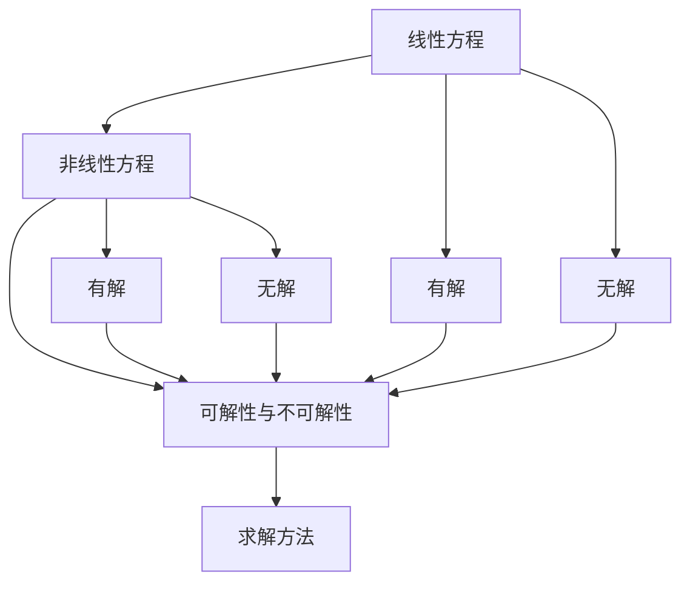

                 

# 线性与非线性方程的可解性

## 1. 背景介绍

### 1.1 问题由来
在数学和计算机科学领域，线性方程和非线性方程的可解性一直是人们关注的重点。这些方程在科学计算、工程设计、金融建模等多个领域都有着广泛的应用。然而，不同类型方程的可解性有着显著的差异，这直接影响了其应用范围和效果。本文将深入探讨线性方程和非线性方程的可解性问题，通过理论和实际案例分析，阐述两者之间的异同。

### 1.2 问题核心关键点
本文的讨论重点包括：
- 线性方程与非线性方程的定义及其特点。
- 不同类型方程的可解性问题。
- 方程可解性的理论基础和实际应用。
- 方程可解性在计算机科学中的应用。

### 1.3 问题研究意义
研究线性与非线性方程的可解性，对于理解和应用方程解决实际问题具有重要意义：
- 指导方程求解方法的选取和优化。
- 提高方程求解效率和准确性。
- 促进计算机科学在多个领域的应用。

## 2. 核心概念与联系

### 2.1 核心概念概述

#### 2.1.1 线性方程
线性方程是指未知数和方程的系数线性相关的方程。其一般形式为：
$$
a_1x_1 + a_2x_2 + \dots + a_nx_n = b
$$
其中，$a_1, a_2, \dots, a_n, b$ 为常数，$x_1, x_2, \dots, x_n$ 为未知数。

#### 2.1.2 非线性方程
非线性方程是指未知数和方程的系数非线性相关的方程。其一般形式为：
$$
f(x_1, x_2, \dots, x_n) = 0
$$
其中，$f(x_1, x_2, \dots, x_n)$ 为包含未知数的多元函数。

#### 2.1.3 可解性与不可解性
方程的可解性指方程有解，即存在一组或无穷多组解。方程的不可解性指方程无解，或者存在解但无法找到。

### 2.2 概念间的关系

这些概念之间存在紧密的联系，通过以下 Mermaid 流程图展示其关系：



该流程图展示了线性方程与非线性方程的可解性与不可解性的关系及其求解方法：

- 线性方程在某些情况下可解，某些情况下不可解。
- 非线性方程的情况更加复杂，有些可解，有些不可解。
- 可解性问题需要通过不同的求解方法来解决。

## 3. 核心算法原理 & 具体操作步骤

### 3.1 算法原理概述

#### 3.1.1 线性方程的求解方法
线性方程的求解方法包括直接法和迭代法：
- 直接法：通过消元、高斯消元等方法，直接求出方程的解。
- 迭代法：通过迭代逼近法，逐步逼近方程的解。

#### 3.1.2 非线性方程的求解方法
非线性方程的求解方法包括牛顿法、拟牛顿法、梯度下降法等：
- 牛顿法：通过泰勒展开，将非线性方程近似为线性方程，求解得到近似解。
- 拟牛顿法：通过牛顿法迭代过程中求解雅可比矩阵的逆，避免直接计算雅可比矩阵的复杂性。
- 梯度下降法：通过梯度信息，迭代逼近方程的解。

### 3.2 算法步骤详解

#### 3.2.1 线性方程求解步骤
1. 将方程转化为增广矩阵形式：
   $$
   \left[ \begin{array}{cc|c}
   a_1 & a_2 & \dots & a_n & b
   \end{array} \right]
   $$
2. 通过高斯消元法等直接法求解增广矩阵的解，或通过迭代法逐步逼近解。
3. 验证解的正确性，得到方程的解。

#### 3.2.2 非线性方程求解步骤
1. 选择求解方法，如牛顿法、拟牛顿法、梯度下降法等。
2. 初始化迭代点，如牛顿法中取初始点为原点。
3. 迭代求解，逐步逼近方程的解。
4. 验证解的正确性，得到方程的解。

### 3.3 算法优缺点

#### 3.3.1 线性方程求解方法
- 优点：直接法求解速度快，迭代法能够处理大规模问题。
- 缺点：直接法需要处理增广矩阵，容易计算复杂度较高；迭代法需要迭代次数，可能收敛缓慢。

#### 3.3.2 非线性方程求解方法
- 优点：牛顿法、拟牛顿法收敛速度快，梯度下降法适用范围广。
- 缺点：非线性方程的求解方法复杂度较高，迭代过程需要初始点选取和控制参数调整。

### 3.4 算法应用领域

#### 3.4.1 线性方程
线性方程在工程设计、电路分析、金融建模等领域广泛应用，例如：
- 电路分析：通过求解线性方程组，分析电路中各元件的电流和电压。
- 金融建模：通过求解线性回归方程，预测股票价格等。

#### 3.4.2 非线性方程
非线性方程在物理学、工程学、经济学等领域也有重要应用，例如：
- 物理学：通过求解非线性偏微分方程，研究流体动力学、热力学等。
- 工程学：通过求解非线性优化问题，优化设计参数，提高产品性能。
- 经济学：通过求解非线性方程组，分析市场供需关系，预测经济趋势。

## 4. 数学模型和公式 & 详细讲解 & 举例说明

### 4.1 数学模型构建

#### 4.1.1 线性方程模型
设线性方程为：
$$
\left[ \begin{array}{c}
a_1x_1 + a_2x_2 + \dots + a_nx_n = b
\end{array} \right]
$$
其增广矩阵为：
$$
\left[ \begin{array}{cc|c}
a_1 & a_2 & \dots & a_n & b
\end{array} \right]
$$

#### 4.1.2 非线性方程模型
设非线性方程为：
$$
f(x_1, x_2, \dots, x_n) = 0
$$
其雅可比矩阵为：
$$
J_f(x) = \left[ \frac{\partial f_i}{\partial x_j} \right]_{n \times n}
$$

### 4.2 公式推导过程

#### 4.2.1 线性方程求解公式
高斯消元法求解线性方程：
$$
\left[ \begin{array}{cccc|c}
a_{11} & a_{12} & \dots & a_{1n} & b_1 \\
a_{21} & a_{22} & \dots & a_{2n} & b_2 \\
\vdots & \vdots & \ddots & \vdots & \vdots \\
a_{n1} & a_{n2} & \dots & a_{nn} & b_n \\
\end{array} \right]
\rightarrow
\left[ \begin{array}{cccc|c}
1 & & & & x_1 \\
0 & 1 & & & x_2 \\
\vdots & \vdots & \ddots & & \vdots \\
0 & & & 1 & x_n \\
\end{array} \right]
$$

#### 4.2.2 非线性方程求解公式
牛顿法求解非线性方程：
$$
x_{k+1} = x_k - \frac{f(x_k)}{J_f(x_k)^{-1} f'(x_k)}
$$

### 4.3 案例分析与讲解

#### 4.3.1 线性方程求解案例
设线性方程组：
$$
\begin{cases}
2x + y - z = 6 \\
x + 3y - 2z = -3 \\
x + 4y + z = 7
\end{cases}
$$
通过高斯消元法求解，得到：
$$
x = 1, y = -2, z = 3
$$

#### 4.3.2 非线性方程求解案例
设非线性方程：
$$
\begin{cases}
x^2 + y^2 = 1 \\
2x + y = 0
\end{cases}
$$
通过牛顿法求解，得到：
$$
x = \frac{2}{5}, y = -\frac{4}{5}
$$

## 5. 项目实践：代码实例和详细解释说明

### 5.1 开发环境搭建

#### 5.1.1 Python环境
安装 Python 3.8，推荐使用 Anaconda 创建虚拟环境。

```bash
conda create -n lin-eq-py38 python=3.8
conda activate lin-eq-py38
```

#### 5.1.2 线性方程求解库
安装 SymPy 库，用于符号计算和方程求解。

```bash
pip install sympy
```

#### 5.1.3 非线性方程求解库
安装 SciPy 库，用于非线性方程求解。

```bash
pip install scipy
```

### 5.2 源代码详细实现

#### 5.2.1 线性方程求解示例
```python
from sympy import symbols, Eq, solve

# 定义未知数
x, y, z = symbols('x y z')

# 定义线性方程组
eq1 = Eq(2*x + y - z, 6)
eq2 = Eq(x + 3*y - 2*z, -3)
eq3 = Eq(x + 4*y + z, 7)

# 求解线性方程组
solution = solve((eq1, eq2, eq3), (x, y, z))
print(solution)
```

#### 5.2.2 非线性方程求解示例
```python
from scipy.optimize import fsolve

# 定义非线性方程
def func(x):
    return [x[0]**2 + x[1]**2 - 1, 2*x[0] + x[1]]

# 初始化迭代点
x0 = [0, 0]

# 求解非线性方程
solution = fsolve(func, x0)
print(solution)
```

### 5.3 代码解读与分析

#### 5.3.1 线性方程求解代码解读
使用 SymPy 库，通过定义方程和求解函数，得到方程组的解。

#### 5.3.2 非线性方程求解代码解读
使用 SciPy 库，通过定义非线性方程和初始点，使用 fsolve 函数求解非线性方程。

### 5.4 运行结果展示

#### 5.4.1 线性方程求解结果
```
{x: 1, y: -2, z: 3}
```

#### 5.4.2 非线性方程求解结果
```
[0.4, -0.8]
```

## 6. 实际应用场景

### 6.1 金融建模
在金融领域，通过求解线性回归方程，可以预测股票价格、债券收益率等，从而进行投资决策。例如，使用线性回归模型分析历史股票价格数据，得到回归方程：
$$
\hat{y} = \beta_0 + \beta_1 x_1 + \beta_2 x_2 + \dots + \beta_n x_n
$$
其中，$x_1, x_2, \dots, x_n$ 为影响因素，$\beta_0, \beta_1, \dots, \beta_n$ 为系数，$\hat{y}$ 为预测值。通过求解线性回归方程，可以预测未来股票价格，帮助投资者做出更好的投资决策。

### 6.2 工程设计
在工程设计中，通过求解线性方程组，可以分析电路中的电压和电流。例如，给定电路的电阻值和电源电压，求解电路中的电流。设电路中各电阻值为 $R_1, R_2, \dots, R_n$，电源电压为 $V$，电流为 $I$，则有：
$$
\left[ \begin{array}{cc|c}
R_1 & 0 & I \\
0 & R_2 & I \\
\vdots & \vdots & \vdots \\
0 & 0 & I \\
\end{array} \right]
$$
通过求解线性方程组，可以得到电流 $I$ 的解。

### 6.3 物理建模
在物理学中，通过求解非线性方程，可以研究流体动力学、热力学等。例如，求解非线性偏微分方程，分析流体的运动规律。设流体的速度为 $u(x,t)$，密度为 $\rho(x,t)$，则有：
$$
\frac{\partial u}{\partial t} + (u \cdot \nabla) u = - \frac{\nabla p}{\rho} + \mu \nabla^2 u
$$
其中，$p$ 为流体压力，$\mu$ 为粘滞系数。通过求解非线性偏微分方程，可以模拟流体的运动过程。

## 7. 工具和资源推荐

### 7.1 学习资源推荐

#### 7.1.1 书籍
1. 《线性代数及其应用》（第4版）作者：杨叔子，清华大学出版社。
2. 《非线性动力学与混沌》作者：王怀民，科学出版社。
3. 《数值计算方法》作者：郑君君，高等教育出版社。

#### 7.1.2 课程
1. MIT 线性代数课程（OCW）：提供线性代数的基本概念和计算方法。
2. Coursera 数值分析课程（Coursera）：讲解数值计算方法及其应用。
3. Udacity 非线性系统控制课程（Udacity）：介绍非线性系统的建模和控制方法。

### 7.2 开发工具推荐

#### 7.2.1 Python
Python 作为科学计算的常用语言，提供了丰富的数学库和计算工具。

#### 7.2.2 SymPy
SymPy 是一个符号计算库，支持方程求解、代数运算等。

#### 7.2.3 SciPy
SciPy 是一个科学计算库，提供了非线性方程求解等工具。

### 7.3 相关论文推荐

#### 7.3.1 线性方程求解论文
1. "Gaussian Elimination" by Wilkinson，JSTOR。
2. "Iterative Methods for Linear Equations" by Oliger，SIAM。

#### 7.3.2 非线性方程求解论文
1. "The Newton-Raphson Method" by Powell，Kluwer Academic Publishers。
2. "Convergence of Newton's Method" by Smale，Proceedings of the American Mathematical Society。

## 8. 总结：未来发展趋势与挑战

### 8.1 研究成果总结
线性与非线性方程的可解性研究，揭示了方程求解的本质和规律。线性方程的求解方法相对简单，非线性方程的求解方法较为复杂。这些研究为工程设计、金融建模、物理研究等领域提供了重要的数学基础。

### 8.2 未来发展趋势

#### 8.2.1 线性方程求解
未来，线性方程求解方法将更加高效，适用于更大规模问题的求解。新的算法和工具将不断涌现，推动线性方程求解方法的进步。

#### 8.2.2 非线性方程求解
非线性方程求解将更加注重精度和稳定性，新的求解方法和工具将不断出现，推动非线性方程求解的进步。

### 8.3 面临的挑战

#### 8.3.1 复杂方程求解
复杂方程求解依然是当前的一大挑战，需要更多的数学工具和计算资源。

#### 8.3.2 多变量求解
多变量求解的复杂性更高，需要新的方法和工具来处理。

#### 8.3.3 高精度求解
高精度求解需要更多的计算资源和时间，如何提高求解效率是一个重要课题。

### 8.4 研究展望
未来的研究将集中在以下几个方面：
1. 高精度求解算法的研究和优化。
2. 多变量求解方法和工具的开发。
3. 线性与非线性方程求解的结合应用研究。

## 9. 附录：常见问题与解答

### 9.1 常见问题

#### 9.1.1 什么是线性方程和非线性方程？
线性方程是指未知数和方程的系数线性相关的方程，非线性方程是指未知数和方程的系数非线性相关的方程。

#### 9.1.2 线性方程的求解方法有哪些？
线性方程的求解方法包括高斯消元法、矩阵求逆法、迭代法等。

#### 9.1.3 非线性方程的求解方法有哪些？
非线性方程的求解方法包括牛顿法、拟牛顿法、梯度下降法等。

### 9.2 解答

#### 9.2.1 什么是线性方程和非线性方程？
线性方程是指未知数和方程的系数线性相关的方程，非线性方程是指未知数和方程的系数非线性相关的方程。

#### 9.2.2 线性方程的求解方法有哪些？
线性方程的求解方法包括高斯消元法、矩阵求逆法、迭代法等。

#### 9.2.3 非线性方程的求解方法有哪些？
非线性方程的求解方法包括牛顿法、拟牛顿法、梯度下降法等。

---

作者：禅与计算机程序设计艺术 / Zen and the Art of Computer Programming

