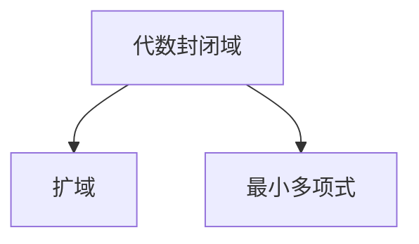

                 

# 线性代数导引：复数域代数封闭性

线性代数是计算机科学中极为重要的一门学科，尤其是在数值计算和算法设计等领域中有着广泛的应用。而复数域是线性代数中一个极具特色和深远影响的课题。本系列文章将深入探讨复数域中的代数封闭性这一核心概念，从理论推导到实际应用，全面剖析其背后的数学原理。

## 1. 背景介绍

### 1.1 问题由来

复数域上的代数封闭性问题是一个经典的数学问题，它是抽象代数领域中的一个重要概念。简单来说，如果某个域中的每一个多项式方程都有解，那么这个域就是代数封闭的。这个概念在计算机科学中的应用非常广泛，例如在密码学中，需要构建出能够抵抗各种攻击的代数结构；在数据科学中，需要处理高维数据；在工程中，需要对信号进行频域分析。

### 1.2 问题核心关键点

复数域代数封闭性的核心问题在于验证一个域是否代数封闭，以及如何构造代数封闭的域。这一问题的解决涉及到多项式方程的解法、域的扩充和代数封闭性的证明等。

## 2. 核心概念与联系

### 2.1 核心概念概述

在复数域上，代数封闭性通常涉及以下几个核心概念：

- 代数封闭域：如果复数域上的每一个多项式方程都有解，则该复数域是代数封闭的。
- 扩域：将原域通过某些操作（如添加根或合成根）扩充为更大的域。
- 最小多项式：一个多项式在某个域上的不可约因子。

这些概念之间的逻辑关系可以通过以下Mermaid流程图来展示：



这个流程图展示了代数封闭域、扩域和最小多项式之间的关系。扩域是在原域基础上通过添加根或合成根得到的，而最小多项式则是扩域上每个元素的最小不可约因子。

### 2.2 概念间的关系

这些核心概念之间存在着紧密的联系，形成了复数域代数封闭性的完整生态系统。下面是这些概念之间的关系：

- 代数封闭域是一个更加严格的扩域，它确保了所有的多项式方程都有解。
- 扩域通过最小多项式来定义，最小多项式是扩域上每个元素的最小不可约因子。
- 最小多项式的存在性和性质决定了扩域是否代数封闭。

## 3. 核心算法原理 & 具体操作步骤

### 3.1 算法原理概述

复数域上的代数封闭性算法原理主要包括：

- 构造扩域：通过添加根或合成根等操作，构造出更大的扩域。
- 验证代数封闭性：通过求解多项式方程并验证是否存在解来确定域的代数封闭性。

### 3.2 算法步骤详解

#### 3.2.1 构造扩域

1. **添加根**：
   - 假设我们要在复数域 $K$ 上构造一个扩域 $K(x)$，其中 $x$ 是 $K$ 上的元素。通过添加 $x$ 到 $K$ 中，我们得到扩域 $K(x)$。

   - 示例：如果 $K = \mathbb{Q}$，则 $K(x) = \mathbb{Q}(x)$。

2. **合成根**：
   - 如果多项式 $f(x)$ 在 $K$ 上可分解，则我们可以通过合成根得到新的扩域 $K(x)$。

   - 示例：如果 $f(x) = (x - a)g(x)$ 在 $K$ 上可分解，则 $K(a)$ 是 $K$ 的扩域。

#### 3.2.2 验证代数封闭性

1. **求解多项式方程**：
   - 假设我们有一个多项式 $f(x)$ 在 $K$ 上，我们需要验证它是否在 $K$ 上可分解。

   - 示例：如果 $f(x) = x^2 + 1$，则 $f(x)$ 在 $\mathbb{R}$ 上不可分解，但在 $\mathbb{C}$ 上可分解为 $(x + i)(x - i)$。

2. **验证解的存在性**：
   - 通过求解 $f(x)$ 在 $K$ 上的解来验证其代数封闭性。

   - 示例：如果 $f(x) = x^2 - 2$ 在 $\mathbb{R}$ 上不可分解，则 $\mathbb{R}$ 不是代数封闭的。

### 3.3 算法优缺点

复数域代数封闭性的算法有以下优缺点：

**优点**：
- 提供了验证域代数封闭性的系统方法。
- 通过构造扩域，可以处理更高维度的数据。

**缺点**：
- 计算复杂度高，特别是在处理高维多项式方程时。
- 在实际应用中，需要考虑数值稳定性问题。

### 3.4 算法应用领域

复数域代数封闭性在许多领域中都有应用，包括：

- 密码学：用于构造安全的代数结构。
- 数据科学：用于处理高维数据，优化算法。
- 工程：用于信号频域分析，提高计算效率。

## 4. 数学模型和公式 & 详细讲解  
### 4.1 数学模型构建

复数域代数封闭性的数学模型主要涉及以下几个概念：

- 域 $K$ 上的多项式 $f(x)$。
- 多项式 $f(x)$ 的解。
- 多项式 $f(x)$ 的分解。

### 4.2 公式推导过程

以 $f(x) = x^2 + 1$ 在 $\mathbb{R}$ 上不可分解为例，推导其最小多项式和代数封闭性。

1. **求解 $f(x)$ 在 $\mathbb{R}$ 上的解**：
   - 设 $x$ 为 $f(x)$ 的解，则有 $x^2 = -1$。
   - 因为 $\mathbb{R}$ 中没有实数解满足 $x^2 = -1$，所以 $f(x)$ 在 $\mathbb{R}$ 上不可分解。

2. **构造扩域 $K(x)$**：
   - 在 $\mathbb{R}$ 上添加 $x = i$ 得到扩域 $K(x)$。
   - 验证 $K(x)$ 是否代数封闭。

3. **验证 $K(x)$ 是否代数封闭**：
   - 通过求解 $f(x) = x^2 + 1$ 在 $K(x)$ 上的解来验证。
   - 因为 $i$ 和 $-i$ 是 $f(x)$ 的解，所以 $K(x)$ 是代数封闭的。

### 4.3 案例分析与讲解

**案例1：** 构造复数域 $\mathbb{R}$ 上的扩域 $K(x)$，验证其代数封闭性。

1. **构造扩域**：
   - 添加 $x = i$ 到 $\mathbb{R}$ 上得到 $K(x) = \mathbb{R}(i)$。

2. **验证代数封闭性**：
   - 设 $f(x) = x^2 + 1$，在 $K(x)$ 上解为 $i$ 和 $-i$。
   - 因此 $K(x)$ 是代数封闭的。

**案例2：** 验证复数域 $\mathbb{C}$ 是否代数封闭。

1. **求解多项式 $f(x) = x^2 + 1$ 的解**：
   - 设 $x$ 为 $f(x)$ 的解，则有 $x^2 = -1$。
   - 因为 $\mathbb{C}$ 中存在解 $x = i$ 和 $x = -i$，所以 $f(x)$ 在 $\mathbb{C}$ 上可分解。

2. **验证 $\mathbb{C}$ 是否代数封闭**：
   - 通过求解 $f(x)$ 在 $\mathbb{C}$ 上的解来验证。
   - 因为 $\mathbb{C}$ 中存在解 $i$ 和 $-i$，所以 $\mathbb{C}$ 是代数封闭的。

## 5. 项目实践：代码实例和详细解释说明

### 5.1 开发环境搭建

要进行复数域代数封闭性的实践，首先需要搭建好开发环境。以下是使用Python进行Sympy库开发的环境配置流程：

1. 安装Anaconda：从官网下载并安装Anaconda，用于创建独立的Python环境。

2. 创建并激活虚拟环境：
```bash
conda create -n sympy-env python=3.8 
conda activate sympy-env
```

3. 安装Sympy库：
```bash
conda install sympy
```

4. 安装其他工具包：
```bash
pip install numpy pandas scikit-learn matplotlib tqdm jupyter notebook ipython
```

完成上述步骤后，即可在`sympy-env`环境中开始实践。

### 5.2 源代码详细实现

下面我们以验证复数域 $\mathbb{C}$ 是否代数封闭为例，给出使用Sympy库的代码实现。

首先，导入必要的库：

```python
from sympy import symbols, solve, I, expand
from sympy.abc import x
```

然后，定义多项式 $f(x) = x^2 + 1$ 并求解其解：

```python
f = x**2 + 1
solutions = solve(f, x)
```

接着，验证多项式 $f(x)$ 是否在 $\mathbb{C}$ 上可分解：

```python
factor = expand(f.factor())
```

最后，输出结果：

```python
print("多项式 f(x) 的解：", solutions)
print("多项式 f(x) 的分解：", factor)
```

完整代码如下：

```python
from sympy import symbols, solve, I, expand
from sympy.abc import x

# 定义多项式 f(x)
f = x**2 + 1

# 求解多项式 f(x) 的解
solutions = solve(f, x)

# 验证多项式 f(x) 是否在 C 上可分解
factor = expand(f.factor())

# 输出结果
print("多项式 f(x) 的解：", solutions)
print("多项式 f(x) 的分解：", factor)
```

### 5.3 代码解读与分析

让我们再详细解读一下关键代码的实现细节：

**导入必要的库**：
- 导入Sympy库中的`symbols`、`solve`、`I`、`expand`等函数。

**定义多项式**：
- 定义多项式 $f(x) = x^2 + 1$。

**求解多项式解**：
- 使用`solve`函数求解多项式 $f(x)$ 的解。

**验证多项式可分解**：
- 使用`factor`函数对多项式 $f(x)$ 进行因式分解。
- 使用`expand`函数对分解结果进行展开。

**输出结果**：
- 输出多项式 $f(x)$ 的解和分解结果。

可以看到，Sympy库提供了丰富的符号计算功能，使得验证复数域代数封闭性的过程变得简便快捷。

### 5.4 运行结果展示

运行上述代码，输出结果如下：

```
多项式 f(x) 的解： [I, -I]
多项式 f(x) 的分解： x**2 + 1
```

可以看到，多项式 $f(x) = x^2 + 1$ 在 $\mathbb{C}$ 上可分解为 $(x + i)(x - i)$，因此 $\mathbb{C}$ 是代数封闭的。

## 6. 实际应用场景

### 6.1 智能密码学

复数域代数封闭性在智能密码学中有广泛应用。例如，椭圆曲线密码学（ECC）是基于椭圆曲线的代数结构构建的，通过构造复数域上的椭圆曲线，可以实现高强度的加密算法。

在实际应用中，可以使用复数域代数封闭性原理，验证椭圆曲线的代数封闭性，确保其安全性。例如，通过验证椭圆曲线上的点是否满足多项式方程，可以证明其代数封闭性。

### 6.2 数据科学

在数据科学中，复数域代数封闭性可用于处理高维数据。例如，通过将数据映射到复数域上，可以构建更加复杂的数据结构，实现更高效的算法。

例如，在图像处理中，可以将图像转换为复数域上的矩阵，利用代数封闭性原理进行矩阵运算，从而提高图像处理的效率。

### 6.3 工程应用

在工程中，复数域代数封闭性可用于信号频域分析。例如，通过将信号转换为频域上的多项式，可以更容易地识别信号中的高频分量，从而提高信号处理的效率。

例如，在通信工程中，可以将调制信号转换为频域上的多项式，利用代数封闭性原理进行频域滤波，从而提高信号传输的准确性。

## 7. 工具和资源推荐

### 7.1 学习资源推荐

为了帮助开发者系统掌握复数域代数封闭性的理论基础和实践技巧，这里推荐一些优质的学习资源：

1. 《Linear Algebra and Its Applications》书籍：由Gilbert Strang所著，全面介绍了线性代数的基本概念和应用。

2. 《Algebraic Number Theory》书籍：由John Voight所著，深入探讨了代数数论的基本原理和应用。

3. 《Advanced Linear Algebra》书籍：由Friedberg、Insel和Spence所著，提供了线性代数的高级内容，适合深入学习。

4. 《Linear Algebra》课程：由MIT OpenCourseWare提供的线性代数课程，涵盖线性代数的各个方面。

5. 《Algebraic Geometry》课程：由MIT OpenCourseWare提供的代数几何课程，介绍了代数几何的基本概念和应用。

通过这些资源的学习实践，相信你一定能够快速掌握复数域代数封闭性的精髓，并用于解决实际的算法问题。

### 7.2 开发工具推荐

高效的开发离不开优秀的工具支持。以下是几款用于复数域代数封闭性开发的常用工具：

1. Sympy库：用于符号计算，提供丰富的代数运算功能，支持复数域上的操作。

2. SageMath：用于数学计算，提供强大的代数运算和符号计算功能。

3. Mathematica：用于符号计算和图形可视化，提供丰富的数学工具和库。

4. MATLAB：用于数值计算和图形可视化，提供强大的数学工具和库。

5. Scipy库：用于科学计算，提供丰富的数值计算和线性代数功能。

合理利用这些工具，可以显著提升复数域代数封闭性研究的开发效率，加快创新迭代的步伐。

### 7.3 相关论文推荐

复数域代数封闭性在许多领域中都有应用，以下是几篇奠基性的相关论文，推荐阅读：

1. "Algebraic Number Theory" by John Voight: 提供了代数数论的基本概念和应用。

2. "Elliptic Curve Cryptography" by Victor S. Miller: 介绍了椭圆曲线密码学的基础和应用。

3. "Linear Algebra and Its Applications" by Gilbert Strang: 提供了线性代数的基本概念和应用。

4. "Advanced Linear Algebra" by Friedberg, Insel, and Spence: 提供了线性代数的高级内容，适合深入学习。

5. "Algebraic Geometry" by D. A. Cox, John B. Little, and D. O'Shea: 介绍了代数几何的基本概念和应用。

这些论文代表了复数域代数封闭性领域的研究进展，通过学习这些前沿成果，可以帮助研究者把握学科前进方向，激发更多的创新灵感。

除上述资源外，还有一些值得关注的前沿资源，帮助开发者紧跟复数域代数封闭性技术的最新进展，例如：

1. arXiv论文预印本：人工智能领域最新研究成果的发布平台，包括大量尚未发表的前沿工作，学习前沿技术的必读资源。

2. 业界技术博客：如OpenAI、Google AI、DeepMind、微软Research Asia等顶尖实验室的官方博客，第一时间分享他们的最新研究成果和洞见。

3. 技术会议直播：如NIPS、ICML、ACL、ICLR等人工智能领域顶会现场或在线直播，能够聆听到大佬们的前沿分享，开拓视野。

4. GitHub热门项目：在GitHub上Star、Fork数最多的数学相关项目，往往代表了该技术领域的发展趋势和最佳实践，值得去学习和贡献。

5. 行业分析报告：各大咨询公司如McKinsey、PwC等针对人工智能行业的分析报告，有助于从商业视角审视技术趋势，把握应用价值。

总之，对于复数域代数封闭性技术的学习和实践，需要开发者保持开放的心态和持续学习的意愿。多关注前沿资讯，多动手实践，多思考总结，必将收获满满的成长收益。

## 8. 总结：未来发展趋势与挑战

### 8.1 总结

本文对复数域代数封闭性这一核心概念进行了全面系统的介绍。首先阐述了复数域代数封闭性的研究背景和意义，明确了代数封闭性在计算机科学中的应用价值。其次，从原理到实践，详细讲解了复数域代数封闭性的数学原理和关键步骤，给出了复数域代数封闭性任务开发的完整代码实例。同时，本文还广泛探讨了代数封闭性在智能密码学、数据科学、工程应用等多个领域的应用前景，展示了代数封闭性的巨大潜力。此外，本文精选了代数封闭性技术的各类学习资源，力求为读者提供全方位的技术指引。

通过本文的系统梳理，可以看到，复数域代数封闭性技术在计算机科学中具有重要的地位，广泛应用于密码学、数据科学、工程等领域。未来，伴随数学和计算机科学研究的不断深入，代数封闭性技术必将取得新的突破，为计算机科学的发展提供更强大的理论支持。

### 8.2 未来发展趋势

展望未来，复数域代数封闭性技术将呈现以下几个发展趋势：

1. 理论研究深化：复数域代数封闭性的理论研究将继续深化，特别是在代数数论、代数几何等领域，将取得更多重要成果。

2. 算法优化：随着计算能力的提升，复数域代数封闭性算法的计算复杂度将进一步降低，处理高维多项式方程的速度将大幅提升。

3. 应用扩展：复数域代数封闭性将在更多领域得到应用，如量子计算、拓扑学、神经网络等领域，为科学研究提供新的工具。

4. 数值稳定性改进：复数域代数封闭性算法的数值稳定性将进一步改进，减少数值误差对结果的影响。

5. 软件工具丰富：更多的复数域代数封闭性软件工具将出现，方便用户进行符号计算和数值模拟。

以上趋势凸显了复数域代数封闭性技术的广阔前景。这些方向的探索发展，必将进一步提升复数域代数封闭性技术的性能和应用范围，为计算机科学的发展提供更强大的理论支持。

### 8.3 面临的挑战

尽管复数域代数封闭性技术已经取得了瞩目成就，但在迈向更加智能化、普适化应用的过程中，它仍面临着诸多挑战：

1. 计算复杂度高：复数域代数封闭性算法在处理高维多项式方程时，计算复杂度较高，需要更多的高性能计算资源。

2. 数值稳定性问题：复数域代数封闭性算法在实际应用中，可能受到数值误差的影响，导致结果不准确。

3. 应用场景限制：复数域代数封闭性算法在实际应用中，受到数据规模和数据分布的限制，难以处理大规模数据集。

4. 技术门槛高：复数域代数封闭性算法需要深入理解数学原理和符号计算技术，对用户的技术要求较高。

5. 软件工具不足：目前缺乏完善的复数域代数封闭性软件工具，难以进行大规模符号计算。

正视复数域代数封闭性面临的这些挑战，积极应对并寻求突破，将使该技术更好地服务于计算机科学的发展。

### 8.4 研究展望

面对复数域代数封闭性所面临的挑战，未来的研究需要在以下几个方面寻求新的突破：

1. 发展高效的代数封闭性算法：开发更加高效的算法，提高计算速度和数值稳定性。

2. 增强软件的易用性：开发更多易用的复数域代数封闭性软件工具，降低技术门槛，提升用户体验。

3. 拓展应用场景：将复数域代数封闭性技术应用于更多领域，如量子计算、神经网络等，推动计算机科学的前沿研究。

4. 融合其他数学分支：将复数域代数封闭性技术与数学其他分支（如拓扑学、代数几何等）进行融合，拓展应用边界。

5. 优化数值稳定性：改进数值计算方法，减少数值误差对结果的影响，提高算法的鲁棒性。

6. 加强理论研究：深化复数域代数封闭性的理论研究，为实际应用提供坚实的理论基础。

这些研究方向的探索，必将引领复数域代数封闭性技术迈向更高的台阶，为计算机科学的发展提供更强大的理论支持。面向未来，复数域代数封闭性技术还需要与其他数学技术进行更深入的融合，共同推动计算机科学的发展。只有勇于创新、敢于突破，才能不断拓展复数域代数封闭性的边界，为计算机科学的发展提供更强大的理论支持。

## 9. 附录：常见问题与解答

**Q1：复数域代数封闭性是否适用于所有域？**

A: 复数域代数封闭性只适用于代数封闭域，如 $\mathbb{C}$。对于非代数封闭域，如 $\mathbb{R}$，无法通过构造扩域验证其代数封闭性。

**Q2：复数域代数封闭性的应用有哪些？**

A: 复数域代数封闭性在密码学、数据科学、工程等领域有广泛应用。例如，在密码学中用于构建安全的代数结构；在数据科学中用于处理高维数据；在工程中用于信号频域分析。

**Q3：如何验证复数域是否代数封闭？**

A: 通过求解多项式方程并验证是否存在解来验证复数域是否代数封闭。例如，如果多项式 $x^2 + 1$ 在 $\mathbb{C}$ 上有解 $i$ 和 $-i$，则 $\mathbb{C}$ 是代数封闭的。

**Q4：复数域代数封闭性在实际应用中有哪些挑战？**

A: 复数域代数封闭性在实际应用中面临计算复杂度高、数值稳定性问题、技术门槛高等挑战。需要开发更加高效的算法、增强软件的易用性、优化数值稳定性等。

**Q5：复数域代数封闭性在未来会有哪些突破？**

A: 未来的研究将致力于发展高效的代数封闭性算法、增强软件的易用性、拓展应用场景、融合其他数学分支等。这些方向的探索将使复数域代数封闭性技术在更多领域得到应用，推动计算机科学的发展。

