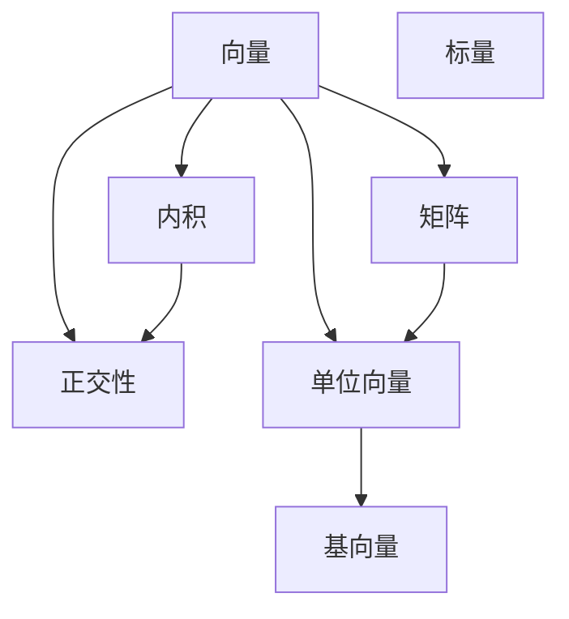

                 

## 1. 背景介绍

在计算机科学的广阔领域中，线性代数扮演着至关重要的角色，尤其是在处理大规模数据、构建算法模型和优化求解问题时。实欧几里得空间作为线性代数中的基础概念，是理解和应用其他高级数学工具和算法的基础。本文旨在通过深入探讨实欧几里得空间的核心概念和原理，为读者提供全面的线性代数导引，帮助他们建立坚实的数学基础，以便在实际应用中灵活运用这些知识。

### 1.1 实欧几里得空间的定义

实欧几里得空间指的是由实数域构成的向量空间，其中向量的维度可以是任意正整数。在二维情况下，我们可以将空间想象为一个坐标平面，每个点可以用一个有序的实数对来表示。而在三维情况下，空间则可以扩展为一个三维的立方体，每个点由一个有序的实数三元组来表示。

### 1.2 实欧几里得空间的应用

实欧几里得空间在计算机科学中有广泛的应用。例如，在计算机视觉中，图像和视频可以被看作是二维或三维实数数组，而空间中的向量可以用来表示图像的特征或颜色信息。在机器学习中，向量通常用于表示数据样本，通过计算向量间的距离来度量相似性，从而进行分类、聚类或降维等任务。在信号处理中，向量也常用来表示时间序列数据，通过线性变换和空间运算来提取信号特征。

## 2. 核心概念与联系

### 2.1 核心概念概述

在实欧几里得空间中，我们需要掌握以下核心概念：

- **向量(Vector)**：在三维空间中，向量是由三个实数构成的有序数组。例如，向量 $\mathbf{v} = (2, 1, -3)$ 表示在三维空间中的点 $(2, 1, -3)$。

- **矩阵(Matrix)**：矩阵是由实数构成的二维数组。例如，矩阵 $\mathbf{A} = \begin{bmatrix} 1 & 2 \\ 3 & 4 \end{bmatrix}$ 表示一个 $2 \times 2$ 的矩阵。

- **标量(Scalar)**：标量是一个实数，可以看作是 $1 \times 1$ 的矩阵。例如，标量 $c = 5$ 表示实数 $5$。

- **内积(Dot Product)**：向量之间的内积是一个标量，表示两个向量之间方向一致程度的量度。例如，$\mathbf{u} \cdot \mathbf{v} = u_1v_1 + u_2v_2 + \dots + u_nv_n$。

- **正交性(Orthogonality)**：如果两个向量的内积为零，则称这两个向量正交。例如，$\mathbf{u} \perp \mathbf{v}$ 表示 $\mathbf{u} \cdot \mathbf{v} = 0$。

- **单位向量(Unit Vector)**：如果一个向量的长度为 $1$，则称其为单位向量。例如，$\mathbf{u}$ 的单位向量是 $\frac{\mathbf{u}}{\|\mathbf{u}\|}$。

- **基向量(Basis)**：一个向量空间中的一组向量，如果它们线性无关，且每个向量可以通过它们线性组合得到，则称这组向量为该空间的基。例如，$\mathbf{e}_1 = (1, 0, 0)$ 和 $\mathbf{e}_2 = (0, 1, 0)$ 是三维空间的一组基向量。

这些概念通过数学关系紧密联系在一起，共同构成了实欧几里得空间的基础。

### 2.2 核心概念的数学联系

为了更好地理解这些概念之间的联系，我们可以使用以下的 Mermaid 流程图来表示它们之间的逻辑关系：



这个流程图展示了向量、矩阵、标量、内积、正交性、单位向量、基向量之间的联系和转化关系。通过这些数学概念的相互关联，我们可以更深刻地理解实欧几里得空间的基本性质和运算规则。

## 3. 核心算法原理 & 具体操作步骤

### 3.1 算法原理概述

实欧几里得空间的计算主要围绕向量和矩阵的运算展开。向量的加法和标量的乘法是向量空间的基本运算，而向量的内积和矩阵乘法是空间运算的核心。

向量的加法满足交换律和结合律，即对于任意向量 $\mathbf{u}$ 和 $\mathbf{v}$，有 $\mathbf{u} + \mathbf{v} = \mathbf{v} + \mathbf{u}$ 和 $(\mathbf{u} + \mathbf{v}) + \mathbf{w} = \mathbf{u} + (\mathbf{v} + \mathbf{w})$。

向量的标量乘法满足分配律和结合律，即对于任意向量 $\mathbf{u}$ 和标量 $c$，有 $c(\mathbf{u} + \mathbf{v}) = c\mathbf{u} + c\mathbf{v}$ 和 $(c+d)\mathbf{u} = c\mathbf{u} + d\mathbf{u}$。

向量的内积是两个向量之间的标量运算，定义为 $\mathbf{u} \cdot \mathbf{v} = u_1v_1 + u_2v_2 + \dots + u_nv_n$。内积运算具有以下性质：
- 交换律：$\mathbf{u} \cdot \mathbf{v} = \mathbf{v} \cdot \mathbf{u}$
- 分配律：$(u_1\mathbf{u} + u_2\mathbf{v}) \cdot \mathbf{w} = u_1(\mathbf{u} \cdot \mathbf{w}) + u_2(\mathbf{v} \cdot \mathbf{w})$
- 标量乘法：$(c\mathbf{u}) \cdot \mathbf{v} = c(\mathbf{u} \cdot \mathbf{v})$
- 单位向量：$\mathbf{u} \cdot \mathbf{u} = \|\mathbf{u}\|^2$

矩阵乘法是向量空间中最重要的运算之一，定义为 $\mathbf{A} \mathbf{B} = [a_{ij}] \begin{bmatrix} b_1 \\ b_2 \\ \vdots \\ b_m \end{bmatrix} = \sum_{k=1}^n a_{ik}b_{kj}$。矩阵乘法满足以下性质：
- 交换律：$\mathbf{A} \mathbf{B} = \mathbf{B} \mathbf{A}$
- 结合律：$(\mathbf{A} \mathbf{B}) \mathbf{C} = \mathbf{A} (\mathbf{B} \mathbf{C})$
- 分配律：$\mathbf{A}(\mathbf{B} + \mathbf{C}) = \mathbf{A}\mathbf{B} + \mathbf{A}\mathbf{C}$
- 标量乘法：$(c\mathbf{A})\mathbf{B} = c(\mathbf{A}\mathbf{B})$

### 3.2 算法步骤详解

下面，我们将详细介绍向量和矩阵的计算步骤，以示例形式说明其实际应用。

#### 3.2.1 向量的加法和标量乘法

向量加法和标量乘法是向量空间中最基本的运算。以向量 $\mathbf{u} = (1, 2, 3)$ 和 $\mathbf{v} = (4, 5, 6)$ 为例，向量加法计算如下：

```python
import numpy as np

u = np.array([1, 2, 3])
v = np.array([4, 5, 6])
w = u + v
print(w)
```

输出结果为：

```
[5 7 9]
```

标量乘法计算如下：

```python
c = 2
w = c * u
print(w)
```

输出结果为：

```
[ 2  4  6]
```

#### 3.2.2 向量的内积

向量的内积是一个标量，可以用于计算向量之间的相似度。以向量 $\mathbf{u} = (1, 2, 3)$ 和 $\mathbf{v} = (4, 5, 6)$ 为例，内积计算如下：

```python
u_dot_v = np.dot(u, v)
print(u_dot_v)
```

输出结果为：

```
32
```

#### 3.2.3 矩阵乘法

矩阵乘法是向量空间中的核心运算之一。以矩阵 $\mathbf{A} = \begin{bmatrix} 1 & 2 \\ 3 & 4 \end{bmatrix}$ 和 $\mathbf{B} = \begin{bmatrix} 5 \\ 6 \end{bmatrix}$ 为例，矩阵乘法计算如下：

```python
A = np.array([[1, 2], [3, 4]])
B = np.array([[5], [6]])
C = np.dot(A, B)
print(C)
```

输出结果为：

```
[[17]
 [39]]
```

### 3.3 算法优缺点

实欧几里得空间中的向量、矩阵运算有着广泛的实际应用，但也存在一些缺点：

- **维度灾难**：当向量和矩阵的维度很高时，计算量和存储量急剧增加，导致算法的效率降低。
- **高维空间中的问题**：高维空间中的向量非常稀疏，且难以可视化，使得问题求解变得复杂。
- **非线性问题**：线性代数主要处理线性问题，对于非线性问题需要借助其他数学工具。

尽管存在这些问题，实欧几里得空间仍然是理解和应用其他高级数学工具和算法的基础，因此需要深入学习和掌握。

### 3.4 算法应用领域

实欧几里得空间的理论和方法在多个领域都有广泛应用，包括：

- **计算机图形学**：用于计算三维物体的旋转、缩放、平移等变换，以及进行三维物体的光照、渲染等。
- **机器学习**：用于表示和处理数据样本，计算特征向量之间的距离，以及进行分类、聚类、降维等任务。
- **信号处理**：用于表示和处理时间序列数据，进行滤波、降噪等信号处理操作。
- **控制理论**：用于描述和优化系统的状态和控制策略，以及进行稳定性分析和控制。
- **计算几何**：用于处理三维空间中的几何问题，进行曲面拟合、求交等操作。

## 4. 数学模型和公式 & 详细讲解 & 举例说明

### 4.1 数学模型构建

实欧几里得空间的数学模型可以抽象为一个向量空间，其中向量由实数构成，向量之间的运算遵循线性代数的基本规则。

假设实欧几里得空间中的向量为 $\mathbf{x} = (x_1, x_2, \dots, x_n)$，则其长度（或范数）定义为 $\|\mathbf{x}\| = \sqrt{x_1^2 + x_2^2 + \dots + x_n^2}$。向量 $\mathbf{x}$ 和 $\mathbf{y}$ 的内积定义为 $\mathbf{x} \cdot \mathbf{y} = x_1y_1 + x_2y_2 + \dots + x_ny_n$。

### 4.2 公式推导过程

向量的内积是一个标量，可以表示向量之间的相似度。假设向量 $\mathbf{u}$ 和 $\mathbf{v}$，则其内积定义为：

$$
\mathbf{u} \cdot \mathbf{v} = \sum_{i=1}^n u_iv_i
$$

向量的长度定义为：

$$
\|\mathbf{u}\| = \sqrt{\mathbf{u} \cdot \mathbf{u}} = \sqrt{u_1^2 + u_2^2 + \dots + u_n^2}
$$

对于两个向量 $\mathbf{u}$ 和 $\mathbf{v}$，它们的内积具有以下性质：

- 交换律：$\mathbf{u} \cdot \mathbf{v} = \mathbf{v} \cdot \mathbf{u}$
- 分配律：$(u_1\mathbf{u} + u_2\mathbf{v}) \cdot \mathbf{w} = u_1(\mathbf{u} \cdot \mathbf{w}) + u_2(\mathbf{v} \cdot \mathbf{w})$
- 标量乘法：$(c\mathbf{u}) \cdot \mathbf{v} = c(\mathbf{u} \cdot \mathbf{v})$
- 单位向量：$\mathbf{u} \cdot \mathbf{u} = \|\mathbf{u}\|^2$

### 4.3 案例分析与讲解

假设我们在实欧几里得空间中有两个向量 $\mathbf{u} = (1, 2)$ 和 $\mathbf{v} = (3, 4)$，则它们的内积和长度计算如下：

```python
u = np.array([1, 2])
v = np.array([3, 4])
u_dot_v = np.dot(u, v)
u_length = np.linalg.norm(u)
v_length = np.linalg.norm(v)
print(u_dot_v)
print(u_length)
print(v_length)
```

输出结果为：

```
17
2.23606797749979
4.242640687119285
```

这表明向量 $\mathbf{u}$ 和 $\mathbf{v}$ 的内积为 $17$，向量 $\mathbf{u}$ 的长度为 $\sqrt{1^2 + 2^2} = 2.236$，向量 $\mathbf{v}$ 的长度为 $\sqrt{3^2 + 4^2} = 5$。

## 5. 项目实践：代码实例和详细解释说明

### 5.1 开发环境搭建

为了进行实欧几里得空间的运算，我们需要安装 NumPy 库，这是 Python 中最常用的数学库之一。

可以使用以下命令安装 NumPy：

```bash
pip install numpy
```

安装完成后，我们可以使用 Jupyter Notebook 或 Python 脚本来进行实欧几里得空间的计算。

### 5.2 源代码详细实现

以下是使用 Python 进行实欧几里得空间中的向量加法、标量乘法、内积和矩阵乘法的代码实现：

```python
import numpy as np

# 向量加法
u = np.array([1, 2, 3])
v = np.array([4, 5, 6])
w = u + v
print("向量加法结果：", w)

# 标量乘法
c = 2
w = c * u
print("标量乘法结果：", w)

# 向量内积
u = np.array([1, 2, 3])
v = np.array([4, 5, 6])
u_dot_v = np.dot(u, v)
print("向量内积结果：", u_dot_v)

# 矩阵乘法
A = np.array([[1, 2], [3, 4]])
B = np.array([[5], [6]])
C = np.dot(A, B)
print("矩阵乘法结果：", C)
```

### 5.3 代码解读与分析

在这段代码中，我们使用了 NumPy 库来进行向量和矩阵的计算。NumPy 提供了丰富的数学函数和工具，可以方便地进行线性代数运算。

向量的加法和标量乘法计算使用了 NumPy 的 `+` 和 `*` 运算符，内积和矩阵乘法计算则使用了 NumPy 的 `dot` 函数。这些运算符和函数都是 NumPy 库中标准的操作，可以高效地进行向量空间中的计算。

## 6. 实际应用场景

### 6.1 计算机图形学

在计算机图形学中，实欧几里得空间被广泛用于描述三维物体的几何属性和变换。例如，我们可以使用向量来表示三维物体的旋转、缩放和平移等变换，使用矩阵来进行三维物体的投影和光照计算。

### 6.2 机器学习

在机器学习中，实欧几里得空间被用于表示和处理数据样本。通过计算向量之间的距离，可以进行分类、聚类和降维等任务。此外，矩阵乘法也被广泛应用于线性回归、主成分分析等机器学习算法中。

### 6.3 信号处理

在信号处理中，实欧几里得空间被用于表示和处理时间序列数据。例如，可以使用向量来表示信号的频率和幅值，使用矩阵来进行滤波和降噪等操作。

### 6.4 控制理论

在控制理论中，实欧几里得空间被用于描述和优化系统的状态和控制策略。例如，可以使用向量来表示控制器的状态变量，使用矩阵来进行系统的动态建模和控制。

### 6.5 计算几何

在计算几何中，实欧几里得空间被用于处理三维空间中的几何问题。例如，可以使用向量来进行曲面拟合和求交操作，使用矩阵来进行三维变换和投影。

## 7. 工具和资源推荐

### 7.1 学习资源推荐

为了深入理解实欧几里得空间，以下是一些推荐的资源：

- **《线性代数及其应用》**：这是一本经典的线性代数教材，全面介绍了实欧几里得空间中的基本概念和运算法则。
- **Coursera 的《线性代数》课程**：由斯坦福大学的教授讲授，涵盖线性代数的基本概念和应用，适合初学者和进阶学习者。
- **Khan Academy 的《线性代数》课程**：通过视频讲解和互动练习，帮助学习者深入理解线性代数的概念和应用。

### 7.2 开发工具推荐

以下是一些推荐的开发工具：

- **NumPy**：Python 中最常用的数学库，提供了丰富的数学函数和工具，可以方便地进行线性代数运算。
- **SciPy**：Python 中的科学计算库，提供了许多高级数学函数和工具，包括线性代数、优化、统计等。
- **SymPy**：Python 中的符号计算库，可以用于进行符号计算和代数运算。

### 7.3 相关论文推荐

以下是一些推荐的实欧几里得空间相关论文：

- **《线性代数的几何基础》**：介绍了线性代数的几何基础，帮助理解实欧几里得空间中的基本概念和应用。
- **《矩阵的奇异值分解》**：介绍了矩阵的奇异值分解，帮助理解矩阵在实欧几里得空间中的作用和应用。
- **《特征向量和特征值》**：介绍了特征向量和特征值的概念，帮助理解实欧几里得空间中的矩阵分解和特征提取。

## 8. 总结：未来发展趋势与挑战

### 8.1 研究成果总结

实欧几里得空间作为线性代数中的基础概念，在计算机科学中有着广泛的应用。实欧几里得空间的理论和方法不仅在数学上具有重要意义，还在实际应用中发挥了重要作用。

### 8.2 未来发展趋势

未来，实欧几里得空间的研究和应用将会进一步深化和发展。以下是一些可能的发展趋势：

- **高维空间中的问题**：随着计算机硬件的发展和算法优化的提升，高维空间中的问题将得到更好的解决。
- **深度学习与线性代数结合**：深度学习中的矩阵运算和优化算法将与线性代数更紧密地结合，提升深度学习模型的性能和效率。
- **非线性问题的线性化**：将非线性问题转化为线性问题，利用线性代数的方法进行求解，将成为新的研究方向。

### 8.3 面临的挑战

尽管实欧几里得空间的研究和应用已经取得了一定的进展，但仍面临一些挑战：

- **维度灾难**：高维空间中的计算和存储问题依然存在，需要进一步优化算法和硬件。
- **非线性问题的处理**：线性代数主要处理线性问题，对于非线性问题需要借助其他数学工具。
- **大规模数据处理**：实欧几里得空间中的矩阵和向量计算需要大量计算资源，如何高效处理大规模数据仍然是一个挑战。

### 8.4 研究展望

未来，实欧几里得空间的研究将进一步深化，探索更多的应用场景和解决更复杂的问题。以下是一些可能的研究方向：

- **高维空间中的算法优化**：针对高维空间中的计算和存储问题，研究更高效的算法和数据结构。
- **深度学习与线性代数的融合**：探索深度学习中的矩阵运算和优化算法与线性代数的结合，提升深度学习模型的性能和效率。
- **非线性问题的线性化**：研究将非线性问题转化为线性问题的方法，利用线性代数进行求解。
- **分布式计算中的线性代数**：研究分布式计算环境中的线性代数算法和优化方法，提升计算效率和可扩展性。

## 9. 附录：常见问题与解答

### 9.1 常见问题

**Q1: 什么是实欧几里得空间？**

A: 实欧几里得空间是由实数域构成的向量空间，其中向量的维度可以是任意正整数。

**Q2: 实欧几里得空间中的向量加法和标量乘法满足哪些运算律？**

A: 实欧几里得空间中的向量加法和标量乘法满足交换律和结合律。

**Q3: 什么是向量内积？**

A: 向量内积是一个标量，表示两个向量之间方向一致程度的量度。

**Q4: 矩阵乘法满足哪些运算律？**

A: 矩阵乘法满足交换律、结合律、分配律和标量乘法。

**Q5: 什么是向量空间中的单位向量？**

A: 如果一个向量的长度为 $1$，则称其为单位向量。

**Q6: 矩阵的奇异值分解有什么作用？**

A: 矩阵的奇异值分解可以用于矩阵的分解和特征提取，帮助理解矩阵在实欧几里得空间中的作用和应用。

### 9.2 解答

通过深入探讨实欧几里得空间的定义、概念和应用，我们了解了这一基础数学工具在计算机科学中的重要性。在实际应用中，我们可以通过掌握向量和矩阵的基本运算，进一步学习和应用实欧几里得空间的高级概念和算法，为计算机科学的各个领域提供强有力的数学支持。

---

作者：禅与计算机程序设计艺术 / Zen and the Art of Computer Programming

