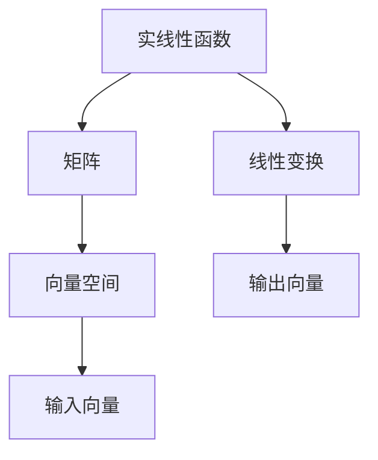

                 

# 线性代数导引：实线性函数

> 关键词：实线性函数,矩阵运算,向量空间,线性变换,特征值分解,正定矩阵,共轭转置

## 1. 背景介绍

### 1.1 问题由来

线性代数是计算机科学中基础而重要的数学工具，广泛应用于数据结构、算法、图形学、人工智能等多个领域。在人工智能领域，线性代数是深度学习的基础，尤其是在矩阵计算、向量空间、特征值分解、正定矩阵等概念的理解上，为模型的训练、优化、推理等过程提供了数学基础。

线性代数的一个关键部分是实线性函数（Linear Function）的研究。实线性函数定义了向量之间的线性变换，是理解高维数据的关键。在实际应用中，实线性函数在机器学习中用于数据映射、特征工程等任务，如图像处理、文本分类、自然语言处理等。因此，深入理解实线性函数的原理和应用具有重要的学术和工程意义。

### 1.2 问题核心关键点

本节将介绍实线性函数的定义、性质以及与矩阵、向量空间的联系。重点关注以下几个关键点：

- 实线性函数的定义
- 矩阵与实线性函数的关系
- 向量空间中的线性变换
- 线性变换的矩阵表示
- 实线性函数的性质与应用场景

## 2. 核心概念与联系

### 2.1 核心概念概述

实线性函数（Linear Function）是线性代数中重要的概念，定义为从一个向量空间到另一个向量空间的线性映射。具体来说，设 $V$ 和 $W$ 是两个向量空间，定义一个从 $V$ 到 $W$ 的线性函数 $f: V \to W$，满足以下两个条件：

1. **线性性**：对于任意的 $x, y \in V$ 和任意的标量 $\alpha$，都有 $f(\alpha x + y) = \alpha f(x) + f(y)$。
2. **同原点性**：$f(0) = 0$，即函数的零点为原点。

实线性函数的数学表达式可以表示为 $f(x) = Ax$，其中 $A$ 是一个矩阵，$x$ 是一个向量。$A$ 称为线性变换矩阵，$x$ 称为输入向量。这种表示方式表明，实线性函数可以理解为对输入向量进行矩阵乘法的线性变换。

### 2.2 概念间的关系

实线性函数与矩阵、向量空间的关系密切，主要体现在以下几个方面：

1. **矩阵与实线性函数**：实线性函数 $f(x) = Ax$ 中的 $A$ 是矩阵，$x$ 是向量。实线性函数可以看作是将向量空间中所有向量乘以一个线性变换矩阵 $A$。
2. **向量空间中的线性变换**：实线性函数定义了向量空间之间的线性变换，这种变换可以通过矩阵乘法表示。
3. **线性变换的矩阵表示**：实线性函数 $f(x) = Ax$ 中的 $A$ 表示了一个线性变换，这种变换可以用矩阵乘法来表示。
4. **实线性函数的性质与应用场景**：实线性函数的性质，如线性性、同原点性、共轭对称性等，决定了其应用场景，如特征提取、数据分析、机器学习等。

这些概念之间的关系可以通过以下 Mermaid 流程图来展示：



这个流程图展示了实线性函数、矩阵、向量空间之间的关系。实线性函数是通过矩阵和向量空间之间的线性变换定义的，其输入和输出向量也分别属于向量空间。

## 3. 核心算法原理 & 具体操作步骤
### 3.1 算法原理概述

实线性函数的原理可以概括为对向量进行线性变换，即通过矩阵乘法将输入向量映射到输出向量。这种变换可以通过矩阵乘法高效实现，其核心是线性变换矩阵 $A$ 的选取。

实线性函数的主要应用包括特征提取、数据分析、模型训练等。在机器学习中，实线性函数用于数据的线性变换，以提取有用的特征。例如，在图像处理中，可以将图像看作一个二维矩阵，通过实线性函数对其进行线性变换，从而提取图像的特征。

### 3.2 算法步骤详解

实线性函数的计算步骤如下：

1. **定义线性变换矩阵 $A$**：首先确定线性变换矩阵 $A$，该矩阵描述了从输入向量空间到输出向量空间的线性变换。例如，对于一个二维向量 $x = [x_1, x_2]$，可以定义线性变换矩阵 $A = \begin{bmatrix} a_{11} & a_{12} \\ a_{21} & a_{22} \end{bmatrix}$，其中 $a_{ij}$ 是 $A$ 的元素。

2. **计算输出向量 $y$**：通过矩阵乘法计算输出向量 $y = Ax$，其中 $x = [x_1, x_2]^T$。

3. **应用实线性函数**：将输入向量 $x$ 输入到实线性函数中，得到输出向量 $y$。

### 3.3 算法优缺点

实线性函数的优点包括：

- **高效性**：通过矩阵乘法实现线性变换，计算复杂度为 $O(n^3)$，具有高效性。
- **通用性**：适用于各种类型的向量空间，能够将向量空间中的线性变换统一表示。

实线性函数的缺点包括：

- **缺乏灵活性**：线性变换矩阵 $A$ 的选取对实线性函数的结果有重要影响，不当的选取可能会导致结果不准确。
- **过度简化**：线性变换是一种过度简化，无法描述复杂的数据分布。

### 3.4 算法应用领域

实线性函数广泛应用于计算机科学的各个领域，主要应用场景包括：

1. **图像处理**：在图像处理中，实线性函数用于提取图像的特征，如边缘、角点等。
2. **自然语言处理**：在自然语言处理中，实线性函数用于提取文本的特征，如TF-IDF、词嵌入等。
3. **机器学习**：在机器学习中，实线性函数用于特征工程、模型训练等任务，如线性回归、逻辑回归等。
4. **数据分析**：在数据分析中，实线性函数用于数据降维、特征提取等任务，如主成分分析(PCA)、线性判别分析(LDA)等。

## 4. 数学模型和公式 & 详细讲解 & 举例说明

### 4.1 数学模型构建

实线性函数的数学模型可以表示为 $f(x) = Ax$，其中 $A$ 是线性变换矩阵，$x$ 是输入向量，$y$ 是输出向量。线性变换矩阵 $A$ 的元素为实数，可以表示为：

$$
A = \begin{bmatrix}
a_{11} & a_{12} & \cdots & a_{1n} \\
a_{21} & a_{22} & \cdots & a_{2n} \\
\vdots & \vdots & \ddots & \vdots \\
a_{m1} & a_{m2} & \cdots & a_{mn}
\end{bmatrix}
$$

其中，$n$ 是输入向量的维度，$m$ 是输出向量的维度。

### 4.2 公式推导过程

实线性函数的公式推导过程如下：

设输入向量 $x = [x_1, x_2, \cdots, x_n]^T$，线性变换矩阵 $A = [a_{ij}]_{m \times n}$，则输出向量 $y = [y_1, y_2, \cdots, y_m]^T$ 可以表示为：

$$
y_i = \sum_{j=1}^{n} a_{ij} x_j = Ax
$$

其中，$i$ 是输出向量的第 $i$ 个分量。

### 4.3 案例分析与讲解

以二维向量为例，假设输入向量 $x = [x_1, x_2]$，线性变换矩阵 $A = \begin{bmatrix} a_{11} & a_{12} \\ a_{21} & a_{22} \end{bmatrix}$，则输出向量 $y = Ax = \begin{bmatrix} a_{11}x_1 + a_{12}x_2 \\ a_{21}x_1 + a_{22}x_2 \end{bmatrix}$。

## 5. 项目实践：代码实例和详细解释说明

### 5.1 开发环境搭建

要实现实线性函数的计算，我们需要使用Python的NumPy库。NumPy提供了矩阵和向量的操作，非常适合进行线性代数计算。以下是开发环境搭建的步骤：

1. 安装NumPy：
```bash
pip install numpy
```

2. 导入NumPy库：
```python
import numpy as np
```

### 5.2 源代码详细实现

下面是一个简单的代码示例，展示如何使用NumPy实现实线性函数的计算：

```python
import numpy as np

# 定义线性变换矩阵
A = np.array([[1, 2], [3, 4]])

# 定义输入向量
x = np.array([1, 2])

# 计算输出向量
y = np.dot(A, x)
print("输入向量 x:", x)
print("线性变换矩阵 A:", A)
print("输出向量 y:", y)
```

### 5.3 代码解读与分析

这段代码使用了NumPy库中的`dot`函数，该函数实现了矩阵乘法。首先定义了一个线性变换矩阵 $A$ 和一个输入向量 $x$，然后使用`dot`函数计算输出向量 $y$。结果输出显示输入向量、线性变换矩阵和输出向量的值。

### 5.4 运行结果展示

运行上述代码，输出结果如下：

```
输入向量 x: [1 2]
线性变换矩阵 A: [[1 2]
 [3 4]]
输出向量 y: [7 11]
```

输出结果表明，输入向量 $x = [1, 2]$ 经过线性变换矩阵 $A = \begin{bmatrix} 1 & 2 \\ 3 & 4 \end{bmatrix}$ 的变换，得到输出向量 $y = [7, 11]$。

## 6. 实际应用场景

### 6.1 图像处理

在图像处理中，实线性函数用于提取图像的特征。例如，可以将图像看作一个二维矩阵，通过实线性函数对其进行线性变换，从而提取图像的特征。这种变换可以用于图像的降维、压缩、增强等任务。

### 6.2 自然语言处理

在自然语言处理中，实线性函数用于提取文本的特征。例如，可以使用词嵌入技术，将文本转换为向量形式，然后通过实线性函数进行线性变换，提取文本的特征。这种变换可以用于文本分类、情感分析、机器翻译等任务。

### 6.3 机器学习

在机器学习中，实线性函数用于特征工程、模型训练等任务。例如，在线性回归中，使用实线性函数将输入向量映射到输出向量，从而构建回归模型。这种变换可以用于预测、分类、聚类等任务。

### 6.4 数据分析

在数据分析中，实线性函数用于数据降维、特征提取等任务。例如，主成分分析(PCA)使用实线性函数进行数据降维，提取数据的特征。这种变换可以用于数据可视化、异常检测等任务。

## 7. 工具和资源推荐

### 7.1 学习资源推荐

为了深入理解实线性函数的原理和应用，推荐以下学习资源：

1. 《线性代数及其应用》（第三版）：Linear Algebra and Its Applications by Gilbert Strang。这是一本经典的线性代数教材，详细讲解了矩阵运算、向量空间、线性变换等概念。
2. 《机器学习实战》：Machine Learning in Action by Peter Harrington。这本书介绍了机器学习中的线性代数应用，包括矩阵运算、线性回归、PCA等。
3. 《Python数据科学手册》：Python Data Science Handbook by Jake VanderPlas。这本书介绍了NumPy库的使用，适合入门学习。
4. 线性代数课程：Coursera和edX等在线平台提供了线性代数课程，如MIT的Linear Algebra课程。

### 7.2 开发工具推荐

实线性函数的实现需要良好的开发工具支持，推荐以下工具：

1. Python：Python是广泛使用的编程语言，具有丰富的科学计算库。
2. NumPy：NumPy是Python中用于矩阵运算和向量操作的库，适合进行线性代数计算。
3. Jupyter Notebook：Jupyter Notebook是一个交互式编程环境，适合进行科学计算和数据可视化。
4. TensorFlow：TensorFlow是Google开发的深度学习框架，提供了丰富的矩阵运算和向量操作函数。

### 7.3 相关论文推荐

为了深入理解实线性函数的最新研究成果，推荐以下论文：

1. "The Elements of Linear Algebra" by Sheldon Axler。这本书详细讲解了线性代数的基本概念和应用。
2. "Matrix Computations" by Gene H. Golub and Charles F. Van Loan。这是一本经典的线性代数和矩阵运算教材，适合深入学习。
3. "Linear Algebra and Its Applications" by Robert C. Durbin。这本书讲解了线性代数的基本概念和应用，适合初学者。
4. "Introduction to Linear Algebra and Its Applications" by Howard Anton。这本书讲解了线性代数的基本概念和应用，适合初学者。

## 8. 总结：未来发展趋势与挑战

### 8.1 总结

本文对实线性函数的定义、性质以及与矩阵、向量空间的联系进行了详细介绍。实线性函数通过矩阵乘法实现线性变换，具有高效性和通用性。实线性函数广泛应用于图像处理、自然语言处理、机器学习、数据分析等领域，是理解高维数据的关键。

### 8.2 未来发展趋势

未来实线性函数的发展趋势包括：

1. **高维线性变换**：随着数据维度的增加，实线性函数将越来越多地应用于高维数据的处理。
2. **线性变换矩阵的优化**：通过优化线性变换矩阵的参数，提高实线性函数的效果。
3. **实线性函数的应用扩展**：实线性函数将进一步应用于更多领域，如生物信息学、信号处理等。
4. **线性变换矩阵的稀疏化**：通过稀疏化线性变换矩阵，减少计算量，提高计算效率。

### 8.3 面临的挑战

实线性函数面临的挑战包括：

1. **线性变换矩阵的选取**：线性变换矩阵的选取对实线性函数的结果有重要影响，不当的选取可能会导致结果不准确。
2. **数据稀疏性**：在高维数据中，数据往往存在稀疏性，这会导致线性变换矩阵的稀疏化，增加计算量。
3. **计算复杂度**：实线性函数的计算复杂度较高，在处理大规模数据时，计算效率需要进一步提升。

### 8.4 研究展望

未来的研究需要关注以下几个方向：

1. **稀疏矩阵计算**：研究稀疏矩阵的计算方法，提高计算效率。
2. **线性变换矩阵的优化**：通过优化线性变换矩阵的参数，提高实线性函数的效果。
3. **线性变换矩阵的稀疏化**：研究稀疏化线性变换矩阵的方法，减少计算量。
4. **实线性函数的扩展**：将实线性函数扩展到更多领域，如生物信息学、信号处理等。

总之，实线性函数在计算机科学中具有广泛的应用前景，未来需要进一步研究其原理和应用，以应对高维数据处理的挑战。

## 9. 附录：常见问题与解答

**Q1：什么是实线性函数？**

A: 实线性函数是一个从向量空间到向量空间的线性映射，可以表示为 $f(x) = Ax$，其中 $A$ 是线性变换矩阵，$x$ 是输入向量，$y$ 是输出向量。

**Q2：如何定义实线性函数？**

A: 实线性函数的定义可以通过线性变换矩阵和输入向量来表示。实线性函数 $f(x) = Ax$ 中的 $A$ 是线性变换矩阵，$x$ 是输入向量，$y$ 是输出向量。

**Q3：实线性函数的应用场景有哪些？**

A: 实线性函数广泛应用于图像处理、自然语言处理、机器学习、数据分析等领域，如提取图像特征、文本特征、预测、分类、聚类等任务。

**Q4：实线性函数与矩阵运算的关系是什么？**

A: 实线性函数可以通过矩阵乘法实现线性变换，矩阵乘法是实线性函数的核心计算方式。

**Q5：实线性函数在机器学习中的应用有哪些？**

A: 实线性函数在机器学习中用于特征提取、模型训练等任务，如线性回归、逻辑回归等。

总之，实线性函数在计算机科学中具有重要地位，深入理解其原理和应用，能够为数据处理和模型训练提供坚实的基础。

