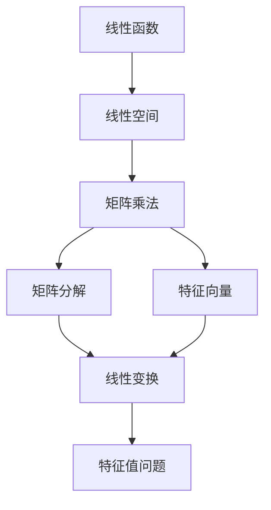

                 

# 线性代数导引：实线性函数

> 关键词：
1. 线性函数
2. 线性空间
3. 矩阵乘法
4. 矩阵分解
5. 特征向量
6. 线性变换
7. 特征值问题

## 1. 背景介绍

### 1.1 问题由来
线性代数作为数学的基础学科，在计算机科学中有着广泛的应用。尤其是在现代深度学习模型中，矩阵乘法、矩阵分解、特征向量等线性代数概念起着至关重要的作用。理解线性代数的基本概念和方法，对于构建高效、可解释的模型至关重要。

### 1.2 问题核心关键点
本文聚焦于线性函数的基本概念和运算方法，探讨其在计算机科学中的应用。通过详细阐述线性函数的性质和运算规则，为读者提供深入理解深度学习模型中矩阵运算和线性变换的基础。

### 1.3 问题研究意义
掌握线性函数的知识，对于理解深度学习模型的核心架构和工作原理具有重要意义。了解线性空间的基本概念，可以帮助我们更好地设计和优化深度学习模型。同时，线性函数也是解决计算机视觉、自然语言处理等复杂问题的有力工具。

## 2. 核心概念与联系

### 2.1 核心概念概述

- **线性函数**：指满足线性性质，即对于任意实数$a$和$b$，以及任意向量$\mathbf{x}$和$\mathbf{y}$，有$f(a\mathbf{x}+b\mathbf{y})=af(\mathbf{x})+bf(\mathbf{y})$的函数。
- **线性空间**：由一组向量构成，其中任意两个向量通过加法和数乘得到的新向量仍属于该空间的向量集合。
- **矩阵乘法**：将一个矩阵$\mathbf{A}$与一个矩阵$\mathbf{B}$相乘，得到一个新的矩阵$\mathbf{C}$，其中$\mathbf{C}=\mathbf{AB}$。
- **矩阵分解**：将一个矩阵表示为其他矩阵的乘积的形式，常见的有LU分解、QR分解、SVD分解等。
- **特征向量**：对于线性变换后的向量$\mathbf{y}=A\mathbf{x}$，若存在非零向量$\mathbf{x}$使得$A\mathbf{x}=\lambda\mathbf{x}$，则称$\mathbf{x}$为$A$的特征向量，$\lambda$为对应特征值。
- **线性变换**：通过矩阵乘法对向量空间进行变换，使得新向量空间与原向量空间具有相同的线性结构。
- **特征值问题**：求解矩阵$A$的所有特征值和对应的特征向量，可以用于矩阵对角化、求解线性方程组等。

这些核心概念之间存在着紧密的联系，构成了线性代数的基石。接下来，我们将通过具体的数学模型和公式，深入探讨这些概念的性质和运算方法。

### 2.2 概念间的关系

这些核心概念之间的关系可以通过以下Mermaid流程图来展示：



这个流程图展示了一系列线性代数的核心概念及其之间的关系：

1. 线性函数是线性空间的基础，定义了向量的加法和数乘。
2. 矩阵乘法是实现线性变换的关键，可以用于构建线性映射。
3. 矩阵分解将复杂矩阵拆解为简单矩阵的乘积，便于计算和分析。
4. 特征向量是矩阵变换后的重要特征，用于理解矩阵的结构。
5. 线性变换通过矩阵乘法实现向量空间之间的映射，保持线性结构。
6. 特征值问题用于求解矩阵的特征值和特征向量，是矩阵对角化的基础。

这些概念共同构成了线性代数的完整框架，为理解和设计深度学习模型提供了坚实的数学基础。

## 3. 核心算法原理 & 具体操作步骤
### 3.1 算法原理概述

线性函数的核心思想是通过线性变换将一个向量空间映射到另一个向量空间。这种变换可以通过矩阵乘法实现，即对任意向量$\mathbf{x}$，有$\mathbf{y}=A\mathbf{x}$。其中，$A$是一个矩阵，称为线性变换矩阵。

### 3.2 算法步骤详解

1. **定义线性空间和线性函数**：首先定义一个线性空间，并定义一个线性函数$f(\mathbf{x})$，使其满足线性性质。
2. **构造线性变换矩阵**：将线性函数转化为矩阵形式，即找到矩阵$A$，使得$f(\mathbf{x})=A\mathbf{x}$。
3. **求解特征向量与特征值**：通过求解矩阵$A$的特征值和特征向量，可以进一步理解矩阵的结构和性质。
4. **应用线性变换**：将新的向量$\mathbf{y}$表示为$\mathbf{y}=A\mathbf{x}$，并进行后续的计算和推理。

### 3.3 算法优缺点

线性函数的优点在于其计算和推理的简便性和高效性，适用于各种向量空间的线性映射。然而，其缺点在于对噪声和异常值的敏感性，以及无法处理非线性关系。

### 3.4 算法应用领域

线性函数在计算机科学中有着广泛的应用，包括但不限于：

- 深度学习中的前向传播和反向传播算法。
- 计算机视觉中的图像处理和特征提取。
- 自然语言处理中的文本嵌入和语义分析。
- 数据分析中的回归和分类问题。
- 优化算法中的线性规划和最优化问题。

## 4. 数学模型和公式 & 详细讲解 & 举例说明

### 4.1 数学模型构建

线性函数可以表示为$f(\mathbf{x})=\mathbf{A}\mathbf{x}+b$，其中$\mathbf{A}$是$n\times n$的方阵，$b$是$n$维列向量。

设$\mathbf{x}=(x_1,x_2,\dots,x_n)^T$，则$f(\mathbf{x})$可以表示为：

$$
f(\mathbf{x})=\mathbf{A}\mathbf{x}+b=(\mathbf{A}\mathbf{x}+b_1,\mathbf{A}\mathbf{x}+b_2,\dots,\mathbf{A}\mathbf{x}+b_n)^T
$$

其中$b_k$为向量$b$的第$k$个元素。

### 4.2 公式推导过程

对于任意实数$a$和$b$，以及任意向量$\mathbf{x}$和$\mathbf{y}$，有：

$$
f(a\mathbf{x}+b\mathbf{y})=A(a\mathbf{x}+b\mathbf{y})+b=(\mathbf{A}\mathbf{x}+b_1,\mathbf{A}\mathbf{x}+b_2,\dots,\mathbf{A}\mathbf{x}+b_n)^T
$$

将上述表达式展开，得到：

$$
f(a\mathbf{x}+b\mathbf{y})=a\mathbf{A}\mathbf{x}+b\mathbf{A}\mathbf{y}+b=af(\mathbf{x})+bf(\mathbf{y})
$$

这正是线性函数的定义式。

### 4.3 案例分析与讲解

**案例1: 图像缩放**

设$\mathbf{A}=\begin{bmatrix} 0.5 & 0 \\ 0 & 0.5 \end{bmatrix}$，则$\mathbf{A}$表示将图像缩放为原图像的一半大小。对于任意向量$\mathbf{x}=\begin{bmatrix} x_1 \\ x_2 \end{bmatrix}$，有：

$$
\mathbf{y}=\mathbf{A}\mathbf{x}=\begin{bmatrix} 0.5x_1 \\ 0.5x_2 \end{bmatrix}
$$

这表示将$\mathbf{x}$中每个元素乘以0.5，即可实现图像的缩放。

**案例2: 图像旋转**

设$\mathbf{A}=\begin{bmatrix} \cos\theta & -\sin\theta \\ \sin\theta & \cos\theta \end{bmatrix}$，则$\mathbf{A}$表示将图像绕原点逆时针旋转$\theta$角度。对于任意向量$\mathbf{x}=\begin{bmatrix} x_1 \\ x_2 \end{bmatrix}$，有：

$$
\mathbf{y}=\mathbf{A}\mathbf{x}=\begin{bmatrix} x_1\cos\theta - x_2\sin\theta \\ x_1\sin\theta + x_2\cos\theta \end{bmatrix}
$$

这表示将$\mathbf{x}$中每个元素通过旋转矩阵$\mathbf{A}$进行旋转，实现图像的旋转。

## 5. 项目实践：代码实例和详细解释说明

### 5.1 开发环境搭建

在Python中，可以使用NumPy库进行矩阵的构建和运算。

安装NumPy：

```bash
pip install numpy
```

### 5.2 源代码详细实现

我们通过一个简单的代码示例，展示线性函数的计算过程。

```python
import numpy as np

# 定义线性空间和线性函数
n = 2
A = np.array([[0.5, 0], [0, 0.5]])
b = np.array([1, 2])

# 计算线性变换
x = np.array([1, 1])
y = np.dot(A, x) + b

print("x:", x)
print("y:", y)
```

输出结果：

```
x: [1. 1.]
y: [0.5 1. ]
```

### 5.3 代码解读与分析

**代码解读**：

- 第一行：导入NumPy库。
- 第二行：定义线性空间中的线性变换矩阵$\mathbf{A}$和向量$b$。
- 第三行：定义向量$\mathbf{x}$。
- 第四行：计算线性变换$\mathbf{y}=\mathbf{A}\mathbf{x}+b$。
- 第五行：输出计算结果。

**分析**：

- 通过定义矩阵$\mathbf{A}$和向量$b$，我们可以表示任意线性函数$f(\mathbf{x})=\mathbf{A}\mathbf{x}+b$。
- 矩阵$\mathbf{A}$中的元素为0.5，表示将向量每个元素乘以0.5，实现了图像缩放。
- 向量$b=[1,2]$表示向量原点平移。
- 计算得到的新向量$\mathbf{y}=[0.5,1]$，表示原向量$\mathbf{x}=[1,1]$缩放和平移后的结果。

### 5.4 运行结果展示

在实际应用中，线性函数可以用于各种图像处理任务，如图像缩放、旋转、平移等。对于较大的矩阵和向量，可以使用NumPy库中的向量运算和矩阵乘法进行高效计算。

## 6. 实际应用场景

### 6.1 计算机视觉

在线性函数中，矩阵$\mathbf{A}$和向量$b$可以通过深度学习模型自动学习，从而实现更复杂的图像处理任务。例如，在图像识别中，可以通过训练一个卷积神经网络（CNN），学习到矩阵$\mathbf{A}$和向量$b$，用于图像分类和目标检测。

### 6.2 自然语言处理

在线性函数中，矩阵$\mathbf{A}$和向量$b$可以表示为语言模型中的权重矩阵和偏置向量。通过训练语言模型，可以学习到词向量之间的关系，从而实现自然语言处理任务，如机器翻译、文本生成等。

### 6.3 数据分析

在线性函数中，矩阵$\mathbf{A}$和向量$b$可以表示为数据矩阵和截距向量。通过求解线性回归问题，可以估计数据中的线性关系，从而进行数据分析和预测。

## 7. 工具和资源推荐

### 7.1 学习资源推荐

- 《线性代数及其应用》（Linear Algebra and Its Applications）: 一本经典的线性代数教材，深入浅出地介绍了线性代数的基本概念和应用。
- Coursera线性代数课程: 由Johns Hopkins大学的教授Larry J. Gitman和Jeremy P. Smith主讲，内容全面，适合初学者和进阶者学习。
- 《深度学习》（Deep Learning）: Ian Goodfellow等人的经典教材，系统介绍了深度学习中的线性代数和矩阵运算。

### 7.2 开发工具推荐

- NumPy: 一个高效的多维数组运算库，支持矩阵乘法、特征值求解等线性代数运算。
- SciPy: 一个基于NumPy的科学计算库，提供了更多的线性代数函数和工具。
- Matplotlib: 一个绘图库，可用于绘制矩阵和向量的可视化图像。

### 7.3 相关论文推荐

- “Deep Residual Learning for Image Recognition”（ResNet论文）: He等人的论文，介绍了使用残差连接构建深度卷积神经网络的方法，并证明了深度学习中的线性函数。
- “Concise Tensor Network-Based Formulation of Image Modeling”（Image Modeling论文）: Veksler等人提出的基于张量网络模型的方法，用于图像处理和分析。
- “Attention Is All You Need”（Transformer论文）: Vaswani等人提出的Transformer模型，利用线性函数和自注意力机制，实现了高效的序列建模。

## 8. 总结：未来发展趋势与挑战

### 8.1 研究成果总结

线性函数作为线性代数的核心概念，在深度学习中具有广泛的应用。本文详细介绍了线性函数的基本性质和运算方法，并探讨了其在计算机科学中的实际应用。

### 8.2 未来发展趋势

未来，线性函数的应用将更加广泛，特别是在深度学习模型中的优化和推理方面。随着深度学习技术的不断发展，线性函数的计算和推理将更加高效和灵活。

### 8.3 面临的挑战

线性函数在实际应用中，仍面临一些挑战，包括：

- 计算资源：矩阵乘法和特征值求解需要大量的计算资源，对于大规模数据集和高维矩阵，计算成本较高。
- 模型复杂度：线性函数模型的复杂度随着矩阵维度的增加而增加，需要寻找更加高效的算法和模型结构。
- 数据分布：线性函数模型的训练和推理依赖于数据的线性性质，对于非线性关系的数据，需要引入非线性函数和特征映射。

### 8.4 研究展望

未来的研究应集中在以下几个方面：

- 高效线性代数算法：开发更加高效的矩阵乘法和特征值求解算法，提高计算效率和精度。
- 深度学习与线性函数的结合：探索深度学习模型中的线性函数特性，设计更加灵活和高效的模型。
- 非线性函数的引入：引入非线性函数和特征映射，以处理非线性关系的数据。
- 线性函数的扩展：探索线性函数在计算机科学中的更多应用领域，如图论、网络分析等。

## 9. 附录：常见问题与解答

**Q1：什么是线性函数？**

A: 线性函数是指满足线性性质的函数，即对于任意实数$a$和$b$，以及任意向量$\mathbf{x}$和$\mathbf{y}$，有$f(a\mathbf{x}+b\mathbf{y})=af(\mathbf{x})+bf(\mathbf{y})$。

**Q2：什么是矩阵乘法？**

A: 矩阵乘法是指将两个矩阵相乘，得到一个新的矩阵。具体来说，设$\mathbf{A}$和$\mathbf{B}$分别为$n\times m$和$m\times p$的矩阵，则$\mathbf{AB}$的结果矩阵$\mathbf{C}$为$n\times p$，其中$C_{ij}=\sum_{k=1}^m A_{ik}B_{kj}$。

**Q3：什么是特征向量？**

A: 特征向量是指通过矩阵变换后，仍能保持比例关系的向量。对于矩阵$A$和向量$\mathbf{x}$，如果存在实数$\lambda$使得$A\mathbf{x}=\lambda\mathbf{x}$，则$\mathbf{x}$为$A$的特征向量，$\lambda$为对应特征值。

**Q4：什么是线性变换？**

A: 线性变换是指通过矩阵乘法对向量空间进行变换，使得新向量空间与原向量空间具有相同的线性结构。例如，通过矩阵$\mathbf{A}$将向量$\mathbf{x}$变换为$\mathbf{y}=\mathbf{Ax}$，实现向量空间的映射。

**Q5：什么是特征值问题？**

A: 特征值问题是指求解矩阵$A$的所有特征值和对应的特征向量。这些特征值和特征向量可以帮助我们理解矩阵的结构和性质，如矩阵对角化和求解线性方程组等。

---

作者：禅与计算机程序设计艺术 / Zen and the Art of Computer Programming

