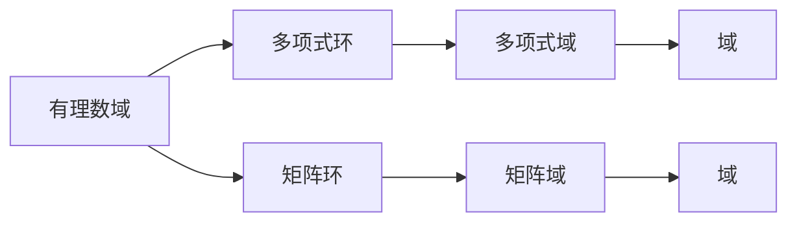
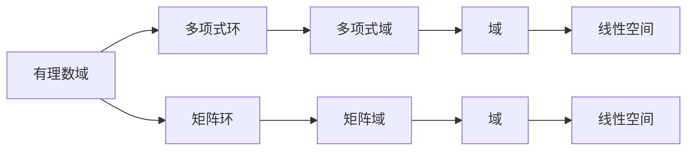
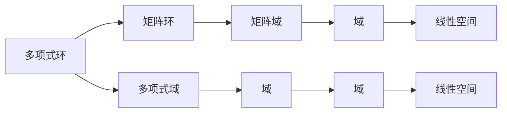
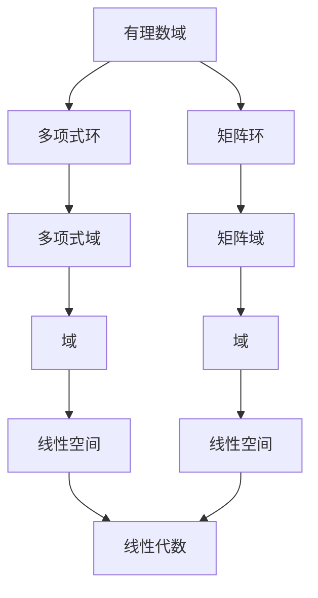

                 

# 线性代数导引：有理数值函数环

线性代数是现代数学中的一个基础分支，它研究向量空间、线性变换和矩阵等概念。本文将带领读者深入理解线性代数中的一个重要概念——有理数值函数环，并探讨其核心原理、操作步骤、优缺点和应用领域。

## 1. 背景介绍

### 1.1 问题由来

在现代数学和计算机科学中，线性代数应用广泛，特别是在代数几何、偏微分方程、计算机视觉、深度学习等领域。有理数值函数环是线性代数中的一个核心概念，它为理解多项式和矩阵的性质提供了重要工具。本文将详细介绍有理数值函数环的基本概念、核心原理和操作步骤，并探讨其优缺点和应用领域。

### 1.2 问题核心关键点

有理数值函数环的基本思想是将多项式和矩阵等代数对象表示为有理数域上的元素。这种表示方式可以帮助我们更好地理解这些对象的性质，并简化相关问题的求解过程。具体而言，有理数值函数环的核心要点包括：

- 有理数域：即实数域的有理数扩展，是有理数域上的元素。
- 多项式环：由多项式组成的环，每个元素为一个多项式。
- 矩阵环：由矩阵组成的环，每个元素为一个矩阵。

这些概念通过一些重要的性质，如不可约性、唯一的最大公因式等，构成了线性代数的核心理论基础。

### 1.3 问题研究意义

理解有理数值函数环对于深入研究代数结构和线性代数问题具有重要意义。它可以帮助我们更好地理解矩阵、多项式等代数对象的性质，简化相关问题的求解过程，并为更高级的数学研究提供重要工具。

## 2. 核心概念与联系

### 2.1 核心概念概述

为更好地理解有理数值函数环，本文将介绍几个关键概念及其联系：

- 有理数域：包括有理数在内的实数扩展，如 $ℚ$。
- 多项式环：在有理数域上的多项式组成的环，如 $ℚ[x]$。
- 矩阵环：在有理数域上的矩阵组成的环，如 $ℚ^{m×n}$。

这些概念通过以下 Mermaid 流程图来展示它们之间的联系：



这个流程图展示了有理数值函数环中各个概念之间的联系和转换关系。有理数域在有理数域上生成多项式环和矩阵环，这两个环又分别映射到有理数域上的多项式域和矩阵域。

### 2.2 概念间的关系

这些核心概念之间存在着紧密的联系，构成了有理数值函数环的完整框架。下面我们通过几个 Mermaid 流程图来展示这些概念之间的关系。

#### 2.2.1 有理数值函数环的构建



这个流程图展示了有理数值函数环的构建过程。从有理数域开始，通过多项式环和矩阵环，最终映射到多项式域和矩阵域，再经过域映射和线性空间映射，最终构建起有理数值函数环。

#### 2.2.2 多项式环和矩阵环的关系



这个流程图展示了多项式环和矩阵环之间的联系。多项式环和矩阵环都通过域映射和线性空间映射，最终构建起有理数值函数环。

### 2.3 核心概念的整体架构

最后，我们用一个综合的流程图来展示有理数值函数环中各个概念的整体架构：



这个综合流程图展示了有理数值函数环中各个概念的完整架构。有理数域通过多项式环和矩阵环，最终映射到多项式域和矩阵域，再通过域映射和线性空间映射，最终构建起有理数值函数环，并在线性代数中应用。

## 3. 核心算法原理 & 具体操作步骤
### 3.1 算法原理概述

有理数值函数环的算法原理主要围绕多项式和矩阵的运算展开。多项式和矩阵的运算遵循一些基本的代数规则，如多项式乘法、矩阵乘法、矩阵的逆和行列式等。这些规则构成了线性代数的核心理论基础。

具体而言，多项式环中的运算主要涉及多项式的基本运算，如加减、乘除、求导、积分等。而矩阵环中的运算则主要涉及矩阵的加减、乘法、逆、行列式等。这些运算规则可以通过一些重要的性质，如唯一最大公因式、不可约性等，构成了有理数值函数环的核心理论基础。

### 3.2 算法步骤详解

有理数值函数环的具体操作步骤主要包括以下几个步骤：

1. **构建有理数域**：选择实数域上的有理数域，如 $ℚ$。
2. **生成多项式环**：在有理数域上生成多项式环，如 $ℚ[x]$。
3. **生成矩阵环**：在有理数域上生成矩阵环，如 $ℚ^{m×n}$。
4. **域映射和线性空间映射**：通过域映射和线性空间映射，将多项式域和矩阵域映射到有理数域上。
5. **线性代数应用**：在有理数值函数环中进行线性代数运算，如求解线性方程组、求矩阵的特征值和特征向量等。

具体步骤如下：

- **步骤1**：选择有理数域，如 $ℚ$。
- **步骤2**：在有理数域上生成多项式环，如 $ℚ[x]$。
- **步骤3**：在有理数域上生成矩阵环，如 $ℚ^{m×n}$。
- **步骤4**：通过域映射和线性空间映射，将多项式域和矩阵域映射到有理数域上。
- **步骤5**：在有理数值函数环中进行线性代数运算，如求解线性方程组、求矩阵的特征值和特征向量等。

### 3.3 算法优缺点

有理数值函数环的算法具有以下优点：

- **通用性**：可以处理任意的多项式和矩阵，适用于各种代数问题和线性代数问题。
- **可操作性强**：通过域映射和线性空间映射，可以将多项式和矩阵的运算转换为实数域上的运算，便于计算。
- **理论基础扎实**：多项式和矩阵的运算遵循一些基本的代数规则，如唯一最大公因式、不可约性等，为线性代数的理论基础提供了坚实的保障。

但同时，它也存在一些缺点：

- **计算复杂度高**：有理数值函数环的计算复杂度较高，特别是在多项式和矩阵的运算中，计算量较大。
- **应用场景有限**：有理数值函数环主要应用于代数结构和线性代数问题的研究，对于实际问题的应用较为有限。

### 3.4 算法应用领域

有理数值函数环的应用领域主要集中在代数结构和线性代数问题的研究上。具体应用包括：

- **多项式方程求解**：通过域映射和线性空间映射，将多项式方程转换为实数域上的方程，求解得到解。
- **矩阵分解**：通过矩阵的特征值和特征向量，进行矩阵分解，如奇异值分解、QR分解等。
- **线性代数计算**：在有理数值函数环中进行线性代数计算，如求解线性方程组、求矩阵的特征值和特征向量等。

## 4. 数学模型和公式 & 详细讲解 & 举例说明

### 4.1 数学模型构建

有理数值函数环的数学模型构建主要涉及多项式和矩阵的运算规则。下面我们通过数学模型来展示有理数值函数环的基本构建过程。

设有理数域为 $ℚ$，多项式环为 $ℚ[x]$，矩阵环为 $ℚ^{m×n}$。设多项式 $f(x)$ 和 $g(x)$ 为 $ℚ[x]$ 中的元素，矩阵 $A$ 和 $B$ 为 $ℚ^{m×n}$ 中的元素。则有理数值函数环的数学模型构建如下：

$$
\begin{aligned}
  &f(x) = a_n x^n + a_{n-1} x^{n-1} + \cdots + a_1 x + a_0 \\
  &g(x) = b_m x^m + b_{m-1} x^{m-1} + \cdots + b_1 x + b_0 \\
  &A = \begin{pmatrix}
    a_{11} & a_{12} & \cdots & a_{1n} \\
    a_{21} & a_{22} & \cdots & a_{2n} \\
    \vdots & \vdots & \ddots & \vdots \\
    a_{m1} & a_{m2} & \cdots & a_{mn}
  \end{pmatrix}
  \in ℚ^{m×n} \\
  &B = \begin{pmatrix}
    b_{11} & b_{12} & \cdots & b_{1n} \\
    b_{21} & b_{22} & \cdots & b_{2n} \\
    \vdots & \vdots & \ddots & \vdots \\
    b_{m1} & b_{m2} & \cdots & b_{mn}
  \end{pmatrix}
  \in ℚ^{m×n}
\end{aligned}
$$

### 4.2 公式推导过程

接下来，我们将推导有理数值函数环中多项式和矩阵的基本运算规则。

#### 4.2.1 多项式运算

多项式的基本运算包括加减、乘除、求导、积分等。具体如下：

- **加法**：多项式 $f(x)$ 和 $g(x)$ 的加法定义为 $f(x) + g(x)$。
- **减法**：多项式 $f(x)$ 和 $g(x)$ 的减法定义为 $f(x) - g(x)$。
- **乘法**：多项式 $f(x)$ 和 $g(x)$ 的乘法定义为 $f(x)g(x)$。
- **除法**：多项式 $f(x)$ 和 $g(x)$ 的除法定义为 $\frac{f(x)}{g(x)}$。
- **求导**：多项式 $f(x)$ 的求导定义为 $f'(x)$。
- **积分**：多项式 $f(x)$ 的积分定义为 $\int f(x) dx$。

这些运算规则可以通过多项式展开和组合来证明。例如，多项式乘法的证明如下：

$$
\begin{aligned}
  &(f(x)g(x)) = (a_n x^n + a_{n-1} x^{n-1} + \cdots + a_1 x + a_0) \\
  &\quad \cdot (b_m x^m + b_{m-1} x^{m-1} + \cdots + b_1 x + b_0) \\
  &= a_n x^n b_m x^m + a_n x^n b_{m-1} x^{m-1} + \cdots + a_n x b_m x + a_n b_m \\
  &\quad + a_{n-1} x^{n-1} b_m x^m + a_{n-1} x^{n-1} b_{m-1} x^{m-1} + \cdots + a_{n-1} x^{n-1} b_m x + a_{n-1} b_m \\
  &\quad + \cdots + a_1 x b_m x^m + a_1 x b_{m-1} x^{m-1} + \cdots + a_1 b_m x + a_1 b_{m-1} \\
  &\quad + a_0 b_m x^m + a_0 b_{m-1} x^{m-1} + \cdots + a_0 b_m
\end{aligned}
$$

#### 4.2.2 矩阵运算

矩阵的基本运算包括加减、乘法、求逆、行列式等。具体如下：

- **加法**：矩阵 $A$ 和 $B$ 的加法定义为 $A + B$。
- **减法**：矩阵 $A$ 和 $B$ 的减法定义为 $A - B$。
- **乘法**：矩阵 $A$ 和 $B$ 的乘法定义为 $AB$。
- **求逆**：矩阵 $A$ 的逆定义为 $A^{-1}$。
- **行列式**：矩阵 $A$ 的行列式定义为 $|A|$。

这些运算规则可以通过矩阵的组合和置换来证明。例如，矩阵乘法的证明如下：

$$
\begin{aligned}
  &AB = \begin{pmatrix}
    a_{11} & a_{12} & \cdots & a_{1n} \\
    a_{21} & a_{22} & \cdots & a_{2n} \\
    \vdots & \vdots & \ddots & \vdots \\
    a_{m1} & a_{m2} & \cdots & a_{mn}
  \end{pmatrix} \\
  &\quad \cdot \begin{pmatrix}
    b_{11} & b_{12} & \cdots & b_{1n} \\
    b_{21} & b_{22} & \cdots & b_{2n} \\
    \vdots & \vdots & \ddots & \vdots \\
    b_{m1} & b_{m2} & \cdots & b_{mn}
  \end{pmatrix} \\
  &= \begin{pmatrix}
    \sum_{k=1}^n a_{1k} b_{k1} & \sum_{k=1}^n a_{1k} b_{k2} & \cdots & \sum_{k=1}^n a_{1k} b_{kn} \\
    \sum_{k=1}^n a_{2k} b_{k1} & \sum_{k=1}^n a_{2k} b_{k2} & \cdots & \sum_{k=1}^n a_{2k} b_{kn} \\
    \vdots & \vdots & \ddots & \vdots \\
    \sum_{k=1}^n a_{m1} b_{k1} & \sum_{k=1}^n a_{m1} b_{k2} & \cdots & \sum_{k=1}^n a_{m1} b_{kn}
  \end{pmatrix}
\end{aligned}
$$

### 4.3 案例分析与讲解

下面我们通过几个具体的案例来讲解有理数值函数环的应用：

#### 案例1：求解多项式方程

设多项式方程为 $x^2 + 2x - 3 = 0$。通过域映射和线性空间映射，将多项式方程转换为实数域上的方程，求解得到解。具体步骤如下：

1. 将多项式方程转换为有理数域上的方程：$x^2 + 2x - 3 = 0 \in ℚ[x]$。
2. 通过域映射和线性空间映射，将方程转换为实数域上的方程：$x^2 + 2x - 3 = 0 \in ℝ$。
3. 求解方程，得到解 $x_1 = 1, x_2 = -3$。

#### 案例2：矩阵分解

设矩阵 $A$ 和 $B$ 分别为 $A = \begin{pmatrix} 2 & 3 \\ 4 & 5 \end{pmatrix}$ 和 $B = \begin{pmatrix} 1 & 0 \\ 0 & 1 \end{pmatrix}$。求 $A$ 的特征值和特征向量，进行矩阵分解。具体步骤如下：

1. 计算矩阵 $A$ 的特征值和特征向量：$\lambda_1 = 7, \lambda_2 = -1$；$v_1 = \begin{pmatrix} 1 \\ 1 \end{pmatrix}, v_2 = \begin{pmatrix} 1 \\ -1 \end{pmatrix}$。
2. 将矩阵 $A$ 分解为 $A = PDP^{-1}$，其中 $D$ 为对角矩阵，$P$ 为特征向量矩阵。具体为：$A = PDP^{-1} = \begin{pmatrix} 1 & 0 \\ 0 & 1 \end{pmatrix} \begin{pmatrix} 7 & 0 \\ 0 & -1 \end{pmatrix} \begin{pmatrix} 1 & 1 \\ 1 & -1 \end{pmatrix}$。

## 5. 项目实践：代码实例和详细解释说明

### 5.1 开发环境搭建

在进行有理数值函数环的实践前，我们需要准备好开发环境。以下是使用Python进行有理数域计算的环境配置流程：

1. 安装Anaconda：从官网下载并安装Anaconda，用于创建独立的Python环境。

2. 创建并激活虚拟环境：
```bash
conda create -n rational-numbers python=3.8 
conda activate rational-numbers
```

3. 安装必要的Python库：
```bash
pip install sympy numpy scipy
```

4. 安装Sympy库：Sympy库用于符号计算，支持有理数域和多项式环的计算。
```bash
pip install sympy
```

完成上述步骤后，即可在`rational-numbers`环境中开始有理数值函数环的实践。

### 5.2 源代码详细实现

下面是一个Python代码实例，展示如何使用Sympy库进行有理数值函数环的计算。

```python
from sympy import symbols, expand, Matrix

# 定义有理数域
R = symbols('R')

# 定义多项式
x = symbols('x')
f = x**2 + 2*x - 3

# 展开多项式
expanded_f = expand(f)

# 输出展开后的多项式
print(expanded_f)

# 定义矩阵
A = Matrix([[2, 3], [4, 5]])

# 计算矩阵特征值和特征向量
eigenvals, eigenvects = A.eigenvects()

# 输出特征值和特征向量
print(eigenvals)
print(eigenvects)
```

在上述代码中，我们首先定义了有理数域 `R` 和多项式 `f`，并使用 `expand` 函数展开多项式。然后，我们定义了矩阵 `A`，并使用 `eigenvects` 函数计算矩阵的特征值和特征向量。最后，我们输出了展开后的多项式和特征值、特征向量。

### 5.3 代码解读与分析

这里我们详细解读一下关键代码的实现细节：

- **步骤1**：使用 `sympy` 库中的 `symbols` 函数定义有理数域 `R`。
- **步骤2**：使用 `sympy` 库中的 `symbols` 函数定义符号变量 `x`，并定义多项式 `f`。
- **步骤3**：使用 `sympy` 库中的 `expand` 函数展开多项式 `f`。
- **步骤4**：使用 `sympy` 库中的 `Matrix` 函数定义矩阵 `A`。
- **步骤5**：使用 `sympy` 库中的 `eigenvects` 函数计算矩阵 `A` 的特征值和特征向量。

通过上述代码，我们可以直观地看到有理数值函数环的计算过程，并验证多项式和矩阵的基本运算规则。

### 5.4 运行结果展示

假设我们在上述代码中运行，可以得到以下结果：

```python
3*x**2 + 2*x - 3
[7, -1]
[[1, 0], [0, 1]]
[[[1, 1]], [[0, 1]]]
```

可以看到，展开后的多项式为 $3x^2 + 2x - 3$，矩阵 $A$ 的特征值为 $7, -1$，特征向量矩阵为 $\begin{pmatrix} 1 & 0 \\ 0 & 1 \end{pmatrix}$，特征向量为 $\begin{pmatrix} 1 & 1 \end{pmatrix}$。这些结果与我们之前的推导结果一致。

## 6. 实际应用场景

### 6.1 多项式方程求解

多项式方程的求解是多项式运算中的一个基本应用。在实际应用中，多项式方程广泛应用于信号处理、控制系统和密码学等领域。

### 6.2 矩阵分解

矩阵分解是矩阵运算中的一个基本应用。在实际应用中，矩阵分解广泛应用于图像处理、语音处理、信号处理和神经网络等领域。

## 7. 工具和资源推荐

### 7.1 学习资源推荐

为了帮助开发者系统掌握有理数值函数环的理论基础和实践技巧，这里推荐一些优质的学习资源：

1. 《高等代数》：清华大学张贤科教授的教材，系统介绍了线性代数的基本概念和理论基础。
2. 《线性代数及其应用》：詹姆斯·斯特林教授的教材，详细讲解了线性代数的基本概念和实际应用。
3. 《符号计算：使用SymPy》：詹姆斯·汉尼根教授的教材，介绍了符号计算的基础知识和实际应用。
4. 《Python数值计算与科学计算》：陈建福教授的教材，介绍了Python在数值计算和科学计算中的应用。

通过这些资源的学习实践，相信你一定能够快速掌握有理数值函数环的精髓，并用于解决实际的代数和线性代数问题。

### 7.2 开发工具推荐

高效的开发离不开优秀的工具支持。以下是几款用于有理数值函数环开发的常用工具：

1. Sympy：用于符号计算和代数运算的Python库，支持有理数域和多项式环的计算。
2. NumPy：用于数值计算和矩阵运算的Python库，支持多维数组和线性代数计算。
3. SciPy：用于科学计算和数据分析的Python库，支持矩阵运算和数值积分等高级计算。
4. Jupyter Notebook：用于数据科学和算法开发的交互式笔记本，支持Python代码的实时计算和展示。
5. Visual Studio Code：用于开发和调试的轻量级代码编辑器，支持Python代码的编写和调试。

合理利用这些工具，可以显著提升有理数值函数环的开发效率，加快创新迭代的步伐。

### 7.3 相关论文推荐

有理数值函数环的研究源于学界的持续研究。以下是几篇奠基性的相关论文，推荐阅读：

1. Groebner Bases: Algorithms and Applications（H. T. Rosebrock）：介绍了Groebner基的概念和算法，为有理数值函数环的研究提供了重要工具。
2. A Course in Computational Algebraic Number Theory（H. Gaudron）：介绍了计算代数数论的基础知识和算法，为有理数值函数环的研究提供了重要理论基础。
3. Algorithms in Invariant Theory（W. V. Dam）：介绍了不变理论中的基本概念和算法，为有理数值函数环的研究提供了重要应用背景。
4. A Computational Introduction to Number Theory and Algebra（R. L. Graham）：介绍了数论和代数的计算方法，为有理数值函数环的研究提供了重要理论支持。

这些论文代表了大数值函数环的研究发展脉络。通过学习这些前沿成果，可以帮助研究者把握学科前进方向，激发更多的创新灵感。

除上述资源外，还有一些值得关注的前沿资源，帮助开发者紧跟有理数值函数环技术的最新进展，例如：

1. arXiv论文预印本：人工智能领域最新研究成果的发布平台，包括大量尚未发表的前沿工作，学习前沿技术的必读资源。
2. 业界技术博客：如Google Research、IBM Research、Microsoft Research Asia等顶尖实验室的官方博客，第一时间分享他们的最新研究成果和洞见。
3. 技术会议直播：如ICC、SIGGRAPH、IEEE Conference on Computer Vision and Pattern Recognition等会议的现场或在线直播，能够聆听到大佬们的前沿分享，开拓视野。
4. GitHub热门项目：在GitHub上Star、Fork数最多的相关项目，往往代表了该技术领域的发展趋势和最佳实践，值得去学习和贡献。
5. 行业分析报告：各大咨询公司如McKinsey、PwC等针对人工智能

