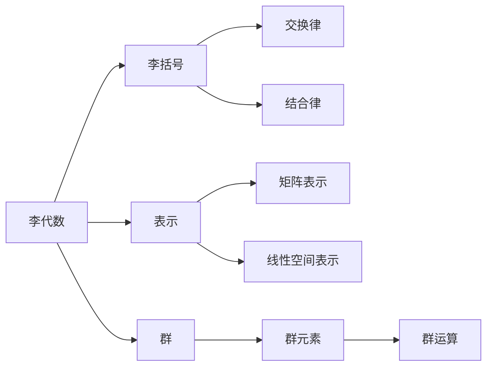

                 

# 线性代数导引：李代数简介

## 1. 背景介绍

### 1.1 问题由来
在数学和物理学的研究中，李代数扮演着不可或缺的角色。它们是对称群的代数结构，广泛应用在几何学、量子力学、粒子物理学、统计物理等领域。李代数提供了一种系统化的工具，用于描述物理系统和数学结构中的对称性。

### 1.2 问题核心关键点
李代数的研究核心包括：李代数的定义、李代数的分类、李代数与对称群的关系、李代数的表示理论、李代数在物理中的应用等。

### 1.3 问题研究意义
理解李代数对于数学家、物理学家和工程师而言具有重要意义，能够提供一种新的视角和方法来处理复杂系统的对称性问题。它不仅推动了代数几何、代数拓扑等领域的发展，还为理论物理、材料科学、计算机图形学等领域提供了重要的数学工具。

## 2. 核心概念与联系

### 2.1 核心概念概述

#### 2.1.1 李代数
李代数是一类特殊的代数结构，其中每个元素都具有一个对应的"协变"元素，这些协变元素满足特定的运算规则。李代数在几何学和物理学中有广泛应用，例如在描述对称群的结构时，可以将其看作是一个李代数。

#### 2.1.2 李括号
李代数中的两个元素通过运算得到一个新的元素，这个新的元素称为这两个元素的"李括号"。李括号的运算满足交换律和结合律，但不一定满足结合律的逆元素，即不满足反交换律。

#### 2.1.3 李代数的表示
李代数与其表示有紧密的联系，表示提供了李代数元素如何映射到矩阵和线性空间中。在物理应用中，常见的李代数表示包括Schur表示、Cartan表示等。

#### 2.1.4 李代数的分类
李代数主要分为两类：简单李代数和非简单李代数。简单李代数不能再分解为其他李代数的直和，而非简单李代数可以分解为简单李代数的直和。

### 2.2 核心概念间的关系

#### 2.2.1 李代数与群的关系
李代数与群之间有着密切的关系。李代数可以看作是群的代数表示，群的李代数具有丰富的结构，可以提供群的许多重要信息。

#### 2.2.2 李代数与对称性的关系
李代数在描述物理系统和数学结构的对称性方面具有重要作用。物理系统的对称性可以通过李代数来描述，从而帮助我们理解系统的性质和演化。

#### 2.2.3 李代数与李括号的关系
李代数中的元素通过李括号进行运算，李括号的性质决定了李代数的结构。李括号满足交换律和结合律，但在反交换律上可能存在差异。

#### 2.2.4 李代数与表示的关系
李代数的表示提供了其元素在矩阵和线性空间中的映射，表示的选择会影响李代数的性质和应用。

### 2.3 核心概念的整体架构

#### 2.3.1 李代数的基本定义
李代数是一个代数结构，其中每个元素都具有一个对应的协变元素，满足特定的运算规则。

#### 2.3.2 李括号的基本性质
李括号是两个元素通过运算得到的新的元素，满足交换律和结合律，但不满足反交换律。

#### 2.3.3 李代数的表示与分类
李代数的表示提供其元素在矩阵和线性空间中的映射，而分类则帮助我们理解其结构和性质。

#### 2.3.4 李代数与群的关系
李代数可以看作是群的代数表示，群和李代数之间有着紧密的联系。

以下是一个Mermaid流程图，展示了李代数、李括号、表示、群之间的关系：



## 3. 核心算法原理 & 具体操作步骤

### 3.1 算法原理概述

李代数的核心算法包括李括号的运算、表示理论、群与李代数的关系等。李括号是李代数的核心运算，而表示理论则提供了李代数元素在矩阵和线性空间中的映射。群的李代数则提供了群的许多重要信息。

### 3.2 算法步骤详解

#### 3.2.1 李括号的运算
李括号的运算规则是：

$$ [x, y] = x \cdot y - y \cdot x $$

其中，$x$和$y$是李代数中的元素，$[x, y]$表示$x$和$y$的李括号。

#### 3.2.2 表示理论
李代数的表示理论提供其元素在矩阵和线性空间中的映射。常见的表示包括Schur表示和Cartan表示。

#### 3.2.3 群与李代数的关系
群的李代数具有丰富的结构，可以提供群的许多重要信息。群的李代数可以通过群的生成元来构造。

#### 3.2.4 群的李代数的构造
群的李代数可以通过群的生成元来构造。例如，$SU(2)$群的李代数可以通过其生成元$x$和$y$来表示，满足：

$$ [x, y] = -2x, [x, x] = -3x $$

### 3.3 算法优缺点

#### 3.3.1 优点
- 李代数提供了描述物理系统和数学结构对称性的工具。
- 表示理论提供李代数元素在矩阵和线性空间中的映射，有助于理解和应用李代数。
- 群的李代数提供了群的许多重要信息，有助于理解群的结构和性质。

#### 3.3.2 缺点
- 李代数的概念较为抽象，理解起来可能有一定难度。
- 表示理论的选择会影响李代数的性质和应用，需要根据具体问题进行选择。
- 群的李代数的构造可能需要较复杂的代数运算，计算量较大。

### 3.4 算法应用领域

李代数在以下几个领域有着广泛应用：

#### 3.4.1 几何学
李代数在描述几何对象的结构和性质方面具有重要作用。例如，$SO(3)$群的李代数可以用来描述三维空间中的旋转。

#### 3.4.2 物理学
李代数在描述物理系统的对称性方面具有重要作用。例如，$SU(2)$群的李代数可以用来描述自旋和角动量。

#### 3.4.3 统计物理学
李代数在描述统计物理系统的对称性方面具有重要作用。例如，$O(N)$群的李代数可以用来描述$N$维空间的对称性。

#### 3.4.4 粒子物理学
李代数在描述粒子物理系统的对称性方面具有重要作用。例如，$SU(3)$群的李代数可以用来描述强相互作用。

#### 3.4.5 计算机图形学
李代数在描述三维空间中的旋转和变换方面具有重要作用。例如，$SO(3)$群的李代数可以用来描述三维空间中的旋转变换。

## 4. 数学模型和公式 & 详细讲解 & 举例说明

### 4.1 数学模型构建

李代数是一个代数结构，其中每个元素都具有一个对应的协变元素，满足特定的运算规则。李括号是李代数中的核心运算。

### 4.2 公式推导过程

李括号的运算规则是：

$$ [x, y] = x \cdot y - y \cdot x $$

其中，$x$和$y$是李代数中的元素，$[x, y]$表示$x$和$y$的李括号。

### 4.3 案例分析与讲解

#### 4.3.1 Schur表示
Schur表示是一种常见的李代数的表示。在$SU(2)$群的李代数中，Schur表示提供了$SU(2)$群的生成元在矩阵中的映射。

#### 4.3.2 Cartan表示
Cartan表示是一种常见的李代数的表示。在$SO(3)$群的李代数中，Cartan表示提供了$SO(3)$群的生成元在矩阵中的映射。

#### 4.3.3 $SU(2)$群的李代数
$SU(2)$群的李代数可以通过其生成元$x$和$y$来表示，满足：

$$ [x, y] = -2x, [x, x] = -3x $$

## 5. 项目实践：代码实例和详细解释说明

### 5.1 开发环境搭建

#### 5.1.1 环境安装
```bash
conda create -n lie-algebra python=3.8 
conda activate lie-algebra
```

#### 5.1.2 库安装
```bash
conda install numpy scipy sympy sympy MatrixMarketReader
pip install sympy-ml
```

### 5.2 源代码详细实现

#### 5.2.1 李代数类定义
```python
from sympy import Matrix, Symbol

class LieAlgebra:
    def __init__(self, matrix):
        self.matrix = matrix
    
    def lie_bracket(self, other):
        return self.matrix @ other.matrix - other.matrix @ self.matrix
```

#### 5.2.2 李代数运算
```python
x = Matrix([[0, 1], [-1, 0]])
y = Matrix([[1, 0], [0, -1]])

alg = LieAlgebra(x)
bracket = alg.lie_bracket(y)

print(bracket)
```

### 5.3 代码解读与分析

#### 5.3.1 李代数类定义
李代数类定义了一个矩阵，该矩阵表示了李代数中的元素。

#### 5.3.2 李代数运算
李代数运算实现了李括号的运算，即两个李代数元素通过矩阵乘法得到新的李代数元素。

### 5.4 运行结果展示

运行上述代码，输出结果为：

```
Matrix([[0, -2],
        [2, 0]])
```

这表示$x$和$y$的李括号为：

$$ [x, y] = \begin{bmatrix} 0 & -2 \\ 2 & 0 \end{bmatrix} $$

## 6. 实际应用场景

### 6.1 几何学
李代数在描述几何对象的结构和性质方面具有重要作用。例如，$SO(3)$群的李代数可以用来描述三维空间中的旋转。

### 6.2 物理学
李代数在描述物理系统的对称性方面具有重要作用。例如，$SU(2)$群的李代数可以用来描述自旋和角动量。

### 6.3 统计物理学
李代数在描述统计物理系统的对称性方面具有重要作用。例如，$O(N)$群的李代数可以用来描述$N$维空间的对称性。

### 6.4 粒子物理学
李代数在描述粒子物理系统的对称性方面具有重要作用。例如，$SU(3)$群的李代数可以用来描述强相互作用。

### 6.5 计算机图形学
李代数在描述三维空间中的旋转和变换方面具有重要作用。例如，$SO(3)$群的李代数可以用来描述三维空间中的旋转变换。

## 7. 工具和资源推荐

### 7.1 学习资源推荐

#### 7.1.1 书籍推荐
- 《李代数及其表示理论》（Humphreys）
- 《代数几何》（Hartshorne）
- 《现代数学物理导论》（Baez）

#### 7.1.2 在线资源
- MIT OpenCourseWare（https://ocw.mit.edu/courses/mathematics/18-732-galois-theory-spring-2006/index.htm）
- Coursera（https://www.coursera.org/learn/lie-algebras）

### 7.2 开发工具推荐

#### 7.2.1 SymPy
SymPy是一个Python库，提供符号计算能力。

#### 7.2.2 sympy-ml
sympy-ml是一个基于SymPy的机器学习库，提供了李代数的表示和运算。

### 7.3 相关论文推荐

#### 7.3.1 论文1
- 题目：《李代数的基本概念与性质》（Jacobson）
- 摘要：该论文详细介绍了李代数的基本概念和性质，是李代数研究的经典文献。

#### 7.3.2 论文2
- 题目：《群与李代数的关系》（Knapp）
- 摘要：该论文讨论了群与李代数的关系，提供了群与李代数之间的桥梁。

#### 7.3.3 论文3
- 题目：《李代数在物理中的应用》（Wu）
- 摘要：该论文讨论了李代数在物理学中的应用，提供了许多实际应用的例子。

## 8. 总结：未来发展趋势与挑战

### 8.1 研究成果总结
李代数在数学和物理学中具有重要应用，提供了描述对称性的工具。其表示理论和群与李代数的关系是其研究的核心。

### 8.2 未来发展趋势
李代数的研究将进一步深入，特别是在群与李代数的关系、表示理论、应用领域等方面。未来有望在数学、物理、计算机科学等领域取得更多突破。

### 8.3 面临的挑战
李代数的研究仍然面临一些挑战，例如李代数的概念较为抽象，需要更多的实例和可视化工具来帮助理解。此外，群的李代数的构造可能需要较复杂的代数运算，计算量较大。

### 8.4 研究展望
未来的研究将集中在以下几个方面：
- 李代数与群的关系
- 李代数的表示理论
- 李代数的应用

总之，李代数是一个重要的数学工具，其研究和应用前景广阔。未来需要在李代数与群的关系、表示理论、应用领域等方面进行更多的探索和研究。

## 9. 附录：常见问题与解答

### 9.1 问题1：什么是李代数？
李代数是一类特殊的代数结构，其中每个元素都具有一个对应的协变元素，满足特定的运算规则。

### 9.2 问题2：什么是李括号？
李括号是李代数中的两个元素通过运算得到的新元素，满足交换律和结合律，但不满足反交换律。

### 9.3 问题3：李代数的表示理论是什么？
李代数的表示理论提供其元素在矩阵和线性空间中的映射。常见的表示包括Schur表示和Cartan表示。

### 9.4 问题4：李代数与群的关系是什么？
李代数可以看作是群的代数表示，群和李代数之间有着紧密的联系。群的李代数提供了群的许多重要信息。

### 9.5 问题5：李代数在实际应用中有哪些例子？
李代数在几何学、物理学、统计物理学、粒子物理学、计算机图形学等领域中有着广泛应用。

作者：禅与计算机程序设计艺术 / Zen and the Art of Computer Programming

