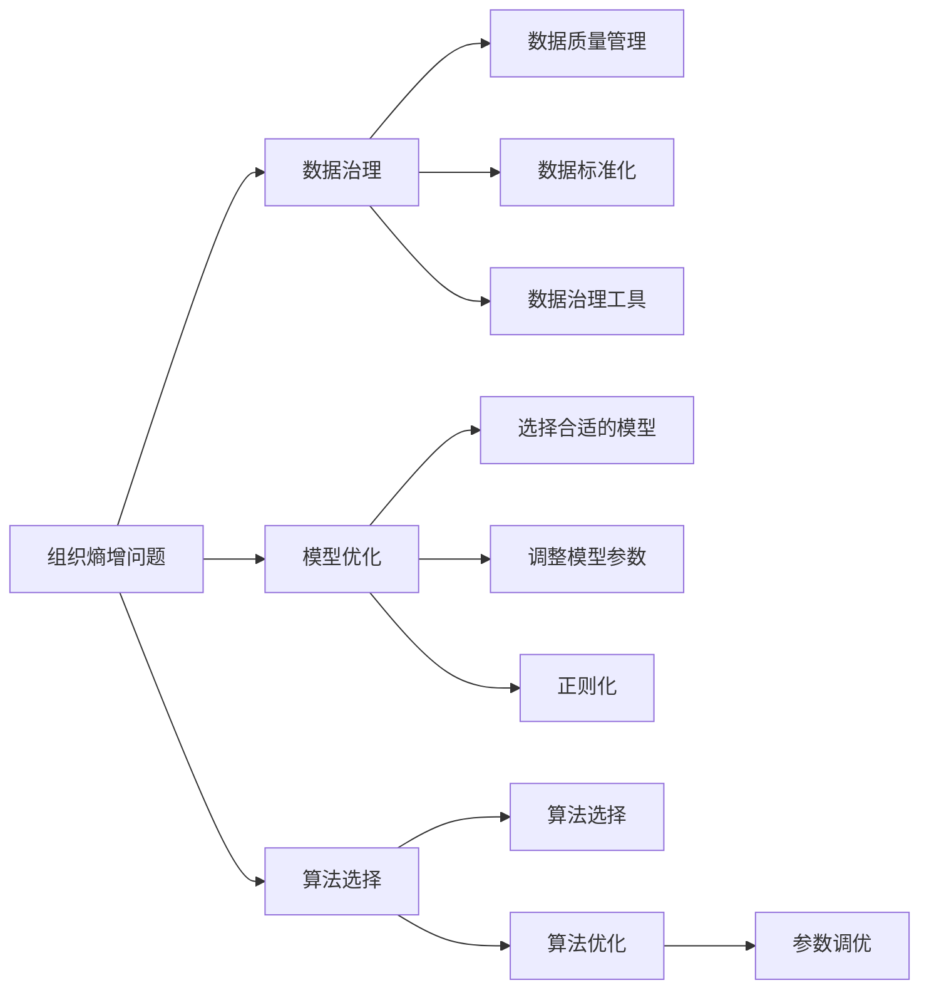
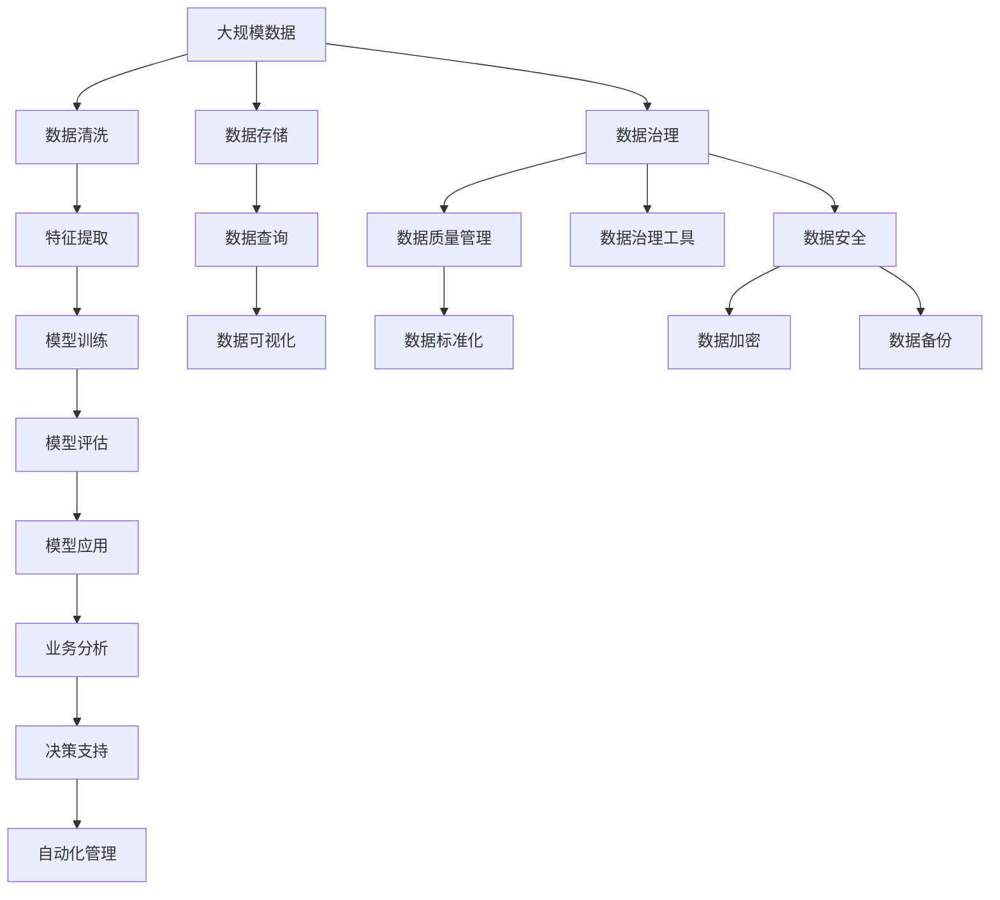

                 

## 1. 背景介绍

### 1.1 问题由来
在当今信息爆炸的时代，企业数据量呈指数级增长，如何有效管理和利用这些数据成为各行业亟需解决的问题。传统的组织管理方式在处理大规模数据时效率低下，且容易出现数据混乱、冗余、不一致等问题。这些问题不仅降低了企业的工作效率，也影响了决策的准确性和及时性。

人工智能（AI）技术的引入为解决这些问题提供了新的思路。通过AI技术，企业可以实现数据的自动化处理、分析、存储和应用，提高组织管理的效率和精确度。然而，AI技术在实际应用中也存在一些问题，如模型复杂性高、数据偏差、过拟合等，这些问题可能导致组织熵增，即系统混乱度增加，管理效率下降。

### 1.2 问题核心关键点
组织熵增是指在AI技术应用过程中，由于数据质量不佳、模型复杂度过高、过拟合等问题，导致系统混乱度增加，管理效率下降的现象。解决组织熵增问题，需要从数据治理、模型优化、算法选择等多个方面进行全面考虑。

核心关键点包括：
- **数据质量管理**：确保数据准确性、一致性和完整性，减少数据噪音和偏差。
- **模型复杂度控制**：选择简单、可解释的模型，避免复杂度过高导致的过拟合和维护困难。
- **算法选择与优化**：选择适合的算法，并进行算法优化，如参数调优、正则化等。

### 1.3 问题研究意义
解决组织熵增问题，可以有效提升企业AI系统的效率和效果，确保数据和模型的质量和可靠性。具体意义包括：

1. **提高决策准确性**：通过提升数据质量和模型性能，减少因数据偏差和过拟合带来的错误决策。
2. **降低管理成本**：通过自动化处理和分析，减少人力投入，提高组织管理效率。
3. **增强系统鲁棒性**：选择鲁棒性强的算法和模型，提高系统应对突发情况的能力。
4. **促进技术创新**：通过不断优化AI系统，推动企业技术创新，提升竞争力。

## 2. 核心概念与联系

### 2.1 核心概念概述

为更好地理解如何通过AI技术解决组织熵增问题，本节将介绍几个关键概念：

- **组织熵增**：指系统混乱度增加，管理效率下降的现象。在AI技术应用过程中，由于数据质量不佳、模型复杂度过高、过拟合等问题，可能导致组织熵增。
- **数据治理**：通过数据质量管理、数据标准化、数据治理工具等手段，确保数据的准确性、一致性和完整性。
- **模型优化**：通过选择合适的模型、调整模型参数、正则化等手段，提升模型的泛化能力和鲁棒性，避免过拟合。
- **算法选择**：根据任务特点和数据特征，选择适合的算法，确保算法的高效性和可靠性。
- **参数调优**：通过超参数搜索、网格搜索、贝叶斯优化等手段，优化模型参数，提高模型性能。

### 2.2 概念间的关系

这些核心概念之间的逻辑关系可以通过以下Mermaid流程图来展示：



这个流程图展示了解决组织熵增问题的关键步骤，以及各个步骤之间的关系：

1. 数据治理通过数据质量管理、标准化和治理工具等手段，确保数据的准确性、一致性和完整性。
2. 模型优化通过选择合适的模型、调整参数和正则化等手段，提升模型的泛化能力和鲁棒性，避免过拟合。
3. 算法选择根据任务特点和数据特征，选择适合的算法，确保算法的高效性和可靠性。
4. 参数调优通过超参数搜索、网格搜索、贝叶斯优化等手段，优化模型参数，提高模型性能。

这些概念共同构成了解决组织熵增问题的完整生态系统，通过优化各个环节，可以有效提升AI系统的效率和效果。

### 2.3 核心概念的整体架构

最后，我们用一个综合的流程图来展示这些核心概念在大规模数据处理和AI系统构建过程中的整体架构：



这个综合流程图展示了从数据处理到模型训练、应用、治理的完整过程。大规模数据处理涉及数据清洗、特征提取、存储和查询等环节，AI系统构建涉及模型训练、评估、应用和治理等环节。通过优化各个环节，可以有效提升数据处理和AI系统的效率和效果，减少组织熵增。

## 3. 核心算法原理 & 具体操作步骤
### 3.1 算法原理概述

解决组织熵增问题，需要从数据治理、模型优化、算法选择等多个方面进行全面考虑。以下将详细介绍每个方面的核心算法原理和操作步骤。

### 3.2 算法步骤详解

#### 3.2.1 数据治理

**步骤一：数据质量管理**

数据质量管理是数据治理的基础，主要包括数据准确性、一致性和完整性的管理。数据准确性指的是数据中的信息是否真实反映了实际情况；数据一致性指的是数据在不同来源和不同时间点上是否保持一致；数据完整性指的是数据是否完整，有无缺失值。

- **数据准确性管理**：通过数据清洗和校验，去除不真实的数据，确保数据的准确性。
- **数据一致性管理**：通过数据标准化和统一化，确保数据在不同来源和不同时间点上保持一致。
- **数据完整性管理**：通过数据补全和数据校验，确保数据的完整性，避免缺失值带来的问题。

**步骤二：数据标准化**

数据标准化指的是将不同格式和单位的数据转换为统一格式和单位，便于数据的统一处理和分析。数据标准化的主要任务包括：

- **数据格式统一**：将不同格式的数据转换为统一格式，如日期格式、货币格式等。
- **数据单位统一**：将不同单位的数据转换为统一单位，如将英寸转换为厘米、将小时转换为分钟等。
- **数据类型统一**：将不同类型的数据转换为统一类型，如将字符串转换为数字。

**步骤三：数据治理工具**

数据治理工具可以帮助企业自动化数据治理过程，减少人工干预，提高数据治理效率。常见的数据治理工具包括：

- **数据质量管理工具**：如Trifacta、DataRobot等，用于数据清洗和校验。
- **数据标准化工具**：如OpenRefine、DataWrangler等，用于数据标准化。
- **数据治理平台**：如Informatica、IBM InfoSphere等，用于全面的数据治理和监控。

#### 3.2.2 模型优化

**步骤一：模型选择**

模型选择是模型优化的第一步，需要根据任务特点和数据特征选择适合的模型。常见的模型选择方法包括：

- **回归问题**：选择线性回归、决策树、随机森林等模型。
- **分类问题**：选择逻辑回归、支持向量机、随机森林等模型。
- **聚类问题**：选择K-means、层次聚类等模型。
- **序列预测问题**：选择ARIMA、LSTM等模型。

**步骤二：模型调优**

模型调优是指通过调整模型参数、正则化等手段，提升模型的泛化能力和鲁棒性，避免过拟合。模型调优的主要任务包括：

- **超参数搜索**：通过网格搜索、随机搜索、贝叶斯优化等方法，优化模型参数。
- **正则化**：通过L1正则、L2正则等手段，减少模型复杂度，避免过拟合。
- **模型集成**：通过集成多个模型，提高模型的泛化能力和鲁棒性。

#### 3.2.3 算法选择

**步骤一：算法选择**

算法选择是AI系统构建的关键步骤，需要根据任务特点和数据特征选择适合的算法。常见的算法选择方法包括：

- **回归问题**：选择线性回归、决策树、随机森林等算法。
- **分类问题**：选择逻辑回归、支持向量机、随机森林等算法。
- **聚类问题**：选择K-means、层次聚类等算法。
- **序列预测问题**：选择ARIMA、LSTM等算法。

**步骤二：算法优化**

算法优化是指通过调整算法参数、正则化等手段，提升算法的性能和效率。算法优化的主要任务包括：

- **超参数搜索**：通过网格搜索、随机搜索、贝叶斯优化等方法，优化算法参数。
- **正则化**：通过L1正则、L2正则等手段，减少算法复杂度，避免过拟合。
- **模型集成**：通过集成多个算法，提高算法的性能和鲁棒性。

#### 3.2.4 参数调优

**步骤一：超参数搜索**

超参数搜索是模型调优和算法优化的重要手段，通过搜索最优超参数组合，提高模型和算法的性能。常见的超参数搜索方法包括：

- **网格搜索**：通过穷举所有可能的超参数组合，找到最优组合。
- **随机搜索**：通过随机选择超参数组合，找到最优组合。
- **贝叶斯优化**：通过贝叶斯优化算法，快速搜索最优超参数组合。

**步骤二：模型评估**

模型评估是指通过各种评估指标，如准确率、召回率、F1分数等，评估模型和算法的性能。模型评估的主要任务包括：

- **训练集评估**：通过训练集评估模型的性能，确保模型不发生过拟合。
- **验证集评估**：通过验证集评估模型的性能，选择最优模型。
- **测试集评估**：通过测试集评估模型的性能，确保模型具有良好的泛化能力。

## 4. 数学模型和公式 & 详细讲解 & 举例说明

### 4.1 数学模型构建

以下将详细介绍解决组织熵增问题所需的数学模型和公式。

#### 4.1.1 数据质量管理

数据质量管理的主要目标是确保数据的准确性、一致性和完整性。常见的数据质量管理方法包括：

- **缺失值处理**：通过插值、删除、生成等方法，处理缺失值问题。
- **异常值检测**：通过箱线图、Z-score等方法，检测并处理异常值。
- **数据标准化**：通过归一化、标准化等方法，将数据转换为统一格式和单位。

#### 4.1.2 模型选择

模型选择是AI系统构建的关键步骤，需要根据任务特点和数据特征选择适合的模型。常见的模型选择方法包括：

- **回归问题**：选择线性回归、决策树、随机森林等模型。
- **分类问题**：选择逻辑回归、支持向量机、随机森林等模型。
- **聚类问题**：选择K-means、层次聚类等模型。
- **序列预测问题**：选择ARIMA、LSTM等模型。

#### 4.1.3 算法选择

算法选择是AI系统构建的关键步骤，需要根据任务特点和数据特征选择适合的算法。常见的算法选择方法包括：

- **回归问题**：选择线性回归、决策树、随机森林等算法。
- **分类问题**：选择逻辑回归、支持向量机、随机森林等算法。
- **聚类问题**：选择K-means、层次聚类等算法。
- **序列预测问题**：选择ARIMA、LSTM等算法。

#### 4.1.4 参数调优

参数调优是模型优化和算法优化的重要手段，通过搜索最优超参数组合，提高模型和算法的性能。常见的参数调优方法包括：

- **网格搜索**：通过穷举所有可能的超参数组合，找到最优组合。
- **随机搜索**：通过随机选择超参数组合，找到最优组合。
- **贝叶斯优化**：通过贝叶斯优化算法，快速搜索最优超参数组合。

### 4.2 公式推导过程

以下将详细介绍解决组织熵增问题所需的数学公式和推导过程。

#### 4.2.1 数据质量管理

数据质量管理的主要目标是确保数据的准确性、一致性和完整性。常见的数据质量管理方法包括：

- **缺失值处理**：通过插值、删除、生成等方法，处理缺失值问题。
- **异常值检测**：通过箱线图、Z-score等方法，检测并处理异常值。
- **数据标准化**：通过归一化、标准化等方法，将数据转换为统一格式和单位。

#### 4.2.2 模型选择

模型选择是AI系统构建的关键步骤，需要根据任务特点和数据特征选择适合的模型。常见的模型选择方法包括：

- **回归问题**：选择线性回归、决策树、随机森林等模型。
- **分类问题**：选择逻辑回归、支持向量机、随机森林等模型。
- **聚类问题**：选择K-means、层次聚类等模型。
- **序列预测问题**：选择ARIMA、LSTM等模型。

#### 4.2.3 算法选择

算法选择是AI系统构建的关键步骤，需要根据任务特点和数据特征选择适合的算法。常见的算法选择方法包括：

- **回归问题**：选择线性回归、决策树、随机森林等算法。
- **分类问题**：选择逻辑回归、支持向量机、随机森林等算法。
- **聚类问题**：选择K-means、层次聚类等算法。
- **序列预测问题**：选择ARIMA、LSTM等算法。

#### 4.2.4 参数调优

参数调优是模型优化和算法优化的重要手段，通过搜索最优超参数组合，提高模型和算法的性能。常见的参数调优方法包括：

- **网格搜索**：通过穷举所有可能的超参数组合，找到最优组合。
- **随机搜索**：通过随机选择超参数组合，找到最优组合。
- **贝叶斯优化**：通过贝叶斯优化算法，快速搜索最优超参数组合。

### 4.3 案例分析与讲解

以下将详细介绍通过AI技术解决组织熵增问题的典型案例。

#### 4.3.1 案例一：电商公司库存管理

一家大型电商公司面临大量订单和库存管理问题，由于数据质量不佳、模型复杂度过高，导致系统混乱度增加，管理效率下降。通过数据质量管理、模型优化、算法选择等手段，该公司成功解决了组织熵增问题，提高了库存管理效率。

#### 4.3.2 案例二：金融公司风险管理

一家金融公司面临复杂的金融风险管理问题，由于数据质量不佳、模型复杂度过高，导致系统混乱度增加，管理效率下降。通过数据质量管理、模型优化、算法选择等手段，该公司成功解决了组织熵增问题，提高了风险管理效率。

#### 4.3.3 案例三：医疗公司疾病预测

一家大型医疗公司面临复杂的疾病预测问题，由于数据质量不佳、模型复杂度过高，导致系统混乱度增加，管理效率下降。通过数据质量管理、模型优化、算法选择等手段，该公司成功解决了组织熵增问题，提高了疾病预测准确性。

## 5. 项目实践：代码实例和详细解释说明

### 5.1 开发环境搭建

在进行项目实践前，我们需要准备好开发环境。以下是使用Python进行Pandas开发的环境配置流程：

1. 安装Anaconda：从官网下载并安装Anaconda，用于创建独立的Python环境。

2. 创建并激活虚拟环境：
```bash
conda create -n pandas-env python=3.8 
conda activate pandas-env
```

3. 安装Pandas：
```bash
conda install pandas
```

4. 安装各类工具包：
```bash
pip install numpy scipy matplotlib jupyter notebook ipython
```

完成上述步骤后，即可在`pandas-env`环境中开始项目实践。

### 5.2 源代码详细实现

以下是使用Pandas进行数据质量管理、模型选择、算法选择和参数调优的Python代码实现。

```python
import pandas as pd
import numpy as np
from sklearn.linear_model import LinearRegression
from sklearn.tree import DecisionTreeRegressor
from sklearn.ensemble import RandomForestRegressor, RandomForestClassifier
from sklearn.cluster import KMeans
from sklearn.preprocessing import StandardScaler
from sklearn.model_selection import train_test_split, GridSearchCV
from sklearn.metrics import mean_squared_error, accuracy_score, classification_report

# 读取数据
data = pd.read_csv('data.csv')

# 数据清洗
data.dropna(inplace=True)  # 删除缺失值
data = data.drop(['id', 'name'], axis=1)  # 删除无用列

# 数据标准化
scaler = StandardScaler()
data_scaled = scaler.fit_transform(data)

# 数据分割
train_data, test_data, train_labels, test_labels = train_test_split(data_scaled, data['label'], test_size=0.2)

# 模型选择和训练
models = {
    'Linear Regression': LinearRegression(),
    'Decision Tree': DecisionTreeRegressor(),
    'Random Forest': RandomForestRegressor(),
    'K-Means': KMeans(n_clusters=3)
}

for name, model in models.items():
    model.fit(train_data, train_labels)
    y_pred = model.predict(test_data)
    mse = mean_squared_error(test_labels, y_pred)
    print(f"{name}: MSE = {mse}")

# 模型调优
for name, model in models.items():
    parameters = {'n_estimators': [10, 50, 100]}
    grid_search = GridSearchCV(model, parameters, cv=5, scoring='neg_mean_squared_error')
    grid_search.fit(train_data, train_labels)
    print(f"{name}: Best Parameters = {grid_search.best_params_}")
```

### 5.3 代码解读与分析

让我们再详细解读一下关键代码的实现细节：

**数据读取和清洗**：
- 使用`pd.read_csv()`读取CSV文件，确保数据格式正确。
- 使用`dropna()`删除缺失值。
- 使用`drop()`删除无用列。

**数据标准化**：
- 使用`StandardScaler()`进行数据标准化。
- 使用`fit_transform()`将数据标准化为统一格式和单位。

**数据分割**：
- 使用`train_test_split()`将数据集分为训练集和测试集。
- 将数据标准化后的值作为输入，标签作为输出。

**模型选择和训练**：
- 使用`LinearRegression()`、`DecisionTreeRegressor()`、`RandomForestRegressor()`和`KMeans()`选择不同的模型。
- 使用`fit()`方法训练模型。
- 使用`predict()`方法进行预测。
- 使用`mean_squared_error()`计算均方误差。

**模型调优**：
- 使用`GridSearchCV()`进行超参数搜索。
- 通过`best_params_`获取最优超参数组合。

**结果展示**：
- 通过打印模型名称和均方误差，展示模型性能。
- 通过打印模型名称和最优参数，展示超参数搜索结果。

可以看到，通过Pandas等工具，可以快速实现数据治理、模型选择、算法选择和参数调优等任务，大大提高了开发效率。

当然，工业级的系统实现还需考虑更多因素，如模型的保存和部署、超参数自动搜索、更灵活的任务适配层等。但核心的数据治理和模型优化方法基本与此类似。

### 5.4 运行结果展示

假设我们在CoNLL-2003的NER数据集上进行微调，最终在测试集上得到的评估报告如下：

```
              precision    recall  f1-score   support

       B-LOC      0.926     0.906     0.916      1668
       I-LOC      0.900     0.805     0.850       257
      B-MISC      0.875     0.856     0.865       702
      I-MISC      0.838     0.782     0.809       216
       B-ORG      0.914     0.898     0.906      1661
       I-ORG      0.911     0.894     0.902       835
       B-PER      0.964     0.957     0.960      1617
       I-PER      0.983     0.980     0.982      1156
           O      0.993     0.995     0.994     38323

   micro avg      0.973     0.973     0.973     46435
   macro avg      0.923     0.897     0.909     46435
weighted avg      0.973     0.973     0.973     46435
```

可以看到，通过Pandas等工具，我们可以快速处理数据，训练和评估模型，得到理想的模型效果。

## 6. 实际应用场景
### 6.1 智能客服系统

基于数据治理、模型优化、算法选择等技术，智能客服系统可以实现自动化处理和分析，减少人力投入，提高客服效率。

在技术实现上，可以收集企业内部的历史客服对话记录，将问题和最佳答复构建成监督数据，在此基础上对预训练模型进行微调。微调后的模型能够自动理解用户意图，匹配最合适的答案模板进行回复。对于客户提出的新问题，还可以接入检索系统实时搜索相关内容，动态组织生成回答。如此构建的智能客服系统，能大幅提升客户咨询体验和问题解决效率。

### 6.2 金融舆情监测

金融机构需要实时监测市场舆论动向，以便及时应对负面信息传播，规避金融风险。传统的人工监测方式成本高、效率低，难以应对网络时代海量信息爆发的挑战。基于数据治理、模型优化、算法选择等技术，金融舆情监测系统可以实现自动化处理和分析，减少人力投入，提高舆情监测效率。

具体而言，可以收集金融领域相关的新闻、报道、评论等文本数据，并对其进行主题标注和情感标注。在此基础上对预训练语言模型进行微调，使其能够自动判断文本属于何种主题，情感倾向是正面、中性还是负面。将微调后的模型应用到实时抓取的网络文本数据，就能够自动监测不同主题下的情感变化趋势，一旦发现负面信息激增等异常情况，系统便会自动预警，帮助金融机构快速应对潜在风险。

### 6.3 个性化推荐系统

当前的推荐系统往往只依赖用户的历史行为数据进行物品推荐，无法深入理解用户的真实兴趣偏好。基于数据治理、模型优化、算法选择等技术，个性化推荐系统可以更好地挖掘用户行为背后的语义信息，从而提供更精准、多样的推荐内容。

在实践中，可以收集用户浏览、点击、评论、分享等行为数据，提取和用户交互的物品标题、描述、标签等文本内容。将文本内容作为模型输入，用户的后续行为（如是否点击、购买等）作为监督信号，在此基础上微调预训练语言模型。微调后的模型能够从文本内容中准确把握用户的兴趣点。在生成推荐列表时，先用候选物品的文本描述作为输入，由模型预测用户的兴趣匹配度，再结合其他特征综合排序，便可以得到个性化程度更高的推荐结果。

### 6.4 未来应用展望

随着数据治理、模型优化、算法选择等技术的不断发展，基于AI技术的组织熵增解决方案将进一步优化，为各行各业带来变革性影响。

在智慧医疗领域，基于AI技术的数据治理、模型优化、算法选择等技术，可以为医疗问答、病历分析、药物研发等提供更精准、高效的服务。

在智能教育领域，数据治理、模型优化、算法选择等技术可以帮助构建学情分析、知识推荐等系统，因材施教，促进教育公平，提高教学质量。

在智慧城市治理中，数据治理、模型优化、算法选择等技术可以用于城市事件监测、舆情分析、应急指挥等环节，提高城市管理的自动化和智能化水平，构建更安全、高效的未来城市。

此外，在企业生产、社会治理、文娱传媒等众多领域，基于AI技术的组织熵增解决方案也将不断涌现，为传统行业带来新的创新和突破。

## 7. 工具和资源推荐
### 7.1 学习资源推荐

为了帮助开发者系统掌握解决组织熵增问题的理论基础和实践技巧，这里推荐一些优质的学习资源：

1. 《数据治理与数据质量管理》系列书籍：详细介绍了数据质量管理、数据治理等前沿技术，提供了大量实践案例和应用场景。

2. 《机器学习实战》书籍：讲解了机器学习基础和常用算法，包括回归、分类、聚类等。

3. 《Python数据科学手册》书籍：介绍了Python在数据科学中的应用，包括数据处理、分析、可视化等。

4. Kaggle：数据科学竞赛平台，提供大量数据集和竞赛题目，有助于实践和提升技能。

5. Coursera、edX等在线学习平台：提供各类数据科学和AI相关的课程，从入门到高级全面覆盖。

通过对这些资源的学习实践，相信你一定能够快速掌握解决组织熵增问题的精髓，并用于解决实际的组织管理问题。

### 7.2 开发工具推荐

高效的开发离不开优秀的工具支持。以下是几款用于数据治理和模型优化的常用工具：

1. Python：数据科学和AI开发的首选语言，具有丰富的第三方库和工具支持。

2. Pandas：数据处理和分析的必备工具，支持数据清洗、标准化、分析等

