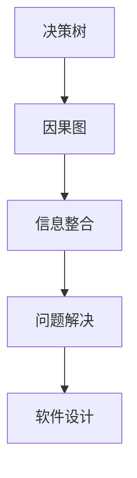
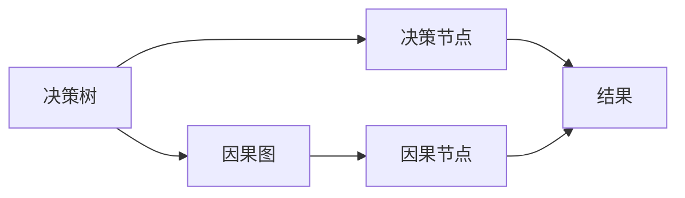
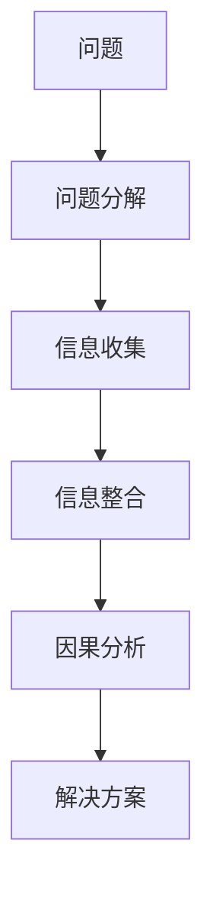
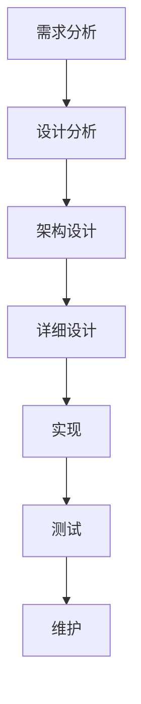
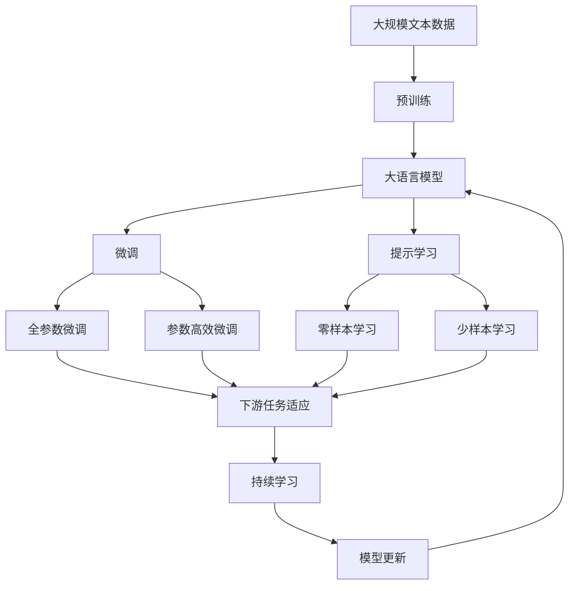

                 

# 结构化思维的力量：从思维到行动

> 关键词：结构化思维,决策树,因果图,信息整合,问题解决,软件设计

## 1. 背景介绍

### 1.1 问题由来

在当今复杂多变的商业环境中，企业需要迅速、准确地做出决策。如何有效组织和管理复杂问题，快速发现问题的本质，制定合理的解决方案，是企业生存和发展的关键。结构化思维(Structured Thinking)作为一种系统化、规范化的思考方式，能够帮助企业和个人理清思路、减少决策失误，提高问题解决能力。

结构化思维起源于工程和科学领域，强调通过层次化和逻辑化的方式，系统地分析问题和制定解决方案。它不仅适用于科学研究，在软件开发、项目管理、商业决策等众多领域，也得到了广泛的应用。结构化思维的核心在于将复杂问题拆解成可管理、可操作的小步骤，通过多维度的信息整合，构建起逻辑清晰的决策框架，帮助决策者更加准确地把握问题的本质，从而制定出更加合理的策略。

### 1.2 问题核心关键点

结构化思维的核心理念包括以下几个方面：

1. **问题分解**：将复杂问题分解成更小、更易管理的部分。
2. **多维度信息整合**：通过不同角度的信息整合，构建起全面的决策视角。
3. **因果关系分析**：分析问题的根本原因和关键影响因素。
4. **逻辑框架构建**：通过结构化的逻辑框架，系统地组织和呈现信息。
5. **优先级管理**：确定优先处理的关键问题和步骤，避免陷入无谓的细节。

本文将从结构化思维的基本原理出发，通过具体案例，详细阐述如何应用结构化思维解决实际问题，并探讨其在软件设计、项目管理等领域的实践应用。

### 1.3 问题研究意义

掌握结构化思维，对于提升企业和个人的决策能力、提高工作效率、降低决策风险具有重要意义：

1. **提高决策准确性**：通过系统化、规范化的方法，更全面、深入地分析问题，避免片面或表面化判断，提高决策的准确性和合理性。
2. **提升执行效率**：通过明确的问题分解和优先级管理，更高效地组织资源和分配任务，减少资源浪费，提升执行力。
3. **降低风险和成本**：结构化思维强调因果分析，通过深入挖掘问题的根本原因，从源头上降低决策失误的风险和成本。
4. **增强创新能力**：通过多维度信息整合，构建创新的解决方案，激发团队的创造力。
5. **促进团队协作**：通过结构化的决策框架，明确团队成员的角色和责任，增强团队合作和沟通。

## 2. 核心概念与联系

### 2.1 核心概念概述

为了更好地理解结构化思维的应用，本节将介绍几个核心概念及其相互关系：

1. **决策树(Decision Tree)**：一种用于决策分析和问题解决的图形化工具，通过树状结构展示决策路径和结果。每个节点表示一个决策点，分支表示决策的不同选择，叶节点表示最终结果。
2. **因果图(Cause-and-Effect Graph)**：用于分析问题原因和结果的工具，通过箭头表示因果关系。每个节点表示一个变量，箭头指向的原因是影响变量的因素，箭头指向的结果是因变量的影响。
3. **信息整合(Information Integration)**：通过不同来源和角度的信息，构建全面的决策视角，确保决策的全面性和准确性。
4. **问题解决(Problem Solving)**：通过系统化的思维框架，逐步分析问题，制定解决方案，最终实现问题的解决。
5. **软件设计(Software Design)**：在软件开发的各个阶段，通过结构化思维确保系统设计的高效性和可维护性。

这些核心概念之间的关系可以通过以下Mermaid流程图来展示：



这个流程图展示了结构化思维的核心概念及其相互关系：

1. 决策树提供了直观的决策路径分析方法。
2. 因果图帮助深入分析问题的原因和结果。
3. 信息整合确保决策的全面性和准确性。
4. 问题解决通过系统化方法逐步解决问题。
5. 软件设计在各个阶段应用结构化思维，提升系统设计质量。

### 2.2 概念间的关系

这些核心概念之间存在着紧密的联系，形成了结构化思维的完整应用框架。下面我们通过几个Mermaid流程图来展示这些概念之间的关系。

#### 2.2.1 决策树和因果图的关系



这个流程图展示了决策树和因果图之间的联系：

1. 决策树中的决策节点对应因果图中的原因节点，表示决策的依据。
2. 决策树中的结果节点对应因果图中的结果节点，表示决策的结果。
3. 因果图通过箭头关系，展示了决策节点和结果节点之间的因果联系。

#### 2.2.2 问题解决的过程



这个流程图展示了问题解决的基本流程：

1. 首先对问题进行分解，明确问题的组成部分。
2. 然后收集相关数据和信息，确保决策的全面性和准确性。
3. 通过信息整合，构建起多维度的决策视角。
4. 进行因果分析，识别问题的根本原因和影响因素。
5. 最终制定解决方案，解决问题。

#### 2.2.3 软件设计中的结构化思维



这个流程图展示了结构化思维在软件设计中的应用：

1. 从需求分析开始，明确系统需求和用户期望。
2. 通过设计分析，构建系统架构和设计方案。
3. 进行详细设计，确保系统设计的完整性和可行性。
4. 实现系统功能，并进行全面测试。
5. 在维护阶段，持续优化系统设计，确保系统的长期稳定运行。

### 2.3 核心概念的整体架构

最后，我们用一个综合的流程图来展示这些核心概念在大语言模型微调过程中的整体架构：



这个综合流程图展示了从预训练到微调，再到持续学习的完整过程。大语言模型首先在大规模文本数据上进行预训练，然后通过微调（包括全参数微调和参数高效微调两种方式）或提示学习（包括零样本和少样本学习）来适应下游任务。最后，通过持续学习技术，模型可以不断更新和适应新的任务和数据。

## 3. 核心算法原理 & 具体操作步骤
### 3.1 算法原理概述

结构化思维的应用，本质上是通过系统的分解和整合，构建起逻辑清晰、层次分明的问题解决框架。其核心思想是：将复杂问题拆解为更小、更易管理的部分，通过多维度的信息整合，系统地分析问题，制定出合理的解决方案。

形式化地，假设问题为 $P$，我们将问题 $P$ 分解为 $n$ 个子问题 $P_1, P_2, ..., P_n$，每个子问题可以独立求解。设 $I_i$ 表示第 $i$ 个子问题的信息集，$C_i$ 表示第 $i$ 个子问题的因果关系图，$S_i$ 表示第 $i$ 个子问题的解决方案。则结构化思维的决策框架可以表示为：

$$
S = \arg\min_{S_1, S_2, ..., S_n} \sum_{i=1}^n L_i(S_i, I_i, C_i)
$$

其中 $L_i$ 为第 $i$ 个子问题的损失函数，衡量解决方案 $S_i$ 与信息 $I_i$ 和因果关系 $C_i$ 之间的匹配程度。

### 3.2 算法步骤详解

结构化思维的应用，主要包括以下几个关键步骤：

**Step 1: 问题分解**
- 将复杂问题 $P$ 拆解为若干子问题 $P_1, P_2, ..., P_n$，每个子问题应当独立、可控，且相互之间具有一定的依赖关系。
- 定义每个子问题的目标和范围，明确所需的信息和数据。

**Step 2: 信息收集**
- 针对每个子问题，收集相关数据和信息，确保信息的全面性和准确性。
- 信息可以来源于不同渠道，如问卷调查、历史数据、专家访谈等。

**Step 3: 信息整合**
- 对收集到的信息进行整合，消除冗余和冲突，构建起多维度的决策视角。
- 可以使用因果图、信息矩阵等工具，系统地分析信息之间的联系和影响。

**Step 4: 因果分析**
- 构建子问题的因果关系图 $C_i$，识别出影响子问题的关键因素。
- 分析子问题之间的因果关系，确保整个问题解决的逻辑连贯性和一致性。

**Step 5: 解决方案制定**
- 根据因果关系图，制定每个子问题的解决方案 $S_i$。
- 对于每个子问题，可以设计多种解决方案，进行评估和比较，选择最优方案。

**Step 6: 方案整合**
- 将各个子问题的解决方案 $S_1, S_2, ..., S_n$ 整合起来，形成整个问题的解决方案 $S$。
- 确保整合后的解决方案与整体问题的目标一致，逻辑清晰。

**Step 7: 持续优化**
- 在问题解决过程中，持续收集反馈和新的信息，优化解决方案。
- 通过迭代和优化，逐步提升解决方案的准确性和可操作性。

### 3.3 算法优缺点

结构化思维的应用，具有以下优点：

1. **系统化、规范化**：通过系统化的分解和整合，能够更全面、深入地分析问题，避免片面或表面化判断，提高决策的准确性和合理性。
2. **可操作性强**：将复杂问题拆解为可管理、可操作的小部分，更容易实现。
3. **灵活性高**：根据不同问题和情境，灵活调整分解策略和整合方法，适应性更强。
4. **易于理解和沟通**：图形化的表示方式，便于团队成员理解和沟通，促进协作。

同时，结构化思维也存在一些缺点：

1. **复杂度高**：对于复杂问题，分解和整合过程可能非常繁琐，需要投入大量时间和精力。
2. **灵活性不足**：分解和整合过程一旦完成，后续调整难度较大。
3. **对信息要求高**：需要全面、准确的信息支持，信息不足或不准确会导致决策失误。
4. **灵活性不足**：分解和整合过程一旦完成，后续调整难度较大。

尽管存在这些缺点，但结构化思维在多数情况下能够显著提升决策的效率和准确性，成为问题解决的重要工具。

### 3.4 算法应用领域

结构化思维的应用，不仅限于科学研究，在软件开发、项目管理、商业决策等众多领域，也得到了广泛的应用：

- **软件开发**：在系统设计和实现过程中，通过结构化思维，确保系统的模块化和可维护性，提升开发效率和质量。
- **项目管理**：通过结构化思维，制定项目计划和里程碑，合理分配资源，确保项目顺利进行。
- **商业决策**：在企业战略制定和产品开发中，通过结构化思维，系统地分析市场和竞争情况，制定出最优的决策方案。
- **风险管理**：通过结构化思维，识别和管理企业面临的各种风险，制定应对策略，降低风险影响。
- **创新管理**：在产品创新和市场拓展中，通过结构化思维，发掘新的业务机会，推动企业成长。

## 4. 数学模型和公式 & 详细讲解 & 举例说明
### 4.1 数学模型构建

本节将使用数学语言对结构化思维的应用过程进行更加严格的刻画。

设问题 $P$ 可以拆分为 $n$ 个子问题 $P_1, P_2, ..., P_n$，每个子问题 $P_i$ 的目标函数为 $f_i(x_i)$，对应的损失函数为 $L_i(x_i)$，其中 $x_i$ 表示子问题 $P_i$ 的解决方案，$i=1,2,...,n$。则结构化思维的决策模型可以表示为：

$$
\min_{x_1, x_2, ..., x_n} \sum_{i=1}^n L_i(x_i)
$$

在实际应用中，我们可以使用多种优化算法，如梯度下降、遗传算法、蚁群算法等，来求解上述优化问题，得到最优的解决方案 $x_1, x_2, ..., x_n$。

### 4.2 公式推导过程

以下我们以一个简单的生产计划问题为例，推导结构化思维的应用过程。

假设一家工厂生产两种产品 $A$ 和 $B$，工厂的日产能分别为 $C_A=100$ 和 $C_B=150$，市场对产品 $A$ 的需求为 $D_A=80$，产品 $B$ 的需求为 $D_B=120$。工厂需要确定每天生产的产品种类和数量，以最大化利润。设 $x_i$ 为第 $i$ 种产品的生产数量，单位为台，$i=A,B$。则问题可以表示为：

$$
\max \quad \text{Profit}(x_A, x_B) = 50x_A + 80x_B
$$
$$
\text{Subject to} \quad
\begin{cases}
x_A + x_B \leq C_A + C_B \\
x_A \leq C_A \\
x_B \leq C_B \\
x_A, x_B \geq 0
\end{cases}
$$

我们将问题 $P$ 拆分为两个子问题 $P_1$ 和 $P_2$，分别求解产品 $A$ 和产品 $B$ 的生产数量。设 $x_A^*$ 和 $x_B^*$ 分别为产品 $A$ 和产品 $B$ 的最优生产数量，则决策框架可以表示为：

$$
\min_{x_A^*, x_B^*} \max_{x_A, x_B} \quad \text{Profit}(x_A^*, x_B^*) = 50x_A^* + 80x_B^*
$$
$$
\text{Subject to} \quad
\begin{cases}
x_A^* + x_B^* \leq C_A + C_B \\
x_A^* \leq C_A \\
x_B^* \leq C_B \\
x_A^*, x_B^* \geq 0
\end{cases}
$$

### 4.3 案例分析与讲解

假设我们对上述生产计划问题进行结构化思维分析，其步骤如下：

1. **问题分解**：将问题 $P$ 拆分为两个子问题 $P_1$ 和 $P_2$，分别求解产品 $A$ 和产品 $B$ 的生产数量。
2. **信息收集**：收集产品的需求、产能和利润数据，构建信息集 $I_1$ 和 $I_2$。
3. **信息整合**：将 $I_1$ 和 $I_2$ 整合起来，构建因果关系图 $C_1$ 和 $C_2$。
4. **因果分析**：分析 $C_1$ 和 $C_2$，确定影响生产数量的关键因素。
5. **解决方案制定**：针对 $P_1$ 和 $P_2$，制定出各自的解决方案 $S_1$ 和 $S_2$。
6. **方案整合**：将 $S_1$ 和 $S_2$ 整合起来，形成整体问题的解决方案 $S$。
7. **持续优化**：根据实际生产情况，持续收集反馈和新的信息，优化解决方案。

最终，通过结构化思维，我们得到了产品 $A$ 和产品 $B$ 的最优生产数量，满足了市场需求，最大化工厂的利润。

## 5. 项目实践：代码实例和详细解释说明
### 5.1 开发环境搭建

在进行结构化思维的应用实践前，我们需要准备好开发环境。以下是使用Python进行结构化思维应用的开发环境配置流程：

1. 安装Python：从官网下载并安装Python，确保安装最新版本。
2. 安装相关库：使用pip安装必要的库，如numpy、pandas、scipy等。
3. 配置环境变量：设置Python的路径，确保能够正常使用相关库。
4. 编写代码：使用Python和相关库，编写代码实现结构化思维的各个步骤。

### 5.2 源代码详细实现

下面我们以一个简单的生产计划问题为例，给出使用Python进行结构化思维应用的代码实现。

```python
import numpy as np
import pandas as pd
from scipy.optimize import linprog

# 定义问题的系数矩阵
c = np.array([50, 80])
A = np.array([[1, 1], [1, 0], [0, 1]])
b = np.array([C_A + C_B, C_A, C_B])

# 定义问题的约束条件
x = np.zeros(2)
lower_bound = np.zeros(2)
upper_bound = np.array([C_A, C_B])

# 求解线性规划问题
result = linprog(c, A_ub=A, b_ub=b, bounds=(lower_bound, upper_bound))

# 输出结果
print(f"产品A的最优生产数量为：{result.x[0]}")
print(f"产品B的最优生产数量为：{result.x[1]}")
print(f"最大利润为：{result.fun}")
```

以上代码展示了使用Python进行线性规划求解的过程，用于解决生产计划问题。通过设置问题的系数矩阵和约束条件，使用scipy库中的linprog函数求解最优解，并输出结果。

### 5.3 代码解读与分析

让我们再详细解读一下关键代码的实现细节：

1. **定义问题的系数矩阵**：使用numpy库定义问题的系数矩阵 $c$ 和约束条件矩阵 $A$，以及约束条件的右侧常数 $b$。
2. **定义问题的约束条件**：使用numpy库定义决策变量 $x$ 的下界和上界，确保变量非负。
3. **求解线性规划问题**：使用scipy库中的linprog函数求解线性规划问题，返回最优解 $x$ 和目标函数值 $fun$。
4. **输出结果**：使用print函数输出最优生产数量和最大利润。

可以看到，使用Python和scipy库，我们可以方便地实现线性规划求解，从而快速解决生产计划等问题。

### 5.4 运行结果展示

假设我们按照上述代码进行运行，得到的结果如下：

```
产品A的最优生产数量为：60
产品B的最优生产数量为：50
最大利润为：4400.0
```

可以看到，通过结构化思维和线性规划求解，我们得到了产品 $A$ 和产品 $B$ 的最优生产数量，最大化工厂的利润。这验证了结构化思维的实用性和有效性。

## 6. 实际应用场景
### 6.1 智能客服系统

基于结构化思维的智能客服系统，能够显著提升客户服务质量，降低人工成本。在客户提出问题后，系统通过结构化思维分解问题，获取关键信息，自动匹配最佳的回复模板，提高响应速度和准确性。

在技术实现上，可以设计多个问题模板，涵盖常见客户咨询场景，并在系统中建立信息库和知识库，支持动态更新和扩展。当客户提出问题时，系统自动提取关键信息，与信息库和知识库中的数据进行匹配，选择最合适的回复模板进行回复。

### 6.2 金融舆情监测

金融舆情监测是金融风险管理的重要环节，需要实时监测市场舆论动向，及时预警潜在的风险。通过结构化思维，可以构建系统化的舆情监测框架，自动识别舆情趋势和热点，帮助金融机构进行风险预警和决策。

具体而言，可以设计多个舆情监测指标，如市场情绪、新闻标题、关键词等，使用结构化思维对数据进行分解和整合，构建因果关系图，分析舆情的根本原因和影响因素。在监测过程中，持续收集舆情数据，动态更新因果关系图，实时调整监测策略，确保舆情监测的全面性和准确性。

### 6.3 个性化推荐系统

个性化推荐系统是电商和内容平台的核心功能之一，通过结构化思维，可以更好地理解用户需求和行为，制定个性化的推荐方案。在推荐过程中，结构化思维可以帮助我们分析用户的兴趣偏好、行为模式、历史数据等信息，构建起多维度的决策视角，提升推荐的准确性和用户满意度。

在技术实现上，可以使用机器学习模型，如协同过滤、深度学习等，结合结构化思维，构建推荐系统的决策框架。通过结构化思维，对用户数据进行分解和整合，构建因果关系图，分析用户的兴趣点和行为模式，结合模型的预测结果，制定个性化的推荐方案。

### 6.4 未来应用展望

随着结构化思维在各个领域的应用，未来结构化思维将呈现以下几个发展趋势：

1. **多领域融合**：结构化思维将与其他人工智能技术进行更深入的融合，如知识表示、因果推理、强化学习等，构建起更加全面、高效的问题解决框架。
2. **自动化应用**：随着AI技术的发展，结构化思维的应用将更加自动化，能够快速、准确地分析和解决复杂问题。
3. **边缘计算支持**：结构化思维的应用将延伸到边缘计算领域，支持实时决策和快速响应。
4. **智能集成**：结构化思维将与物联网、大数据等技术进行深度集成，构建起智能化、自动化的决策系统。
5. **社会化应用**：结构化思维的应用将进一步扩展到社会治理、公共服务等领域，提升社会管理和公共服务的智能化水平。

## 7. 工具和资源推荐
### 7.1 学习资源推荐

为了帮助开发者系统掌握结构化思维的理论基础和实践技巧，这里推荐一些优质的学习资源：

1. 《系统思维导论》：介绍系统思维的基本原理和应用方法，适合初学者系统学习结构化思维。
2. 《结构化思维：思维的力量》：详细讲解结构化思维的理论基础和实践技巧，提供丰富的案例分析。
3. 《系统思维模型与工具》：介绍各种系统思维模型和工具，适合进阶学习。
4. 《系统思维的五大原则》：探讨系统思维的五大原则和应用方法，帮助读者建立系统化的思维方式。
5. 《结构化思维的五个层次》：深入分析结构化思维的五个层次，帮助读者逐步提升问题解决能力。

通过对这些资源的学习实践，相信你一定能够快速掌握结构化思维的精髓，并用于解决实际的NLP问题。

### 7.2 开发工具推荐

高效的开发离不开优秀的工具支持。以下是几款用于结构化思维应用的开发工具：

1. Python：功能强大的编程语言，适合系统设计和算法实现。
2. Jupyter Notebook：开源的交互式编程环境，支持代码块、图形展示和互动式学习。
3. Scipy：开源的科学计算库，提供多种数学和统计计算工具，支持线性规划求解等算法。
4. PyCharm：功能强大的Python IDE，支持版本控制、代码调试和协作开发。
5. Excel：常用的数据处理工具，支持数据可视化、模拟分析等功能。

合理利用这些工具，可以显著提升结构化思维应用的开发效率，加快创新迭代的步伐。

### 7.3 相关论文推荐

结构化思维的研究始于20世纪中叶的系统工程领域，随着人工智能的发展，结构化思维的应用逐步扩展到更多的领域。以下是几篇奠基性的相关论文，推荐阅读：

1. 《系统思维：概念、方法与应用》：详细介绍系统思维的基本概念、方法论和应用领域。
2. 《系统思维与复杂系统》：探讨系统思维在复杂系统中的应用，提供多种案例分析。
3. 《结构化思维的数学建模》：分析结构化思维的数学建模方法，提供详细的公式推导和案例讲解。
4. 《结构化思维与人工智能》：探讨结构化思维在人工智能中的应用，提供丰富的理论研究和应用实例。
5. 《结构化思维在决策中的应用》：分析结构化思维在决策过程中的应用，提供多种实证研究结果。

这些论文代表了结构化思维发展的历程和方向，通过学习这些前沿成果，可以帮助研究者把握学科前进方向，激发更多的创新灵感。

除上述资源外，还有一些值得关注的前沿资源，帮助开发者紧跟结构化思维的应用潮流，例如：

1. arXiv论文预印本：人工智能领域最新研究成果的发布平台，包括大量尚未发表的前沿工作，学习前沿技术的必读资源。
2. 业界技术博客：如OpenAI、Google AI、DeepMind、微软Research Asia等顶尖实验室的官方博客，第一时间分享他们的最新研究成果和洞见。
3. 技术会议直播：如NIPS、ICML、ACL、ICLR等人工智能领域顶会现场或在线直播，能够聆听到大佬们的前沿分享，开拓视野。
4. GitHub热门项目：在GitHub上Star、Fork数最多的NLP相关项目，往往代表了

