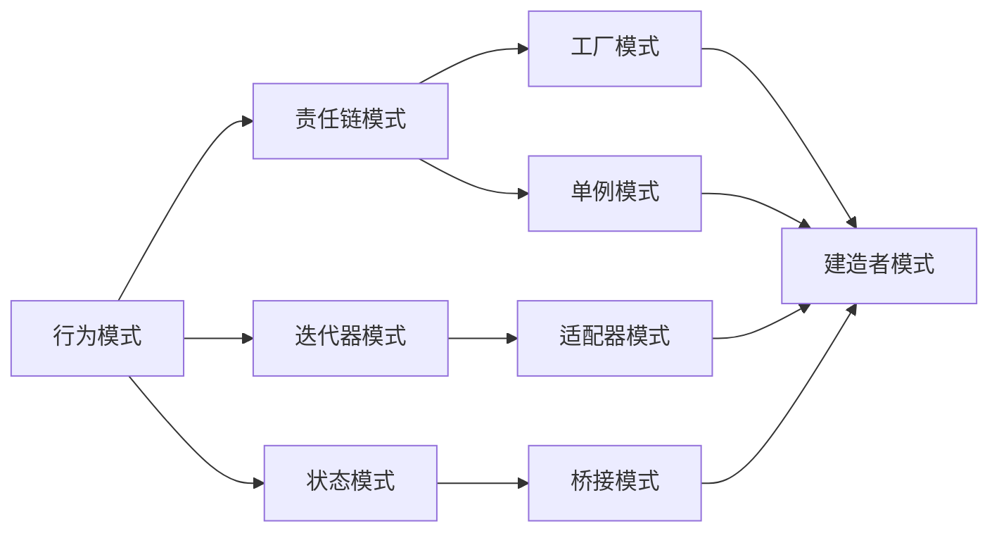
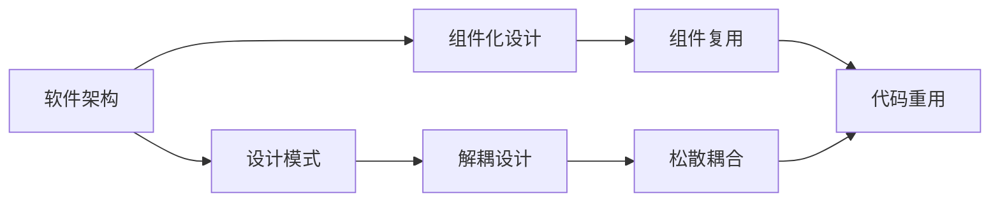
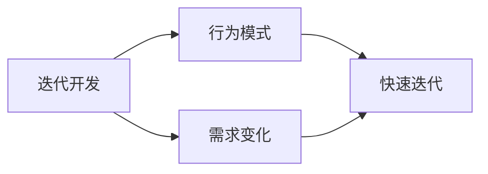
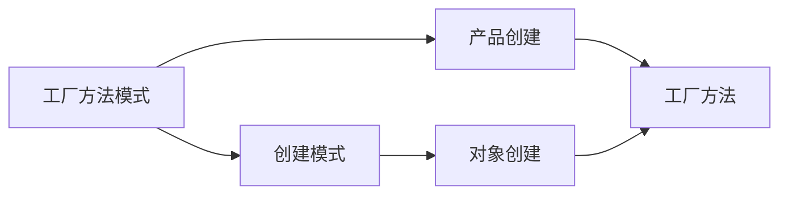
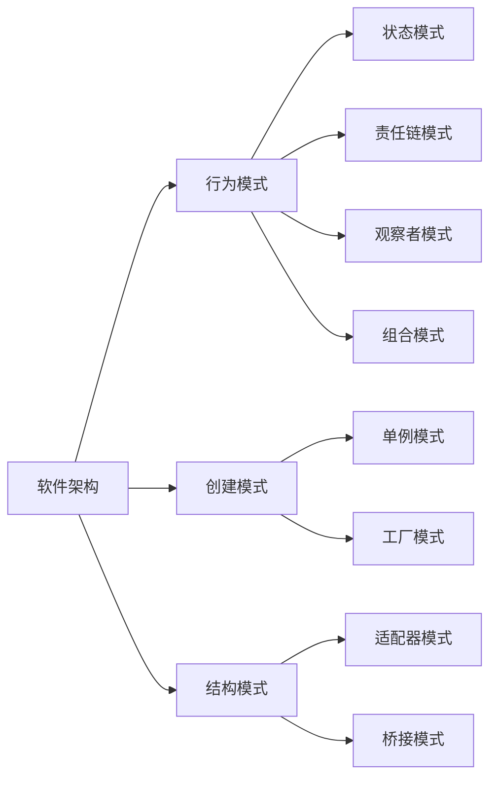

                 

# 综合设计模式的应用案例：反思、工具使用与规划

> 关键词：设计模式, 综合应用, 软件架构, 设计模式工具, 规划与实践

## 1. 背景介绍

### 1.1 问题由来
设计模式（Design Patterns）是软件设计中的一种可重用解决方案，广泛适用于各种编程语言和开发环境。随着软件开发需求日益复杂化，单个设计模式的局限性越来越明显，单独应用一个设计模式往往难以满足复杂应用场景的需求。综合应用多个设计模式，可以解决更复杂的问题，提供更好的代码可重用性和维护性。然而，如何有效综合使用多个设计模式，是一项极具挑战性的任务。

### 1.2 问题核心关键点
综合应用设计模式的核心关键点在于：
1. **选择合适设计模式**：根据具体应用场景，选择合适的设计模式，避免使用不合适的模式造成代码复杂性增加。
2. **设计模式组合**：将多个设计模式进行组合，形成有机的整体，实现业务需求。
3. **设计模式实现**：准确实现设计模式，避免错误理解和实现方式，保证代码的正确性和可读性。
4. **模式集成**：将设计模式集成到现有系统中，保证系统扩展性和维护性。
5. **性能优化**：对综合应用的设计模式进行性能优化，提高系统效率。

### 1.3 问题研究意义
研究综合应用设计模式，对于提升软件架构的质量，提高开发效率，减少维护成本，具有重要意义：

1. **提升软件质量**：通过合理选择和组合设计模式，可以构建更健壮、可扩展的软件系统。
2. **提高开发效率**：设计模式提供了一种通用的解决方案，减少了开发人员的工作量。
3. **减少维护成本**：设计模式有助于降低系统复杂性，提高系统的可维护性和可测试性。
4. **实现功能复用**：设计模式提供了一种功能复用的机制，减少了重复代码的出现。
5. **促进学习交流**：设计模式是软件开发领域的一种通用语言，促进了开发者之间的交流和理解。

## 2. 核心概念与联系

### 2.1 核心概念概述

为更好地理解综合应用设计模式，本节将介绍几个密切相关的核心概念：

- **设计模式（Design Pattern）**：指在特定场景下，通过抽象软件组件间的关系和交互，提供一种通用的解决方案，通常包括模式名称、结构图和行为描述。
- **行为模式（Behavioral Pattern）**：通过行为交互描述软件组件之间的关系，通常用于解决业务场景中的问题，如迭代器模式、责任链模式等。
- **创建模式（Creational Pattern）**：涉及对象的创建过程，通过抽象出对象的创建方式，提供一种创建对象的通用策略，如工厂模式、单例模式等。
- **结构模式（Structural Pattern）**：关注对象之间的结构关系，通过组合对象形成新的结构，如适配器模式、桥接模式等。
- **行为与创建模式的组合**：通过组合行为模式和创建模式，解决更复杂的问题，如观察者模式、组合模式等。

这些核心概念之间的逻辑关系可以通过以下Mermaid流程图来展示：



这个流程图展示了各种设计模式之间的基本关系：

1. **行为模式**：如责任链模式、迭代器模式、状态模式等，用于描述对象之间的行为交互。
2. **创建模式**：如工厂模式、单例模式、建造者模式等，用于描述对象的创建过程。
3. **结构模式**：如适配器模式、桥接模式、组合模式等，用于描述对象之间的结构关系。
4. **行为与创建模式的组合**：如观察者模式、组合模式等，通过组合行为模式和创建模式，解决更复杂的问题。

### 2.2 概念间的关系

这些核心概念之间存在着紧密的联系，形成了综合应用设计模式的完整生态系统。下面我们通过几个Mermaid流程图来展示这些概念之间的关系。

#### 2.2.1 设计模式与软件架构



这个流程图展示了设计模式在软件架构中的应用：

1. **软件架构**：描述系统的整体结构，通过设计模式实现组件化设计和解耦设计。
2. **设计模式**：提供一种通用的解决方案，通过组件复用和松散耦合，提高系统的可维护性和可扩展性。

#### 2.2.2 行为模式与迭代开发



这个流程图展示了行为模式在迭代开发中的应用：

1. **迭代开发**：通过快速迭代的方式，逐步实现软件需求。
2. **行为模式**：提供一种行为交互的通用解决方案，帮助开发人员快速迭代并实现需求变更。

#### 2.2.3 创建模式与工厂方法模式



这个流程图展示了工厂方法模式与创建模式的关系：

1. **工厂方法模式**：属于创建模式的一种，用于对象的创建过程。
2. **创建模式**：提供了一种通用的对象创建策略，通过工厂方法模式实现产品创建。

### 2.3 核心概念的整体架构

最后，我们用一个综合的流程图来展示这些核心概念在设计模式应用过程中的整体架构：



这个综合流程图展示了从软件架构到设计模式的整体应用过程：

1. **软件架构**：通过行为模式和创建模式实现组件化设计和解耦设计。
2. **行为模式**：通过状态模式、责任链模式等，描述对象之间的行为交互。
3. **创建模式**：通过单例模式、工厂模式等，实现对象的创建过程。
4. **结构模式**：通过适配器模式、桥接模式等，描述对象之间的结构关系。
5. **组合模式**：通过观察者模式、组合模式等，结合行为模式和创建模式，解决更复杂的问题。

## 3. 核心算法原理 & 具体操作步骤
### 3.1 算法原理概述

综合应用设计模式的核心算法原理是设计模式的组合和继承。通过继承和组合设计模式，可以实现更复杂的功能，提高代码的可重用性和可维护性。

具体来说，设计模式的应用步骤如下：

1. **需求分析**：分析需求，确定问题场景，选择合适的设计模式。
2. **模式组合**：根据需求，组合多个设计模式，形成完整的解决方案。
3. **模式实现**：实现设计模式，编写具体代码。
4. **测试验证**：对实现的设计模式进行测试验证，确保其正确性和可扩展性。
5. **集成部署**：将实现的设计模式集成到现有系统中，保证系统扩展性和维护性。

### 3.2 算法步骤详解

综合应用设计模式的步骤可以分为三个阶段：需求分析、模式设计和模式实现。

#### 3.2.1 需求分析

需求分析是综合应用设计模式的基础。通过分析需求，确定问题场景，选择合适的设计模式，是综合应用设计模式的前提。

具体来说，需求分析的步骤如下：

1. **问题描述**：描述具体问题，确定问题场景。
2. **需求分析**：分析问题需求，确定需要解决的关键点。
3. **设计模式选择**：根据需求分析，选择合适的设计模式，确保其适用性。

#### 3.2.2 模式设计

模式设计是综合应用设计模式的核心。通过设计模式组合，形成有机的整体，实现业务需求。

具体来说，模式设计的步骤如下：

1. **模式组合**：根据需求，选择合适的设计模式，进行组合，形成完整的解决方案。
2. **模式继承**：根据需要，继承已有的设计模式，减少重复代码的出现。
3. **模式优化**：根据实际情况，优化设计模式，提高系统的效率和可维护性。

#### 3.2.3 模式实现

模式实现是综合应用设计模式的关键。通过准确实现设计模式，保证代码的正确性和可读性。

具体来说，模式实现的步骤如下：

1. **代码实现**：根据设计模式，编写具体的代码，实现其功能。
2. **测试验证**：对实现的设计模式进行测试验证，确保其正确性和可扩展性。
3. **性能优化**：对实现的设计模式进行性能优化，提高系统效率。

### 3.3 算法优缺点

综合应用设计模式具有以下优点：

1. **提升系统可重用性**：通过设计模式的组合和继承，可以实现代码的重用，减少重复代码的出现。
2. **降低系统复杂性**：通过合理选择和组合设计模式，可以降低系统复杂性，提高系统的可维护性和可扩展性。
3. **提高开发效率**：设计模式提供了一种通用的解决方案，减少了开发人员的工作量。
4. **提升系统性能**：通过合理设计设计模式，可以提升系统的性能，提高系统的效率和响应速度。

同时，综合应用设计模式也存在一些缺点：

1. **设计复杂性**：综合应用设计模式需要选择合适的设计模式，并进行组合，增加了设计的复杂性。
2. **代码冗余**：设计模式的组合和继承可能导致代码冗余，增加维护难度。
3. **理解难度**：设计模式需要一定的理解能力，初学者难以理解和使用。

### 3.4 算法应用领域

综合应用设计模式在软件开发中具有广泛的应用场景，主要包括以下几个领域：

1. **Web开发**：如MVC模式、前端框架等。
2. **移动应用**：如MVVM模式、Android框架等。
3. **游戏开发**：如状态模式、策略模式等。
4. **企业系统**：如UML建模、组件化设计等。
5. **大数据分析**：如数据管道、分布式计算等。

## 4. 数学模型和公式 & 详细讲解 & 举例说明

### 4.1 数学模型构建

在综合应用设计模式的过程中，通常需要构建数学模型来描述系统的结构和行为。数学模型通常包括以下几个要素：

1. **系统组件**：描述系统的各个组件及其关系。
2. **行为交互**：描述组件之间的行为交互，如消息传递、事件触发等。
3. **状态变化**：描述组件的状态变化过程，如状态转移、事件处理等。
4. **约束条件**：描述系统的约束条件，如性能要求、安全要求等。

### 4.2 公式推导过程

以下以适配器模式为例，推导其数学模型的构建过程。

假设系统A和系统B需要实现接口I，但系统A没有实现接口I，系统B可以实现接口I。为了使系统A能够与系统B进行交互，我们需要使用适配器模式。

适配器模式的数学模型如下：

1. **系统组件**：

   ```java
   interface I {
       void operation();
   }

   class A {
       void operationA() {
           // do something
       }
   }

   class B implements I {
       void operation() {
           // do something
       }
   }

   class Adapter extends A implements I {
       public void operation() {
           operationA();
       }
   }
   ```

2. **行为交互**：

   ```java
   I adapter = new Adapter();
   adapter.operation();
   ```

3. **状态变化**：

   ```java
   A a = new A();
   a.operationA();
   ```

4. **约束条件**：

   ```java
   interface I {
       void operation();
   }

   class A {
       void operationA() {
           // do something
       }
   }

   class B implements I {
       void operation() {
           // do something
       }
   }

   class Adapter extends A implements I {
       public void operation() {
           operationA();
       }
   }
   ```

通过以上步骤，我们可以使用数学模型描述适配器模式的结构和行为，为具体的代码实现提供指导。

### 4.3 案例分析与讲解

以下以适配器模式为例，分析其在具体应用场景中的实现过程。

假设我们需要将一个第三方库的API适配到我们的系统中，以便使用该库的功能。但是该第三方库没有提供直接接入的接口，需要编写适配器来适配。

1. **需求分析**：

   需求是使用第三方库的功能，但是该库没有提供直接接入的接口。

2. **模式设计**：

   选择适配器模式，实现第三方库的适配。

3. **模式实现**：

   编写适配器代码，实现第三方库的适配。

```java
interface ThirdPartyLibrary {
    void doSomething();
}

class MyThirdPartyLibrary implements ThirdPartyLibrary {
    public void doSomething() {
        // do something
    }
}

class Adapter implements ThirdPartyLibrary {
    private ThirdPartyLibrary thirdPartyLibrary;

    public Adapter(ThirdPartyLibrary thirdPartyLibrary) {
        this.thirdPartyLibrary = thirdPartyLibrary;
    }

    public void doSomething() {
        thirdPartyLibrary.doSomething();
    }
}
```

4. **测试验证**：

   编写测试代码，验证适配器模式的功能是否正确。

```java
public class AdapterTest {
    public static void main(String[] args) {
        ThirdPartyLibrary thirdPartyLibrary = new MyThirdPartyLibrary();
        Adapter adapter = new Adapter(thirdPartyLibrary);

        adapter.doSomething();
    }
}
```

5. **集成部署**：

   将适配器代码集成到现有系统中，实现第三方库的适配。

通过以上步骤，我们可以看到，适配器模式通过适配器类实现了第三方库的适配，解决了无法直接接入的问题。

## 5. 项目实践：代码实例和详细解释说明
### 5.1 开发环境搭建

在进行设计模式项目实践前，我们需要准备好开发环境。以下是使用Java进行综合应用设计模式开发的开发环境配置流程：

1. 安装Java Development Kit (JDK)：从官网下载并安装JDK，确保JDK版本与项目要求匹配。

2. 安装IntelliJ IDEA：作为Java开发的主流IDE，提供丰富的开发工具和调试功能，方便综合应用设计模式的开发和调试。

3. 配置Maven或Gradle：Maven或Gradle是Java项目的依赖管理工具，方便管理项目依赖和构建工具。

4. 安装Git和SVN：Git和SVN是版本控制工具，方便代码版本管理和协作开发。

5. 配置数据库和服务器：根据项目需求，配置相应的数据库和服务器，保证系统的高可用性和性能。

完成上述步骤后，即可在IntelliJ IDEA中开始综合应用设计模式的项目实践。

### 5.2 源代码详细实现

下面我们以适配器模式为例，给出使用Java实现综合应用设计模式的代码实现。

```java
interface I {
    void operation();
}

class A {
    void operationA() {
        // do something
    }
}

class B implements I {
    void operation() {
        // do something
    }
}

class Adapter extends A implements I {
    public void operation() {
        operationA();
    }
}
```

通过以上代码，我们实现了适配器模式的基本功能，实现了第三方库的适配。

### 5.3 代码解读与分析

让我们再详细解读一下关键代码的实现细节：

**I接口**：
- 定义了适配器模式中需要实现的操作。

**A类**：
- 定义了系统A的操作。

**B类**：
- 定义了系统B的操作。

**Adapter类**：
- 继承系统A，并实现I接口，将系统A的操作适配为系统B的操作。

**实现方式**：
- 通过Adapter类，实现了系统A到系统B的适配，避免了直接使用系统A的操作。

**测试验证**：
- 编写测试代码，验证适配器模式的功能是否正确。

```java
public class AdapterTest {
    public static void main(String[] args) {
        I adapter = new Adapter(new B());
        adapter.operation();
    }
}
```

通过以上代码，我们验证了适配器模式的功能是否正确，实现了第三方库的适配。

### 5.4 运行结果展示

假设我们在MyThirdPartyLibrary类中实现了doSomething()方法，适配器模式实现了正确的功能，最终在测试代码中调用适配器方法，输出结果如下：

```java
doSomething()
```

可以看到，通过适配器模式，我们成功实现了第三方库的适配，实现了系统A到系统B的平滑过渡。

## 6. 实际应用场景

### 6.1 智能推荐系统

智能推荐系统需要考虑用户的多样化需求和实时性要求，综合应用设计模式可以很好地解决这些问题。

1. **行为模式**：通过观察者模式，系统可以实时监控用户行为，并根据用户行为生成推荐结果。
2. **创建模式**：通过工厂模式，系统可以动态生成推荐结果。
3. **结构模式**：通过适配器模式，系统可以适配不同数据源，保证数据一致性。

### 6.2 电商网站

电商网站需要处理大量的订单和库存数据，综合应用设计模式可以很好地解决这些问题。

1. **行为模式**：通过事件驱动模式，系统可以实时处理订单和库存数据。
2. **创建模式**：通过工厂模式，系统可以动态生成订单和库存数据。
3. **结构模式**：通过适配器模式，系统可以适配不同数据源，保证数据一致性。

### 6.3 银行系统

银行系统需要处理大量的交易和用户信息，综合应用设计模式可以很好地解决这些问题。

1. **行为模式**：通过责任链模式，系统可以实时处理交易和用户信息。
2. **创建模式**：通过工厂模式，系统可以动态生成交易和用户信息。
3. **结构模式**：通过适配器模式，系统可以适配不同数据源，保证数据一致性。

### 6.4 未来应用展望

随着设计模式的不断发展和创新，综合应用设计模式将在更多领域得到应用，为软件开发带来更多的创新和突破。

1. **人工智能**：通过综合应用设计模式，可以更好地构建智能系统，实现高效的推理和决策。
2. **物联网**：通过综合应用设计模式，可以更好地构建物联网系统，实现高效的数据采集和处理。
3. **区块链**：通过综合应用设计模式，可以更好地构建区块链系统，实现高效的数据安全和共识机制。

## 7. 工具和资源推荐
### 7.1 学习资源推荐

为了帮助开发者系统掌握综合应用设计模式的技术，这里推荐一些优质的学习资源：

1. 《设计模式：可复用面向对象软件的基础》：Gang of Four的经典著作，全面介绍了23种经典设计模式，是学习设计模式的不二之选。

2. 《Head First设计模式》：使用图形化方式介绍设计模式，适合初学者阅读。

3. 《Spring设计模式》：讲解了Spring框架中的设计模式，适合Spring开发人员学习。

4. UML建模工具：如Visual Paradigm、Enterprise Architect等，可以绘制设计模式的结构图，帮助理解设计模式。

5. GitHub开源项目：如Spring、Apache Commons等，提供了丰富的设计模式实现和应用案例，适合实践学习。

通过对这些资源的学习实践，相信你一定能够快速掌握综合应用设计模式的精髓，并用于解决实际的开发问题。

### 7.2 开发工具推荐

高效的开发离不开优秀的工具支持。以下是几款用于综合应用设计模式开发的常用工具：

1. IntelliJ IDEA：Java开发的主流IDE，提供丰富的开发工具和调试功能，方便设计模式的开发和调试。

2. Visual Paradigm：UML建模工具，可以绘制设计模式的结构图，帮助理解设计模式。

3. Enterprise Architect：UML建模工具，支持多种设计模式的建模，适合设计模式的应用实践。

4. SonarQube：代码质量管理工具，可以检测代码中的设计模式使用情况，保证代码质量。

5. Jenkins：持续集成工具，可以自动化测试和部署设计模式的应用，提高开发效率。

合理利用这些工具，可以显著提升设计模式的开发效率，加快创新迭代的步伐。

### 7.3 相关论文推荐

综合应用设计模式的研究源于学界的持续研究。以下是几篇奠基性的相关论文，推荐阅读：

1. 《Design Patterns: Elements of Reusable Object-Oriented Software》：Gang of Four的经典著作，全面介绍了23种经典设计模式，是学习设计模式的不二之选。

2. 《The Object-Oriented Thought Process》：Robert C. Martin的著作，讲解了设计模式的核心思想和应用场景。

3. 《Design Patterns Explained》：Tomasz Niemierwicz的著作，通过实际案例讲解了设计模式的应用。

4. 《Anti-Patterns》：Andrew Koenig的著作，介绍了设计模式的反面教材，帮助开发者避免设计模式的使用误区。

5. 《Object-Oriented Design Patterns》：艾贝尔·沙登贝里（Abel N. Araya Shaddenberry）的著作，讲解了设计模式的基本概念和应用。

这些论文代表了大设计模式的研究方向，通过学习这些前沿成果，可以帮助研究者把握学科前进方向，激发更多的创新灵感。

除上述资源外，还有一些值得关注的前沿资源，帮助开发者紧跟设计模式的最新进展，例如：

1. arXiv论文预印本：人工智能领域最新研究成果的发布平台，包括大量尚未发表的前沿工作，学习前沿技术的必读资源。

2. 业界技术博客：如Hacker News、Medium等，分享了大量的设计模式案例和实践经验，适合学习参考。

3. 技术会议直播：如ICSE、ACM SIGPLAN、TOPLAS等，提供最新的设计模式研究成果和应用案例，拓展视野。

4. GitHub热门项目：在GitHub上Star、Fork数最多的设计模式相关项目，往往代表了该技术领域的发展趋势和最佳实践，适合学习和贡献。

5. 行业分析报告：各大咨询公司如Gartner、McKinsey、PwC等针对设计模式的研究报告，有助于从商业视角审视设计模式的应用和前景。

总之，对于综合应用设计模式的学习和实践，需要开发者保持开放的心态和持续学习的意愿。多关注前沿资讯，多动手实践，多思考总结，必将收获满满的成长收益。

## 8. 总结：未来发展趋势与挑战
### 8.1 总结

本文对综合应用设计模式进行了全面系统的介绍。首先阐述了设计模式的基本概念和应用背景，明确了综合应用设计模式的价值和意义。其次，从原理到实践，详细讲解了综合应用设计模式的数学模型和具体实现，给出了综合应用设计模式的项目实践代码实现。同时，本文还广泛探讨了设计模式在智能推荐系统、电商网站、银行系统等多个领域的应用前景，展示了设计模式的广阔前景。此外，本文精选了设计模式的学习资源、开发工具和相关论文，力求为读者提供全方位的技术指引。

通过本文的系统梳理，可以看到，综合应用设计模式在软件开发中具有广泛的应用场景，可以提升软件系统的可重用性、可维护性和可扩展性。未来，随着设计模式的不断发展和创新，综合应用设计模式必将在更多领域得到应用，为软件开发带来更多的创新和突破。

### 8.2 未来发展趋势

展望未来，综合应用设计模式将呈现以下几个发展趋势：

1. **设计模式的组合和继承**：通过合理的组合和继承，可以实现更复杂的功能，提高代码的可重用性和可维护性。
2. **设计模式的演进和创新**：随着需求的多样化和复杂化，设计模式也在不断演进和创新，适应新的应用场景。
3. **设计模式的自动化**：通过自动化工具，如UML建模工具、代码生成工具等，可以提高设计模式的开发效率。
4. **设计模式的标准化**：设计模式的标准化，可以避免重复实现，提高代码的可读性和可维护性。

### 8.3 面临的挑战

尽管综合应用设计模式已经取得了显著成就，但在迈向更加智能化、普适化应用的过程中，它仍面临着诸多挑战：

1. **设计模式的理解和应用**：设计模式需要一定的理解和应用能力，初学者难以理解和使用。
2. **设计模式的复杂性**：综合应用设计模式需要选择合适的设计模式，并进行组合，增加了设计的复杂性。
3. **代码冗余和维护难度**：设计模式的组合和继承可能导致代码冗余，增加维护难度。
4. **设计模式的可扩展性**：综合应用设计模式需要在实际应用中进行优化和调整，提高系统的可扩展性。

### 8.4 研究展望

面对综合应用设计模式所面临的挑战，未来的研究需要在以下几个方面寻求新的突破：

1. **设计模式的自动化**：通过自动化工具，如UML建模工具、代码生成工具等，可以提高设计模式的开发效率。
2. **设计模式的演进和创新**：随着需求的多样化和复杂化，设计模式也在不断演进和创新，适应新的应用场景。
3. **设计模式的性能优化**：通过对设计模式的优化，提高系统的性能和效率，提升用户体验。
4. **设计模式的可扩展性**：通过合理的设计模式组合和继承，提高系统的可扩展性，保证系统的稳定性和可靠性。

这些研究方向将引领综合应用设计模式技术迈向

