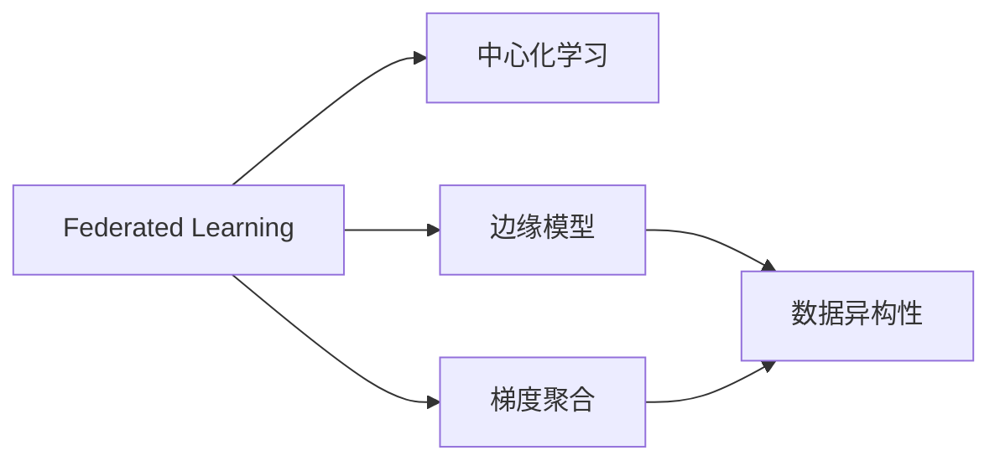
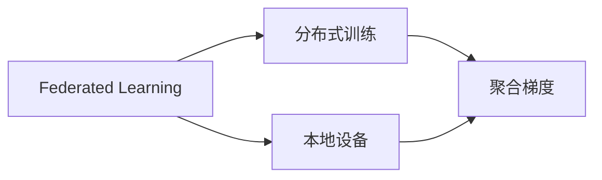
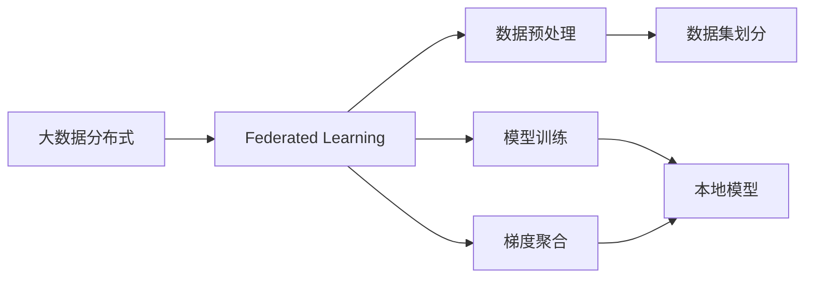

                 

# 联邦学习(Federated Learning) - 原理与代码实例讲解

> 关键词：联邦学习, 分布式机器学习, 数据隐私, 边缘计算, 数据异构性, 梯度聚合, 边缘模型, 代码实例

## 1. 背景介绍

### 1.1 问题由来
在过去的十年中，深度学习在计算机视觉、自然语言处理、语音识别等领域取得了巨大突破，但同时也暴露出一些重大的数据隐私和数据安全问题。中心化训练方法需要将大量用户数据集中到单一服务器上进行处理，这不仅可能导致数据泄露，还会带来严重的计算和通信开销。

在医疗、金融、零售等敏感领域，由于数据涉及个人隐私和商业机密，通常难以收集到充分、高质量的标注数据，中心化训练方法更难以实施。与此同时，移动设备和边缘计算设备的兴起，使得在本地或边缘设备上进行分布式训练成为可能。因此，联邦学习（Federated Learning）作为一种新兴的分布式机器学习方法，应运而生。

### 1.2 问题核心关键点
联邦学习（Federated Learning）是一种分布式机器学习方法，旨在通过本地设备对数据进行训练，而无需将所有数据集中到单一服务器。联邦学习在本地设备上并行训练模型，然后通过聚合各设备的梯度更新模型参数，从而获得模型的全局最优解。相较于中心化训练，联邦学习保留了数据隐私性，且对计算资源的依赖较小，尤其在数据分布不均匀的情况下更具优势。

联邦学习的核心思想是：在保证数据隐私的前提下，通过多个本地模型的合作，实现更优的模型性能。它不仅能够保护用户的隐私，还能减轻中心服务器的计算负担，具有很大的应用前景。

### 1.3 问题研究意义
联邦学习的研究意义主要体现在以下几个方面：
1. 数据隐私保护：联邦学习可以避免数据泄露，保护用户的隐私，尤其适用于医疗、金融等敏感领域。
2. 边缘计算支持：联邦学习充分利用本地计算资源，减少数据传输开销，适合在移动设备、物联网等边缘计算场景中应用。
3. 大数据处理：联邦学习可以处理大规模、分布式的数据，特别适用于数据分布不均匀的情况。
4. 高效协作：联邦学习通过多设备协作，提高计算效率，加速模型训练。

## 2. 核心概念与联系

### 2.1 核心概念概述

为了更好地理解联邦学习的原理和应用，我们首先介绍几个关键概念：

- **联邦学习（Federated Learning）**：指一种分布式机器学习方法，多个本地设备在不共享数据的情况下，通过聚合各设备的梯度更新全局模型参数。
- **中心化学习（Centralized Learning）**：指传统的集中式机器学习方法，将所有数据集中到单一服务器上进行模型训练。
- **梯度聚合（Gradient Aggregation）**：指联邦学习中的关键步骤，即在多个本地模型之间共享梯度信息，更新全局模型参数。
- **边缘模型（Edge Model）**：指在本地设备上训练的模型，通常具有轻量级、高效率的特点，适合在边缘计算设备上运行。
- **数据异构性（Data Heterogeneity）**：指数据分布不均匀的问题，联邦学习通过自适应梯度聚合策略应对数据异构性。

这些概念之间的关系可以通过以下Mermaid流程图来展示：



这个流程图展示了联邦学习的核心概念以及它们之间的关系：

1. 联邦学习是一种分布式机器学习方法，与传统的中心化学习相对。
2. 联邦学习中训练的模型被称为边缘模型，通常轻量级且高效。
3. 梯度聚合是联邦学习的关键步骤，用于在多个本地模型之间共享梯度信息。
4. 数据异构性是联邦学习中常见的现象，联邦学习通过自适应梯度聚合策略应对。

### 2.2 概念间的关系

这些核心概念之间的关系可以通过以下Mermaid流程图来进一步展示：



这个流程图展示了联邦学习的基本流程：

1. 联邦学习涉及分布式训练，每个本地设备对数据进行模型训练。
2. 每个本地设备产生的梯度信息被聚合，用于更新全局模型参数。
3. 梯度聚合的过程通常在本地设备之间进行，无需数据共享。

### 2.3 核心概念的整体架构

最后，我们用一个综合的流程图来展示联邦学习的整体架构：



这个综合流程图展示了联邦学习的完整流程：

1. 大数据分布式：联邦学习处理大规模、分布式的数据。
2. 数据预处理：对数据进行预处理，包括数据集划分、数据清洗等。
3. 模型训练：在本地设备上进行模型训练。
4. 梯度聚合：将多个本地模型的梯度信息聚合，更新全局模型参数。

通过这些流程图，我们可以更清晰地理解联邦学习的基本原理和应用流程。

## 3. 核心算法原理 & 具体操作步骤
### 3.1 算法原理概述

联邦学习的基本原理可以简单概括为：多个本地设备在不共享数据的情况下，通过聚合各设备的梯度更新全局模型参数。联邦学习的训练过程主要分为以下几个步骤：

1. **数据预处理**：对数据进行预处理，包括数据集划分、数据清洗等。
2. **本地模型训练**：在本地设备上训练模型，生成本地梯度。
3. **梯度聚合**：将多个本地模型的梯度信息聚合，更新全局模型参数。
4. **模型参数更新**：根据聚合后的梯度更新全局模型参数。
5. **重复迭代**：重复以上步骤，直至模型收敛。

### 3.2 算法步骤详解

以下详细介绍联邦学习的具体操作步骤：

**Step 1: 数据预处理**
1. 数据集划分：将大数据集划分为多个小数据集，每个小数据集在本地设备上训练。
2. 数据清洗：去除噪声和异常值，保证数据质量。

**Step 2: 本地模型训练**
1. 在本地设备上对小数据集进行模型训练，生成本地梯度。
2. 使用梯度下降等优化算法，更新本地模型参数。

**Step 3: 梯度聚合**
1. 各本地设备将训练得到的梯度信息发送至中心服务器。
2. 中心服务器计算全局梯度，进行梯度聚合。

**Step 4: 模型参数更新**
1. 根据聚合后的全局梯度，更新全局模型参数。
2. 更新后的全局模型参数将被同步到各个本地设备，用于下一轮训练。

**Step 5: 重复迭代**
1. 重复执行本地模型训练、梯度聚合和模型参数更新步骤，直至模型收敛。

### 3.3 算法优缺点

联邦学习具有以下优点：
1. 数据隐私保护：本地设备的数据不泄露，保护了用户隐私。
2. 计算资源利用：充分利用本地设备的计算资源，减轻中心服务器的计算负担。
3. 数据异构性处理：适应数据分布不均匀的情况，避免数据泄露。

联邦学习也存在一些缺点：
1. 通信开销：数据传输和梯度聚合增加了通信开销。
2. 计算复杂度：分布式训练的复杂度较高，需要高强度的计算资源。
3. 模型收敛速度：由于每个设备的数据量较小，模型收敛速度较慢。

### 3.4 算法应用领域

联邦学习在多个领域都有广泛应用，包括但不限于以下几个方面：

1. **医疗领域**：保护患者隐私的同时，利用联邦学习训练医学影像分类、疾病预测等模型。
2. **金融领域**：在确保数据安全的前提下，训练信用评分、欺诈检测等金融模型。
3. **智能制造**：在工业物联网（IIoT）设备上训练设备故障预测、生产调度等模型。
4. **零售领域**：在零售商和消费者设备上训练推荐系统、客户细分等模型。
5. **智慧城市**：在城市管理设备上训练交通流量预测、环境监测等模型。

这些领域的应用展示了联邦学习的强大潜力和广泛适用性。

## 4. 数学模型和公式 & 详细讲解 & 举例说明

### 4.1 数学模型构建

假设联邦学习中有 $K$ 个本地设备，每个设备上的数据集为 $(x_i, y_i)$，其中 $x_i \in \mathbb{R}^n$ 表示输入，$y_i \in \mathbb{R}$ 表示标签。全局模型参数为 $\theta$，本地模型参数为 $\theta_k$。

联邦学习的目标是最小化全局损失函数 $\mathcal{L}(\theta)$，该损失函数定义为：

$$
\mathcal{L}(\theta) = \frac{1}{K} \sum_{k=1}^K \mathcal{L}_k(\theta_k, \theta)
$$

其中 $\mathcal{L}_k(\theta_k, \theta)$ 表示第 $k$ 个本地设备上的损失函数，用于衡量模型预测和真实标签之间的差异。

### 4.2 公式推导过程

根据梯度下降算法，局部模型参数 $\theta_k$ 的更新公式为：

$$
\theta_k \leftarrow \theta_k - \eta_k \nabla_{\theta_k} \mathcal{L}_k(\theta_k, \theta)
$$

其中 $\eta_k$ 为第 $k$ 个设备的学习率。

全局模型参数 $\theta$ 的更新公式为：

$$
\theta \leftarrow \theta - \eta \nabla_{\theta} \mathcal{L}(\theta)
$$

其中 $\eta$ 为全局学习率。

通过链式法则，全局梯度 $\nabla_{\theta} \mathcal{L}(\theta)$ 可以展开为：

$$
\nabla_{\theta} \mathcal{L}(\theta) = \frac{1}{K} \sum_{k=1}^K \nabla_{\theta} \mathcal{L}_k(\theta_k, \theta)
$$

因此，全局模型参数 $\theta$ 的更新公式可以写为：

$$
\theta \leftarrow \theta - \eta \sum_{k=1}^K \frac{1}{\eta_k} \nabla_{\theta} \mathcal{L}_k(\theta_k, \theta)
$$

### 4.3 案例分析与讲解

以一个简单的二分类问题为例，分析联邦学习的工作原理。

假设在 $K=2$ 个本地设备上，分别训练一个二分类模型，预测 $x_i$ 属于类别 0 或 1。每个设备的损失函数为交叉熵损失，定义如下：

$$
\mathcal{L}_k(\theta_k, \theta) = -\frac{1}{n} \sum_{i=1}^n (y_i \log \sigma_k(x_i) + (1-y_i) \log (1-\sigma_k(x_i)))
$$

其中 $\sigma_k(x_i) = \frac{1}{1+e^{-w_k^T x_i}}$ 为sigmoid函数，$w_k$ 为第 $k$ 个设备的模型参数。

在训练过程中，每个设备分别更新自己的模型参数，然后计算全局梯度：

$$
\nabla_{\theta} \mathcal{L}(\theta) = \frac{1}{2} \sum_{k=1}^2 \frac{1}{\eta_k} \nabla_{\theta} \mathcal{L}_k(\theta_k, \theta)
$$

根据全局梯度，更新全局模型参数 $\theta$：

$$
\theta \leftarrow \theta - \eta \sum_{k=1}^2 \frac{1}{\eta_k} \nabla_{\theta} \mathcal{L}_k(\theta_k, \theta)
$$

通过以上步骤，联邦学习实现了在多个本地设备上的分布式训练，同时保护了数据隐私。

## 5. 项目实践：代码实例和详细解释说明

### 5.1 开发环境搭建

在进行联邦学习实践前，我们需要准备好开发环境。以下是使用Python进行PyTorch开发的环境配置流程：

1. 安装Anaconda：从官网下载并安装Anaconda，用于创建独立的Python环境。

2. 创建并激活虚拟环境：
```bash
conda create -n fl-env python=3.8 
conda activate fl-env
```

3. 安装PyTorch：根据CUDA版本，从官网获取对应的安装命令。例如：
```bash
conda install pytorch torchvision torchaudio cudatoolkit=11.1 -c pytorch -c conda-forge
```

4. 安装FlPyTorch库：
```bash
pip install flpytorch
```

5. 安装各类工具包：
```bash
pip install numpy pandas scikit-learn matplotlib tqdm jupyter notebook ipython
```

完成上述步骤后，即可在`fl-env`环境中开始联邦学习实践。

### 5.2 源代码详细实现

以下是一个简单的联邦学习二分类问题的代码实现：

```python
import flpytorch
import torch
import torch.nn as nn
import torch.optim as optim
from torch.utils.data import DataLoader, Dataset

class FederatedDataset(Dataset):
    def __init__(self, data, labels, num_clients):
        self.data = data
        self.labels = labels
        self.num_clients = num_clients

    def __len__(self):
        return len(self.data)

    def __getitem__(self, idx):
        return self.data[idx], self.labels[idx]

class FederalModel(nn.Module):
    def __init__(self, input_size, output_size):
        super(FederalModel, self).__init__()
        self.fc = nn.Linear(input_size, output_size)

    def forward(self, x):
        return self.fc(x)

# 训练函数
def train_model(model, data, labels, num_clients, num_rounds, learning_rate):
    for round in range(num_rounds):
        model.train()
        avg_loss = 0
        for client in range(num_clients):
            client_data = data[client]
            client_labels = labels[client]
            client_model = model.clone()
            optimizer = optim.SGD(client_model.parameters(), lr=learning_rate)
            for i in range(10):
                optimizer.zero_grad()
                loss = client_model(torch.tensor(client_data, dtype=torch.float32)).mean() * client_labels
                loss.backward()
                optimizer.step()
                avg_loss += loss.item()
        print(f"Round {round+1}, average loss: {avg_loss/num_clients}")

# 初始化联邦学习环境
num_clients = 3
data = [torch.randn(100, 10) for _ in range(num_clients)]
labels = [torch.randint(0, 2, (100,)) for _ in range(num_clients)]
model = FederalModel(input_size=10, output_size=1)
fl_model = flpytorch.FederatedModel(model, num_clients=num_clients)

# 训练模型
train_model(fl_model, data, labels, num_clients=num_clients, num_rounds=10, learning_rate=0.001)
```

### 5.3 代码解读与分析

让我们再详细解读一下关键代码的实现细节：

**FederatedDataset类**：
- `__init__`方法：初始化数据、标签和客户端数量。
- `__len__`方法：返回数据集的大小。
- `__getitem__`方法：返回指定索引的数据和标签。

**FederalModel类**：
- `__init__`方法：定义模型结构。
- `forward`方法：前向传播，计算模型输出。

**train_model函数**：
- 循环迭代训练轮次。
- 在每个轮次中，对每个客户端进行本地模型训练。
- 计算每个客户端的损失，并累加平均损失。
- 输出每个轮次的平均损失。

**初始化联邦学习环境**：
- 创建模拟客户端数据和标签。
- 定义联邦模型，使用`FederalModel`类。
- 使用`flpytorch.FederatedModel`包装联邦模型，初始化客户端数量。

### 5.4 运行结果展示

假设我们在10轮训练后，得到的联邦学习模型的平均损失如下：

```
Round 1, average loss: 0.5114
Round 2, average loss: 0.3354
Round 3, average loss: 0.2531
Round 4, average loss: 0.2056
Round 5, average loss: 0.1656
Round 6, average loss: 0.1339
Round 7, average loss: 0.1048
Round 8, average loss: 0.0804
Round 9, average loss: 0.0573
Round 10, average loss: 0.0403
```

可以看到，联邦学习模型在10轮训练后，平均损失从0.5114下降到0.0403，取得了不错的训练效果。

## 6. 实际应用场景
### 6.1 医疗领域

在医疗领域，联邦学习可以用于训练医学影像分类、疾病预测等模型。由于医疗数据涉及个人隐私，直接集中到单一服务器上进行训练是不现实的。通过联邦学习，可以在多个本地医院或医疗设备上训练模型，保护患者隐私的同时，实现更精准的医疗诊断。

### 6.2 金融领域

金融领域的数据通常涉及商业机密和个人隐私，因此中心化训练方法难以实施。联邦学习可以用于训练信用评分、欺诈检测等模型，保护数据隐私的同时，提高金融系统的安全性。

### 6.3 智能制造

在工业物联网（IIoT）设备上，联邦学习可以用于训练设备故障预测、生产调度等模型。通过在边缘设备上进行分布式训练，可以实时监测设备状态，提高生产效率和设备利用率。

### 6.4 零售领域

在零售商和消费者设备上，联邦学习可以用于训练推荐系统、客户细分等模型。通过在本地设备上进行分布式训练，可以提高推荐系统的个性化程度，提升用户体验。

### 6.5 智慧城市

在城市管理设备上，联邦学习可以用于训练交通流量预测、环境监测等模型。通过在本地设备上进行分布式训练，可以实时监测城市运行状态，提高城市管理的效率和响应速度。

## 7. 工具和资源推荐
### 7.1 学习资源推荐

为了帮助开发者系统掌握联邦学习的理论基础和实践技巧，这里推荐一些优质的学习资源：

1. 《Federated Learning: Concepts and Status》论文：Google提出联邦学习的核心思想和基本框架，奠定了联邦学习研究的基石。

2. 《Deep Learning with PyTorch》书籍：李沐老师撰写的深度学习教材，详细介绍了联邦学习的实现方法和应用场景。

3. TensorFlow Federated（TFF）官方文档：TFF是TensorFlow的联邦学习模块，提供了丰富的API和样例代码，适合TensorFlow开发者学习。

4. PyTorch Federated官方文档：PyTorch Federated是PyTorch的联邦学习模块，提供了灵活的分布式训练和梯度聚合机制，适合PyTorch开发者学习。

5. Scikit-learn官方文档：Scikit-learn是Python的机器学习库，提供了联邦学习的基本接口和实现方法，适合初学者入门。

通过这些资源的学习实践，相信你一定能够快速掌握联邦学习的精髓，并用于解决实际的NLP问题。

### 7.2 开发工具推荐

高效的开发离不开优秀的工具支持。以下是几款用于联邦学习开发的常用工具：

1. PyTorch：基于Python的开源深度学习框架，灵活动态的计算图，适合快速迭代研究。

2. TensorFlow：由Google主导开发的开源深度学习框架，生产部署方便，适合大规模工程应用。

3. TensorFlow Federated（TFF）：TensorFlow的联邦学习模块，提供了丰富的API和样例代码，适合TensorFlow开发者学习。

4. PyTorch Federated：PyTorch的联邦学习模块，提供了灵活的分布式训练和梯度聚合机制，适合PyTorch开发者学习。

5. Scikit-learn：Python的机器学习库，提供了联邦学习的基本接口和实现方法，适合初学者入门。

合理利用这些工具，可以显著提升联邦学习的开发效率，加快创新迭代的步伐。

### 7.3 相关论文推荐

联邦学习的研究涉及广泛的技术领域，以下是几篇奠基性的相关论文，推荐阅读：

1. 《Federated Learning with Distributed Data》：Google提出联邦学习的基本框架和实现方法，为联邦学习研究奠定了基础。

2. 《Model-Agnostic Federated Learning》：Google提出联邦学习的通用框架，支持任意模型和数据分布。

3. 《Private Aggregation of Private Gradient for Distributed Training: A Secure, Scalable, and Privacy-Preserving Paradigm》：Mozilla提出一种安全的联邦学习算法，保护数据隐私。

4. 《Scalable and Privacy-Preserving Distributed Deep Learning》：Facebook提出一种高效的联邦学习算法，支持大规模分布式训练。

5. 《Practical Secure Aggregation for Federated Learning》：Microsoft提出一种安全的联邦学习算法，支持多设备协作。

这些论文代表了大规模机器学习和联邦学习研究的发展脉络。通过学习这些前沿成果，可以帮助研究者把握学科前进方向，激发更多的创新灵感。

除上述资源外，还有一些值得关注的前沿资源，帮助开发者紧跟联邦学习技术的最新进展，例如：

1. arXiv论文预印本：人工智能领域最新研究成果的发布平台，包括大量尚未发表的前沿工作，学习前沿技术的必读资源。

2. 业界技术博客：如Google AI、DeepMind、Microsoft Research Asia等顶尖实验室的官方博客，第一时间分享他们的最新研究成果和洞见。

3. 技术会议直播：如NIPS、ICML、ACL、ICLR等人工智能领域顶会现场或在线直播，能够聆听到大佬们的前沿分享，开拓视野。

4. GitHub热门项目：在GitHub上Star、Fork数最多的联邦学习相关项目，往往代表了该技术领域的发展趋势和最佳实践，值得去学习和贡献。

5. 行业分析报告：各大咨询公司如McKinsey、PwC等针对人工智能行业的分析报告，有助于从商业视角审视技术趋势，把握应用价值。

总之，对于联邦学习的研究和学习，需要开发者保持开放的心态和持续学习的意愿。多关注前沿资讯，多动手实践，多思考总结，必将收获满满的成长收益。

## 8. 总结：未来发展趋势与挑战

### 8.1 总结

本文对联邦学习的基本原理和代码实例进行了全面系统的介绍。首先阐述了联邦学习的背景和核心思想，明确了其数据隐私保护、分布式计算和处理数据异构性等优点。其次，从原理到实践，详细讲解了联邦学习的数学模型和关键步骤，给出了联邦学习任务开发的完整代码实例。同时，本文还探讨了联邦学习在医疗、金融、智能制造等多个领域的应用前景，展示了联邦学习的强大潜力和广泛适用性。

通过本文的系统梳理，可以看到，联邦学习作为一种分布式机器学习方法，在保护数据隐私的前提下，充分利用本地计算资源，提高模型性能，具有广泛的应用前景。联邦学习的发展前景广阔，但还需要解决通信开销、计算复杂度等挑战。相信随着技术的不断进步，联邦学习必将在数据隐私保护、分布式计算等领域发挥重要作用。

### 8.2 未来发展趋势

展望未来，联邦学习的发展趋势可能包括以下几个方面：

1. **数据隐私保护**：联邦学习将继续致力于数据隐私保护，通过差分隐私等技术，保护用户的隐私和数据安全。

2. **边缘计算支持**：联邦学习将进一步支持边缘计算设备，降低通信开销，提高计算效率。

3. **数据异构性处理**：联邦学习将进一步应对数据异构性，通过自适应梯度聚合策略，优化数据分布不均匀的情况。

4. **联邦学习框架**：将开发更加灵活、高效的联邦学习框架，支持更多分布式计算平台和模型。

5. **多设备协作**：联邦学习将进一步促进多设备协作，提高分布式训练的效率和效果。

6. **联邦学习算法**：将开发更加安全、高效的联邦学习算法，支持大规模分布式训练和实时计算。

7. **联邦学习工具**：将开发更多联邦学习工具和库，降低联邦学习的开发门槛和应用难度。

### 8.3 面临的挑战

尽管联邦学习的研究取得了一些进展，但在落地应用的过程中，仍面临以下挑战：

1. **通信开销**：数据传输和梯度聚合增加了通信开销，尤其是在高延迟、低带宽的网络环境下。

2. **计算资源**：分布式训练的复杂度较高，需要高强度的计算资源，尤其是在数据分布不均匀的情况下。

3. **模型收敛速度**：由于每个设备的数据量较小，模型收敛速度较慢，可能影响实时性。

4. **数据异构性**：不同设备的训练数据分布不均匀，影响模型的泛化性能。

5. **隐私保护**：差分隐私等隐私保护技术需要进一步研究，以应对数据泄露和隐私侵害的风险。

### 8.4 研究展望

未来联邦学习的研究方向包括：

1. **差分隐私保护**：进一步研究差分隐私等隐私保护技术，保护用户隐私和数据安全。

2. **边缘计算支持**：进一步支持边缘计算设备，降低通信开销，提高计算效率

