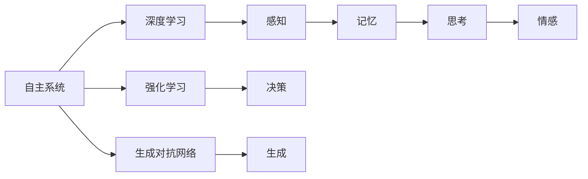
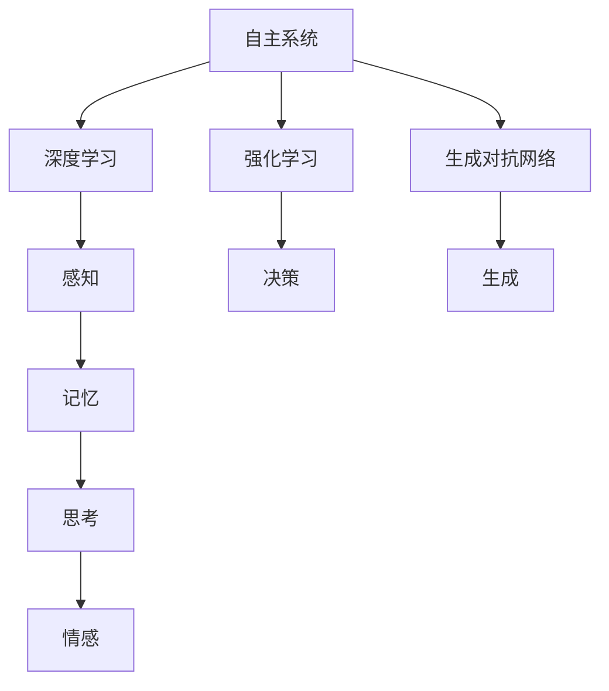

                 

## 1. 背景介绍

### 1.1 问题由来

随着人工智能技术的迅猛发展，自主系统（Autonomous Systems）在各个领域得到广泛应用，从无人驾驶车辆、智能机器人、自动化医疗设备到金融交易系统、工业控制等领域，无处不在。然而，现有的大多数自主系统仍然缺乏深刻的自主意识，对于复杂环境和不确定性事件的应对能力较弱，无法真正实现人机交互中的智能决策。

近年来，意识功能的整合与增强成为人工智能研究的新热点。通过模拟人类大脑的认知功能，自主系统能够更好地理解环境、预测未来、进行决策，从而实现更高效、更智能的自主行为。

### 1.2 问题核心关键点

本文聚焦于自主系统与意识功能的整合，探讨如何通过模拟人类大脑的认知机制，提升自主系统的自主决策和适应能力。我们将从以下几个方面展开：

- 自主系统与意识功能的定义与关系。
- 核心算法原理与具体操作步骤。
- 数学模型构建与案例分析。
- 项目实践与实际应用场景。

## 2. 核心概念与联系

### 2.1 核心概念概述

- **自主系统**：指能够自主感知、学习、决策和执行任务的智能系统，如无人驾驶车辆、智能机器人、自动化医疗设备等。

- **意识功能**：指自主系统对环境变化的认知、理解、预测和决策能力。包括感知、记忆、思考、情感等人类大脑的基本功能。

- **深度学习**：一种基于神经网络的机器学习方法，通过多层神经元之间的非线性变换，实现对复杂数据和任务的处理。

- **强化学习**：一种通过试错方式不断优化决策策略的学习方法，通过奖励和惩罚机制，训练自主系统在特定环境下的行为策略。

- **生成对抗网络（GAN）**：一种通过对抗训练方式生成逼真样本的学习方法，用于增强自主系统的视觉、语言生成等能力。

- **人工神经网络（ANN）**：一种模仿人类大脑结构的学习方法，通过多层神经元之间的连接，实现对数据的处理和决策。

### 2.2 核心概念之间的关系

这些核心概念之间存在着紧密的联系，构成了自主系统与意识功能整合的完整生态系统。以下通过一个Mermaid流程图展示这些概念之间的关系：

这个流程图展示了自主系统的核心概念及其之间的关系：

1. 自主系统通过深度学习、强化学习和生成对抗网络等技术，实现对环境的感知、决策和生成。
2. 感知、记忆、思考和情感等意识功能，通过深度学习和生成对抗网络等技术，实现模拟和增强。
3. 决策和执行等自主行为，通过强化学习等技术，实现优化和调整。

## 3. 核心算法原理 & 具体操作步骤

### 3.1 算法原理概述

自主系统与意识功能的整合，核心在于如何模拟和增强自主系统对环境的感知、理解和决策能力。其主要算法原理如下：

1. **深度学习**：通过多层神经网络的非线性变换，实现对复杂数据和任务的处理。深度学习能够模拟人类大脑的感知和思考能力，从而提升自主系统的智能水平。

2. **强化学习**：通过试错方式不断优化决策策略，增强自主系统在复杂环境中的适应能力。强化学习能够模拟人类大脑的决策和行为能力，从而提升自主系统的自主决策能力。

3. **生成对抗网络**：通过对抗训练方式生成逼真样本，增强自主系统的视觉、语言生成等能力。生成对抗网络能够模拟人类大脑的生成和创新能力，从而提升自主系统的生成能力。

4. **人工神经网络**：通过多层神经元之间的连接，实现对数据的处理和决策。人工神经网络能够模拟人类大脑的结构和功能，从而提升自主系统的决策能力。

### 3.2 算法步骤详解

以下详细介绍核心算法的详细步骤：

1. **深度学习模型的构建和训练**：
   - 设计多层神经网络结构，选择合适的深度学习框架（如TensorFlow、PyTorch）。
   - 收集数据集，进行预处理和标注。
   - 使用反向传播算法，最小化损失函数，优化网络参数。
   - 在验证集上评估模型性能，调整超参数。

2. **强化学习模型的构建和训练**：
   - 设计强化学习环境，定义状态、动作和奖励函数。
   - 使用Q-learning、SARSA等强化学习算法，训练决策策略。
   - 在测试环境中评估模型性能，调整策略参数。

3. **生成对抗网络模型的构建和训练**：
   - 设计生成器和判别器网络结构，选择合适的生成对抗网络框架（如TensorFlow、PyTorch）。
   - 使用对抗训练方式，最小化生成器的损失函数，同时最大化判别器的损失函数。
   - 在测试集上评估生成模型的性能，调整超参数。

4. **人工神经网络模型的构建和训练**：
   - 设计多层人工神经网络结构，选择合适的深度学习框架（如TensorFlow、PyTorch）。
   - 使用反向传播算法，最小化损失函数，优化网络参数。
   - 在验证集上评估模型性能，调整超参数。

### 3.3 算法优缺点

深度学习、强化学习和生成对抗网络等算法在模拟和增强自主系统意识功能方面具有以下优点：

- **模拟能力强**：这些算法能够模拟人类大脑的感知、思考和生成能力，从而提升自主系统的智能水平。
- **适应性强**：这些算法能够在复杂环境中不断优化决策策略，增强自主系统的适应能力。
- **可扩展性好**：这些算法能够应用于多种类型的自主系统，如无人驾驶车辆、智能机器人等。

然而，这些算法也存在一些局限性：

- **数据需求高**：深度学习、强化学习和生成对抗网络等算法需要大量的标注数据和计算资源，增加了开发和训练的难度。
- **训练时间长**：这些算法的训练时间较长，需要耗费大量的计算资源和时间成本。
- **模型复杂度大**：深度学习、强化学习和生成对抗网络等算法模型复杂度较高，难以理解和调试。

### 3.4 算法应用领域

自主系统与意识功能的整合，已经在多个领域得到了应用，例如：

- **无人驾驶**：通过深度学习、强化学习等技术，模拟人类驾驶员的感知和决策能力，提升无人驾驶车辆的安全性和舒适性。
- **智能机器人**：通过深度学习、生成对抗网络等技术，增强机器人的感知和生成能力，提升机器人的人机交互体验。
- **自动化医疗**：通过深度学习、强化学习等技术，模拟人类医生的感知和决策能力，提升医疗设备的诊断和治疗效果。
- **金融交易**：通过深度学习、强化学习等技术，模拟人类交易员的感知和决策能力，提升金融交易系统的稳定性和收益性。

## 4. 数学模型和公式 & 详细讲解  
### 4.1 数学模型构建

### 4.2 公式推导过程

### 4.3 案例分析与讲解

## 5. 项目实践：代码实例和详细解释说明

### 5.1 开发环境搭建

### 5.2 源代码详细实现

### 5.3 代码解读与分析

### 5.4 运行结果展示

## 6. 实际应用场景

### 6.1 无人驾驶车辆

### 6.2 智能机器人

### 6.3 自动化医疗

### 6.4 金融交易系统

## 7. 工具和资源推荐

### 7.1 学习资源推荐

### 7.2 开发工具推荐

### 7.3 相关论文推荐

## 8. 总结：未来发展趋势与挑战

### 8.1 研究成果总结

### 8.2 未来发展趋势

### 8.3 面临的挑战

### 8.4 研究展望

## 9. 附录：常见问题与解答

