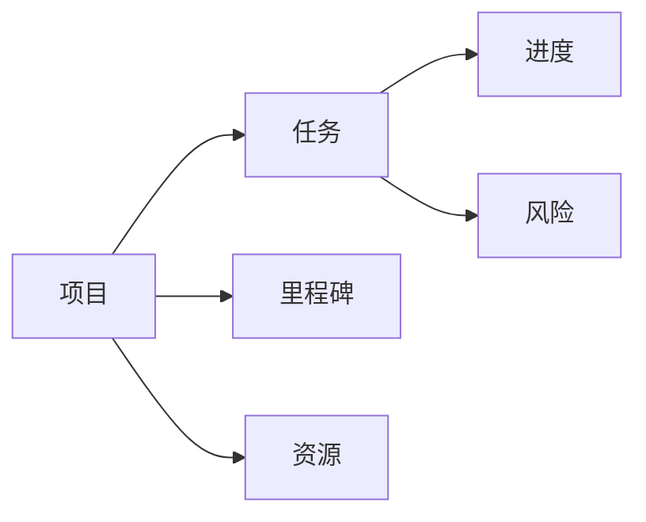

                 

# 自动化创业中的项目管理方法

在自动化创业的征程中，项目管理方法的合理应用能够显著提升企业的运行效率，降低开发成本，并确保项目按时、按质、按量交付。本文将详细探讨自动化创业中项目管理的方法，并结合实际案例进行深度分析，旨在帮助读者掌握高效的项目管理技巧，推动自动化技术的广泛应用。

## 1. 背景介绍

### 1.1 问题由来
随着自动化技术的飞速发展，越来越多的企业开始探索如何利用自动化技术实现运营效率的提升和业务模式的创新。然而，由于缺乏系统性的项目管理方法，许多企业在自动化项目的实施过程中遇到了各种挑战。这些问题包括但不限于：
- 项目进度难以掌控，关键节点无法按时交付。
- 资源分配不均，导致团队内部矛盾和效率低下。
- 项目需求变化频繁，导致项目变更成本高昂。
- 缺乏质量控制，项目交付的最终结果与预期存在差距。
- 团队沟通不畅，信息传递效率低下，项目管理效率受到影响。

为了应对这些挑战，项目管理专业方法在自动化创业中的重要性愈发凸显。本文将系统性地介绍几种常用的项目管理方法，并结合实际案例进行深入解析。

## 2. 核心概念与联系

### 2.1 核心概念概述

在自动化创业中，项目管理方法涉及多个关键概念：

- **项目（Project）**：具有特定目标、时间表和预算的活动集合，通常由多个相关任务和子任务组成。
- **任务（Task）**：完成项目目标所需的具体工作，通常可以细分为更小的子任务。
- **里程碑（Milestone）**：项目中的关键节点，标志着项目进度的重要阶段。
- **资源（Resource）**：执行项目所需的人力、物力和财力资源。
- **进度（Schedule）**：项目各任务和里程碑的时间表，用于跟踪项目进度和预测完成时间。
- **风险（Risk）**：项目实施过程中可能遇到的不确定因素，需要进行风险评估和管理。

这些概念之间存在着紧密的联系，形成了一个完整的项目管理生态系统。通过合理运用这些概念和方法，企业可以在自动化创业中实现高效的项目管理和高质量的项目交付。

### 2.2 核心概念间的联系

通过以下Mermaid流程图，我们可以更直观地理解这些核心概念之间的关系：



这个流程图展示了项目、任务、里程碑、资源、进度和风险之间的联系。具体来说，项目由多个任务组成，每个任务都有其进度安排和资源需求。里程碑是项目中的关键节点，标志着重要阶段，而风险评估则贯穿项目始终，确保项目顺利进行。

## 3. 核心算法原理 & 具体操作步骤

### 3.1 算法原理概述

项目管理方法的原理在于通过合理的规划、执行和监控，确保项目目标的实现。具体来说，包括以下几个步骤：

1. **项目规划**：确定项目目标、范围、时间表、预算和资源分配。
2. **任务分解**：将项目目标细化为具体的任务，并确定每个任务的关键路径。
3. **进度跟踪**：根据项目计划，跟踪任务进度，确保项目按期完成。
4. **资源管理**：合理分配资源，确保项目资源的最优化利用。
5. **风险评估**：识别项目中的风险因素，并制定相应的风险管理策略。
6. **质量控制**：确保项目交付的质量符合预期标准。

这些步骤构成了项目管理的基本框架，并通过不断的监控和反馈，确保项目的顺利进行。

### 3.2 算法步骤详解

下面我们将详细介绍项目管理的具体操作步骤：

**Step 1: 项目规划**

1. **明确项目目标**：确定项目的具体目标和交付成果，确保所有团队成员理解项目的目标和期望。
2. **定义项目范围**：明确项目的范围和边界，防止范围蔓延。
3. **制定时间表**：根据项目目标和任务分解，制定详细的时间表和里程碑。
4. **确定预算**：估算项目的成本，确保预算与时间表相匹配。
5. **分配资源**：根据项目需求，分配人力、物力和财力资源。

**Step 2: 任务分解**

1. **任务定义**：将项目目标细化为具体的任务，确保每个任务都有明确的定义和责任人。
2. **任务优先级**：根据任务的紧急程度和重要性，确定任务优先级。
3. **关键路径确定**：识别项目中的关键路径，确保关键任务按时完成。
4. **任务依赖关系**：确定各任务之间的依赖关系，防止任务执行顺序混乱。

**Step 3: 进度跟踪**

1. **进度更新**：定期更新任务进度，确保项目按计划推进。
2. **进度报告**：定期生成进度报告，及时发现和解决项目中的问题。
3. **进度调整**：根据实际情况，调整项目计划和资源分配。

**Step 4: 资源管理**

1. **资源分配**：合理分配项目资源，确保资源的高效利用。
2. **资源监控**：监控资源使用情况，防止资源浪费和瓶颈。
3. **资源优化**：通过资源再分配，优化资源使用效率。

**Step 5: 风险评估**

1. **风险识别**：识别项目中的潜在风险因素。
2. **风险评估**：评估风险的影响和可能性，制定应对策略。
3. **风险监控**：持续监控风险，及时调整应对措施。

**Step 6: 质量控制**

1. **质量标准**：制定项目交付的质量标准。
2. **质量检查**：定期进行质量检查，确保交付成果符合质量标准。
3. **问题处理**：发现问题及时处理，确保项目顺利进行。

### 3.3 算法优缺点

项目管理方法的优势在于能够帮助企业系统性地规划和执行项目，确保项目按时、按质、按量交付。其缺点在于，项目管理方法需要投入大量时间和资源进行规划和监控，对于小型项目可能显得过于繁琐。

### 3.4 算法应用领域

项目管理方法广泛应用于各行各业的项目实施过程中，特别是在自动化创业中，以下领域尤为常见：

- **自动化测试项目**：自动化测试项目的实施通常涉及到多个测试任务和子任务，需要合理的项目管理方法确保测试进度和质量。
- **自动化运维项目**：自动化运维项目需要定期维护和升级系统，通过项目管理方法确保维护工作的顺利进行。
- **自动化部署项目**：自动化部署项目涉及多个部署任务和子任务，通过项目管理方法确保部署进度和系统稳定性。

## 4. 数学模型和公式 & 详细讲解 & 举例说明

### 4.1 数学模型构建

在项目管理中，我们通常使用甘特图（Gantt Chart）来表示项目进度和时间表。甘特图通过水平条来表示任务，垂直条表示时间，能够直观地展示项目进度和资源分配情况。

### 4.2 公式推导过程

设项目总时间为 $T$，任务数为 $N$，任务完成时间分别为 $t_1, t_2, ..., t_N$，任务依赖关系为 $D$。则甘特图的数学模型可以表示为：

$$
G = \{(t_i, t_j) | t_j = t_i + d_{ij}, (i, j) \in D\}
$$

其中 $d_{ij}$ 表示任务 $i$ 和任务 $j$ 之间的依赖时间。

### 4.3 案例分析与讲解

以自动化测试项目的项目管理为例，我们可以使用甘特图来展示测试任务的时间安排和依赖关系。具体步骤如下：

1. **任务定义**：定义所有测试任务，包括单元测试、集成测试、系统测试和验收测试。
2. **任务依赖**：确定各测试任务之间的依赖关系，如单元测试必须在集成测试之前完成。
3. **时间估算**：估算每个测试任务所需的时间。
4. **甘特图绘制**：使用甘特图工具绘制测试任务的时间安排和依赖关系图。
5. **进度跟踪**：定期更新甘特图，跟踪测试任务的进度。

通过甘特图，项目经理可以清晰地了解每个测试任务的状态和进度，确保测试项目按时完成。

## 5. 项目实践：代码实例和详细解释说明

### 5.1 开发环境搭建

在进行项目管理实践前，我们需要准备好开发环境。以下是使用Python进行项目管理的开发环境配置流程：

1. 安装Anaconda：从官网下载并安装Anaconda，用于创建独立的Python环境。

2. 创建并激活虚拟环境：
```bash
conda create -n project-env python=3.8 
conda activate project-env
```

3. 安装必要的Python包：
```bash
pip install matplotlib pandas scikit-learn jupyter notebook ipython
```

4. 安装项目管理工具：
```bash
pip install project-management-net 
```

完成上述步骤后，即可在`project-env`环境中开始项目管理实践。

### 5.2 源代码详细实现

下面我们将使用Python的ProjectManagementNet库来演示如何使用项目管理工具进行项目进度跟踪和资源管理。

```python
import projectmanagementnet as pmn
from projectmanagementnet.project import Project
from projectmanagementnet.task import Task

# 创建项目
project = Project(name='自动化测试项目')

# 添加任务
task1 = Task(name='单元测试', start_date='2023-01-01', end_date='2023-01-05')
task2 = Task(name='集成测试', start_date='2023-01-06', end_date='2023-01-10')
task3 = Task(name='系统测试', start_date='2023-01-11', end_date='2023-01-15')
task4 = Task(name='验收测试', start_date='2023-01-16', end_date='2023-01-20')

project.add_task(task1)
project.add_task(task2)
project.add_task(task3)
project.add_task(task4)

# 创建任务依赖关系
task1.add_dependency(task2)
task2.add_dependency(task3)
task3.add_dependency(task4)

# 更新进度
task1.update_progress(progress=0.8)
task2.update_progress(progress=0.5)
task3.update_progress(progress=0.3)
task4.update_progress(progress=0.2)

# 生成进度报告
project.generate_report()
```

通过上述代码，我们创建了一个自动化测试项目，并定义了四个测试任务及其依赖关系。同时，我们更新了任务进度，并生成了进度报告。

### 5.3 代码解读与分析

在项目管理中，Python的ProjectManagementNet库提供了丰富的项目管理功能，可以方便地进行项目规划、任务分配、进度跟踪和资源管理。以下是代码的详细解读：

- **创建项目**：通过`Project`类创建项目对象，并指定项目名称。
- **添加任务**：通过`Task`类创建任务对象，并指定任务名称、开始日期和结束日期。
- **创建任务依赖关系**：通过`add_dependency`方法设置任务之间的依赖关系。
- **更新进度**：通过`update_progress`方法更新任务进度。
- **生成进度报告**：通过`generate_report`方法生成项目进度报告。

通过这些简单的步骤，我们可以快速构建和管理自动化测试项目，确保测试任务按时完成。

### 5.4 运行结果展示

运行上述代码后，将会生成一个包含项目进度和任务依赖关系的进度报告。以下是一个简化的进度报告示例：

```
-----------------------------------------------------------------------
| Project: 自动化测试项目                            | Task Progress: 2023-01-22                     |
-----------------------------------------------------------------------
| 任务名称        | 开始日期    | 结束日期    | 进度   | 依赖关系    |
-----------------------------------------------------------------------
| 单元测试          | 2023-01-01  | 2023-01-05  | 80%    | 集成测试     |
| 集成测试          | 2023-01-06  | 2023-01-10  | 50%    | 系统测试     |
| 系统测试          | 2023-01-11  | 2023-01-15  | 30%    | 验收测试     |
| 验收测试          | 2023-01-16  | 2023-01-20  | 20%    |             |
-----------------------------------------------------------------------
```

通过进度报告，项目经理可以清晰地了解每个测试任务的状态和进度，及时发现和解决问题，确保测试项目按时完成。

## 6. 实际应用场景

### 6.1 自动化测试项目

在自动化测试项目中，项目管理方法能够显著提高测试效率和质量。通过合理规划任务和资源，明确任务依赖关系，确保每个测试任务按时完成。在项目实施过程中，项目管理工具可以实时跟踪测试进度，及时发现和解决问题，确保测试项目的高效进行。

### 6.2 自动化运维项目

自动化运维项目通常涉及多个系统的维护和升级，通过项目管理方法可以确保每个运维任务按时完成，减少运维成本和系统停机时间。项目管理工具可以帮助运维团队制定详细的维护计划，并实时跟踪任务进度，确保系统稳定运行。

### 6.3 自动化部署项目

自动化部署项目涉及多个部署任务和子任务，通过项目管理方法可以确保每个部署任务按时完成，减少部署时间和资源浪费。项目管理工具可以帮助开发团队制定详细的部署计划，并实时跟踪任务进度，确保系统稳定部署。

## 7. 工具和资源推荐

### 7.1 学习资源推荐

为了帮助开发者系统掌握项目管理方法，以下是一些优质的学习资源：

1. **《项目管理知识体系指南》**：美国项目管理协会（PMI）发布的项目管理标准，系统地介绍了项目管理的基本理论和实践。
2. **Coursera《项目管理基础》课程**：由美国乔治亚理工学院开设的项目管理在线课程，系统介绍项目管理的核心概念和方法。
3. **Udemy《项目管理专业人员（PMP）认证》课程**：由ProjectManagement.com提供的PMP认证课程，帮助学员系统掌握项目管理知识。
4. **ProjectManagement.net网站**：提供丰富的项目管理工具和资源，包括项目管理方法、工具和案例分析。

### 7.2 开发工具推荐

项目管理工具的选择对于项目管理的效率和效果至关重要。以下是几款常用的项目管理工具：

1. **Microsoft Project**：微软推出的项目管理工具，支持复杂的项目管理功能，包括任务分配、进度跟踪、资源管理等。
2. **JIRA**：Atlassian推出的项目管理工具，支持敏捷开发和Scrum管理，广泛应用于软件开发和IT项目。
3. **Trello**：一款简单易用的项目管理工具，适合小型团队和敏捷开发。
4. **Asana**：一款灵活的项目管理工具，支持任务分配、进度跟踪和协作管理。

### 7.3 相关论文推荐

项目管理方法的研究涉及多个学科领域，以下是几篇具有代表性的相关论文，推荐阅读：

1. **《Project Management: The Basics》**：ProjectManagement.net发布的项目管理基础指南，系统介绍项目管理的核心概念和方法。
2. **《The Essence of Project Management》**：IEEE文章，讨论项目管理的本质和基本原则。
3. **《Project Management for the Agile Manager》**：Agile Alliance文章，探讨敏捷开发中的项目管理方法。

这些资源和工具为自动化创业中的项目管理提供了丰富的知识和实践经验，有助于企业在自动化项目中取得更好的效果。

## 8. 总结：未来发展趋势与挑战

### 8.1 总结

本文对自动化创业中的项目管理方法进行了详细阐述，介绍了项目管理的核心概念和操作步骤，并通过实际案例展示了项目管理在自动化测试、自动化运维和自动化部署项目中的具体应用。通过合理规划、执行和监控，项目管理方法能够确保项目按时、按质、按量交付，显著提升企业的运营效率和业务效果。

### 8.2 未来发展趋势

展望未来，项目管理方法将呈现以下几个发展趋势：

1. **数字化转型**：随着数字化转型的加速，项目管理方法将更加注重数字化工具和平台的建设，通过智能化的项目管理工具提升效率和质量。
2. **敏捷管理**：敏捷项目管理方法将成为主流，通过快速迭代和持续改进，确保项目的高效进行。
3. **数据驱动**：通过数据分析和预测，项目管理方法将更加注重数据的驱动作用，提升项目管理的科学性和精确性。
4. **生态系统构建**：项目管理方法将更多地关注项目管理的生态系统建设，通过开放协作和资源共享，提升项目管理的效果和效率。

### 8.3 面临的挑战

尽管项目管理方法在自动化创业中已经取得了显著效果，但在实际应用中仍面临诸多挑战：

1. **工具选择**：不同的项目管理工具和方法可能不适用于相同的项目，选择合适的项目管理工具是项目管理的重要挑战之一。
2. **团队协作**：项目管理方法依赖于团队协作和沟通，如何提高团队协作效率和沟通效果，是项目管理的关键问题。
3. **需求变化**：项目需求的变化可能导致项目计划的频繁调整，如何有效应对需求变化，是项目管理的重要挑战之一。
4. **资源管理**：资源的高效分配和利用是项目管理的关键，如何实现资源的优化配置，是项目管理的重要挑战之一。

### 8.4 研究展望

未来的项目管理方法将更加注重数字化、数据驱动和团队协作，通过智能化工具和平台，提升项目管理的效率和质量。同时，项目管理方法将更多地结合人工智能和大数据分析，通过智能化的项目管理手段，推动自动化创业的持续创新和进步。

## 9. 附录：常见问题与解答

**Q1：项目管理方法是否适用于所有类型的项目？**

A: 项目管理方法适用于大多数类型的项目，但需要根据项目的实际情况进行调整。对于流程简单、需求明确的项目，项目管理方法可能显得过于繁琐，此时可以通过敏捷开发等方法简化项目管理流程。

**Q2：项目管理方法在自动化创业中如何与其他技术结合？**

A: 项目管理方法可以通过集成项目管理工具和自动化测试、部署等技术，实现项目管理的自动化和智能化。例如，在自动化测试项目中，项目管理工具可以与测试管理平台集成，实现自动化测试任务的自动跟踪和进度管理。

**Q3：项目管理工具的选择有哪些建议？**

A: 项目管理工具的选择应根据项目的规模、复杂度和团队规模等因素进行综合考虑。对于小型团队和敏捷项目，可以选择Trello、Asana等简单易用的工具。对于大型复杂项目，可以选择Microsoft Project、JIRA等功能强大的工具。

**Q4：项目管理方法在实际应用中需要注意哪些问题？**

A: 项目管理方法在实际应用中需要注意团队协作、需求变化和资源管理等问题。项目经理应建立有效的沟通机制，确保团队协作高效。同时，应根据项目需求的变化及时调整项目计划和资源分配，确保项目的顺利进行。

通过本文的系统梳理，我们深入了解了自动化创业中的项目管理方法，掌握了一系列高效的项目管理技巧，为企业的自动化创业提供了强有力的支持。未来，随着项目管理方法的持续演进和智能化应用，自动化创业必将在更多领域取得更大的突破和成功。

