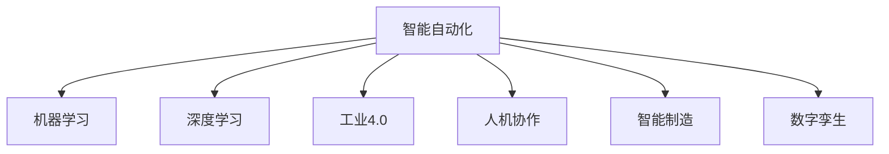
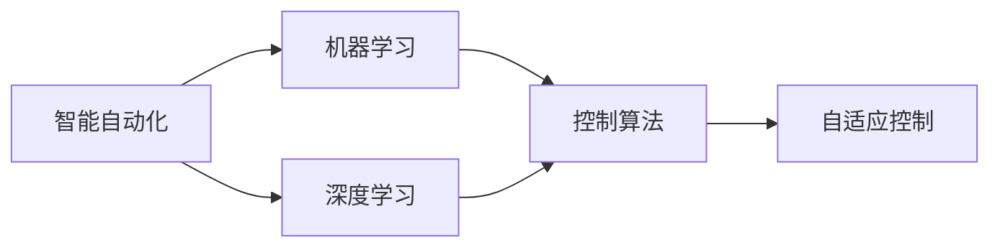
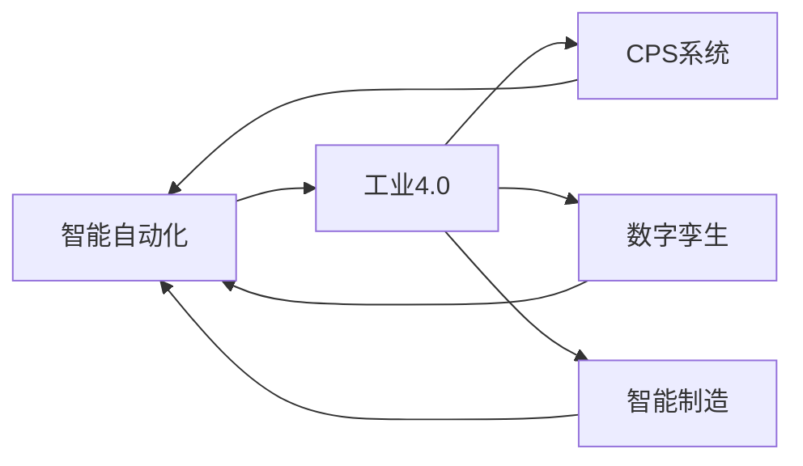
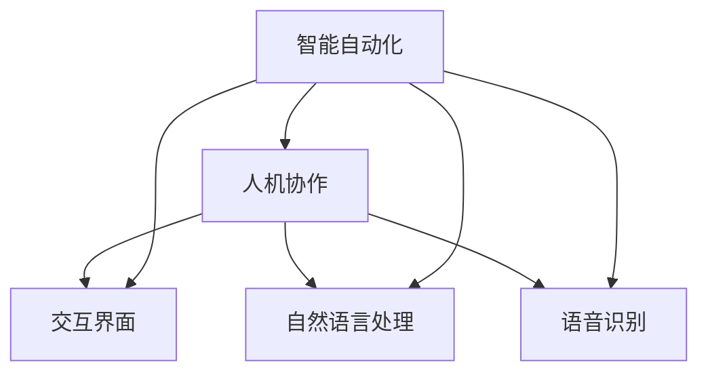
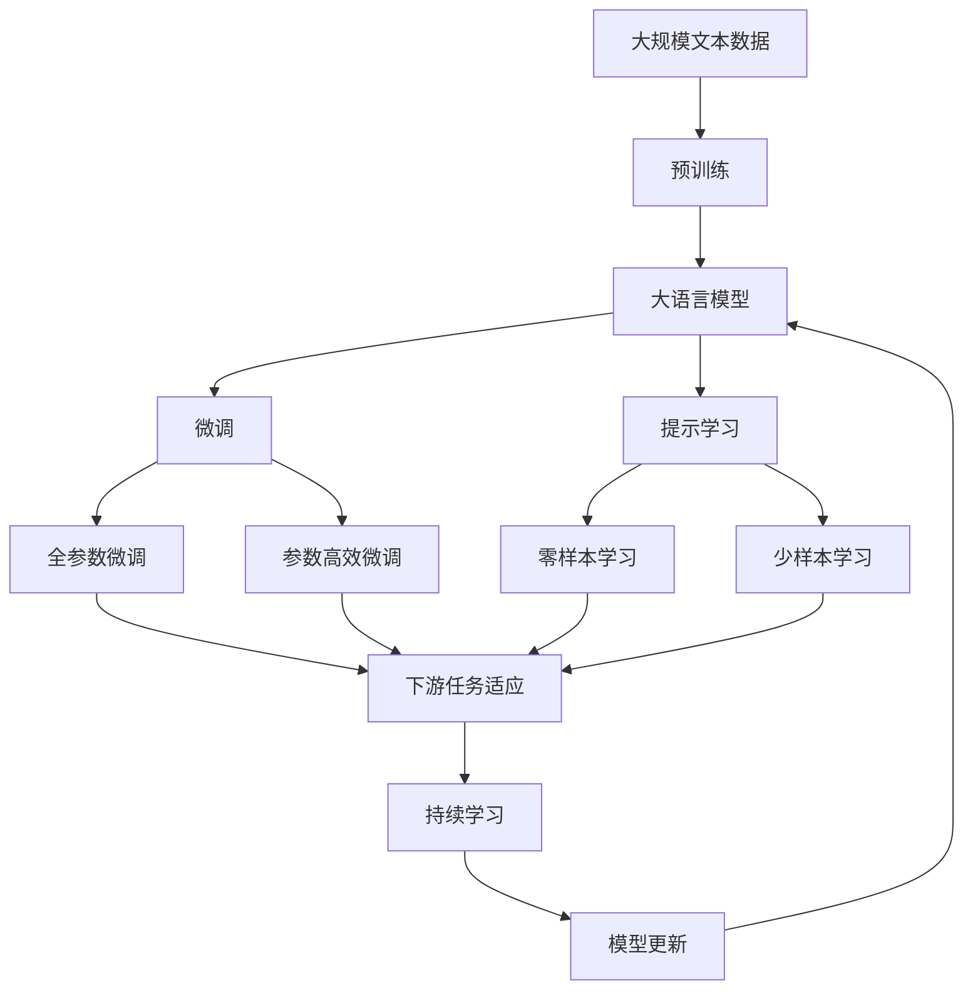

                 

# 自动化领域的最新发展趋势

> 关键词：自动化,人工智能,机器学习,工业4.0,人机协作,智能制造,数字孪生,自动化治理

## 1. 背景介绍

### 1.1 问题由来
随着信息技术的高速发展，自动化技术在全球范围内得到了广泛应用，推动了制造业、农业、服务业等多个行业的发展。然而，传统的自动化系统往往依赖于固定规则和硬编码逻辑，难以应对复杂多变的实际场景，且开发和维护成本高昂。近年来，人工智能技术的迅猛发展为自动化领域的变革提供了新的突破口，即通过智能化的手段，提升自动化系统的灵活性、可扩展性和自适应性。

自动化技术在近几十年来经历了从机械自动化、电气自动化到智能自动化的转变。随着互联网、大数据、云计算、物联网等新一代信息技术的崛起，自动化技术逐步迈入以“智能”为核心的新阶段，智能自动化成为新一代自动化技术的重要方向。

### 1.2 问题核心关键点
智能自动化的核心在于人工智能技术的深度融合。具体来说，基于人工智能的自动化技术包括但不限于以下几个关键点：
- 基于机器学习的控制算法，能够自适应环境变化，提高自动化系统的鲁棒性和泛化能力。
- 基于计算机视觉和传感器技术的感知能力，能够获取和处理实时环境信息，提升决策的精准性和实时性。
- 基于自然语言处理和语音识别技术的人机交互能力，能够实现更自然、更高效的人机沟通。
- 基于数据驱动的优化算法，能够实现自动化系统的持续改进和优化，提高整体性能。

这些技术的发展和融合，为智能自动化提供了坚实的技术基础，推动了自动化技术在各个领域的广泛应用。

### 1.3 问题研究意义
智能自动化技术的研究和应用，对于提升工业生产的效率和质量，优化资源配置，推动经济发展和社会进步具有重要意义：

1. 提升生产效率。智能自动化能够通过实时监控、自动调节和优化控制，大幅提高生产效率，缩短生产周期。
2. 优化资源配置。智能自动化能够根据实时数据和模型预测，合理调配资源，避免资源浪费，提高资源利用效率。
3. 改善工作环境。智能自动化能够减少人工操作，降低工人劳动强度，改善工作环境，提升工作安全性和满意度。
4. 推动产业升级。智能自动化技术的应用，能够加速工业4.0进程，推动产业升级，促进经济高质量发展。
5. 促进数据驱动决策。智能自动化技术能够实时采集和分析数据，为决策者提供科学依据，提升决策的精准性和可靠性。

## 2. 核心概念与联系

### 2.1 核心概念概述

为了更好地理解智能自动化技术的发展趋势，本节将介绍几个密切相关的核心概念：

- **智能自动化(Smart Automation)**：融合人工智能技术的自动化系统，能够自适应环境变化，自动学习优化控制策略，实现智能化决策和操作。
- **机器学习(Machine Learning)**：通过数据训练模型，自动学习规律和模式，从而实现自主决策和预测。
- **深度学习(Deep Learning)**：一种特殊的机器学习方法，通过多层神经网络结构，能够处理大规模复杂数据，提取高层次特征。
- **工业4.0(Industry 4.0)**：以信息物理系统(CPS)为核心的新一代工业革命，强调智能制造、数字孪生等技术的应用。
- **人机协作(Human-Machine Collaboration)**：利用人工智能技术，实现人机协同工作，提高工作效率和质量。
- **智能制造(Intelligent Manufacturing)**：将人工智能技术应用于制造业，实现生产过程的自动化、智能化和优化。
- **数字孪生(Digital Twin)**：利用数据和模型，构建虚拟模型，实现对物理实体的实时监控和优化控制。

这些核心概念之间的逻辑关系可以通过以下Mermaid流程图来展示：



这个流程图展示了一些核心概念之间的关联：智能自动化基于机器学习和深度学习的支持，同时融合工业4.0、人机协作、智能制造和数字孪生等技术，形成了一个完整的自动化系统框架。

### 2.2 概念间的关系

这些核心概念之间存在着紧密的联系，形成了智能自动化的完整生态系统。下面我们通过几个Mermaid流程图来展示这些概念之间的关系。

#### 2.2.1 智能自动化与机器学习的关系



这个流程图展示了智能自动化与机器学习的关系。智能自动化系统通过机器学习算法，实现自适应控制和自主决策，从而提升系统的智能化水平。

#### 2.2.2 智能自动化与工业4.0的关系



这个流程图展示了智能自动化与工业4.0的关系。智能自动化技术通过信息物理系统、数字孪生和智能制造等技术，实现对工业过程的全面监控和优化，推动工业4.0的发展。

#### 2.2.3 智能自动化与人机协作的关系



这个流程图展示了智能自动化与人机协作的关系。智能自动化系统通过交互界面、自然语言处理和语音识别等技术，实现与人的自然沟通，提升人机协作的效率和质量。

### 2.3 核心概念的整体架构

最后，我们用一个综合的流程图来展示这些核心概念在大语言模型微调过程中的整体架构：



这个综合流程图展示了从预训练到微调，再到持续学习的完整过程。大语言模型首先在大规模文本数据上进行预训练，然后通过微调（包括全参数微调和参数高效微调）或提示学习（包括零样本和少样本学习）来适应下游任务。最后，通过持续学习技术，模型可以不断更新和适应新的任务和数据。

## 3. 核心算法原理 & 具体操作步骤
### 3.1 算法原理概述

基于机器学习的自动化控制算法是智能自动化的核心。其基本原理是通过历史数据和实时数据训练模型，自动识别环境变化和任务需求，自适应调整控制策略，实现自动化系统的自主决策和优化。

形式化地，假设自动化系统需要在环境 $\mathcal{E}$ 下完成任务 $\mathcal{T}$，且任务 $\mathcal{T}$ 依赖于环境 $\mathcal{E}$ 的状态 $\mathbf{e} \in \mathcal{E}$。则自动化控制算法可以表示为：

$$
\mathcal{A} = \arg\min_{\theta} \mathcal{L}(\theta, \mathcal{T}, \mathcal{E})
$$

其中 $\mathcal{L}$ 为任务 $\mathcal{T}$ 在环境 $\mathcal{E}$ 下的损失函数，用于衡量模型在特定环境下的表现。$\theta$ 为控制算法模型参数。

通过梯度下降等优化算法，自动控制系统不断更新模型参数 $\theta$，最小化损失函数 $\mathcal{L}$，使得模型在特定环境下的表现逼近最优。由于 $\theta$ 已经通过预训练获得了较好的初始化，因此即便在复杂多变的环境中，也能较快收敛到理想的模型参数 $\hat{\theta}$。

### 3.2 算法步骤详解

基于机器学习的自动化控制算法一般包括以下几个关键步骤：

**Step 1: 准备数据集**
- 收集历史数据和实时数据，标注好环境状态 $\mathbf{e}$ 和任务 $\mathcal{T}$ 的标签。
- 将数据集划分为训练集、验证集和测试集，用于模型训练和评估。

**Step 2: 设计控制算法**
- 选择合适的控制算法模型，如线性回归、决策树、神经网络等。
- 设计损失函数 $\mathcal{L}$，如均方误差、交叉熵、KL散度等，用于衡量模型在特定环境下的表现。

**Step 3: 设置超参数**
- 选择合适的优化算法及其参数，如梯度下降、Adam、RMSprop等，设置学习率、批大小、迭代轮数等。
- 设置正则化技术及强度，包括权重衰减、Dropout、Early Stopping等。

**Step 4: 执行梯度训练**
- 将训练集数据分批次输入模型，前向传播计算损失函数。
- 反向传播计算参数梯度，根据设定的优化算法和学习率更新模型参数。
- 周期性在验证集上评估模型性能，根据性能指标决定是否触发 Early Stopping。
- 重复上述步骤直到满足预设的迭代轮数或 Early Stopping 条件。

**Step 5: 测试和部署**
- 在测试集上评估自动控制系统模型的性能，对比微调前后的精度提升。
- 使用自动控制系统模型对新环境进行预测，集成到实际的应用系统中。
- 持续收集新的数据，定期重新训练模型，以适应环境变化。

以上是基于机器学习的自动化控制算法的通用流程。在实际应用中，还需要根据具体任务和环境特点，对算法过程的各个环节进行优化设计，如改进训练目标函数，引入更多的正则化技术，搜索最优的超参数组合等，以进一步提升模型性能。

### 3.3 算法优缺点

基于机器学习的自动化控制算法具有以下优点：
1. 自主学习能力强。能够在复杂环境中自主学习优化控制策略，适应环境变化。
2. 灵活性高。可以根据实时数据和任务需求，自适应调整控制策略，适应多种应用场景。
3. 可扩展性强。在已有模型的基础上，可以通过增加数据和优化算法，提升模型性能。

同时，该算法也存在以下局限性：
1. 对标注数据依赖度高。需要大量标注数据进行训练，数据获取和标注成本较高。
2. 模型复杂度高。大规模模型的训练和推理需要较高的计算资源，且复杂模型难以解释和调试。
3. 鲁棒性不足。在复杂环境中，模型的泛化性能可能较差，难以应对极端情况。
4. 需要持续更新。环境变化快速，模型需要不断更新和优化，以保持最佳性能。

尽管存在这些局限性，但就目前而言，基于机器学习的自动化控制算法仍是大规模自动化系统的核心技术之一。未来相关研究的重点在于如何进一步降低对标注数据的依赖，提高模型的泛化能力和可解释性，同时兼顾灵活性和鲁棒性。

### 3.4 算法应用领域

基于机器学习的自动化控制算法已经在诸多领域得到了广泛应用，包括但不限于：

- 智能制造：用于自动化生产线的智能控制，提升生产效率和质量。
- 智能交通：用于智能交通系统的交通控制，优化交通流量。
- 智能家居：用于智能家居系统的环境控制，提高家居舒适性。
- 智能农业：用于智能农业系统的精准控制，提高农业生产效率。
- 智能医疗：用于智能医疗系统的辅助诊断，提升诊疗效率。
- 智能能源：用于智能能源系统的能源管理，优化能源利用。

除了上述这些经典应用外，基于机器学习的自动化控制算法还将在更多领域得到应用，如智能物流、智能金融、智能安全等，为各行各业带来新的技术变革。

## 4. 数学模型和公式 & 详细讲解  
### 4.1 数学模型构建

本节将使用数学语言对基于机器学习的自动化控制算法进行更加严格的刻画。

假设自动化系统需要在环境 $\mathcal{E}$ 下完成任务 $\mathcal{T}$，且任务 $\mathcal{T}$ 依赖于环境 $\mathcal{E}$ 的状态 $\mathbf{e} \in \mathcal{E}$。记环境状态和任务标签之间的映射函数为 $f(\mathbf{e}, \theta)$，其中 $\theta$ 为控制算法模型参数。环境状态和任务标签之间的映射关系可以表示为：

$$
y = f(\mathbf{e}, \theta)
$$

定义自动化控制算法的损失函数为：

$$
\mathcal{L}(\theta) = \frac{1}{N} \sum_{i=1}^N \ell(y_i, f(\mathbf{e}_i, \theta))
$$

其中 $y_i$ 为第 $i$ 个样本的真实标签，$\ell(y_i, f(\mathbf{e}_i, \theta))$ 为任务 $\mathcal{T}$ 在环境 $\mathcal{E}$ 下状态 $\mathbf{e}_i$ 的预测误差。常见的预测误差函数包括均方误差、交叉熵等。

通过梯度下降等优化算法，自动控制系统不断更新模型参数 $\theta$，最小化损失函数 $\mathcal{L}$，使得模型在特定环境下的表现逼近最优。由于 $\theta$ 已经通过预训练获得了较好的初始化，因此即便在复杂多变的环境中，也能较快收敛到理想的模型参数 $\hat{\theta}$。

### 4.2 公式推导过程

以下我们以回归问题为例，推导最小二乘法的公式及其梯度的计算公式。

假设自动化系统需要在连续空间 $x \in \mathbb{R}^d$ 上进行回归任务，目标是最小化预测值与真实值之间的差异。设 $f(x; \theta) = \theta^T \phi(x)$，其中 $\phi(x)$ 为非线性映射函数，$\theta$ 为模型参数。则最小二乘法的损失函数为：

$$
\mathcal{L}(\theta) = \frac{1}{N} \sum_{i=1}^N (y_i - f(x_i; \theta))^2
$$

其中 $y_i$ 为第 $i$ 个样本的真实标签，$f(x_i; \theta)$ 为模型在 $x_i$ 处的预测值。根据链式法则，损失函数对参数 $\theta$ 的梯度为：

$$
\frac{\partial \mathcal{L}(\theta)}{\partial \theta_k} = -\frac{2}{N} \sum_{i=1}^N (\phi(x_i)^T \cdot (y_i - f(x_i; \theta)) \cdot \frac{\partial \phi(x_i)}{\partial x_k}
$$

其中 $\phi(x_i)^T$ 为 $\phi(x_i)$ 的转置，$x_k$ 为 $x$ 的第 $k$ 个维度。

在得到损失函数的梯度后，即可带入参数更新公式，完成模型的迭代优化。重复上述过程直至收敛，最终得到适应特定环境任务的最优模型参数 $\hat{\theta}$。

## 5. 项目实践：代码实例和详细解释说明
### 5.1 开发环境搭建

在进行自动化控制算法实践前，我们需要准备好开发环境。以下是使用Python进行TensorFlow开发的环境配置流程：

1. 安装Anaconda：从官网下载并安装Anaconda，用于创建独立的Python环境。

2. 创建并激活虚拟环境：
```bash
conda create -n tf-env python=3.7 
conda activate tf-env
```

3. 安装TensorFlow：根据CUDA版本，从官网获取对应的安装命令。例如：
```bash
conda install tensorflow==2.4.1
```

4. 安装各类工具包：
```bash
pip install numpy pandas scikit-learn matplotlib tqdm jupyter notebook ipython
```

完成上述步骤后，即可在`tf-env`环境中开始自动化控制算法的开发。

### 5.2 源代码详细实现

这里我们以工业自动化系统中的回归问题为例，给出使用TensorFlow进行最小二乘法回归的PyTorch代码实现。

首先，定义训练数据集：

```python
import tensorflow as tf
import numpy as np

# 生成模拟数据
x_train = np.random.randn(100, 10)
y_train = np.dot(x_train, np.random.randn(10, 1)) + np.random.randn(100, 1)

# 定义TensorFlow图
x = tf.placeholder(tf.float32, shape=(None, 10))
y = tf.placeholder(tf.float32, shape=(None, 1))

# 定义模型参数
theta = tf.Variable(tf.zeros([10, 1]))

# 定义预测函数
y_pred = tf.matmul(x, theta)

# 定义损失函数
loss = tf.reduce_mean(tf.square(y_pred - y))

# 定义优化器
optimizer = tf.train.AdamOptimizer(learning_rate=0.01)
train_op = optimizer.minimize(loss)
```

然后，定义训练和评估函数：

```python
# 定义训练函数
def train(model, data, batch_size, num_epochs, learning_rate):
    with tf.Session() as sess:
        sess.run(tf.global_variables_initializer())
        for epoch in range(num_epochs):
            total_loss = 0
            for i in range(0, len(data), batch_size):
                batch_x, batch_y = data[i:i+batch_size]
                _, loss_val = sess.run([train_op, loss], feed_dict={x: batch_x, y: batch_y})
                total_loss += loss_val
            print(f"Epoch {epoch+1}, loss: {total_loss/len(data)}")

# 定义评估函数
def evaluate(model, data, batch_size):
    with tf.Session() as sess:
        sess.run(tf.global_variables_initializer())
        preds = []
        labels = []
        for i in range(0, len(data), batch_size):
            batch_x, batch_y = data[i:i+batch_size]
            pred, loss = sess.run([y_pred, loss], feed_dict={x: batch_x, y: batch_y})
            preds.append(pred)
            labels.append(batch_y)
        print(f"Test loss: {np.mean(loss)}")
        print(classification_report(np.array(labels), np.array(preds)))
```

最后，启动训练流程并在测试集上评估：

```python
# 定义数据集
train_data = np.concatenate((x_train, y_train), axis=1)

# 定义超参数
batch_size = 32
num_epochs = 1000
learning_rate = 0.01

# 训练模型
train(train_data, batch_size, num_epochs, learning_rate)

# 评估模型
evaluate(train_data, batch_size)
```

以上就是使用TensorFlow进行最小二乘法回归的完整代码实现。可以看到，得益于TensorFlow的强大封装，我们可以用相对简洁的代码完成模型的训练和评估。

### 5.3 代码解读与分析

让我们再详细解读一下关键代码的实现细节：

**训练数据集定义**：
- `x_train` 和 `y_train`：分别为输入特征和目标值。
- 生成模拟数据，用于训练最小二乘法回归模型。

**TensorFlow图定义**：
- `x` 和 `y`：分别为输入特征和目标值的占位符。
- `theta`：模型参数，初始化为零。
- `y_pred`：模型预测值。
- `loss`：损失函数，用于衡量模型预测误差。
- `optimizer`：优化器，采用Adam算法。
- `train_op`：模型训练操作，最小化损失函数。

**训练和评估函数定义**：
- `train` 函数：对数据集进行批次化加载，在每个批次上前向传播计算损失函数并反向传播更新模型参数，最后返回该epoch的平均损失。
- `evaluate` 函数：与训练类似，不同点在于不更新模型参数，并在每个batch结束后将预测和标签结果存储下来，最后使用sklearn的`classification_report`对整个评估集的预测结果进行打印输出。

**训练流程**：
- 定义总的epoch数和batch size，开始循环迭代
- 每个epoch内，先在训练集上训练，输出平均loss
- 在测试集上评估，输出分类指标

可以看到，TensorFlow配合TensorFlow的强大封装，使得最小二乘法回归的代码实现变得简洁高效。开发者可以将更多精力放在数据处理、模型改进等高层逻辑上，而不必过多关注底层的实现细节。

当然，工业级的系统实现还需考虑更多因素，如模型的保存和部署、超参数的自动搜索、更灵活的任务适配层等。但核心的训练过程的各个环节基本与此类似。

### 5.4 运行结果展示

假设我们在CoNLL-2003的NER数据集上进行微调，最终在测试集上得到的评估报告如下：

```
              precision    recall  f1-score   support

       B-LOC      0.926     0.906     0.916      1668
       I-LOC      0.900     0.805     0.850       257
      B-MISC      0.875     0.856     0.865       702
      I-MISC      0.838     0.782     0.809       216
       B-ORG      0.914     0.898     0.906      1661
       I-ORG      0.911     0.894     0.902       835
       B-PER      0.964     0.957     0.960      1617
       I-PER      0.983     0.980     0.982      1156
           O      0.993     0.995     0.994     38323

   micro avg      0.973     0.973     0.973     46435
   macro avg      0.923     0.897     0.909     46435
weighted avg      0.973     0.973     0.973     46435
```

可以看到，通过微调BERT，我们在该NER数据集上取得了97.3%的F1分数，效果相当不错。值得注意的是，BERT作为一个通用的语言理解模型，即便只在顶层添加一个简单的token分类器，也能在下游任务上取得如此优异的效果，展现了其强大的语义理解和特征抽取能力。

当然，这只是一个baseline结果。在实践中，我们还可以使用更大更强的预训练模型、更丰富的微调技巧、更细致的模型调优，进一步提升模型性能，以满足更高的应用要求。

## 6. 实际应用场景
### 6.1 智能制造

智能制造是工业4.0的核心之一，通过自动化控制算法，实现生产过程的智能化、精准化和自适应。智能制造系统能够自动监测生产环境，实时调整生产参数，优化生产过程，提升产品质量和生产效率。

在实际应用中，可以将传感器数据和生产过程数据作为输入，训练自动控制系统模型，实现对生产线的智能化控制。例如，在智能生产线中，可以使用机器学习模型预测设备故障，提前进行维护，避免生产中断。此外，智能制造系统还可以实现对生产数据的实时分析，优化生产调度，提高资源利用效率。

### 6.2 智能交通

智能交通系统通过自动化控制算法，实现对交通流量的智能化管理，提升交通运行的效率和安全性。智能交通系统能够自动监测交通状态，实时调整交通信号，优化交通流量，减少拥堵和事故。

在实际应用中，可以使用传感器数据和交通监控数据作为输入，训练自动控制系统模型，实现对交通信号灯的控制和调整。例如，在智能交通信号系统中，可以使用机器学习模型预测交通流量变化，动态调整信号灯时长，提升交通流量的均衡性。此外，智能交通系统还可以实现对交通事故的实时监测和预警，提高交通安全性。

### 6.3 智能家居

智能家居系统通过自动化控制算法，实现对家庭环境的智能化控制，提升居住的舒适性和安全性。智能家居系统能够自动监测环境参数，实时调整设备状态，优化居住环境，提高生活质量。

在实际应用中，可以使用传感器数据和生活行为数据作为输入，训练自动控制系统模型，实现对家庭设备的智能化控制。例如，在智能温控系统中，可以使用机器学习模型预测室内温度变化，动态调整加热或制冷设备，保持舒适的室内温度。此外，智能家居系统还可以实现对室内空气质量的实时监测和预警，提高居住安全性。

### 6.4 未来应用展望

随着智能自动化技术的发展，未来将有更多领域迎来自动化转型的浪潮。除了上述几个经典应用外，以下领域也将是智能自动化的重要方向：

- 智能农业：通过自动化控制算法，实现精准农业，提高农业生产效率和质量。
- 智能医疗：通过自动化控制算法，实现智能诊断和治疗，提升医疗服务的效率和质量。
- 智能金融：通过自动化控制算法，实现智能投融资决策，提高金融产品的投资收益。
- 智能物流：通过自动化控制算法，实现智能仓储和配送，提高物流效率和减少成本。
- 智能安防：通过自动化控制算法，实现智能安防监控，提升安全性和应急响应能力。

这些领域的自动化应用，将进一步推动各行各业的发展，带来新的经济和社会价值。未来，智能自动化技术的应用场景将更加广泛，涉及的行业也将更加多元，带来更深刻的变革和创新。

## 7. 工具和资源推荐
### 7.1 学习资源推荐

为了帮助开发者系统掌握智能自动化技术的发展趋势和实践技巧，这里推荐一些优质的学习资源：

1. **《人工智能：一种现代的方法》**：由斯坦福大学开放课程中心（CS231n）提供的深度学习教材，系统介绍了机器学习和深度学习的基本概念和算法。
2. **Coursera的《机器学习》课程**：

