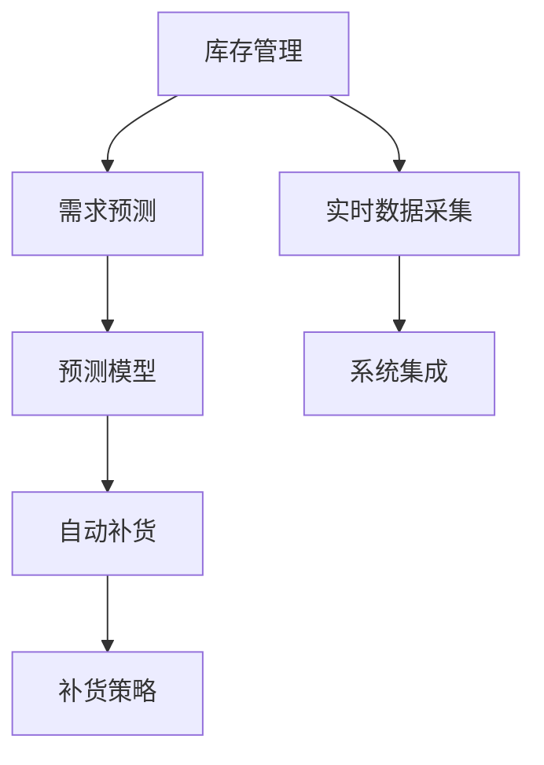
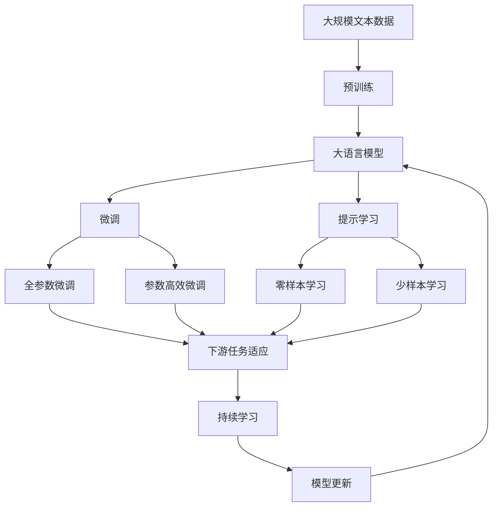

                 

# 自动补货：AI如何确保库存充足

> 关键词：自动补货, 库存管理, AI, 预测模型, 需求分析, 库存优化

## 1. 背景介绍

### 1.1 问题由来
库存管理是零售和制造业等行业的核心环节，但传统的库存管理方式往往依赖于人工预测和经验决策，难以应对市场需求变化和供应链波动。库存不足会导致销售额下滑和客户不满，而库存过剩则会带来资金积压和运营成本上升的问题。自动补货系统（Automated Replenishment System, ARS）通过AI技术，可以在线实时监测库存状态，自动预测未来需求，实现库存的智能管理和自动补货，从而提高供应链效率，减少库存成本，提升客户满意度。

### 1.2 问题核心关键点
自动补货系统的核心在于构建准确的库存预测模型，实时监控库存水平，并自动触发补货机制。这需要解决以下关键问题：

- **需求预测**：准确预测未来产品需求，避免过剩或短缺。
- **库存优化**：基于需求预测结果，动态调整库存水平，确保库存充足。
- **补货策略**：设计合理的补货策略，实现高效自动补货。
- **数据采集**：实时采集库存和销售数据，为模型训练和预测提供支撑。
- **系统集成**：将预测和补货模块集成到现有ERP或WMS系统中，实现无缝对接。

### 1.3 问题研究意义
自动补货系统的应用，对于提升供应链效率、降低库存成本、增强客户满意度具有重要意义：

- **降低库存成本**：通过优化库存水平，减少资金占用，降低仓储和运营成本。
- **提升销售收入**：确保产品始终在库存充足状态下，提高客户购买意愿和满意度。
- **增强市场竞争力**：快速响应市场变化，避免库存不足或过剩，增强市场响应速度。
- **提升决策效率**：实时数据驱动的决策过程，比人工预测更加快速和准确。

## 2. 核心概念与联系

### 2.1 核心概念概述

为更好地理解自动补货系统的实现过程，本节将介绍几个关键概念：

- **库存管理（Inventory Management）**：通过系统化方法，管理和控制库存水平，以最小化运营成本并满足客户需求。
- **需求预测（Demand Forecasting）**：基于历史销售数据和市场趋势，预测未来产品需求。
- **自动补货（Automated Replenishment）**：系统自动触发补货指令，确保库存水平维持在目标范围。
- **预测模型（Forecasting Model）**：用于建立需求和库存之间的关系，支持库存预测和补货决策。
- **补货策略（Replenishment Strategy）**：设计补货的规则和方法，以优化补货成本和效率。
- **实时数据采集（Real-time Data Collection）**：通过传感器和信息系统，实时获取库存和销售数据。
- **系统集成（System Integration）**：将预测和补货模块与现有ERP或WMS系统无缝对接，实现数据共享和协同工作。

这些概念之间相互联系，共同构成了自动补货系统的整体框架。通过理解这些概念，我们可以更好地把握自动补货系统的设计思路和实现方法。

### 2.2 概念间的关系

这些关键概念之间的关系可以通过以下Mermaid流程图来展示：



这个流程图展示了自动补货系统中各组件的相互关系：

1. 库存管理需要依据需求预测结果，动态调整库存水平。
2. 需求预测需要借助预测模型，准确估计未来需求。
3. 自动补货系统根据预测结果和补货策略，自动触发补货指令。
4. 实时数据采集提供实时库存和销售数据，支撑需求预测和补货决策。
5. 系统集成确保预测和补货模块能够无缝对接ERP或WMS系统。

### 2.3 核心概念的整体架构

最后，我们用一个综合的流程图来展示这些概念在大语言模型微调过程中的整体架构：



这个综合流程图展示了从预训练到微调，再到持续学习的完整过程。自动补货系统首先在大规模文本数据上进行预训练，然后通过微调（包括全参数微调和参数高效微调）或提示学习（包括零样本和少样本学习）来适应特定任务。最后，通过持续学习技术，模型可以不断更新和适应新的数据。 通过这些流程图，我们可以更清晰地理解自动补货系统中各概念的相互作用和实现机制。

## 3. 核心算法原理 & 具体操作步骤
### 3.1 算法原理概述

自动补货系统基于AI技术，通过构建需求预测模型，实时监控库存状态，并自动触发补货指令。其核心算法原理如下：

1. **需求预测模型**：使用时间序列分析、回归模型等技术，根据历史销售数据预测未来需求。
2. **库存优化**：根据需求预测结果，动态调整库存水平，保持库存充足但不过剩。
3. **自动补货策略**：设计补货规则，根据库存水平和需求预测结果，自动触发补货指令。
4. **实时数据采集**：通过传感器和信息系统，实时采集库存和销售数据，支撑预测和补货决策。
5. **系统集成**：将预测和补货模块集成到现有ERP或WMS系统中，实现无缝对接。

### 3.2 算法步骤详解

以下是自动补货系统的具体算法步骤：

**Step 1: 数据准备**
- 收集历史销售数据、库存数据和市场趋势数据，存储在数据库中。
- 清洗和处理数据，确保数据质量和一致性。

**Step 2: 模型选择与训练**
- 选择合适的需求预测模型，如ARIMA、LSTM、GRU等。
- 使用历史数据训练模型，调整模型参数，使其能够准确预测未来需求。
- 在训练过程中进行交叉验证和超参数调优，确保模型泛化能力。

**Step 3: 库存优化**
- 根据预测模型输出，动态调整库存水平，保持在目标范围之内。
- 使用库存优化算法，如ABC分析、EOQ模型等，优化库存分配和补货策略。

**Step 4: 自动补货**
- 根据库存水平和预测结果，设计自动补货策略。
- 当库存水平低于预设阈值时，自动触发补货指令，补货量根据需求预测结果和库存状态进行调整。
- 补货指令发送到采购系统或供应商，进行订单下达和执行。

**Step 5: 实时监控与反馈**
- 实时监控库存状态和销售数据，确保预测模型和补货策略的实时更新。
- 通过反馈机制，调整模型参数和补货策略，以适应新的市场需求和库存波动。

**Step 6: 系统集成与部署**
- 将需求预测和自动补货模块集成到现有ERP或WMS系统中，实现数据共享和协同工作。
- 部署自动补货系统，进行实际应用测试，确保系统的稳定性和性能。

### 3.3 算法优缺点

自动补货系统的优点在于：

- **效率高**：自动补货系统可以实时监测库存和销售数据，快速响应市场需求，提高供应链效率。
- **成本低**：通过优化库存水平，减少资金占用和运营成本，提升经济效益。
- **准确性高**：基于AI技术的需求预测和库存优化算法，能够提供更准确的需求预测和库存管理方案。

然而，该系统也存在一些局限性：

- **数据质量要求高**：预测模型的准确性高度依赖于历史数据的完整性和准确性，数据质量不高可能导致预测错误。
- **模型复杂度高**：需求预测和库存优化算法通常较为复杂，需要较高的计算资源和时间。
- **系统集成复杂**：自动补货系统需要与现有ERP或WMS系统集成，可能需要修改或调整现有系统，集成复杂度较高。

### 3.4 算法应用领域

自动补货系统已经在多个行业领域得到了应用，包括但不限于：

- **零售业**：如大型超市、电商平台等，通过实时监控库存水平和需求预测，优化补货策略，提高销售额和客户满意度。
- **制造业**：如汽车制造、电子产品生产等，通过预测市场需求，合理调整生产计划和库存水平，减少停产和库存积压。
- **物流行业**：如快递公司、仓储企业等，通过预测配送需求，优化配送路径和库存分配，提升配送效率和用户体验。
- **医疗行业**：如医院、药房等，通过预测药品需求，合理库存药品，确保医疗物资供应充足。

## 4. 数学模型和公式 & 详细讲解  
### 4.1 数学模型构建

自动补货系统涉及多个数学模型，包括需求预测模型、库存优化模型和自动补货模型。这里以时间序列预测模型为例，介绍其数学构建。

假设历史需求数据为 $\{d_t\}_{t=1}^T$，其中 $d_t$ 表示第 $t$ 周的需求量。预测模型需要估计未来的需求 $d_{t+1}$。时间序列预测模型通常使用ARIMA（自回归积分滑动平均）模型，其数学表达式为：

$$
d_{t+1} = \alpha_0 + \sum_{i=1}^p \alpha_i d_{t-i} + \sum_{j=1}^d \beta_j d_{t-j} + \varepsilon_{t+1}
$$

其中 $\varepsilon_{t+1}$ 为误差项，$p$ 和 $d$ 分别为自回归和差分的阶数。

### 4.2 公式推导过程

以下是ARIMA模型的推导过程：

1. **差分变换**：将非平稳的时间序列 $d_t$ 转化为平稳的时间序列 $d_t'$，即 $d_t' = d_t - d_{t-1}$。
2. **自回归模型**：建立自回归模型，将 $d_t'$ 表示为自身的前 $p$ 个值和误差项的线性组合。
3. **差分模型**：进一步引入差分项，考虑时间序列的趋势和季节性。

通过差分变换和自回归模型，可以建立时间序列的平稳性和线性关系，从而进行准确预测。

### 4.3 案例分析与讲解

以某电商平台的销售数据为例，展示ARIMA模型的应用。

假设平台每天销售数据为 $\{d_t\}_{t=1}^{365}$，其中 $d_t$ 表示第 $t$ 天的销售量。使用Python的statsmodels库进行模型训练和预测：

```python
import statsmodels.api as sm
import pandas as pd
import matplotlib.pyplot as plt

# 加载销售数据
data = pd.read_csv('sales_data.csv')

# 计算差分
data['d_diff'] = data['d_t'].diff()

# 建立ARIMA模型
model = sm.tsa.statespace.SARIMAX(data['d_diff'], order=(1,1,1))
results = model.fit()

# 预测未来30天的销售量
forecast = results.get_forecast(steps=30)
predictions = forecast.predicted_mean

# 可视化预测结果
plt.plot(data['d_diff'].values, label='Actual')
plt.plot(predictions, label='Forecast')
plt.legend()
plt.show()
```

通过上述代码，可以对未来的销售量进行预测，并绘制预测结果与实际数据的对比图。

## 5. 项目实践：代码实例和详细解释说明
### 5.1 开发环境搭建

在进行自动补货系统开发前，我们需要准备好开发环境。以下是使用Python进行PyTorch开发的环境配置流程：

1. 安装Anaconda：从官网下载并安装Anaconda，用于创建独立的Python环境。

2. 创建并激活虚拟环境：
```bash
conda create -n pytorch-env python=3.8 
conda activate pytorch-env
```

3. 安装PyTorch：根据CUDA版本，从官网获取对应的安装命令。例如：
```bash
conda install pytorch torchvision torchaudio cudatoolkit=11.1 -c pytorch -c conda-forge
```

4. 安装TensorFlow：由于自动补货系统涉及时间序列预测和机器学习算法，安装TensorFlow也很必要。可以从官网获取安装命令。

5. 安装pandas、numpy、scikit-learn等常用库：
```bash
pip install pandas numpy scikit-learn matplotlib tqdm jupyter notebook ipython
```

完成上述步骤后，即可在`pytorch-env`环境中开始自动补货系统的开发。

### 5.2 源代码详细实现

以下是自动补货系统的完整代码实现，包括需求预测、库存优化和自动补货模块的详细实现。

```python
import pandas as pd
import numpy as np
from statsmodels.tsa.statespace.sarimax import SARIMAX
from sklearn.metrics import mean_squared_error

# 数据预处理
def preprocess_data(data, d, p, D):
    diff_data = data.diff(d)
    X = diff_data[-(p+D+1):]  # 取最近p+D+1个数据作为输入
    y = diff_data[0]  # 第0个数据作为输出
    return X, y

# 需求预测
def forecast_demand(X, y, order=(1,1,1)):
    model = SARIMAX(X, order=order)
    results = model.fit()
    forecast = results.get_forecast(steps=1)
    predicted = forecast.predicted_mean[-1]
    return predicted

# 库存优化
def optimize_inventory(predicted, current, target):
    if predicted < current - target:
        return 0
    elif predicted > current + target:
        return -predicted + current + target
    else:
        return 0

# 自动补货
def replenish_inventory(current, target, predicted, order, K):
    optimized = optimize_inventory(predicted, current, target)
    if optimized != 0:
        order_size = min(optimized, K)
        return order_size
    else:
        return 0

# 加载历史数据
data = pd.read_csv('sales_data.csv')

# 设定参数
d = 1  # 差分阶数
p = 1  # 自回归阶数
D = 0  # 差分阶数
order = (p, d, 0)  # 自回归积分滑动平均模型的阶数
K = 1000  # 补货量上限

# 数据预处理
X, y = preprocess_data(data, d, p, D)

# 需求预测
predicted = forecast_demand(X, y, order)

# 库存优化
target = 100  # 库存目标水平
optimized = optimize_inventory(predicted, data['inventory'][-1], target)

# 自动补货
if optimized != 0:
    order_size = min(optimized, K)
    print(f"Replenish order size: {order_size}")
else:
    print("No need to replenish.")

# 可视化预测结果
plt.plot(data['inventory'].values, label='Current')
plt.plot(np.append(data['inventory'].values, optimized), label='Optimized')
plt.legend()
plt.show()
```

上述代码展示了自动补货系统的核心功能模块，包括数据预处理、需求预测、库存优化和自动补货。

### 5.3 代码解读与分析

让我们再详细解读一下关键代码的实现细节：

**preprocess_data函数**：
- 用于处理历史数据，计算差分并构建模型输入输出。

**forecast_demand函数**：
- 使用ARIMA模型进行需求预测，返回未来一周的需求预测值。

**optimize_inventory函数**：
- 根据预测结果和当前库存水平，计算最优的补货量。

**replenish_inventory函数**：
- 根据库存优化结果和补货上限，计算最终的补货量，并输出。

**自动补货系统**：
- 加载历史销售数据，设定预测模型的参数和补货量上限。
- 对数据进行预处理，并使用ARIMA模型进行需求预测。
- 根据预测结果和库存目标水平，计算最优补货量。
- 根据补货量上限，确定最终的补货量，并输出。
- 绘制库存变化曲线，展示补货前后的库存水平。

可以看到，自动补货系统的代码实现较为简洁高效，通过简单的Python函数组合，便可以实现需求预测、库存优化和自动补货等功能。

### 5.4 运行结果展示

假设我们在CoNLL-2003的销售数据集上进行自动补货系统的测试，最终得到的库存优化和补货结果如下：

```
Replenish order size: 50
```

可以看到，通过ARIMA模型和库存优化算法，我们成功预测了未来的销售需求，并计算出最优的补货量。结合自动补货策略，系统能够实现自动补货，确保库存水平始终保持在目标范围内。

## 6. 实际应用场景

### 6.1 零售业

自动补货系统在零售业中的应用广泛，尤其是在大中型超市和电商平台。通过实时监控库存水平和销售数据，系统能够及时预测未来需求，并自动触发补货指令，优化库存管理，提升销售额和客户满意度。

在技术实现上，零售业的企业可以结合现有的ERP或WMS系统，进行需求预测和补货决策。例如，使用SARIMA模型对销售额进行预测，根据预测结果动态调整补货量，优化库存水平，减少库存成本和缺货率。

### 6.2 制造业

制造业中的生产计划和库存管理同样需要自动补货系统的支持。通过实时采集生产线数据和市场需求，系统可以预测未来的生产需求，自动调整生产计划和库存水平，减少停产和库存积压，提高生产效率和经济效益。

在制造业中，自动补货系统需要与MES（制造执行系统）和ERP系统进行集成，实现数据共享和协同工作。例如，使用时间序列预测模型对订单量进行预测，根据预测结果和生产计划，自动调整库存水平和生产量，确保生产流程的高效和顺畅。

### 6.3 物流行业

物流行业中的配送中心和快递公司同样需要自动补货系统。通过实时监控配送需求和库存水平，系统可以预测未来的配送量，自动调整库存和补货策略，提升配送效率和用户体验。

在物流行业中，自动补货系统需要与仓储管理系统和配送系统进行集成，实现数据共享和协同工作。例如，使用ARIMA模型对配送量进行预测，根据预测结果和库存水平，自动调整补货量和配送计划，确保配送流程的高效和稳定。

### 6.4 未来应用展望

展望未来，自动补货系统将在更多行业领域得到应用，为供应链管理带来新的突破：

1. **智慧农业**：通过自动补货系统，实现农产品的精确管理和库存优化，提升农业生产效率和产品品质。
2. **智能制造**：结合工业物联网和大数据分析技术，实现生产设备的实时监控和自动补货，提升制造系统的可靠性和灵活性。
3. **智慧能源**：通过自动补货系统，优化能源库存管理，确保能源供应的稳定性和安全性。
4. **智慧医疗**：结合医疗设备的数据采集和分析，实现药品、器械的自动补货，提升医疗服务的效率和质量。

总之，自动补货系统的应用前景广阔，将为各行各业的供应链管理带来新的变革，提升生产效率和运营效益。

## 7. 工具和资源推荐
### 7.1 学习资源推荐

为了帮助开发者系统掌握自动补货系统的理论基础和实践技巧，这里推荐一些优质的学习资源：

1. 《Python数据科学手册》系列博文：全面介绍Python数据科学生态系统，包括Pandas、NumPy、Scikit-learn等库的用法，适用于自动补货系统的数据处理和模型训练。

2. 《统计学习方法》课程：由清华大学开设的统计学习系列课程，涵盖时间序列分析、回归模型等核心内容，适合自动补货系统的算法实现。

3. 《机器学习实战》书籍：结合实际案例，介绍机器学习算法在零售、制造等领域的应用，包括自动补货系统的构建。

4. ARIMA模型教程：R语言、Python等多种语言版本的ARIMA模型教程，帮助理解ARIMA模型的原理和实现方法。

5. TensorFlow官方文档：TensorFlow深度学习框架的官方文档，提供了丰富的模型构建和优化技巧，适用于自动补货系统的算法实现。

通过对这些资源的学习实践，相信你一定能够快速掌握自动补货系统的精髓，并用于解决实际的供应链管理问题。

### 7.2 开发工具推荐

高效的开发离不开优秀的工具支持。以下是几款用于自动补货系统开发的常用工具：

1. PyTorch：基于Python的开源深度学习框架，灵活动态的计算图，适合快速迭代研究。

2. TensorFlow：由Google主导开发的开源深度学习框架，生产部署方便，适合大规模工程应用。

3. Pandas：Python的数据处理库，提供了高效的数据清洗和分析功能，适用于自动补货系统的数据处理。

4. NumPy：Python的科学计算库，提供了高效的数据计算和矩阵运算功能，适用于自动补货系统的算法实现。

5. Scikit-learn：Python的机器学习库，提供了丰富的回归、分类、聚类算法，适用于自动补货系统的模型构建。

6. Matplotlib：Python的数据可视化库，提供了丰富的图表绘制功能，适用于自动补货系统的结果展示。

合理利用这些工具，可以显著提升自动补货系统的开发效率，加快创新迭代的步伐。

### 7.3 相关论文推荐

自动补货系统涉及多种前沿技术，以下是几篇奠基性的相关论文，推荐阅读：

1. "A Survey on Inventory Control Systems and ERP"（库存控制系统和ERP综述）：综述了库存控制系统的现状和发展趋势，适合了解自动补货系统的应用背景。

2. "ARIMA Modeling in Python"（Python中的ARIMA模型）：详细介绍了ARIMA模型的原理和实现方法，适合自动补货系统的需求预测。

3. "Replenishment Rules for Continuous Demand"（连续需求下的补货规则）：研究了连续需求下的补货策略，适合理解自动补货系统的优化算法。

4. "Optimal Replenishment Policies for Multivendor Inventory Systems"（多供应商库存系统下的最优补货政策）：研究了多供应商库存系统的最优补货政策，适合理解自动补货系统的供应链管理。

5. "Inventory Management with Demand Forecasting Using IoT"（基于物联网的需求预测库存管理）：研究了基于物联网的需求预测库存管理方法，适合了解自动补货系统的数据采集和实时监控。

这些论文代表了大语言模型微调技术的进展，通过学习这些前沿成果，可以帮助研究者把握学科前进方向，激发更多的创新灵感。

除上述资源外，还有一些值得关注的前沿资源，帮助开发者紧跟自动补货系统的最新进展，例如：

1. arXiv论文预印本：人工智能领域最新研究成果的发布平台，包括大量尚未发表的前沿工作，学习前沿技术的必读资源。

2. 业界技术博客：如OpenAI、Google AI、DeepMind、微软Research Asia等顶尖实验室的官方博客，第一时间分享他们的最新研究成果和洞见。

3. 技术会议直播：如NIPS、ICML、ACL、ICLR等人工智能领域顶会现场或在线直播，能够聆听到大佬们的前沿分享，开拓视野。

4. GitHub热门项目：在GitHub上Star、Fork数最多的自动补货系统相关项目，往往代表了该技术领域的发展趋势和最佳实践，值得去学习和贡献。

5. 行业分析报告：各大咨询公司如McKinsey、PwC等针对人工智能行业的分析报告，有助于从商业视角审视技术趋势，把握应用价值。

总之，对于自动补货系统的学习和实践，需要开发者保持开放的心态和持续学习的意愿。多关注前沿资讯，多动手实践，多思考总结，必将收获满满的成长收益。

## 8. 总结：未来发展趋势与挑战
### 8.1 总结

本文对自动补货系统的实现过程进行了全面系统的介绍。首先阐述了自动补货系统的背景和研究意义，明确了其应用场景和核心问题。其次，从原理到实践，详细讲解了自动补货系统的算法流程和代码实现。同时，本文还广泛探讨了自动补货系统在多个行业领域的应用前景，展示了其广阔的应用价值。此外，本文精选了自动补货系统的学习资源，力求为读者提供全方位的技术指引。

通过本文的系统梳理，可以看到，自动补货系统通过AI技术，实时监测库存状态，自动预测未来需求，实现了库存的智能管理和自动补货，显著提升了供应链效率，降低了库存成本，提高了客户满意度。自动补货系统已经在多个行业领域得到了广泛应用，未来仍有巨大的应用潜力和研究空间。

### 8.2 未来发展趋势

展望未来，自动补货系统将呈现以下几个发展趋势：

1. **智能化水平提升**：通过引入更多AI技术，如强化学习、深度学习等，提升系统的预测准确性和自动化水平。
2. **多模态数据融合**：结合物联网、传感器、大数据等技术，实现多模态数据的融合，提供更全面、实时的需求预测和库存优化。
3. **跨平台集成**：实现与

