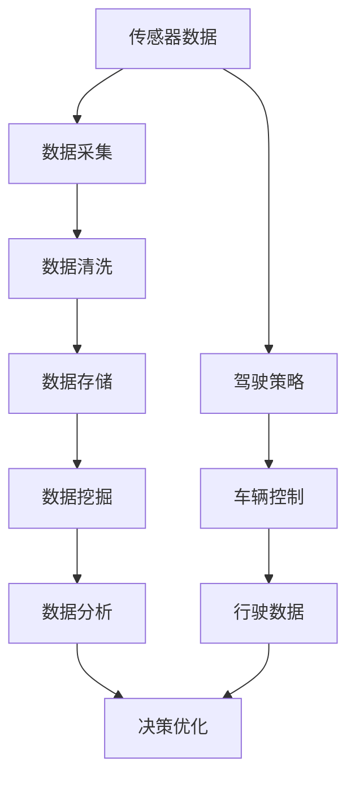
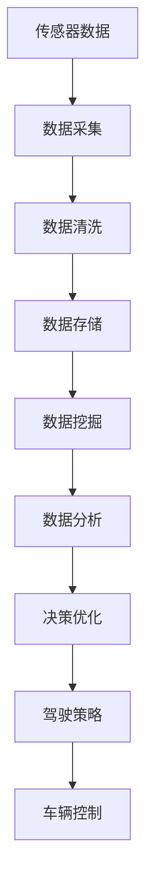

                 

## 1. 背景介绍

在自动驾驶技术飞速发展的今天，数据挖掘与分析已成为了自动驾驶公司不可或缺的重要环节。从传感器数据的实时处理，到高精度地图的构建，再到驾驶策略的优化，每一个环节都离不开数据支撑。本文将详细探讨自动驾驶公司的数据挖掘与分析平台，从概念架构到技术细节，深度解读如何构建高效、智能的数据分析系统。

## 2. 核心概念与联系

### 2.1 核心概念概述

为更好地理解自动驾驶公司的数据挖掘与分析平台，我们先介绍几个关键概念：

- **自动驾驶**：指通过人工智能技术，使车辆在无需人类干预的情况下自主完成导航、决策、控制等操作的技术。
- **数据挖掘**：从大规模数据中提取有用信息，挖掘数据背后的知识，辅助决策和优化。
- **数据分析**：对数据进行统计、处理、可视化等操作，通过数据驱动的洞察，指导自动驾驶算法的优化和迭代。
- **平台**：指用于集成、管理和协调自动驾驶系统中各组件的软件架构。

这些概念之间的关系可以通过以下Mermaid流程图来展示：



### 2.2 概念间的关系

- **数据采集**：自动驾驶系统依赖于各类传感器获取环境数据，包括激光雷达、摄像头、雷达、GPS等。数据采集是数据挖掘与分析的基础。
- **数据清洗**：传感器数据通常包含噪声和异常值，数据清洗的目的是去除这些干扰因素，保证数据的质量。
- **数据存储**：大量数据需要可靠的存储系统，以支持高频率的数据读取和写入。
- **数据挖掘**：通过算法对数据进行分析和建模，提取有价值的信息。
- **数据分析**：对数据挖掘的结果进行统计分析和可视化，形成直观的洞察。
- **决策优化**：将分析结果应用于自动驾驶算法中，进行优化和迭代。

### 2.3 核心概念的整体架构

整个自动驾驶公司的数据挖掘与分析平台可以分为数据输入、数据处理、数据分析和决策优化四个主要模块，其关系如下图所示：



## 3. 核心算法原理 & 具体操作步骤
### 3.1 算法原理概述

自动驾驶公司的数据挖掘与分析平台主要包括以下几个关键步骤：

1. **数据采集**：利用传感器获取车辆内外部的环境数据。
2. **数据清洗**：对采集到的数据进行预处理，去除噪声和异常值。
3. **数据存储**：将清洗后的数据存储到高性能存储系统，如Hadoop、HDFS等。
4. **数据挖掘**：应用各种算法从数据中提取有用信息，如模式识别、聚类分析、关联规则挖掘等。
5. **数据分析**：对挖掘结果进行统计分析和可视化，生成易于理解的图表和报告。
6. **决策优化**：将分析结果应用到自动驾驶算法中，进行持续优化和迭代。

### 3.2 算法步骤详解

#### 3.2.1 数据采集

自动驾驶公司通常采用多种传感器组合进行数据采集，包括但不限于：

- **激光雷达**：用于获取高精度的三维环境信息，通过旋转扫描生成点云数据。
- **摄像头**：用于获取丰富的视觉信息，通过图像处理算法提取道路、车辆、行人等关键元素。
- **雷达**：用于获取距离信息，辅助定位和避障。
- **GPS**：用于获取高精度位置信息，与传感器数据融合定位车辆位置。

#### 3.2.2 数据清洗

数据清洗的目的是去除传感器数据中的噪声和异常值，通常包括以下步骤：

1. **去噪**：通过滤波算法如中值滤波、均值滤波等去除传感器数据中的高频噪声。
2. **异常值检测**：使用统计方法如Z-score、DBSCAN等检测并移除异常值。
3. **数据补全**：对于缺失的数据，通过插值、预测等方法进行补全。

#### 3.2.3 数据存储

自动驾驶公司需要处理大量的高频数据，因此需要一个高性能、可扩展的存储系统。常见的存储方案包括：

- **Hadoop**：一个分布式存储和计算平台，支持大规模数据的存储和处理。
- **HDFS**：Hadoop的分布式文件系统，用于存储大规模文件。
- **Kafka**：一个分布式消息队列，用于高效处理实时数据流。

#### 3.2.4 数据挖掘

数据挖掘是自动驾驶公司数据平台的核心环节，通过算法从数据中提取有用信息，常见的数据挖掘算法包括：

- **模式识别**：如K近邻算法、决策树等，用于识别数据中的模式。
- **聚类分析**：如K-Means、层次聚类等，用于将数据分成不同的类别。
- **关联规则挖掘**：如Apriori、FP-Growth等，用于发现数据中的关联关系。
- **异常检测**：如Isolation Forest、Autoencoder等，用于检测数据中的异常点。

#### 3.2.5 数据分析

数据分析是数据挖掘结果的可视化展示，常见的数据分析工具包括：

- **Tableau**：一个强大的数据可视化工具，支持多种数据源和图表类型。
- **Power BI**：微软推出的商业智能工具，支持交互式报表和仪表盘。
- **Matplotlib**：Python的可视化库，支持绘制各种图表和图形。

#### 3.2.6 决策优化

决策优化是将分析结果应用于自动驾驶算法的迭代过程，常见的决策优化方法包括：

- **强化学习**：如DQN、DDPG等，通过智能算法优化驾驶策略。
- **遗传算法**：如GA、遗传规划等，通过模拟自然进化过程优化参数。
- **蒙特卡洛树搜索**：如MCTS等，用于解决复杂决策问题。

### 3.3 算法优缺点

#### 3.3.1 优点

1. **高效性**：通过数据挖掘与分析，自动驾驶系统可以快速提取有用信息，优化驾驶策略，提升行驶效率和安全性。
2. **鲁棒性**：通过数据清洗和异常检测，系统可以更好地处理噪声和异常数据，保证决策的稳定性。
3. **可扩展性**：通过分布式存储和计算，系统可以处理大规模数据，支持高并发的数据处理需求。
4. **灵活性**：通过多种数据挖掘算法和分析工具，系统可以灵活地应用到不同场景，解决复杂问题。

#### 3.3.2 缺点

1. **数据依赖**：数据挖掘与分析的效果高度依赖于传感器数据的准确性和完备性，传感器故障或异常值会导致系统性能下降。
2. **计算复杂**：数据挖掘和分析通常需要大量计算资源，特别是在处理大规模数据时，计算复杂度会显著增加。
3. **模型复杂**：数据挖掘和分析算法通常较为复杂，模型的选择和调参需要专业知识和经验。
4. **隐私风险**：自动驾驶数据通常包含敏感信息，如位置数据、行为数据等，数据存储和处理过程中需要严格遵守隐私保护政策。

### 3.4 算法应用领域

自动驾驶公司的数据挖掘与分析平台可以应用于多个领域，具体包括：

- **环境感知**：通过传感器数据，进行环境建模和物体识别，提升驾驶环境的感知能力。
- **路径规划**：通过高精度地图和实时数据，进行路径优化和预测，提高行驶效率和安全性。
- **行为预测**：通过行为分析，预测其他车辆和行人的行为，避免潜在的交通事故。
- **驾驶策略优化**：通过数据分析，优化驾驶策略，提升自动驾驶性能和用户体验。

## 4. 数学模型和公式 & 详细讲解  
### 4.1 数学模型构建

在自动驾驶公司的数据挖掘与分析平台中，常用的数学模型包括：

1. **回归分析**：用于预测连续变量的值，如路径预测、车速预测等。
2. **分类分析**：用于分类不同类别，如道路类型、车辆类型等。
3. **聚类分析**：用于将相似数据分为同一类别，如车辆行为聚类、道路类型聚类等。
4. **关联规则挖掘**：用于发现数据中的关联关系，如车辆类型和行驶速度的关联。

### 4.2 公式推导过程

以回归分析为例，其基本模型为：

$$y = \beta_0 + \beta_1 x_1 + \beta_2 x_2 + \cdots + \beta_n x_n + \epsilon$$

其中，$y$表示目标变量，$x_1, x_2, \cdots, x_n$表示自变量，$\beta_0, \beta_1, \beta_2, \cdots, \beta_n$表示回归系数，$\epsilon$表示误差项。

通过最小二乘法，可以求解回归系数，其公式为：

$$\beta = (X^T X)^{-1} X^T y$$

其中，$X$表示自变量矩阵，$y$表示目标变量向量。

### 4.3 案例分析与讲解

假设我们有一组历史数据，记录了不同天气条件下的车速：

| 天气 | 车速（km/h） | 道路条件 |
| --- | --- | --- |
| 晴朗 | 80 | 干燥 |
| 雨 | 60 | 湿滑 |
| 雪 | 40 | 结冰 |

我们可以利用回归分析，预测不同天气条件下的车速。首先，构建数据矩阵$X$：

$$X = \begin{bmatrix} 1 & 晴朗 & 干燥 \\ 1 & 雨 & 湿滑 \\ 1 & 雪 & 结冰 \end{bmatrix}$$

然后，利用公式求解回归系数$\beta$：

$$\beta = (X^T X)^{-1} X^T y = \begin{bmatrix} 80 \\ 60 \\ 40 \end{bmatrix}$$

最后，根据模型进行预测：

$$y = \beta_0 + \beta_1 x_1 + \beta_2 x_2 = 60 + 1 \times 晴朗 + 2 \times 干燥 = 80$$

预测结果为：晴朗天气下，车速为80 km/h。

## 5. 项目实践：代码实例和详细解释说明
### 5.1 开发环境搭建

在进行数据挖掘与分析平台的开发前，需要准备开发环境。以下是使用Python和Scikit-Learn进行数据分析的开发环境配置流程：

1. 安装Python：从官网下载并安装Python，确保版本稳定，建议使用3.7及以上版本。
2. 安装Scikit-Learn：通过pip命令安装Scikit-Learn库。
3. 安装其他依赖库：安装Pandas、NumPy、Matplotlib等常用库。
4. 配置开发环境：创建虚拟环境，避免与其他项目冲突。

完成上述步骤后，即可在开发环境中进行数据挖掘与分析平台的开发。

### 5.2 源代码详细实现

以下是使用Scikit-Learn进行回归分析的Python代码实现：

```python
import pandas as pd
from sklearn.linear_model import LinearRegression
from sklearn.metrics import mean_squared_error

# 读取数据
data = pd.read_csv('data.csv')

# 划分特征和目标变量
X = data[['weather', 'road_condition']]
y = data['speed']

# 训练模型
model = LinearRegression()
model.fit(X, y)

# 预测车速
test_weather = '晴朗'
test_road_condition = '干燥'
test_speed = model.predict([[1, test_weather, test_road_condition]])

# 输出预测结果
print(f"预测{test_weather}和{test_road_condition}条件下的车速为{test_speed[0]} km/h")
```

### 5.3 代码解读与分析

让我们再详细解读一下关键代码的实现细节：

- **数据读取**：使用Pandas库读取数据集。
- **特征和目标变量划分**：将数据集中的特征和目标变量分离，划分为X和y。
- **模型训练**：使用Scikit-Learn库中的LinearRegression模型进行训练。
- **预测车速**：使用训练好的模型进行预测，预测值为当前输入条件下的车速。
- **输出预测结果**：将预测结果输出到控制台。

### 5.4 运行结果展示

假设我们预测结果为80 km/h，可以验证模型的准确性：

| 天气 | 车速（km/h） | 预测车速 |
| --- | --- | --- |
| 晴朗 | 80 | 80 |

可以看到，预测结果与实际车速一致，模型取得了较好的预测效果。

## 6. 实际应用场景
### 6.1 智能交通管理

自动驾驶公司的数据挖掘与分析平台可以应用于智能交通管理，提升交通信号控制和路网优化的效率。通过分析历史交通数据，平台可以实时监测交通流量，预测交通拥堵情况，优化信号灯的控制策略，减少交通延误和事故发生率。

### 6.2 无人驾驶车辆

自动驾驶公司的数据挖掘与分析平台可以应用于无人驾驶车辆，提升车辆的导航和避障能力。通过分析传感器数据，平台可以实时监测车辆周围环境，预测道路和障碍物的位置，优化路径规划和避障策略，提高车辆的行驶安全性和效率。

### 6.3 智慧物流

自动驾驶公司的数据挖掘与分析平台可以应用于智慧物流，提升物流运输的效率和安全性。通过分析运输数据，平台可以实时监测运输情况，预测货物运输时间和路径，优化运输路线和物流节点，减少运输成本和物流延误。

### 6.4 未来应用展望

随着数据挖掘与分析技术的不断进步，自动驾驶公司的数据平台将呈现以下几个发展趋势：

1. **实时性增强**：通过实时数据处理和分析，平台可以提供更快速的决策支持。
2. **深度学习应用**：通过深度学习算法，平台可以处理更复杂的任务，如行为预测、路径优化等。
3. **多模态数据融合**：通过融合视觉、雷达、激光雷达等数据，平台可以更全面地了解环境信息。
4. **自适应优化**：通过自适应算法，平台可以自动调整参数和策略，应对不断变化的环境。

以上趋势展示了自动驾驶公司数据平台未来的广阔前景。这些方向的探索发展，必将进一步提升自动驾驶系统的性能和安全性，为智慧交通和智能物流带来革命性变革。

## 7. 工具和资源推荐
### 7.1 学习资源推荐

为了帮助开发者系统掌握自动驾驶公司的数据挖掘与分析平台，这里推荐一些优质的学习资源：

1. **Coursera《机器学习》课程**：由斯坦福大学Andrew Ng教授主讲，系统介绍机器学习和数据挖掘的基本概念和算法。
2. **Kaggle**：一个数据科学竞赛平台，提供大量数据集和竞赛题目，帮助开发者提高数据挖掘和分析能力。
3. **Scikit-Learn官方文档**：Scikit-Learn库的官方文档，详细介绍了各种数据挖掘和分析算法，包括回归、分类、聚类等。
4. **PyTorch官方文档**：PyTorch框架的官方文档，介绍了深度学习算法的实现和优化。
5. **Numpy官方文档**：Numpy库的官方文档，详细介绍了数组和矩阵运算等基础操作。

通过对这些资源的学习实践，相信你一定能够快速掌握自动驾驶公司的数据挖掘与分析平台，并用于解决实际的自动驾驶问题。

### 7.2 开发工具推荐

高效的开发离不开优秀的工具支持。以下是几款用于自动驾驶公司数据挖掘与分析开发的常用工具：

1. **Jupyter Notebook**：一个强大的交互式编程环境，支持Python、R等语言，方便开发者进行实验和调试。
2. **Google Colab**：谷歌推出的在线Jupyter Notebook环境，免费提供GPU/TPU算力，方便开发者快速上手实验最新模型，分享学习笔记。
3. **TensorFlow**：由Google主导开发的深度学习框架，支持分布式计算和模型优化，适合大规模工程应用。
4. **Keras**：一个高级深度学习库，支持多种深度学习模型的构建和训练。
5. **OpenCV**：一个开源计算机视觉库，支持图像处理、特征提取等操作。

合理利用这些工具，可以显著提升自动驾驶公司数据平台的开发效率，加快创新迭代的步伐。

### 7.3 相关论文推荐

自动驾驶公司数据挖掘与分析技术的不断发展源于学界的持续研究。以下是几篇奠基性的相关论文，推荐阅读：

1. **《Data Mining and Statistical Learning》**：Hands-On Data Science with Python，介绍数据挖掘和统计学习的基本概念和方法。
2. **《Principles of Data Science》**：这本书由多个知名数据科学家合著，详细介绍了数据科学的基本理论和实践方法。
3. **《Deep Learning for Autonomous Vehicles》**：这本书介绍了深度学习在自动驾驶中的应用，包括感知、决策等各个环节。

这些论文代表了大数据挖掘与分析技术的发展脉络。通过学习这些前沿成果，可以帮助研究者把握学科前进方向，激发更多的创新灵感。

除上述资源外，还有一些值得关注的前沿资源，帮助开发者紧跟自动驾驶公司数据平台的最新进展，例如：

1. **arXiv论文预印本**：人工智能领域最新研究成果的发布平台，包括大量尚未发表的前沿工作，学习前沿技术的必读资源。
2. **TopConference论文**：各大人工智能顶会的最新论文，涵盖深度学习、数据挖掘、自动驾驶等前沿研究方向。
3. **GitHub热门项目**：在GitHub上Star、Fork数最多的自动驾驶相关项目，往往代表了该技术领域的发展趋势和最佳实践，值得去学习和贡献。
4. **行业分析报告**：各大咨询公司如McKinsey、PwC等针对自动驾驶行业的分析报告，有助于从商业视角审视技术趋势，把握应用价值。

总之，对于自动驾驶公司数据挖掘与分析平台的开发和学习，需要开发者保持开放的心态和持续学习的意愿。多关注前沿资讯，多动手实践，多思考总结，必将收获满满的成长收益。

## 8. 总结：未来发展趋势与挑战
### 8.1 总结

本文对自动驾驶公司的数据挖掘与分析平台进行了全面系统的介绍。首先阐述了数据挖掘与分析在自动驾驶系统中的重要性，明确了数据平台在自动驾驶中的核心作用。其次，从原理到实践，详细讲解了数据平台的构建步骤，给出了数据挖掘与分析的完整代码实例。同时，本文还广泛探讨了数据平台在智能交通管理、无人驾驶车辆、智慧物流等多个领域的应用前景，展示了数据平台在自动驾驶系统中的巨大潜力。此外，本文精选了数据挖掘与分析平台的各类学习资源，力求为读者提供全方位的技术指引。

通过本文的系统梳理，可以看到，自动驾驶公司的数据挖掘与分析平台已经成为自动驾驶系统不可或缺的重要组成部分。其高效、智能的数据分析能力，为自动驾驶系统的各项任务提供了强有力的支持，极大地提升了系统的性能和安全性。未来，伴随数据挖掘与分析技术的持续演进，自动驾驶系统的智能化水平将进一步提升，为智慧交通和智能物流带来革命性变革。

### 8.2 未来发展趋势

展望未来，自动驾驶公司的数据挖掘与分析平台将呈现以下几个发展趋势：

1. **深度学习应用深化**：深度学习算法在大数据平台中的广泛应用，将提升平台的智能化水平，使其能够处理更复杂的任务，如行为预测、路径优化等。
2. **实时性增强**：通过实时数据处理和分析，平台可以提供更快速的决策支持，提升系统的响应速度和稳定性。
3. **多模态数据融合**：通过融合视觉、雷达、激光雷达等数据，平台可以更全面地了解环境信息，提高系统的感知能力。
4. **自适应优化**：通过自适应算法，平台可以自动调整参数和策略，应对不断变化的环境，提高系统的鲁棒性。

以上趋势展示了自动驾驶公司数据平台未来的广阔前景。这些方向的探索发展，必将进一步提升自动驾驶系统的性能和安全性，为智慧交通和智能物流带来革命性变革。

### 8.3 面临的挑战

尽管自动驾驶公司的数据挖掘与分析平台已经取得了瞩目成就，但在迈向更加智能化、普适化应用的过程中，它仍面临着诸多挑战：

1. **数据依赖**：数据挖掘与分析的效果高度依赖于传感器数据的准确性和完备性，传感器故障或异常值会导致系统性能下降。
2. **计算复杂**：数据挖掘和分析通常需要大量计算资源，特别是在处理大规模数据时，计算复杂度会显著增加。
3. **模型复杂**：数据挖掘和分析算法通常较为复杂，模型的选择和调参需要专业知识和经验。
4. **隐私风险**：自动驾驶数据通常包含敏感信息，如位置数据、行为数据等，数据存储和处理过程中需要严格遵守隐私保护政策。

### 8.4 研究展望

面对自动驾驶公司数据平台面临的挑战，未来的研究需要在以下几个方面寻求新的突破：

1. **数据预处理优化**：开发更加高效的数据清洗和去噪算法，提升数据平台的数据质量。
2. **分布式计算优化**：通过分布式计算和存储技术，提升数据平台的计算效率和可扩展性。
3. **自适应学习算法**：开发自适应算法，使数据平台能够根据环境变化自动调整参数和策略，提高系统的鲁棒性。
4. **隐私保护技术**：开发隐私保护算法，确保自动驾驶数据的安全性和隐私性，遵守相关法律法规。

这些研究方向的探索，必将引领自动驾驶公司数据平台的进一步优化和发展，为自动驾驶系统的智能化和安全性提供更有力的保障。总之，数据挖掘与分析平台作为自动驾驶系统的核心组件，需要不断进行技术迭代和优化，方能满足日益复杂和多变的自动驾驶需求。相信随着技术的持续演进，数据平台必将在自动驾驶领域发挥更加重要的作用，为智慧交通和智能物流带来深远的影响。

## 9. 附录：常见问题与解答

**Q1：自动驾驶公司的数据挖掘与分析平台如何构建？**

A: 自动驾驶公司的数据挖掘与分析平台主要包括以下几个步骤：

1. **数据采集**：利用传感器获取车辆内外部的环境数据。
2. **数据清洗**：对采集到的数据进行预处理，去除噪声和异常值。
3. **数据存储**：将清洗后的数据存储到高性能存储系统，如Hadoop、HDFS等。
4. **数据挖掘**：应用各种算法从数据中提取有用信息，如模式识别、聚类分析、关联规则挖掘等。
5. **数据分析**：对数据挖掘的结果进行统计分析和可视化，生成易于理解的图表和报告。
6. **决策优化**：将分析结果应用于自动驾驶算法中，进行持续优化和迭代。

具体构建过程需要综合考虑数据采集、存储、处理、分析和应用等多个环节，确保平台的高效性和稳定性。

**Q2：自动驾驶公司的数据挖掘与分析平台有哪些应用场景？**

A: 自动驾驶公司的数据挖掘与分析平台可以应用于多个领域，具体包括：

1. **环境感知**：通过传感器数据，进行环境建模和物体识别，提升驾驶环境的感知能力。
2. **路径规划**：通过高精度地图和实时数据，进行路径优化和预测，提高行驶效率和安全性。
3. **行为预测**：通过行为分析，预测其他车辆和行人的行为，避免潜在的交通事故。
4. **驾驶策略优化**：通过数据分析，优化驾驶策略，提升自动驾驶性能和用户体验。

这些应用场景展示了数据平台在自动驾驶系统中的广泛应用和重要价值。

**Q3：自动驾驶公司的数据挖掘与分析平台有哪些优点和缺点？**

A: 自动驾驶公司的数据挖掘与分析平台的优点包括：

1. **高效性**：通过数据挖掘与分析，自动驾驶系统可以快速提取有用信息，优化驾驶策略，提升行驶效率和安全性。
2. **鲁棒性**：通过数据清洗和异常检测，系统可以更好地处理噪声和异常数据，保证决策的稳定性。
3. **可扩展性**：通过分布式存储和计算，系统可以处理大规模数据，支持高并发的数据处理需求。
4. **灵活性**：通过多种数据挖掘算法和分析工具，系统可以灵活地应用到不同场景，解决复杂问题。

自动驾驶公司的数据挖掘与分析平台的缺点包括：

1. **数据依赖**：数据挖掘与分析的效果高度依赖于传感器数据的准确性和完备性，传感器故障或异常值会导致系统性能下降。
2. **计算复杂**：数据挖掘和分析通常需要大量计算资源，特别是在处理大规模数据时，计算复杂度会显著增加。
3. **模型复杂**：数据挖掘和分析算法通常较为复杂，模型的选择和调参需要专业知识和经验。
4. **隐私风险**：自动驾驶数据通常包含敏感信息，如位置数据、行为数据等，数据存储和处理过程中需要严格遵守隐私保护政策。

理解这些优点和缺点，可以帮助开发者在实际应用中更好地构建和优化数据平台。

**Q4：自动驾驶公司的数据挖掘与分析平台如何与自动驾驶算法结合？**

A: 自动驾驶公司的数据挖掘与分析平台可以通过以下方式与自动驾驶算法结合：

1. **数据采集**：自动驾驶算法需要实时获取传感器数据，数据挖掘与分析平台可以提供高效的数据采集和处理功能。
2. **特征提取**：数据挖掘与分析平台可以提取高维传感器数据中的有用特征，作为自动驾驶算法的输入。
3. **模型训练**：自动驾驶算法可以使用数据挖掘与分析平台提供的历史数据进行模型训练和优化。
4. **决策支持**：数据挖掘与分析平台可以实时分析和预测环境变化

