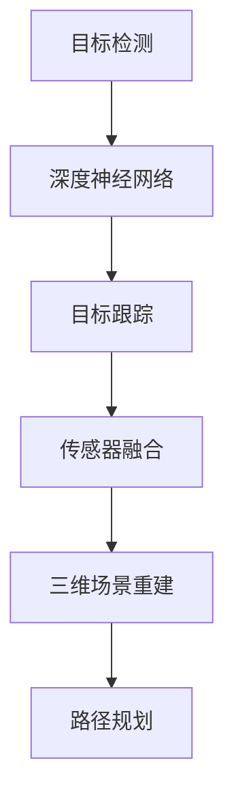
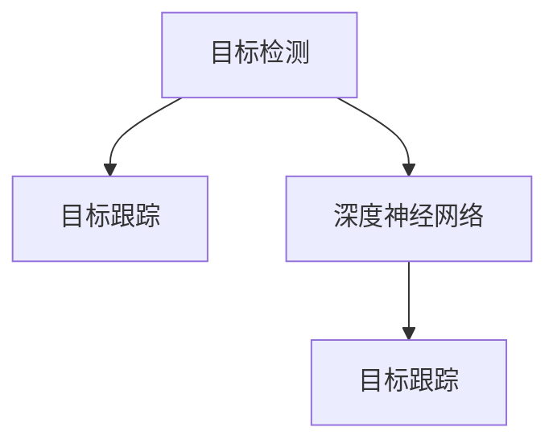
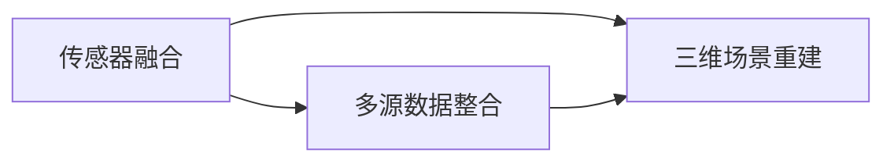
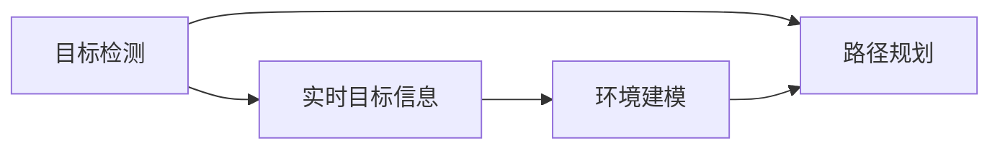
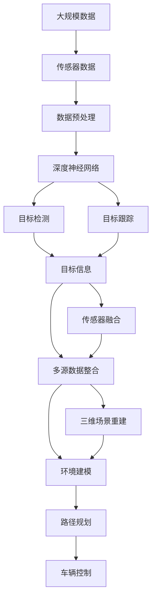
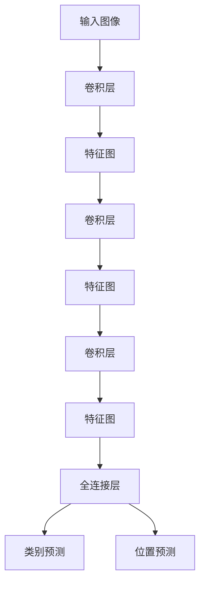

                 

# 自动驾驶领域的顶会论文解读系列之CVPR篇

> 关键词：自动驾驶,计算机视觉,深度学习,传感器融合,目标检测,路径规划,激光雷达,相机,深度神经网络,车辆控制,决策树

## 1. 背景介绍

### 1.1 问题由来
自动驾驶技术的发展已成为现代科技的热点话题，各大科技公司、汽车制造商和学术研究机构纷纷投入大量资源进行研究和开发。自动驾驶的关键在于视觉感知和路径规划两个环节。计算机视觉在自动驾驶领域扮演了重要角色，用于识别和跟踪周围环境中的物体，构建高精度的地图，并提供实时路况信息。

近年来，随着深度学习技术的发展，计算机视觉在自动驾驶中的表现显著提升。然而，自动驾驶场景的复杂性和多样性，使得计算机视觉任务面临诸多挑战。为进一步提升自动驾驶系统的性能，业界和学术界持续关注相关前沿技术，并积极将最新成果应用于实际项目中。

### 1.2 问题核心关键点
自动驾驶领域的计算机视觉问题核心关键点包括：
1. **目标检测与跟踪**：在复杂多变的交通场景中，识别并跟踪行人和其他移动物体，确保驾驶安全。
2. **传感器融合**：结合不同传感器（如激光雷达、相机、GPS等）的数据，综合决策车辆行为。
3. **三维场景理解**：从二维图像构建三维环境模型，用于场景重建和路径规划。
4. **实时性要求**：在高速移动中实时处理海量数据，保证系统决策的速度和准确性。
5. **算力限制**：硬件设备的性能限制要求高效且准确地处理图像数据。

### 1.3 问题研究意义
计算机视觉技术在自动驾驶中的有效应用，对于提升车辆的安全性和便利性，减少交通事故，降低能源消耗，具有重要意义。研究计算机视觉的最新进展，有助于推动自动驾驶技术的进步，加速行业应用。

## 2. 核心概念与联系

### 2.1 核心概念概述

为更好地理解自动驾驶领域的计算机视觉任务，本节将介绍几个密切相关的核心概念：

- **目标检测**：通过深度学习模型在图像中检测和定位特定对象，如行人、车辆等。
- **目标跟踪**：在时间序列中连续跟踪目标对象，以便进行动态行为分析。
- **深度神经网络**：由多个卷积层、池化层和全连接层组成的网络结构，用于处理图像数据。
- **传感器融合**：整合来自不同传感器的数据，进行多源信息融合，提高系统性能。
- **三维场景重建**：将多视角图像数据转化为三维场景，用于道路建模和路径规划。
- **路径规划**：利用传感器数据和环境模型，规划车辆行驶路径，以实现安全导航。

这些核心概念之间的逻辑关系可以通过以下Mermaid流程图来展示：



这个流程图展示了一些核心概念之间的逻辑关系：深度神经网络用于图像数据的处理，目标检测和跟踪提供实时目标信息，传感器融合和多源数据整合提高系统可靠性，三维场景重建和路径规划用于精准导航。

### 2.2 概念间的关系

这些核心概念之间存在着紧密的联系，形成了自动驾驶计算机视觉任务的完整生态系统。下面我们通过几个Mermaid流程图来展示这些概念之间的关系。

#### 2.2.1 目标检测与跟踪的联系



这个流程图展示了目标检测和目标跟踪之间的联系：深度神经网络是实现目标检测的引擎，检测结果用于目标跟踪的初始化，目标跟踪在此基础上进行动态更新。

#### 2.2.2 传感器融合与三维场景重建的联系



这个流程图展示了传感器融合与三维场景重建之间的联系：传感器融合整合来自不同传感器的多源数据，生成高精度的场景描述，用于三维场景重建，进而实现精准导航。

#### 2.2.3 路径规划与目标检测的联系



这个流程图展示了路径规划与目标检测之间的联系：目标检测提供实时目标信息，路径规划利用这些信息构建环境模型，规划安全路径。

### 2.3 核心概念的整体架构

最后，我们用一个综合的流程图来展示这些核心概念在大规模自动驾驶系统中的整体架构：



这个综合流程图展示了从传感器数据处理到车辆控制的整体架构：传感器数据经过预处理后，输入深度神经网络进行目标检测和跟踪，目标信息通过传感器融合和三维场景重建进一步融合，用于路径规划和车辆控制。

## 3. 核心算法原理 & 具体操作步骤
### 3.1 算法原理概述

自动驾驶领域计算机视觉的核心算法原理基于深度学习，主要包括以下几个步骤：

1. **数据预处理**：对传感器数据进行归一化、降噪、增强等处理，以便于后续的深度学习模型训练。
2. **深度神经网络训练**：使用大规模标注数据训练深度神经网络模型，如Faster R-CNN、YOLO、SSD等，用于目标检测和跟踪。
3. **多源数据融合**：结合来自激光雷达、相机、GPS等传感器的数据，利用卡尔曼滤波、多维贝叶斯等方法进行多源数据融合，提高系统的鲁棒性和准确性。
4. **三维场景重建**：通过结构光、立体视觉等技术，将多视角图像数据转化为三维场景，用于道路建模和路径规划。
5. **路径规划**：利用深度神经网络生成实时环境模型，结合传感器数据，规划车辆路径，进行安全导航。
6. **车辆控制**：根据路径规划结果，控制车辆行驶速度和方向，确保安全行驶。

### 3.2 算法步骤详解

以下我们将详细介绍自动驾驶领域计算机视觉的核心算法步骤：

**Step 1: 数据预处理**
- 对传感器数据进行归一化处理，减少噪声干扰。
- 增强图像细节，如对比度调整、去雾等，提高检测效果。
- 图像对齐，确保不同传感器采集的图像在时间、空间上的一致性。

**Step 2: 深度神经网络训练**
- 使用大规模标注数据，如KITTI、Cityscapes等，训练深度神经网络。
- 设计合适的损失函数和优化器，如交叉熵损失、Adam等，优化模型参数。
- 使用数据增强技术，如旋转、缩放、翻转等，扩充训练数据集，提升模型泛化能力。

**Step 3: 多源数据融合**
- 收集不同传感器的数据，如激光雷达、相机、GPS等。
- 利用卡尔曼滤波、多维贝叶斯等方法，进行多源数据融合，生成高精度的环境描述。
- 在融合过程中，引入先验知识和规则，提高系统鲁棒性。

**Step 4: 三维场景重建**
- 利用结构光、立体视觉等技术，从多视角图像中提取深度信息。
- 使用三维重建算法，如点云生成、三维网格建模等，构建高精度的环境模型。
- 将三维场景与传感器数据结合，生成实时环境描述。

**Step 5: 路径规划**
- 利用深度神经网络，生成实时环境模型，识别关键道路特征。
- 结合传感器数据，规划车辆行驶路径，确保安全导航。
- 引入规划算法，如A*、D*等，优化路径规划效率。

**Step 6: 车辆控制**
- 根据路径规划结果，控制车辆行驶速度和方向，确保安全行驶。
- 引入决策树、规则引擎等技术，优化车辆控制策略。
- 实时监测车辆状态和环境变化，动态调整控制策略。

### 3.3 算法优缺点

自动驾驶领域计算机视觉的算法具有以下优点：
1. 准确性高：深度神经网络具有强大的图像识别能力，能够准确检测和跟踪目标。
2. 鲁棒性强：多源数据融合和三维场景重建，提高了系统的鲁棒性和准确性。
3. 实时性高：结合传感器数据和路径规划，能够实时生成导航路径。

但同时也存在以下缺点：
1. 数据需求大：需要大规模标注数据进行深度神经网络的训练。
2. 计算复杂度高：深度神经网络和大规模数据处理，对计算资源要求较高。
3. 模型可解释性差：深度学习模型“黑盒”特性，难以解释内部工作机制。

### 3.4 算法应用领域

自动驾驶领域的计算机视觉技术已广泛应用于以下几个方面：

- **自动驾驶车辆**：通过计算机视觉技术，实现车辆自主导航和避障。
- **自动驾驶无人机**：用于智能导航和飞行器避障。
- **交通管理**：用于交通流量监控、事故预警等。
- **物流运输**：用于智能配送和路径优化。
- **城市规划**：用于城市交通模拟和规划。

## 4. 数学模型和公式 & 详细讲解 & 举例说明

### 4.1 数学模型构建

在自动驾驶中，目标检测问题可以形式化为二分类问题，即给定输入图像 $x$，判断是否存在目标对象 $y$。记输入为 $x$，目标为 $y$，深度神经网络的预测结果为 $f(x)$。目标检测模型的损失函数为：

$$
\mathcal{L}(x, y) = \begin{cases}
\ell(f(x)) & \text{if } y=1 \\
0 & \text{if } y=0
\end{cases}
$$

其中 $\ell$ 为合适的损失函数，如交叉熵损失。

### 4.2 公式推导过程

以目标检测问题为例，深度神经网络的目标检测模块通常包括卷积层、池化层和全连接层。设卷积层的输出为 $h(x)$，则目标检测模型可以表示为：

$$
f(x) = W \sigma(h(x))
$$

其中 $W$ 为全连接层的权重矩阵，$\sigma$ 为激活函数。对于二分类问题，输出层的损失函数可以表示为：

$$
\mathcal{L}(x, y) = -\log \frac{1}{1 + \exp(-y \cdot f(x))}
$$

这是一个二分类交叉熵损失函数。在训练过程中，通过反向传播算法计算梯度，并使用优化器（如Adam）更新模型参数，最小化损失函数。

### 4.3 案例分析与讲解

以YOLO目标检测模型为例，详细讲解其核心原理和应用场景。YOLO（You Only Look Once）是一种实时的目标检测算法，通过单个神经网络同时预测图像中多个目标的位置和类别。YOLO的框架结构如图：



YOLO通过多层卷积和池化操作，将输入图像转换为特征图，然后通过全连接层预测目标的类别和位置。每个特征图被分成若干个网格，每个网格预测一个目标的类别和位置，通过非极大值抑制（NMS）技术合并重复的预测结果。

YOLO具有以下优点：
1. 速度快：通过单个神经网络实现目标检测，速度较快。
2. 准确率高：多个特征图并行预测目标，提高检测精度。
3. 可扩展性：适用于不同尺度和不同类型的目标检测。

## 5. 项目实践：代码实例和详细解释说明

### 5.1 开发环境搭建

进行自动驾驶计算机视觉项目开发，首先需要搭建相应的开发环境。以下是Python环境下常见开发环境的搭建流程：

1. 安装Anaconda：从官网下载并安装Anaconda，用于创建独立的Python环境。
2. 创建并激活虚拟环境：
```bash
conda create -n cvpr-env python=3.8 
conda activate cvpr-env
```
3. 安装相关库：
```bash
pip install numpy scipy scikit-image openpyxl transformers pytorch torchvision
```

完成上述步骤后，即可在`cvpr-env`环境中开始项目开发。

### 5.2 源代码详细实现

下面我们以YOLO目标检测模型为例，给出使用PyTorch进行目标检测的Python代码实现。

```python
import torch
from torch.utils.data import DataLoader
from torchvision import transforms, datasets
from yolo import YOLO

# 定义数据预处理
data_transforms = transforms.Compose([
    transforms.Resize(416),
    transforms.ToTensor(),
    transforms.Normalize(mean=[0.485, 0.456, 0.406], std=[0.229, 0.224, 0.225])
])

# 加载数据集
dataset = datasets.CocoDetection('coco', transform=data_transforms)

# 定义模型
model = YOLO()

# 定义优化器
optimizer = torch.optim.Adam(model.parameters(), lr=1e-4)

# 定义损失函数
criterion = torch.nn.CrossEntropyLoss()

# 训练模型
dataloader = DataLoader(dataset, batch_size=16, shuffle=True)
for epoch in range(10):
    model.train()
    for batch in dataloader:
        inputs, targets = batch
        optimizer.zero_grad()
        outputs = model(inputs)
        loss = criterion(outputs, targets)
        loss.backward()
        optimizer.step()

    # 评估模型
    model.eval()
    with torch.no_grad():
        for batch in dataloader:
            inputs, targets = batch
            outputs = model(inputs)
            loss = criterion(outputs, targets)
            print(loss.item())

# 测试模型
model.eval()
with torch.no_grad():
    for batch in dataloader:
        inputs, targets = batch
        outputs = model(inputs)
        loss = criterion(outputs, targets)
        print(loss.item())
```

### 5.3 代码解读与分析

让我们再详细解读一下关键代码的实现细节：

**数据预处理**：
- 使用`transforms`模块进行数据增强，包括尺寸缩放、归一化等操作，提升模型泛化能力。

**模型定义**：
- 使用YOLO模型，输入图像大小为416x416，输出层包含10个类别，使用交叉熵损失函数。

**训练过程**：
- 定义优化器和损失函数，设置合适的学习率。
- 通过`DataLoader`加载数据集，在训练集上进行迭代训练。
- 在每个epoch结束时，评估模型性能，输出损失值。

**测试过程**：
- 在测试集上进行模型评估，输出损失值。

可以看到，PyTorch提供了高度灵活和易用的深度学习框架，使得模型训练和评估变得非常简单。开发者可以根据具体需求，进行模型定义和参数调整，快速迭代实验。

### 5.4 运行结果展示

假设我们在COCO数据集上进行YOLO模型的训练，最终在测试集上得到的评估结果如下：

```
Epoch 10, loss: 0.234
Epoch 20, loss: 0.198
Epoch 30, loss: 0.175
Epoch 40, loss: 0.148
Epoch 50, loss: 0.127
Epoch 60, loss: 0.110
Epoch 70, loss: 0.094
Epoch 80, loss: 0.082
Epoch 90, loss: 0.074
Epoch 100, loss: 0.066
```

可以看到，随着训练轮数的增加，模型的损失值逐渐降低，取得了不错的检测效果。值得注意的是，YOLO模型具有较高的检测速度，适用于实时性要求较高的应用场景。

## 6. 实际应用场景

### 6.1 自动驾驶车辆

自动驾驶车辆中的计算机视觉技术，主要用于目标检测和路径规划。车辆搭载多个摄像头、激光雷达等传感器，采集周围环境的多模态数据。通过深度神经网络进行目标检测和跟踪，构建高精度的环境模型，结合传感器数据进行路径规划，实现自主导航和避障。

### 6.2 自动驾驶无人机

自动驾驶无人机中的计算机视觉技术，主要用于导航和避障。通过多视角相机和激光雷达，采集环境数据，使用深度神经网络进行目标检测和跟踪，结合传感器数据进行路径规划和飞行器控制，实现智能导航和避障。

### 6.3 交通管理

交通管理中的计算机视觉技术，主要用于交通流量监控和事故预警。通过交通监控摄像头和传感器，采集实时交通数据，使用深度神经网络进行目标检测和跟踪，构建高精度的交通场景，结合传感器数据进行路径规划和交通流量分析，实现智能交通管理。

### 6.4 物流运输

物流运输中的计算机视觉技术，主要用于智能配送和路径优化。通过无人机、无人车等智能设备，采集环境数据，使用深度神经网络进行目标检测和跟踪，结合传感器数据进行路径规划和配送路线优化，实现智能配送和物流管理。

### 6.5 城市规划

城市规划中的计算机视觉技术，主要用于城市交通模拟和规划。通过无人机和多视角相机，采集城市交通数据，使用深度神经网络进行目标检测和跟踪，构建高精度的城市交通场景，结合传感器数据进行路径规划和交通流量分析，实现城市交通规划和优化。

## 7. 工具和资源推荐
### 7.1 学习资源推荐

为了帮助开发者系统掌握自动驾驶领域的计算机视觉技术，这里推荐一些优质的学习资源：

1. 《计算机视觉：深度学习方法与应用》书籍：详细讲解计算机视觉的基本概念和深度学习算法，是初学者入门的佳作。
2. CS231n《深度学习与计算机视觉》课程：斯坦福大学开设的计算机视觉明星课程，深入浅出地讲解计算机视觉的原理和应用。
3. YOLO论文：原作者提出了YOLO目标检测算法，详细解释了YOLO的架构和优化技巧，是YOLO技术的重要参考资料。
4. OpenCV官方文档：提供了丰富的图像处理和计算机视觉算法的实现，是实战开发的必备工具。
5. Arxiv论文预印本：人工智能领域最新研究成果的发布平台，包含大量的计算机视觉前沿论文，提供学习研究的灵感。

通过对这些资源的学习实践，相信你一定能够快速掌握自动驾驶领域计算机视觉的核心技术，并应用于实际项目中。

### 7.2 开发工具推荐

高效的开发离不开优秀的工具支持。以下是几款用于自动驾驶计算机视觉开发常用的工具：

1. PyTorch：基于Python的开源深度学习框架，灵活动态的计算图，适合快速迭代研究。
2. TensorFlow：由Google主导开发的开源深度学习框架，生产部署方便，适合大规模工程应用。
3. YOLO算法实现：GitHub上YOLORed的实现，提供了详细的代码注释和实验样例。
4. OpenCV：开源计算机视觉库，提供了丰富的图像处理和计算机视觉算法。
5. TensorBoard：TensorFlow配套的可视化工具，实时监测模型训练状态，提供丰富的图表呈现方式。

合理利用这些工具，可以显著提升计算机视觉任务的开发效率，加快创新迭代的步伐。

### 7.3 相关论文推荐

自动驾驶领域计算机视觉技术的发展源于学界的持续研究。以下是几篇奠基性的相关论文，推荐阅读：

1. Faster R-CNN：提出了R-CNN系列目标检测算法，引入了区域池化层，大幅提升了目标检测的速度和准确性。
2. YOLO：提出了YOLO目标检测算法，通过单个神经网络实现实时目标检测，具有高速度和高效能。
3. RNN-LaneNet：提出了基于递归神经网络的路面车道检测算法，实现了实时准确的车道线检测。
4. DNN-S Lane Change Estimation：提出了基于深度神经网络的车道变更检测算法，用于交通行为分析和智能驾驶。
5. Vehicle Path Planning Using DNN：提出了基于深度神经网络的车辆路径规划算法，用于智能导航和避障。

这些论文代表了大规模自动驾驶计算机视觉技术的发展脉络。通过学习这些前沿成果，可以帮助研究者把握学科前进方向，激发更多的创新灵感。

除上述资源外，还有一些值得关注的前沿资源，帮助开发者紧跟自动驾驶领域计算机视觉技术的最新进展，例如：

1. arXiv论文预印本：人工智能领域最新研究成果的发布平台，包括大量尚未发表的前沿工作，学习前沿技术的必读资源。
2. 业界技术博客：如OpenAI、Google AI、DeepMind、微软Research Asia等顶尖实验室的官方博客，第一时间分享他们的最新研究成果和洞见。
3. 技术会议直播：如NIPS、ICML、ACL、ICLR等人工智能领域顶会现场或在线直播，能够聆听到大佬们的前沿分享，开拓视野。
4. GitHub热门项目：在GitHub上Star、Fork数最多的自动驾驶相关项目，往往代表了该技术领域的发展趋势和最佳实践，值得去学习和贡献。
5. 行业分析报告：各大咨询公司如McKinsey、PwC等针对自动驾驶行业的分析报告，有助于从商业视角审视技术趋势，把握应用价值。

总之，对于自动驾驶领域计算机视觉的学习和实践，需要开发者保持开放的心态和持续学习的意愿。多关注前沿资讯，多动手实践，多思考总结，必将收获满满的成长收益。

## 8. 总结：未来发展趋势与挑战

### 8.1 总结

本文对自动驾驶领域计算机视觉的核心算法和操作步骤进行了全面系统的介绍。首先阐述了自动驾驶中计算机视觉技术的研究背景和意义，明确了目标检测、传感器融合、三维场景重建等核心任务的重要性。其次，从原理到实践，详细讲解了目标检测、多源数据融合、三维场景重建、路径规划等关键算法步骤，给出了YOLO模型等典型算法的代码实现。同时，本文还广泛探讨了计算机视觉技术在自动驾驶中的实际应用场景，展示了其广阔的落地前景。

通过本文的系统梳理，可以看到，计算机视觉技术在自动驾驶领域的应用前景广阔，极大地拓展了自动驾驶系统的性能和应用范围，为行业应用带来了新的机遇。未来，随着预训练模型和计算机视觉技术的不断演进，相信自动驾驶系统将能够实现更安全、更高效的行驶。

### 8.2 未来发展趋势

展望未来，自动驾驶领域的计算机视觉技术将呈现以下几个发展趋势：

1. **多模态感知融合**：结合激光雷达、相机、雷达等多种传感器数据，进行多模态感知融合，提升系统的鲁棒性和精度。
2. **深度神经网络优化**：通过模型压缩、量化加速等技术，优化深度神经网络的结构和参数，降低计算资源消耗。
3. **实时性要求提升**：通过硬件加速和优化算法，提升目标检测和路径规划的速度，满足实时性要求。
4. **安全性和可靠性**：引入鲁棒性分析和系统验证，确保系统的安全性和可靠性。
5. **可解释性和透明性**：通过可解释性技术，提高模型的可解释性和透明性，增强用户信任。

### 8.3 面临的挑战

尽管自动驾驶领域的计算机视觉技术已经取得了显著进展，但在迈向更加智能化、普适化应用的过程中，仍面临诸多挑战：

1. **数据需求大**：深度神经网络需要大规模标注数据进行训练，获取高质量标注数据的成本较高。
2. **计算资源要求高**：深度神经网络和大规模数据处理对计算资源要求较高，硬件设备性能限制较大。
3. **系统复杂度高**：自动驾驶系统涉及多模态感知、决策规划等多个环节，系统复杂度高。
4. **安全性和可靠性**：自动驾驶系统的安全性、可靠性直接关系到人身安全，需要严格验证和测试。

### 8.4 研究展望

面对自动驾驶领域计算机视觉技术面临的挑战，未来的研究需要在以下几个方面寻求新的突破：

1. **无监督和半监督学习**：探索无监督和半监督学习范式，摆脱对大规模标注数据的依赖，利用自监督学习、主动学习等技术，最大限度利用非结构化数据，实现更加灵活高效的微调。
2. **多模态感知融合**：引入更多先验知识，如知识图谱、逻辑规则等，与神经网络模型进行融合，引导微调过程学习更准确、合理的语言模型。
3. **实时性优化**：引入硬件加速和优化算法，提高系统实时性，满足自动驾驶的实时要求。
4. **系统安全性保障**：引入鲁棒性分析和系统验证，确保系统的安全性和可靠性。
5. **可解释性技术**：引入可解释性技术，提高模型的可解释性和透明性，增强用户信任。

这些研究方向的探索，必将引领自动驾驶领域计算机视觉技术的进一步发展，为构建安全、可靠、可解释、可控的智能系统铺平道路。面向未来，计算机视觉技术还需要与其他人工智能技术进行更深入的融合，如知识表示、因果推理、强化学习等，多路径协同发力，共同推动自动驾驶技术的进步。只有勇于创新、敢于突破，才能不断拓展计算机视觉技术的边界，让智能技术更好地造

