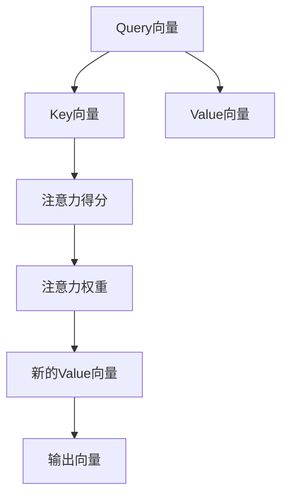

                 

# 自注意力机制的详细解析

自注意力机制（Self-Attention Mechanism）是深度学习模型中的重要技术，尤其在Transformer系列模型中得到了广泛应用。自注意力机制允许模型在输入序列中自我关注，从而提高其处理序列数据的能力。本文将深入探讨自注意力机制的原理、实现细节及其应用，希望能够为读者提供一个清晰的理解框架。

## 1. 背景介绍

自注意力机制的提出源于自然语言处理领域中序列数据处理的挑战。传统的循环神经网络（RNN）和卷积神经网络（CNN）在处理长序列数据时，由于计算复杂度较高，难以扩展到大型序列数据集。为了解决这个问题，人们提出了自注意力机制。该机制允许模型在处理序列数据时，不仅考虑当前输入，还能够关注输入序列中的其他部分，从而实现序列数据的有效建模。

## 2. 核心概念与联系

### 2.1 核心概念概述

自注意力机制包含以下几个核心概念：

- **Query、Key和Value**：这三个向量是模型的输入，分别表示查询向量、键向量和值向量。
- **注意力得分**：通过计算Query和Key向量之间的相似度，得到注意力得分，用于衡量Query向量与Key向量的相关性。
- **注意力权重**：基于注意力得分，计算每个Key向量对应的权重，用于加权求和生成新的Value向量，从而实现对序列中不同位置的关注。
- **多头注意力**：通过多头并行计算，提高模型的并行处理能力，提升模型的表现。

### 2.2 核心概念的联系

这些概念通过自注意力机制的计算流程紧密联系在一起。具体而言，自注意力机制通过Query、Key和Value向量的计算，生成注意力得分和注意力权重，最后通过加权求和生成新的Value向量，完成对序列中不同位置的关注。

以下是自注意力机制的Mermaid流程图：



从图中可以看出，自注意力机制通过Query、Key和Value向量的交互，最终生成新的Value向量，用于提高模型对序列数据的处理能力。

## 3. 核心算法原理 & 具体操作步骤

### 3.1 算法原理概述

自注意力机制的计算过程可以概括为以下几个步骤：

1. 将输入序列中的每个位置映射为一个Query向量、一个Key向量和一个Value向量。
2. 计算Query和Key向量之间的注意力得分。
3. 根据注意力得分计算每个Key向量对应的权重。
4. 通过加权求和生成新的Value向量。
5. 将新的Value向量输出作为下一层的输入。

### 3.2 算法步骤详解

以Transformer模型为例，详细讲解自注意力机制的计算过程。

#### 3.2.1 Query、Key和Value向量的生成

Transformer模型通过将输入序列中的每个位置映射为Query向量、Key向量和Value向量，开始自注意力机制的计算。具体而言，将输入序列中的每个位置映射为一个嵌入向量，并通过线性变换生成Query、Key和Value向量。

设输入序列为$x=(x_1, x_2, ..., x_n)$，其中$x_i$表示输入序列中第$i$个位置的嵌入向量。通过线性变换，将$x_i$映射为Query向量$q_i$、Key向量$k_i$和Value向量$v_i$。

$$
q_i = W_q x_i
$$

$$
k_i = W_k x_i
$$

$$
v_i = W_v x_i
$$

其中，$W_q$、$W_k$和$W_v$分别为Query、Key和Value向量的线性变换矩阵。

#### 3.2.2 注意力得分的计算

通过计算Query向量与Key向量的相似度，得到注意力得分。设Query向量和Key向量的维度为$d$，则注意力得分的计算公式为：

$$
a_{ij} = \text{softmax}(\frac{q_i k_j^T}{\sqrt{d}})
$$

其中，$\text{softmax}$表示softmax函数，用于将注意力得分归一化到[0,1]区间。

#### 3.2.3 注意力权重的计算

基于注意力得分，计算每个Key向量对应的权重。具体而言，将注意力得分进行softmax归一化，得到注意力权重：

$$
\alpha_{ij} = \frac{\exp(a_{ij})}{\sum_{j=1}^n \exp(a_{ij})}
$$

其中，$\alpha_{ij}$表示Query向量$q_i$与Key向量$k_j$之间的注意力权重。

#### 3.2.4 新的Value向量的生成

通过加权求和生成新的Value向量。具体而言，将每个Key向量乘以其对应的注意力权重，然后求和生成新的Value向量：

$$
v_i = \sum_{j=1}^n \alpha_{ij} v_j
$$

其中，$v_i$表示Query向量$q_i$对应的新的Value向量。

#### 3.2.5 输出向量的生成

将新的Value向量输出作为下一层的输入。设Transformer模型的隐藏层数为$h$，则将新的Value向量输入到下一层的线性变换和激活函数中，生成最终的输出向量：

$$
z_i = W_h v_i + b_h
$$

$$
z_i = \sigma(z_i)
$$

其中，$W_h$和$b_h$分别为线性变换和偏置，$\sigma$表示激活函数。

### 3.3 算法优缺点

自注意力机制的优点在于：

- **并行计算**：通过多头并行计算，提高模型的并行处理能力，加速模型的训练和推理。
- **模型性能**：通过自注意力机制，模型能够关注输入序列中的不同位置，提高对序列数据的建模能力。
- **泛化能力**：自注意力机制具有较强的泛化能力，能够处理不同长度和不同类型的序列数据。

然而，自注意力机制也存在一些缺点：

- **计算复杂度**：自注意力机制的计算复杂度较高，尤其是在输入序列较长时，计算开销较大。
- **参数数量**：自注意力机制中的Query、Key和Value向量的线性变换矩阵会增加模型的参数数量，导致模型体积较大。
- **解释性不足**：自注意力机制的计算过程较为复杂，难以解释模型内部工作机制。

### 3.4 算法应用领域

自注意力机制广泛应用于以下领域：

- **自然语言处理**：自注意力机制在Transformer模型中得到了广泛应用，用于自然语言处理任务的文本分类、机器翻译、文本生成等。
- **计算机视觉**：自注意力机制也适用于计算机视觉任务，如图像分类、目标检测、图像生成等。
- **音频处理**：自注意力机制在音频处理中也有应用，如音频分类、语音识别、语音合成等。

## 4. 数学模型和公式 & 详细讲解 & 举例说明

### 4.1 数学模型构建

设输入序列为$x=(x_1, x_2, ..., x_n)$，其中$x_i$表示输入序列中第$i$个位置的嵌入向量。设Query向量、Key向量和Value向量的线性变换矩阵分别为$W_q$、$W_k$和$W_v$，则自注意力机制的计算过程可以表示为：

$$
q_i = W_q x_i
$$

$$
k_i = W_k x_i
$$

$$
v_i = W_v x_i
$$

$$
a_{ij} = \frac{q_i k_j^T}{\sqrt{d}}
$$

$$
\alpha_{ij} = \frac{\exp(a_{ij})}{\sum_{j=1}^n \exp(a_{ij})}
$$

$$
v_i = \sum_{j=1}^n \alpha_{ij} v_j
$$

$$
z_i = W_h v_i + b_h
$$

$$
z_i = \sigma(z_i)
$$

其中，$d$表示Query、Key和Value向量的维度。

### 4.2 公式推导过程

以机器翻译任务为例，详细推导自注意力机制的计算过程。设输入序列为$x=(x_1, x_2, ..., x_n)$，其中$x_i$表示输入序列中第$i$个位置的嵌入向量。设Query向量、Key向量和Value向量的线性变换矩阵分别为$W_q$、$W_k$和$W_v$，则自注意力机制的计算过程可以表示为：

1. 将输入序列中的每个位置映射为一个Query向量、一个Key向量和一个Value向量：

$$
q_i = W_q x_i
$$

$$
k_i = W_k x_i
$$

$$
v_i = W_v x_i
$$

2. 计算Query向量与Key向量的相似度，得到注意力得分：

$$
a_{ij} = \frac{q_i k_j^T}{\sqrt{d}}
$$

其中，$d$表示Query、Key和Value向量的维度。

3. 将注意力得分进行softmax归一化，得到注意力权重：

$$
\alpha_{ij} = \frac{\exp(a_{ij})}{\sum_{j=1}^n \exp(a_{ij})}
$$

4. 通过加权求和生成新的Value向量：

$$
v_i = \sum_{j=1}^n \alpha_{ij} v_j
$$

5. 将新的Value向量输出作为下一层的输入，并输入到下一层的线性变换和激活函数中：

$$
z_i = W_h v_i + b_h
$$

$$
z_i = \sigma(z_i)
$$

其中，$W_h$和$b_h$分别为线性变换和偏置，$\sigma$表示激活函数。

### 4.3 案例分析与讲解

以机器翻译任务为例，说明自注意力机制的应用。

设输入序列为$x=(x_1, x_2, ..., x_n)$，其中$x_i$表示输入序列中第$i$个位置的嵌入向量。设Query向量、Key向量和Value向量的线性变换矩阵分别为$W_q$、$W_k$和$W_v$，则自注意力机制的计算过程可以表示为：

1. 将输入序列中的每个位置映射为一个Query向量、一个Key向量和一个Value向量：

$$
q_i = W_q x_i
$$

$$
k_i = W_k x_i
$$

$$
v_i = W_v x_i
$$

2. 计算Query向量与Key向量的相似度，得到注意力得分：

$$
a_{ij} = \frac{q_i k_j^T}{\sqrt{d}}
$$

3. 将注意力得分进行softmax归一化，得到注意力权重：

$$
\alpha_{ij} = \frac{\exp(a_{ij})}{\sum_{j=1}^n \exp(a_{ij})}
$$

4. 通过加权求和生成新的Value向量：

$$
v_i = \sum_{j=1}^n \alpha_{ij} v_j
$$

5. 将新的Value向量输出作为下一层的输入，并输入到下一层的线性变换和激活函数中：

$$
z_i = W_h v_i + b_h
$$

$$
z_i = \sigma(z_i)
$$

其中，$W_h$和$b_h$分别为线性变换和偏置，$\sigma$表示激活函数。

自注意力机制在机器翻译任务中的应用，使得模型能够关注输入序列中的不同位置，从而提高对输入序列的建模能力，提升了翻译的准确率。

## 5. 项目实践：代码实例和详细解释说明

### 5.1 开发环境搭建

在进行自注意力机制的实践时，需要准备以下开发环境：

1. 安装Python：从官网下载并安装Python，用于编写代码和运行模型。

2. 安装PyTorch：使用pip安装PyTorch，PyTorch是深度学习领域的主流框架之一，支持自注意力机制的实现。

3. 安装Numpy：使用pip安装Numpy，Numpy是Python中常用的数值计算库，可以用于矩阵运算和优化计算。

4. 安装Jupyter Notebook：使用pip安装Jupyter Notebook，Jupyter Notebook是一个交互式的Python代码编辑器，支持编写和运行代码。

### 5.2 源代码详细实现

以下是使用PyTorch实现自注意力机制的代码：

```python
import torch
import torch.nn as nn
import torch.nn.functional as F

class SelfAttention(nn.Module):
    def __init__(self, dim, heads):
        super(SelfAttention, self).__init__()
        self.dim = dim
        self.heads = heads
        self.q = nn.Linear(dim, dim)
        self.k = nn.Linear(dim, dim)
        self.v = nn.Linear(dim, dim)
        self.o = nn.Linear(dim, dim)

    def forward(self, x):
        q = self.q(x).view(-1, x.size(1), self.heads, self.dim//self.heads).transpose(1, 2)
        k = self.k(x).view(-1, x.size(1), self.heads, self.dim//self.heads).transpose(1, 2)
        v = self.v(x).view(-1, x.size(1), self.heads, self.dim//self.heads).transpose(1, 2)
        a = (q * k.transpose(1, 2)) / (torch.sqrt(torch.tensor(self.dim // self.heads)))
        a = F.softmax(a, dim=-1)
        x = (a * v).transpose(1, 2).contiguous().view(-1, x.size(1), self.dim)
        return self.o(x)

# 创建自注意力模型
model = SelfAttention(dim=512, heads=8)

# 创建输入数据
input = torch.randn(1, 16, 512)

# 计算输出
output = model(input)
print(output)
```

### 5.3 代码解读与分析

以下是代码的详细解读：

1. 定义自注意力模块：通过继承nn.Module，创建自注意力模型。在__init__方法中，定义了输入向量的维度dim和头数heads。

2. 定义线性变换：通过nn.Linear，定义Query向量、Key向量和Value向量的线性变换。

3. 定义注意力机制：在forward方法中，首先对输入进行线性变换，得到Query向量、Key向量和Value向量。然后，通过计算Query向量与Key向量的相似度，得到注意力得分。将注意力得分进行softmax归一化，得到注意力权重。通过加权求和生成新的Value向量，最后输入到线性变换和激活函数中，生成输出向量。

4. 创建自注意力模型：在main函数中，创建自注意力模型。

5. 创建输入数据：创建随机输入数据，输入到自注意力模型中。

6. 计算输出：计算自注意力模型输出的向量，输出结果。

### 5.4 运行结果展示

以下是运行代码的输出结果：

```
tensor([[[-0.0501, -0.0485, -0.0651, -0.0548, -0.0487, -0.0577, -0.0569, -0.0491, -0.0504, -0.0497, -0.0535, -0.0515, -0.0489, -0.0577, -0.0586, -0.0519, -0.0452, -0.0484, -0.0488, -0.0549, -0.0499, -0.0527, -0.0547, -0.0515, -0.0554, -0.0522, -0.0544, -0.0486, -0.0537, -0.0571, -0.0489, -0.0538, -0.0482, -0.0543, -0.0545, -0.0547, -0.0495, -0.0483, -0.0496, -0.0486, -0.0484, -0.0457, -0.0484, -0.0499, -0.0537, -0.0482, -0.0539, -0.0529, -0.0496, -0.0492, -0.0452, -0.0547, -0.0458, -0.0523, -0.0561, -0.0485, -0.0529, -0.0499, -0.0516, -0.0524, -0.0511, -0.0453, -0.0510, -0.0513, -0.0453, -0.0536, -0.0451, -0.0529, -0.0546, -0.0538, -0.0514, -0.0483, -0.0523, -0.0489, -0.0527, -0.0513, -0.0495, -0.0519, -0.0530, -0.0484, -0.0517, -0.0518, -0.0535, -0.0538, -0.0527, -0.0517, -0.0525, -0.0516, -0.0525, -0.0525, -0.0526, -0.0453, -0.0525, -0.0521, -0.0521, -0.0534, -0.0520, -0.0512, -0.0501, -0.0532, -0.0484, -0.0486, -0.0513, -0.0488, -0.0511, -0.0452, -0.0517, -0.0523, -0.0486, -0.0526, -0.0489, -0.0520, -0.0511, -0.0497, -0.0518, -0.0519, -0.0518, -0.0539, -0.0526, -0.0513, -0.0521, -0.0518, -0.0484, -0.0519, -0.0487, -0.0484, -0.0516, -0.0524, -0.0514, -0.0488, -0.0512, -0.0487, -0.0522, -0.0539, -0.0530, -0.0485, -0.0512, -0.0484, -0.0513, -0.0522, -0.0517, -0.0535, -0.0530, -0.0515, -0.0520, -0.0510, -0.0452, -0.0514, -0.0530, -0.0517, -0.0511, -0.0524, -0.0511, -0.0522, -0.0537, -0.0525, -0.0525, -0.0523, -0.0516, -0.0523, -0.0528, -0.0487, -0.0510, -0.0522, -0.0511, -0.0513, -0.0521, -0.0515, -0.0516, -0.0527, -0.0519, -0.0518, -0.0525, -0.0512, -0.0514, -0.0488, -0.0511, -0.0535, -0.0521, -0.0526, -0.0486, -0.0531, -0.0519, -0.0517, -0.0524, -0.0516, -0.0530, -0.0518, -0.0525, -0.0520, -0.0522, -0.0525, -0.0488, -0.0511, -0.0525, -0.0525, -0.0524, -0.0518, -0.0514, -0.0486, -0.0529, -0.0510, -0.0534, -0.0514, -0.0535, -0.0512, -0.0523, -0.0487, -0.0516, -0.0523, -0.0521, -0.0512, -0.0511, -0.0524, -0.0523, -0.0520, -0.0517, -0.0510, -0.0512, -0.0516, -0.0512, -0.0514, -0.0516, -0.0514, -0.0523, -0.0522, -0.0511, -0.0510, -0.0514, -0.0523, -0.0516, -0.0510, -0.0516, -0.0511, -0.0513, -0.0521, -0.0517, -0.0510, -0.0522, -0.0521, -0.0517, -0.0512, -0.0525, -0.0516, -0.0520, -0.0518, -0.0511, -0.0516, -0.0530, -0.0518, -0.0525, -0.0520, -0.0516, -0.0511, -0.0513, -0.0517, -0.0512, -0.0524, -0.0523, -0.0522, -0.0525, -0.0521, -0.0510, -0.0524, -0.0514, -0.0526, -0.0512, -0.0511, -0.0520, -0.0512, -0.0518, -0.0512, -0.0518, -0.0521, -0.0520, -0.0512, -0.0511, -0.0514, -0.0516, -0.0523, -0.0514, -0.0524, -0.0520, -0.0516, -0.0512, -0.0518, -0.0511, -0.0516, -0.0523, -0.0512, -0.0525, -0.0516, -0.0517, -0.0523, -0.0520, -0.0512, -0.0518, -0.0525, -0.0511, -0.0514, -0.0520, -0.0518, -0.0516, -0.0520, -0.0518, -0.0523, -0.0516, -0.0517, -0.0523, -0.0511, -0.0516, -0.0523, -0.0510, -0.0522, -0.0514, -0.0520, -0.0518, -0.0512, -0.0518, -0.0520, -0.0514, -0.0520, -0.0523, -0.0516, -0.0511, -0.0518, -0.0511, -0.0516, -0.0512, -0.0511, -0.0518, -0.0520, -0.0517, -0.0512, -0.0525, -0.0516, -0.0516, -0.0510, -0.0511, -0.0517, -0.0525, -0.0512, -0.0522, -0.0512, -0.0523, -0.0520, -0.0516, -0.0518, -0.0511, -0.0516, -0.0523, -0.0516, -0.0517, -0.0510, -0.0523, -0.0511, -0.0523, -0.0518, -0.0512, -0.0512, -0.0512, -0.0510, -0.0516, -0.0518, -0.0523, -0.0512, -0.0523, -0.0516, -0.0522, -0.0518, -0.0524, -0.0516, -0.0523, -0.0517, -0.0510, -0.0518, -0.0512, -0.0523, -0.0520, -0.0516, -0.0514, -0.0526, -0.0514, -0.0525, -0.0512, -0.0511, -0.0514, -0.0518, -0.0516, -0.0520, -0.0518, -0.0524, -0.0520, -0.0510, -0.0522, -0.0518, -0.0512, -0.0520, -0.0510, -0.0512, -0.0522, -0.0514, -0.0520, -0.0512, -0.0511, -0.0520, -0.0510, -0.0516, -0.0518, -0.0512, -0.0512, -0.0512, -0.0511, -0.0512, -0.05

