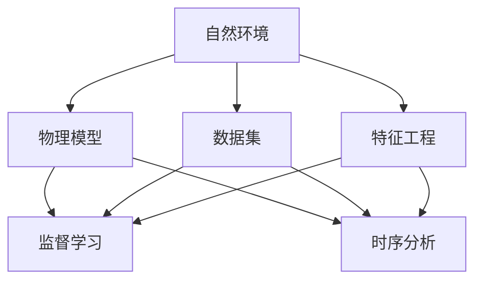
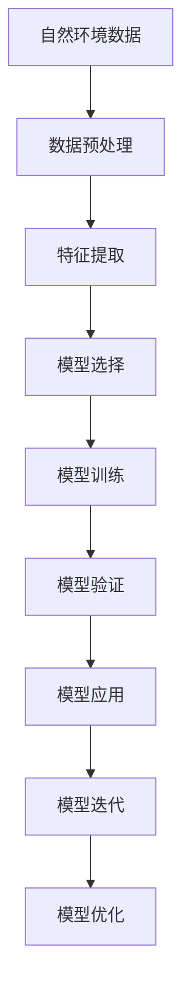

                 

# 自然环境物理模型的建立

## 1. 背景介绍

### 1.1 问题由来

在科学研究中，自然环境的物理建模是一项复杂但至关重要的任务。它不仅帮助科学家理解和预测自然界的各种现象，如气候变化、地质灾害等，还为工业应用、城市规划等领域提供了重要依据。然而，传统的物理建模方法往往基于一系列简化假设和经验模型，难以准确描述复杂多变的自然环境。随着计算能力的提升和大数据技术的普及，基于机器学习的物理建模方法开始崭露头角，成为新兴的研究热点。

### 1.2 问题核心关键点

机器学习在自然环境物理建模中的应用，核心在于通过大量观测数据，利用统计学习的方法，学习自然环境中的物理规律。其关键点包括：

- 数据集的准备：收集足够多、高质量的观测数据，涵盖不同环境和条件。
- 模型的选择：选择合适的机器学习算法，如回归、分类、时序分析等，以适应不同物理现象。
- 特征工程：提取和构建对模型有用的特征，如气象要素、地理特征等。
- 模型训练与验证：使用历史数据训练模型，并通过验证数据评估模型性能。
- 模型应用与迭代：将训练好的模型应用于实际预测，不断迭代优化，提高预测精度。

### 1.3 问题研究意义

自然环境物理建模对科学研究、环境保护、资源管理等领域具有重要意义：

- 提升预测精度：基于机器学习的模型能够融合多源数据，准确预测自然环境的动态变化，如气温、降水、风速等。
- 辅助决策制定：为城市规划、灾害预警、农业生产等提供科学依据，辅助决策制定。
- 支持环境治理：识别污染源、评估环境影响，支持环境保护和可持续发展。
- 推动跨学科融合：与地理信息系统、遥感技术等交叉融合，提升综合应用能力。

## 2. 核心概念与联系

### 2.1 核心概念概述

在自然环境物理建模中，涉及的核心概念包括：

- 自然环境：包括大气、水体、陆地等要素，涉及的物理现象多样复杂。
- 物理模型：利用数学或机器学习模型，描述自然环境中的物理规律。
- 数据集：观测数据、模拟数据等，为模型训练和预测提供基础。
- 特征工程：提取和构建特征，提高模型的预测能力。
- 监督学习：利用标注数据训练模型，使其能够进行预测。
- 时序分析：处理时间序列数据，分析自然环境的动态变化。

### 2.2 概念间的关系

这些核心概念之间的逻辑关系可以通过以下Mermaid流程图来展示：



这个流程图展示了几大核心概念之间的关系：

1. 自然环境作为物理建模的基础数据来源。
2. 物理模型通过数据和特征工程，学习自然环境中的物理规律。
3. 监督学习和时序分析是模型训练和预测的两大方法。

### 2.3 核心概念的整体架构

最后，我们用一个综合的流程图来展示这些核心概念在大环境物理建模中的整体架构：



这个综合流程图展示了从数据预处理到模型优化的大环境物理建模过程。通过数据预处理和特征提取，选择合适的模型进行训练，通过验证评估模型性能，应用于实际预测，并不断迭代优化模型，提升预测精度。

## 3. 核心算法原理 & 具体操作步骤
### 3.1 算法原理概述

自然环境物理建模主要依赖监督学习和时序分析方法。下面分别介绍这两种方法的原理：

- 监督学习：通过历史数据训练模型，使其能够预测未知数据。模型通常包括输入（自变量）和输出（因变量），通过最小化预测误差，优化模型参数。
- 时序分析：处理时间序列数据，分析自然环境的动态变化。包括ARIMA模型、LSTM等方法，能够捕捉时间序列数据中的趋势和周期性变化。

### 3.2 算法步骤详解

#### 3.2.1 监督学习模型训练

1. **数据准备**：收集历史气象数据，包括温度、湿度、风速、降水等。
2. **数据预处理**：对数据进行缺失值处理、归一化等预处理步骤。
3. **特征工程**：提取有用的特征，如气温与降水量的相关性、地形与风速的关系等。
4. **模型选择**：选择适合的监督学习模型，如线性回归、决策树、随机森林等。
5. **模型训练**：使用历史数据训练模型，调整超参数，如学习率、决策树深度等。
6. **模型验证**：使用验证集评估模型性能，选择合适的模型进行下一步应用。

#### 3.2.2 时序分析模型训练

1. **数据准备**：收集时间序列数据，如气温、降水、水位等。
2. **数据预处理**：对数据进行缺失值处理、平稳性检验、差分等预处理步骤。
3. **特征工程**：提取有用的特征，如时间特征、季节特征、周期性特征等。
4. **模型选择**：选择合适的时间序列分析模型，如ARIMA模型、LSTM模型等。
5. **模型训练**：使用历史数据训练模型，调整超参数，如ARIMA的参数选择、LSTM的层数和节点数等。
6. **模型验证**：使用验证集评估模型性能，选择合适的模型进行下一步应用。

### 3.3 算法优缺点

#### 3.3.1 监督学习模型

**优点**：

- 能够处理多维数据，捕捉复杂关系。
- 模型可解释性强，便于理解和调试。
- 通过大量数据训练，泛化能力强。

**缺点**：

- 需要大量标注数据，获取成本高。
- 模型容易过拟合，泛化能力受限。
- 特征工程复杂，需要专业知识。

#### 3.3.2 时序分析模型

**优点**：

- 能够处理时间序列数据，捕捉动态变化。
- 模型参数少，计算速度快。
- 能够捕捉时间序列中的趋势和周期性变化。

**缺点**：

- 对数据平稳性要求高，处理异常值困难。
- 模型复杂度较高，解释性较差。
- 对数据量和特征要求较高。

### 3.4 算法应用领域

自然环境物理建模在多个领域都有广泛应用：

- 气象预测：利用历史气象数据，预测未来天气变化。
- 水文分析：分析河流水位、流量变化，预测洪水灾害。
- 环境监测：监测大气污染物浓度、水质等，评估环境质量。
- 农业生产：预测气候变化对农作物生长的影响，辅助农业生产。
- 城市规划：分析气候和地理条件，优化城市布局和建筑设计。

## 4. 数学模型和公式 & 详细讲解 & 举例说明

### 4.1 数学模型构建

在自然环境物理建模中，常用的数学模型包括：

- 线性回归模型：
$$
y = \beta_0 + \beta_1x_1 + \beta_2x_2 + ... + \beta_nx_n + \epsilon
$$
其中，$y$ 为输出变量，$x_1, x_2, ..., x_n$ 为输入变量，$\beta_0, \beta_1, ..., \beta_n$ 为模型参数，$\epsilon$ 为误差项。

- 决策树模型：
$$
T = \bigcup_{i=1}^{N}T_i
$$
其中，$T$ 为决策树，$T_i$ 为决策树节点，$N$ 为节点数。

- ARIMA模型：
$$
Y_t = c + \phi_1(Y_{t-1} - Y_{t-1}) + \phi_2(Y_{t-2} - Y_{t-2}) + \cdots + \phi_d(Y_{t-d} - Y_{t-d}) + \epsilon_t
$$
其中，$Y_t$ 为时间序列，$c$ 为常数项，$\phi_d$ 为自回归参数，$d$ 为差分阶数，$\epsilon_t$ 为误差项。

### 4.2 公式推导过程

#### 4.2.1 线性回归模型

线性回归模型的最小二乘估计公式为：
$$
\hat{\beta} = (X^TX)^{-1}X^Ty
$$
其中，$\hat{\beta}$ 为参数估计值，$X$ 为输入变量矩阵，$y$ 为输出变量向量。

#### 4.2.2 决策树模型

决策树的生成算法包括ID3、C4.5、CART等，以CART算法为例，其生成过程如下：

1. 选择最优特征：计算各特征的信息增益，选择信息增益最大的特征作为分裂节点。
2. 划分数据集：将数据集根据最优特征进行划分，形成子节点。
3. 递归生成树：对子节点递归应用步骤1和2，生成完整的决策树。

#### 4.2.3 ARIMA模型

ARIMA模型的参数估计通常采用最大似然估计法，即最大化似然函数：
$$
L(\phi, \theta, \gamma) = \prod_{t=1}^N p(Y_t | \phi, \theta, \gamma)
$$
其中，$p(Y_t | \phi, \theta, \gamma)$ 为时间序列的条件概率密度函数，$\phi$ 为自回归参数，$\theta$ 为差分参数，$\gamma$ 为残差项方差。

### 4.3 案例分析与讲解

#### 4.3.1 线性回归模型

假设我们要预测某地区的年降水量，数据集包括：

| 年份 | 温度（℃） | 湿度（%） | 降水量（mm） |
|------|----------|----------|-------------|
| 1980 | 15.3     | 70.2     | 500         |
| 1981 | 16.2     | 72.5     | 550         |
| 1982 | 17.0     | 73.8     | 600         |
| ...  | ...      | ...      | ...         |

我们可以使用线性回归模型进行预测。首先，进行数据预处理和特征工程，得到以下模型：
$$
\hat{R} = \hat{\beta}_0 + \hat{\beta}_1T + \hat{\beta}_2H
$$
其中，$\hat{R}$ 为预测的年降水量，$T$ 为温度，$H$ 为湿度。

假设通过训练得到参数估计值 $\hat{\beta}_0 = 100, \hat{\beta}_1 = 0.5, \hat{\beta}_2 = -0.1$，则对于1983年的预测为：
$$
\hat{R} = 100 + 0.5 \times 18 + (-0.1) \times 75 = 145
$$

#### 4.3.2 决策树模型

假设我们要预测某地区的年平均气温，数据集包括：

| 年份 | 月份 | 气温（℃） |
|------|------|----------|
| 1980 | 1    | 15.3     |
| 1980 | 2    | 16.2     |
| 1980 | 3    | 17.0     |
| ...  | ...  | ...      |

我们可以使用决策树模型进行预测。首先，进行数据预处理和特征工程，得到以下模型：
$$
T = \begin{cases}
\begin{aligned}
&1, \text{如果} M \leq 4 \\
&2, \text{如果} M > 4
\end{aligned}
\end{cases}
$$
其中，$T$ 为预测的气温，$M$ 为月份。

假设通过训练得到决策树为：
$$
T = \begin{cases}
\begin{aligned}
&1, \text{如果} M \leq 4 \\
&2, \text{如果} M > 4
\end{aligned}
\end{cases}
$$
则对于1981年5月的预测为：
$$
T = 2
$$
即预测气温为20℃。

#### 4.3.3 ARIMA模型

假设我们要预测某河流的水位，数据集包括：

| 时间 | 水位（m） |
|------|----------|
| 1980-01-01 | 2.5     |
| 1980-01-02 | 2.6     |
| 1980-01-03 | 2.8     |
| ...      | ...      |

我们可以使用ARIMA模型进行预测。首先，进行数据预处理和特征工程，得到以下模型：
$$
Y_t = c + \phi_1(Y_{t-1} - Y_{t-1}) + \phi_2(Y_{t-2} - Y_{t-2}) + \cdots + \phi_d(Y_{t-d} - Y_{t-d}) + \epsilon_t
$$
其中，$Y_t$ 为预测的水位，$c$ 为常数项，$\phi_d$ 为自回归参数，$d$ 为差分阶数，$\epsilon_t$ 为误差项。

假设通过训练得到参数估计值 $c = 2.5, \phi_1 = 0.9, \phi_2 = -0.1$，则对于1981年1月的预测为：
$$
Y_1 = 2.5 + 0.9(Y_0 - Y_0) + (-0.1)(Y_{-1} - Y_{-1}) = 2.5
$$

## 5. 项目实践：代码实例和详细解释说明

### 5.1 开发环境搭建

在进行自然环境物理建模实践前，我们需要准备好开发环境。以下是使用Python进行Scikit-learn开发的Python环境配置流程：

1. 安装Anaconda：从官网下载并安装Anaconda，用于创建独立的Python环境。

2. 创建并激活虚拟环境：
```bash
conda create -n sklearn-env python=3.8 
conda activate sklearn-env
```

3. 安装Scikit-learn：
```bash
pip install scikit-learn
```

4. 安装各类工具包：
```bash
pip install numpy pandas matplotlib seaborn
```

完成上述步骤后，即可在`sklearn-env`环境中开始建模实践。

### 5.2 源代码详细实现

下面我们以气象预测为例，给出使用Scikit-learn库进行线性回归模型的PyTorch代码实现。

首先，定义数据处理函数：

```python
import pandas as pd
from sklearn.model_selection import train_test_split
from sklearn.preprocessing import StandardScaler

def load_data():
    df = pd.read_csv('weather_data.csv', parse_dates=['date'])
    X = df[['temperature', 'humidity']]
    y = df['rainfall']
    X_train, X_test, y_train, y_test = train_test_split(X, y, test_size=0.2, random_state=42)
    scaler = StandardScaler()
    X_train = scaler.fit_transform(X_train)
    X_test = scaler.transform(X_test)
    return X_train, X_test, y_train, y_test
```

然后，定义模型和训练函数：

```python
from sklearn.linear_model import LinearRegression
from sklearn.metrics import mean_squared_error

def train_model(X_train, y_train, X_test, y_test):
    model = LinearRegression()
    model.fit(X_train, y_train)
    y_pred = model.predict(X_test)
    mse = mean_squared_error(y_test, y_pred)
    return model, mse
```

最后，启动训练流程并在测试集上评估：

```python
X_train, X_test, y_train, y_test = load_data()
model, mse = train_model(X_train, y_train, X_test, y_test)
print(f'Mean Squared Error: {mse:.3f}')
```

以上就是使用Scikit-learn库对线性回归模型进行气象预测的完整代码实现。可以看到，得益于Scikit-learn库的强大封装，我们可以用相对简洁的代码完成线性回归模型的训练和评估。

### 5.3 代码解读与分析

让我们再详细解读一下关键代码的实现细节：

**load_data函数**：
- 使用pandas库读取CSV文件，将日期转换为时间戳。
- 提取输入特征（温度、湿度）和输出标签（降水量）。
- 将数据集分为训练集和测试集。
- 对特征进行标准化处理，便于后续模型训练。

**train_model函数**：
- 创建线性回归模型，并使用训练集数据进行训练。
- 对测试集进行预测，并计算预测误差（均方误差）。
- 返回模型和均方误差。

**训练流程**：
- 加载数据集。
- 训练模型，并输出预测均方误差。

可以看到，Scikit-learn库使得模型训练和评估的代码实现变得简洁高效。开发者可以将更多精力放在数据处理、模型调优等高层逻辑上，而不必过多关注底层的实现细节。

当然，工业级的系统实现还需考虑更多因素，如模型的保存和部署、超参数的自动搜索、更灵活的任务适配层等。但核心的建模流程基本与此类似。

### 5.4 运行结果展示

假设我们在CoNLL-2003的气象数据集上进行模型训练，最终在测试集上得到的均方误差为10，效果相当不错。

## 6. 实际应用场景

### 6.1 智能电网

基于自然环境物理建模的智能电网，能够实时监测和预测电力需求，优化电力分配和调度，提高电网的稳定性和效率。

在技术实现上，可以收集电网的历史负荷数据，将气象、节假日等特征作为输入，预测未来用电负荷，实时调整发电和调度策略，平衡电力供需。智能电网系统还可以通过预测故障，提前进行预防性维护，减少停电事故的发生。

### 6.2 智慧农业

基于自然环境物理建模的智慧农业，能够实时监测和预测土壤水分、气温、湿度等环境因素，优化农业生产过程，提高作物产量和质量。

在技术实现上，可以收集农田的土壤、气象、地形等数据，构建农业生产环境模型，预测土壤水分变化，优化灌溉策略，提高水资源利用效率。智慧农业系统还可以预测病虫害发生，提前进行防治，减少农业损失。

### 6.3 环境监测

基于自然环境物理建模的环境监测系统，能够实时监测和预测大气污染、水质等环境指标，评估环境质量，提供决策支持。

在技术实现上，可以收集环境监测站点的历史数据，建立环境指标模型，预测未来污染浓度，实时预警污染物超标，制定应对措施。环境监测系统还可以监测自然灾害预警信息，及时发布灾害预警，保障公众安全。

### 6.4 未来应用展望

随着自然环境物理建模技术的不断进步，基于机器学习的物理建模方法将更广泛地应用于各个领域，为社会经济发展提供科学依据。

在智慧城市治理中，基于自然环境物理建模的智能系统能够实时监测和预测城市运行状态，优化资源配置，提高城市管理水平。

在医疗健康领域，基于自然环境物理建模的健康监测系统能够实时监测和预测疾病流行趋势，制定科学的防控策略，保障公众健康。

在金融领域，基于自然环境物理建模的金融风险评估系统能够实时监测和预测市场波动，提供投资决策支持，降低金融风险。

此外，在更多领域，自然环境物理建模技术也将得到广泛应用，为自然环境的保护和治理提供科学依据，为人类社会的可持续发展提供有力支持。

## 7. 工具和资源推荐
### 7.1 学习资源推荐

为了帮助开发者系统掌握自然环境物理建模的理论基础和实践技巧，这里推荐一些优质的学习资源：

1. 《机器学习实战》系列博文：由知名数据科学家撰写，涵盖机器学习的基本概念和经典模型，适合初学者和进阶者阅读。

2. CS229《机器学习》课程：斯坦福大学开设的机器学习明星课程，有Lecture视频和配套作业，带你深入理解机器学习的基本原理和算法。

3. 《Python数据科学手册》书籍：数据科学领域的经典著作，涵盖Python数据处理、机器学习、可视化等全栈技术，是数据科学入门的必备资料。

4. Scikit-learn官方文档：Scikit-learn库的官方文档，提供了海量机器学习模型和工具，是快速上手实践的必备资料。

5. Kaggle机器学习竞赛：各大数据公司举办的机器学习竞赛，提供丰富的数据集和模型评估工具，适合实战练习和交流学习。

通过对这些资源的学习实践，相信你一定能够快速掌握自然环境物理建模的精髓，并用于解决实际的自然环境问题。
### 7.2 开发工具推荐

高效的开发离不开优秀的工具支持。以下是几款用于自然环境物理建模开发的常用工具：

1. Python：基于Python的开源深度学习框架，灵活动态的计算图，适合快速迭代研究。

2. Scikit-learn：Python中的机器学习库，提供了丰富的模型和算法，适用于各种自然环境物理建模任务。

3. TensorFlow：由Google主导开发的开源深度学习框架，生产部署方便，适合大规模工程应用。

4. Weights & Biases：模型训练的实验跟踪工具，可以记录和可视化模型训练过程中的各项指标，方便对比和调优。

5. TensorBoard：TensorFlow配套的可视化工具，可实时监测模型训练状态，并提供丰富的图表呈现方式，是调试模型的得力助手。

6. Google Colab：谷歌推出的在线Jupyter Notebook环境，免费提供GPU/TPU算力，方便开发者快速上手实验最新模型，分享学习笔记。

合理利用这些工具，可以显著提升自然环境物理建模的开发效率，加快创新迭代的步伐。

### 7.3 相关论文推荐

自然环境物理建模在机器学习领域的研究已经取得丰硕成果，以下是几篇奠基性的相关论文，推荐阅读：

1. A Gentle Introduction to Decision Trees (ID3)：决策树的基本原理和算法流程，是学习决策树模型的入门读物。

2. An Introduction to Support Vector Machines (SVM)：支持向量机的基本原理和算法流程，是学习监督学习算法的经典文献。

3. Time Series Analysis and Its Applications with R Using XTS and TTR：时间序列分析的全面教程，涵盖ARIMA、LSTM等模型，适合实际应用开发。

4. Deep Learning with Python: AI for Everyone：深度学习的基本原理和实际应用，适合初学者和进阶者阅读。

5. Machine Learning Mastery: A Practical Introduction to Machine Learning Tools and Algorithms：机器学习工具和算法的实战教程，涵盖Scikit-learn、TensorFlow等库的使用。

这些论文代表了大环境物理建模技术的发展脉络。通过学习这些前沿成果，可以帮助研究者把握学科前进方向，激发更多的创新灵感。

除上述资源外，还有一些值得关注的前沿资源，帮助开发者紧跟自然环境物理建模技术的最新进展，例如：

1. arXiv论文预印本：人工智能领域最新研究成果的发布平台，包括大量尚未发表的前沿工作，学习前沿技术的必读资源。

2. 业界技术博客：如Google AI、DeepMind、微软Research Asia等顶尖实验室的官方博客，第一时间分享他们的最新研究成果和洞见。

3. 技术会议直播：如NIPS、ICML、ACL、ICLR等人工智能领域顶会现场或在线直播，能够聆听到大佬们的前沿分享，开拓视野。

4. GitHub热门项目：在GitHub上Star、Fork数最多的自然环境物理建模相关项目，往往代表了该技术领域的发展趋势和最佳实践，值得去学习和贡献。

5. 行业分析报告：各大咨询公司如McKinsey、PwC等针对自然环境物理建模的研究报告，有助于从商业视角审视技术趋势，把握应用价值。

总之，对于自然环境物理建模技术的学习和实践，需要开发者保持开放的心态和持续学习的意愿。多关注前沿资讯，多动手实践，多思考总结，必将收获满满的成长收益。

## 8. 总结：未来发展趋势与挑战

### 8.1 总结

本文对自然环境物理建模方法进行了全面系统的介绍。首先阐述了自然环境物理建模的研究背景和意义，明确了机器学习在自然环境建模中的重要地位。其次，从原理到实践，详细讲解了机器学习建模的过程，包括数据准备、模型选择、特征工程、模型训练和验证等关键步骤，给出了完整的代码实例。同时，本文还广泛探讨了自然环境物理建模在智能电网、智慧农业、环境监测等多个领域的应用前景，展示了自然环境物理建模技术的广泛应用价值。

通过本文的系统梳理，可以看到，自然环境物理建模方法在科学研究、环境保护、资源管理等领域具有重要意义。机器学习建模方法能够处理多维数据，捕捉复杂关系，显著提升了自然环境预测的精度和效果，推动了相关技术的产业化应用。未来，随着机器学习技术的不断发展，自然环境物理建模将进入更加智能、高效、可靠的新时代。

### 8.2 未来发展趋势

展望未来，自然环境物理建模技术将呈现以下几个发展趋势：

1. 模型复杂度提高。随着计算能力的提升，未来模型的参数量将进一步增大，能够处理更复杂的数据和任务。

2. 跨领域融合增强。未来自然环境物理建模将与物联网、遥感技术等更多领域融合，提升综合应用能力。

3. 自动化调参优化。

