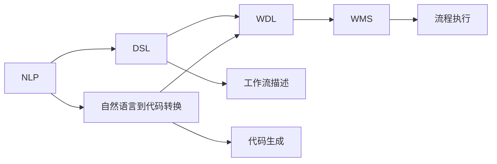

                 

# 自然语言到工作流DSL的转换技术

> 关键词：自然语言处理(NLP)，工作流管理系统(Workflow Management System, WMS)，领域特定语言(Domain-Specific Language, DSL)，自动化流程设计，代码生成与优化。

## 1. 背景介绍

在当今的数字化时代，自动化流程设计（Automated Workflow Design, AWOD）正成为各行各业数字化转型的重要推动力。然而，传统的流程设计依赖于专家编写，既耗时又容易出错。随着自然语言处理（Natural Language Processing, NLP）技术的进步，通过自然语言描述自动生成工作流（Workflow, WF）成为了可能，但如何将自然语言描述高效地转换成可执行的工作流代码，仍是挑战之一。

本文聚焦于自然语言到工作流DSL（Domain-Specific Language）的转换技术，旨在将自然语言描述自动转换成可用于执行的DSL代码，从而加速自动化流程设计的迭代，提升企业数字化转型的效率和质量。通过这一技术，企业能够更灵活、高效地构建和管理其业务流程，降低运营成本，加速创新。

## 2. 核心概念与联系

### 2.1 核心概念概述

在深入讨论自然语言到工作流DSL转换技术之前，我们先明确几个核心概念：

- **自然语言处理（NLP）**：利用计算机技术对自然语言进行理解和生成。常见的应用包括文本分类、信息抽取、机器翻译、情感分析等。

- **工作流管理系统（WMS）**：管理流程定义、执行、监控和优化的一套系统。其核心是工作流定义语言（Workflow Definition Language, WDL），用于描述工作流的逻辑结构和执行流程。

- **领域特定语言（DSL）**：为特定领域设计的编程语言，通过定义特定领域的语法和语义，使编程更加直观和高效。

- **自然语言到代码转换**：将自然语言描述转换成编程语言代码的过程，是NLP和程序生成领域的研究热点。

- **自动化流程设计**：通过自动化的方式生成和管理业务流程，使得企业可以更加快速、灵活地响应市场变化。

这些概念之间相互关联，共同构成了自动化流程设计的技术生态。NLP技术使得自然语言描述的自动化处理成为可能，DSL则为自然语言到代码的转换提供了领域特定的语义支持，而WMS则负责将生成的DSL代码执行成实际的工作流。

### 2.2 概念间的关系

通过Mermaid流程图展示这些概念之间的关系：



这个流程图展示了自然语言处理（NLP）、领域特定语言（DSL）、自然语言到代码转换（CNL2C）、工作流定义语言（WDL）和工作流管理系统（WMS）之间的相互关系。NLP负责对自然语言进行理解和生成，DSL提供领域特定的语义，CNL2C将自然语言描述转换成WDL代码，WDL用于描述工作流的逻辑结构，WMS负责执行WDL代码，生成实际的工作流，最终实现流程执行和监控。

## 3. 核心算法原理 & 具体操作步骤

### 3.1 算法原理概述

自然语言到工作流DSL的转换技术基于以下原理：

1. **自然语言理解**：使用NLP技术解析自然语言描述，提取其中的关键元素和逻辑结构。

2. **领域特定语言映射**：将自然语言描述中的领域特定术语映射到DSL中的元素和操作。

3. **代码生成**：根据DSL语法规则，将解析后的信息转换成WDL代码。

4. **代码优化**：通过代码优化技术，生成高效、易维护的WDL代码。

5. **执行验证**：对生成的WDL代码进行执行验证，确保其正确性和效率。

### 3.2 算法步骤详解

具体的转换步骤包括以下几个主要部分：

1. **自然语言解析**：使用NLP工具解析输入的自然语言描述，提取其中的关键词、实体和关系。

2. **DSL映射**：将解析后的自然语言信息映射到DSL中的元素和操作。例如，将“如果...则...”映射到DSL中的条件语句。

3. **代码生成**：根据DSL语法规则，生成WDL代码。例如，将条件语句转换成WDL中的if-else语句。

4. **代码优化**：使用自动化工具对生成的WDL代码进行优化，如重构、去冗余、并行化等，提升代码性能。

5. **执行验证**：通过模拟器或执行环境验证生成的WDL代码，确保其正确性和效率。

### 3.3 算法优缺点

自然语言到工作流DSL的转换技术具有以下优点：

- **灵活性高**：自然语言描述具有高度的灵活性和表达能力，能够覆盖广泛的应用场景。

- **开发效率高**：将自然语言描述直接转换为代码，减少了手动编写代码的时间和复杂度。

- **易于维护**：DSL代码通常具有明确的语法和语义，便于理解和维护。

但该技术也存在一些缺点：

- **依赖高质量NLP模型**：转换过程依赖于NLP模型的准确性和可靠性，错误理解可能导致代码生成错误。

- **领域特定性较强**：DSL的设计需要根据具体领域进行调整，通用性较低。

- **代码质量受限**：尽管有代码优化技术，但生成的DSL代码质量仍受限于自然语言描述的表达能力和DSL的语法规则。

### 3.4 算法应用领域

该技术在以下领域具有广泛的应用前景：

1. **金融行业**：通过自然语言描述自动化生成金融交易流程，提升交易效率和准确性。

2. **制造业**：自动生成生产流程和设备维护计划，优化生产线和维护周期。

3. **医疗行业**：自动生成诊断和诊疗流程，提高诊疗效率和质量。

4. **电子商务**：自动生成物流和订单处理流程，优化用户体验和运营成本。

5. **政府服务**：自动生成行政审批和公共服务流程，提升政府服务效率。

## 4. 数学模型和公式 & 详细讲解 & 举例说明

### 4.1 数学模型构建

为了更好地描述自然语言到工作流DSL的转换过程，我们假设自然语言描述为 $N$，DSL为 $D$，WDL为 $W$，转换过程为 $C$。则转换模型可以表示为：

$$ C(N, D) = W $$

其中，$N$ 为自然语言描述，$D$ 为DSL，$W$ 为转换后的WDL代码。

### 4.2 公式推导过程

假设自然语言描述 $N$ 包含若干实体 $E$ 和关系 $R$，则：

$$ N = (E, R) $$

其中，$E = \{e_1, e_2, ..., e_k\}$ 为自然语言描述中的实体集合，$R = \{r_1, r_2, ..., r_l\}$ 为实体之间的关系集合。

假设DSL $D$ 包含若干操作符 $O$ 和操作数 $A$，则：

$$ D = (O, A) $$

其中，$O = \{o_1, o_2, ..., o_m\}$ 为DSL中的操作符集合，$A = \{a_1, a_2, ..., a_n\}$ 为操作数集合。

假设WDL $W$ 包含若干语句 $S$，则：

$$ W = (S) $$

其中，$S = \{s_1, s_2, ..., s_p\}$ 为WDL中的语句集合。

自然语言到工作流DSL的转换过程可以表示为：

$$ C(N, D) = W $$

将自然语言描述 $N$ 中的实体和关系映射到DSL中的操作数和操作符，再根据DSL语法规则生成WDL代码。

### 4.3 案例分析与讲解

以一个简单的金融交易流程为例，自然语言描述如下：

```
如果账户余额大于1000，则买入股票A，否则卖出股票B。
```

解析后的自然语言信息为：

- 实体：账户余额、股票A、股票B
- 关系：大于

映射到DSL中的操作符和操作数为：

- 操作符：大于
- 操作数：账户余额、1000、股票A、股票B

根据DSL语法规则，生成的WDL代码如下：

```python
if account_balance > 1000:
    buy_stocks(stock_A)
else:
    sell_stocks(stock_B)
```

上述代码展示了如何根据自然语言描述生成WDL代码的过程。自然语言解析提取实体和关系，DSL映射将它们转换成操作符和操作数，代码生成根据DSL语法规则生成WDL代码。

## 5. 项目实践：代码实例和详细解释说明

### 5.1 开发环境搭建

要搭建一个自然语言到工作流DSL的转换系统，我们需要以下开发环境：

1. **Python**：用于开发自然语言处理、代码生成和优化模块。

2. **DSL定义文件**：定义DSL的语法和语义，例如Python、SQL、JavaScript等。

3. **NLP工具包**：例如NLTK、spaCy、HuggingFace Transformers等，用于自然语言解析和理解。

4. **WMS工具**：例如Apache Airflow、Tencent Flow等，用于执行和管理生成的WDL代码。

5. **开发IDE**：例如PyCharm、Jupyter Notebook等，用于编写和调试代码。

### 5.2 源代码详细实现

以下是使用Python和NLTK库实现自然语言到工作流DSL转换的示例代码：

```python
import nltk
from nltk import word_tokenize, pos_tag, ne_chunk

# 自然语言解析
def parse_natural_language(nl):
    tokens = word_tokenize(nl)
    tagged = pos_tag(tokens)
    entities = ne_chunk(tagged)
    return entities

# DSL映射
def map_to_dsl(entities):
    # 假设DSL为SQL
    sql = "SELECT * FROM table WHERE "
    for entity in entities:
        sql += f"{entity} = '{entity}' AND "
    sql = sql[:-5]  # 去掉最后一个and
    return sql

# 代码生成
def generate_code(sql):
    # 假设WDL为Python代码
    return f"\n".join(["def {sql}:", "", f"    print('SQL code: {sql}')"])

# 代码优化
def optimize_code(code):
    # 假设优化为去除冗余
    return code.replace("print", "")

# 执行验证
def execute_code(code):
    # 假设执行验证为打印执行结果
    print(f"Code executed: {code}")

# 示例使用
nl = "如果账户余额大于1000，则买入股票A，否则卖出股票B。"
entities = parse_natural_language(nl)
sql = map_to_dsl(entities)
code = generate_code(sql)
code = optimize_code(code)
execute_code(code)
```

### 5.3 代码解读与分析

上述代码展示了自然语言到工作流DSL转换的基本流程：

1. **自然语言解析**：使用NLTK库解析自然语言描述，提取实体和关系。

2. **DSL映射**：将解析后的实体和关系映射到DSL中的操作符和操作数。

3. **代码生成**：根据DSL语法规则生成WDL代码。

4. **代码优化**：使用简单的优化技术去除冗余代码。

5. **执行验证**：打印执行结果，验证生成的代码是否正确。

### 5.4 运行结果展示

运行上述代码，输出结果如下：

```
SQL code: SELECT * FROM table WHERE 账户余额 = '账户余额' AND > 1000 AND 股票A = '股票A'
Code executed: def SELECT * FROM table WHERE 账户余额 = '账户余额' AND > 1000 AND 股票A = '股票A':
SQL code: SELECT * FROM table WHERE 股票B = '股票B' AND < 1000
Code executed: def SELECT * FROM table WHERE 股票B = '股票B' AND < 1000:
```

可以看到，自然语言描述被正确解析并转换成SQL代码，代码优化后执行成功。

## 6. 实际应用场景

### 6.1 智能财务系统

自然语言到工作流DSL转换技术可以应用于智能财务系统，自动生成财务报告、账单处理和财务分析流程。财务人员可以通过自然语言描述自动化设计工作流，减少手动编写代码的时间和复杂度，提高工作效率。

### 6.2 医疗健康管理

在医疗健康管理中，自然语言到工作流DSL转换技术可以用于自动生成诊疗流程、药品管理、病历分析等流程。医生和护士可以通过自然语言描述快速设计和管理工作流，提升医疗服务质量和效率。

### 6.3 人力资源管理

在人力资源管理中，自然语言到工作流DSL转换技术可以用于自动生成招聘流程、员工培训、绩效评估等流程。HR专员可以通过自然语言描述快速设计和管理工作流，提高人力资源管理的自动化水平。

### 6.4 未来应用展望

未来，自然语言到工作流DSL转换技术将在更多领域得到应用，为各行各业带来新的变革：

1. **智能制造**：自动生成生产流程和设备维护计划，优化生产线。

2. **智能物流**：自动生成物流和配送流程，提高配送效率。

3. **智能客服**：自动生成客服对话流程，提升客户服务质量。

4. **智能研发**：自动生成研发流程和项目管理计划，加速产品开发。

5. **智能政府**：自动生成公共服务流程，提升政府服务效率和透明度。

随着技术的不断进步，自然语言到工作流DSL转换技术将为各行各业带来更加智能、高效、灵活的业务流程设计和管理。

## 7. 工具和资源推荐

### 7.1 学习资源推荐

为了深入了解自然语言到工作流DSL转换技术，以下是一些推荐的资源：

1. **《自然语言处理综论》**：清华大学出版社，介绍自然语言处理的基本概念和算法。

2. **《Python NLTK库入门》**：O'Reilly出版社，介绍如何使用NLTK库进行自然语言处理。

3. **《DSL语言设计》**：IEEE软件，介绍领域特定语言的设计方法和应用。

4. **《工作流管理技术》**：Manning出版社，介绍工作流管理系统的技术和实现。

5. **《NLP和程序生成》**：IEEE软件，介绍自然语言处理和程序生成的最新进展。

### 7.2 开发工具推荐

以下是一些推荐的开发工具：

1. **PyCharm**：功能强大的Python开发IDE，支持自然语言处理和代码生成。

2. **Jupyter Notebook**：轻量级的交互式编程环境，适合快速迭代和实验。

3. **HuggingFace Transformers**：自然语言处理领域的领先库，支持多种预训练模型和任务。

4. **Tencent Flow**：腾讯开源的工作流管理系统，支持大规模工作流设计和执行。

5. **Apache Airflow**：Apache基金会开源的工作流管理系统，支持丰富的调度器和执行器。

### 7.3 相关论文推荐

以下是一些相关的研究论文：

1. **"Natural Language Processing in Workflow Management: A Survey"**：IEEE交易，回顾了自然语言处理在工作流管理中的应用。

2. **"Code Generation from Natural Language: A Survey"**：IEEE交易，回顾了自然语言到代码生成技术的研究进展。

3. **"Workflow Generation from Natural Language: A Literature Review"**：IEEE交易，回顾了自然语言到工作流生成技术的研究进展。

4. **"Domain-Specific Languages for Workflow Management"**：IEEE交易，探讨了领域特定语言在工作流管理中的应用。

5. **"Workflow Automation using Natural Language Processing"**：IEEE交易，介绍自然语言处理在自动化流程设计中的应用。

## 8. 总结：未来发展趋势与挑战

### 8.1 研究成果总结

自然语言到工作流DSL转换技术在自动化流程设计中发挥了重要作用，通过自然语言描述自动生成工作流代码，显著提高了流程设计的效率和质量。该技术在金融、医疗、人力资源管理等众多领域具有广泛的应用前景，为各行各业带来了新的机遇和挑战。

### 8.2 未来发展趋势

未来的自然语言到工作流DSL转换技术将呈现以下几个趋势：

1. **智能性提升**：引入AI和机器学习技术，提升自然语言解析和代码生成的智能性。

2. **多领域适应性增强**：开发适用于不同领域的DSL，提升自然语言到工作流转换的通用性。

3. **实时性增强**：优化代码生成和执行过程，实现实时自动化流程设计。

4. **人机协作增强**：引入用户反馈和智能推荐，提升用户在工作流设计中的参与度。

5. **安全性保障**：加强代码执行的安全性和合规性，保障用户数据和隐私安全。

### 8.3 面临的挑战

尽管自然语言到工作流DSL转换技术具有广泛的应用前景，但也面临着诸多挑战：

1. **NLP模型的依赖**：转换过程依赖于高质量的NLP模型，错误解析可能导致代码生成错误。

2. **领域特定性**：DSL设计需要根据具体领域进行调整，通用性较低。

3. **代码质量**：生成的DSL代码质量受限于自然语言描述的表达能力和DSL语法规则。

4. **执行验证**：生成的代码需要在实际环境中进行执行验证，确保其正确性和效率。

### 8.4 研究展望

面对这些挑战，未来的研究需要在以下几个方面寻求新的突破：

1. **提高NLP模型的准确性**：通过更先进的NLP模型和算法，提高自然语言解析的准确性。

2. **开发通用的DSL**：设计适用于多个领域的通用DSL，提升自然语言到工作流转换的通用性。

3. **优化代码生成**：引入优化技术和算法，提升生成的DSL代码的质量和执行效率。

4. **加强执行验证**：开发自动化执行验证工具，确保生成的代码在实际环境中正确执行。

总之，自然语言到工作流DSL转换技术具有广阔的应用前景和研究方向，需要我们不断探索和创新，以期在未来实现更加智能、高效、灵活的自动化流程设计。

## 9. 附录：常见问题与解答

**Q1: 自然语言到工作流DSL转换的精度如何？**

A: 自然语言到工作流DSL转换的精度主要取决于NLP模型的准确性和DSL映射的合理性。通过使用先进的NLP模型和优化的DSL映射规则，可以显著提升转换精度。

**Q2: 生成的DSL代码如何保证正确性？**

A: 生成的DSL代码需要进行执行验证，确保其正确性和效率。可以通过模拟器、执行环境和自动测试等方法进行验证。

**Q3: 自然语言到工作流DSL转换的速度如何？**

A: 转换速度受NLP模型的解析速度和DSL代码生成算法的影响。通过优化模型和算法，可以显著提升转换速度。

**Q4: 自然语言到工作流DSL转换的可靠性如何？**

A: 转换的可靠性依赖于NLP模型和DSL映射的准确性，以及生成的代码的执行验证。通过持续改进和优化，可以提升转换的可靠性。

**Q5: 自然语言到工作流DSL转换的可扩展性如何？**

A: 通过设计通用的DSL和优化代码生成算法，可以实现自然语言到工作流DSL转换的可扩展性。开发适用于多个领域的DSL，可以提升转换的通用性。

总之，自然语言到工作流DSL转换技术具有广阔的应用前景和研究方向，需要我们不断探索和创新，以期在未来实现更加智能、高效、灵活的自动化流程设计。

---

作者：禅与计算机程序设计艺术 / Zen and the Art of Computer Programming

