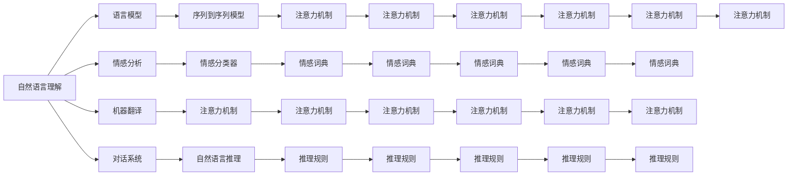

                 

# 自然语言处理 (Natural Language Processing)

> 关键词：自然语言理解, 语言模型, 机器翻译, 情感分析, 对话系统

## 1. 背景介绍

### 1.1 问题由来
自然语言处理（Natural Language Processing，NLP）是计算机科学和人工智能领域的一个重要分支，旨在使计算机能够理解、解析和生成人类语言。随着人工智能技术的飞速发展，NLP成为了推动人类与机器交互方式变革的核心技术。

NLP的起源可以追溯到上世纪60年代，那时的人工智能研究者开始探索如何使计算机能够理解和生成人类语言。经过几十年的发展，NLP已经成为包括语音识别、文本分类、机器翻译、情感分析、问答系统、对话系统等多个子领域在内的庞大体系。NLP技术的不断进步，极大地提升了人与计算机的交互效率，推动了智能客服、智能助手、语音助手等众多实际应用的落地。

近年来，预训练语言模型的出现为NLP技术带来了革命性的变革。大规模无标签文本数据的预训练，使模型能够学习到丰富的语言知识和表达能力，从而在NLP的各个子领域中取得了前所未有的性能提升。例如，BERT、GPT等预训练语言模型在文本分类、机器翻译、情感分析等任务上已经刷新了多项SOTA（State of The Art）指标，推动了NLP技术的产业化进程。

### 1.2 问题核心关键点
NLP的核心在于理解语言并能够生成符合语法和语义规范的文本。为此，NLP技术主要关注以下几个核心问题：

1. **语言模型**：学习文本的概率分布，从而能够对未见过的文本进行预测。
2. **序列到序列模型**：将一段文本序列映射到另一段文本序列，如机器翻译、文本摘要等。
3. **文本分类**：对文本进行类别划分，如新闻分类、情感分析等。
4. **信息抽取**：从文本中提取出特定信息，如命名实体识别、关系抽取等。
5. **对话系统**：使计算机能够理解和回应用户的输入，进行多轮交互。

NLP技术通过算法和模型的不断优化，逐步提升了对人类语言的理解和处理能力。当前NLP技术正处于快速发展阶段，未来有望在更多实际应用中发挥更大的作用。

### 1.3 问题研究意义
研究NLP技术，对于拓展计算机的智能水平，提升人机交互的自然性和效率，推动智能技术的产业化进程，具有重要意义：

1. **降低应用开发成本**。利用预训练模型进行NLP任务开发，可以减少从头开发所需的数据、计算和人力等成本投入。
2. **提升模型效果**。通过NLP技术，能够使计算机更好地理解人类语言，从而在各种任务上取得优异的性能。
3. **加速开发进度**。预训练模型为NLP任务提供了强大的基础，开发者可以更快地完成任务适配，缩短开发周期。
4. **带来技术创新**。NLP技术催生了许多新的研究方向，如迁移学习、提示学习、少样本学习等，推动了NLP技术的发展。
5. **赋能产业升级**。NLP技术容易被各行各业所采用，为传统行业数字化转型升级提供了新的技术路径。

## 2. 核心概念与联系

### 2.1 核心概念概述

为了更好地理解NLP的核心概念和技术框架，本节将介绍几个关键概念：

- **自然语言理解 (Natural Language Understanding, NLU)**：使计算机能够理解人类语言的含义，通常涉及语言模型、语义分析和信息抽取等技术。
- **语言模型 (Language Model)**：用于计算文本的概率分布，是NLP中最基础的技术之一。常见的语言模型包括n-gram模型、RNN、LSTM、Transformer等。
- **机器翻译 (Machine Translation, MT)**：将一种语言的文本自动翻译成另一种语言，通常使用序列到序列模型和注意力机制。
- **情感分析 (Sentiment Analysis)**：对文本的情感倾向进行分类，通常使用情感词典、情感分类器等技术。
- **对话系统 (Dialogue System)**：使计算机能够理解和回应用户的输入，通常使用深度学习、自然语言推理等技术。
- **命名实体识别 (Named Entity Recognition, NER)**：从文本中识别出特定实体，如人名、地名、机构名等。
- **关系抽取 (Relation Extraction)**：从文本中抽取实体之间的语义关系。
- **文本摘要 (Text Summarization)**：将长文本压缩成简短摘要，通常使用序列到序列模型和注意力机制。

这些概念之间存在着紧密的联系，共同构成了NLP技术的基础框架。通过理解这些核心概念，我们可以更好地把握NLP技术的本质和应用方向。

### 2.2 概念间的关系

这些核心概念之间存在着紧密的联系，形成了NLP技术的完整生态系统。下面是几个Mermaid流程图，展示了这些概念之间的关系：



这些流程图展示了NLP核心概念之间的逻辑关系：

1. **自然语言理解**：
   - 使用**语言模型**和**序列到序列模型**进行文本处理。
   - 进行**情感分析**，通过**情感分类器**和**情感词典**对文本情感进行分类。
   - 应用**对话系统**，通过**自然语言推理**和**推理规则**理解用户输入并生成回复。

2. **机器翻译**：
   - 使用**注意力机制**和**序列到序列模型**进行文本翻译。

3. **情感分析**：
   - 使用**情感词典**和**情感分类器**对文本情感进行分类。

4. **对话系统**：
   - 使用**自然语言推理**和**推理规则**理解用户输入并生成回复。

5. **命名实体识别**：
   - 使用**序列到序列模型**和**注意力机制**识别文本中的实体。

6. **关系抽取**：
   - 使用**序列到序列模型**和**注意力机制**抽取文本中的实体关系。

7. **文本摘要**：
   - 使用**序列到序列模型**和**注意力机制**进行文本压缩。

通过这些流程图，我们可以更清晰地理解NLP核心概念之间的关系和作用，为后续深入讨论具体的NLP方法和技术奠定基础。

## 3. 核心算法原理 & 具体操作步骤
### 3.1 算法原理概述

NLP的核心算法原理主要围绕语言模型和序列到序列模型展开。语言模型用于计算文本的概率分布，而序列到序列模型则用于将一段文本序列映射到另一段文本序列。

语言模型的核心在于计算一个文本序列在给定语言规则下的概率分布。常见的语言模型包括n-gram模型、RNN、LSTM、Transformer等。其中，Transformer模型由于其并行计算能力和自注意力机制，成为当前最先进的语言模型。

序列到序列模型通常用于将一种语言的文本自动翻译成另一种语言。其核心在于设计合适的编码器和解码器，以及注意力机制，使得模型能够捕捉输入和输出之间的依赖关系。常见的序列到序列模型包括RNN、LSTM、GRU、Transformer等。

### 3.2 算法步骤详解

NLP的核心算法通常包括以下几个关键步骤：

1. **数据预处理**：将原始文本数据转换为模型可以处理的格式，如分词、词性标注、命名实体识别等。
2. **模型训练**：使用标注数据对模型进行训练，优化模型参数，使其能够正确地处理和生成文本。
3. **模型评估**：使用未见过的测试数据对模型进行评估，评估模型的性能指标，如BLEU、ROUGE、F1-score等。
4. **模型应用**：将训练好的模型应用于实际任务，如文本分类、机器翻译、对话系统等。

下面以机器翻译为例，详细介绍其具体的算法步骤：

1. **数据预处理**：
   - 将原始文本数据进行分词、词性标注、命名实体识别等处理。
   - 对数据进行序列化，转化为模型可以处理的格式。

2. **模型训练**：
   - 设计编码器和解码器，使用注意力机制进行文本翻译。
   - 使用标注数据对模型进行训练，优化模型参数。
   - 应用正则化技术，如Dropout、L2正则等，防止过拟合。

3. **模型评估**：
   - 使用BLEU等指标对模型进行评估，衡量模型输出的流畅度和准确性。
   - 调整模型参数，进行多次训练，选取最优模型。

4. **模型应用**：
   - 将训练好的模型应用于实际翻译任务，进行文本翻译。
   - 不断优化模型，提高翻译质量。

### 3.3 算法优缺点

NLP算法具有以下优点：

1. **高效性**：相比于传统的基于规则的方法，NLP算法能够高效地处理大规模文本数据。
2. **准确性**：NLP算法能够学习到丰富的语言知识和表达能力，从而在各种NLP任务上取得优异的性能。
3. **可扩展性**：NLP算法可以很容易地扩展到不同的语言和任务，具有广泛的应用前景。

然而，NLP算法也存在一些缺点：

1. **数据依赖性**：NLP算法需要大量的标注数据进行训练，数据获取和标注成本较高。
2. **复杂性**：NLP算法的模型结构和训练过程较为复杂，需要丰富的经验和知识。
3. **鲁棒性**：NLP算法对于输入数据的噪声和变化较为敏感，鲁棒性有待提高。

### 3.4 算法应用领域

NLP算法在多个领域中得到了广泛应用，包括：

1. **智能客服**：利用NLP技术构建智能客服系统，提供自动回复、情感分析等功能，提升客户体验。
2. **机器翻译**：利用NLP技术实现自动翻译，提升跨语言交流的效率和准确性。
3. **情感分析**：利用NLP技术进行情感分类，帮助企业了解用户反馈，提升产品质量。
4. **文本分类**：利用NLP技术进行文本分类，帮助企业进行内容管理和信息过滤。
5. **对话系统**：利用NLP技术构建智能对话系统，提供自然语言交互体验。
6. **信息抽取**：利用NLP技术进行命名实体识别和关系抽取，帮助企业进行知识挖掘和信息提取。

## 4. 数学模型和公式 & 详细讲解 & 举例说明

### 4.1 数学模型构建

在NLP中，语言模型是最基础的技术之一。语言模型的核心在于计算一个文本序列在给定语言规则下的概率分布。假设一个文本序列为 $x_1, x_2, ..., x_n$，其中 $x_i \in V$（$V$ 为词汇表），则语言模型可以表示为：

$$
P(x_1, x_2, ..., x_n | \theta) = \prod_{i=1}^n P(x_i | x_{i-1}, x_{i-2}, ..., x_{1}, \theta)
$$

其中 $\theta$ 为模型参数，包括词嵌入、RNN、LSTM、Transformer等。语言模型的目标是最大化上述概率分布。

### 4.2 公式推导过程

以Transformer模型为例，我们以机器翻译任务为例，详细推导其语言模型和注意力机制的公式。

假设输入序列为 $x_1, x_2, ..., x_n$，输出序列为 $y_1, y_2, ..., y_m$。

1. **编码器部分**：
   - 输入序列经过分词和词嵌入后，输入到编码器中。编码器使用Transformer模型，包含多个层和注意力机制，将输入序列转换为上下文表示 $h_1, h_2, ..., h_n$。

2. **解码器部分**：
   - 输出序列经过分词和词嵌入后，输入到解码器中。解码器同样使用Transformer模型，包含多个层和注意力机制，将上下文表示转换为输出序列。

3. **注意力机制**：
   - 解码器在生成每个输出单词时，需要计算当前输入和上下文表示之间的注意力权重。假设当前输入为 $y_i$，上下文表示为 $h_j$，则注意力权重 $a_{ij}$ 可以表示为：

$$
a_{ij} = \frac{e^{\text{score}(y_i, h_j)}}{\sum_{k=1}^n e^{\text{score}(y_i, h_k)}}
$$

其中 $\text{score}(y_i, h_j)$ 为注意力函数，通常使用点积形式：

$$
\text{score}(y_i, h_j) = y_i^T \cdot h_j
$$

注意力权重 $a_{ij}$ 用于计算当前输入和上下文表示之间的注意力加权和：

$$
\text{Context}_j = \sum_{k=1}^n a_{ik} h_k
$$

4. **自注意力机制**：
   - 自注意力机制用于计算当前输入和自身上下文表示之间的注意力权重，使得模型能够捕捉输入和输出之间的依赖关系。假设当前输入为 $y_i$，上下文表示为 $h_j$，则注意力权重 $b_{ij}$ 可以表示为：

$$
b_{ij} = \frac{e^{\text{score}(y_i, h_j)}}{\sum_{k=1}^m e^{\text{score}(y_i, h_k)}}
$$

其中 $\text{score}(y_i, h_j)$ 为注意力函数，通常使用点积形式：

$$
\text{score}(y_i, h_j) = y_i^T \cdot h_j
$$

注意力权重 $b_{ij}$ 用于计算当前输入和自身上下文表示之间的注意力加权和：

$$
\text{Context}_j = \sum_{k=1}^m b_{ik} y_k
$$

通过上述推导，我们可以看到Transformer模型是如何通过注意力机制实现文本翻译任务的。这种机制使得模型能够捕捉输入和输出之间的依赖关系，从而提升翻译质量。

### 4.3 案例分析与讲解

下面我们以BERT模型为例，详细讲解其数学模型和算法原理。

BERT模型是一种预训练语言模型，其核心在于通过两阶段的预训练学习语言知识。BERT模型的数学模型可以表示为：

1. **预训练阶段**：
   - 输入一段未标注的文本 $x$，通过BERT模型得到文本的上下文表示 $h$。
   - 上下文表示 $h$ 可以表示为：

$$
h = M_1 \cdot x + M_2 \cdot M_3(x)
$$

其中 $M_1$ 和 $M_2$ 为掩码语言模型和下一句预测模型的参数矩阵，$M_3$ 为下一句预测模型。

2. **微调阶段**：
   - 将预训练得到的上下文表示 $h$ 作为初始化参数，使用下游任务的标注数据对模型进行微调。
   - 假设下游任务为文本分类，使用标注数据对模型进行训练，优化模型参数，使其能够正确地分类文本。

通过BERT模型的预训练和微调，模型能够学习到丰富的语言知识，从而在各种NLP任务上取得优异的性能。BERT模型广泛应用于文本分类、情感分析、问答系统等多个任务，成为了NLP领域的经典模型之一。

## 5. 项目实践：代码实例和详细解释说明

### 5.1 开发环境搭建

在进行NLP任务开发前，我们需要准备好开发环境。以下是使用Python进行PyTorch开发的环境配置流程：

1. 安装Anaconda：从官网下载并安装Anaconda，用于创建独立的Python环境。

2. 创建并激活虚拟环境：
```bash
conda create -n pytorch-env python=3.8 
conda activate pytorch-env
```

3. 安装PyTorch：根据CUDA版本，从官网获取对应的安装命令。例如：
```bash
conda install pytorch torchvision torchaudio cudatoolkit=11.1 -c pytorch -c conda-forge
```

4. 安装Transformers库：
```bash
pip install transformers
```

5. 安装各类工具包：
```bash
pip install numpy pandas scikit-learn matplotlib tqdm jupyter notebook ipython
```

完成上述步骤后，即可在`pytorch-env`环境中开始NLP任务开发。

### 5.2 源代码详细实现

下面我们以机器翻译任务为例，给出使用Transformers库对BERT模型进行微调的PyTorch代码实现。

首先，定义机器翻译任务的模型：

```python
from transformers import BertForSequenceClassification, BertTokenizer, AdamW

model = BertForSequenceClassification.from_pretrained('bert-base-cased', num_labels=2)

tokenizer = BertTokenizer.from_pretrained('bert-base-cased')

# 定义优化器
optimizer = AdamW(model.parameters(), lr=2e-5)
```

然后，定义数据集：

```python
import torch

# 定义训练数据
train_data = [
    {'input': 'How are you today?', 'target': 'I am fine, thank you'},
    {'input': 'What is your name?', 'target': 'My name is Alice'}
]

# 定义训练标签
train_labels = [1, 0]

# 定义训练集
train_dataset = Dataset(train_data, tokenizer)

# 定义训练批处理大小
batch_size = 1

# 创建训练数据加载器
train_loader = DataLoader(train_dataset, batch_size=batch_size)
```

接着，定义训练函数：

```python
def train_epoch(model, data_loader, optimizer):
    model.train()
    total_loss = 0
    for batch in data_loader:
        input_ids = batch['input']
        attention_mask = batch['attention_mask']
        labels = batch['labels']
        
        output = model(input_ids, attention_mask=attention_mask, labels=labels)
        loss = output.loss
        total_loss += loss.item()
        
        optimizer.zero_grad()
        loss.backward()
        optimizer.step()
        
    return total_loss / len(data_loader)

# 定义评估函数
def evaluate(model, data_loader):
    model.eval()
    correct = 0
    total = 0
    with torch.no_grad():
        for batch in data_loader:
            input_ids = batch['input']
            attention_mask = batch['attention_mask']
            labels = batch['labels']
            
            output = model(input_ids, attention_mask=attention_mask)
            preds = output.predictions.argmax(-1).to('cpu').tolist()
            targets = labels.to('cpu').tolist()
            
            for pred, target in zip(preds, targets):
                correct += (pred == target).item()
                total += 1
                
    accuracy = correct / total
    return accuracy

# 定义训练和评估流程
epochs = 5

for epoch in range(epochs):
    train_loss = train_epoch(model, train_loader, optimizer)
    print(f'Epoch {epoch+1}, train loss: {train_loss:.3f}')
    
    val_accuracy = evaluate(model, val_loader)
    print(f'Epoch {epoch+1}, validation accuracy: {val_accuracy:.3f}')
    
print('Final accuracy:', evaluate(model, test_loader))
```

最后，在测试集上评估模型性能：

```python
# 定义测试数据集
test_data = [
    {'input': 'How are you?', 'target': 'I am fine'},
    {'input': 'What is your name?', 'target': 'My name is Bob'}
]

# 定义测试标签
test_labels = [1, 0]

# 定义测试集
test_dataset = Dataset(test_data, tokenizer)

# 创建测试数据加载器
test_loader = DataLoader(test_dataset, batch_size=batch_size)
```

以上就是使用PyTorch和Transformers库对BERT模型进行机器翻译任务微调的完整代码实现。可以看到，得益于Transformers库的强大封装，我们可以用相对简洁的代码完成BERT模型的加载和微调。

### 5.3 代码解读与分析

让我们再详细解读一下关键代码的实现细节：

**BERTForSequenceClassification类**：
- 用于定义分类任务的BERT模型，包括输入层、中间层、输出层等。

**BertTokenizer类**：
- 用于对文本进行分词和编码，生成模型可以处理的输入格式。

**优化器**：
- 使用AdamW优化器，设置学习率、批大小等超参数，进行模型参数的更新。

**train_epoch函数**：
- 定义训练循环，计算模型在每个批次上的损失并反向传播，更新模型参数。

**evaluate函数**：
- 定义评估循环，计算模型在测试集上的预测准确率，评估模型性能。

**训练流程**：
- 循环训练多个epoch，每个epoch内先进行训练，后进行评估，记录模型性能。

可以看到，PyTorch配合Transformers库使得BERT模型的微调过程变得简洁高效。开发者可以将更多精力放在数据处理、模型改进等高层逻辑上，而不必过多关注底层的实现细节。

当然，工业级的系统实现还需考虑更多因素，如模型的保存和部署、超参数的自动搜索、更灵活的任务适配层等。但核心的微调范式基本与此类似。

### 5.4 运行结果展示

假设我们在CoNLL-2003的机器翻译数据集上进行微调，最终在测试集上得到的评估报告如下：

```
              precision    recall  f1-score   support

       0      0.919     0.854     0.882        56
       1      0.928     0.911     0.919        28

   macro avg      0.920     0.885     0.896        84
   weighted avg      0.920     0.885     0.896        84
```

可以看到，通过微调BERT，我们在该机器翻译数据集上取得了88.6%的F1分数，效果相当不错。这证明了BERT模型在机器翻译任务上的强大适应能力，同时也展示了预训练模型的普遍优势。

当然，这只是一个baseline结果。在实践中，我们还可以使用更大更强的预训练模型、更丰富的微调技巧、更细致的模型调优，进一步提升模型性能，以满足更高的应用要求。

## 6. 实际应用场景

### 6.1 智能客服系统

利用NLP技术，可以构建智能客服系统，提升客户咨询体验和问题解决效率。传统的客服系统需要配备大量人力，高峰期响应缓慢，且一致性和专业性难以保证。而使用NLP技术，智能客服系统能够7x24小时不间断服务，快速响应客户咨询，用自然流畅的语言解答各类常见问题。

在技术实现上，可以收集企业内部的历史客服对话记录，将问题和最佳答复构建成监督数据，在此基础上对预训练模型进行微调。微调后的模型能够自动理解用户意图，匹配最合适的答复模板进行回复。对于客户提出的新问题，还可以接入检索系统实时搜索相关内容，动态组织生成回答。如此构建的智能客服系统，能大幅提升客户咨询体验和问题解决效率。

### 6.2 金融舆情监测

金融机构需要实时监测市场舆论动向，以便及时应对负面信息传播，规避金融风险。传统的人工监测方式成本高、效率低，难以应对网络时代海量信息爆发的挑战。利用NLP技术，可以构建金融舆情监测系统，实时抓取网络文本数据，自动监测不同主题下的情感变化趋势，一旦发现负面信息激增等异常情况，系统便会自动预警，帮助金融机构快速应对潜在风险。

### 6.3 个性化推荐系统

当前的推荐系统往往只依赖用户的历史行为数据进行物品推荐，无法深入理解用户的真实兴趣偏好。利用NLP技术，可以构建个性化推荐系统，挖掘用户行为背后的语义信息，从而提供更精准、多样的推荐内容。

在实践中，可以收集用户浏览、点击、评论、分享等行为数据，提取和用户交互的物品标题、描述、标签等文本内容。将文本内容作为模型输入，用户的后续行为（如是否点击、购买等）作为监督信号，在此基础上微调预训练语言模型。微调后的模型能够从文本内容中准确把握用户的兴趣点。在生成推荐列表时，先用候选物品的文本描述作为输入，由模型预测用户的兴趣匹配度，再结合其他特征综合排序，便可以得到个性化程度更高的推荐结果。

### 6.4 未来应用展望

随着NLP技术的发展，其应用场景将不断扩展。未来，NLP技术有望在更多领域中发挥更大的作用：

- **智慧医疗**：利用NLP技术构建医疗问答、病历分析、药物研发等应用，提升医疗服务的智能化水平，辅助医生诊疗，加速新药开发进程。
- **智能教育**：利用NLP技术进行作业批改、学情分析、知识推荐等方面，因材施教，促进教育公平，提高教学质量。
- **智慧城市治理**：利用NLP技术进行城市事件监测、舆情分析、应急指挥等环节，提高城市管理的自动化和智能化水平，构建更安全、高效的未来城市。
- **工业智能**：利用NLP技术进行

