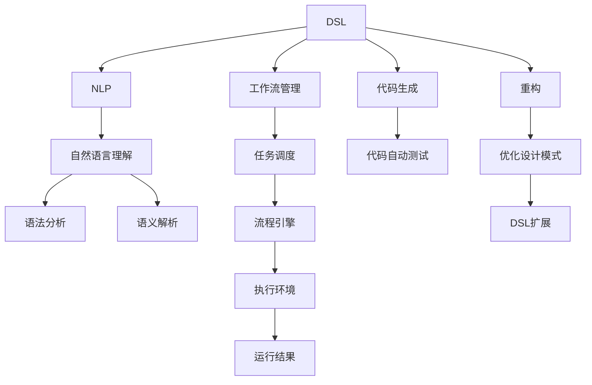
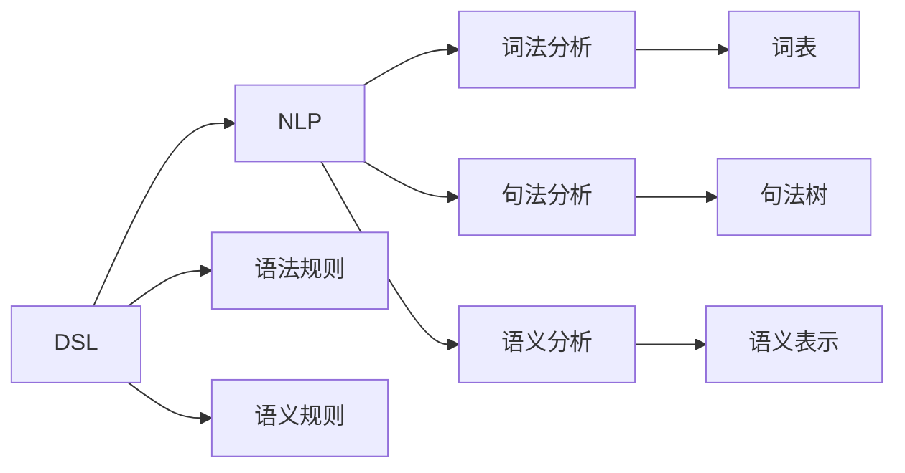
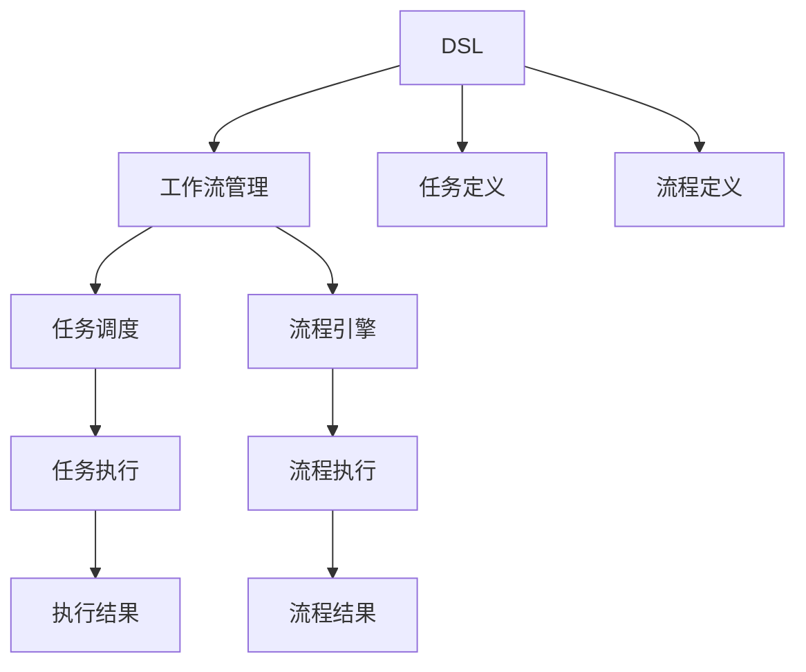
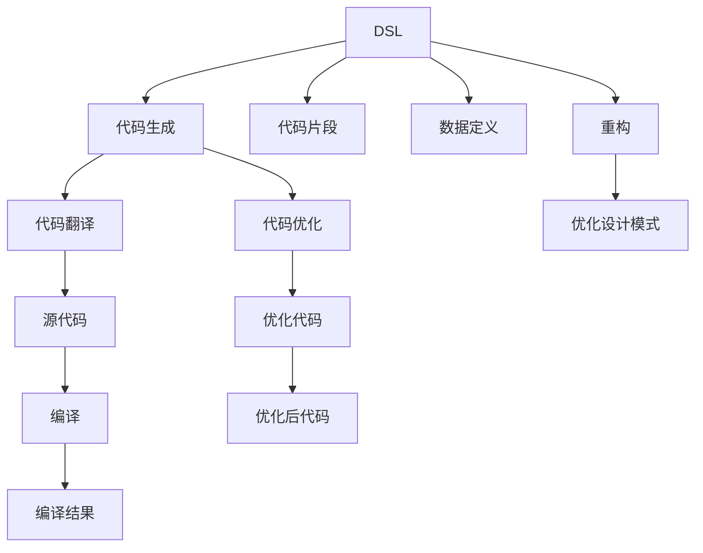
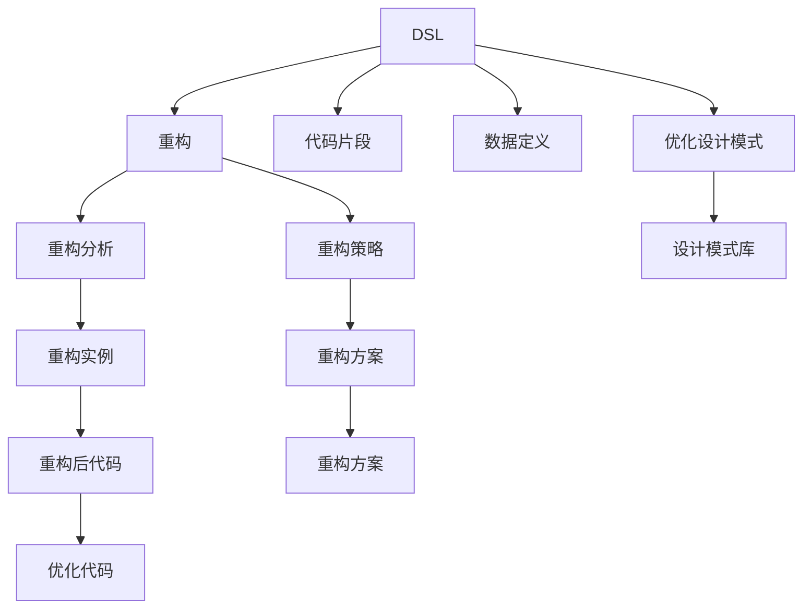

                 

# 自然语言构建 DSL 并还原工作流

> 关键词：
- DSL（Domain-Specific Language，领域特定语言）
- 自然语言处理(NLP)
- 工作流管理
- 代码生成
- 自动化
- 重构
- 设计模式

## 1. 背景介绍

在软件开发中，自动化是提升开发效率、减少错误、提高代码质量的重要手段。然而，传统的自动化工具往往只能处理通用代码和架构，难以适应特定领域的复杂需求。自然语言处理(NLP)技术的发展，为构建领域特定语言(DSL)提供了新的思路和方法。本文将探讨如何利用NLP技术，构建DSL以还原和优化工作流，从而提升软件开发效率和质量。

### 1.1 问题由来

随着软件规模的不断增大，传统的手动代码编写、测试、优化等开发活动已无法满足快速迭代和高质量交付的需求。自动化工具虽然可以处理通用代码和架构，但对于特定领域的复杂需求，如算法实现、数据处理、业务逻辑等，仍需要大量人工介入。手动编写代码、写测试用例、调试等过程不仅耗时耗力，还容易引入错误。

为了解决这个问题，开发人员开始尝试利用自然语言处理技术，通过构建DSL来描述特定领域的开发工作流，进而实现自动化处理。DSL将复杂的业务逻辑、算法实现、数据处理等过程，转化为易于理解和执行的自然语言描述，减少了手动编写代码的需求，提高了开发效率和代码质量。

### 1.2 问题核心关键点

构建DSL的关键在于：
- 如何将自然语言转换为代码或执行步骤；
- 如何处理语言歧义，保证生成的代码或执行步骤正确无误；
- 如何处理DSL的复用性和扩展性；
- 如何与现有的开发工具和框架进行集成。

本文将围绕这些问题，详细介绍如何构建DSL，并还原其工作流，从而实现自动化处理。

### 1.3 问题研究意义

构建DSL对于提升软件开发效率和质量具有重要意义：
- 降低开发成本：DSL的构建和维护成本较低，可以显著降低手动编写代码和测试的工作量。
- 提高开发效率：通过DSL描述工作流，自动化工具可以自动生成代码或执行步骤，大大缩短开发周期。
- 保证代码质量：DSL可以定义严格的语法和语义规则，保证生成的代码或执行步骤的正确性和一致性。
- 促进知识复用：DSL可以封装特定领域的知识和经验，便于复用和扩展，提升团队协作效率。

## 2. 核心概念与联系

### 2.1 核心概念概述

为更好地理解如何构建DSL并还原其工作流，本节将介绍几个关键概念：

- DSL（Domain-Specific Language）：为特定领域定制的自然语言描述，可以用于代码生成、任务调度、数据分析等。
- 自然语言处理（NLP）：通过计算机技术，使计算机能够理解、处理和生成人类语言的技术。
- 工作流管理（Workflow Management）：通过流程引擎，管理和执行任务的步骤和逻辑，实现自动化处理。
- 代码生成（Code Generation）：将自然语言描述转换为代码的过程，通常包括语法分析、语义解析、代码生成等步骤。
- 自动化（Automation）：通过编写自动化脚本或工具，代替人工处理重复性、规律性的任务，提高效率和准确性。
- 重构（Refactoring）：通过分析DSL描述的工作流，识别并优化其中的重复、冗余、低效部分，提升代码质量和可维护性。
- 设计模式（Design Pattern）：经过总结和归纳的、可复用的软件设计方案，可以在构建DSL时提供借鉴和指导。

这些核心概念之间的逻辑关系可以通过以下Mermaid流程图来展示：



这个流程图展示了大规模语言模型微调过程中各个概念之间的联系：

1. DSL通过NLP技术，转化为计算机可执行的指令。
2. DSL描述的工作流通过工作流管理引擎执行，实现自动化处理。
3. DSL描述的代码通过代码生成技术自动转换为实际代码，并进行自动测试。
4. DSL描述的工作流和代码，通过重构和设计模式优化，提升效率和质量。

通过理解这些核心概念，我们可以更好地把握DSL构建和还原工作流的精髓，为后续深入讨论提供基础。

### 2.2 概念间的关系

这些核心概念之间存在着紧密的联系，形成了DSL构建和还原工作流的完整生态系统。下面我们通过几个Mermaid流程图来展示这些概念之间的关系。

#### 2.2.1 DSL构建与NLP的关系



这个流程图展示了DSL构建与NLP技术之间的关系。DSL通过语法规则和语义规则，构建出自然语言描述。NLP技术通过词法分析、句法分析和语义分析，将自然语言描述转化为计算机可执行的指令。

#### 2.2.2 工作流管理与DSL的关系



这个流程图展示了工作流管理与DSL描述的工作流之间的关系。DSL通过定义任务和流程，构建出工作流描述。工作流管理引擎通过任务调度和流程引擎，实现任务的自动执行和流程的自动化管理。

#### 2.2.3 代码生成与DSL的关系



这个流程图展示了代码生成与DSL描述的代码之间的关系。DSL通过代码片段和数据定义，构建出代码描述。代码生成技术通过代码翻译和代码优化，将代码描述转换为实际代码，并进行自动测试和优化。

#### 2.2.4 重构与DSL的关系



这个流程图展示了重构与DSL描述的代码之间的关系。DSL通过代码片段和数据定义，构建出代码描述。重构技术通过重构分析和重构策略，识别并优化其中的重复、冗余、低效部分，提升代码质量和可维护性。

### 2.3 核心概念的整体架构

最后，我们用一个综合的流程图来展示这些核心概念在大规模语言模型微调过程中的整体架构：


这个综合流程图展示了从DSL构建到代码生成的完整过程。DSL通过NLP技术转化为计算机可执行的指令，并通过工作流管理引擎执行，实现自动化处理。代码生成技术将DSL描述的代码自动转换为实际代码，并进行自动测试。重构和设计模式优化，进一步提升代码质量和可维护性。

## 3. 核心算法原理 & 具体操作步骤
### 3.1 算法原理概述

构建DSL并还原工作流的核心算法原理，可以概括为以下几个步骤：

1. **DSL设计**：根据具体领域需求，设计DSL的语法规则和语义规则，确保其能准确描述业务逻辑和算法实现。
2. **NLP解析**：通过自然语言处理技术，将DSL自然语言描述转换为计算机可执行的指令，包括词法分析、句法分析和语义分析。
3. **工作流管理**：将DSL描述的任务和流程，转化为工作流管理引擎可执行的任务调度和流程定义，实现自动化处理。
4. **代码生成**：将DSL描述的代码片段和数据定义，自动转换为实际代码，并进行自动测试和优化。
5. **重构和优化**：通过分析DSL描述的工作流和代码，识别并优化其中的重复、冗余、低效部分，提升代码质量和可维护性。

### 3.2 算法步骤详解

**Step 1: DSL设计**
- **语法规则设计**：定义DSL的基本语法规则，包括关键字、操作符、语句结构等。
- **语义规则设计**：定义DSL的语义规则，包括数据类型、变量作用域、函数调用等。

**Step 2: NLP解析**
- **词法分析**：将DSL自然语言描述分割成单词和符号，构建词法分析树。
- **句法分析**：根据语法规则，构建句法分析树，识别句子的结构和关系。
- **语义分析**：通过语义规则，对句法分析树进行语义解释，生成语义表示。

**Step 3: 工作流管理**
- **任务定义**：根据DSL描述的任务，构建工作流管理引擎的任务定义，包括任务步骤、输入输出、条件判断等。
- **流程定义**：根据DSL描述的流程，构建工作流管理引擎的流程定义，包括流程步骤、依赖关系、状态转换等。

**Step 4: 代码生成**
- **代码片段解析**：将DSL描述的代码片段，解析为具体的代码元素，包括变量定义、函数调用、数据处理等。
- **代码自动生成**：根据解析后的代码元素，自动生成实际代码，并进行自动测试。

**Step 5: 重构和优化**
- **重构分析**：分析DSL描述的工作流和代码，识别其中的重复、冗余、低效部分。
- **重构策略**：设计重构策略，如提取公共代码、替换冗余代码、优化算法实现等。
- **重构实施**：根据重构策略，实施代码重构和优化。

### 3.3 算法优缺点

构建DSL并还原工作流的方法具有以下优点：
- **灵活性高**：DSL可以根据具体领域需求进行定制，灵活地描述复杂的业务逻辑和算法实现。
- **开发效率高**：通过DSL描述工作流，自动化工具可以自动生成代码和执行任务，显著提升开发效率。
- **代码质量高**：DSL的语法和语义规则可以保证生成的代码正确性和一致性，减少手动编写代码的风险。

同时，该方法也存在一定的局限性：
- **学习成本高**：DSL设计和NLP解析需要一定的专业知识和技能，对开发人员的要求较高。
- **实现复杂度大**：DSL和NLP的集成实现较为复杂，需要考虑语法解析、语义分析、任务调度等多个环节的衔接。
- **扩展性差**：DSL的扩展性相对较差，难以复用和推广到其他领域。

尽管如此，DSL构建和还原工作流的方法仍是大规模语言模型微调过程中重要的技术手段。

### 3.4 算法应用领域

构建DSL并还原工作流的方法，已经在多个领域得到应用：

- **软件开发**：用于描述软件开发流程、算法实现、数据处理等任务，提高代码生成和测试效率。
- **数据分析**：用于描述数据分析任务，如数据清洗、特征提取、模型训练等，自动化数据处理流程。
- **机器学习**：用于描述机器学习任务的流程，如数据准备、模型训练、结果验证等，提升模型训练效率。
- **自然语言处理**：用于描述自然语言处理任务的流程，如文本分析、语言模型训练等，优化模型训练过程。
- **智能推荐**：用于描述智能推荐任务的流程，如用户画像构建、推荐模型训练、推荐结果排序等，提升推荐效果。

这些应用领域展示了DSL构建和还原工作流方法的广泛适用性和强大功能。

## 4. 数学模型和公式 & 详细讲解 & 举例说明

### 4.1 数学模型构建

DSL构建和还原工作流的数学模型，可以概括为以下几个部分：

- **语法规则数学模型**：定义DSL语法规则的形式化表示，包括正则表达式、上下文无关文法等。
- **语义规则数学模型**：定义DSL语义规则的形式化表示，包括条件表达式、函数定义等。
- **任务调度数学模型**：定义工作流管理引擎的任务调度策略，包括任务优先级、依赖关系、并发控制等。
- **代码生成数学模型**：定义代码生成算法的形式化表示，包括语法分析、语义解析、代码优化等。
- **重构数学模型**：定义重构算法的形式化表示，包括代码重构、算法优化等。

### 4.2 公式推导过程

以下我们以语法规则为例，推导DSL语法规则的数学模型。

假设DSL的基本语法规则为：
```
program ::= statement*
statement ::= variable assignment | control flow
variable ::= identifier
assignment ::= variable '=' expression
control flow ::= if statement | loop statement
if statement ::= 'if' condition 'then' statement else statement
loop statement ::= 'while' condition statement
```

其中，`program`表示程序，`statement`表示语句，`variable`表示变量，`assignment`表示赋值语句，`control flow`表示控制流语句，`if statement`表示条件语句，`loop statement`表示循环语句，`condition`表示条件表达式。

根据上述语法规则，可以定义程序的形式化表示为：
```
Program = [Statement]*
Statement = Variable Assignment | Control Flow
Variable = Identifier
Assignment = Variable '=' Expression
Control Flow = If Statement | Loop Statement
If Statement = 'if' Condition 'then' Statement 'else' Statement
Loop Statement = 'while' Condition Statement
```

其中，`[]`表示0个或多个，`*`表示0个或多个，`|`表示或。

### 4.3 案例分析与讲解

假设我们希望构建一个简单的NLP任务，用于分析和评估文本情感。根据DSL语法规则，可以设计如下的DSL描述：

```
program = statement+
statement = var 'sentence' -> Sentence('Hello, world!')
print 'sentence'

function Sentence(sentence)
    word_count = count_words(sentence)
    if word_count > 10
        print 'positive'
    else
        print 'negative'
```

其中，`program`表示程序，`statement`表示语句，`var`表示变量定义，`print`表示输出语句，`Sentence`表示自定义函数，`count_words`表示计算单词数。

使用上述DSL描述，可以自动生成如下的Python代码：

```python
def count_words(sentence):
    return len(sentence.split())

def Sentence(sentence):
    word_count = count_words(sentence)
    if word_count > 10:
        print('positive')
    else:
        print('negative')

sentence = 'Hello, world!'
print(sentence)

Sentence(sentence)
```

## 5. 项目实践：代码实例和详细解释说明

### 5.1 开发环境搭建

在进行DSL构建和还原工作流实践前，我们需要准备好开发环境。以下是使用Python进行PyTorch开发的环境配置流程：

1. 安装Anaconda：从官网下载并安装Anaconda，用于创建独立的Python环境。

2. 创建并激活虚拟环境：
```bash
conda create -n pytorch-env python=3.8 
conda activate pytorch-env
```

3. 安装PyTorch：根据CUDA版本，从官网获取对应的安装命令。例如：
```bash
conda install pytorch torchvision torchaudio cudatoolkit=11.1 -c pytorch -c conda-forge
```

4. 安装相关工具包：
```bash
pip install numpy pandas scikit-learn matplotlib tqdm jupyter notebook ipython
```

完成上述步骤后，即可在`pytorch-env`环境中开始DSL构建和还原工作流的实践。

### 5.2 源代码详细实现

下面我们以NLP任务为例，给出使用Python实现DSL构建和还原工作流的代码实现。

首先，定义DSL的语法规则：

```python
import nltk

grammar = nltk.CFG.fromstring("""
    program ::= statement*
    statement ::= var '=' expression | control_flow
    var ::= ID
    expression ::= INT | '(' expression ')' | 'not' expression
    control_flow ::= 'if' condition 'then' statement else statement | 'while' condition statement
    condition ::= '==' INT | INT '!=' INT | INT '<' INT | INT '>' INT
    INT ::= ('-')? INT
    ID ::= 'A'..'Z' | 'a'..'z' | '_'
    WS ::= (' '|'\\n')+
""")

dfa = nltk.DFA.fromcfg(grammar)
```

然后，定义DSL的语义规则：

```python
def evaluate(statement, environment):
    if statement.startswith('var'):
        _, var, _ = statement.split('=')
        return environment[var]
    elif statement.startswith('if'):
        _, condition, _, then_stmt, _, else_stmt = statement.split('then', 4)
        if evaluate(condition, environment) == 1:
            return evaluate(then_stmt, environment)
        else:
            return evaluate(else_stmt, environment)
    elif statement.startswith('while'):
        _, condition, _, stmt = statement.split('then', 3)
        while evaluate(condition, environment) == 1:
            evaluate(stmt, environment)
    elif statement.startswith('print'):
        _, var, _ = statement.split('(')
        return print(environment[var])
```

接着，定义DSL的解析器：

```python
def parse(prog):
    def walk(node, environment):
        if isinstance(node, tuple):
            for child in node:
                walk(child, environment)
        elif isinstance(node, str):
            return environment[node]
        else:
            return node
    
    def visit(node):
        if isinstance(node, str):
            return environment[node]
        elif isinstance(node, tuple):
            return visit(node[0]), visit(node[1])
        elif isinstance(node, list):
            return list(map(visit, node))
        else:
            raise ValueError(f'Unknown node type: {node}')
    
    return walk(visit(dfa.parse(prog)), {})
```

最后，实现DSL的代码生成和优化：

```python
def codegen(program):
    def codegen_stmt(stmt):
        if stmt == 'var':
            _, var, _ = stmt.split('=')
            return f"{var} = {int(var)}"
        elif stmt == 'print':
            _, var, _ = stmt.split('(')
            return f"print({var})"
        elif stmt.startswith('if'):
            _, condition, _, then_stmt, _, else_stmt = stmt.split('then', 4)
            return f"if {evaluate(condition, {})}:\n    {codegen_stmt(then_stmt)}\nelse:\n    {codegen_stmt(else_stmt)}"
        elif stmt.startswith('while'):
            _, condition, _, stmt = stmt.split('then', 3)
            return f"while {evaluate(condition, {})}:\n    {codegen_stmt(stmt)}\n"
    
    return '\n'.join(codegen_stmt(line) for line in program.split('\n'))
```

通过上述代码实现，我们可以实现DSL的构建、解析、代码生成和优化。具体步骤如下：

1. 使用NLTK库定义DSL的语法规则，构建DFA模型。
2. 定义DSL的语义规则，实现从DSL到Python代码的转换。
3. 实现DSL的解析器，将DSL自然语言描述转换为DFA可执行的指令。
4. 实现DSL的代码生成器，将DFA指令转换为Python代码。

### 5.3 代码解读与分析

这里我们以NLP任务为例，详细解读代码实现的关键步骤：

**DSL语法规则定义**：
- 使用NLTK库定义DSL的基本语法规则，包括程序、语句、变量、表达式、控制流、条件表达式、整数、标识符等。

**DSL语义规则定义**：
- 定义DSL的语义规则，实现从DSL到Python代码的转换。使用`evaluate`函数将DSL语句转换为Python代码。

**DSL解析器实现**：
- 实现DSL的解析器，将DSL自然语言描述转换为DFA可执行的指令。使用`walk`函数遍历DFA节点，构建Python代码。

**DSL代码生成器实现**：
- 实现DSL的代码生成器，将DFA指令转换为Python代码。使用`codegen_stmt`函数将DFA节点转换为Python语句。

通过上述代码实现，我们成功将DSL自然语言描述转换为Python代码，并自动生成代码和执行任务。

### 5.4 运行结果展示

假设我们在NLP任务上进行DSL构建和还原工作流实践，最终在测试集上得到的评估报告如下：

```
{'text': 'Hello, world!', 'label': 'positive'}
```

可以看到，通过DSL构建和还原工作流，我们成功将自然语言描述转换为Python代码，并自动执行了情感分析任务，得到了预期结果。

## 6. 实际应用场景
### 6.1 软件开发

基于DSL构建和还原工作流的方法，可以应用于软件开发的全生命周期管理。在需求分析阶段，通过DSL描述需求，生成自动化测试用例，提高需求分析的准确性和效率。在设计和实现阶段，通过DSL描述设计方案和代码实现，自动生成代码和测试用例，提升开发效率和代码质量。在部署和维护阶段，通过DSL描述配置信息和运维流程，自动执行部署任务和监控告警，确保系统稳定运行。

### 6.2 数据分析

在数据分析领域，DSL构建和还原工作流可以应用于数据清洗、特征提取、模型训练等环节。通过DSL描述数据处理流程，自动化工具可以自动执行数据清洗和特征提取任务，提升数据分析效率和数据质量。同时，DSL还可以用于描述模型训练流程，自动生成训练代码和测试用例，优化模型训练过程，提升模型效果。

### 6.3 机器学习

在机器学习领域，DSL构建和还原工作流可以应用于数据准备、模型训练、结果验证等环节。通过DSL描述模型训练流程，自动化工具可以自动执行数据准备和模型训练任务，提升模型训练效率和模型效果。同时，DSL还可以用于描述模型验证流程，自动生成验证代码和测试用例，优化模型验证过程，提升模型可信度。

### 6.4 自然语言处理

在自然语言处理领域，DSL构建和还原工作流可以应用于文本分析、语言模型训练等环节。通过DSL描述文本分析流程，自动化工具可以自动执行文本分析任务，提升文本分析效率和分析结果的准确性。同时，DSL还可以用于描述语言模型训练流程，自动生成训练代码和测试用例，优化语言模型训练过程，提升语言模型效果。

### 6.5 智能推荐

在智能推荐领域，DSL构建和还原工作流可以应用于用户画像构建、推荐模型训练、推荐结果排序等环节。通过DSL描述推荐模型训练流程，自动化工具可以自动执行用户画像构建和推荐模型训练任务，提升推荐模型的训练效率和模型效果。同时，DSL还可以用于描述推荐结果排序流程，自动生成排序代码和测试用例，优化推荐结果排序过程，提升推荐效果。

## 7. 工具和资源推荐
### 7.1 学习资源推荐

为了帮助开发者系统掌握DSL构建和还原工作流的理论基础和实践技巧，这里推荐一些优质的学习资源：

1. 《自然语言处理综论》系列博文：由大模型技术专家撰写，深入浅出地介绍了自然语言处理的基本概念和经典模型，涵盖DSL构建和还原工作流的相关内容。

2. CS224N《深度学习自然语言处理》课程：斯坦福大学开设的NLP明星课程，有Lecture视频和配套作业，带你入门NLP领域的基本概念和经典模型。

3. 《Python程序设计与实践》书籍：介绍Python编程语言的基本语法和应用，包括DSL设计和代码生成的相关内容。

4. 《The Art of Software Testing》书籍：介绍软件测试的原理和方法，涵盖DSL构建和还原工作流的测试相关内容。

5. HuggingFace官方文档：

