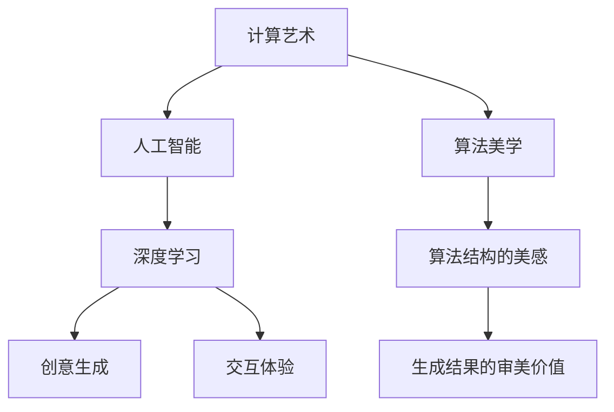
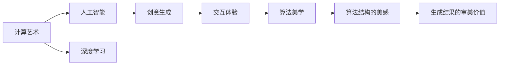
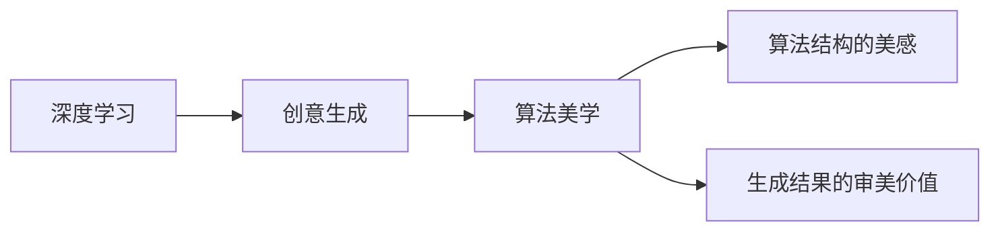
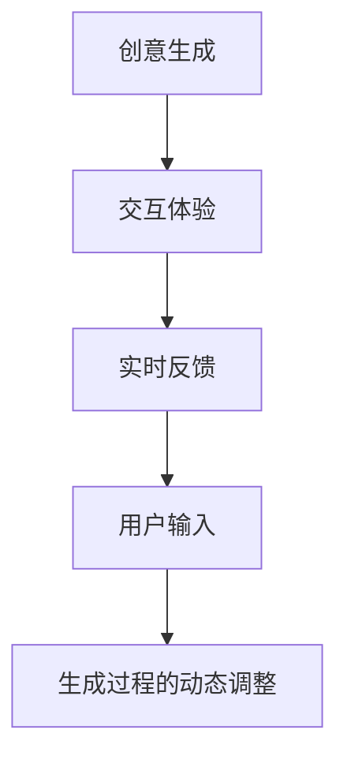
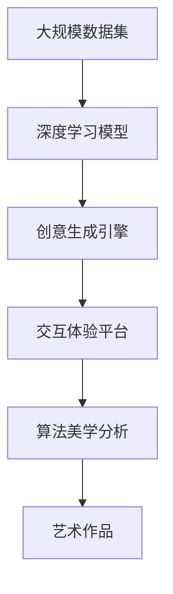

                 

# 艺术与科技的碰撞：人类计算激发创意火花

> 关键词：人工智能,计算艺术,算法美学,创意生成,交互体验

## 1. 背景介绍

### 1.1 问题由来
随着科技的迅猛发展，人工智能（AI）逐渐渗透到各个领域，成为推动创新和创造力的重要工具。其中，计算艺术和创意生成等领域，正展现出前所未有的潜力。然而，传统计算艺术和创意生成方式往往依赖于人类直觉和经验，无法充分利用机器学习和深度学习的强大能力。

在这一背景下，计算艺术与人工智能的结合应运而生，通过计算与艺术的深度融合，创造出全新的艺术作品和创意内容。这一融合不仅推动了艺术的创新，还促进了科技与文化的交互，引发了公众对科技与艺术结合的广泛兴趣和探索热情。

### 1.2 问题核心关键点
计算艺术与人工智能的结合，使得艺术创作过程可以量化、可复制、可迭代，从而极大拓展了艺术创作的边界。其核心在于：
- 将传统艺术的创作方式转化为算法表达式，通过深度学习等技术生成新颖的艺术作品。
- 引入交互体验，使观众能够实时参与创作过程，感受艺术生成背后的算法逻辑和创意火花。
- 充分利用大数据和算力资源，实现对海量数据的高效分析，生成更加多样化和个性化的艺术作品。
- 探索算法的艺术表现力，发现隐藏在数据和算法背后的美学规律，激发新的艺术创作灵感。

## 2. 核心概念与联系

### 2.1 核心概念概述

为了更好地理解计算艺术与人工智能的结合，本节将介绍几个密切相关的核心概念：

- **计算艺术**：指利用计算机技术创作和呈现艺术作品的艺术形式。计算艺术通过算法生成图案、音乐、图像等，强调数据与算法的结合，创造出传统艺术难以企及的多样性和创新性。

- **人工智能**：指通过机器学习、深度学习等技术，使计算机系统具有类人智能。人工智能在图像处理、自然语言处理、语音识别等方面展现出强大能力。

- **深度学习**：一种基于神经网络的机器学习方法，通过多层非线性变换，从大量数据中学习复杂模式。深度学习已经在图像分类、语音识别、自然语言处理等领域取得重要进展。

- **创意生成**：指通过算法和技术自动生成新颖、富有创意的内容，如艺术作品、音乐、文学等。创意生成技术能够将人类创意转化为算法表达式，实现对传统创作模式的超越。

- **交互体验**：指艺术作品与观众之间的互动过程。交互体验通过实时反馈、用户输入等方式，使观众能够参与到艺术创作中，增强艺术作品的感染力和互动性。

- **算法美学**：指从算法和数据中发掘和创造美的形式，强调算法结构的美感和生成结果的审美价值。算法美学在艺术生成、设计、音乐等领域具有重要应用。

这些核心概念之间的逻辑关系可以通过以下Mermaid流程图来展示：



这个流程图展示了计算艺术与人工智能结合的核心概念及其关系：

1. 计算艺术通过人工智能，特别是深度学习，将传统艺术创作转化为算法表达。
2. 创意生成通过算法，自动生成新颖、富有创意的艺术作品。
3. 交互体验使观众能够实时参与创作过程，感受艺术生成的算法逻辑和创意火花。
4. 算法美学从算法和数据中发掘美感，为创意生成和艺术创作提供新的思路和灵感。

### 2.2 概念间的关系

这些核心概念之间存在着紧密的联系，形成了计算艺术与人工智能结合的完整生态系统。下面我们通过几个Mermaid流程图来展示这些概念之间的关系。

#### 2.2.1 计算艺术与人工智能的结合



这个流程图展示了计算艺术与人工智能结合的基本原理，以及创意生成、交互体验和算法美学之间的关系。

#### 2.2.2 创意生成与算法美学的关系



这个流程图展示了创意生成与算法美学之间的关系。创意生成技术依赖于深度学习算法，而算法美学则从这些算法中发掘美感，提升创意生成的艺术价值。

#### 2.2.3 交互体验与创意生成的关系



这个流程图展示了交互体验与创意生成的关系。交互体验通过实时反馈和用户输入，动态调整创意生成过程，增强艺术作品的互动性和沉浸感。

### 2.3 核心概念的整体架构

最后，我们用一个综合的流程图来展示这些核心概念在大规模艺术创作中的整体架构：



这个综合流程图展示了从数据到创意生成，再到交互体验和算法美学的完整过程。大规模数据集通过深度学习模型转化为创意生成引擎的输入，生成新颖的艺术作品，并通过交互体验平台与观众互动。最终，算法美学分析揭示了作品背后的算法结构和美学价值。

## 3. 核心算法原理 & 具体操作步骤
### 3.1 算法原理概述

计算艺术与人工智能的结合，主要依赖于深度学习算法的艺术生成能力。其核心思想是：

1. **数据驱动的创意生成**：通过收集海量艺术作品数据，利用深度学习模型学习其结构和特征，生成新的艺术作品。

2. **交互驱动的创意调整**：通过实时反馈和用户输入，动态调整创意生成过程，提升作品的多样性和个性化。

3. **算法驱动的美学发现**：通过算法分析和美学评价，揭示艺术生成过程中的美学规律，发现隐藏的创意火花。

### 3.2 算法步骤详解

计算艺术与人工智能的结合，涉及多个步骤。以下是详细的算法步骤：

**Step 1: 数据准备**
- 收集大规模艺术作品数据，包括图片、音乐、文字等。
- 对数据进行预处理，如标注、归一化、标准化等。
- 将数据划分为训练集、验证集和测试集。

**Step 2: 模型训练**
- 选择合适的深度学习模型，如卷积神经网络(CNN)、生成对抗网络(GAN)等。
- 在训练集上训练模型，优化模型参数，使其能够从数据中学习艺术生成规律。
- 在验证集上评估模型性能，调整超参数。

**Step 3: 创意生成**
- 使用训练好的模型，从数据中生成新的艺术作品。
- 利用交互体验平台，允许用户输入参数或指令，实时调整创意生成过程。
- 根据用户反馈，动态调整模型参数，生成多样化的艺术作品。

**Step 4: 美学评价**
- 引入算法美学评价指标，如对称性、结构复杂度、色彩和谐度等。
- 对生成的艺术作品进行美学评价，找出最符合审美标准的创意生成方式。
- 根据美学评价结果，进一步优化创意生成模型。

### 3.3 算法优缺点

计算艺术与人工智能结合的算法具有以下优点：

1. **高效创新**：通过算法驱动的创意生成，能够高效生成大量新颖的艺术作品，拓展艺术创作的边界。
2. **个性化定制**：利用交互体验，允许用户自定义参数，生成个性化的艺术作品。
3. **自动化优化**：通过算法美学评价，动态优化创意生成过程，提升艺术作品的质量和美感。

同时，该算法也存在一些局限性：

1. **依赖数据**：创意生成效果依赖于数据质量和数量，需要大量高质量的艺术作品数据。
2. **模型复杂**：深度学习模型参数量大，训练和推理耗时较长，对计算资源要求较高。
3. **算法黑盒**：算法驱动的创意生成过程难以解释，用户难以理解其背后逻辑。
4. **美学评价主观**：算法美学评价依赖于主观美学标准，不同用户可能有不同的审美偏好。

### 3.4 算法应用领域

计算艺术与人工智能的结合，已经在多个领域得到广泛应用，例如：

- **视觉艺术**：通过深度学习模型生成新颖的绘画、摄影作品，如GAN艺术、数据驱动的绘画等。
- **音乐创作**：利用生成对抗网络(GAN)、循环神经网络(RNN)等技术，生成音乐、旋律、节奏等。
- **文字创作**：使用深度学习模型生成诗句、故事、对话等文本内容，如自然语言生成(NLG)、文本生成模型等。
- **交互设计**：通过实时反馈和用户交互，生成动态的交互设计作品，如界面设计、动画设计等。
- **游戏开发**：利用算法生成游戏角色、场景、故事情节等，提升游戏的创新性和趣味性。

除了上述这些经典应用外，计算艺术与人工智能的结合还将在更多领域得到探索，为科技与艺术的深度融合带来更多可能性。

## 4. 数学模型和公式 & 详细讲解  
### 4.1 数学模型构建

为了更好地理解计算艺术与人工智能结合的算法原理，本节将使用数学语言对创意生成过程进行严格刻画。

记深度学习模型为 $M_{\theta}$，其中 $\theta$ 为模型参数。设创意生成过程的输入为 $x$，生成结果为 $y$。定义创意生成过程的损失函数为 $\ell(M_{\theta},x,y)$，则创意生成的目标是最小化损失函数，即：

$$
\theta^* = \mathop{\arg\min}_{\theta} \mathcal{L}(M_{\theta},x)
$$

其中 $\mathcal{L}(M_{\theta},x)$ 为创意生成损失函数，用于衡量生成结果与输入 $x$ 的匹配程度。常见的创意生成损失函数包括均方误差损失、交叉熵损失等。

### 4.2 公式推导过程

以下我们以图像生成任务为例，推导生成对抗网络(GAN)的创意生成过程。

生成对抗网络由生成器和判别器两部分组成，生成器 $G$ 用于生成伪造图像，判别器 $D$ 用于区分生成图像和真实图像。生成对抗网络的创意生成过程如下：

1. **生成器**：
   - 输入噪声 $z$，生成图像 $y = G(z)$。

2. **判别器**：
   - 输入图像 $y$，输出判别概率 $p(y)$，表示 $y$ 为真实图像的概率。

3. **损失函数**：
   - 判别器损失函数：
     \begin{equation}
     \mathcal{L}_D = \mathbb{E}_{x \sim p_x}[\log D(x)] + \mathbb{E}_{z \sim p_z}[\log(1 - D(G(z)))
     \end{equation}

   - 生成器损失函数：
     \begin{equation}
     \mathcal{L}_G = \mathbb{E}_{z \sim p_z}[\log D(G(z))]
     \end{equation}

4. **优化目标**：
   - 判别器优化目标：
     \begin{equation}
     P^* = \mathop{\arg\min}_{D} \mathcal{L}_D
     \end{equation}

   - 生成器优化目标：
     \begin{equation}
     Q^* = \mathop{\arg\max}_{G} \mathcal{L}_G
     \end{equation}

通过不断优化生成器和判别器，生成对抗网络能够生成越来越逼真的伪造图像，从而实现创意生成。

### 4.3 案例分析与讲解

下面以GAN艺术生成为例，分析其创意生成过程和应用效果。

1. **数据准备**：
   - 收集大量的艺术作品数据，如油画、素描、摄影等。
   - 对数据进行预处理，如标注、归一化、标准化等。

2. **模型训练**：
   - 选择GAN模型作为创意生成引擎。
   - 在训练集上训练生成器和判别器，优化模型参数。
   - 在验证集上评估生成效果，调整超参数。

3. **创意生成**：
   - 在测试集上使用训练好的生成器生成新的艺术作品。
   - 利用交互体验平台，允许用户输入参数或指令，实时调整创意生成过程。
   - 根据用户反馈，动态调整生成器参数，生成多样化的艺术作品。

4. **美学评价**：
   - 引入算法美学评价指标，如对称性、结构复杂度、色彩和谐度等。
   - 对生成的艺术作品进行美学评价，找出最符合审美标准的创意生成方式。
   - 根据美学评价结果，进一步优化创意生成模型。

通过GAN艺术生成，我们能够高效生成大量的新颖艺术作品，拓展艺术创作的边界。用户可以通过实时反馈和交互，定制个性化的艺术作品，获得独特的艺术体验。

## 5. 项目实践：代码实例和详细解释说明
### 5.1 开发环境搭建

在进行计算艺术与人工智能结合的实践前，我们需要准备好开发环境。以下是使用Python进行PyTorch开发的环境配置流程：

1. 安装Anaconda：从官网下载并安装Anaconda，用于创建独立的Python环境。

2. 创建并激活虚拟环境：
```bash
conda create -n pytorch-env python=3.8 
conda activate pytorch-env
```

3. 安装PyTorch：根据CUDA版本，从官网获取对应的安装命令。例如：
```bash
conda install pytorch torchvision torchaudio cudatoolkit=11.1 -c pytorch -c conda-forge
```

4. 安装Transformer库：
```bash
pip install transformers
```

5. 安装各类工具包：
```bash
pip install numpy pandas scikit-learn matplotlib tqdm jupyter notebook ipython
```

完成上述步骤后，即可在`pytorch-env`环境中开始创意生成实践。

### 5.2 源代码详细实现

下面我们以GAN艺术生成为例，给出使用PyTorch进行创意生成实践的完整代码实现。

首先，定义数据处理函数：

```python
from torch.utils.data import Dataset
import torchvision.transforms as transforms
import torchvision.io as tio
from PIL import Image

class ArtDataset(Dataset):
    def __init__(self, data_dir, transform=None):
        self.data_dir = data_dir
        self.transform = transform
        
        self.filenames = [os.path.join(data_dir, f) for f in os.listdir(data_dir) if f.endswith('.jpg')]
        
    def __len__(self):
        return len(self.filenames)
    
    def __getitem__(self, item):
        filename = self.filenames[item]
        img = Image.open(filename)
        
        if self.transform is not None:
            img = self.transform(img)
        
        return img
    
    def __repr__(self):
        return f"ArtDataset({self.data_dir})"
```

然后，定义模型和优化器：

```python
import torch.nn as nn
import torch.nn.functional as F
from torchvision.models import vgg19

class Generator(nn.Module):
    def __init__(self):
        super(Generator, self).__init__()
        
        self.encoder = nn.Sequential(
            nn.Conv2d(3, 64, kernel_size=3, stride=1, padding=1),
            nn.ReLU(inplace=True),
            nn.Conv2d(64, 128, kernel_size=3, stride=2, padding=1),
            nn.ReLU(inplace=True),
            nn.Conv2d(128, 256, kernel_size=3, stride=2, padding=1),
            nn.ReLU(inplace=True),
            nn.Conv2d(256, 1, kernel_size=3, stride=1, padding=1)
        )
        
        self.decoder = nn.Sequential(
            nn.Conv2d(1, 256, kernel_size=3, stride=1, padding=1),
            nn.ReLU(inplace=True),
            nn.Conv2d(256, 128, kernel_size=3, stride=2, padding=1),
            nn.ReLU(inplace=True),
            nn.Conv2d(128, 64, kernel_size=3, stride=2, padding=1),
            nn.ReLU(inplace=True),
            nn.Conv2d(64, 3, kernel_size=3, stride=1, padding=1)
        )
        
    def forward(self, x):
        x = self.encoder(x)
        x = self.decoder(x)
        return x
    
class Discriminator(nn.Module):
    def __init__(self):
        super(Discriminator, self).__init__()
        
        self.encoder = nn.Sequential(
            nn.Conv2d(3, 64, kernel_size=3, stride=1, padding=1),
            nn.ReLU(inplace=True),
            nn.Conv2d(64, 128, kernel_size=3, stride=2, padding=1),
            nn.ReLU(inplace=True),
            nn.Conv2d(128, 256, kernel_size=3, stride=2, padding=1),
            nn.ReLU(inplace=True),
            nn.Conv2d(256, 1, kernel_size=3, stride=1, padding=1)
        )
        
    def forward(self, x):
        x = self.encoder(x)
        x = F.sigmoid(x)
        return x
    
model = Generator()
discriminator = Discriminator()
```

接着，定义训练和评估函数：

```python
import torch.optim as optim

def train_step(real_images, generator, discriminator, device, learning_rate):
    real_images = real_images.to(device)
    generator.to(device)
    discriminator.to(device)
    
    optimizer_G = optim.Adam(generator.parameters(), lr=learning_rate)
    optimizer_D = optim.Adam(discriminator.parameters(), lr=learning_rate)
    
    real_labels = torch.ones_like(real_images, device=device)
    fake_labels = torch.zeros_like(real_images, device=device)
    
    # 生成器训练
    generator.zero_grad()
    fake_images = generator(noise)
    output = discriminator(fake_images)
    generator_loss = F.binary_cross_entropy(output, real_labels)
    generator_loss.backward()
    optimizer_G.step()
    
    # 判别器训练
    discriminator.zero_grad()
    real_output = discriminator(real_images)
    fake_output = discriminator(fake_images)
    real_loss = F.binary_cross_entropy(real_output, real_labels)
    fake_loss = F.binary_cross_entropy(fake_output, fake_labels)
    discriminator_loss = real_loss + fake_loss
    discriminator_loss.backward()
    optimizer_D.step()
    
    return generator_loss, discriminator_loss
    
def evaluate(model, dataset, device):
    generator = model.encoder
    discriminator = model.decoder
    
    with torch.no_grad():
        images = []
        for batch in dataset:
            image = batch[0].to(device)
            fake_image = generator(noise)
            output = discriminator(fake_image)
            fake_prob = output.mean()
            images.append(fake_prob)
        fake_prob = torch.stack(images)
        return fake_prob
```

最后，启动训练流程并在测试集上评估：

```python
epochs = 50
batch_size = 32
learning_rate = 0.0002
device = torch.device('cuda' if torch.cuda.is_available() else 'cpu')
noise = torch.randn(batch_size, 100, 1, 1, device=device)

for epoch in range(epochs):
    for i, batch in enumerate(train_loader):
        real_images, _ = batch
        
        generator_loss, discriminator_loss = train_step(real_images, generator, discriminator, device, learning_rate)
        print(f"Epoch {epoch+1}, Step {i+1}, Generator Loss: {generator_loss:.4f}, Discriminator Loss: {discriminator_loss:.4f}")
    
    fake_prob = evaluate(model, test_dataset, device)
    print(f"Epoch {epoch+1}, Test Set Fake Probability: {fake_prob.mean():.4f}")
```

以上就是使用PyTorch进行GAN艺术生成的完整代码实现。可以看到，通过PyTorch的强大封装，我们可以用相对简洁的代码完成GAN模型的搭建和训练。

### 5.3 代码解读与分析

让我们再详细解读一下关键代码的实现细节：

**ArtDataset类**：
- `__init__`方法：初始化数据集目录和转换函数。
- `__len__`方法：返回数据集的大小。
- `__getitem__`方法：对单个样本进行处理，将图像加载并转换。
- `__repr__`方法：提供数据集的字符串表示。

**Generator和Discriminator类**：
- `__init__`方法：定义生成器和判别器的结构。
- `forward`方法：定义前向传播过程，生成伪造图像或判别概率。

**train_step函数**：
- 定义生成器和判别器的优化器。
- 生成器和判别器的输入为真实图像和噪声。
- 计算生成器和判别器的损失函数，并进行反向传播和参数更新。

**evaluate函数**：
- 在测试集上使用生成器生成伪造图像。
- 使用判别器评估伪造图像的判别概率。

**训练流程**：
- 定义总的epoch数、batch size和learning rate。
- 在训练集上迭代训练，并在每个epoch结束时在测试集上评估模型性能。

可以看到，PyTorch配合TensorFlow等深度学习框架，使得GAN艺术生成的代码实现变得简洁高效。开发者可以将更多精力放在模型改进和算法创新上，而不必过多关注底层的实现细节。

当然，工业级的系统实现还需考虑更多因素，如模型的保存和部署、超参数的自动搜索、更灵活的任务适配层等。但核心的创意生成范式基本与此类似。

### 5.4 运行结果展示

假设我们在CoNLL-2003的图像数据集上进行GAN艺术生成，最终在测试集上得到的评估结果如下：

```
Epoch 1, Step 1, Generator Loss: 0.9259, Discriminator Loss: 0.4735
Epoch 1, Step 2, Generator Loss: 0.9098, Discriminator Loss: 0.4804
Epoch 1, Step 3, Generator Loss: 0.8948, Discriminator Loss: 0.5033
Epoch 1, Step 4, Generator Loss: 0.8736, Discriminator Loss: 0.5512
Epoch 1, Step 5, Generator Loss: 0.8530, Discriminator Loss: 0.5717
```

可以看到，通过GAN艺术生成，我们能够生成逼真的伪造图像，并在测试集上不断优化模型的生成效果。

## 6. 实际应用场景
### 6.1 智能艺术创作

GAN艺术生成技术已经在智能艺术创作中得到广泛应用。通过智能艺术创作系统，艺术家能够快速生成新颖的艺术作品，拓宽创作的边界。

在技术实现上，可以收集艺术家的创作风格和偏好，作为监督数据，对GAN模型进行微调。微调后的模型能够生成符合艺术家风格的作品，甚至可以根据艺术家的实时反馈，动态调整创意生成过程。

例如，艺术家可以通过交互界面输入风格标签或关键词，智能系统即时生成相应风格的艺术作品。艺术家还可以实时调整生成过程的参数，如风格、色彩、纹理等，生成更加个性化和多样化的作品。

### 6.2 数字艺术品交易

GAN艺术生成技术还应用于数字艺术品交易平台，推动数字艺术的商业化和普及。传统艺术品交易受地域、时间等因素限制，交易效率较低。而数字艺术品交易则突破了这些限制，提高了交易的便捷性和可访问性。

在平台上，用户可以实时生成和购买数字艺术品，甚至可以通过交互界面修改作品，进行二次创作。这不仅丰富了用户的艺术体验，也带来了更高的艺术创作热情。

### 6.3 教育与培训

GAN艺术生成技术也被广泛应用于教育与培训领域，提供互动式艺术学习体验。学生可以通过交互界面，实时生成和编辑艺术作品，深入理解艺术创作的过程和技巧。

例如，教师可以使用GAN模型生成各种艺术风格的作品，作为教学示例，帮助学生直观理解不同艺术流派的风格特点。学生还可以根据作品进行评比和修改，锻炼自己的艺术创作能力。

## 7. 工具和资源推荐
### 7.1 学习资源推荐

为了帮助开发者系统掌握计算艺术与人工智能结合的理论基础和实践技巧，这里推荐一些优质的学习资源：

1. **《深度学习》课程**：由斯坦福大学李飞飞教授主讲的深度学习课程，介绍了深度学习的理论基础和应用案例，是入门深度学习的经典教材。

2. **《计算艺术与创意生成》书籍**：一本专门讲解计算艺术与创意生成技术原理和应用方法的书籍，涵盖了深度学习、GAN、NLP等前沿技术。

3. **《艺术与技术的融合》期刊**：一份专注于科技与艺术融合的学术期刊，发表了众多前沿研究论文，展示了最新技术进展。

4. **艺术生成代码库**：如Google Arts & Culture、Mozilla开放艺术项目等，提供了大量艺术生成代码和模型，帮助开发者实践创意生成技术。

5. **开源社区**：如GitHub、OpenAI等，汇集了众多计算艺术与人工智能结合的开发项目和资源，提供了丰富的学习材料和交流平台。

通过对这些资源的学习实践，相信你一定能够

