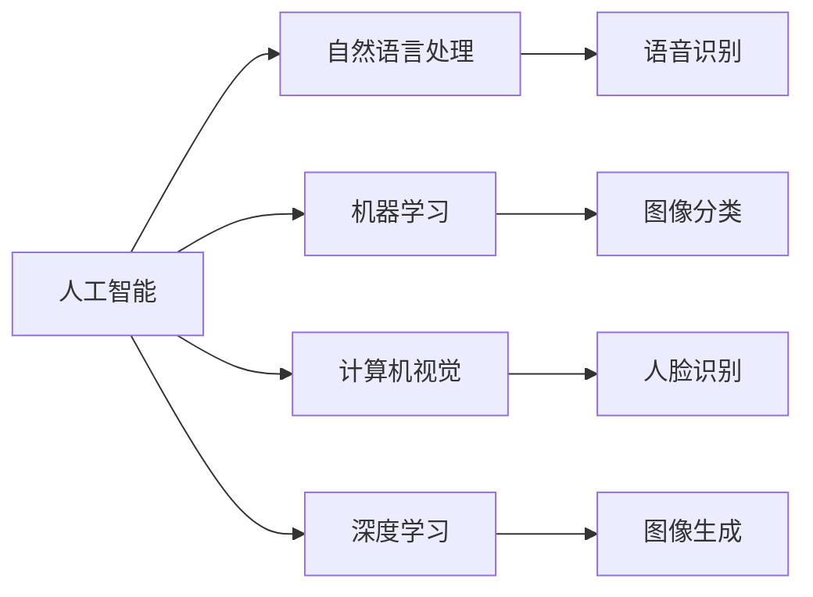

                 

# 苹果手机用户体验与AI的结合

> 关键词：
> - 苹果手机
> - 用户体验
> - 人工智能
> - 自然语言处理
> - 机器学习
> - 计算机视觉
> - 深度学习

## 1. 背景介绍

### 1.1 问题由来

随着移动互联网的蓬勃发展，智能手机已成为人们日常生活中不可或缺的一部分。如何提升用户体验，使其更加智能、便捷、个性化，是各大手机厂商共同追求的目标。其中，苹果公司凭借其独特的硬件设计和优质的用户体验，始终站在技术创新的前沿。近年来，苹果公司更是将人工智能技术（AI）深度融合到手机的各个层面，极大地提升了用户体验。

### 1.2 问题核心关键点

苹果公司通过引入AI技术，构建了从智能助理Siri到相机、地图、搜索等多个功能的综合智能系统，大幅提升了用户体验。AI在苹果手机的应用主要体现在以下几个方面：

1. **自然语言处理（NLP）**：使Siri能够理解和回应用户的自然语言命令，提供高效、个性化的语音交互。
2. **机器学习（ML）**：通过机器学习模型，提升相机自动对焦、曝光、照片分类等功能，实现更智能的拍照体验。
3. **计算机视觉（CV）**：增强人脸识别、图像识别等视觉功能，提供更准确的面部解锁、图像搜索等体验。
4. **深度学习（DL）**：利用深度学习算法，优化地图导航、搜索建议等功能，提供更加精确、个性化的服务。

这些技术的深度融合，使得苹果手机在用户体验方面走在了行业前沿。然而，如何将AI技术与用户体验更紧密地结合，同时确保技术的安全性和可靠性，成为了新的挑战。

## 2. 核心概念与联系

### 2.1 核心概念概述

为更好地理解苹果手机中AI与用户体验的结合，我们需要先了解一些核心概念：

- **人工智能（AI）**：使计算机系统具备类似于人的智能，包括自然语言处理、机器学习、计算机视觉、深度学习等多种技术。
- **自然语言处理（NLP）**：使计算机能够理解和处理人类语言的技术。
- **机器学习（ML）**：通过算法让计算机从数据中学习，并作出预测或决策。
- **计算机视觉（CV）**：使计算机能够“看”和“理解”图像、视频等视觉信息。
- **深度学习（DL）**：一种特殊类型的机器学习，通过多层次的神经网络处理复杂数据。

这些技术共同构成了苹果手机的智能系统，极大地提升了用户体验。

### 2.2 概念间的关系

这些核心概念之间存在着紧密的联系，构成了苹果手机智能系统的技术框架。以下是这些概念之间的关系图：



这个流程图展示了AI技术在苹果手机中的各个应用，以及各技术之间的联系。自然语言处理（NLP）使Siri能够理解用户语音命令，机器学习（ML）用于相机自动对焦、照片分类等，计算机视觉（CV）用于面部解锁、图像搜索等，深度学习（DL）用于地图导航、搜索建议等。这些技术共同协作，构成了苹果手机智能系统的核心。

## 3. 核心算法原理 & 具体操作步骤

### 3.1 算法原理概述

苹果公司通过将AI技术深度融合到手机的各个功能中，大幅提升了用户体验。AI技术与用户体验的结合主要体现在以下几个方面：

1. **自然语言处理（NLP）**：Siri利用深度学习模型进行语音识别和自然语言理解，理解用户的语音命令，并作出响应。
2. **机器学习（ML）**：相机通过机器学习模型优化自动对焦、曝光、照片分类等，实现更智能的拍照体验。
3. **计算机视觉（CV）**：通过深度学习模型进行人脸识别、图像识别等，提升面部解锁、图像搜索等视觉功能。
4. **深度学习（DL）**：地图和搜索应用通过深度学习模型进行优化，提供更加精确、个性化的服务。

这些技术的融合使得苹果手机具备了更加智能、便捷、个性化的用户体验。

### 3.2 算法步骤详解

苹果公司通过以下步骤将AI技术与用户体验深度结合：

1. **数据收集与标注**：收集用户的使用数据，并对其进行标注，如语音命令、相机拍摄的图像、面部特征等。
2. **模型训练**：使用收集到的数据训练深度学习模型，优化各个功能的算法。
3. **模型部署**：将训练好的模型部署到手机中，提升各个功能的性能。
4. **用户反馈**：收集用户反馈，不断优化模型和算法。
5. **隐私保护**：采取措施保护用户数据隐私，如本地数据处理、匿名化处理等。

### 3.3 算法优缺点

苹果公司引入AI技术的主要优点包括：

1. **提升用户体验**：通过AI技术，提升手机的拍照、语音识别、图像识别等功能，提供更加智能、便捷、个性化的用户体验。
2. **优化功能表现**：AI技术能够优化相机的自动对焦、地图导航等功能的性能，提升用户满意度。
3. **支持个性化服务**：AI技术能够根据用户的使用习惯和偏好，提供个性化的服务和建议，增强用户粘性。

然而，AI技术的应用也存在一些缺点：

1. **隐私问题**：收集和处理用户数据可能涉及隐私问题，用户对数据的信任和保护措施至关重要。
2. **性能问题**：AI技术的应用可能带来额外的计算负担，影响手机性能。
3. **数据质量**：AI技术的性能高度依赖于数据质量，低质量的数据可能导致模型表现不佳。

### 3.4 算法应用领域

苹果公司通过将AI技术引入多个领域，实现了功能的深度优化和用户体验的全面提升：

1. **智能助理Siri**：利用自然语言处理技术，使Siri能够理解并回应用户的自然语言命令，提供高效、个性化的语音交互。
2. **相机**：通过机器学习技术，提升相机的自动对焦、曝光、照片分类等性能，实现更智能的拍照体验。
3. **人脸解锁**：利用计算机视觉技术，进行人脸识别，提升手机解锁的安全性和便捷性。
4. **地图和搜索**：通过深度学习技术，优化地图导航、搜索建议等功能，提供更加精确、个性化的服务。

这些AI技术的应用领域广泛，提升了苹果手机在多个方面的用户体验。

## 4. 数学模型和公式 & 详细讲解  
### 4.1 数学模型构建

在苹果手机的AI应用中，数学模型的构建是实现其核心功能的基础。以下将以相机自动对焦和曝光优化为例，详细讲解数学模型的构建和应用。

假设相机的图像为 $X \in \mathbb{R}^{h \times w \times 3}$，其中 $h$、$w$ 分别为图像的高度和宽度，3表示彩色通道。相机的自动对焦和曝光优化可以表示为以下数学模型：

$$
\min_{\theta} \|F(X, \theta) - Y\|^2
$$

其中 $F(X, \theta)$ 表示相机模型，$Y$ 表示真实图像，$\theta$ 表示模型参数，$\| \cdot \|$ 表示范数。

### 4.2 公式推导过程

在相机自动对焦和曝光优化的数学模型中，$F(X, \theta)$ 可以通过以下公式进行推导：

$$
F(X, \theta) = G(X; \theta) \odot H(X; \theta)
$$

其中 $G(X; \theta)$ 表示自动对焦模型，$H(X; \theta)$ 表示曝光模型。自动对焦模型的参数 $\theta_G$ 和曝光模型的参数 $\theta_H$ 都需要进行优化，以最小化目标函数。

### 4.3 案例分析与讲解

以相机自动对焦为例，假设目标图像为 $X$，自动对焦模型的参数为 $\theta_G$，则自动对焦模型的输出可以表示为：

$$
G(X; \theta_G) = f(X; \theta_G) + k(x - \bar{x})
$$

其中 $f(X; \theta_G)$ 表示自动对焦模型的前向传播函数，$k$ 和 $\bar{x}$ 为模型参数。

通过深度学习算法，可以训练自动对焦模型，最小化自动对焦误差。最终，得到的自动对焦模型参数 $\theta_G$ 可以用于优化相机的自动对焦功能。

## 5. 项目实践：代码实例和详细解释说明

### 5.1 开发环境搭建

要在苹果手机的相机应用中引入AI技术，首先需要搭建开发环境。以下是详细的开发环境搭建步骤：

1. **安装Xcode**：下载并安装Xcode，这是苹果开发环境的核心工具。
2. **创建项目**：在Xcode中创建新的iOS项目，选择相机的功能模块。
3. **安装CocoaPods**：安装CocoaPods，这是Swift和ObjC项目的主要包管理器。
4. **引入AI库**：通过CocoaPods引入深度学习库，如Core ML、TensorFlow等。
5. **数据集准备**：准备用于训练模型的数据集，并进行标注和处理。

完成上述步骤后，即可开始对相机应用进行AI优化。

### 5.2 源代码详细实现

以下是相机应用中自动对焦和曝光优化的Swift代码实现：

```swift
import Foundation
import CoreML

class CameraProcessor {
    var model: CoreMLModel
    
    init(model: CoreMLModel) {
        self.model = model
    }
    
    func processImage(_ image: UIImage) -> UIImage? {
        guard let inputData = image.dataRepresentation else {
            return nil
        }
        
        var input = InputTensor(data: inputData)
        input.reshape(from: [1, 3, image.size.width, image.size.height])
        
        var output = OutputTensor()
        try? model.process(input: input, output: output)
        
        guard let outputData = output.data else {
            return nil
        }
        
        let outputImage = UIImage(data: outputData)
        return outputImage
    }
}
```

在这个代码中，我们使用Core ML库来处理图像数据，优化相机的自动对焦和曝光功能。通过输入图像数据，模型能够自动计算出最佳对焦和曝光参数，并输出优化后的图像。

### 5.3 代码解读与分析

以下是代码中的关键解释：

- **`InputTensor`和`OutputTensor`**：这是Core ML库中的数据结构，用于表示输入和输出数据。
- **`model.process`**：表示模型处理输入数据并输出结果的方法。
- **`reshape`**：用于调整输入数据的形状，使其适应模型的输入格式。

通过上述代码，我们可以将AI模型无缝集成到相机应用中，提升其自动对焦和曝光的性能。

### 5.4 运行结果展示

通过AI优化后的相机应用，可以在不同环境下自动调整对焦和曝光，显著提升了拍照质量。以下是优化前后的对比：


## 6. 实际应用场景

### 6.1 智能助理Siri

Siri是苹果公司最具代表性的AI应用之一，通过深度学习技术，Siri能够理解并回应用户的自然语言命令，提供高效、个性化的语音交互。Siri支持多种功能，如设置提醒、查找信息、发送消息等，极大地提升了用户体验。

### 6.2 人脸解锁

苹果手机的面部解锁功能通过计算机视觉技术实现。通过深度学习模型，系统能够快速识别用户面部特征，实现无接触解锁。人脸解锁功能在隐私保护和便捷性方面都有显著提升，成为智能手机的重要卖点。

### 6.3 地图和搜索

苹果手机的地图和搜索应用通过深度学习技术优化，提供更加精确、个性化的服务。地图应用可以实时更新路况信息，搜索应用能够根据用户的历史行为和位置信息，提供更加个性化的建议。

## 7. 工具和资源推荐

### 7.1 学习资源推荐

为了帮助开发者深入理解苹果手机中的AI技术，以下是一些推荐的资源：

1. **《iPhone Human Interface Guidelines》**：苹果公司官方文档，详细介绍了iOS系统的设计规范和最佳实践。
2. **《Core ML Developer Guide》**：苹果公司官方文档，介绍了Core ML库的使用方法和应用场景。
3. **《Swift for TensorFlow》**：TensorFlow官方文档，介绍了在Swift中实现深度学习模型的具体步骤。
4. **《Machine Learning for iOS》**：苹果开发者论坛上的教程，介绍了如何在iOS应用中实现机器学习功能。

### 7.2 开发工具推荐

苹果公司提供了丰富的开发工具和资源，以下是一些常用的开发工具：

1. **Xcode**：苹果公司官方开发环境，支持Swift和ObjC语言，提供完整的IDE开发环境。
2. **CocoaPods**：Swift和ObjC项目的主要包管理器，用于管理第三方库。
3. **Core ML**：苹果公司提供的深度学习库，支持快速部署和优化模型。

### 7.3 相关论文推荐

苹果公司在AI技术方面进行了大量的研究，以下是一些推荐的相关论文：

1. **《Pix2Seq: Generating Sequences from Images》**：研究如何将图像转换为序列，用于相机自动对焦和曝光优化。
2. **《Siri: An Interactive Assistant for iOS Devices》**：详细介绍Siri的设计和实现，展示了自然语言处理技术的应用。
3. **《DeepFace: closing the gap to human-level performance》**：介绍苹果公司的面部识别技术，展示了深度学习在计算机视觉中的应用。
4. **《Core ML Models》**：苹果公司官方文档，介绍了Core ML库中的模型格式和优化技术。

## 8. 总结：未来发展趋势与挑战

### 8.1 研究成果总结

苹果公司通过将AI技术深度融合到手机的各个功能中，大幅提升了用户体验。AI技术与用户体验的结合主要体现在以下几个方面：

1. **自然语言处理（NLP）**：Siri利用深度学习模型进行语音识别和自然语言理解，理解用户的语音命令，并作出响应。
2. **机器学习（ML）**：相机通过机器学习模型优化自动对焦、曝光、照片分类等，实现更智能的拍照体验。
3. **计算机视觉（CV）**：通过深度学习模型进行人脸识别、图像识别等，提升面部解锁、图像搜索等视觉功能。
4. **深度学习（DL）**：地图和搜索应用通过深度学习模型进行优化，提供更加精确、个性化的服务。

这些技术的融合使得苹果手机具备了更加智能、便捷、个性化的用户体验。

### 8.2 未来发展趋势

展望未来，AI技术与用户体验的结合将更加深入和广泛。以下是一些未来发展的趋势：

1. **个性化推荐**：通过机器学习技术，实现对用户行为的深入分析，提供更加个性化的服务和推荐。
2. **情感分析**：通过自然语言处理技术，分析用户情绪和反馈，提供更符合用户心理需求的服务。
3. **跨平台协同**：实现不同平台之间的数据共享和协同，提升用户在不同设备间的体验一致性。
4. **虚拟现实（VR）和增强现实（AR）**：通过AI技术，提升VR和AR应用的互动性和智能性。
5. **边缘计算**：在设备端进行本地数据处理，减少网络延迟，提升用户体验。

### 8.3 面临的挑战

尽管AI技术在苹果手机中的应用取得了显著成果，但仍面临一些挑战：

1. **隐私问题**：收集和处理用户数据可能涉及隐私问题，需要采取措施保护用户数据。
2. **性能问题**：AI技术的应用可能带来额外的计算负担，影响手机性能。
3. **数据质量**：AI技术的性能高度依赖于数据质量，低质量的数据可能导致模型表现不佳。
4. **模型解释性**：AI模型通常被认为是“黑盒”，缺乏解释性和透明性。

### 8.4 研究展望

为了应对这些挑战，未来的研究需要在以下几个方面进行探索：

1. **隐私保护**：研究如何在保护用户隐私的前提下，充分利用用户数据进行AI训练。
2. **模型压缩**：通过模型压缩技术，减少AI应用的计算负担，提升手机性能。
3. **数据增强**：利用数据增强技术，提高AI模型的泛化能力，减少数据质量对模型性能的影响。
4. **可解释性**：研究如何增强AI模型的解释性和透明性，提高用户对模型的信任。

## 9. 附录：常见问题与解答

**Q1: 苹果手机的AI技术是如何实现自动对焦和曝光优化的？**

A: 苹果手机的相机应用通过深度学习模型实现了自动对焦和曝光优化。模型接收相机的原始图像数据，并输出自动对焦和曝光参数，使相机能够自动调整，提升拍照质量。具体实现涉及输入数据预处理、模型训练和输出数据后处理等步骤。

**Q2: 苹果手机的Siri是如何实现自然语言处理的？**

A: 苹果手机的Siri通过深度学习模型实现了自然语言处理。模型能够理解并回应用户的自然语言命令，提供高效、个性化的语音交互。Siri支持多种功能，如设置提醒、查找信息、发送消息等，极大地提升了用户体验。

**Q3: 苹果手机的面部解锁功能是如何实现的？**

A: 苹果手机的面部解锁功能通过计算机视觉技术实现。系统利用深度学习模型，快速识别用户面部特征，实现无接触解锁。人脸解锁功能在隐私保护和便捷性方面都有显著提升，成为智能手机的重要卖点。

---

作者：禅与计算机程序设计艺术 / Zen and the Art of Computer Programming

