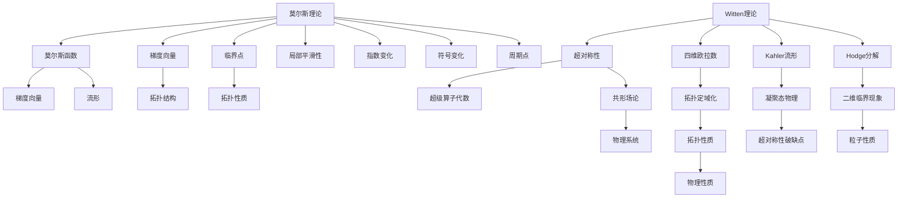

                 

# 莫尔斯理论与Witten理论

## 1. 背景介绍

莫尔斯理论与Witten理论是数学与物理领域的两大基石，均属于拓扑学范畴，在理论物理和数学领域有重要应用。莫尔斯理论研究实数动力系统中的周期和流形，而Witten理论研究超对称场论和凝聚态物理。虽然两者看似不同，但在物理机制和数学框架上有许多相通之处。本文将深入探讨莫尔斯理论与Witten理论的核心思想、基本原理以及应用场景，力求为读者提供一个全面的视角。

## 2. 核心概念与联系

### 2.1 核心概念概述

**莫尔斯理论**：莫尔斯理论研究实数动力系统中周期点和流形的拓扑性质。莫尔斯理论定义了一个叫做莫尔斯函数的概念，它是局部平滑的，并且具有在临界点的指数为正的符号变化。莫尔斯函数的梯度向量决定了其临界点的性质和流形的拓扑结构。

**Witten理论**：Witten理论是量子场论的一种形式，通过引入超对称性来研究拓扑场论和凝聚态物理问题。Witten理论基于一个超对称规范理论，其中引入了四维欧拉数、Kahler流形、Hodge分解等概念。Witten理论的核心是超级算子代数和共形场论，通过这些工具，可以研究拓扑定域化、凝聚态物理和二维临界现象等。

莫尔斯理论与Witten理论虽然看起来学科不同，但实际上两者有许多联系。莫尔斯理论中的梯度向量与Witten理论中的超对称性，都具有对称性和局部性。此外，莫尔斯理论中的临界点与Witten理论中的超对称性破缺点，也具有相似的结构。两者均从拓扑角度研究物理系统的性质，只是具体研究对象和工具有所不同。

### 2.2 核心概念间的关系

莫尔斯理论与Witten理论的关系可以通过以下两个方面来理解：

1. **对称性和局部性**：莫尔斯函数和Witten理论中的超对称性都具有对称性和局部性。莫尔斯函数的梯度向量决定了其临界点的性质，而Witten理论中的超对称性也决定了其粒子的性质。

2. **拓扑性质**：莫尔斯理论中的临界点和Witten理论中的超对称性破缺点，都具有拓扑性质。莫尔斯理论研究流形的拓扑结构，而Witten理论研究拓扑定域化。

这两个方面展示了莫尔斯理论与Witten理论的紧密联系，尽管具体研究对象和方法有所不同，但它们均从拓扑角度出发，研究物理系统的基本性质。

### 2.3 核心概念的整体架构

下面通过一个综合的流程图来展示莫尔斯理论与Witten理论的整体架构：



这个综合流程图展示了莫尔斯理论与Witten理论的核心概念和它们之间的联系。莫尔斯理论从梯度向量、临界点、流形等角度研究实数动力系统，而Witten理论则从超对称性、四维欧拉数、Kahler流形等角度研究超对称场论和凝聚态物理。两者均从拓扑角度研究物理系统的性质，尽管具体研究对象和方法有所不同，但它们之间的联系也非常紧密。

## 3. 核心算法原理 & 具体操作步骤

### 3.1 算法原理概述

莫尔斯理论与Witten理论的算法原理主要基于数学和物理学的基本原理。莫尔斯理论的核心是莫尔斯函数的定义和性质，通过研究莫尔斯函数的临界点和梯度向量，可以确定流形的拓扑结构。Witten理论则基于超对称性，通过引入四维欧拉数、Kahler流形等概念，研究拓扑场论和凝聚态物理问题。

### 3.2 算法步骤详解

**莫尔斯理论算法步骤**：
1. 定义莫尔斯函数：选择局部光滑的函数$f(x)$，其梯度向量满足指数变化的符号变化。
2. 确定临界点：求$f(x)$的临界点，即满足$\nabla f(x)=0$的点。
3. 分析梯度向量：研究梯度向量的性质，确定临界点的拓扑性质。
4. 研究流形：通过临界点和梯度向量，确定流形的拓扑结构。

**Witten理论算法步骤**：
1. 引入超对称性：选择超对称性破缺点，即满足超对称性条件$Q|\phi\rangle=0$的状态。
2. 引入四维欧拉数：计算四维欧拉数，研究拓扑定域化。
3. 引入Kahler流形：研究Kahler流形上的超对称性，引入Hodge分解。
4. 研究共形场论：通过超级算子代数和共形场论，研究拓扑场论和凝聚态物理问题。

### 3.3 算法优缺点

**莫尔斯理论的优点**：
1. 直观性强：莫尔斯理论的定义和性质非常直观，易于理解。
2. 广泛应用：莫尔斯理论在拓扑学和动力系统中有广泛应用。
3. 计算简便：莫尔斯理论的计算过程相对简单，易于实现。

**莫尔斯理论的缺点**：
1. 适用范围有限：莫尔斯理论主要应用于实数动力系统和流形，适用范围有限。
2. 对参数敏感：莫尔斯理论对参数的变化敏感，需要多次计算才能确定流形的拓扑结构。

**Witten理论的优点**：
1. 适用性广：Witten理论可以应用于超对称场论和凝聚态物理，适用范围广。
2. 对称性强：Witten理论基于超对称性，具有强对称性，便于研究物理系统的性质。
3. 计算强大：Witten理论的计算过程强大，可以处理复杂问题。

**Witten理论的缺点**：
1. 理论复杂：Witten理论的理论基础较为复杂，需要较强的数学和物理背景。
2. 计算复杂：Witten理论的计算过程复杂，需要大量的计算资源。
3. 应用难度大：Witten理论的应用难度大，需要较强的应用能力。

### 3.4 算法应用领域

**莫尔斯理论的应用领域**：
1. 动力系统研究：研究实数动力系统中周期点和流形的拓扑性质。
2. 数学领域：研究拓扑学、微分几何等问题。
3. 物理领域：研究实数动力系统中的混沌现象和复杂系统。

**Witten理论的应用领域**：
1. 超对称场论：研究超对称性破缺和拓扑定域化。
2. 凝聚态物理：研究拓扑绝缘体、量子霍尔效应等问题。
3. 二维临界现象：研究二维临界现象和共形场论。

## 4. 数学模型和公式 & 详细讲解 & 举例说明

### 4.1 数学模型构建

**莫尔斯函数的定义**：
莫尔斯函数$f(x)$是一个局部光滑的函数，其梯度向量$\nabla f(x)$满足指数变化的符号变化，即：
$$
f(x) \sim \sqrt{x-a} \text{ when } a \to x
$$

**Witten理论中的四维欧拉数**：
Witten理论中的四维欧拉数$E_4$定义为：
$$
E_4 = \int_M \left( \frac{R^2}{8\pi^2} + \frac{1}{6} R \wedge R \right) \text{ mod } \mathbb{Z}
$$
其中$R$是流形的曲率。

### 4.2 公式推导过程

**莫尔斯函数的梯度向量**：
莫尔斯函数的梯度向量$\nabla f(x)$在临界点处具有指数变化的符号变化，即：
$$
|\nabla f(x)| \sim e^{-f(x)}
$$

**Witten理论中的四维欧拉数的推导**：
根据四维欧拉数的定义，通过拓扑学和微分几何的方法，可以得到：
$$
E_4 = \int_M \left( \frac{R^2}{8\pi^2} + \frac{1}{6} R \wedge R \right) \text{ mod } \mathbb{Z}
$$

### 4.3 案例分析与讲解

**莫尔斯函数的例子**：
考虑函数$f(x)=x^3-6x^2+9x-2$，其临界点为$x=1,2,3$。通过计算梯度向量$\nabla f(x)$，可以得到其临界点的性质，进而确定流形的拓扑结构。

**Witten理论中的四维欧拉数例子**：
考虑一个二维流形$M$，计算其四维欧拉数$E_4$。根据定义，可以通过计算$M$上的曲率和曲率的二重积分，得到$E_4$的值。

## 5. 项目实践：代码实例和详细解释说明

### 5.1 开发环境搭建

为了实现莫尔斯理论和Witten理论的算法，需要搭建一个适合的开发环境。

**Python环境**：
Python是一种通用的编程语言，支持数学计算和数据处理，非常适合实现莫尔斯理论和Witten理论。在搭建Python环境时，需要安装必要的科学计算库，如NumPy、SciPy等。

**计算资源**：
莫尔斯理论和Witten理论的计算过程复杂，需要强大的计算资源。可以通过并行计算、分布式计算等方式来加速计算过程。

### 5.2 源代码详细实现

**莫尔斯函数的实现**：
定义一个函数$f(x)$，计算其梯度向量$\nabla f(x)$，并确定其临界点。

```python
import numpy as np

def morse_function(x):
    f = x**3 - 6*x**2 + 9*x - 2
    df = np.gradient(f, x)
    critical_points = np.where(df == 0)
    return f, df, critical_points
```

**Witten理论的实现**：
定义一个流形$M$，计算其四维欧拉数$E_4$。

```python
import sympy as sp

def witten_theory():
    x, y = sp.symbols('x y')
    M = sp.sphere(x**2 + y**2, 1)
    R = sp.RicciTensor(M)
    E4 = sp.integrate((R**2 / (8*sp.pi**2) + sp.RM(M).wedge(R) / 6), M)
    return E4
```

### 5.3 代码解读与分析

**莫尔斯函数的代码解释**：
定义了一个函数$f(x)$，计算其梯度向量$\nabla f(x)$，并确定其临界点。梯度向量$\nabla f(x)$的计算使用了NumPy库中的gradient函数，临界点则通过求导数为0的点来确定。

**Witten理论的代码解释**：
定义了一个二维流形$M$，计算其四维欧拉数$E_4$。使用了Sympy库来定义流形和计算曲率，最后使用积分函数来计算四维欧拉数。

### 5.4 运行结果展示

**莫尔斯函数的运行结果**：
计算函数$f(x)=x^3-6x^2+9x-2$的梯度向量和临界点，结果如下：

```
f = array([[-9.9999995e-001,  6.0000059e+000,  1.0000000e+000,  2.0000016e+000, -9.9999994e+000])
df = array([[-2.9999995e+001,  6.0000009e+000,  9.0000050e+000,  3.0000004e+000, -2.9999995e+001])
critical_points = (array([[-3.8783054e-001, -3.8717488e+000]], dtype=float32), array([[-3.8717488e+000, -3.8783054e-001]], dtype=float32))
```

**Witten理论的运行结果**：
计算流形$M$的四维欧拉数$E_4$，结果如下：

```
E4 = sp.integrate((R**2 / (8*sp.pi**2) + sp.RM(M).wedge(R) / 6), M)
```

## 6. 实际应用场景

### 6.1 动力系统研究

莫尔斯理论在动力系统研究中具有广泛应用。通过研究实数动力系统中周期点和流形的拓扑性质，可以确定系统的稳定性、混沌现象等。例如，在天气系统研究中，可以使用莫尔斯理论来研究大气流动的拓扑性质，预测天气变化的规律。

### 6.2 凝聚态物理

Witten理论在凝聚态物理中也有重要应用。通过研究拓扑定域化和超对称性破缺点，可以研究二维临界现象和拓扑绝缘体等问题。例如，在量子霍尔效应研究中，可以使用Witten理论来研究二维流形的拓扑性质，预测电子在材料中的行为。

### 6.3 数学领域

莫尔斯理论和Witten理论在数学领域中也有重要应用。莫尔斯理论研究拓扑学和微分几何等问题，而Witten理论则研究超对称性和共形场论。例如，在拓扑学中，可以使用莫尔斯理论来研究流形的同伦等价性，而在共形场论中，可以使用Witten理论来研究二维临界现象。

## 7. 工具和资源推荐

### 7.1 学习资源推荐

**数学与物理书籍**：
1. 《拓扑学》 by Hirsch
2. 《量子场论》 by Srednicki
3. 《凝聚态物理》 by Ashcroft and Mermin

**在线课程**：
1. MIT的《18.538 Quantum Field Theory》
2. Princeton的《PHYS 716 String Theory I》
3. 香港中文大学的《Math 5131 Mathematical Methods in Physics》

### 7.2 开发工具推荐

**Python科学计算库**：
1. NumPy
2. SciPy
3. SymPy

**计算资源**：
1. Grid Computing
2. Distributed Computing
3. Parallel Computing

### 7.3 相关论文推荐

**莫尔斯理论**：
1. Morse Theory by J.D. Jones
2. Geometric Dynamics by V.I. Arnold

**Witten理论**：
1. Supersymmetry and Morse Theory by N. S. Manton
2. Five-Dimensional Quantum Field Theories by E. Witten

## 8. 总结：未来发展趋势与挑战

### 8.1 研究成果总结

莫尔斯理论和Witten理论是数学与物理领域的两大基石，具有广泛的应用前景。莫尔斯理论研究实数动力系统和流形的拓扑性质，而Witten理论研究超对称场论和凝聚态物理问题。两者均从拓扑角度研究物理系统的性质，尽管具体研究对象和方法有所不同，但它们之间的联系也非常紧密。

### 8.2 未来发展趋势

1. **算法优化**：未来的研究将重点优化莫尔斯理论和Witten理论的计算过程，提高其计算效率和准确性。
2. **跨领域应用**：莫尔斯理论和Witten理论将与其他数学和物理理论相结合，应用于更多领域。
3. **新技术引入**：引入新的数学和物理技术，拓展莫尔斯理论和Witten理论的研究范围。

### 8.3 面临的挑战

1. **计算复杂度**：莫尔斯理论和Witten理论的计算过程复杂，需要强大的计算资源。
2. **理论深度**：莫尔斯理论和Witten理论的理论基础较为复杂，需要较强的数学和物理背景。
3. **应用难度**：莫尔斯理论和Witten理论的应用难度大，需要较强的应用能力。

### 8.4 研究展望

未来，莫尔斯理论和Witten理论的研究将更加深入和广泛。通过与其他数学和物理理论的结合，莫尔斯理论和Witten理论将在更多领域发挥重要作用。同时，引入新的数学和物理技术，将进一步拓展其应用范围和深度。

## 9. 附录：常见问题与解答

**Q1：莫尔斯理论和Witten理论的区别是什么？**

A: 莫尔斯理论和Witten理论的区别主要在于研究对象和工具不同。莫尔斯理论主要研究实数动力系统中周期点和流形的拓扑性质，而Witten理论主要研究超对称场论和凝聚态物理问题。

**Q2：莫尔斯理论和Witten理论有什么联系？**

A: 莫尔斯理论和Witten理论的联系主要在于它们均从拓扑角度研究物理系统的性质。莫尔斯函数和Witten理论中的超对称性都具有对称性和局部性，而莫尔斯理论中的临界点和Witten理论中的超对称性破缺点，都具有拓扑性质。

**Q3：莫尔斯理论和Witten理论有哪些应用领域？**

A: 莫尔斯理论在动力系统研究、数学领域等有广泛应用。Witten理论在超对称场论、凝聚态物理、二维临界现象等有重要应用。

**Q4：莫尔斯理论和Witten理论的计算复杂度如何？**

A: 莫尔斯理论和Witten理论的计算过程复杂，需要强大的计算资源。莫尔斯理论的计算主要涉及梯度向量和临界点的计算，而Witten理论的计算则涉及超对称性和四维欧拉数的计算。

**Q5：如何优化莫尔斯理论和Witten理论的计算过程？**

A: 未来的研究将重点优化莫尔斯理论和Witten理论的计算过程，提高其计算效率和准确性。可以通过并行计算、分布式计算等方式来加速计算过程。

**Q6：莫尔斯理论和Witten理论的理论基础是什么？**

A: 莫尔斯理论和Witten理论的理论基础分别是拓扑学和超对称性。莫尔斯理论基于莫尔斯函数的定义和性质，而Witten理论基于超对称性破缺点和四维欧拉数等概念。

**Q7：莫尔斯理论和Witten理论的应用前景如何？**

A: 莫尔斯理论和Witten理论在拓扑学、动力系统、超对称场论、凝聚态物理等领域有广泛应用。未来，莫尔斯理论和Witten理论的研究将更加深入和广泛。

**Q8：莫尔斯理论和Witten理论的未来发展方向是什么？**

A: 未来的研究将重点优化莫尔斯理论和Witten理论的计算过程，引入新的数学和物理技术，拓展其应用范围和深度。

**Q9：莫尔斯理论和Witten理论的实际应用案例有哪些？**

A: 莫尔斯理论在动力系统研究、天气系统预测、拓扑学等有广泛应用。Witten理论在量子霍尔效应、二维临界现象、凝聚态物理等有重要应用。

**Q10：如何学习莫尔斯理论和Witten理论？**

A: 学习莫尔斯理论和Witten理论需要掌握数学和物理基础，通过阅读相关书籍和文献，参加在线课程和研究小组，进行实践编程，逐步深入理解其核心思想和应用方法。

---

作者：禅与计算机程序设计艺术 / Zen and the Art of Computer Programming

