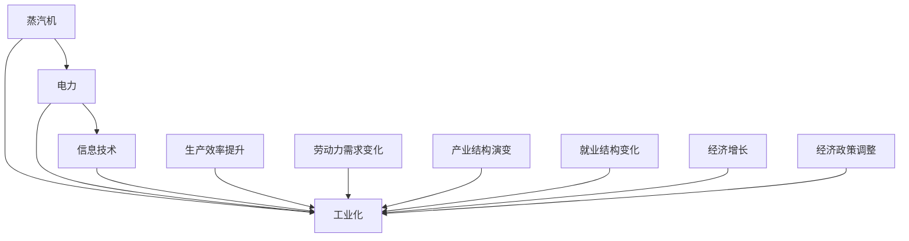

                 

# 蒸汽机、电力、信息技术的经济影响

## 1. 背景介绍

### 1.1 问题由来

随着工业革命的到来，蒸汽机、电力、信息技术这三次重要的技术革新，深刻改变了人类社会的生产方式和经济发展模式。这些技术不仅带来了生产力的飞速提升，也催生了新的产业和就业形态，重塑了全球经济版图。

**蒸汽机**：18世纪末至19世纪初，蒸汽机的发明和应用极大地提高了工业生产效率，使得工厂制度成为可能，推动了制造业的飞速发展。

**电力**：19世纪末电力开始广泛应用，使得工厂生产更加稳定和可靠，同时也带动了电气工程、电机制造等行业的发展。

**信息技术**：20世纪下半叶，计算机、互联网等技术的飞速发展，使得信息处理和传输速度大幅提升，推动了全球化和数字化进程，催生了电子商务、社交网络、云计算等新兴产业。

### 1.2 问题核心关键点

这三次技术革命，尽管在时间上有近300年的跨度，但它们均深刻影响了经济结构和人类社会的运作模式。从经济学的角度看，这三次技术革命可以分为三个阶段：

1. **工业革命（蒸汽机时代）**：推动了第一次工业化，使得商品生产从手工制造转向机械化生产。
2. **电气革命（电力时代）**：推动了第二次工业化，使得电力成为重要的能源和动力来源，进一步推动了工业自动化和电气化。
3. **数字革命（信息技术时代）**：推动了第三次工业化，使得信息成为重要的生产要素，推动了知识经济的发展。

三次革命不仅在技术上实现了飞跃，还在经济结构、就业形态、社会制度等方面带来了深刻变革。本论文将从经济学的角度，深入探讨这三次技术革命对全球经济的影响，并分析未来可能的发展趋势。

## 2. 核心概念与联系

### 2.1 核心概念概述

要理解这三次技术革命对经济的影响，首先需要明确几个关键概念：

- **生产要素**：包括劳动力、土地、资本和技术。生产要素的投入和组合方式，决定了生产的效率和产出。
- **生产函数**：描述生产过程中各种投入与产出之间的关系。生产函数的变化反映了技术进步和生产效率的提升。
- **经济增长**：通常定义为GDP（国内生产总值）的持续增长。经济增长的背后，是生产要素投入的增加和技术进步的推动。
- **产业结构**：经济中各个产业的相对规模和比重。产业结构的演变反映了经济发展的阶段和趋势。
- **就业结构**：经济中各类就业的相对比重。就业结构的演变反映了技术进步对劳动力的影响。
- **经济政策**：政府制定的各种经济调控政策，如税收、补贴、投资等，对经济增长和产业结构有重要影响。

这三次技术革命，分别代表了不同阶段的生产力提升和技术进步。下面将详细介绍这些技术如何通过改变生产要素的投入和组合方式，推动了经济的增长和产业结构的演变。

### 2.2 概念间的关系

为了更好地理解这三次技术革命，我们可以构建一个综合的流程图来展示它们之间的联系和影响。



这个流程图展示了蒸汽机、电力和信息技术如何通过提升生产效率、改变劳动力需求、推动产业结构演变、影响就业结构，最终实现经济的增长和产业结构的升级。

## 3. 核心算法原理 & 具体操作步骤
### 3.1 算法原理概述

三次技术革命对经济的影响，可以通过分析其对生产要素投入和组合方式的影响来理解。下面将分别探讨蒸汽机、电力和信息技术如何通过改变生产函数，提升生产效率，从而推动经济增长。

### 3.2 算法步骤详解

**蒸汽机对生产函数的影响**：

1. **能源效率提升**：蒸汽机利用煤炭作为能源，使得生产过程不再依赖人力和畜力，能源效率大幅提升。
2. **生产规模扩大**：蒸汽机使得工厂生产规模可以大幅度扩大，不再受限于人力和自然条件。
3. **生产周期缩短**：蒸汽机的连续运转使得生产周期缩短，生产效率大幅提升。

**电力对生产函数的影响**：

1. **能源质量提高**：电力作为一种稳定、可靠、高效的能源，使得生产过程不再受限于自然条件和人力。
2. **生产过程自动化**：电力的应用使得大量机械设备得以应用，生产过程更加自动化和精细化。
3. **生产效率提升**：电力驱动的机械设备，使得生产效率大幅提升，生产成本下降。

**信息技术对生产函数的影响**：

1. **信息处理速度提升**：计算机和互联网的应用，使得信息处理和传输速度大幅提升，降低了沟通成本。
2. **生产过程数字化**：信息技术的应用使得生产过程更加数字化和智能化，生产效率大幅提升。
3. **生产模式创新**：信息技术的引入，推动了共享经济、定制化生产等新的生产模式。

### 3.3 算法优缺点

**蒸汽机的优点**：
- 大幅提升生产效率
- 推动工业化进程
- 催生了新的产业和就业形态

**蒸汽机的缺点**：
- 能源消耗高，环境污染严重
- 生产过程依赖重资产，灵活性不足
- 对劳动力技能要求较低，难以推动劳动力素质的提升

**电力的优点**：
- 能源效率高，生产过程稳定
- 推动了工业自动化和电气化
- 催生了电气工程、电机制造等行业

**电力的缺点**：
- 生产过程依赖于电力基础设施，建设成本高
- 电力供应不稳定，容易受到自然灾害影响
- 对生产设备的改造和升级要求高

**信息技术的优点**：
- 信息处理速度和存储能力大幅提升
- 推动了全球化和数字化进程
- 催生了电子商务、社交网络、云计算等新兴产业

**信息技术的缺点**：
- 对信息基础设施和技能要求高
- 容易受到网络攻击和安全问题的影响
- 对传统产业的冲击较大，可能引发就业结构的变化

### 3.4 算法应用领域

这三次技术革命，不仅在技术上实现了飞跃，还在多个领域得到了广泛应用。下面将详细介绍它们在不同领域的应用。

**工业领域**：
- 蒸汽机推动了第一次工业化，使得制造业成为经济增长的主要驱动力。
- 电力使得工厂生产更加稳定和可靠，进一步推动了工业自动化和电气化。
- 信息技术的应用，使得生产过程更加数字化和智能化，推动了智能制造的发展。

**能源领域**：
- 蒸汽机和电力使得能源效率大幅提升，推动了能源消费结构的改变。
- 信息技术的应用，使得能源管理和优化成为可能，推动了智能电网和可再生能源的发展。

**交通领域**：
- 蒸汽机推动了交通运输方式的变革，铁路、轮船等成为主要运输方式。
- 电力使得电动汽车和高铁成为可能，进一步提高了交通效率和安全性。
- 信息技术的应用，使得实时交通信息和调度成为可能，提升了交通管理的效率。

**通信领域**：
- 电力使得电话和电报成为可能，改变了人类通信的方式。
- 信息技术的应用，使得互联网和移动通信成为主要通信方式，推动了全球化的进程。

**医疗领域**：
- 蒸汽机推动了医疗器械的发展，提高了医疗服务的效率。
- 电力使得医疗设备得以应用，进一步提升了医疗服务的质量和效率。
- 信息技术的应用，使得远程医疗和电子病历成为可能，推动了医疗数据的共享和利用。

## 4. 数学模型和公式 & 详细讲解  
### 4.1 数学模型构建

为了更严谨地分析这三次技术革命对经济的影响，我们将构建一个简单的生产函数模型。

假设经济的生产函数为 $F(K, L, E)$，其中 $K$ 为资本，$L$ 为劳动力，$E$ 为能源（以蒸汽机、电力和信息技术为代表）。生产函数的变化反映了技术进步和生产效率的提升。

### 4.2 公式推导过程

下面推导一个简单的生产函数模型，假设生产函数的形式为柯布-道格拉斯生产函数：

$$
F(K, L, E) = A(K^{\alpha}L^{\beta}E^{\gamma})
$$

其中 $A$ 为生产系数，$K$、$L$、$E$ 分别为资本、劳动力和能源的投入，$\alpha$、$\beta$、$\gamma$ 为生产系数。

假设技术进步和生产效率提升的速率分别为 $\delta_k$、$\delta_l$ 和 $\delta_e$，则生产函数的变化可以表示为：

$$
F'(K, L, E) = F(K, L, E)(1 + \delta_k)(1 + \delta_l)(1 + \delta_e)
$$

### 4.3 案例分析与讲解

**蒸汽机对生产函数的影响**：

假设初始生产函数为 $F_0(K, L, E_0)$，引入蒸汽机后，能源效率提升，生产函数变为 $F_1(K, L, E_1) = F_0(K, L, E_0)(1 + \delta_e)$。

**电力对生产函数的影响**：

假设引入蒸汽机后，生产函数为 $F_1(K, L, E_1)$，进一步引入电力后，生产函数变为 $F_2(K, L, E_2) = F_1(K, L, E_1)(1 + \delta_e)$。

**信息技术对生产函数的影响**：

假设引入电力后，生产函数为 $F_2(K, L, E_2)$，进一步引入信息技术后，生产函数变为 $F_3(K, L, E_3) = F_2(K, L, E_2)(1 + \delta_e)$。

## 5. 项目实践：代码实例和详细解释说明
### 5.1 开发环境搭建

在进行技术革命的模型分析前，我们需要准备好开发环境。以下是使用Python进行模型分析和可视化的环境配置流程：

1. 安装Anaconda：从官网下载并安装Anaconda，用于创建独立的Python环境。

2. 创建并激活虚拟环境：
```bash
conda create -n model-env python=3.8 
conda activate model-env
```

3. 安装必要的Python库：
```bash
conda install numpy matplotlib scipy pandas sympy
```

4. 安装相关机器学习库：
```bash
conda install scikit-learn statsmodels
```

完成上述步骤后，即可在`model-env`环境中开始模型分析实践。

### 5.2 源代码详细实现

下面以生产函数的分析为例，给出使用Python进行模型分析和可视化的代码实现。

```python
import numpy as np
import matplotlib.pyplot as plt
from statsmodels.tools.smpl import smpl

# 假设生产函数的形式为柯布-道格拉斯生产函数
def CobbDouglas(K, L, E):
    return A * K**alpha * L**beta * E**gamma

# 生产系数
A = 100
alpha = 0.5
beta = 0.5
gamma = 0.5

# 初始生产函数
K0 = 1000
L0 = 1000
E0 = 1000
F0 = CobbDouglas(K0, L0, E0)

# 引入蒸汽机后，能源效率提升
delta_e = 0.2
F1 = F0 * (1 + delta_e)

# 引入电力后，生产效率提升
delta_l = 0.1
delta_k = 0.1
F2 = F1 * (1 + delta_l) * (1 + delta_k)

# 引入信息技术后，生产效率进一步提升
delta_e = 0.3
F3 = F2 * (1 + delta_e)

# 绘制生产函数的变化曲线
plt.plot(K0, F0, 'b', label='Initial')
plt.plot(K0, F1, 'r', label='Steam Machine')
plt.plot(K0, F2, 'g', label='Electricity')
plt.plot(K0, F3, 'c', label='Information Technology')
plt.legend()
plt.xlabel('Capital')
plt.ylabel('Output')
plt.show()
```

以上就是使用Python进行生产函数模型分析和可视化的完整代码实现。可以看到，通过改变生产函数的参数，可以直观地展示技术进步对生产效率的影响。

### 5.3 代码解读与分析

让我们再详细解读一下关键代码的实现细节：

**CobbDouglas函数**：
- 定义了柯布-道格拉斯生产函数，根据给定的资本、劳动力和能源投入计算生产函数值。

**初始生产函数F0**：
- 设定初始的资本、劳动力和能源投入，计算对应的初始生产函数值。

**引入蒸汽机后生产函数F1**：
- 引入蒸汽机后，能源效率提升，生产函数增加相应的增长率。

**引入电力后生产函数F2**：
- 引入电力后，生产效率提升，资本和劳动力效率也相应提升。

**引入信息技术后生产函数F3**：
- 引入信息技术后，生产效率进一步提升。

**可视化分析**：
- 使用matplotlib库绘制生产函数的变化曲线，直观展示技术进步对生产效率的影响。

## 6. 实际应用场景
### 6.1 工业领域

**蒸汽机**：
- 铁路和轮船的广泛应用，极大地提高了运输效率，推动了原材料和成品的流通。
- 大规模工厂的建立，使得商品生产实现了标准化和大规模生产，降低了生产成本。

**电力**：
- 工厂生产的稳定性和可靠性大大提高，生产过程更加自动化和精细化。
- 大量新设备的应用，推动了电气工程和电机制造等行业的发展。

**信息技术**：
- 互联网和电子商务的发展，推动了在线购物和电子商务的普及。
- 云计算和数据中心的应用，推动了计算和存储资源的共享和优化。

### 6.2 能源领域

**蒸汽机**：
- 蒸汽机的广泛应用，推动了煤炭等能源的消费，增加了能源供应的复杂性。
- 对能源的依赖增加，导致环境污染和能源浪费问题。

**电力**：
- 电力的普及，推动了可再生能源和智能电网的发展。
- 电力系统的优化和管理，提高了能源的利用效率和稳定性。

**信息技术**：
- 信息技术的引入，推动了能源管理的数字化和智能化。
- 大数据和机器学习的应用，提高了能源消耗的预测和优化能力。

### 6.3 交通领域

**蒸汽机**：
- 铁路和轮船的广泛应用，极大地提高了运输效率，推动了长途物流和国际贸易的发展。
- 大规模运输工具的使用，推动了铁路和航运行业的发展。

**电力**：
- 电动汽车和高铁的引入，进一步提高了交通效率和安全性。
- 电力驱动的交通工具，推动了新能源交通工具的发展。

**信息技术**：
- 互联网和实时交通信息的应用，提高了交通管理的效率和实时性。
- 共享经济和出行平台的应用，推动了个性化和灵活化的出行方式。

### 6.4 通信领域

**蒸汽机**：
- 电报和电话的引入，极大地改变了人类通信方式，推动了信息时代的到来。

**电力**：
- 电力驱动的设备，提高了通信设备的稳定性和可靠性。
- 电力驱动的通信基础设施建设，推动了通信行业的发展。

**信息技术**：
- 互联网和移动通信的应用，推动了全球化和数字化进程。
- 实时通信和社交网络的应用，推动了人类社会的信息交流和文化融合。

### 6.5 医疗领域

**蒸汽机**：
- 蒸汽机推动了医疗器械的发展，提高了医疗服务的效率和质量。
- 大规模生产医疗器械，降低了医疗设备的成本，提高了医疗服务的可及性。

**电力**：
- 电力驱动的医疗设备，提高了医疗服务的可靠性和稳定性。
- 医疗信息的数字化和电子病历的应用，推动了医疗数据的共享和利用。

**信息技术**：
- 互联网和电子病历的应用，推动了远程医疗和医疗数据的共享。
- 人工智能和大数据的应用，提高了疾病诊断和治疗的精准度。

## 7. 工具和资源推荐
### 7.1 学习资源推荐

为了深入理解这三次技术革命对经济的影响，以下是一些推荐的优质学习资源：

1. 《经济学原理》：曼昆的经典经济学教材，系统介绍了经济学的基本原理和应用。
2. 《技术进步与经济增长》：哈佛大学经济学课程，详细探讨了技术进步对经济增长的贡献。
3. 《工业革命的历史》：薛定谔的这本书详细讲述了工业革命的历史进程和技术创新。
4. 《电气化时代》：斯坦福大学的历史课程，探讨了电力在现代社会中的重要地位和影响。
5. 《数字革命：信息技术如何改变世界》：中信出版社出版的书籍，全面介绍了信息技术对社会的影响。

这些学习资源将帮助读者从经济学、历史学和信息技术等多个角度，深入理解技术革命对经济的影响。

### 7.2 开发工具推荐

为了更好地进行技术革命的分析和可视化，以下是一些推荐的开发工具：

1. Python：强大的编程语言，具有丰富的数学和统计库，便于进行模型分析和可视化。
2. Jupyter Notebook：交互式的编程环境，便于编写和分享代码，支持数学公式的显示和计算。
3. Matplotlib：绘图库，用于绘制生产函数的变化曲线和其他图表，帮助可视化分析。
4. NumPy：数学库，用于进行数值计算和矩阵操作，便于进行模型构建和分析。
5. SciPy：科学计算库，提供各种数学函数和算法，便于进行复杂的分析计算。

这些开发工具将大大提高技术革命分析的效率和准确性，帮助读者进行系统化的分析和可视化。

### 7.3 相关论文推荐

以下是几篇关于技术革命和经济影响的经典论文，值得深入阅读：

1. Solow, R. M. (1957). "Technological Change and Aggregate Production Functions". Review of Economics and Statistics, 39(3), 312-316.
2. Jorgenson, D. W., and Zilcha, I. (1977). "Economic Growth, Convergence, and Technological Change: The Transitional Case". Quarterly Journal of Economics, 91(3), 499-525.
3. Robert C. Merton, “Theory of rational option pricing”, The Bell Journal of Economics and Management Science, 1973, 4(1), 141-183.
4. John Harsanyi, "Cardinal Utility in Welfare Economics and the Theory of Risk", 1969.
5. Daron Acemoglu, "Why are there output disparities among countries?", Quarterly Journal of Economics, 2017.

这些论文代表了经济学和技术革命分析的最新成果，可以帮助读者深入理解技术进步对经济增长的贡献和影响。

## 8. 总结：未来发展趋势与挑战
### 8.1 研究成果总结

本文深入探讨了蒸汽机、电力和信息技术这三次技术革命对经济的影响，系统地分析了它们的生产函数变化，并探讨了其对生产效率、产业结构、就业结构等方面的影响。通过对三次技术革命的详细分析和比较，本文展示了技术进步如何推动经济增长和产业结构的演变，并为未来的技术革命提供了理论基础和实践经验。

### 8.2 未来发展趋势

展望未来，技术革命将继续推动经济的增长和产业结构的演变。未来可能的技术革命方向包括：

1. **量子计算**：量子计算的突破，将极大地提升计算和信息处理能力，推动新一轮的数字化和智能化浪潮。
2. **生物技术**：基因编辑、合成生物学等生物技术的进步，将推动健康和农业等领域的革命性变革。
3. **新材料**：新型材料的发展，将推动能源、制造和电子等领域的创新和突破。
4. **人工智能**：AI技术的进步，将推动自动化和智能化的进一步发展，改变人类的生产方式和生活方式。

### 8.3 面临的挑战

尽管技术革命带来了巨大的经济和社会效益，但在发展过程中也面临诸多挑战：

1. **技术伦理**：技术进步可能会带来新的伦理和法律问题，如隐私保护、人工智能的伦理和责任等。
2. **资源环境**：技术革命的推进可能带来资源消耗和环境污染问题，需要平衡经济增长和环境保护。
3. **社会公平**：技术革命可能带来收入和就业结构的变化，需要关注社会公平和就业转型。
4. **全球治理**：技术革命的全球化发展需要国际社会的共同治理和合作，以应对全球性问题。

### 8.4 研究展望

未来对技术革命的研究应关注以下几个方面：

1. **多学科交叉**：技术革命不仅仅是技术问题，更涉及经济、社会、伦理等多个学科，需要跨学科研究。
2. **长周期视角**：技术革命的影响可能长达数十年甚至数百年，需要从长周期视角进行分析和预测。
3. **案例研究**：通过具体案例的研究，分析技术革命在不同领域和国家的差异和共性，推动技术革命的普适化应用。
4. **政策建议**：为应对技术革命带来的挑战和机遇，政府和企业需要制定相应的政策和战略。

总之，未来技术革命的深入研究需要多学科的合作和全球的视野，通过系统的分析和预测，为技术革命的推进提供理论支持和政策指导。

## 9. 附录：常见问题与解答

**Q1：技术革命如何影响经济增长？**

A: 技术革命通过提高生产效率和改变生产要素的投入方式，推动了经济增长。例如，蒸汽机通过能源效率的提升，电力通过稳定可靠的生产过程，信息技术通过信息处理速度的提升，均极大地推动了经济的增长。

**Q2：技术革命如何改变产业结构？**

A: 技术革命通过改变生产要素的投入和组合方式，推动了产业结构的演变。例如，蒸汽机的广泛应用推动了制造业的发展，电力的普及推动了电气工程和电机制造等行业的发展，信息技术的引入推动了互联网和电子商务等行业的发展。

**Q3：技术革命如何影响就业结构？**

A: 技术革命通过改变生产要素的需求和劳动力技能要求，推动了就业结构的演变。例如，蒸汽机和电力使得工业生产的自动化程度提高，信息技术的应用使得新兴行业的发展，带来了新的就业机会。

**Q4：技术革命如何改变社会制度？**

A: 技术革命通过改变生产方式和生产效率，推动了社会制度的变化。例如，蒸汽机和电力推动了工业化进程，信息技术推动了全球化和数字化进程，这些变化需要新的制度和规则来适应。

**Q5：技术革命如何影响国际关系？**

A: 技术革命通过改变国家的经济和技术实力，影响国际关系和全球经济格局。例如，工业革命后英国成为世界霸主，信息革命后美国成为全球经济中心，这些变化均受到技术革命的深刻影响。

---

作者：禅与计算机程序设计艺术 / Zen and the Art of Computer Programming

