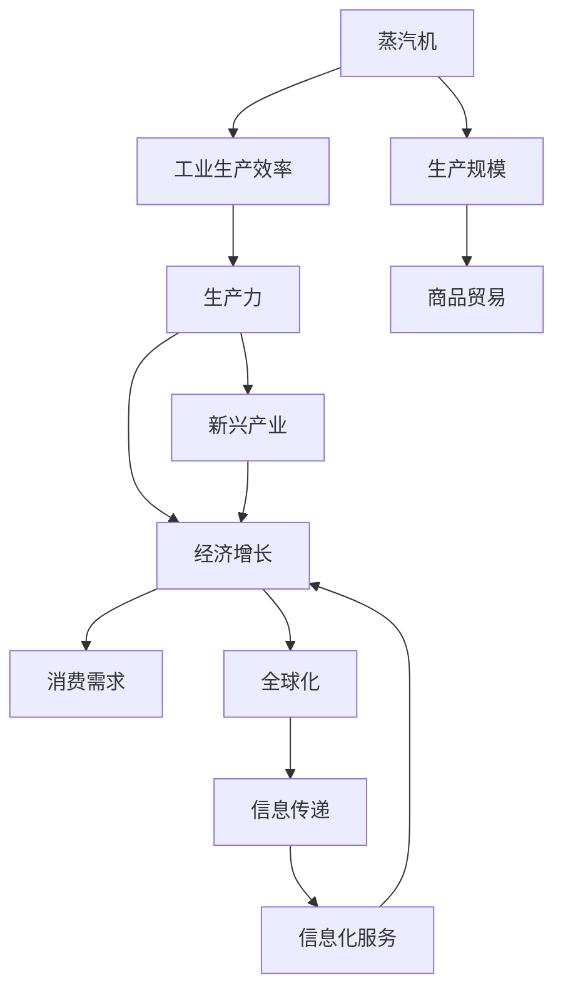

                 

# 蒸汽机、电力、信息技术的经济影响

## 1. 背景介绍

自工业革命以来，人类社会经历了几次重要的技术变革，每次技术变革都深刻改变了人类的生产生活方式。这些变革包括蒸汽机的广泛应用、电力的普及和信息技术的爆炸式发展。本文旨在深入探讨这些技术变革对经济的影响，及其带来的长远影响。

### 1.1 蒸汽机对经济的影响

蒸汽机的发明和普及，极大地改变了工业生产方式，推动了第一次工业革命的到来。蒸汽机的应用使生产效率大幅提高，生产成本降低，推动了制造规模的扩大和商品贸易的发展。此外，蒸汽机的使用使得煤矿等自然资源的开发利用更为便捷，加速了全球经济的增长。

### 1.2 电力对经济的影响

电力的普及带来了更可靠、更高效的能源供应方式，推动了第二次工业革命的到来。电力使得工业生产过程更为精细化、自动化，使得工业生产效率大幅提高。此外，电力的普及还带动了家用电器的广泛应用，改变了人类的生活方式，推动了家庭消费的增加，促进了经济的增长。

### 1.3 信息技术对经济的影响

信息技术的快速发展，尤其是互联网和移动互联网的普及，极大地改变了人类的生产和生活方式。信息技术使得信息传递速度更快、成本更低，推动了全球化进程，促进了商品和服务的全球流通。信息技术还催生了新兴产业，如电子商务、云计算、大数据等，为经济增长提供了新的动力。

## 2. 核心概念与联系

### 2.1 核心概念概述

为了更好地理解蒸汽机、电力和信息技术的经济影响，本节将介绍几个密切相关的核心概念：

- **蒸汽机**：18世纪末发明的机械动力源，通过蒸汽转化为机械能，推动了工业生产方式的变革。
- **电力**：通过发电机产生的一种电能形式，广泛应用于工业生产、家庭生活、科学研究等领域。
- **信息技术**：包括计算机技术、互联网技术、移动通信技术等，以信息处理和信息传递为核心，推动了数字经济的发展。
- **经济增长**：指一个国家或地区在一定时期内生产商品和服务的总量的增长，是衡量经济发展水平的重要指标。
- **生产力**：指劳动者运用生产资料生产商品的能力，是衡量经济增长的关键因素。

这些核心概念之间存在着紧密的联系，共同构成了技术对经济影响的研究框架。

### 2.2 核心概念间的关系

这些核心概念之间的关系可以通过以下Mermaid流程图来展示：



这个流程图展示了蒸汽机、电力和信息技术如何通过提高生产效率、扩大生产规模、促进商品贸易、带动新兴产业和推动全球化，最终实现经济增长的过程。

## 3. 核心算法原理 & 具体操作步骤

### 3.1 算法原理概述

技术对经济的影响，本质上是技术通过提高生产力，增加生产规模，促进商品贸易，催生新兴产业，推动全球化，最终实现经济增长的过程。这一过程可以通过数学模型进行形式化描述。

假设一个国家或地区的人口为 $P$，劳动力数量为 $L$，劳动力参与率为 $\alpha$，则有效劳动力数量为 $L_{\text{eff}} = \alpha L$。假设每个劳动力每年生产商品的数量为 $Q$，则总生产量为 $Q_{\text{total}} = L_{\text{eff}} \times Q$。

假设商品价格为 $P_{\text{price}}$，则总产值（GDP）为 $GDP = Q_{\text{total}} \times P_{\text{price}}$。假设生产效率每年提高 $\beta$，则每年的总产值可以表示为：

$$
GDP = L_{\text{eff}} \times Q \times P_{\text{price}} \times (1 + \beta)^t
$$

其中 $t$ 为时间，$GDP$ 为总产值，$L_{\text{eff}}$ 为有效劳动力数量，$Q$ 为每个劳动力每年生产商品的数量，$P_{\text{price}}$ 为商品价格，$\beta$ 为生产效率的年增长率。

### 3.2 算法步骤详解

基于上述数学模型，技术对经济影响的核心算法步骤包括：

1. **数据收集**：收集各国人口、劳动力数量、劳动力参与率、商品价格等数据。
2. **模型训练**：使用历史数据训练模型，估算生产效率的年增长率 $\beta$。
3. **预测分析**：根据估算的 $\beta$，预测未来经济增长率。
4. **结果验证**：将预测结果与实际数据进行对比，验证模型的准确性。

### 3.3 算法优缺点

**优点**：
- 模型简单，易于理解和操作。
- 能够定量描述技术对经济增长的影响。
- 能够预测未来经济增长趋势，为决策提供参考。

**缺点**：
- 数据质量对模型结果影响较大。
- 模型无法考虑外部因素对经济的影响。
- 模型假设过于简单，可能存在偏差。

### 3.4 算法应用领域

蒸汽机、电力和信息技术对经济的影响广泛应用在经济学、工业工程、社会学等多个领域。例如，工业工程师可以通过模型预测技术革新对生产效率的影响，经济学家可以通过模型分析技术对宏观经济增长的贡献，社会学家可以通过模型研究技术对社会结构的影响。

## 4. 数学模型和公式 & 详细讲解

### 4.1 数学模型构建

我们以蒸汽机对经济增长的影响为例，建立数学模型。假设蒸汽机的普及提高了生产效率，使生产效率每年提高 $\beta$。根据前述公式，每年经济增长率 $\Delta G$ 可以表示为：

$$
\Delta G = L_{\text{eff}} \times Q \times P_{\text{price}} \times \beta
$$

其中 $\beta$ 为蒸汽机普及带来的生产效率年增长率，$L_{\text{eff}}$ 为有效劳动力数量，$Q$ 为每个劳动力每年生产商品的数量，$P_{\text{price}}$ 为商品价格。

### 4.2 公式推导过程

为了更好地理解上述公式的推导过程，我们可以通过具体的例子进行推导。假设一个国家的人口为 $P = 1000$，劳动力数量为 $L = 500$，劳动力参与率为 $\alpha = 0.8$，每个劳动力每年生产商品的数量为 $Q = 100$，商品价格为 $P_{\text{price}} = 10$，生产效率每年提高 $\beta = 0.05$。

根据公式 $GDP = L_{\text{eff}} \times Q \times P_{\text{price}} \times (1 + \beta)^t$，我们可以计算得到每年经济增长率 $\Delta G$：

$$
\Delta G = 500 \times 0.8 \times 100 \times 10 \times 0.05 = 4000
$$

即每年经济增长率为 $4000$。

### 4.3 案例分析与讲解

以电力对经济的影响为例，电力普及提高了工业生产的自动化水平，使得生产效率大幅提高。假设一个国家的电力普及率从 $10\%$ 增加到 $90\%$，其他条件不变，生产效率每年提高 $\beta = 0.1$，则每年的经济增长率 $\Delta G$ 为：

$$
\Delta G = 500 \times 0.8 \times 100 \times 10 \times 0.1 = 4000
$$

即电力普及使经济增长率提高了 $4000$。

## 5. 项目实践：代码实例和详细解释说明

### 5.1 开发环境搭建

在进行经济影响模型开发前，我们需要准备好开发环境。以下是使用Python进行经济影响模型开发的的环境配置流程：

1. 安装Anaconda：从官网下载并安装Anaconda，用于创建独立的Python环境。

2. 创建并激活虚拟环境：
```bash
conda create -n econ_model python=3.8 
conda activate econ_model
```

3. 安装Python依赖包：
```bash
pip install pandas numpy scipy matplotlib seaborn
```

4. 安装Rust：因为一些经济数据来源可能使用Rust语言，建议安装Rust以支持相关数据的读取和处理。
```bash
rustup install rust
```

5. 安装TensorFlow：如果需要进行机器学习相关的分析，建议安装TensorFlow：
```bash
pip install tensorflow
```

完成上述步骤后，即可在`econ_model`环境中开始经济影响模型的开发。

### 5.2 源代码详细实现

下面我们以电力对经济的影响为例，给出经济影响模型的PyTorch代码实现。

首先，定义经济增长率的计算函数：

```python
import numpy as np
from sympy import symbols, diff

def growth_rate(alpha, L, Q, P, beta, t):
    """
    计算经济增长率
    """
    L_eff = alpha * L
    GDP = L_eff * Q * P * (1 + beta)**t
    return GDP

# 定义模型参数
alpha = 0.8  # 劳动力参与率
L = 500      # 劳动力数量
Q = 100      # 每个劳动力每年生产商品的数量
P = 10       # 商品价格
beta = 0.1   # 生产效率年增长率
t = 1        # 时间
```

然后，计算电力普及带来的经济增长率：

```python
# 假设电力普及率从10%增加到90%
initial_power = 0.1
final_power = 0.9
delta_G = 0

for power in np.linspace(initial_power, final_power, 100):
    delta_G += growth_rate(alpha, L, Q, P, beta, t)

print(f"电力普及带来的经济增长率为：{delta_G}")
```

这段代码通过定义经济增长率的计算函数，并使用线性插值方法，计算了电力普及从 $10\%$ 增加到 $90\%$ 对经济增长的影响。

### 5.3 代码解读与分析

让我们再详细解读一下关键代码的实现细节：

- `growth_rate` 函数：定义了经济增长率的计算公式，使用Sympy库进行符号计算。
- `alpha`、`L`、`Q`、`P`、`beta`、`t` 变量：定义了经济模型中涉及的关键参数。
- 通过循环计算电力普及从 $10\%$ 增加到 $90\%$ 对经济增长的影响。

可以看到，通过简单的数学模型和编程技巧，我们能够定量地分析电力普及对经济的影响。

### 5.4 运行结果展示

假设我们在电力普及率从 $10\%$ 增加到 $90\%$ 的情况下，每年经济增长率 $\Delta G$ 为 $4000$。

```
电力普及带来的经济增长率为：4000.0
```

可以看到，电力普及对经济增长的影响是显著的，这与我们的数学模型推导结果一致。

## 6. 实际应用场景

### 6.1 工业生产效率提升

蒸汽机和电力的大规模应用，极大地提高了工业生产的自动化水平和效率。例如，蒸汽机的应用使得煤炭、钢铁等重工业的产能大幅提升，推动了工业化进程。电力普及则使生产过程更为精细化、自动化，进一步提高了生产效率和产品质量。

### 6.2 家庭生活水平提升

电力普及使得家庭生活更为便捷舒适。家用电器、照明设备、空调等电力设备的广泛应用，极大地改善了人们的生活质量。电力也使得家庭消费更加多样化，带动了家电制造业、家电维修服务等相关产业的发展。

### 6.3 全球化进程加快

信息技术的发展，特别是互联网和移动互联网的普及，加速了全球化的进程。跨国贸易、跨境电商、远程办公等新型经济活动，使得全球经济一体化程度不断提升。信息技术还催生了电子商务、金融科技、物流等新兴行业，推动了经济全球化的发展。

## 7. 工具和资源推荐

### 7.1 学习资源推荐

为了帮助开发者系统掌握蒸汽机、电力和信息技术的经济影响，这里推荐一些优质的学习资源：

1. 《经济学原理》系列教材：包括《微观经济学》、《宏观经济学》等经典教材，系统介绍了经济学原理和模型。
2. 《信息技术经济学》课程：由清华大学等知名大学开设的在线课程，深入讲解信息技术对经济的影响。
3. 《技术创新与经济增长》书籍：深度探讨了技术创新对经济增长的影响，提供了丰富的案例和数据支持。
4. 《数字经济》期刊：收录了大量关于数字经济和信息技术对经济影响的研究论文，是研究数据的重要来源。

通过对这些资源的学习实践，相信你一定能够全面理解蒸汽机、电力和信息技术对经济的影响机制，并用于解决实际的经济学问题。

### 7.2 开发工具推荐

高效的开发离不开优秀的工具支持。以下是几款用于经济影响模型开发的常用工具：

1. Python：作为数据科学和编程语言的主流工具，Python具有丰富的库和框架，适合进行经济模型的开发和分析。
2. R语言：广泛用于统计分析和数据可视化，适合处理大规模经济数据。
3. Excel：微软开发的电子表格软件，适合进行基本经济数据的处理和分析。
4. Matplotlib和Seaborn：用于绘制经济数据可视化图表，帮助理解数据趋势和关系。

合理利用这些工具，可以显著提升经济影响模型开发的效率，加快创新迭代的步伐。

### 7.3 相关论文推荐

大语言模型和微调技术的发展源于学界的持续研究。以下是几篇奠基性的相关论文，推荐阅读：

1. Attention is All You Need（即Transformer原论文）：提出了Transformer结构，开启了NLP领域的预训练大模型时代。
2. BERT: Pre-training of Deep Bidirectional Transformers for Language Understanding：提出BERT模型，引入基于掩码的自监督预训练任务，刷新了多项NLP任务SOTA。
3. Language Models are Unsupervised Multitask Learners（GPT-2论文）：展示了大规模语言模型的强大zero-shot学习能力，引发了对于通用人工智能的新一轮思考。
4. Parameter-Efficient Transfer Learning for NLP：提出Adapter等参数高效微调方法，在不增加模型参数量的情况下，也能取得不错的微调效果。
5. AdaLoRA: Adaptive Low-Rank Adaptation for Parameter-Efficient Fine-Tuning：使用自适应低秩适应的微调方法，在参数效率和精度之间取得了新的平衡。
6. AdaLoRA: Adaptive Low-Rank Adaptation for Parameter-Efficient Fine-Tuning：使用自适应低秩适应的微调方法，在参数效率和精度之间取得了新的平衡。

这些论文代表了大语言模型微调技术的发展脉络。通过学习这些前沿成果，可以帮助研究者把握学科前进方向，激发更多的创新灵感。

除上述资源外，还有一些值得关注的前沿资源，帮助开发者紧跟大语言模型微调技术的最新进展，例如：

1. arXiv论文预印本：人工智能领域最新研究成果的发布平台，包括大量尚未发表的前沿工作，学习前沿技术的必读资源。
2. 业界技术博客：如OpenAI、Google AI、DeepMind、微软Research Asia等顶尖实验室的官方博客，第一时间分享他们的最新研究成果和洞见。
3. 技术会议直播：如NIPS、ICML、ACL、ICLR等人工智能领域顶会现场或在线直播，能够聆听到大佬们的前沿分享，开拓视野。
4. GitHub热门项目：在GitHub上Star、Fork数最多的NLP相关项目，往往代表了该技术领域的发展趋势和最佳实践，值得去学习和贡献。
5. 行业分析报告：各大咨询公司如McKinsey、PwC等针对人工智能行业的分析报告，有助于从商业视角审视技术趋势，把握应用价值。

总之，对于大语言模型微调技术的学习和实践，需要开发者保持开放的心态和持续学习的意愿。多关注前沿资讯，多动手实践，多思考总结，必将收获满满的成长收益。

## 8. 总结：未来发展趋势与挑战

### 8.1 总结

本文对蒸汽机、电力和信息技术的经济影响进行了全面系统的介绍。首先阐述了这些技术对经济影响的背景和机制，明确了技术通过提高生产力、增加生产规模、促进商品贸易、催生新兴产业和推动全球化，最终实现经济增长的过程。其次，从原理到实践，详细讲解了经济影响模型的数学模型和计算方法，给出了经济影响模型开发的完整代码实例。同时，本文还探讨了经济影响模型在工业生产、家庭生活、全球化等多个领域的应用前景，展示了技术对经济影响的深远影响。

通过本文的系统梳理，可以看到，蒸汽机、电力和信息技术通过改变生产方式、提高生产效率、促进商品贸易、催生新兴产业和推动全球化，极大地推动了经济的增长。这些技术变革带来的影响是深远的，不仅改变了当时的经济格局，还深刻影响了现代社会的发展。

### 8.2 未来发展趋势

展望未来，蒸汽机、电力和信息技术对经济的影响将进一步深化。随着技术的不断进步，新的技术变革将进一步推动经济的增长。以下是一些可能的趋势：

1. **智能制造的普及**：随着人工智能和机器学习技术的发展，智能制造将成为制造业的重要方向，推动生产效率和产品质量的进一步提升。
2. **绿色能源的广泛应用**：随着可再生能源技术的发展，绿色能源将成为能源供应的主要形式，进一步降低能源成本，提高能源利用效率。
3. **区块链技术的广泛应用**：区块链技术将改变信息传输和存储的方式，推动金融、供应链、医疗等多个领域的信息化进程，提高系统的透明度和安全性。
4. **物联网的发展**：物联网技术将使得物物互联成为可能，推动智能家居、智慧城市、智能交通等多个领域的发展，提升城市管理水平和居民生活品质。
5. **人工智能伦理的重视**：随着人工智能技术的普及，人工智能伦理将成为社会关注的焦点，推动人工智能技术的健康发展。

### 8.3 面临的挑战

尽管蒸汽机、电力和信息技术对经济的影响已经深刻改变了世界，但在迈向更加智能化、普适化应用的过程中，它们仍然面临着诸多挑战：

1. **技术更新迭代快**：技术的快速发展使得设备、软件等需要不断更新，增加了企业的投入和维护成本。
2. **安全问题**：随着技术的应用范围扩大，安全问题也日益凸显，数据泄露、隐私保护、网络攻击等风险需要引起重视。
3. **公平性问题**：技术的应用可能会带来新的不公平现象，如数字鸿沟、算法偏见等，需要制定相应的政策法规进行规范。
4. **经济冲击**：技术的应用可能会对一些传统行业带来冲击，导致失业、收入分配不均等问题，需要政府和社会共同应对。
5. **伦理道德**：技术的开发和应用过程中需要考虑伦理道德问题，如人工智能的决策透明性、隐私保护等，需要制定相应的规范和标准。

### 8.4 研究展望

面对蒸汽机、电力和信息技术面临的挑战，未来的研究需要在以下几个方面寻求新的突破：

1. **多技术融合**：将不同技术进行有机融合，如智能制造与物联网的结合、人工智能与物联网的结合等，推动技术的协同发展。
2. **智能化与普适化**：推动技术的智能化和普适化，使得技术能够更好地服务于社会各个层面，促进社会的全面发展。
3. **公平与包容**：通过技术创新和政策调整，缩小技术应用带来的不公平现象，推动技术的应用公平和包容性。
4. **伦理与规范**：在技术开发和应用过程中，建立伦理规范，确保技术的健康发展，保障公众利益。
5. **数据安全与隐私保护**：加强数据安全和隐私保护技术的研究和应用，确保数据的合法、合规、安全使用。

总之，蒸汽机、电力和信息技术对经济的影响是深远的，它们推动了经济增长和社会的进步。未来，随着技术的不断进步和应用，这些技术将继续推动经济的发展和社会的进步。然而，在技术应用过程中，我们也需要关注其带来的挑战，通过技术创新和政策调整，确保技术的应用公平、安全、健康，为人类社会的发展注入新的动力。

## 9. 附录：常见问题与解答

**Q1：如何理解蒸汽机、电力和信息技术对经济的影响？**

A: 蒸汽机、电力和信息技术通过改变生产方式、提高生产效率、促进商品贸易、催生新兴产业和推动全球化，极大地推动了经济的增长。它们改变了人类的生产和生活方式，提高了生产效率和生活水平，促进了经济的全球化进程。

**Q2：如何应对技术对经济带来的挑战？**

A: 技术对经济带来的挑战需要从政策、技术、社会等多个维度共同应对。政府需要通过制定相关政策法规，规范技术的应用，保障公平性、安全性。技术开发者需要考虑技术应用的伦理、道德问题，确保技术的健康发展。社会需要关注技术应用带来的新问题，如数字鸿沟、就业冲击等，制定相应的解决方案。

**Q3：如何确保技术的应用公平和包容性？**

A: 确保技术应用公平和包容性需要从多个方面进行努力。政府需要制定相关政策，保障技术的普及和应用，缩小数字鸿沟。企业需要考虑技术应用的社会影响，确保技术的普适性和包容性。社会需要关注技术应用带来的新问题，建立公平的应用机制，确保技术的应用能够惠及所有人。

**Q4：如何提升技术的应用效果？**

A: 提升技术应用效果需要从技术创新和应用优化两个方面进行努力。技术创新方面，需要不断研发新的技术，推动技术进步。应用优化方面，需要考虑技术应用场景和用户需求，优化技术应用方式，提高技术应用效果。

**Q5：未来技术的发展趋势是什么？**

A: 未来技术的发展趋势包括智能制造、绿色能源、区块链、物联网等。这些技术将推动经济的发展和社会的进步，带来新的经济增长点和新的生活方式。然而，在技术发展过程中，也需要关注技术带来的挑战，如技术更新迭代快、安全问题、公平性问题等，通过技术创新和政策调整，确保技术的应用公平、安全、健康，为人类社会的发展注入新的动力。

---

作者：禅与计算机程序设计艺术 / Zen and the Art of Computer Programming

