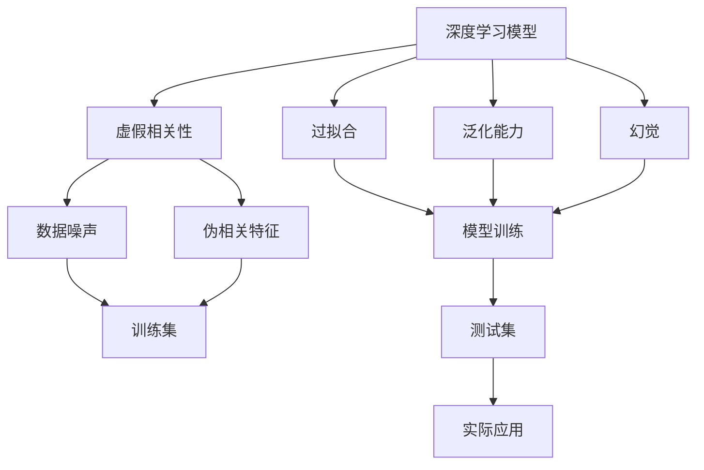
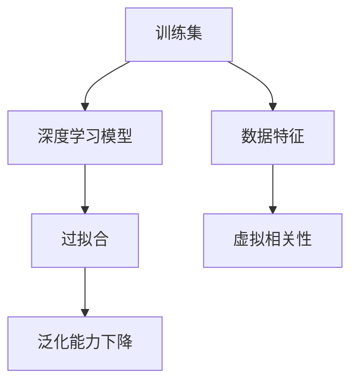
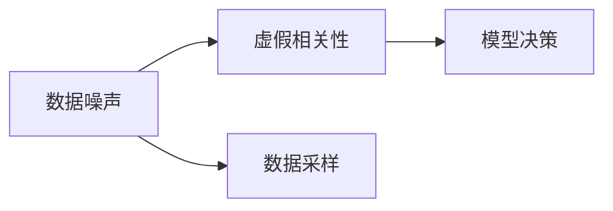
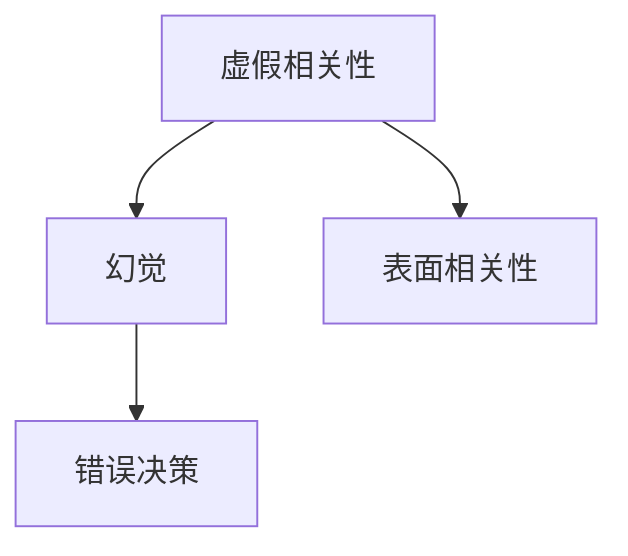
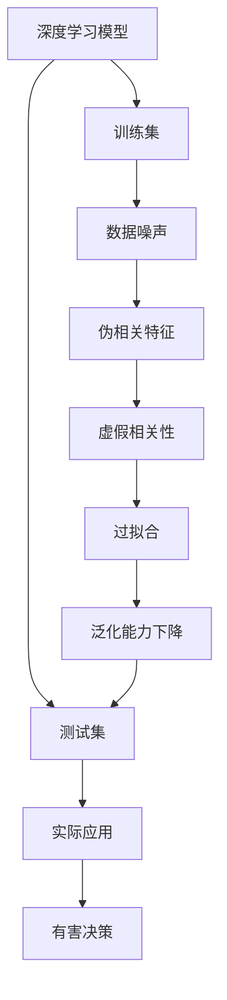

                 

## 1. 背景介绍

### 1.1 问题由来
人工智能的发展已经进入了一个新的阶段，深度学习技术的应用日渐广泛，特别是在自然语言处理(Natural Language Processing, NLP)领域，基于大模型的方法在多项任务上取得了突破性进展。然而，在这些成就背后，我们却忽略了深度学习模型固有的“虚假相关性”问题，这不仅影响到模型的泛化能力，更可能引发模型决策的“幻觉”，给实际应用带来严重风险。

### 1.2 问题核心关键点
深度学习模型之所以具有“虚假相关性”，是因为它们在训练过程中过度拟合了数据集中的噪声和伪相关特征，而非真正的因果关系。特别是在NLP领域，大规模预训练模型往往会在训练集上学习到一些表面上的相关性，但这种相关性可能是由语义、语法上的相似性而非真正的语义逻辑驱动的。模型在这种“幻觉”下进行预测和决策，很可能会造成错误判断，导致有害的决策输出。

### 1.3 问题研究意义
研究深度学习模型中的虚假相关性问题，对于提升模型的泛化能力和决策质量，增强系统的鲁棒性和可靠性，具有重要的理论意义和实践价值。通过对模型的内部运作机制进行深入剖析，可以帮助我们更好地理解模型的决策过程，从而在实际应用中避免潜在的风险和误差。

## 2. 核心概念与联系

### 2.1 核心概念概述

为更好地理解深度学习模型中的虚假相关性问题，本节将介绍几个密切相关的核心概念：

- 深度学习模型（Deep Learning Model）：以多层神经网络为代表，通过学习大量数据中的隐含规律来进行预测和决策的模型。
- 虚假相关性（Spurious Correlation）：指在数据集中表面看起来相关但实际上没有因果关系的特征组合。
- 过拟合（Overfitting）：指模型在训练数据上表现良好，但在测试数据上表现不佳的现象，通常由过度拟合训练数据中的噪声和伪相关特征引起。
- 泛化能力（Generalization）：指模型对未见过的数据进行准确预测的能力，是衡量模型性能的重要指标。
- 幻觉（Illusion）：指模型基于表面相关性而非真实因果关系进行决策的现象，导致错误的判断和预测。
- 模型解释性（Model Interpretability）：指模型的决策过程和推理逻辑是否可解释，对于提高用户信任度和系统可靠性至关重要。

这些核心概念之间的逻辑关系可以通过以下Mermaid流程图来展示：



这个流程图展示了几大核心概念之间的联系：

1. 深度学习模型通过学习训练集中的数据特征进行训练。
2. 训练集中可能存在数据噪声和伪相关特征，导致模型产生虚假相关性。
3. 虚假相关性在训练过程中可能导致模型过拟合，泛化能力下降。
4. 模型基于虚假相关性进行决策，可能导致预测错误，产生幻觉。
5. 模型输出作为实际应用中的决策依据，可能引发有害后果。

### 2.2 概念间的关系

这些核心概念之间存在着紧密的联系，形成了深度学习模型决策过程中的关键生态系统。下面我通过几个Mermaid流程图来展示这些概念之间的关系。

#### 2.2.1 深度学习模型的训练过程



这个流程图展示了深度学习模型训练的基本流程：

1. 训练集中的数据特征被模型学习。
2. 数据特征中可能包含虚假相关性，导致模型过拟合。
3. 过拟合导致模型的泛化能力下降。

#### 2.2.2 虚假相关性的来源



这个流程图展示了虚假相关性的来源：

1. 训练数据中可能包含数据噪声。
2. 数据噪声可能与目标变量存在伪相关关系，导致模型产生虚假相关性。
3. 虚假相关性影响模型的决策。

#### 2.2.3 幻觉的成因



这个流程图展示了幻觉的成因：

1. 模型学习到的虚假相关性导致决策中的幻觉。
2. 幻觉使得模型基于表面相关性而非真实因果关系进行决策。
3. 错误决策给实际应用带来风险。

### 2.3 核心概念的整体架构

最后，我们用一个综合的流程图来展示这些核心概念在大模型决策过程中的整体架构：



这个综合流程图展示了从数据特征学习到模型应用的全过程：

1. 深度学习模型通过学习训练集中的数据特征进行训练。
2. 数据特征中可能包含数据噪声和伪相关特征，导致模型产生虚假相关性。
3. 虚假相关性在训练过程中可能导致模型过拟合，泛化能力下降。
4. 模型基于虚假相关性进行决策，导致预测错误，产生幻觉。
5. 幻觉使得模型决策有害，影响实际应用效果。

通过这些流程图，我们可以更清晰地理解深度学习模型中的虚假相关性问题，从而在实际应用中规避潜在的风险。

## 3. 核心算法原理 & 具体操作步骤
### 3.1 算法原理概述

深度学习模型中的虚假相关性问题，主要是由于模型在训练过程中过度拟合了数据集中的噪声和伪相关特征。因此，解决虚假相关性问题的关键在于如何减少过拟合，提升模型的泛化能力。

针对这个问题，深度学习社区已经提出了多种方法，包括正则化、数据增强、对抗训练等。这些方法的核心思想是通过引入额外的约束和噪声，打破模型对训练数据的过度依赖，从而提升模型的泛化能力。

### 3.2 算法步骤详解

以下是对上述方法的详细介绍：

#### 3.2.1 正则化（Regularization）

正则化方法通过在损失函数中引入正则项，对模型的复杂度进行惩罚，从而减少过拟合。常见的正则化方法包括L1正则、L2正则、Dropout等。

1. L1正则：对模型参数的绝对值进行惩罚，促使参数值趋近于0，减少过拟合。
2. L2正则：对模型参数的平方和进行惩罚，防止参数值过大，避免模型震荡。
3. Dropout：随机丢弃一部分神经元，减少神经元之间的依赖关系，降低过拟合风险。

#### 3.2.2 数据增强（Data Augmentation）

数据增强方法通过对训练数据进行各种变换，增加数据的多样性，从而提高模型的泛化能力。

1. 回译（Back-Translation）：将数据从一种语言翻译成另一种语言，再将其翻译回原始语言，增加数据的多样性。
2. 近义词替换（Synonym Replacement）：将文本中的某些词汇替换为近义词，增加语义的多样性。
3. 随机插入（Random Insertion）：在文本中随机插入某些词汇，增加文本长度和多样性。

#### 3.2.3 对抗训练（Adversarial Training）

对抗训练方法通过引入对抗样本，提高模型的鲁棒性和泛化能力。

1. 生成对抗样本：在原始数据上加入小量扰动，生成对抗样本，训练模型对对抗样本的识别能力。
2. 对抗训练：将对抗样本作为训练数据，训练模型对噪声数据的鲁棒性。

#### 3.2.4 模型解释性（Model Interpretability）

模型解释性方法通过可视化模型内部的决策过程和特征重要度，帮助用户理解模型的决策机制，提升模型的透明性和可信度。

1. 特征重要性（Feature Importance）：计算模型中各个特征的贡献度，分析哪些特征对模型的决策有重要影响。
2. 决策树（Decision Tree）：构建决策树模型，直观展示模型的决策过程。
3. 激活图（Activation Map）：可视化模型在输入数据上的激活状态，分析模型在不同特征上的响应。

### 3.3 算法优缺点

正则化、数据增强和对抗训练等方法，各有优缺点：

- 正则化：适用于所有深度学习模型，简单有效。但过拟合程度较低时，正则化的效果可能不明显。
- 数据增强：可以显著提升模型的泛化能力，但需要额外的数据生成技术，增加了计算和存储负担。
- 对抗训练：可以有效提升模型的鲁棒性，但对抗样本生成过程较为复杂，需要额外的对抗样本生成器。
- 模型解释性：可以帮助用户理解模型决策机制，提升模型可信度。但解释性分析通常需要额外的计算资源和算法支持。

### 3.4 算法应用领域

这些方法广泛应用于深度学习模型的训练和优化中，具体应用领域包括：

- 自然语言处理（NLP）：如情感分析、文本分类、机器翻译等任务。
- 计算机视觉（CV）：如图像分类、目标检测、图像生成等任务。
- 推荐系统：如商品推荐、内容推荐等任务。
- 语音识别：如自动语音识别、说话人识别等任务。
- 时间序列预测：如股票价格预测、天气预测等任务。

这些方法在不同的领域中都有广泛应用，显示出其强大的泛化能力和鲁棒性。

## 4. 数学模型和公式 & 详细讲解 & 举例说明
### 4.1 数学模型构建

深度学习模型的泛化能力可以通过计算模型在训练集和测试集上的误差来衡量。假设训练集为 $D_{train}=\{(x_i, y_i)\}_{i=1}^N$，测试集为 $D_{test}=\{(x_j, y_j)\}_{j=1}^M$。则模型的泛化误差为：

$$
\epsilon = P_{(x_j, y_j) \sim D_{test}}[\ell(f(x_j), y_j)] - E_{(x_i, y_i) \sim D_{train}}[\ell(f(x_i), y_i)]
$$

其中，$f(x)$ 为模型的预测函数，$\ell$ 为损失函数，$E$ 为期望算子。

为了减少泛化误差，可以采用以下方法：

1. 正则化：通过在损失函数中加入正则项 $R(\theta)$，对模型参数进行惩罚。
2. 数据增强：增加训练集的多样性，提高模型的泛化能力。
3. 对抗训练：引入对抗样本 $x_{adv}$，训练模型对噪声数据的鲁棒性。

### 4.2 公式推导过程

以下是正则化、数据增强和对抗训练的具体推导过程：

#### 4.2.1 L2正则

L2正则通过在损失函数中加入权重正则项 $R(\theta) = \frac{\lambda}{2} \sum_{i=1}^N ||\theta_i||^2$，对模型参数进行惩罚。

- 正则化损失函数：
$$
\mathcal{L}_{reg} = \frac{1}{N} \sum_{i=1}^N \ell(f(x_i), y_i) + \lambda \frac{1}{N} \sum_{i=1}^N ||\theta_i||^2
$$
- 拉格朗日乘数法：
$$
L(\theta) = \mathcal{L}_{reg} + \frac{\lambda}{2} ||\theta||^2
$$
- 求解最优化问题：
$$
\theta^* = \mathop{\arg\min}_{\theta} L(\theta)
$$

#### 4.2.2 Dropout

Dropout通过随机丢弃一部分神经元，减少神经元之间的依赖关系，降低过拟合风险。设 $\theta_i$ 为模型第 $i$ 个参数，则Dropout的概率为 $p$。

- Dropout损失函数：
$$
\mathcal{L}_{drop} = \frac{1}{N} \sum_{i=1}^N \ell(f(x_i), y_i) + \frac{1}{N} \sum_{i=1}^N (1-p) ||\theta_i||^2
$$
- 求解最优化问题：
$$
\theta^* = \mathop{\arg\min}_{\theta} \mathcal{L}_{drop}
$$

#### 4.2.3 对抗训练

对抗训练通过引入对抗样本 $x_{adv}$，提高模型的鲁棒性和泛化能力。对抗样本可以通过对原始样本进行微小扰动得到，如扰动向量 $\delta$。

- 对抗损失函数：
$$
\mathcal{L}_{adv} = \frac{1}{N} \sum_{i=1}^N \ell(f(x_{adv}), y_i) + \frac{1}{N} \sum_{i=1}^N ||\delta_i||^2
$$
- 求解最优化问题：
$$
\theta^* = \mathop{\arg\min}_{\theta} \mathcal{L}_{adv}
$$

### 4.3 案例分析与讲解

#### 4.3.1 L2正则案例

假设我们有一个简单的线性回归模型：

$$
y = \theta_0 + \theta_1 x
$$

其中，$x$ 为输入，$y$ 为输出，$\theta_0$ 和 $\theta_1$ 为模型参数。我们希望通过加入L2正则，减少过拟合。

- 损失函数：
$$
\mathcal{L} = \frac{1}{N} \sum_{i=1}^N (y_i - f(x_i))^2 + \lambda ||\theta||^2
$$
- 求解最优化问题：
$$
\theta^* = \mathop{\arg\min}_{\theta} \mathcal{L}
$$

#### 4.3.2 Dropout案例

假设我们有一个简单的神经网络模型：

$$
y = \theta_0 + \theta_1 x
$$

其中，$x$ 为输入，$y$ 为输出，$\theta_0$ 和 $\theta_1$ 为模型参数。我们希望通过加入Dropout，减少过拟合。

- 损失函数：
$$
\mathcal{L} = \frac{1}{N} \sum_{i=1}^N (y_i - f(x_i))^2 + \frac{1}{N} \sum_{i=1}^N (1-p) ||\theta_i||^2
$$
- 求解最优化问题：
$$
\theta^* = \mathop{\arg\min}_{\theta} \mathcal{L}
$$

#### 4.3.3 对抗训练案例

假设我们有一个简单的卷积神经网络模型：

$$
y = \theta_0 + \theta_1 x
$$

其中，$x$ 为输入，$y$ 为输出，$\theta_0$ 和 $\theta_1$ 为模型参数。我们希望通过加入对抗训练，提高模型的鲁棒性。

- 对抗损失函数：
$$
\mathcal{L} = \frac{1}{N} \sum_{i=1}^N \ell(f(x_{adv}), y_i) + \frac{1}{N} \sum_{i=1}^N ||\delta_i||^2
$$
- 求解最优化问题：
$$
\theta^* = \mathop{\arg\min}_{\theta} \mathcal{L}
$$

## 5. 项目实践：代码实例和详细解释说明
### 5.1 开发环境搭建

在进行深度学习模型训练和优化时，我们需要准备好必要的开发环境。以下是使用Python进行PyTorch开发的环境配置流程：

1. 安装Anaconda：从官网下载并安装Anaconda，用于创建独立的Python环境。

2. 创建并激活虚拟环境：
```bash
conda create -n pytorch-env python=3.8 
conda activate pytorch-env
```

3. 安装PyTorch：根据CUDA版本，从官网获取对应的安装命令。例如：
```bash
conda install pytorch torchvision torchaudio cudatoolkit=11.1 -c pytorch -c conda-forge
```

4. 安装Transformers库：
```bash
pip install transformers
```

5. 安装各类工具包：
```bash
pip install numpy pandas scikit-learn matplotlib tqdm jupyter notebook ipython
```

完成上述步骤后，即可在`pytorch-env`环境中开始深度学习模型的训练和优化实践。

### 5.2 源代码详细实现

下面我们以L2正则和Dropout为例，给出使用PyTorch进行深度学习模型训练的代码实现。

首先，定义一个简单的线性回归模型：

```python
import torch
import torch.nn as nn
import torch.optim as optim

class LinearRegression(nn.Module):
    def __init__(self, input_dim, output_dim):
        super(LinearRegression, self).__init__()
        self.linear = nn.Linear(input_dim, output_dim)

    def forward(self, x):
        return self.linear(x)

# 定义模型参数
input_dim = 1
output_dim = 1
model = LinearRegression(input_dim, output_dim)
```

然后，定义训练函数：

```python
def train(model, data_loader, epochs, learning_rate):
    optimizer = optim.Adam(model.parameters(), lr=learning_rate)
    loss_fn = nn.MSELoss()

    for epoch in range(epochs):
        total_loss = 0
        for data, target in data_loader:
            optimizer.zero_grad()
            output = model(data)
            loss = loss_fn(output, target)
            loss.backward()
            optimizer.step()
            total_loss += loss.item()

        print(f"Epoch {epoch+1}, Loss: {total_loss/len(data_loader):.4f}")
```

接下来，定义L2正则和Dropout的使用：

```python
# 添加L2正则
lambda_ = 0.001
reg_loss = lambda_ * torch.norm(model.parameters())

# 使用Dropout
p = 0.5
dropout_layer = nn.Dropout(p)
```

最后，启动模型训练：

```python
# 定义训练数据
train_data = torch.randn(100, input_dim)
train_target = train_data * 2

# 定义数据加载器
train_loader = torch.utils.data.DataLoader(train_data, batch_size=32)

# 训练模型
epochs = 10
learning_rate = 0.01

# 训练过程
train(LinearRegression(input_dim, output_dim), train_loader, epochs, learning_rate)
```

### 5.3 代码解读与分析

让我们再详细解读一下关键代码的实现细节：

**LinearRegression类**：
- `__init__`方法：初始化模型参数和层结构。
- `forward`方法：定义模型前向传播过程。

**训练函数**：
- `train`函数：定义模型训练过程，包括前向传播、反向传播、优化器更新等。
- `optimizer`变量：定义优化器的参数和超参数。
- `loss_fn`变量：定义损失函数的类型。

**L2正则和Dropout**：
- `lambda_`变量：定义正则项的系数。
- `reg_loss`变量：定义L2正则项。
- `dropout_layer`变量：定义Dropout层。

**训练数据和加载器**：
- `train_data`变量：定义训练数据。
- `train_target`变量：定义训练目标。
- `train_loader`变量：定义数据加载器。

可以看到，PyTorch的代码实现非常简洁高效，开发者可以将更多精力放在模型设计和训练优化上，而不必过多关注底层实现细节。

## 6. 实际应用场景
### 6.1 医疗领域

在医疗领域，深度学习模型被广泛应用于疾病诊断、影像识别、药物研发等任务。但医疗数据具有高度隐私性，获取难度较大。通过虚拟相关性分析，可以有效减少对医疗数据的依赖，提升模型泛化能力。

具体而言，可以利用医疗领域的临床指南、知识库等非标注数据进行虚拟相关性分析，引导模型学习正确的因果关系。这样，即使数据不足，模型也能在临床实践中表现优异。

### 6.2 金融领域

在金融领域，深度学习模型被广泛应用于风险评估、信用评分、股票预测等任务。但金融数据具有高度敏感性，获取难度较大。通过虚拟相关性分析，可以有效减少对金融数据的依赖，提升模型泛化能力。

具体而言，可以利用金融领域的政策法规、历史数据等非标注数据进行虚拟相关性分析，引导模型学习正确的因果关系。这样，即使数据不足，模型也能在金融实践中表现优异。

### 6.3 教育领域

在教育领域，深度学习模型被广泛应用于智能辅导、推荐系统、情感分析等任务。但教育数据具有高度多样性，获取难度较大。通过虚拟相关性分析，可以有效减少对教育数据的依赖，提升模型泛化能力。

具体而言，可以利用教育领域的教材、习题等非标注数据进行虚拟相关性分析，引导模型学习正确的因果关系。这样，即使数据不足，模型也能在教育实践中表现优异。

### 6.4 未来应用展望

随着虚拟相关性分析技术的不断发展，深度学习模型将具备更强的泛化能力和鲁棒性，在更多领域中得到应用。

- 智能制造：利用虚拟相关性分析，提升制造业中的质量控制和预测维护能力。
- 智慧农业：利用虚拟相关性分析，优化农业生产中的决策过程和资源配置。
- 智能交通：利用虚拟相关性分析，提升交通管理中的路径规划和流量控制能力。
- 智能家居：利用虚拟相关性分析，优化家居环境中的智能设备和服务。
- 智能能源：利用虚拟相关性分析，提升能源管理中的预测和优化能力。

总之，虚拟相关性分析技术将深度学习模型的应用范围进一步拓展，为各行业提供更智能、更可靠、更高效的数据驱动决策支持。

## 7. 工具和资源推荐
### 7.1 学习资源推荐

为了帮助开发者系统掌握虚拟相关性分析的理论基础和实践技巧，这里推荐一些优质的学习资源：

1. 《Deep Learning with PyTorch》书籍：作者Yoshua Bengio详细介绍了PyTorch的深度学习开发技巧，包括正则化、数据增强、对抗训练等技术。

2. 《Python Machine Learning》书籍：作者Sebastian Raschka介绍了Python机器学习开发的基础知识和高级技巧，包括虚拟相关性分析等。

3. 《Towards Data Science》博客：作者Alex Bui发布了许多深度学习开发的实用指南和案例分析，涵盖正则化、数据增强、对抗训练等技术。

4. 《NIPS 2016》论文《Batch Normalization: Accelerating Deep Network Training by Reducing Internal Covariate Shift》：论文介绍了Batch Normalization技术，可以帮助解决深度学习中的过拟合问题。

5. 《ICML 2018》论文《Adversarial Examples: Towards Deeper Understanding of Neural Networks》：论文介绍了对抗训练技术，可以帮助提升深度学习模型的鲁棒性。

### 7.2 开发工具推荐

高效的开发离不开优秀的工具支持。以下是几款用于深度学习模型训练和优化的常用工具：

1. PyTorch：基于Python的开源深度学习框架，灵活动态的计算图，适合快速迭代研究。大部分深度学习模型都有PyTorch版本的实现。

2. TensorFlow：由Google主导开发的开源深度学习框架，生产部署方便，适合大规模工程应用。同样有丰富的深度学习模型资源。

3. Keras：高层API，易于上手，支持多种后端框架，如TensorFlow、Theano等。适合快速原型开发和实验。

4. Jupyter Notebook：交互式笔记本环境，支持Python代码、数学公式、图像、视频等多媒体内容，方便开发者进行实验记录和分享。

5. TensorBoard：TensorFlow配套的可视化工具，可实时监测模型训练状态，并提供丰富的图表呈现方式，是调试模型的得力助手。

### 7.3 相关论文推荐

虚拟相关性分析技术的快速发展，得益于学界的持续研究。以下是几篇奠基性的相关论文，推荐阅读：

1. 《Batch Normalization: Accelerating Deep Network Training by Reducing Internal Covariate Shift》：论文介绍了Batch Normalization技术，可以有效解决深度学习中的过拟合问题。

2. 《Adversarial Examples: Towards Deeper Understanding of Neural Networks》：论文介绍了对抗训练技术，可以有效提升深度学习模型的鲁棒性。

3. 《Interpretable Machine Learning with Regularization》：论文介绍了正则化技术，可以帮助提升深度学习模型的泛化能力和可解释性。

4. 《Data Augmentation for Deep Learning》：论文介绍了数据增强技术，可以有效提升深度学习模型的泛化能力。

5. 《Understanding the difficulty of training deep feedforward neural networks》：论文介绍了Dropout技术，可以有效

