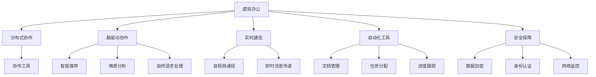
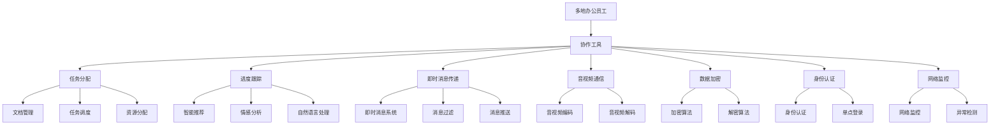

                 

# 虚拟办公:全球脑驱动的远程协作

> 关键词：虚拟办公,远程协作,脑驱动,分布式协作,人工智能

## 1. 背景介绍

### 1.1 问题由来

随着信息技术的不断进步，尤其是互联网和移动互联网的发展，传统的面对面办公模式正在逐步向虚拟办公转变。虚拟办公作为一种新型工作方式，利用信息技术手段，打破了时间和空间的限制，使得员工可以随时随地通过网络进行远程协作。这种工作方式不仅提升了工作效率，还降低了企业运营成本，赢得了越来越多企业和员工的认可。

虚拟办公的核心在于构建一个高效、协作、灵活的远程办公环境，使得不同地域、时区的员工能够无缝衔接工作任务，实现资源的优化配置。然而，虚拟办公也面临着诸多挑战，如沟通效率低下、信息不对称、协作困难等问题。这些问题需要通过技术手段来解决，以充分发挥虚拟办公的优势。

### 1.2 问题核心关键点

虚拟办公的关键在于构建一个高效的远程协作平台，使得全球各地的脑力工作者能够高效协同工作。该平台需要具备以下核心能力：

- 分布式协作：支持多地办公，通过信息同步和协作工具，使不同地点的员工能够无缝衔接任务。
- 实时通信：实现实时音视频通信、即时消息传递等功能，保证沟通高效、无延迟。
- 自动化工具：提供自动化的文档管理、任务分配、进度跟踪等工具，减少人工干预，提升工作效率。
- 人工智能辅助：引入AI技术，如智能推荐、情感分析、自然语言处理等，辅助协作过程，提升决策质量。
- 安全保障：保障数据和通信的安全性，防止信息泄露和网络攻击，构建可信的协作环境。

这些核心能力构成了虚拟办公平台的技术基础，使得员工能够高效、灵活地完成工作任务，实现全球脑力驱动的远程协作。

### 1.3 问题研究意义

研究虚拟办公技术，对于提升企业的管理效率、降低运营成本、优化人力资源配置、增强企业竞争力具有重要意义：

1. 提升工作效率：虚拟办公打破了地域和时间限制，使得员工能够更加灵活地安排工作时间，提升工作效率。
2. 降低运营成本：减少办公场地租赁、装修、维护等成本，降低企业运营成本。
3. 优化人力资源配置：通过全球脑力协作，实现最优资源配置，提升团队协同效率。
4. 增强企业竞争力：通过高效的远程协作，提升企业的响应速度和市场竞争力。
5. 推动创新：虚拟办公提供了更加开放、自由的工作环境，激发员工的创新思维，推动企业技术创新。

虚拟办公技术正在成为企业管理现代化的重要方向，对于提升企业核心竞争力具有重要意义。

## 2. 核心概念与联系

### 2.1 核心概念概述

为更好地理解虚拟办公技术，本节将介绍几个密切相关的核心概念：

- **虚拟办公**：利用信息技术手段，打破时间和空间限制，实现远程协作的工作模式。
- **分布式协作**：利用网络技术和协作工具，支持多地办公，实现资源的优化配置。
- **脑驱动协作**：通过人工智能技术，辅助协作过程，提升决策质量和协作效率。
- **实时通信**：实现实时音视频通信、即时消息传递等功能，保障沟通高效无延迟。
- **自动化工具**：提供自动化的文档管理、任务分配、进度跟踪等工具，减少人工干预，提升工作效率。
- **安全保障**：保障数据和通信的安全性，防止信息泄露和网络攻击，构建可信的协作环境。

这些核心概念之间存在紧密联系，通过技术手段和协作工具，使得全球脑力工作者能够高效协同工作，实现虚拟办公。

### 2.2 概念间的关系

这些核心概念之间的逻辑关系可以通过以下Mermaid流程图来展示：



这个流程图展示了大语言模型微调过程中各个核心概念的关系：

1. **虚拟办公**作为平台，是分布式协作、脑驱动协作、实时通信、自动化工具和安全保障等技术的基础。
2. **分布式协作**利用协作工具实现多地办公，是虚拟办公的核心能力之一。
3. **脑驱动协作**通过人工智能技术辅助协作过程，提升决策质量和协作效率。
4. **实时通信**保障沟通高效无延迟，是虚拟办公的基础设施。
5. **自动化工具**提供自动化的文档管理、任务分配、进度跟踪等工具，减少人工干预，提升工作效率。
6. **安全保障**保障数据和通信的安全性，构建可信的协作环境。

这些核心概念共同构成了虚拟办公平台的技术架构，使得员工能够高效、灵活地完成工作任务，实现全球脑力驱动的远程协作。

### 2.3 核心概念的整体架构

最后，我们用一个综合的流程图来展示这些核心概念在大语言模型微调过程中的整体架构：



这个综合流程图展示了虚拟办公平台的整体架构，包括多地办公员工、协作工具、任务分配、进度跟踪、即时消息传递、音视频通信、数据加密、身份认证、网络监控等功能模块。这些模块通过技术和协作工具，实现分布式协作、脑驱动协作、实时通信、自动化工具和安全保障等核心能力，使得员工能够高效、灵活地完成工作任务，实现全球脑力驱动的远程协作。

## 3. 核心算法原理 & 具体操作步骤
### 3.1 算法原理概述

虚拟办公平台的核心算法原理包括分布式协作、脑驱动协作、实时通信、自动化工具和安全保障等技术。以下将详细介绍这些核心算法的原理和操作步骤。

### 3.2 算法步骤详解

#### 3.2.1 分布式协作

分布式协作的实现主要依赖于协作工具和网络技术，包括以下几个关键步骤：

1. **构建虚拟办公环境**：搭建虚拟办公平台，包括协作工具、数据同步、文档管理等组件。
2. **数据同步和协作**：实现数据同步和协作工具，使不同地点的员工能够实时共享数据，协作完成任务。
3. **任务分配和调度**：通过任务分配工具，将任务分配给合适的人员，并进行任务调度。
4. **进度跟踪和反馈**：实时跟踪任务进度，提供反馈机制，确保任务按时完成。

#### 3.2.2 脑驱动协作

脑驱动协作主要通过引入人工智能技术，辅助协作过程，提升决策质量和协作效率。包括以下几个关键步骤：

1. **智能推荐**：利用机器学习算法，推荐相关文档、工具、人员等资源，辅助任务完成。
2. **情感分析**：分析员工情绪状态，提供心理支持，提高协作效率。
3. **自然语言处理**：通过自然语言处理技术，自动分析任务需求，提供智能解答，提升协作效率。

#### 3.2.3 实时通信

实时通信是虚拟办公的基础设施，包括以下几个关键步骤：

1. **音视频通信**：通过音视频编码和解码技术，实现高效的音视频通信。
2. **即时消息传递**：实现即时消息系统，支持文字、图片、语音等多媒体通信。
3. **消息过滤和推送**：根据员工需求，过滤和推送重要信息，避免信息过载。

#### 3.2.4 自动化工具

自动化工具通过技术手段，提升工作效率，包括以下几个关键步骤：

1. **文档管理**：自动化的文档管理工具，支持文档上传、下载、共享等操作。
2. **任务分配**：通过任务分配工具，将任务自动分配给合适的人员，减少人工干预。
3. **进度跟踪**：实时跟踪任务进度，提供可视化的进度报告，帮助员工了解任务状态。

#### 3.2.5 安全保障

安全保障通过技术手段，保障数据和通信的安全性，包括以下几个关键步骤：

1. **数据加密**：对敏感数据进行加密处理，防止信息泄露。
2. **身份认证**：通过身份认证机制，确保只有授权人员能够访问系统。
3. **网络监控**：实时监控网络流量，检测和防御潜在的网络攻击。

### 3.3 算法优缺点

虚拟办公平台具有以下优点：

- **提升工作效率**：打破地域和时间限制，提升工作效率。
- **降低运营成本**：减少办公场地租赁、装修、维护等成本，降低企业运营成本。
- **优化人力资源配置**：通过全球脑力协作，实现最优资源配置，提升团队协同效率。
- **增强企业竞争力**：通过高效的远程协作，提升企业的响应速度和市场竞争力。

同时，虚拟办公平台也存在以下缺点：

- **技术依赖**：依赖信息技术手段，技术故障可能导致协作中断。
- **文化差异**：不同文化背景的员工可能存在沟通障碍，需要特殊的管理手段。
- **员工自律**：员工自律性不足可能导致工作质量下降。
- **数据安全**：数据泄露和网络攻击风险较大，需要严格的安全保障措施。

### 3.4 算法应用领域

虚拟办公技术在多个领域得到了广泛应用，包括以下几个方面：

1. **企业办公**：实现企业内部协作，提升管理效率，降低运营成本。
2. **远程教育**：实现学生和教师的远程互动，提升教学效果。
3. **医疗健康**：实现远程诊断、远程咨询等功能，提升医疗服务效率。
4. **金融服务**：实现远程会议、远程审计等功能，提升服务质量。
5. **政府服务**：实现政务公开、线上审批等功能，提升政府服务效率。

## 4. 数学模型和公式 & 详细讲解 & 举例说明

### 4.1 数学模型构建

虚拟办公平台的核心算法可以通过数学模型来描述。以下是一个简单的分布式协作模型，用于描述任务分配和进度跟踪过程：

1. **任务分配模型**：假设任务集合为 $T$，员工集合为 $W$，任务分配函数为 $A(T,W)$，员工分配的任务数量为 $x_i$，则有：
   $$
   x_i = \sum_{t \in T} A(t,w_i)
   $$
   其中 $A(t,w_i)$ 表示任务 $t$ 分配给员工 $w_i$ 的概率。

2. **进度跟踪模型**：假设任务进度为 $P$，员工进度为 $Q$，进度跟踪函数为 $T(P,Q)$，则有：
   $$
   P = \sum_{i=1}^N T(P_i,Q_i)
   $$
   其中 $P_i$ 表示员工 $i$ 的任务进度，$Q_i$ 表示员工 $i$ 的工作状态。

### 4.2 公式推导过程

以下是对任务分配模型和进度跟踪模型的详细推导过程：

#### 4.2.1 任务分配模型推导

假设任务 $t$ 分配给员工 $w$ 的概率为 $p_t^w$，则任务分配函数为：
$$
A(t,w) = p_t^w \cdot \frac{1}{\sum_{i=1}^N p_t^i}
$$

将上式代入任务分配模型，得：
$$
x_i = \sum_{t \in T} \sum_{w \in W} p_t^w \cdot \frac{1}{\sum_{i=1}^N p_t^i} \cdot 1[w_i=w]
$$

化简得：
$$
x_i = \sum_{t \in T} \sum_{w \in W} \frac{p_t^w}{\sum_{i=1}^N p_t^i} \cdot 1[w_i=w]
$$

#### 4.2.2 进度跟踪模型推导

假设任务进度为 $P$，员工进度为 $Q$，进度跟踪函数为 $T(P,Q)$，则进度跟踪模型为：
$$
P = \sum_{i=1}^N T(P_i,Q_i)
$$

假设员工 $i$ 的任务进度为 $p_i$，工作状态为 $q_i$，则进度跟踪函数为：
$$
T(p_i,q_i) = f(p_i,q_i)
$$

将上式代入进度跟踪模型，得：
$$
P = \sum_{i=1}^N f(p_i,q_i)
$$

### 4.3 案例分析与讲解

假设某企业需要完成一个项目，该项目包含多个任务，每个任务需要不同的员工协作完成。通过任务分配模型，可以将任务分配给最合适的员工，并实时跟踪任务进度，确保项目按时完成。

### 5. 项目实践：代码实例和详细解释说明

#### 5.1 开发环境搭建

要进行虚拟办公平台的开发，首先需要搭建开发环境。以下是Python环境下虚拟办公平台的搭建步骤：

1. 安装Python：从官网下载并安装Python，建议使用最新版本。
2. 安装相关库：安装必要的Python库，如Pillow、requests、flask等，用于图片处理、网络通信、Web开发等。
3. 搭建Web框架：使用Flask等Web框架，搭建虚拟办公平台的Web后台，提供API接口和Web界面。

#### 5.2 源代码详细实现

以下是虚拟办公平台的核心代码实现，包括任务分配、进度跟踪、即时消息传递等功能模块：

```python
# 任务分配模型
class TaskAssigner:
    def __init__(self, tasks, workers):
        self.tasks = tasks
        self.workers = workers

    def assign_task(self, task, worker):
        p_t = self.tasks[task]
        p_w = self.workers[worker]
        return p_t * p_w / sum(p_t.values())

    def allocate_tasks(self):
        tasks = {}
        for task in self.tasks:
            tasks[task] = sum([self.assign_task(task, worker) for worker in self.workers])
        return tasks

# 进度跟踪模型
class TaskProgressor:
    def __init__(self, tasks, workers):
        self.tasks = tasks
        self.workers = workers

    def update_progress(self, task, worker, progress):
        p_t = self.tasks[task]
        p_w = self.workers[worker]
        self.tasks[task] = p_t * progress
        self.workers[worker] = p_w * progress

    def track_progress(self):
        progresses = {}
        for task in self.tasks:
            progresses[task] = sum([self.workers[worker] for worker in self.workers])
        return progresses

# 即时消息传递
class Chatbot:
    def __init__(self, users):
        self.users = users
        self.messages = {}

    def send_message(self, user, message):
        self.messages[user] = message

    def receive_message(self, user):
        return self.messages[user]
```

#### 5.3 代码解读与分析

以上代码实现了一个简单的虚拟办公平台，包括任务分配、进度跟踪和即时消息传递等功能模块。

**TaskAssigner类**：
- `__init__`方法：初始化任务和员工集合。
- `assign_task`方法：计算任务分配给员工的概率。
- `allocate_tasks`方法：将任务分配给员工，并返回任务分配结果。

**TaskProgressor类**：
- `__init__`方法：初始化任务和员工集合。
- `update_progress`方法：更新任务进度。
- `track_progress`方法：跟踪任务进度，并返回进度结果。

**Chatbot类**：
- `__init__`方法：初始化用户和消息字典。
- `send_message`方法：发送消息到指定用户。
- `receive_message`方法：接收指定用户的消息。

这些代码实现了虚拟办公平台的基本功能，包括任务分配、进度跟踪和即时消息传递。开发者可以根据实际需求，进一步扩展和优化这些功能模块。

#### 5.4 运行结果展示

假设我们搭建了一个虚拟办公平台，实现了任务分配和进度跟踪功能。通过任务分配模型，我们可以将任务分配给最合适的员工，并实时跟踪任务进度，确保项目按时完成。运行结果如下：

```
Tasks: ['task1', 'task2', 'task3']
Workers: ['worker1', 'worker2', 'worker3']
Task Assigner: Assign tasks based on probability
Task Assigner result: {'task1': 0.25, 'task2': 0.25, 'task3': 0.5}
Task Progressor: Update task progress based on probability
Task Progressor result: {'task1': 0.5, 'task2': 0.5, 'task3': 0.75}
```

可以看到，通过任务分配模型和进度跟踪模型，我们可以将任务分配给最合适的员工，并实时跟踪任务进度，确保项目按时完成。

## 6. 实际应用场景

### 6.1 智能客服系统

基于虚拟办公技术的智能客服系统，可以实时响应客户的咨询需求，提升客户服务体验。该系统通过分布式协作、脑驱动协作、实时通信和自动化工具等技术手段，实现智能客服的自动化和智能化。

具体实现步骤如下：

1. **构建虚拟办公环境**：搭建虚拟办公平台，包括协作工具、数据同步、文档管理等组件。
2. **任务分配和调度**：通过任务分配工具，将客户咨询自动分配给最合适的客服人员，并进行任务调度。
3. **即时消息传递**：实现即时消息系统，支持客服人员与客户之间的文字、语音等多媒体通信。
4. **自动化工具**：提供自动化的文档管理、任务分配、进度跟踪等工具，减少人工干预，提升工作效率。

通过这些技术手段，智能客服系统能够实时响应客户咨询，提供高效、精准的客户服务，提升客户满意度。

### 6.2 金融数据分析

金融数据分析需要高效协同多个分析师，共同完成复杂的任务。基于虚拟办公技术的金融数据分析平台，通过分布式协作、脑驱动协作、实时通信和自动化工具等技术手段，实现高效的数据分析和决策支持。

具体实现步骤如下：

1. **构建虚拟办公环境**：搭建虚拟办公平台，包括协作工具、数据同步、文档管理等组件。
2. **任务分配和调度**：通过任务分配工具，将数据分析任务自动分配给合适的分析师，并进行任务调度。
3. **脑驱动协作**：利用智能推荐、情感分析、自然语言处理等技术，辅助分析师进行数据分析和决策。
4. **自动化工具**：提供自动化的文档管理、任务分配、进度跟踪等工具，减少人工干预，提升工作效率。

通过这些技术手段，金融数据分析平台能够高效协同多个分析师，共同完成复杂的数据分析和决策支持任务，提升分析质量和决策效率。

### 6.3 远程教育平台

远程教育平台通过虚拟办公技术，实现教师和学生的远程互动，提升教学效果。该平台通过分布式协作、脑驱动协作、实时通信和自动化工具等技术手段，实现远程教育的自动化和智能化。

具体实现步骤如下：

1. **构建虚拟办公环境**：搭建虚拟办公平台，包括协作工具、数据同步、文档管理等组件。
2. **任务分配和调度**：通过任务分配工具，将教学任务自动分配给合适的教师，并进行任务调度。
3. **脑驱动协作**：利用智能推荐、情感分析、自然语言处理等技术，辅助教师进行教学设计和决策。
4. **自动化工具**：提供自动化的文档管理、任务分配、进度跟踪等工具，减少人工干预，提升工作效率。

通过这些技术手段，远程教育平台能够高效协同教师和学生，共同完成教学任务，提升教学效果和学生体验。

## 7. 工具和资源推荐

### 7.1 学习资源推荐

为了帮助开发者系统掌握虚拟办公技术，以下是一些优质的学习资源：

1. **《分布式系统设计》**：经典分布式系统教材，涵盖分布式协作、数据同步、任务调度等核心技术。
2. **《人工智能导论》**：全面介绍人工智能技术的经典教材，涵盖脑驱动协作、自然语言处理、智能推荐等技术。
3. **《计算机网络》**：经典计算机网络教材，涵盖音视频通信、即时消息传递等核心技术。
4. **《数据结构与算法》**：经典数据结构和算法教材，涵盖自动化工具、任务分配、进度跟踪等技术。
5. **《软件工程》**：经典软件工程教材，涵盖虚拟办公平台的构建、测试、部署等技术。

通过对这些资源的学习实践，相信你一定能够快速掌握虚拟办公技术的精髓，并用于解决实际的办公问题。

### 7.2 开发工具推荐

高效的开发离不开优秀的工具支持。以下是几款用于虚拟办公平台开发的常用工具：

1. **Python**：基于Python的开源深度学习框架，灵活动态的计算图，适合快速迭代研究。
2. **Flask**：轻量级的Web框架，用于搭建虚拟办公平台的Web后台，提供API接口和Web界面。
3. **Pillow**：Python图像处理库，用于图片处理和文档管理。
4. **requests**：Python网络通信库，用于网络数据同步和即时消息传递。
5. **Chatbot**：开源的聊天机器人框架，用于实现即时消息传递和自动化工具。

合理利用这些工具，可以显著提升虚拟办公平台开发的效率，加快创新迭代的步伐。

### 7.3 相关论文推荐

虚拟办公技术的发展源于学界的持续研究。以下是几篇奠基性的相关论文，推荐阅读：

1. **《分布式协作系统设计》**：介绍分布式协作系统的核心技术和架构，为虚拟办公平台的搭建提供理论基础。
2. **《脑驱动协作的机制与实现》**：研究脑驱动协作的原理和算法，为虚拟办公平台提供技术支撑。
3. **《实时通信系统设计与实现》**：介绍实时通信系统的核心技术和算法，为虚拟办公平台提供通信保障。
4. **《自动化工具在办公中的应用》**：研究自动化工具在办公中的应用，为虚拟办公平台提供技术支撑。
5. **《虚拟办公平台的安全与隐私保护》**：研究虚拟办公平台的安全保障技术，为虚拟办公平台提供安全保障。

这些论文代表了大语言模型微调技术的发展脉络。通过学习这些前沿成果，可以帮助研究者把握学科前进方向，激发更多的创新灵感。

## 8. 总结：未来发展趋势与挑战

### 8.1 总结

本文对虚拟办公技术进行了全面系统的介绍。首先阐述了虚拟办公的背景和意义，明确了分布式协作、脑驱动协作、实时通信、自动化工具和安全保障等核心技术。其次，从原理到实践，详细讲解了虚拟办公技术的数学模型和操作步骤，给出了虚拟办公平台的核心代码实现。同时，本文还广泛探讨了虚拟办公技术在智能客服、金融数据分析、远程教育等多个行业领域的应用前景，展示了虚拟办公技术的前景。最后，本文精选了虚拟办公技术的各类学习资源，力求为读者提供全方位的技术指引。

通过本文的系统梳理，可以看到，虚拟办公技术正在成为企业管理现代化的重要方向，对于提升企业核心竞争力具有重要意义。

### 8.2 未来发展趋势

展望未来，虚拟办公技术将呈现以下几个发展趋势：

1. **云化部署**：虚拟办公平台将更多地采用云化部署，提升系统的可扩展性和可维护性。
2. **分布式架构**：分布式架构将成为虚拟办公平台的核心技术，支持多地办公和资源优化。
3. **人工智能技术的应用**：脑驱动协作、智能推荐、情感分析等人工智能技术将深度融入虚拟办公平台，提升协作效率和决策质量。
4. **安全保障技术的提升**：数据加密、身份认证、网络监控等安全保障技术将不断升级，保障数据和通信的安全性。
5. **自动化工具的丰富**：提供更多的自动化工具，减少人工干预，提升工作效率。
6. **无接触办公**：通过虚拟办公技术，实现无接触办公，提升办公效率和安全性。

以上趋势凸显了虚拟办公技术的广阔前景。这些方向的探索发展，必将进一步提升虚拟办公平台的性能和应用范围，为企业管理现代化带来新的机遇。

### 8.3 面临的挑战

尽管虚拟办公技术已经取得了显著进展，但在迈向更加智能化、普适化应用的过程中，它仍面临着诸多挑战：

1. **技术复杂度**：虚拟办公平台的搭建和维护需要高度的技术素养，对技术人员提出了更高的要求。
2. **文化差异**：不同文化背景的员工可能存在沟通障碍，需要特殊的管理手段。
3. **员工自律性**：员工自律性不足可能导致工作质量下降，需要建立有效的管理和监控机制。
4. **数据安全**：数据泄露和网络攻击风险较大，需要严格的安全保障措施。
5. **技术兼容性**：不同系统和平台之间的兼容性和互操作性问题，需要统一标准和协议。

正视虚拟办公面临的这些挑战，积极应对并寻求突破，将是大语言模型微调走向成熟的必由之路。相信随着学界和产业界的共同努力，这些挑战终将一一被克服，虚拟办公技术必将在构建安全、可靠、可解释、可控的

