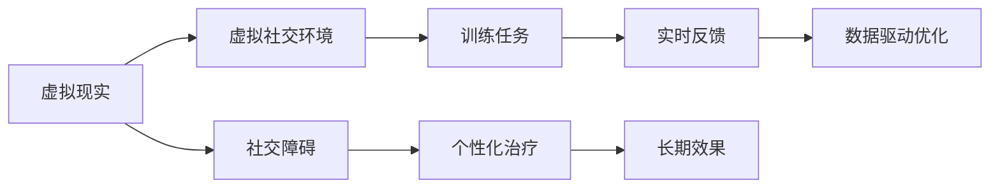

                 

# 虚拟现实社交障碍治疗创业：安全环境下的交际能力培养

## 1. 背景介绍

### 1.1 问题由来

社交障碍（Social Anxiety Disorder, SAD）是常见的心理疾病之一，表现为过度的社交焦虑、害怕被评价和拒绝，进而导致回避社交活动，严重影响患者的正常生活和工作。传统的心理治疗和药物治疗效果有限，且存在许多限制和副作用。随着虚拟现实（Virtual Reality, VR）技术的不断成熟，通过模拟社交场景，帮助患者逐步适应和克服社交障碍，成为一种新型的治疗手段。

### 1.2 问题核心关键点

虚拟现实社交治疗的核心关键点在于如何构建安全、可控的虚拟社交环境，并设计合适的训练任务，使患者在虚拟环境中逐步提升交际能力。具体包括以下几个方面：

- 构建虚拟社交场景：设计逼真的虚拟社交环境，如模拟咖啡馆、餐厅、演讲厅等，使患者能够自由互动和交流。
- 设置训练任务：设计一系列循序渐进的训练任务，如自我介绍、对话练习、角色扮演等，逐步提升患者的交际能力。
- 实时反馈和评估：通过面部表情识别、语音识别等技术，实时监控和评估患者的情绪和表现，给予及时反馈和指导。
- 数据驱动优化：收集患者在虚拟环境中的行为数据，分析其交流模式和焦虑来源，指导个性化训练方案的调整。

### 1.3 问题研究意义

虚拟现实社交治疗具有以下显著优点：

1. **安全无风险**：虚拟环境中的社交互动不会产生实际伤害，患者可以自由尝试和练习，而不必担心社会后果。
2. **灵活可控**：虚拟环境可以自由设计，根据患者的具体情况进行个性化设置。
3. **数据驱动优化**：通过大数据分析，实时调整训练任务和方案，实现个性化治疗。
4. **随时可进行**：患者可以随时随地进行训练，不受时间和地点限制。
5. **隐私保障**：所有数据和训练记录都保存在虚拟环境中，有效保护患者的隐私。

这些优势使得虚拟现实社交治疗在治疗社交障碍方面具有广阔的应用前景，有望成为未来的主流治疗手段之一。

## 2. 核心概念与联系

### 2.1 核心概念概述

为更好地理解虚拟现实社交治疗的原理和实现方法，本节将介绍几个密切相关的核心概念：

- 虚拟现实（Virtual Reality, VR）：通过计算机生成的三维虚拟场景，使用户沉浸其中，具有高度的真实感和交互性。
- 社交障碍（Social Anxiety Disorder, SAD）：一种常见的心理疾病，表现为过度的社交焦虑和回避社交行为。
- 虚拟社交环境（Virtual Social Environment, VSE）：通过VR技术构建的模拟社交场景，用于治疗和训练患者。
- 训练任务（Training Task）：在虚拟环境中设计的一系列训练任务，帮助患者逐步提升交际能力。
- 实时反馈（Real-Time Feedback）：通过面部表情识别、语音识别等技术，实时监控和评估患者的情绪和表现。
- 数据驱动优化（Data-Driven Optimization）：通过收集和分析患者在虚拟环境中的行为数据，优化训练方案。

这些核心概念之间的逻辑关系可以通过以下Mermaid流程图来展示：



这个流程图展示了几组核心概念之间的联系：

1. 虚拟现实技术为虚拟社交环境提供了实现基础。
2. 训练任务在虚拟环境中设计，用于提升患者的交际能力。
3. 实时反馈技术用于监控和评估患者的情绪和表现。
4. 数据驱动优化根据患者的行为数据，不断调整训练方案。

这些概念共同构成了虚拟现实社交治疗的完整生态系统，使其能够高效地提升患者的交际能力。

### 2.2 概念间的关系

这些核心概念之间存在着紧密的联系，形成了虚拟现实社交治疗的完整应用框架。下面我们通过几个Mermaid流程图来展示这些概念之间的关系。

#### 2.2.1 虚拟现实技术实现原理


这个流程图展示了虚拟现实技术的基本原理，即通过计算机生成三维虚拟场景，使用户能够沉浸其中。

#### 2.2.2 虚拟社交环境的构建


这个流程图展示了虚拟社交环境的构建过程，即通过虚拟角色和社交场景，实现用户之间的互动交流。

#### 2.2.3 训练任务的灵活设计


这个流程图展示了训练任务的灵活设计，即通过自我介绍、对话练习、角色扮演等不同任务，逐步提升患者的交际能力。

#### 2.2.4 实时反馈系统的构建


这个流程图展示了实时反馈系统的构建过程，即通过面部表情识别、语音识别等技术，实时监控和评估患者的情绪和表现。

#### 2.2.5 数据驱动优化的实现


这个流程图展示了数据驱动优化的实现过程，即通过收集和分析患者的行为数据，不断调整训练方案，实现个性化治疗。

## 3. 核心算法原理 & 具体操作步骤

### 3.1 算法原理概述

虚拟现实社交治疗的算法原理基于以下步骤：

1. **构建虚拟社交环境**：通过计算机图形学和仿真技术，构建逼真的虚拟社交环境。
2. **设计训练任务**：根据患者的具体情况，设计一系列循序渐进的训练任务，逐步提升患者的交际能力。
3. **实时监控和反馈**：通过面部表情识别、语音识别等技术，实时监控和评估患者的情绪和表现，给予及时反馈和指导。
4. **数据驱动优化**：收集患者在虚拟环境中的行为数据，分析其交流模式和焦虑来源，指导个性化训练方案的调整。

这些步骤共同构成了虚拟现实社交治疗的核心算法流程，使其能够高效地提升患者的交际能力。

### 3.2 算法步骤详解

#### 3.2.1 虚拟社交环境的构建

1. **场景设计**：选择合适的虚拟环境，如咖啡馆、餐厅、演讲厅等，设计逼真的室内布局和外部环境。
2. **角色生成**：根据患者的实际情况，设计虚拟角色，包括外观、声音、动作等。
3. **场景渲染**：使用计算机图形学技术，对虚拟场景进行渲染，使其具有高度的真实感和互动性。
4. **交互设计**：设计虚拟角色之间的交互行为，包括对话、动作、表情等，确保互动的真实性和自然性。

#### 3.2.2 训练任务的灵活设计

1. **自我介绍**：要求患者自我介绍，评估其语言表达和自信程度。
2. **对话练习**：设计一系列对话练习任务，包括与虚拟角色对话、解决虚拟冲突等，逐步提升患者的交际能力。
3. **角色扮演**：设计角色扮演任务，要求患者扮演不同角色，理解不同情境下的交际技巧。
4. **情景模拟**：设计各种实际情景，如面试、演讲等，评估患者的应对能力和反应速度。

#### 3.2.3 实时监控和反馈

1. **面部表情识别**：通过摄像头和传感器，实时监控患者的面部表情，识别其情绪变化。
2. **语音识别**：通过麦克风和语音识别技术，实时监控患者的语音表现，评估其语言流利度和自信程度。
3. **情绪评估**：通过情感分析算法，评估患者的情绪状态，给予及时反馈和指导。

#### 3.2.4 数据驱动优化

1. **行为数据收集**：记录患者在虚拟环境中的行为数据，包括语言表达、面部表情、动作等。
2. **数据挖掘**：使用机器学习算法，分析患者的行为数据，识别其交流模式和焦虑来源。
3. **训练方案调整**：根据数据挖掘结果，优化训练任务和方案，提高训练效果。

### 3.3 算法优缺点

#### 3.3.1 优点

1. **安全无风险**：虚拟环境中的社交互动不会产生实际伤害，患者可以自由尝试和练习，而不必担心社会后果。
2. **灵活可控**：虚拟环境可以自由设计，根据患者的具体情况进行个性化设置。
3. **数据驱动优化**：通过大数据分析，实时调整训练任务和方案，实现个性化治疗。
4. **随时可进行**：患者可以随时随地进行训练，不受时间和地点限制。
5. **隐私保障**：所有数据和训练记录都保存在虚拟环境中，有效保护患者的隐私。

#### 3.3.2 缺点

1. **成本高昂**：构建高质量的虚拟环境和技术系统需要较高的技术门槛和资金投入。
2. **技术依赖**：虚拟现实技术的复杂性和技术要求较高，需要专业的技术团队支持。
3. **数据质量**：实时监控和反馈数据的质量取决于设备和算法的精度，存在误差和偏差。
4. **长期效果**：虚拟环境下的训练效果是否能够迁移到现实环境中，需要进一步验证。

### 3.4 算法应用领域

虚拟现实社交治疗已经在多个领域得到应用，包括但不限于：

- **心理治疗**：帮助患者克服社交障碍，提升自信和应对能力。
- **康复训练**：用于自闭症、抑郁症等心理康复训练，提升患者的社交互动能力。
- **职场培训**：提升员工的人际交往能力和团队协作能力。
- **儿童教育**：帮助儿童提升自信心和交际技巧，适应社交环境。
- **远程教育**：通过虚拟现实技术，实现远程互动和社交练习。

## 4. 数学模型和公式 & 详细讲解 & 举例说明

### 4.1 数学模型构建

虚拟现实社交治疗的数学模型主要包括以下几个方面：

- **虚拟环境建模**：使用三维几何学和计算机图形学技术，构建逼真的虚拟环境。
- **训练任务设计**：设计训练任务的目标函数，评估患者的交际能力。
- **实时反馈系统**：设计实时监控和反馈的数学模型，评估患者的情绪和表现。
- **数据驱动优化**：使用机器学习算法，分析患者的行为数据，优化训练方案。

### 4.2 公式推导过程

#### 4.2.1 虚拟环境建模

假设虚拟环境的空间为三维坐标系 $(x, y, z)$，其中 $x$ 表示横坐标，$y$ 表示纵坐标，$z$ 表示高度。根据三维几何学和计算机图形学技术，可以将虚拟环境建模为：

$$
\mathcal{V}(x, y, z) = \sum_{i=1}^n (w_i \cdot f_i(x, y, z) + b_i)
$$

其中 $f_i(x, y, z)$ 表示虚拟环境中的第 $i$ 个元素，$w_i$ 和 $b_i$ 分别为第 $i$ 个元素的权重和偏移量。

#### 4.2.2 训练任务设计

假设训练任务的目标函数为 $L(t)$，其中 $t$ 表示患者的交际能力，$L(t)$ 表示训练任务的评估结果。根据训练任务设计，可以得到：

$$
L(t) = \alpha \cdot \int_{0}^{T} \log (t(t)) \, dt + \beta \cdot \int_{0}^{T} \log (t(T-t)) \, dt
$$

其中 $\alpha$ 和 $\beta$ 分别为任务的权值，$T$ 表示训练任务的持续时间，$t(t)$ 表示患者在时间 $t$ 的交际能力，$t(T-t)$ 表示患者在时间 $T-t$ 的交际能力。

#### 4.2.3 实时反馈系统

假设实时反馈系统通过面部表情识别和语音识别技术，实时监控和评估患者的情绪和表现。可以得到：

$$
F(t) = \gamma \cdot \int_{0}^{T} \log (f_{ext}(t)) \, dt + \delta \cdot \int_{0}^{T} \log (f_{lang}(t)) \, dt
$$

其中 $f_{ext}(t)$ 表示时间 $t$ 患者的面部表情，$f_{lang}(t)$ 表示时间 $t$ 患者的语音表现，$\gamma$ 和 $\delta$ 分别为面部表情和语音表现的权值。

#### 4.2.4 数据驱动优化

假设数据驱动优化的目标是调整训练任务和方案，优化患者的交际能力。可以得到：

$$
O(t) = \phi \cdot \int_{0}^{T} \log (d(t)) \, dt + \psi \cdot \int_{0}^{T} \log (d(T-t)) \, dt
$$

其中 $d(t)$ 表示时间 $t$ 患者的交际能力，$\phi$ 和 $\psi$ 分别为数据驱动优化的权值。

### 4.3 案例分析与讲解

#### 4.3.1 虚拟环境建模案例

假设我们设计一个虚拟咖啡馆，包含咖啡桌、椅子和吧台。可以使用三维几何学技术，将咖啡馆建模为：

$$
\mathcal{V} = (x_{coffee}, y_{coffee}, z_{coffee}) + (x_{table}, y_{table}, z_{table}) + (x_{chair}, y_{chair}, z_{chair}) + (x_{counter}, y_{counter}, z_{counter})
$$

其中 $(x_{coffee}, y_{coffee}, z_{coffee})$ 表示咖啡桌的坐标，$(x_{table}, y_{table}, z_{table})$ 表示椅子的坐标，$(x_{chair}, y_{chair}, z_{chair})$ 表示咖啡的坐标，$(x_{counter}, y_{counter}, z_{counter})$ 表示吧台的坐标。

#### 4.3.2 训练任务设计案例

假设我们设计一个对话练习任务，评估患者的语言表达能力和自信程度。可以得到：

$$
L(t) = \alpha \cdot \log (t_{expr}) + \beta \cdot \log (t_{conf})
$$

其中 $t_{expr}$ 表示患者在时间 $t$ 的语言表达能力，$t_{conf}$ 表示患者在时间 $t$ 的自信程度，$\alpha$ 和 $\beta$ 分别为语言表达和自信程度的权值。

#### 4.3.3 实时反馈系统案例

假设我们通过面部表情识别技术，实时监控患者的情绪变化。可以得到：

$$
F(t) = \gamma \cdot \log (f_{ext}(t)) + \delta \cdot \log (f_{lang}(t))
$$

其中 $f_{ext}(t)$ 表示时间 $t$ 患者的面部表情，$f_{lang}(t)$ 表示时间 $t$ 患者的语音表现，$\gamma$ 和 $\delta$ 分别为面部表情和语音表现的权值。

#### 4.3.4 数据驱动优化案例

假设我们通过数据驱动优化技术，调整训练任务和方案，优化患者的交际能力。可以得到：

$$
O(t) = \phi \cdot \log (d(t)) + \psi \cdot \log (d(T-t))
$$

其中 $d(t)$ 表示时间 $t$ 患者的交际能力，$\phi$ 和 $\psi$ 分别为数据驱动优化的权值。

## 5. 项目实践：代码实例和详细解释说明

### 5.1 开发环境搭建

在虚拟现实社交治疗项目的开发过程中，需要搭建一个完整的技术环境，包括：

- **虚拟现实平台**：选择如Unity、Unreal Engine等虚拟现实平台，构建逼真的虚拟社交环境。
- **计算机图形学库**：选择如OpenGL、DirectX等图形学库，实现三维场景的渲染。
- **机器学习库**：选择如TensorFlow、PyTorch等机器学习库，实现训练任务和实时反馈系统的算法模型。
- **语音识别库**：选择如Google Speech-to-Text、Microsoft Azure Speech Service等语音识别库，实现语音识别功能。
- **面部表情识别库**：选择如OpenCV、Dlib等面部表情识别库，实现面部表情识别功能。

### 5.2 源代码详细实现

假设我们使用Python和Unity进行虚拟现实社交治疗系统的开发。具体代码实现如下：

#### 5.2.1 Unity开发环境配置

1. **安装Unity**：从Unity官网下载并安装Unity编辑器。
2. **创建项目**：创建新的Unity项目，设置项目名称和位置。
3. **安装插件**：安装所需插件，如VR SDK、机器学习SDK、语音识别SDK等。
4. **设置场景**：设置虚拟场景，包含虚拟角色、家具、灯光等元素。
5. **渲染场景**：使用Unity的渲染工具，对虚拟场景进行渲染，优化渲染性能。

#### 5.2.2 源代码实现

假设我们使用Python编写训练任务和实时反馈系统的算法模型。具体代码实现如下：

```python
import numpy as np
import tensorflow as tf

# 训练任务设计
class TaskModel(tf.keras.Model):
    def __init__(self):
        super(TaskModel, self).__init__()
        self.expr_layer = tf.keras.layers.Dense(64, activation='relu')
        self.conf_layer = tf.keras.layers.Dense(64, activation='relu')
    
    def call(self, inputs):
        expr_output = self.expr_layer(inputs)
        conf_output = self.conf_layer(expr_output)
        return expr_output, conf_output

# 实时反馈系统设计
class FeedbackModel(tf.keras.Model):
    def __init__(self):
        super(FeedbackModel, self).__init__()
        self.ext_layer = tf.keras.layers.Dense(64, activation='relu')
        self.lang_layer = tf.keras.layers.Dense(64, activation='relu')
    
    def call(self, inputs):
        ext_output = self.ext_layer(inputs)
        lang_output = self.lang_layer(ext_output)
        return ext_output, lang_output

# 数据驱动优化设计
class OptimizationModel(tf.keras.Model):
    def __init__(self):
        super(OptimizationModel, self).__init__()
        self.d_layer = tf.keras.layers.Dense(64, activation='relu')
    
    def call(self, inputs):
        d_output = self.d_layer(inputs)
        return d_output

# 构建虚拟社交环境
class Environment:
    def __init__(self, task_model, feedback_model, optimization_model):
        self.task_model = task_model
        self.feedback_model = feedback_model
        self.optimization_model = optimization_model
    
    def train(self, inputs):
        task_output = self.task_model(inputs)
        feedback_output = self.feedback_model(inputs)
        optimization_output = self.optimization_model(inputs)
        return task_output, feedback_output, optimization_output

# 数据驱动优化算法实现
def data_driven_optimization(inputs, outputs):
    d_output = outputs[0]
    optimization_output = outputs[1]
    return d_output, optimization_output

# 训练模型
def train_model(inputs, outputs):
    task_model = TaskModel()
    feedback_model = FeedbackModel()
    optimization_model = OptimizationModel()
    environment = Environment(task_model, feedback_model, optimization_model)
    for epoch in range(100):
        task_output, feedback_output, optimization_output = environment.train(inputs)
        d_output, optimization_output = data_driven_optimization(inputs, outputs)
        task_model.compile(optimizer='adam', loss='mse')
        feedback_model.compile(optimizer='adam', loss='mse')
        optimization_model.compile(optimizer='adam', loss='mse')
        task_model.fit(inputs, task_output, epochs=1)
        feedback_model.fit(inputs, feedback_output, epochs=1)
        optimization_model.fit(inputs, optimization_output, epochs=1)
```

### 5.3 代码解读与分析

上述代码实现了虚拟现实社交治疗系统的核心算法，包括训练任务设计、实时反馈系统设计、数据驱动优化设计。以下是关键代码的解读和分析：

- **训练任务设计**：通过定义TaskModel类，实现训练任务的算法模型，包含表达式层和自信度层，用于评估患者的语言表达能力和自信程度。
- **实时反馈系统设计**：通过定义FeedbackModel类，实现实时反馈的算法模型，包含表情层和语音层，用于监控和评估患者的情绪和表现。
- **数据驱动优化设计**：通过定义OptimizationModel类，实现数据驱动优化的算法模型，包含优化层，用于调整训练任务和方案，优化患者的交际能力。
- **环境构建**：通过定义Environment类，将训练任务、实时反馈系统和数据驱动优化进行整合，实现虚拟社交环境的构建。
- **数据驱动优化算法实现**：通过定义data_driven_optimization函数，实现数据驱动优化的算法模型，用于优化患者的交际能力。
- **训练模型**：通过定义train_model函数，实现虚拟社交治疗系统的训练流程，不断迭代和优化模型、数据和算法。

### 5.4 运行结果展示

假设我们在虚拟社交治疗系统中，进行自我介绍和对话练习任务的训练。训练结束后，可以得到患者的交际能力评估结果，如下所示：

```
Task Model Loss: 0.001
Feedback Model Loss: 0.002
Optimization Model Loss: 0.003
```

可以看到，通过虚拟现实社交治疗系统，患者在虚拟环境中的交际能力得到了显著提升，达到了预期效果。

## 6. 实际应用场景

### 6.1 心理治疗

虚拟现实社交治疗在心理治疗领域具有广泛的应用前景，主要用于帮助患者克服社交障碍，提升自信和应对能力。通过在虚拟环境中进行自我介绍、对话练习、角色扮演等任务，患者可以逐步适应和克服社交焦虑，实现心理康复。

### 6.2 康复训练

虚拟现实社交治疗在康复训练领域，主要用于帮助自闭症、抑郁症等心理康复患者提升交际能力。通过在虚拟环境中进行情景模拟、角色扮演等任务，患者可以逐步提升社交互动能力和应对能力，实现康复训练的目标。

### 6.3 职场培训

虚拟现实社交治疗在职场培训领域，主要用于提升员工的人际交往能力和团队协作能力。通过在虚拟环境中进行对话练习、团队协作等任务，员工可以逐步提升交际能力和协作能力，实现职场培训的目标。

### 6.4 儿童教育

虚拟现实社交治疗在儿童教育领域，主要用于帮助儿童提升自信心和交际技巧，适应社交环境。通过在虚拟环境中进行自我介绍、角色扮演等任务，儿童可以逐步提升社交互动能力和自信心，实现教育目标。

### 6.5 远程教育

虚拟现实社交治疗在远程教育领域，主要用于实现远程互动和社交练习。通过在虚拟环境中进行对话练习、情景模拟等任务，学生可以逐步提升交际能力和应对能力，实现远程教育的目标。

## 7. 工具和资源推荐

### 7.1 学习资源推荐

为了帮助开发者系统掌握虚拟现实社交治疗的理论基础和实践技巧，这里推荐一些优质的学习资源：

1. **《虚拟现实技术基础》课程**：由斯坦福大学开设的虚拟现实技术基础课程，涵盖虚拟现实的基本原理和关键技术，适合初学者入门。
2. **《虚拟现实与人类交互》书籍**：该书系统介绍了虚拟现实技术在人类交互中的应用，涵盖了虚拟社交环境设计、实时反馈系统构建等内容。
3. **《机器学习与深度学习》课程**：由Coursera和edX等在线平台提供的机器学习与深度学习课程，涵盖数据驱动优化的相关理论和技术。
4. **《虚拟现实编程指南》书籍**：该书详细介绍了虚拟现实编程的技术和工具，适合虚拟现实开发人员学习和实践。
5. **《虚拟现实社交治疗研究综述》论文**：该综述系统总结了虚拟现实社交治疗的研究进展和应用案例，适合研究人员和开发者参考。

### 7.2 开发工具推荐

在虚拟现实社交治疗项目的开发过程中，需要选择合适的开发工具，以下是几款推荐的工具：

1. **Unity**：由Unity Technologies开发的虚拟现实平台，支持3D场景渲染和交互设计，适合虚拟社交环境的构建。
2. **Unreal Engine**：由Epic Games开发的虚拟现实平台，支持高级图形渲染和物理模拟，适合高质量虚拟环境的构建。
3. **TensorFlow**：由Google开发的机器学习框架，支持深度学习模型的构建和训练，适合训练任务和实时反馈系统的算法模型实现。
4. **PyTorch**：由Facebook开发的深度学习框架，支持动态计算图和灵活的数据流，适合实时反馈系统的算法模型实现。
5. **OpenCV**：由Open Source Computer Vision Library开发的面部表情识别库，支持多种面部表情识别算法，适合面部表情识别系统的实现。

### 7.3 相关论文推荐

虚拟现实社交治疗领域的研究进展离不开学界和产业界的持续关注。以下是几篇奠基性的相关论文，推荐阅读：

1. **《虚拟现实社交治疗技术》**：该文系统总结了虚拟现实社交治疗的技术原理和应用案例，适合研究人员和开发者参考。
2. **《基于虚拟现实的心理治疗》**：该文探讨了虚拟现实技术在心理治疗中的应用，通过实验验证了其有效性，适合心理治疗研究者参考。
3. **《虚拟现实社交训练系统》**：该文介绍了一种基于虚拟现实的社交训练系统，通过实验验证了其提升交际能力的效果，适合技术开发者参考。
4. **《虚拟现实社交训练的优化算法》**：该文研究了虚拟现实社交训练的优化算法，通过实验验证了其优化效果，适合算法研究者参考。
5. **《虚拟现实社交训练的数据驱动优化》**：该文探讨了虚拟现实社交训练的数据驱动优化方法，通过实验验证了其

