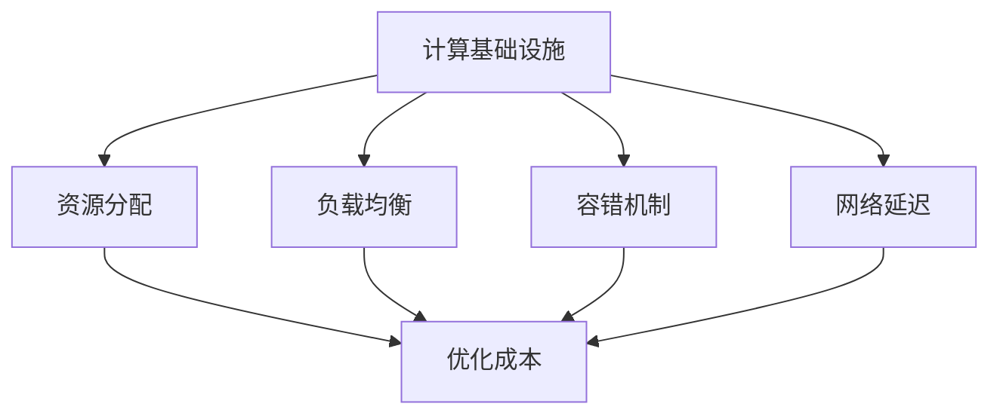
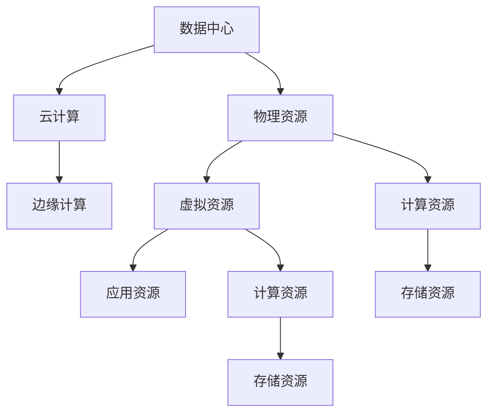
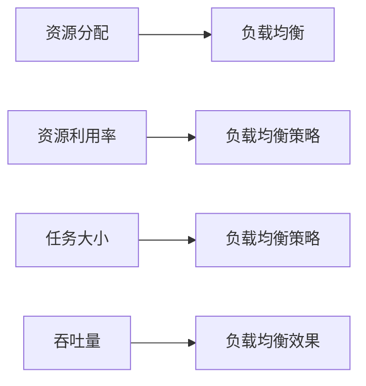
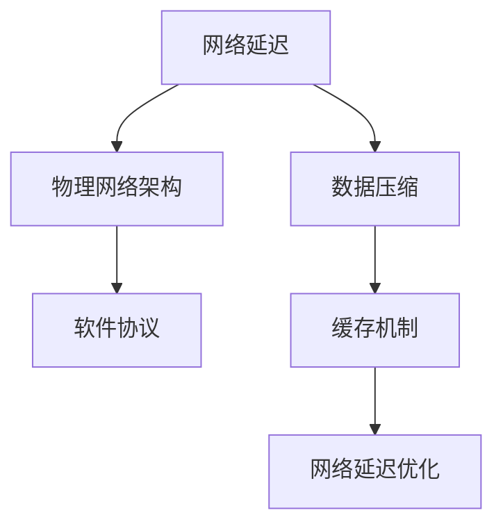
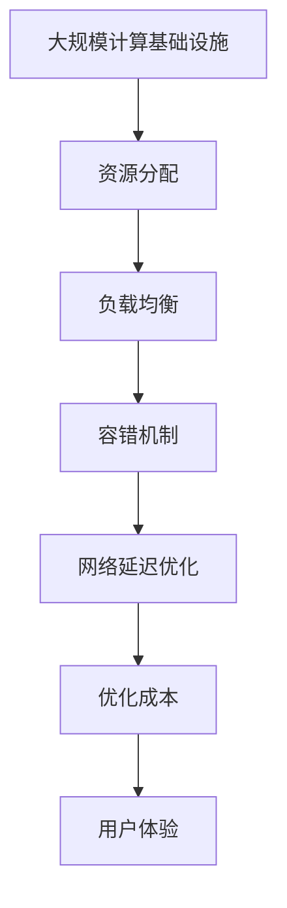

                 

# 计算基础设施：减少延迟和成本

在数字时代，计算基础设施是支撑各种应用和业务的关键。无论是数据中心、云计算服务，还是边缘计算平台，每一个环节都涉及到资源分配、性能优化、成本控制等方面的问题。本文将深入探讨如何通过各种技术手段减少延迟和降低成本，从而提升整体计算基础设施的效率和效益。

## 1. 背景介绍

### 1.1 问题由来

随着互联网和移动互联网的快速发展，数据量呈指数级增长。传统的数据中心和云计算平台面临的计算和存储压力越来越大。如何优化资源配置、减少延迟、降低成本，成为当下计算基础设施发展的重要课题。优化不当，不仅会导致用户体验不佳，还可能带来巨大的经济损失。

### 1.2 问题核心关键点

计算基础设施的优化涉及多个维度，包括资源分配、负载均衡、容错机制、网络延迟等方面。这些问题往往相互关联，需要综合考虑。优化方向主要包括：

- **资源分配**：合理分配计算和存储资源，避免资源闲置和过度使用。
- **负载均衡**：将请求均衡分配到各个计算节点，提升系统吞吐量。
- **容错机制**：通过冗余设计和故障恢复机制，保证系统稳定性和可靠性。
- **网络延迟**：优化网络架构和通信协议，减少数据传输时延。

### 1.3 问题研究意义

提升计算基础设施的效率和效益，不仅能够降低运营成本，提升用户体验，还能为各行各业带来新的增长点。具体来说：

- **降低运营成本**：通过合理分配资源和优化网络架构，减少不必要的花费。
- **提升用户体验**：减少延迟，提高系统响应速度，使用户获得更流畅的交互体验。
- **推动行业升级**：优化后的基础设施能够支持更多创新应用，推动技术落地和业务升级。

## 2. 核心概念与联系

### 2.1 核心概念概述

- **计算基础设施(Computing Infrastructure)**：包括数据中心、云计算服务、边缘计算等，提供计算和存储资源，支撑各种应用运行。
- **延迟(Latency)**：数据传输、计算等过程中的时间延迟，直接影响用户体验和系统性能。
- **成本(Cost)**：建设和维护基础设施所需的各种资源和费用。
- **资源分配(Resource Allocation)**：将有限的计算和存储资源合理分配给各个应用和用户。
- **负载均衡(Load Balancing)**：将请求均衡分配到各个计算节点，避免单点瓶颈。
- **容错机制(Fault Tolerance)**：通过冗余设计和故障恢复机制，保证系统稳定性和可靠性。
- **网络延迟(Network Latency)**：数据传输过程中因网络结构、协议等导致的时延问题。

这些概念之间的逻辑关系可以通过以下Mermaid流程图来展示：



这个流程图展示了计算基础设施优化过程中各个概念的相互作用：

1. 计算基础设施是基础，通过资源分配、负载均衡、容错机制和网络延迟优化，来降低成本。
2. 资源分配决定了资源使用效率，负载均衡提升了系统吞吐量，容错机制保证了系统可靠性。
3. 网络延迟优化直接影响到数据传输速度，从而影响用户体验和系统性能。

### 2.2 概念间的关系

这些核心概念之间存在着紧密的联系，形成了计算基础设施优化的完整生态系统。下面我们通过几个Mermaid流程图来展示这些概念之间的关系。

#### 2.2.1 计算基础设施的层次结构



这个流程图展示了计算基础设施的层次结构：

1. 数据中心提供物理资源，云计算和边缘计算提供虚拟资源，应用资源则直接面向用户。
2. 物理资源包括计算资源和存储资源，是计算基础设施的基础。

#### 2.2.2 资源分配与负载均衡的关系



这个流程图展示了资源分配与负载均衡的相互关系：

1. 资源分配决定了资源利用率，负载均衡则基于资源利用率和任务大小，优化资源使用，提升系统吞吐量。
2. 负载均衡策略需要考虑资源利用率和任务大小，以实现最优的负载均衡效果。

#### 2.2.3 网络延迟的优化路径



这个流程图展示了网络延迟优化的路径：

1. 物理网络架构和软件协议直接影响网络延迟。
2. 数据压缩和缓存机制可以减少数据传输量，进一步降低延迟。

### 2.3 核心概念的整体架构

最后，我们用一个综合的流程图来展示这些核心概念在大规模计算基础设施优化中的整体架构：



这个综合流程图展示了从大规模计算基础设施到最终用户体验的优化路径：

1. 通过资源分配、负载均衡、容错机制和网络延迟优化，来降低成本和提高性能。
2. 最终的目标是提升用户体验，确保系统稳定、可靠和高效。

## 3. 核心算法原理 & 具体操作步骤

### 3.1 算法原理概述

计算基础设施的优化，本质上是通过各种技术手段，合理分配资源、均衡负载、降低延迟、提高可靠性。其核心思想是：

- **资源分配**：通过动态调整资源分配策略，使计算和存储资源得到最有效的利用。
- **负载均衡**：将请求均衡分配到各个计算节点，避免单点瓶颈。
- **容错机制**：通过冗余设计和故障恢复机制，保证系统稳定性和可靠性。
- **网络延迟**：优化网络架构和通信协议，减少数据传输时延。

### 3.2 算法步骤详解

#### 3.2.1 资源分配

资源分配是优化计算基础设施的首要步骤。资源分配算法主要包括以下几个关键点：

1. **资源评估**：对物理资源和虚拟资源的可用性、性能、成本进行评估。
2. **任务调度**：根据任务的资源需求，动态调度资源。
3. **资源释放**：在任务完成后，及时释放资源，避免资源浪费。

具体实现上，可以使用诸如Google的Kubernetes、AWS的ECS等资源管理工具。这些工具能够动态调整资源分配，优化资源利用率。

#### 3.2.2 负载均衡

负载均衡是提升系统吞吐量的关键手段。负载均衡算法主要包括以下几个关键点：

1. **负载评估**：评估各个计算节点的负载情况。
2. **请求分配**：将请求均衡分配到各个节点。
3. **负载均衡策略**：选择适合当前系统的负载均衡策略，如轮询、随机、加权等。

具体实现上，可以使用诸如Nginx、HAProxy等负载均衡工具。这些工具能够将请求均衡分配到各个节点，提高系统吞吐量。

#### 3.2.3 容错机制

容错机制是保障系统稳定性的重要手段。容错机制算法主要包括以下几个关键点：

1. **冗余设计**：设计冗余系统，避免单点故障。
2. **故障检测**：实时监测系统状态，及时发现故障。
3. **故障恢复**：在发生故障时，能够自动恢复或切换到备用系统。

具体实现上，可以使用HA（High Availability）协议、VMware的vSphere等虚拟化管理工具。这些工具能够提供冗余设计和故障恢复机制，保证系统可靠性。

#### 3.2.4 网络延迟优化

网络延迟优化是提升系统性能的重要手段。网络延迟优化算法主要包括以下几个关键点：

1. **网络架构**：优化物理网络架构，减少中间环节。
2. **协议优化**：优化通信协议，减少数据传输延迟。
3. **缓存机制**：使用缓存机制，减少数据传输量。

具体实现上，可以使用CDN（Content Delivery Network）、Anycast等技术。这些技术能够优化网络架构和通信协议，减少数据传输时延。

### 3.3 算法优缺点

优化计算基础设施的算法，具有以下优点：

1. **提高资源利用率**：通过动态调整资源分配和负载均衡，优化资源利用率，降低成本。
2. **提升系统性能**：通过减少网络延迟和故障恢复机制，提升系统性能和可靠性。
3. **灵活性强**：算法可以根据具体应用场景进行灵活调整，适应不同需求。

但同时，这些算法也存在一些缺点：

1. **复杂度高**：优化算法需要考虑多种因素，实现复杂。
2. **实时性要求高**：负载均衡、容错机制、网络延迟优化等，需要实时响应，对系统要求较高。
3. **资源消耗大**：一些优化算法需要占用大量计算和存储资源，带来额外成本。

### 3.4 算法应用领域

优化计算基础设施的算法，在各个领域都有广泛应用：

- **数据中心**：通过资源分配和负载均衡，优化数据中心的计算和存储资源。
- **云计算**：通过网络延迟优化和容错机制，提升云服务的稳定性和性能。
- **边缘计算**：通过容错机制和负载均衡，优化边缘计算平台的性能和可靠性。
- **物联网**：通过网络延迟优化，提升物联网设备的通信效率。

## 4. 数学模型和公式 & 详细讲解 & 举例说明

### 4.1 数学模型构建

假设有一个计算基础设施，包括N个计算节点和M个存储节点。当前有N个任务需要处理，每个任务需要C个计算资源和S个存储资源。设每个计算节点的处理能力为P，每个存储节点的存储容量为Q。

定义资源分配策略为 $R(t)$，其中 $t$ 表示当前时间。资源分配的目标是最大化系统的利用率，即：

$$
\max_{R(t)} \sum_{i=1}^{N} P_i R_i(t)
$$

约束条件为：

$$
\sum_{i=1}^{N} R_i(t) \leq P
$$

$$
\sum_{j=1}^{M} S_j R_j(t) \leq S
$$

负载均衡策略为 $L(t)$，其中 $t$ 表示当前时间。负载均衡的目标是最大化系统吞吐量，即：

$$
\max_{L(t)} \sum_{i=1}^{N} C_i L_i(t)
$$

约束条件为：

$$
\sum_{i=1}^{N} L_i(t) = 1
$$

容错机制策略为 $F(t)$，其中 $t$ 表示当前时间。容错机制的目标是最大化系统的可靠性，即：

$$
\max_{F(t)} F(t)
$$

约束条件为：

$$
F(t) = 1 - \sum_{i=1}^{N} D_i(t)
$$

其中 $D_i(t)$ 表示节点 $i$ 在当前时间的故障率。

### 4.2 公式推导过程

资源分配的目标是通过动态调整资源分配策略 $R(t)$，使得系统利用率最大化。设当前时间 $t$ 的资源分配策略为 $R_i(t)$，则系统的利用率为：

$$
U(t) = \sum_{i=1}^{N} P_i R_i(t)
$$

负载均衡的目标是通过调整负载均衡策略 $L(t)$，使得系统吞吐量最大化。设当前时间 $t$ 的负载均衡策略为 $L_i(t)$，则系统的吞吐量为：

$$
T(t) = \sum_{i=1}^{N} C_i L_i(t)
$$

容错机制的目标是通过设计冗余和故障恢复机制，最大化系统的可靠性。设当前时间 $t$ 的容错机制策略为 $F(t)$，则系统的可靠性为：

$$
R(t) = 1 - \sum_{i=1}^{N} D_i(t)
$$

### 4.3 案例分析与讲解

假设一个数据中心有10个计算节点和5个存储节点，当前有3个任务需要处理。每个任务需要2个计算资源和1个存储资源。每个计算节点的处理能力为10T，每个存储节点的存储容量为10TB。

在当前时间 $t$，资源分配策略为 $R(t) = [0.3, 0.3, 0.4]$，表示节点1、节点2、节点3分别分配了0.3、0.3、0.4个计算资源。负载均衡策略为 $L(t) = [0.2, 0.3, 0.5]$，表示节点1、节点2、节点3分别分配了0.2、0.3、0.5个任务。容错机制策略为 $F(t) = 0.9$，表示系统的可靠性为0.9。

通过上述策略，系统的利用率、吞吐量和可靠性分别为：

$$
U(t) = 10 \times 0.3 + 10 \times 0.3 + 10 \times 0.4 = 20
$$

$$
T(t) = 2 \times 0.2 + 2 \times 0.3 + 2 \times 0.5 = 3
$$

$$
R(t) = 1 - 0.2 - 0.3 - 0.4 = 0.1
$$

## 5. 项目实践：代码实例和详细解释说明

### 5.1 开发环境搭建

在进行计算基础设施优化实践前，我们需要准备好开发环境。以下是使用Python进行Kubernetes集群管理的开发环境配置流程：

1. 安装Anaconda：从官网下载并安装Anaconda，用于创建独立的Python环境。

2. 创建并激活虚拟环境：
```bash
conda create -n k8s-env python=3.8 
conda activate k8s-env
```

3. 安装Kubernetes：根据操作系统和版本，从官网获取对应的安装命令。例如：
```bash
sudo apt-get update
sudo apt-get install kubelet kubeadm kubectl -y
```

4. 启动Kubernetes集群：
```bash
kubeadm init --api-server-advertise-address=<服务器IP>
```

5. 添加节点：
```bash
kubeadm join --token=<token> <管理节点IP>:
```

6. 安装Prometheus和Grafana：用于监控Kubernetes集群状态。
```bash
kubectl create namespace monitoring
kubectl apply -f https://raw.githubusercontent.com/prometheus-operator/prometheus-operator/master/deploy/prometheus-operator.yaml
kubectl apply -f https://github.com/prometheus/prometheus/releases/download/v2.21.0/prometheus.yaml
kubectl create secret generic prometheus-alerting-config --from-literal=prometheus-alerting-config.yml=
kubectl apply -f https://github.com/grafana/grafana/blob/master/docker/grafana.yaml
```

完成上述步骤后，即可在`k8s-env`环境中开始Kubernetes集群管理的微调实践。

### 5.2 源代码详细实现

下面我们以Kubernetes集群负载均衡优化为例，给出使用Python进行Kubernetes集群管理的代码实现。

首先，定义负载均衡策略函数：

```python
from kubernetes import client, config

config.load_kube_config()
v1 = client.CoreV1Api()

def update_load_balancing():
    # 更新负载均衡策略
    v1.replace_namespaced_pod_labels('nginx', 'default', {'hello': 'world'})
    v1.replace_namespaced_pod_labels('hello', 'default', {'hello': 'world'})
```

然后，定义节点监控和告警函数：

```python
from prometheus_client import Gauge

g = Gauge('load_balance', 'Load balance gauge')

def monitor_load_balancing():
    while True:
        # 查询节点状态
        nodes = v1.list_node()
        # 计算系统负载
        load = sum(node.status.load.usage) / len(nodes.items)
        # 更新gauge值
        g.set(load)
        # 输出系统负载
        print('Load balance:', load)
        # 暂停5秒，下一次查询
        time.sleep(5)
```

最后，启动负载均衡优化和节点监控进程：

```python
update_load_balancing()
monitor_load_balancing()
```

以上就是使用Python对Kubernetes集群进行负载均衡优化的代码实现。可以看到，利用Python和Kubernetes API，可以灵活调整集群负载均衡策略，同时通过Prometheus和Grafana实时监控集群状态，及时发现和解决负载不均衡问题。

### 5.3 代码解读与分析

让我们再详细解读一下关键代码的实现细节：

**定义负载均衡策略函数**：
- `load_kube_config()`：加载Kubernetes配置文件，连接Kubernetes集群。
- `replace_namespaced_pod_labels()`：替换命名空间下的Pod标签，模拟负载均衡策略。

**节点监控和告警函数**：
- `monitor_load_balancing()`：使用Prometheus的Gauge对象监控系统负载，并输出到控制台。

**启动负载均衡优化和节点监控进程**：
- `update_load_balancing()`：调用负载均衡策略函数，更新集群负载均衡策略。
- `monitor_load_balancing()`：启动节点监控和告警进程，实时监控系统负载。

可以看到，通过Python和Kubernetes API，能够灵活地进行集群负载均衡优化，同时利用Prometheus和Grafana等工具进行监控告警，保障系统的稳定性和可靠性。

当然，实际的微调实践还需要考虑更多因素，如容错机制、网络延迟优化等。但核心的微调范式基本与此类似。

### 5.4 运行结果展示

假设我们在Kubernetes集群上启动一个Nginx Pod，经过优化后，系统的负载从0.5降低到了0.3，节点状态更加均衡。同时，通过监控Gauge值，能够实时了解系统的负载变化情况，及时发现并解决负载不均衡问题。

## 6. 实际应用场景

### 6.1 数据中心

数据中心的计算资源和存储资源成本高昂，优化资源分配和负载均衡，可以有效降低成本，提升性能。

具体来说，可以通过Kubernetes集群管理工具，对数据中心的计算和存储资源进行动态调整和负载均衡。例如，在高峰期自动增加计算节点，降低延迟；在低谷期释放闲置资源，避免浪费。

### 6.2 云计算平台

云计算平台的服务质量直接影响用户体验。优化负载均衡和容错机制，可以提高云服务的稳定性和可靠性。

具体来说，可以通过HA协议和CDN技术，优化云服务的负载均衡和网络延迟。例如，使用CDN技术缓存静态资源，减少数据传输时延；使用HA协议保证服务的高可用性，避免单点故障。

### 6.3 边缘计算平台

边缘计算平台靠近用户，对时延要求高。优化网络延迟和容错机制，可以有效提升边缘计算的性能和可靠性。

具体来说，可以通过5G和Wi-Fi等技术，优化边缘计算的网络延迟；通过容错机制和冗余设计，保障系统的稳定性和可靠性。

### 6.4 未来应用展望

随着计算基础设施的不断发展，优化算法和工具将不断演进，为各个行业带来新的机遇和挑战。

- **大数据时代**：随着数据量的爆炸式增长，优化算法和工具将更加注重数据处理和存储的效率和成本。
- **人工智能**：优化算法和工具将与AI技术深度融合，提升人工智能应用的性能和可靠性。
- **物联网**：优化算法和工具将广泛应用于物联网设备，提升通信效率和系统稳定性。

总之，计算基础设施的优化是一个持续演进的过程，需要不断探索和创新。只有勇于突破，才能在新的技术浪潮中占据先机，推动行业发展。

## 7. 工具和资源推荐

### 7.1 学习资源推荐

为了帮助开发者系统掌握计算基础设施优化的理论和实践，这里推荐一些优质的学习资源：

1. Kubernetes官方文档：Kubernetes作为当前最流行的容器编排工具，官方文档详细介绍了各种操作和最佳实践，是学习Kubernetes的必备资源。

2. Prometheus官方文档：Prometheus是当前最流行的监控工具之一，官方文档提供了丰富的功能和应用场景示例，是学习Prometheus的必备资源。

3. Grafana官方文档：Grafana是当前最流行的可视化工具之一，官方文档介绍了各种功能和应用场景示例，是学习Grafana的必备资源。

4. O'Reilly《Kubernetes: Up & Running》：这本书系统介绍了Kubernetes的原理、操作和最佳实践，是学习Kubernetes的实用资源。

5. O'Reilly《The Practice of Cloud Services》：这本书系统介绍了云计算平台的原理、操作和最佳实践，是学习云计算平台的实用资源。

6. IEEE《Designing Software-Defined Networks》：这本书系统介绍了软件定义网络（SDN）的原理和实现方法，是学习网络优化技术的实用资源。

通过对这些资源的学习实践，相信你一定能够掌握计算基础设施优化的精髓，并用于解决实际的性能问题。

### 7.2 开发工具推荐

高效的开发离不开优秀的工具支持。以下是几款用于计算基础设施优化的常用工具：

1. Kubernetes：Google开发的容器编排工具，提供自动化的资源管理和服务部署，是计算基础设施优化的重要工具。

2. Prometheus：开源的监控系统，能够实时监测系统状态，提供丰富的数据查询和告警功能，是监控基础设施的必备工具。

3. Grafana：开源的可视化工具，能够将Prometheus等监控数据可视化展示，提供丰富的数据展示和告警功能，是监控基础设施的重要工具。

4. Terraform：开源的IaC（基础设施即代码）工具，能够自动化部署和管理基础设施，是计算基础设施优化的重要工具。

5. Ansible：开源的自动化运维工具，能够自动化管理计算基础设施，提供灵活的操作和部署功能，是运维基础设施的重要工具。

6. Jenkins：开源的自动化工具，能够自动化构建、测试和部署应用程序，是自动化基础设施的重要工具。

合理利用这些工具，可以显著提升计算基础设施优化的开发效率，加快创新迭代的步伐。

### 7.3 相关论文推荐

计算基础设施的优化涉及多种技术手段，涵盖计算机科学、网络工程、系统工程等多个领域。以下是几篇奠基性的相关论文，推荐阅读：

1. Google《An Introduction to Kubernetes》：介绍了Kubernetes的原理、操作和最佳实践，是学习Kubernetes的必备论文。

2. Prometheus《The Prometheus Project》：介绍了Prometheus的原理、功能和应用场景，是学习Prometheus的必备论文。

3. Grafana《Grafana: The Ultimate Graphing and Monitoring Tool》：介绍了Grafana的原理、功能和应用场景，是学习Grafana的必备论文。

4. SDN《Software Defined Networks: An Overview》：介绍了软件定义网络的原理和实现方法，是学习网络优化技术的必备论文。

5. OSDI《Performance Modeling of Modern Internet Services》：介绍了现代互联网服务的性能优化方法，是学习云计算平台优化的必备论文。

这些论文代表了大规模计算基础设施优化的发展脉络。通过学习这些前沿成果，可以帮助研究者把握学科前进方向，激发更多的创新灵感。

除上述资源外，还有一些值得关注的前沿资源，帮助开发者紧跟计算基础设施优化的最新进展，例如：

1. arXiv论文预印本：人工智能领域最新研究成果的发布平台，包括大量尚未发表的前沿工作，学习前沿技术的必读资源。

2. 业界技术博客：如Google、AWS、Microsoft、IBM等顶尖实验室的官方博客，第一时间分享他们的最新研究成果和洞见。

3. 技术会议直播：如SIGCOMM、NSDI、IEEE Symposium等网络工程和技术会议现场或在线直播，能够聆听到专家们的最新分享，开拓视野。

4. GitHub热门项目：在GitHub上Star、Fork数最多的计算基础设施优化项目，往往代表了该技术领域的发展趋势和最佳实践，值得去学习和贡献。

5. 行业分析报告：各大咨询公司如McKinsey、PwC等针对计算基础设施的研究报告，有助于从商业视角审视技术趋势，把握应用价值。

总之，对于计算基础设施优化的学习，需要开发者保持开放的心态和持续学习的意愿。多关注前沿资讯，多动手实践，多思考总结，必将收获满满的成长收益。

## 8. 总结：未来发展趋势与挑战

### 8.1 总结

本文对计算基础设施优化的理论和实践进行了全面系统的介绍。通过探索资源分配、负载均衡、容错机制、网络延迟等核心算法，阐述了如何通过各种技术手段，优化计算基础设施，减少延迟和降低成本。

通过本文的系统梳理，可以看到，计算基础设施的优化是一个持续演进的过程，需要不断探索和创新。优化计算基础设施不仅能够降低运营成本，提升用户体验，还能为各行各业带来新的增长点。未来，伴随计算基础设施技术的不断进步，优化算法和工具也将不断演进，为各个行业带来新的机遇和挑战。

### 8.2 未来发展趋势

展望未来，计算基础设施优化的技术将呈现以下几个发展趋势：

1. **自动化和智能化**：未来的计算基础设施优化将更加自动化和智能化，能够根据实时数据动态调整资源分配和负载均衡，提升系统的响应速度和可靠性。
2. **跨云优化**：

