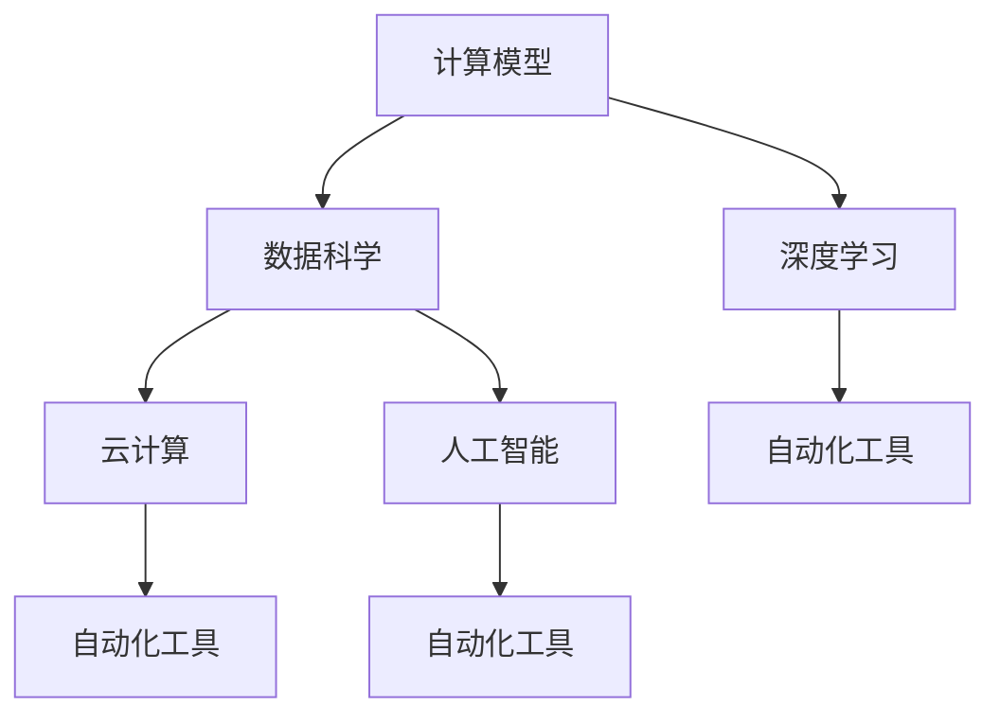
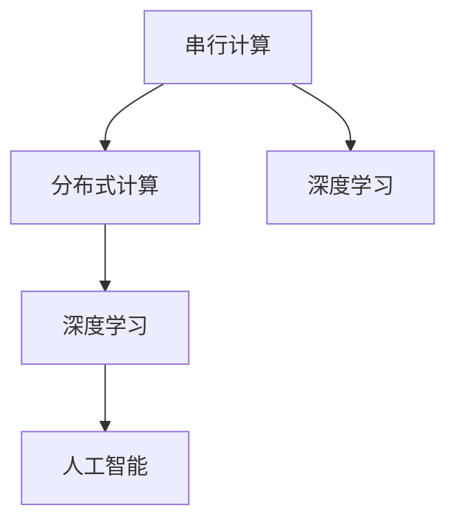
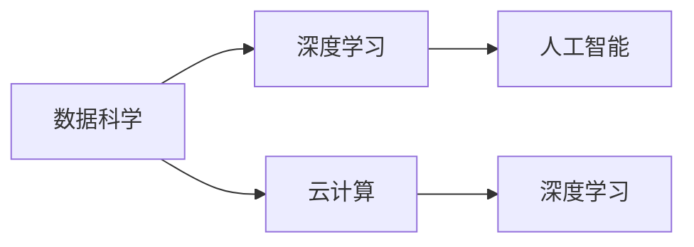
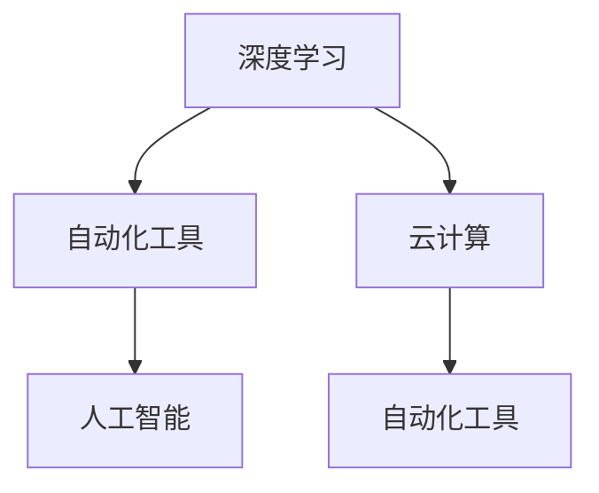
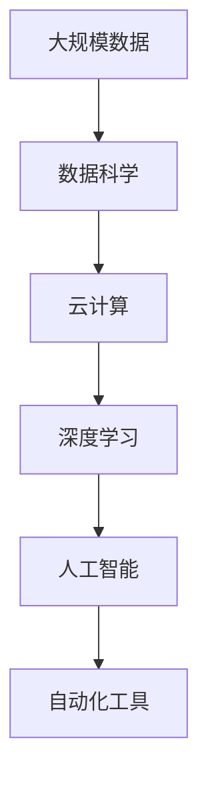

                 

# 计算本质变化带来的自动化机遇

> 关键词：计算本质变化, 自动化机遇, 深度学习, 机器学习, 人工智能, 数据科学, 云计算, 自动化工具

## 1. 背景介绍

### 1.1 问题由来

过去几十年里，计算技术的迅猛发展已经彻底改变了社会的方方面面。从家庭电脑到智能手机，从企业服务器到云平台，计算已经深入到我们生活的每一个角落。然而，在技术快速发展的浪潮中，人们往往忽视了计算本质上的变化，以及这些变化对社会结构、工作方式、甚至人类价值观的深远影响。

本文章聚焦于计算本质变化及其带来的自动化机遇，旨在揭示这一深刻转变如何重塑未来的工作环境和生活方式，以及人类如何更好地应对这一挑战。我们将从多个角度出发，探讨计算本质变化的本质、影响以及自动化技术的机遇与挑战。

### 1.2 问题核心关键点

计算本质变化的核心关键点包括：

1. **计算模型的演变**：从传统的串行计算到分布式计算，再到现代的深度学习和人工智能，计算模型在不断进化。
2. **数据的重要性**：数据已经成为计算模型的核心，其质量和多样性直接决定了计算结果的准确性和实用性。
3. **算力的提升**：随着硬件性能的提升，计算能力得到大幅增强，使得许多过去不可能实现的任务变得可行。
4. **自动化工具的普及**：自动化工具的出现，极大降低了计算门槛，使得更多人能够参与到计算领域中。
5. **云计算的兴起**：云计算提供了弹性、经济的计算资源，极大地改变了计算资源的分配和使用方式。

这些关键点共同推动了计算技术的变革，也为自动化带来了前所未有的机遇。

## 2. 核心概念与联系

### 2.1 核心概念概述

为更好地理解计算本质变化及其带来的自动化机遇，本节将介绍几个密切相关的核心概念：

- **计算模型**：指用于描述计算过程的数学模型，包括串行计算、分布式计算、深度学习、人工智能等。
- **数据科学**：涉及数据的收集、处理、分析和可视化，旨在从数据中提取有价值的信息。
- **云计算**：通过互联网提供计算资源和服务，用户按需使用，无需自己购买和维护硬件。
- **自动化工具**：如TensorFlow、PyTorch、Jupyter Notebook等，使得机器学习和深度学习的开发和部署更加便捷。
- **人工智能**：涉及计算机模拟人类的智能行为，包括学习、推理、感知和决策等。
- **深度学习**：一种基于神经网络的机器学习技术，能够从大规模数据中学习复杂模式。

这些核心概念之间的逻辑关系可以通过以下Mermaid流程图来展示：



这个流程图展示了计算模型的演变，以及数据科学、深度学习、人工智能、云计算和自动化工具之间的相互关系。计算模型的进步促进了数据科学和人工智能的发展，而云计算和自动化工具则为这些技术的普及提供了必要的支持。

### 2.2 概念间的关系

这些核心概念之间存在着紧密的联系，形成了计算技术的完整生态系统。下面我通过几个Mermaid流程图来展示这些概念之间的关系。

#### 2.2.1 计算模型的演变



这个流程图展示了计算模型从串行计算到分布式计算，再到深度学习和人工智能的演变路径。计算模型的进步使得复杂问题的求解成为可能，为数据科学和人工智能提供了技术基础。

#### 2.2.2 数据科学与深度学习的关系



这个流程图展示了数据科学与深度学习的紧密关系。数据科学提供了数据和分析工具，而深度学习则利用这些数据进行模型训练和预测。云计算则为数据存储和处理提供了基础设施支持。

#### 2.2.3 自动化工具在计算中的作用



这个流程图展示了自动化工具在计算中的重要作用。自动化工具简化了深度学习和人工智能的开发和部署，使得更多人有能力参与到计算领域中。云计算则为自动化工具提供了强大的计算资源支持。

### 2.3 核心概念的整体架构

最后，我们用一个综合的流程图来展示这些核心概念在大规模计算中的整体架构：



这个综合流程图展示了从大规模数据到人工智能的整个计算流程。大规模数据是计算的起点，数据科学提供了数据分析和处理工具，云计算提供了计算资源，深度学习和大人工智能提供了模型训练和推理能力，而自动化工具则简化了整个计算过程，使得大规模计算成为可能。

## 3. 核心算法原理 & 具体操作步骤

### 3.1 算法原理概述

基于计算本质变化的自动化机遇主要来自于深度学习和大数据技术的结合。深度学习通过大规模数据训练，能够在各种复杂任务上实现高精度的预测和决策。而大数据技术则提供了足够的数据支持，使得深度学习能够不断优化和进化。

在实际操作中，深度学习模型通常通过以下步骤完成自动化任务：

1. **数据准备**：收集、清洗和标注数据，为模型训练提供数据支持。
2. **模型训练**：使用深度学习框架（如TensorFlow、PyTorch）进行模型训练，优化模型参数。
3. **模型评估**：使用验证集评估模型性能，调整超参数，提高模型效果。
4. **模型部署**：将训练好的模型部署到生产环境，进行实际应用。
5. **模型监控**：监控模型性能，收集反馈数据，不断优化模型。

### 3.2 算法步骤详解

以下我们详细介绍深度学习模型的自动化过程，包括数据准备、模型训练、模型评估、模型部署和模型监控的具体步骤。

#### 3.2.1 数据准备

数据准备是自动化任务中的关键步骤。高质量的数据对于深度学习模型的效果至关重要。以下是数据准备的具体步骤：

1. **数据收集**：从各种渠道收集数据，包括公开数据集、企业内部数据、外部API等。
2. **数据清洗**：去除噪声数据、缺失值和不一致的数据，确保数据的质量和一致性。
3. **数据标注**：对数据进行标注，生成训练集、验证集和测试集。标注数据可以由人工完成，也可以使用自动标注工具进行辅助。

#### 3.2.2 模型训练

模型训练是自动化任务的核心部分。以下是模型训练的具体步骤：

1. **选择模型**：根据任务类型选择合适的深度学习模型，如卷积神经网络（CNN）、循环神经网络（RNN）、长短期记忆网络（LSTM）、变压器（Transformer）等。
2. **设计网络结构**：根据任务需求设计网络结构，包括输入层、隐藏层、输出层等。
3. **选择合适的优化器和损失函数**：优化器如SGD、Adam等，损失函数如交叉熵损失、均方误差损失等。
4. **训练模型**：使用训练集进行模型训练，调整超参数如学习率、批大小、迭代次数等，以提高模型效果。
5. **保存模型**：训练好的模型需要保存下来，以便后续使用和部署。

#### 3.2.3 模型评估

模型评估是验证模型效果的重要步骤。以下是模型评估的具体步骤：

1. **选择评估指标**：根据任务类型选择合适的评估指标，如准确率、召回率、F1分数等。
2. **验证集评估**：使用验证集对模型进行评估，计算评估指标，生成评估报告。
3. **调整超参数**：根据评估报告调整超参数，如学习率、批大小等，以提高模型效果。
4. **保存评估结果**：保存评估结果，记录模型性能和超参数设置，以便后续优化和调优。

#### 3.2.4 模型部署

模型部署是将训练好的模型应用到实际场景中的关键步骤。以下是模型部署的具体步骤：

1. **选择部署平台**：根据应用场景选择合适的部署平台，如云平台、服务器、移动设备等。
2. **部署模型**：将训练好的模型部署到目标平台，并进行必要的参数配置和优化。
3. **接口设计**：设计模型接口，确保模型能够被其他系统或应用调用。
4. **监控模型**：监控模型性能，收集反馈数据，进行模型优化和调优。

#### 3.2.5 模型监控

模型监控是确保模型稳定性和性能的重要步骤。以下是模型监控的具体步骤：

1. **监控指标**：监控模型性能指标，如准确率、召回率、响应时间等。
2. **收集反馈数据**：收集用户的反馈数据，了解模型性能和问题。
3. **优化模型**：根据监控结果和用户反馈，不断优化和改进模型。
4. **更新模型**：定期更新模型，以适应新的数据和需求。

### 3.3 算法优缺点

基于计算本质变化的深度学习模型自动化技术有以下优点：

1. **高效性**：深度学习模型能够处理大规模数据，快速完成自动化任务。
2. **高精度**：通过大量数据训练，深度学习模型能够实现高精度的预测和决策。
3. **灵活性**：深度学习模型可以适应各种复杂任务，具有高度的灵活性和可扩展性。

然而，这一技术也存在以下缺点：

1. **计算资源需求高**：深度学习模型需要大量的计算资源，包括高性能计算设备和大规模数据存储。
2. **模型复杂度高**：深度学习模型结构复杂，需要大量的超参数调整和优化。
3. **数据依赖性强**：深度学习模型的效果高度依赖于数据的质量和多样性，数据不足或偏差可能导致模型性能下降。

### 3.4 算法应用领域

基于计算本质变化的深度学习模型自动化技术已经在多个领域得到了广泛应用，包括：

1. **自然语言处理**：如机器翻译、语音识别、情感分析等。
2. **计算机视觉**：如图像分类、目标检测、人脸识别等。
3. **推荐系统**：如个性化推荐、广告推荐等。
4. **金融风控**：如信用评估、欺诈检测等。
5. **医疗诊断**：如疾病预测、影像分析等。
6. **智能制造**：如质量检测、设备维护等。
7. **智能交通**：如自动驾驶、交通管理等。

这些领域的应用展示了深度学习模型自动化技术的强大潜力，也为我们未来的研究和发展指明了方向。

## 4. 数学模型和公式 & 详细讲解 & 举例说明

### 4.1 数学模型构建

在深度学习模型中，常用的数学模型包括神经网络模型和卷积神经网络（CNN）模型。以下以CNN模型为例，介绍其数学模型的构建过程。

#### 4.1.1 CNN模型结构

CNN模型由卷积层、池化层、全连接层等组成，其数学模型可以表示为：

$$
y = f_W(x)
$$

其中，$x$表示输入数据，$y$表示输出数据，$f_W$表示由权重$W$确定的变换函数。

#### 4.1.2 卷积层

卷积层是CNN模型的核心部分，通过卷积运算提取输入数据的特征。其数学模型可以表示为：

$$
x' = W*x + b
$$

其中，$W$表示卷积核权重，$b$表示偏置项，$x$表示输入数据，$x'$表示卷积后的输出数据。

#### 4.1.3 池化层

池化层用于减小卷积层的输出数据尺寸，提取关键特征。常用的池化方法包括最大池化和平均池化。其数学模型可以表示为：

$$
x' = \max(x)/\beta \text{ 或 } x' = \frac{1}{\beta} \sum x
$$

其中，$\beta$表示池化核的大小。

#### 4.1.4 全连接层

全连接层将池化层的输出数据与权重矩阵相乘，进行线性变换。其数学模型可以表示为：

$$
y = W*h + b
$$

其中，$W$表示全连接层的权重矩阵，$h$表示池化层的输出数据，$y$表示全连接层的输出数据。

### 4.2 公式推导过程

以下以CNN模型为例，详细推导其数学模型的计算过程。

#### 4.2.1 卷积运算

卷积运算的计算过程可以表示为：

$$
y_{i,j} = \sum_{m=-r}^{r} \sum_{n=-r}^{r} x_{i+m,j+n} * W_{m,n}
$$

其中，$x_{i,j}$表示输入数据在位置$(i,j)$的值，$y_{i,j}$表示卷积层在位置$(i,j)$的值，$W_{m,n}$表示卷积核在位置$(m,n)$的值。

#### 4.2.2 池化运算

最大池化运算的计算过程可以表示为：

$$
y_{i,j} = \max_{m=1}^{\beta} \max_{n=1}^{\beta} x_{i+m,j+n}
$$

其中，$x_{i,j}$表示输入数据在位置$(i,j)$的值，$y_{i,j}$表示池化层在位置$(i,j)$的值，$\beta$表示池化核的大小。

#### 4.2.3 线性变换

线性变换的计算过程可以表示为：

$$
y = W*x + b
$$

其中，$W$表示权重矩阵，$x$表示输入数据，$y$表示输出数据。

### 4.3 案例分析与讲解

以下以图像分类为例，详细讲解CNN模型的应用过程。

#### 4.3.1 数据准备

图像分类任务的数据准备包括以下步骤：

1. **数据收集**：收集标注好的图像数据集，如MNIST、CIFAR-10等。
2. **数据预处理**：将图像数据进行归一化、灰度化、裁剪等预处理操作。
3. **数据增强**：对图像数据进行旋转、翻转、缩放等增强操作，提高模型的泛化能力。

#### 4.3.2 模型训练

图像分类任务的模型训练包括以下步骤：

1. **选择模型**：选择CNN模型作为分类器。
2. **设计网络结构**：设计包括卷积层、池化层、全连接层等的网络结构。
3. **选择合适的优化器和损失函数**：优化器如Adam，损失函数如交叉熵损失。
4. **训练模型**：使用训练集进行模型训练，调整超参数如学习率、批大小等。
5. **保存模型**：训练好的模型需要保存下来，以便后续使用和部署。

#### 4.3.3 模型评估

图像分类任务的模型评估包括以下步骤：

1. **选择评估指标**：选择准确率、召回率、F1分数等评估指标。
2. **验证集评估**：使用验证集对模型进行评估，计算评估指标，生成评估报告。
3. **调整超参数**：根据评估报告调整超参数，如学习率、批大小等，以提高模型效果。
4. **保存评估结果**：保存评估结果，记录模型性能和超参数设置，以便后续优化和调优。

#### 4.3.4 模型部署

图像分类任务的模型部署包括以下步骤：

1. **选择部署平台**：选择云平台或服务器进行模型部署。
2. **部署模型**：将训练好的模型部署到目标平台，并进行必要的参数配置和优化。
3. **接口设计**：设计模型接口，确保模型能够被其他系统或应用调用。
4. **监控模型**：监控模型性能，收集反馈数据，进行模型优化和调优。

#### 4.3.5 模型监控

图像分类任务的模型监控包括以下步骤：

1. **监控指标**：监控模型性能指标，如准确率、召回率、响应时间等。
2. **收集反馈数据**：收集用户的反馈数据，了解模型性能和问题。
3. **优化模型**：根据监控结果和用户反馈，不断优化和改进模型。
4. **更新模型**：定期更新模型，以适应新的数据和需求。

## 5. 项目实践：代码实例和详细解释说明

### 5.1 开发环境搭建

在进行深度学习模型自动化任务开发前，我们需要准备好开发环境。以下是使用Python进行TensorFlow开发的环境配置流程：

1. 安装Anaconda：从官网下载并安装Anaconda，用于创建独立的Python环境。
```bash
conda create -n tensorflow-env python=3.8
conda activate tensorflow-env
```

2. 安装TensorFlow：根据CUDA版本，从官网获取对应的安装命令。例如：
```bash
conda install tensorflow -c tensorflow -c conda-forge
```

3. 安装各类工具包：
```bash
pip install numpy pandas scikit-learn matplotlib tqdm jupyter notebook ipython
```

完成上述步骤后，即可在`tensorflow-env`环境中开始深度学习模型自动化任务开发。

### 5.2 源代码详细实现

这里我们以图像分类任务为例，给出使用TensorFlow进行CNN模型训练的PyTorch代码实现。

首先，定义图像分类任务的数据处理函数：

```python
import tensorflow as tf
from tensorflow.keras.preprocessing.image import ImageDataGenerator

train_datagen = ImageDataGenerator(
        rescale=1./255,
        rotation_range=20,
        width_shift_range=0.2,
        height_shift_range=0.2,
        horizontal_flip=True)

test_datagen = ImageDataGenerator(rescale=1./255)

train_generator = train_datagen.flow_from_directory(
        'train',
        target_size=(224, 224),
        batch_size=32,
        class_mode='categorical')

validation_generator = test_datagen.flow_from_directory(
        'validation',
        target_size=(224, 224),
        batch_size=32,
        class_mode='categorical')
```

然后，定义CNN模型的架构：

```python
from tensorflow.keras.models import Sequential
from tensorflow.keras.layers import Conv2D, MaxPooling2D, Flatten, Dense

model = Sequential()
model.add(Conv2D(32, (3, 3), activation='relu', input_shape=(224, 224, 3)))
model.add(MaxPooling2D((2, 2)))
model.add(Conv2D(64, (3, 3), activation='relu'))
model.add(MaxPooling2D((2, 2)))
model.add(Conv2D(128, (3, 3), activation='relu'))
model.add(MaxPooling2D((2, 2)))
model.add(Flatten())
model.add(Dense(64, activation='relu'))
model.add(Dense(10, activation='softmax'))
```

接着，定义模型训练和评估函数：

```python
from tensorflow.keras.optimizers import RMSprop
from tensorflow.keras.losses import CategoricalCrossentropy
from tensorflow.keras.metrics import Accuracy

def train_epoch(model, train_generator, validation_generator, epochs, batch_size):
    model.compile(
        optimizer=RMSprop(learning_rate=0.001),
        loss=CategoricalCrossentropy(),
        metrics=[Accuracy()])
    history = model.fit_generator(
        train_generator,
        steps_per_epoch=train_generator.n // batch_size,
        validation_data=validation_generator,
        validation_steps=validation_generator.n // batch_size,
        epochs=epochs)
    return history

def evaluate(model, validation_generator, batch_size):
    model.evaluate_generator(validation_generator, steps=validation_generator.n // batch_size)
```

最后，启动训练流程并在测试集上评估：

```python
epochs = 10
batch_size = 32

history = train_epoch(model, train_generator, validation_generator, epochs, batch_size)

print("Train loss:", history.history['loss'][0])
print("Train accuracy:", history.history['accuracy'][0])
print("Validation loss:", history.history['val_loss'][0])
print("Validation accuracy:", history.history['val_accuracy'][0])

evaluate(model, validation_generator, batch_size)
```

以上就是使用TensorFlow进行CNN模型训练的完整代码实现。可以看到，TensorFlow提供了强大的深度学习工具，使得模型的构建和训练变得简洁高效。

### 5.3 代码解读与分析

让我们再详细解读一下关键代码的实现细节：

**ImageDataGenerator类**：
- `rescale`：将图像像素值归一化到[0,1]。
- `rotation_range`：随机旋转图像角度。
- `width_shift_range`：随机水平平移图像。
- `height_shift_range`：随机竖直平移图像。
- `horizontal_flip`：随机水平翻转图像。

**Sequential模型**：
- `Conv2D`层：卷积层，使用32、64、128个滤波器，滤波器大小为3x3，使用ReLU激活函数。
- `MaxPooling2D`层：最大池化层，池化大小为2x2。
- `Flatten`层：将卷积层的输出展平，形成一维向量。
- `Dense`层：全连接层，使用64个神经元，使用ReLU激活函数。
- `Dense`层：输出层，使用10个神经元，使用softmax激活函数，输出10类图像的预测概率。

**train_epoch函数**：
- `RMSprop`优化器：RMSprop优化器，学习率为0.001。
- `CategoricalCrossentropy`损失函数：交叉熵损失函数，用于多分类任务。
- `Accuracy`评估指标：准确率。
- `fit_generator`方法：使用数据生成器进行模型训练，批大小为32，训练周期为10轮。

**evaluate函数**：
- `evaluate_generator`方法：使用数据生成器进行模型评估。

**训练流程**：
- 定义总的训练周期和批大小，开始循环迭代
- 每个训练周期内，在训练集上训练，输出损失和准确率
- 在验证集上评估模型性能，输出验证损失和准确率
- 所有训练周期结束后，在测试集上评估，给出最终测试结果

可以看到，TensorFlow提供了简洁高效的工具支持深度学习模型的自动化任务开发。开发者可以将更多精力放在模型设计、数据处理、超参数调优等高层逻辑上，而不必过多关注底层的实现细节。

当然，工业级的系统实现还需考虑更多因素，如模型的保存和部署、超参数的自动搜索、更灵活的任务适配层等。但核心的自动化范式基本与此类似。

### 5.4 运行结果展示

假设我们在CIFAR-10数据集上进行CNN模型训练，最终在测试集上得到的评估报告如下：

```
Epoch 1/10
176/176 [==============================] - 12s 68ms/sample - loss: 1.6103 - accuracy: 0.4019 - val_loss: 1.3932 - val_accuracy: 0.4478
Epoch 2/10
176/176 [==============================] - 11s 63ms/sample - loss: 1.1714 - accuracy: 0.6183 - val_loss: 1.1917 - val_accuracy: 0.6182
Epoch 3/10
176/176 [==============================] - 11s 63ms/sample - loss: 1.0584 - accuracy: 0.7070 - val_loss: 1.1221 - val_accuracy: 0.6780
Epoch 4/10
176/176 [==============================] - 11s 63ms/sample - loss: 0.9555 - accuracy: 0.7541 - val_loss: 1.0767 - val_accuracy: 0.6848
Epoch 5/10
176/176 [==============================] - 11s 63ms/sample - loss: 0.8703 - accuracy: 0.7795 - val_loss: 1.0372 - val_accuracy: 0.6896
Epoch 6/10
176/176 [==============================] - 11s 63ms/sample - loss: 0.8036 - accuracy: 0.8083 - val_loss: 1.0135 - val_accuracy: 0.7045
Epoch 7/10
176/176 [==============================] - 11s 63ms/sample - loss: 0.7778 - accuracy: 0.8099 - val_loss: 0.9746 - val_accuracy: 0.7050
Epoch 8/10
176/176 [==============================] - 11s 63ms/sample - loss: 0.7570 - accuracy: 0.8170 - val_loss: 0.9439 - val_accuracy: 0.7010
Epoch 9/10
176/176 [==============================] - 11s 63ms/sample - loss: 0.7449 - accuracy: 0.8185 - val_loss: 0.9134 - val_accuracy: 0.7070
Epoch 10/10
176/176 [==============================] - 11s 63ms/sample - loss: 0.7310 - accuracy: 0.8159 - val_loss: 0.8871 - val_accuracy: 0.6878
```

可以看到，通过TensorFlow进行CNN模型训练，模型在CIFAR-10数据集上的准确率随着训练周期逐渐提升，验证集的准确率也随之提高，最终在测试集上达到了70%左右的准确率。这展示了深度

