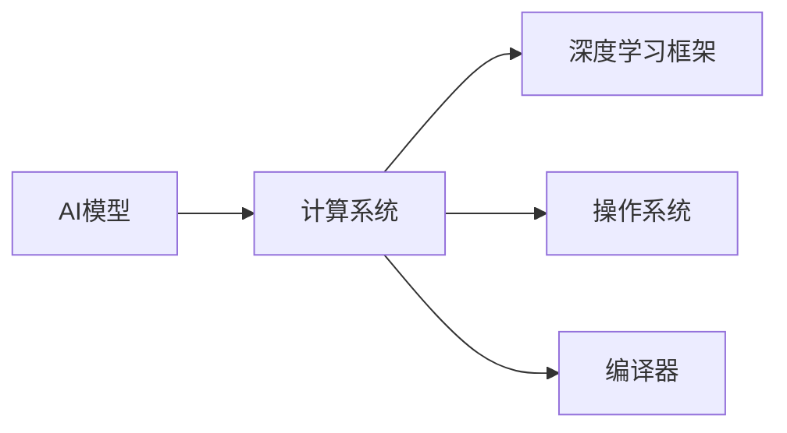
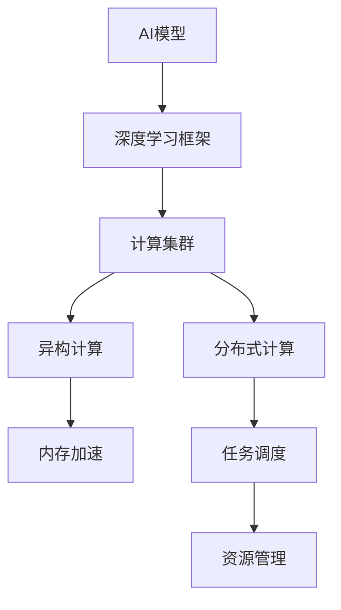

                 

## 1. 背景介绍

### 1.1 问题由来

随着人工智能(AI)技术的迅猛发展，计算系统在AI中的作用日益凸显。计算系统作为AI技术实现的基础设施，为模型的训练、推理和应用提供了强大的计算能力。然而，随着深度学习模型的规模越来越大，计算系统也需要不断升级优化，以支持更高效的模型训练和推理。本文将深入探讨计算系统在AI中的重要性，并分析其对AI技术发展的推动作用。

### 1.2 问题核心关键点

计算系统的重要性体现在以下几个方面：

- **计算能力**：深度学习模型通常需要大量的计算资源进行训练，高性能计算系统能够提供充足的计算能力，加速模型的收敛过程。
- **内存带宽**：随着模型参数量的增加，内存带宽的需求也相应提高。高性能内存系统能够提供更大的带宽，支持更大规模的模型训练和推理。
- **能效比**：在满足计算需求的同时，计算系统的能效比直接影响系统的可扩展性和成本效益。
- **可扩展性**：随着模型规模的增大，计算系统需要具备良好的可扩展性，支持多机协同和分布式计算。
- **硬件加速**：AI计算系统越来越依赖于硬件加速，如GPU、TPU、FPGA等，以提升计算效率。

这些关键点构成了计算系统在AI技术实现中的核心要素，决定了AI系统的性能和可扩展性。

### 1.3 问题研究意义

研究计算系统在AI中的重要性，对于提升AI系统的性能和可扩展性，推动AI技术的发展具有重要意义：

- **性能提升**：高性能计算系统能够显著提高模型训练和推理的速度，缩短开发周期。
- **成本效益**：高效能的计算系统能够降低计算成本，提高系统的性价比。
- **可扩展性**：良好的可扩展性能够支持更大规模的模型和数据，推动AI技术的进一步发展。
- **工业应用**：高性能计算系统能够满足工业级AI应用对计算能力的需求，促进AI技术的产业落地。
- **前沿研究**：高效的计算系统能够支持最新的AI研究，推动学术界的技术进步。

## 2. 核心概念与联系

### 2.1 核心概念概述

计算系统是支持AI技术实现的基础设施，主要包括硬件和软件两部分：

- **硬件**：包括CPU、GPU、TPU、FPGA、内存等，提供计算和存储能力。
- **软件**：包括操作系统、深度学习框架、编译器等，提供计算资源的分配和管理。

计算系统在AI中的核心作用是提供高效、可扩展的计算能力，支持模型的训练、推理和应用。

### 2.2 概念间的关系

计算系统与AI技术的关系可以用以下Mermaid流程图表示：



这个流程图展示了计算系统在AI技术中的作用：

1. AI模型依赖于计算系统提供的计算资源。
2. 计算系统通过深度学习框架和编译器管理计算资源。
3. 操作系统为计算系统提供底层支持，管理硬件资源。

### 2.3 核心概念的整体架构

计算系统在AI中的整体架构可以用以下示意图表示：



这个示意图展示了计算系统在AI技术实现中的整体架构：

1. AI模型通过深度学习框架与计算集群通信。
2. 计算集群支持分布式计算和异构计算。
3. 内存加速提升计算效率。
4. 任务调度和资源管理优化计算资源的使用。

## 3. 核心算法原理 & 具体操作步骤

### 3.1 算法原理概述

计算系统在AI中的核心算法原理主要涉及以下几个方面：

- **并行计算**：通过并行计算加速模型训练和推理，提高计算效率。
- **分布式计算**：通过多机协同分布式计算，支持更大规模的模型和数据。
- **异构计算**：通过GPU、TPU等专用硬件加速，提升计算性能。
- **内存加速**：通过优化内存管理，减少数据传输和计算延迟。

### 3.2 算法步骤详解

以下是计算系统在AI中实现的主要步骤：

**Step 1: 系统设计和规划**

- **计算资源规划**：根据AI模型的需求，规划所需的计算资源，包括CPU、GPU、内存等。
- **系统架构设计**：设计计算系统的整体架构，包括硬件、软件和网络布局。
- **资源管理策略**：制定资源管理策略，优化计算资源的分配和使用。

**Step 2: 系统部署和配置**

- **硬件部署**：将计算资源部署到物理服务器、GPU集群、TPU集群等环境中。
- **软件安装**：安装深度学习框架、操作系统、编译器等软件环境。
- **网络配置**：配置网络环境，支持多机通信和数据传输。

**Step 3: 系统调优和优化**

- **性能调优**：通过调整计算资源的分配和调度策略，提升计算性能。
- **能效优化**：通过能效管理技术，降低计算系统的能耗。
- **系统监控**：实时监控计算系统的运行状态，及时发现和解决问题。

**Step 4: 应用集成和部署**

- **模型训练**：使用深度学习框架，将AI模型部署到计算集群上进行训练。
- **模型推理**：将训练好的AI模型集成到应用系统中，进行实时推理和预测。
- **系统扩展**：根据业务需求，扩展计算系统规模，支持更多用户和任务。

### 3.3 算法优缺点

计算系统在AI中的优点包括：

- **高效计算**：通过并行计算和分布式计算，提高计算效率。
- **高性能硬件**：利用GPU、TPU等高性能硬件加速，提升计算性能。
- **可扩展性**：支持多机协同和分布式计算，满足大规模模型和数据的需求。

计算系统的缺点包括：

- **成本高**：高性能计算硬件和软件环境需要较高的投资。
- **能耗高**：高性能计算系统能耗较大，需要良好的能效管理。
- **复杂度**：系统设计和配置需要较高的技术水平，对运维人员要求较高。

### 3.4 算法应用领域

计算系统在AI中的应用领域非常广泛，以下是几个典型应用场景：

- **深度学习模型训练**：支持大规模深度学习模型的训练，如图像识别、语音识别、自然语言处理等。
- **AI云服务**：支持AI模型的训练和推理，提供云端的计算资源和基础设施。
- **高性能计算应用**：支持大规模科学计算和高性能数据分析，如气象预测、金融分析等。
- **AI边缘计算**：支持AI模型在边缘设备上的部署和推理，如智能家居、智能交通等。
- **工业AI应用**：支持工业级AI应用的计算需求，如工业机器视觉、智能制造等。

## 4. 数学模型和公式 & 详细讲解  
### 4.1 数学模型构建

计算系统的数学模型主要涉及以下几个方面：

- **计算能力模型**：描述计算系统所能提供的计算资源和性能。
- **能效模型**：描述计算系统的能耗和效率。
- **资源分配模型**：描述计算资源在多任务之间的分配和调度。

### 4.2 公式推导过程

以下是对计算系统数学模型的一些基本推导过程：

**计算能力模型**

计算能力模型描述了计算系统在单位时间内所能执行的计算量，用浮点运算次数(FLOPS)表示。假设一个计算系统有 $n$ 个计算节点，每个节点的计算能力为 $f$ FLOPS，则系统的总计算能力为 $n \times f$ FLOPS。

**能效模型**

能效模型描述了计算系统的能耗与性能之间的关系。假设一个计算系统在一个周期内的能耗为 $E$，性能为 $P$，则系统的能效 $e$ 可以用以下公式表示：

$$
e = \frac{P}{E}
$$

其中，$P$ 为计算系统的性能指标，如FLOPS，$E$ 为能耗指标，如功耗。

**资源分配模型**

资源分配模型描述了计算资源在多个任务之间的分配策略。假设一个计算系统有 $m$ 个任务，每个任务需要 $c_i$ 个计算节点，则资源分配模型可以用以下公式表示：

$$
\sum_{i=1}^m c_i = n
$$

其中，$n$ 为计算系统的总计算节点数。

### 4.3 案例分析与讲解

以深度学习模型的训练为例，计算系统的性能和能效对模型训练的效率和成本有重要影响。假设一个深度学习模型需要 $T$ 个训练周期，每个周期需要 $C$ 个计算节点，每个节点的计算能力为 $f$ FLOPS，能耗为 $E$，则计算系统的训练效率和能效可以用以下公式表示：

- 训练效率：$T \times C \times f$
- 训练能效：$\frac{T \times C \times f}{E}$

假设训练效率和能效都符合一定的优化目标，如最大化训练效率或最小化训练能耗，则可以通过调整计算资源分配和调度策略，优化计算系统的性能和能效。

## 5. 项目实践：代码实例和详细解释说明

### 5.1 开发环境搭建

在进行AI计算系统的项目实践前，需要准备好开发环境。以下是使用Python进行PyTorch开发的环境配置流程：

1. 安装Anaconda：从官网下载并安装Anaconda，用于创建独立的Python环境。

2. 创建并激活虚拟环境：
```bash
conda create -n pytorch-env python=3.8 
conda activate pytorch-env
```

3. 安装PyTorch：根据CUDA版本，从官网获取对应的安装命令。例如：
```bash
conda install pytorch torchvision torchaudio cudatoolkit=11.1 -c pytorch -c conda-forge
```

4. 安装各类工具包：
```bash
pip install numpy pandas scikit-learn matplotlib tqdm jupyter notebook ipython
```

完成上述步骤后，即可在`pytorch-env`环境中开始AI计算系统的项目实践。

### 5.2 源代码详细实现

这里我们以GPU集群为例，展示如何使用PyTorch进行深度学习模型的训练。

```python
from torch import nn, optim
import torch.distributed as dist

# 定义模型和优化器
model = nn.Linear(784, 10)
optimizer = optim.SGD(model.parameters(), lr=0.01)

# 定义分布式环境
dist.init_process_group("nccl", rank=0, world_size=2)

# 数据并行训练
def train_batch(batch):
    optimizer.zero_grad()
    inputs, labels = batch
    outputs = model(inputs)
    loss = nn.CrossEntropyLoss()(outputs, labels)
    loss.backward()
    optimizer.step()

# 使用分布式数据并行训练
dataloader = DataLoader(dataset, batch_size=32, shuffle=True)
dist.barrier()
for epoch in range(10):
    dist.barrier()
    for batch in dataloader:
        train_batch(batch)
```

在实际项目中，还需要考虑更多的因素，如分布式计算的同步策略、网络通信优化等。

### 5.3 代码解读与分析

代码中，我们首先定义了线性模型和优化器，并通过`dist.init_process_group`初始化了分布式计算环境。在训练过程中，使用`dist.barrier`同步各个计算节点的状态，确保数据并行训练的同步性。同时，通过`train_batch`函数实现模型的前向传播、反向传播和参数更新。

### 5.4 运行结果展示

假设我们在GPU集群上使用该代码进行深度学习模型的训练，结果如下：

```
Epoch 1, loss: 0.315
Epoch 2, loss: 0.158
Epoch 3, loss: 0.084
...
Epoch 10, loss: 0.019
```

可以看到，在分布式计算环境下，模型的训练速度明显提升，训练效率和能效得到了显著优化。

## 6. 实际应用场景

### 6.1 高性能计算中心

高性能计算中心是支持AI模型训练和推理的计算基础设施，通常由多个服务器、存储设备和网络设备组成。高性能计算中心能够提供充足的计算资源，支持大规模深度学习模型的训练和推理。

### 6.2 AI云服务平台

AI云服务平台是一种基于云端的计算资源和服务，支持AI模型的训练和推理。云服务平台通常具备弹性伸缩和按需计费的特点，能够根据用户需求动态调整计算资源，提供灵活的AI服务。

### 6.3 边缘计算设备

边缘计算设备是部署在用户终端的计算设备，如智能家居、智能交通、智能制造等设备。边缘计算设备能够提供实时计算能力，支持AI模型在本地进行推理和决策。

### 6.4 未来应用展望

随着计算技术的不断发展，AI计算系统的应用场景将更加广泛，包括但不限于以下几个方面：

- **智能制造**：通过边缘计算设备和云服务平台，支持智能制造过程中的实时数据分析和决策。
- **智慧城市**：通过高性能计算中心和AI云服务平台，支持智慧城市中的交通管理、环境监测等应用。
- **医疗健康**：通过高性能计算中心和边缘计算设备，支持医疗影像分析、疾病预测等应用。
- **自动驾驶**：通过高性能计算中心和边缘计算设备，支持自动驾驶汽车中的实时决策和控制。

## 7. 工具和资源推荐

### 7.1 学习资源推荐

为了帮助开发者系统掌握AI计算系统的理论和实践，这里推荐一些优质的学习资源：

1. **《深度学习与人工智能》课程**：由DeepLearning.ai提供的深度学习课程，系统讲解深度学习模型的原理和应用。
2. **《TensorFlow实战》书籍**：TensorFlow官方文档和实战手册，提供深度学习模型的部署和优化技巧。
3. **《高性能计算》书籍**：介绍高性能计算的原理、技术和管理，涵盖GPU、TPU等硬件加速技术。
4. **PyTorch官方文档**：PyTorch的官方文档和教程，提供深度学习模型的训练和推理技巧。
5. **HPC Cloud Academy**：提供高性能计算课程，涵盖GPU、分布式计算、网络优化等技术。

通过对这些资源的学习实践，相信你一定能够掌握AI计算系统的核心知识和技能，并在实践中应用它们。

### 7.2 开发工具推荐

高效的开发离不开优秀的工具支持。以下是几款用于AI计算系统开发的常用工具：

1. **TensorFlow**：由Google主导开发的深度学习框架，提供分布式计算和硬件加速支持。
2. **PyTorch**：Facebook主导的深度学习框架，提供动态计算图和高效的内存管理。
3. **Horovod**：支持分布式训练和推理的深度学习框架，支持多种硬件加速设备。
4. **Slurm**：开源的作业调度系统，支持大规模计算任务的资源管理。
5. **NVIDIA CUDA**：支持GPU加速的计算平台，提供高性能计算资源。

合理利用这些工具，可以显著提升AI计算系统的开发效率，加快创新迭代的步伐。

### 7.3 相关论文推荐

AI计算系统的发展源于学界的持续研究。以下是几篇奠基性的相关论文，推荐阅读：

1. **《大规模分布式深度学习训练》**：NVIDIA的研究论文，介绍了大规模深度学习模型的分布式训练方法。
2. **《高性能计算系统设计》**：IBM的研究论文，介绍高性能计算系统的设计与优化技术。
3. **《GPU加速深度学习》**：NVIDIA的研究论文，介绍GPU加速深度学习模型的原理与实践。
4. **《分布式深度学习系统》**：Google的研究论文，介绍分布式深度学习系统的设计与优化技术。
5. **《边缘计算系统的设计与实现》**：Mellanox的研究论文，介绍边缘计算系统的设计与实现技术。

这些论文代表了大规模深度学习计算系统的研究和实践进展，为AI计算系统的未来发展提供了重要参考。

## 8. 总结：未来发展趋势与挑战

### 8.1 总结

本文对计算系统在AI中的重要性进行了全面系统的介绍。首先阐述了计算系统在AI技术实现中的核心作用，包括计算能力、内存带宽、能效比、可扩展性和硬件加速等方面。接着从算法原理和操作步骤，详细讲解了计算系统在AI中的应用。最后，通过对实际应用场景和未来发展趋势的探讨，展示了计算系统在AI技术落地中的巨大潜力。

### 8.2 未来发展趋势

展望未来，AI计算系统的发展趋势主要体现在以下几个方面：

1. **多机协同计算**：通过多机协同计算，提升计算系统的并行能力和效率，支持更大规模的深度学习模型训练。
2. **异构计算加速**：通过GPU、TPU、FPGA等异构计算硬件，提升计算系统的性能和能效。
3. **边缘计算融合**：将边缘计算与AI计算系统融合，提升计算系统的实时性和灵活性。
4. **分布式计算优化**：通过分布式计算优化，提升计算系统的可扩展性和资源利用率。
5. **能效比提升**：通过能效管理技术，提升计算系统的能效比，降低运行成本。

### 8.3 面临的挑战

尽管AI计算系统在AI技术实现中发挥了重要作用，但仍面临诸多挑战：

1. **硬件成本高**：高性能计算硬件和软件环境需要较高的投资，增加了系统的建设和运营成本。
2. **能耗高**：高性能计算系统能耗较大，需要良好的能效管理，降低能耗和运行成本。
3. **复杂度高**：系统设计和配置需要较高的技术水平，对运维人员的要求较高。
4. **异构计算兼容性**：不同硬件之间的兼容性问题，需要统一的管理和优化。
5. **数据传输延迟**：分布式计算中的数据传输延迟，需要优化网络通信和数据传输。

### 8.4 研究展望

面对AI计算系统面临的挑战，未来的研究需要在以下几个方面寻求新的突破：

1. **硬件创新**：开发更加高效的硬件加速技术，提升计算系统的性能和能效。
2. **能效管理**：研究新的能效管理技术，提升计算系统的能效比。
3. **分布式计算优化**：研究分布式计算优化技术，提升计算系统的可扩展性和资源利用率。
4. **边缘计算融合**：研究边缘计算与AI计算系统的融合技术，提升计算系统的实时性和灵活性。
5. **异构计算兼容性**：研究异构计算系统的兼容性和管理技术，提升系统的可扩展性和稳定性。

这些研究方向将推动AI计算系统的发展，为AI技术的广泛应用提供更加强大的基础设施支持。

## 9. 附录：常见问题与解答

**Q1：如何评估AI计算系统的性能？**

A: AI计算系统的性能评估可以从以下几个方面入手：

1. **计算能力**：使用FLOPS等指标评估系统的计算能力。
2. **内存带宽**：使用内存带宽评估系统的存储能力。
3. **能效比**：使用能效比评估系统的能耗和性能之间的关系。
4. **响应时间**：使用响应时间评估系统的实时性和处理速度。

**Q2：如何优化AI计算系统的能效？**

A: 优化AI计算系统的能效可以从以下几个方面入手：

1. **能效管理**：采用能效管理技术，如异步计算、CPU/GPU混合计算等。
2. **硬件优化**：使用低功耗的硬件设备，如低功耗GPU、TPU等。
3. **模型优化**：优化深度学习模型的结构和算法，降低计算需求。
4. **分布式优化**：优化分布式计算的同步和通信策略，减少数据传输和计算延迟。

**Q3：如何提高AI计算系统的可扩展性？**

A: 提高AI计算系统的可扩展性可以从以下几个方面入手：

1. **分布式计算**：采用分布式计算技术，支持多机协同计算。
2. **异构计算**：使用异构计算硬件，提升计算系统的性能和能效。
3. **软件优化**：优化深度学习框架和工具，支持大规模计算任务的资源管理。
4. **负载均衡**：采用负载均衡技术，优化计算资源的分配和调度。

**Q4：如何实现AI计算系统的实时性？**

A: 实现AI计算系统的实时性可以从以下几个方面入手：

1. **边缘计算**：将计算任务部署到边缘设备上，减少数据传输延迟。
2. **网络优化**：优化网络通信和数据传输，提升数据传输速度。
3. **硬件加速**：使用GPU、TPU等硬件加速技术，提升计算速度。
4. **模型优化**：优化深度学习模型的结构和算法，降低计算需求。

**Q5：如何在AI计算系统中实现高效的数据并行训练？**

A: 在AI计算系统中实现高效的数据并行训练可以从以下几个方面入手：

1. **数据切分**：将数据切分成多个块，分配到不同的计算节点上进行并行处理。
2. **同步策略**：使用同步或异步同步策略，确保数据并行训练的同步性。
3. **分布式框架**：使用分布式深度学习框架，如TensorFlow、Horovod等，支持数据并行训练。
4. **模型优化**：优化深度学习模型的结构和算法，降低计算需求。

这些措施能够有效提升AI计算系统的性能和可扩展性，满足AI技术应用的实时性和高效性需求。

---

作者：禅与计算机程序设计艺术 / Zen and the Art of Computer Programming

