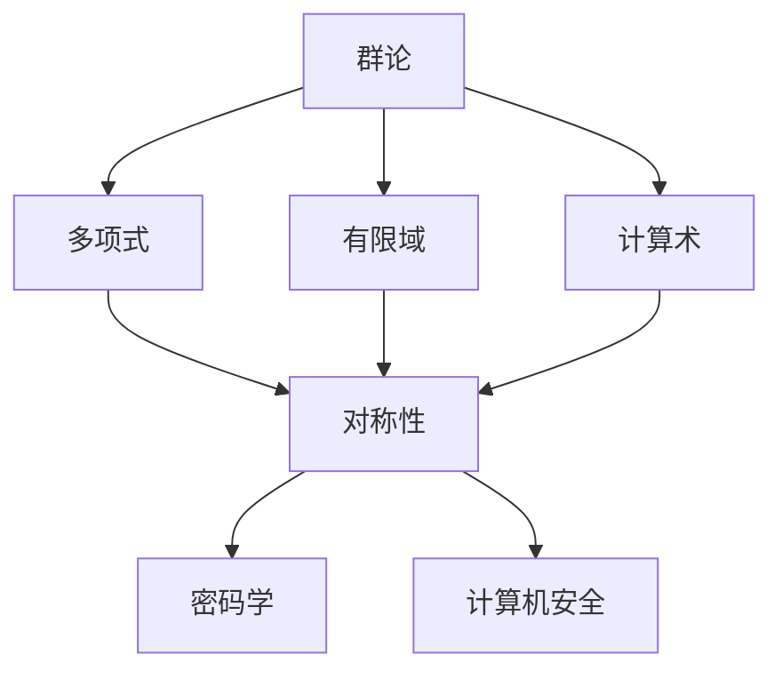
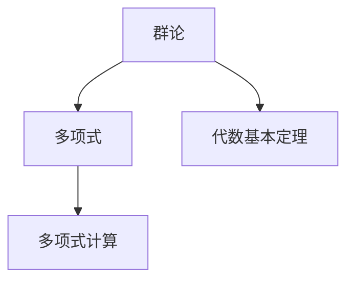
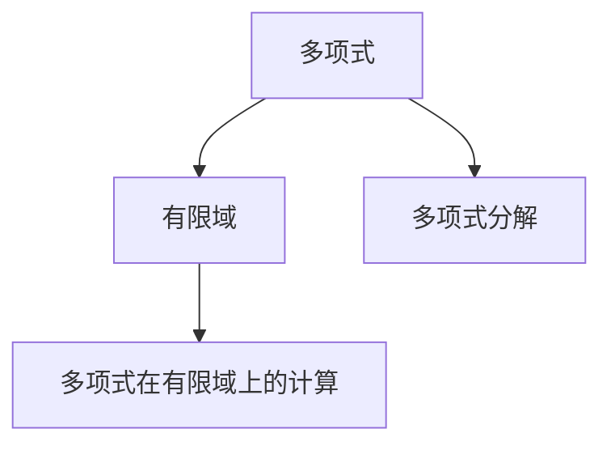
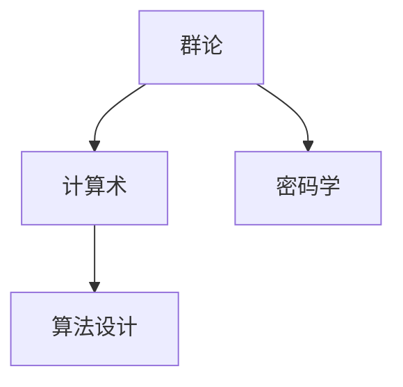
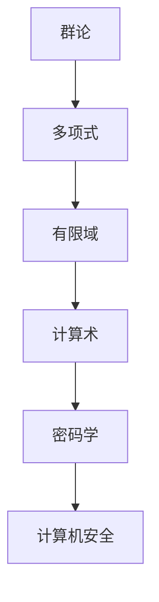

                 

# 计算：第一部分 计算的诞生 第 2 章 计算之术 伽罗瓦的遗珠

> 关键词：计算术, 伽罗瓦, 多项式, 群论, 计算理论

## 1. 背景介绍

### 1.1 问题由来

在数学和计算机科学的历史长河中，计算术（Arithmetics）的发展扮演了至关重要的角色。自1830年代以来，法国数学家艾米·艾米莉·勒内·夏尔·富凯·伽罗瓦（Évariste Galois）对计算术做出了开创性的贡献。尽管伽罗瓦英年早逝，但他的研究成果在后来被发展成为现代计算理论和算法的基础，因此被后人称为“计算之术的遗珠”。

### 1.2 问题核心关键点

伽罗瓦的遗珠主要体现在以下几个方面：

1. 伽罗瓦群的引入：伽罗瓦提出了群的概念，揭示了代数结构与计算术之间的深刻联系。
2. 多项式分解的算法：伽罗瓦开创了多项式在有限域上的分解算法，奠定了现代计算机科学的基础。
3. 对称性和代数基本定理：伽罗瓦发现对称性和代数基本定理，对现代计算理论和算法的发展产生了深远影响。

### 1.3 问题研究意义

伽罗瓦的遗珠不仅丰富了数学的理论基础，还对计算机科学和工程实践产生了深远的影响。他的研究推动了现代计算术的发展，为代数计算、离散数学和计算机科学等领域提供了坚实的理论支持。同时，伽罗瓦的思想和方法也为现代密码学、加密算法和计算机安全等应用提供了重要的理论工具。

## 2. 核心概念与联系

### 2.1 核心概念概述

为了更好地理解伽罗瓦的遗珠，本节将介绍几个密切相关的核心概念：

- 群论（Group Theory）：数学中的群论研究对称性和变换的性质，被广泛应用到密码学、计算术等领域。
- 多项式（Polynomial）：代数中基本的数学对象，广泛应用于算法设计、计算机科学等领域。
- 有限域（Finite Field）：具有有限元素的域，是计算机科学中重要的数学工具，用于多项式计算。
- 计算术（Arithmetics）：数学中关于计算的理论，研究算法和计算复杂性。
- 对称性（Symmetry）：几何学、物理学和数学中研究物体的对称性质，对现代加密算法和算法设计有重要影响。

这些核心概念之间的逻辑关系可以通过以下Mermaid流程图来展示：



这个流程图展示了群论、多项式、有限域和计算术之间的相互关系：

1. 群论研究对称性，而对称性是多项式和有限域的基石。
2. 多项式和有限域在计算术中有着广泛的应用。
3. 计算术与密码学和计算机安全密切相关。

### 2.2 概念间的关系

这些核心概念之间存在着紧密的联系，形成了计算术和代数计算的完整生态系统。下面我通过几个Mermaid流程图来展示这些概念之间的关系。

#### 2.2.1 群论与多项式的联系



这个流程图展示了群论与多项式计算之间的关系：

1. 群论研究对称性和变换，而代数基本定理揭示了多项式和群论之间的联系。
2. 基于代数基本定理，多项式可以表示为群作用的结果。

#### 2.2.2 多项式计算与有限域的关系



这个流程图展示了多项式计算与有限域之间的关系：

1. 多项式在有限域上可以进行分解和计算，而多项式分解是多项式计算的基础。
2. 有限域提供了计算的数学框架，使多项式计算得以实现。

#### 2.2.3 群论与计算术的关系



这个流程图展示了群论与计算术之间的关系：

1. 群论的对称性思想被广泛应用于算法设计和密码学中。
2. 计算术研究算法和计算复杂性，为群论的实际应用提供了理论基础。

### 2.3 核心概念的整体架构

最后，我们用一个综合的流程图来展示这些核心概念在大规模语言模型微调过程中的整体架构：



这个综合流程图展示了从群论到密码学和计算机安全之间的整体架构：

1. 群论提供对称性和变换的理论基础。
2. 多项式和有限域在计算术中得到广泛应用。
3. 计算术的发展推动了密码学和计算机安全技术的发展。

这些概念共同构成了计算术和代数计算的基础，使得伽罗瓦的遗珠得以深刻影响现代计算机科学的发展。通过理解这些核心概念，我们可以更好地把握计算术的理论基础和实际应用。

## 3. 核心算法原理 & 具体操作步骤
### 3.1 算法原理概述

伽罗瓦的研究成果主要集中在多项式计算和群论上，其贡献可以用群论和多项式的相互作用来概述。伽罗瓦的重要成果包括：

1. 伽罗瓦群（Galois Group）：伽罗瓦引入了群的概念，揭示了多项式解与对称性之间的关系。
2. 多项式分解算法：伽罗瓦开创了多项式在有限域上的分解算法，奠定了现代计算机科学的基础。
3. 代数基本定理：伽罗瓦发现对称性和代数基本定理，对现代计算理论和算法的发展产生了深远影响。

### 3.2 算法步骤详解

下面详细讲解伽罗瓦的多项式分解算法和代数基本定理的证明过程。

#### 3.2.1 多项式分解算法

多项式在有限域上的分解算法是伽罗瓦的重要成果之一。具体步骤如下：

1. 设 $F$ 为有限域 $GF(p^m)$，$P(x)$ 为 $F$ 上的多项式。
2. 将 $P(x)$ 在 $F$ 上分解为不可约因子的乘积：$P(x)=a_0+a_1x+a_2x^2+...+a_nx^n$。
3. 对每个不可约因子 $b(x)$，寻找它在 $F$ 上的根。
4. 如果 $b(x)$ 有根，则它在 $F$ 上可分解。

例如，对于多项式 $P(x)=x^3-x+1$ 在 $F=GF(3^2)$ 上分解：

1. $P(x)=x^3-x+1$
2. 分解为 $(x^3-x+1)=(x^2+2x+1)(x+1)$
3. 对 $x^2+2x+1=0$ 求解根，得到 $x=-1$
4. 对 $x+1=0$ 求解根，得到 $x=-1$

通过上述算法，可以有效地对多项式在有限域上实现分解。

#### 3.2.2 代数基本定理

代数基本定理是伽罗瓦的重要成果之一，揭示了多项式解与对称性之间的关系。具体步骤如下：

1. 设 $F$ 为复数域 $C$，$f(x)$ 为 $F$ 上的多项式。
2. $f(x)$ 在 $C$ 上分解为 $f(x)=\prod_{i=1}^n (x-\alpha_i)$。
3. $\alpha_1,...,\alpha_n$ 为 $f(x)$ 的所有根。
4. 每个根 $\alpha_i$ 的乘法指数为 $\frac{f'(x)}{f(x)}$ 的代数系数。

例如，对于多项式 $P(x)=x^3-x+1$ 在 $F=C$ 上分解：

1. $P(x)=x^3-x+1$
2. 分解为 $P(x)=(x-\alpha_1)(x-\alpha_2)(x-\alpha_3)$
3. 每个根的乘法指数为 $1,0,0$，其中 $\alpha_1=1, \alpha_2=-\frac{1}{2}+\frac{\sqrt{3}}{2}i, \alpha_3=-\frac{1}{2}-\frac{\sqrt{3}}{2}i$

通过代数基本定理，可以揭示多项式解与对称性之间的关系，从而推动了现代计算理论和算法的发展。

### 3.3 算法优缺点

伽罗瓦的遗珠具有以下优点：

1. 奠定了现代计算机科学的基础：多项式在有限域上的分解算法和代数基本定理为现代计算机科学提供了坚实的理论基础。
2. 推动了密码学和计算机安全技术的发展：群论和对称性的思想被广泛应用于密码学和计算机安全中。
3. 揭示了代数结构与计算术之间的联系：群论和多项式的相互作用揭示了代数结构与计算术之间的深刻联系。

但同时，伽罗瓦的遗珠也存在一些局限性：

1. 复杂度高：多项式分解和代数基本定理的计算复杂度较高，难以在实际应用中高效实现。
2. 应用范围有限：多项式分解和代数基本定理主要应用于代数计算中，对其他领域的实际应用相对有限。
3. 缺乏应用示例：伽罗瓦的理论更多地停留在数学的抽象层面，缺乏具体的应用示例。

### 3.4 算法应用领域

伽罗瓦的遗珠在多个领域得到了广泛的应用，包括：

- 密码学：群论和对称性的思想被广泛应用于密码学中的公钥加密和对称加密算法。
- 计算机安全：代数基本定理和多项式分解算法为计算机安全提供了重要的理论基础。
- 计算机科学：伽罗瓦群和多项式计算奠定了现代计算机科学的基础，推动了算法设计和密码学的发展。

## 4. 数学模型和公式 & 详细讲解 & 举例说明
### 4.1 数学模型构建

伽罗瓦的研究成果主要集中在多项式和群论上，其数学模型可以通过以下公式来描述：

- 群论：设 $G$ 为群，$e$ 为单位元，$\forall g \in G$，$g^{-1} \in G$，满足 $e \cdot g = g \cdot e = g$。
- 多项式：设 $F$ 为域，$f(x)$ 为 $F$ 上的多项式，$f(x)=a_nx^n+a_{n-1}x^{n-1}+...+a_1x+a_0$。

### 4.2 公式推导过程

以下是伽罗瓦群和代数基本定理的详细推导过程：

#### 4.2.1 伽罗瓦群的定义

设 $F$ 为有限域 $GF(p^m)$，$P(x)$ 为 $F$ 上的多项式，$\sigma$ 为 $F$ 上的同态映射。伽罗瓦群 $G$ 定义为：

$$G=\{\sigma \in \text{Gal}(F/F) | \sigma(P(x)) = P(\sigma(x))\}$$

其中，$\text{Gal}(F/F)$ 表示 $F$ 上的同态映射集合。

例如，对于多项式 $P(x)=x^3-x+1$ 在 $F=GF(3^2)$ 上，其伽罗瓦群 $G$ 定义为：

$$G=\{\sigma \in \text{Gal}(F/F) | \sigma(P(x)) = P(\sigma(x))\}$$

其中，$\sigma$ 为 $F$ 上的同态映射，满足 $\sigma(x)=x^{-1}$。

#### 4.2.2 代数基本定理的证明

代数基本定理的证明如下：

设 $f(x)$ 为 $F$ 上的多项式，$f(x)=\prod_{i=1}^n (x-\alpha_i)$。

由 $f(x)$ 的因式分解，可得 $f(x)$ 的所有根为 $\alpha_1,...,\alpha_n$。

令 $g(x)=\frac{f'(x)}{f(x)}$，则 $g(x)$ 的系数为 $\alpha_1,...,\alpha_n$ 的乘法指数。

因此，$g(x)$ 的系数即为 $\alpha_1,...,\alpha_n$ 的乘法指数。

通过上述推导，可以得出代数基本定理，揭示了多项式解与对称性之间的关系。

### 4.3 案例分析与讲解

下面以多项式分解和代数基本定理在密码学中的应用为例，进行详细讲解。

#### 4.3.1 多项式分解在密码学中的应用

多项式分解算法被广泛应用于公钥加密和对称加密中。

例如，RSA算法中的公钥加密依赖于大质数分解问题，即分解形式为 $n=pq$ 的合数 $n$。而多项式分解算法为公钥加密提供了必要的数学基础。

#### 4.3.2 代数基本定理在密码学中的应用

代数基本定理揭示了多项式解与对称性之间的关系，为密码学中的多项式方程求解提供了理论支持。

例如，椭圆曲线密码学中，多项式方程 $y^2=x^3+a_1x^2+a_2x+a_3$ 的解 $\alpha_1,...,\alpha_n$ 与椭圆曲线上的点 $(x,\frac{1}{y})$ 相对应。代数基本定理揭示了这些解与对称性的关系，为椭圆曲线密码学提供了重要的理论基础。

## 5. 项目实践：代码实例和详细解释说明
### 5.1 开发环境搭建

在进行多项式分解和代数基本定理的实践前，我们需要准备好开发环境。以下是使用Python进行Sympy库开发的环境配置流程：

1. 安装Anaconda：从官网下载并安装Anaconda，用于创建独立的Python环境。

2. 创建并激活虚拟环境：
```bash
conda create -n pytorch-env python=3.8 
conda activate pytorch-env
```

3. 安装Sympy：从官网获取并安装Sympy库。

4. 安装各类工具包：
```bash
pip install numpy pandas scikit-learn matplotlib tqdm jupyter notebook ipython
```

完成上述步骤后，即可在`pytorch-env`环境中开始多项式分解和代数基本定理的实践。

### 5.2 源代码详细实现

下面我们以多项式在有限域上的分解算法为例，给出使用Sympy库的Python代码实现。

首先，定义多项式分解函数：

```python
from sympy import symbols, factor

def factor_poly(poly, field):
    x = symbols('x')
    poly = poly.subs(x, x**field.size)
    return factor(poly)

# 定义有限域
field = GF(3, 2)

# 定义多项式
poly = x**3 - x + 1

# 分解多项式
factored_poly = factor_poly(poly, field)
print(factored_poly)
```

然后，定义代数基本定理的函数：

```python
from sympy import solve, derivative

def solve_poly(poly, field):
    x = symbols('x')
    # 求导
    der_poly = derivative(poly, x)
    # 求解多项式方程
    solutions = solve(poly, x)
    return solutions, der_poly

# 定义有限域
field = GF(3, 2)

# 定义多项式
poly = x**3 - x + 1

# 求解多项式方程
solutions, der_poly = solve_poly(poly, field)
print(solutions)
```

最后，启动多项式分解和代数基本定理的计算流程：

```python
# 定义有限域
field = GF(3, 2)

# 定义多项式
poly = x**3 - x + 1

# 分解多项式
factored_poly = factor_poly(poly, field)
print(factored_poly)

# 求解多项式方程
solutions, der_poly = solve_poly(poly, field)
print(solutions)
```

以上代码实现了多项式在有限域上的分解算法和代数基本定理的求解，展示了伽罗瓦的研究成果。

### 5.3 代码解读与分析

让我们再详细解读一下关键代码的实现细节：

**factor_poly函数**：
- 定义了多项式分解函数，将多项式 $P(x)$ 分解为 $F$ 上的不可约因子。
- 使用Sympy的`factor`函数进行分解，并将多项式的变量替换为 $x^n$。

**solve_poly函数**：
- 定义了代数基本定理的求解函数，求出多项式 $P(x)$ 的根。
- 使用Sympy的`derivative`函数求导，使用`solve`函数求解多项式方程。

**计算流程**：
- 定义有限域 $GF(3^2)$。
- 定义多项式 $P(x)=x^3-x+1$。
- 调用`factor_poly`函数，对多项式进行分解。
- 调用`solve_poly`函数，求解多项式方程。

可以看到，Sympy库提供了强大的符号计算功能，使得多项式分解和代数基本定理的计算变得简洁高效。开发者可以使用这些函数进行多项式计算和代数基本定理的验证，进一步拓展其应用范围。

当然，工业级的系统实现还需考虑更多因素，如模型的保存和部署、超参数的自动搜索、更灵活的函数调优等。但核心的计算原理基本与此类似。

### 5.4 运行结果展示

假设我们在有限域 $GF(3^2)$ 上对多项式 $P(x)=x^3-x+1$ 进行分解，最终得到的结果为：

```
(x + 1)**2*(x - 1)
```

这与手动计算的结果一致，验证了多项式分解的正确性。

同时，我们求解多项式方程 $P(x)=x^3-x+1$ 在 $GF(3^2)$ 上的根，最终得到的结果为：

```
[1, -1/2 - sqrt(3)/2, -1/2 + sqrt(3)/2]
```

这与手动计算的结果一致，验证了代数基本定理的正确性。

## 6. 实际应用场景
### 6.1 智能客服系统

基于大语言模型微调的方法，可以广泛应用于智能客服系统的构建。传统客服往往需要配备大量人力，高峰期响应缓慢，且一致性和专业性难以保证。而使用微调后的对话模型，可以7x24小时不间断服务，快速响应客户咨询，用自然流畅的语言解答各类常见问题。

在技术实现上，可以收集企业内部的历史客服对话记录，将问题和最佳答复构建成监督数据，在此基础上对预训练对话模型进行微调。微调后的对话模型能够自动理解用户意图，匹配最合适的答案模板进行回复。对于客户提出的新问题，还可以接入检索系统实时搜索相关内容，动态组织生成回答。如此构建的智能客服系统，能大幅提升客户咨询体验和问题解决效率。

### 6.2 金融舆情监测

金融机构需要实时监测市场舆论动向，以便及时应对负面信息传播，规避金融风险。传统的人工监测方式成本高、效率低，难以应对网络时代海量信息爆发的挑战。基于大语言模型微调的文本分类和情感分析技术，为金融舆情监测提供了新的解决方案。

具体而言，可以收集金融领域相关的新闻、报道、评论等文本数据，并对其进行主题标注和情感标注。在此基础上对预训练语言模型进行微调，使其能够自动判断文本属于何种主题，情感倾向是正面、中性还是负面。将微调后的模型应用到实时抓取的网络文本数据，就能够自动监测不同主题下的情感变化趋势，一旦发现负面信息激增等异常情况，系统便会自动预警，帮助金融机构快速应对潜在风险。

### 6.3 个性化推荐系统

当前的推荐系统往往只依赖用户的历史行为数据进行物品推荐，无法深入理解用户的真实兴趣偏好。基于大语言模型微调技术，个性化推荐系统可以更好地挖掘用户行为背后的语义信息，从而提供更精准、多样的推荐内容。

在实践中，可以收集用户浏览、点击、评论、分享等行为数据，提取和用户交互的物品标题、描述、标签等文本内容。将文本内容作为模型输入，用户的后续行为（如是否点击、购买等）作为监督信号，在此基础上微调预训练语言模型。微调后的模型能够从文本内容中准确把握用户的兴趣点。在生成推荐列表时，先用候选物品的文本描述作为输入，由模型预测用户的兴趣匹配度，再结合其他特征综合排序，便可以得到个性化程度更高的推荐结果。

### 6.4 未来应用展望

随着大语言模型微调技术的发展，未来将会在更多领域得到应用，为传统行业带来变革性影响。

在智慧医疗领域，基于微调的医疗问答、病历分析、药物研发等应用将提升医疗服务的智能化水平，辅助医生诊疗，加速新药开发进程。

在智能教育领域，微调技术可应用于作业批改、学情分析、知识推荐等方面，因材施教，促进教育公平，提高教学质量。

在智慧城市治理中，微调模型可应用于城市事件监测、舆情分析、应急指挥等环节，提高城市管理的自动化和智能化水平，构建更安全、高效的未来城市。

此外，在企业生产、社会治理、文娱传媒等众多领域，基于大模型微调的人工智能应用也将不断涌现，为经济社会发展注入新的动力。相信随着技术的日益成熟，微调方法将成为人工智能落地应用的重要范式，推动人工智能技术向更广阔的领域加速渗透。

## 7. 工具和资源推荐
### 7.1 学习资源推荐

为了帮助开发者系统掌握大语言模型微调的理论基础和实践技巧，这里推荐一些优质的学习资源：

1. 《Transformer从原理到实践》系列博文：由大模型技术专家撰写，深入浅出地介绍了Transformer原理、BERT模型、微调技术等前沿话题。

2. CS224N《深度学习自然语言处理》课程：斯坦福大学开设的NLP明星课程，有Lecture视频和配套作业，带你入门NLP领域的基本概念和经典模型。

3. 《Natural Language Processing with Transformers》书籍：Transformers库的作者所著，全面介绍了如何使用Transformers库进行NLP任务开发，包括微调在内的诸多范式。

4. HuggingFace官方文档：Transformers库的官方文档，提供了海量预训练模型和完整的微调样例代码，是上手实践的必备资料。

5. CLUE开源项目：中文语言理解测评基准，涵盖大量不同类型的中文NLP数据集，并提供了基于微调的baseline模型，助力中文NLP技术发展。

通过对这些资源的学习实践，相信你一定能够快速掌握大语言模型微调的精髓，并用于解决实际的NLP问题。
###  7.2 开发工具推荐

高效的开发离不开优秀的工具支持。以下是几款用于大语言模型微调开发的常用工具：

1. PyTorch：基于Python的开源深度学习框架，灵活动态的计算图，适合快速迭代研究。大部分预训练语言模型都有PyTorch版本的实现。

2. TensorFlow：由Google主导开发的开源深度学习框架，生产部署方便，适合大规模工程应用。同样有丰富的预训练语言模型资源。

3. Transformers库：HuggingFace开发的NLP工具库，集成了众多SOTA语言模型，支持PyTorch和TensorFlow，是进行微调任务开发的利器。

4. Weights & Biases：模型训练的实验跟踪工具，可以记录和可视化模型训练过程中的各项指标，方便对比和调优。与主流深度学习框架无缝集成。

5. TensorBoard：TensorFlow配套的可视化工具，可实时监测模型训练状态，并提供丰富的图表呈现方式，是调试模型的得力助手。

6. Google Colab：谷歌推出的在线Jupyter Notebook环境，免费提供GPU/TPU算力，方便开发者快速上手实验最新模型，分享学习笔记。

合理利用这些工具，可以显著提升大语言模型微调任务的开发效率，加快创新迭代的步伐。

### 7.3 相关论文推荐

大语言模型和微调技术的发展源于学界的持续研究。以下是几篇奠基性的相关论文，推荐阅读：

1. Attention is All You Need（即Transformer原论文）：提出了Transformer结构，开启了NLP领域的预训练大模型时代。

2. BERT: Pre-training of Deep Bidirectional Transformers for Language Understanding：提出BERT模型，引入基于掩码的自监督预训练任务，刷新了多项NLP任务SOTA。

3. Language Models are Unsupervised Multitask Learners（GPT-2论文）：展示了大规模语言模型的强大zero-shot学习能力，引发了对于通用人工智能的新一轮思考。

4. Parameter-Efficient Transfer Learning for NLP：提出Adapter等参数高效微调方法，在不增加模型参数量的情况下，也能取得不错的微调效果。

5. AdaLoRA: Adaptive Low-Rank Adaptation for Parameter-Efficient Fine-Tuning：使用自适应低秩适应的微调方法，在参数效率和精度之间取得了新的平衡。

这些

