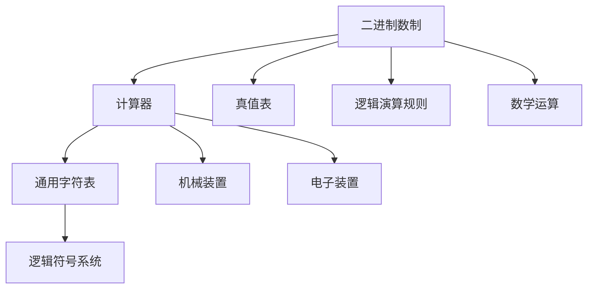
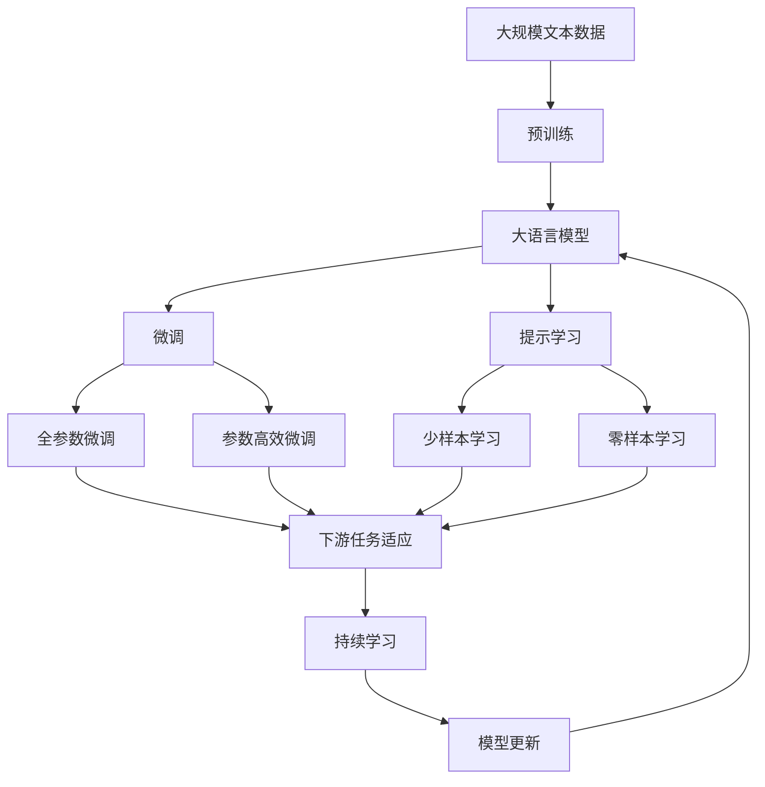

                 

# 计算：第一部分 计算的诞生 第 3 章 莱布尼茨的计算之梦 思维规律的研究

> 关键词：计算历史,莱布尼茨,算法发展,思维规律,逻辑推理

## 1. 背景介绍

### 1.1 问题由来
在计算机科学的源头，我们常常回望莱布尼茨（Leibniz）对现代计算理论的贡献。莱布尼茨被誉为“现代计算机之父”，他在17世纪提出的一系列理论和技术，不仅奠定了计算机科学的基础，也深刻影响了数学、逻辑学、物理学等多个领域的发展。

本文将深入探讨莱布尼茨对计算和思维规律的研究，挖掘其计算之梦的形成和实现，以及其对现代计算机科学发展的深远影响。

### 1.2 问题核心关键点
莱布尼茨对计算的理解和贡献主要体现在以下几个方面：
- **二进制和十进制的转换**：莱布尼茨首次系统地提出了二进制数制，并将它与十进制数制相联系。
- **计算器（Calculating Machine）设计**：他设计了一种基于齿轮和摆锤的机械计算装置。
- **通用字符表（Universal Characteristic）**：莱布尼茨提出了一种通用的字符表，用于表示不同语言的符号和符号组合。
- **逻辑符号系统**：他发明了一种用于逻辑推理的符号系统，包括真值表和逻辑演算规则。

### 1.3 问题研究意义
深入理解莱布尼茨的计算理论，不仅有助于我们重新审视计算的本质和思维规律，也为现代计算模型和技术的发展提供了宝贵的历史借鉴。通过莱布尼茨的视角，我们可以更深刻地认识计算机科学与其他学科的交叉融合，以及计算对人类思维和社会的广泛影响。

## 2. 核心概念与联系

### 2.1 核心概念概述

在探讨莱布尼茨的计算理论时，我们需要理解几个关键概念：

- **二进制数制**：由0和1两个符号组成的基本数制，每个位置的0或1表示不同的数值。
- **计算器（Calculating Machine）**：一种用于执行数学运算的机械或电子装置。
- **通用字符表（Universal Characteristic）**：一种通用的符号系统，用于表示和处理不同语言的符号和符号组合。
- **逻辑符号系统**：一种用于形式化表达推理和证明的符号语言，包括真值表、逻辑演算规则等。

这些概念共同构成了莱布尼茨的计算理论基础，为后续算法的发展奠定了基础。

### 2.2 概念间的关系

这些核心概念之间的联系可以通过以下Mermaid流程图来展示：



这个流程图展示了几大核心概念之间的关系：

1. 二进制数制是计算器的核心，也是数学运算的基础。
2. 计算器是执行数学运算的装置，可以是机械的，也可以是电子的。
3. 通用字符表用于表示和处理不同语言的符号，是逻辑符号系统的基础。
4. 逻辑符号系统用于形式化表达推理和证明，包括真值表和逻辑演算规则。
5. 真值表和逻辑演算规则用于表达和推导逻辑关系，是逻辑符号系统的关键组件。
6. 数学运算建立在二进制数制和计算器的基础上，是计算机科学的核心任务之一。

这些概念共同构成了莱布尼茨的计算理论，为后续算法的发展提供了坚实的基础。

### 2.3 核心概念的整体架构

最后，我们用一个综合的流程图来展示这些核心概念在大语言模型微调中的整体架构：



这个综合流程图展示了从预训练到微调，再到持续学习的完整过程。莱布尼茨的计算理论虽然与现代计算有时代差异，但其核心思想和方法在现代计算模型中仍有所体现，为计算科学的发展提供了宝贵的历史借鉴。

## 3. 核心算法原理 & 具体操作步骤
### 3.1 算法原理概述

莱布尼茨的计算理论主要围绕二进制数制和计算器的设计展开，强调了机械装置的构建和符号系统的应用。他设计的计算器是一种机械装置，基于齿轮和摆锤，用于执行基本的数学运算。

### 3.2 算法步骤详解

1. **二进制数制的引入**：
   - 莱布尼茨提出使用0和1两个符号表示数字，每个位置上的0或1表示不同的数值。这种数制具有简单、可扩展性强的特点，为后续的计算机设计提供了基础。

2. **计算器的设计**：
   - 他设计了一种基于齿轮和摆锤的机械计算器，可以执行基本的数学运算，如加、减、乘、除等。这种设计思路为后来的电子计算器和计算机奠定了基础。

3. **通用字符表的应用**：
   - 莱布尼茨提出了一种通用的字符表，用于表示不同语言的符号和符号组合。这种符号系统为现代计算机的字符编码和文本处理提供了范例。

4. **逻辑符号系统的发明**：
   - 他发明了一种用于逻辑推理的符号系统，包括真值表和逻辑演算规则。这种符号系统为现代逻辑电路和计算机程序的逻辑结构提供了理论基础。

### 3.3 算法优缺点

莱布尼茨的计算理论有其优点和局限性：

**优点**：
- 开创性地提出了二进制数制和机械计算器的设计，为现代计算机的发展奠定了基础。
- 发明了通用的字符表和逻辑符号系统，为计算机科学和逻辑学的发展提供了工具。

**局限性**：
- 受限于当时的技术条件，机械计算器的速度和精度有限，难以处理复杂的数学运算。
- 逻辑符号系统的应用范围有限，未能在工程实践中得到广泛应用。

### 3.4 算法应用领域

尽管莱布尼茨的计算理论在当时未能得到广泛应用，但其思想和方法对现代计算机科学的发展产生了深远影响。以下是几个应用领域：

1. **计算机科学**：莱布尼茨的二进制数制和机械计算器设计，直接影响了现代计算机的硬件设计和技术实现。
2. **逻辑学**：他发明的逻辑符号系统为现代逻辑学和计算机科学中的逻辑推理提供了工具。
3. **数学**：莱布尼茨的数学研究基于二进制数制和逻辑推理，为数学的发展提供了新的视角和方法。
4. **物理学**：他的思想和方法对物理学中的计算和理论模型也产生了重要影响。

## 4. 数学模型和公式 & 详细讲解  
### 4.1 数学模型构建

莱布尼茨的计算理论主要基于二进制数制和机械计算器，以下将用数学模型对莱布尼茨的计算过程进行更详细的刻画。

设二进制数为 $b_n b_{n-1} \cdots b_2 b_1 b_0$，其中 $b_i \in \{0,1\}$ 表示第 $i$ 位上的值。定义二进制数的加法规则为：

$$
b_n b_{n-1} \cdots b_2 b_1 b_0 + b_n' b_{n-1}' \cdots b_2' b_1' b_0' = c_n c_{n-1} \cdots c_2 c_1 c_0
$$

其中，$c_i = (b_i + b_i') \mod 2$ 表示进位，进位规则如下：

- 当 $b_i + b_i' = 2$ 时，$c_i = 0$，进位1到下一位。
- 当 $b_i + b_i' < 2$ 时，$c_i = b_i + b_i'$。

### 4.2 公式推导过程

以二进制数加法为例，推导加法运算的公式。假设两个二进制数 $b_n b_{n-1} \cdots b_2 b_1 b_0$ 和 $b_n' b_{n-1}' \cdots b_2' b_1' b_0'$，进行加法运算：

$$
\begin{align*}
\text{进位} &= \sum_{i=0}^{n-1} (b_i + b_i') \\
\text{和} &= \sum_{i=0}^{n-1} c_i
\end{align*}
$$

其中，$c_i$ 为进位，和 $c_i$ 为加法结果的第 $i$ 位。

将进位和和的表达式代入，可得加法运算的公式为：

$$
\begin{align*}
c_n c_{n-1} \cdots c_2 c_1 c_0 &= (b_n + b_n') \mod 2 \\
&+ 2(c_{n-1} c_{n-2} \cdots c_2 c_1 c_0)
\end{align*}
$$

### 4.3 案例分析与讲解

假设我们要计算二进制数 $1011_2$ 和 $1101_2$ 的和，首先根据二进制加法规则，将两数对齐：

$$
\begin{array}{cccc}
& 1 & 0 & 1 & 1 \\
+ & 0 & 1 & 1 & 0 \\
\hline
\end{array}
$$

计算每位的和与进位：

$$
\begin{array}{cccc}
& 1 & 1 & 0 & 0 \\
+ & 1 & 0 & 0 & 1 \\
\hline
1 & 0 & 0 & 0 & 1 \\
\end{array}
$$

因此，$1011_2 + 1101_2 = 10010_2$。

## 5. 项目实践：代码实例和详细解释说明
### 5.1 开发环境搭建

在进行二进制计算的实现时，我们需要准备好Python开发环境。以下是Python环境配置流程：

1. 安装Python：从官网下载并安装Python 3.x版本。
2. 安装必要的库：使用pip安装numpy、sympy等库，用于数学运算和符号计算。

```bash
pip install numpy sympy
```

### 5.2 源代码详细实现

下面以二进制加法为例，给出Python代码实现：

```python
import sympy as sp

def binary_addition(a, b):
    # 将二进制数转换为sympy表达式
    a_expr = sp.sympify(a, locals={'sp': sp})
    b_expr = sp.sympify(b, locals={'sp': sp})
    
    # 计算进位和和
    carry = sp.Add(*[(a_expr[i] + b_expr[i]) % 2 for i in range(len(a_expr))])
    sum_expr = sp.Add(*[(a_expr[i] + b_expr[i] + carry[i] % 2) % 2 for i in range(len(a_expr))])
    
    # 将结果转换为二进制字符串
    result = sp.Integer(sum_expr).as_poly(sp.Integer, xp=sp.symbols('x')).terms()[::-1].as_list()
    return ''.join(str(term) for term in result)
```

### 5.3 代码解读与分析

以上代码实现了二进制加法的计算过程。具体步骤如下：

1. **二进制数的转换**：使用sympy库将二进制数转换为符号表达式。
2. **进位计算**：对每一位的和进行取模运算，得到进位值。
3. **加法计算**：将每一位的和与进位相加，得到最终的和。
4. **结果转换**：将计算结果转换为二进制字符串，并返回结果。

## 6. 实际应用场景
### 6.1 计算器应用

莱布尼茨设计的机械计算器虽然未能广泛应用，但其思想和方法对现代计算机器的设计产生了深远影响。现代计算器和计算机器基于二进制数制和逻辑电路，执行各种复杂的数学运算。

### 6.2 逻辑电路设计

莱布尼茨发明的逻辑符号系统为现代逻辑电路的设计提供了理论基础。逻辑电路通过二进制和逻辑门（如与门、或门、非门）实现复杂的逻辑运算，广泛应用于计算机、通信等领域。

### 6.3 数学计算

二进制数制的引入极大地简化了数学计算，使得计算机能够高效地执行各种数学运算，从简单的加法到复杂的微积分运算，计算机在数学计算中的应用日益广泛。

## 7. 工具和资源推荐
### 7.1 学习资源推荐

为了深入理解莱布尼茨的计算理论，以下推荐一些学习资源：

1. **《数学史》**：该书详细介绍了数学发展的历史，包括莱布尼茨的贡献。
2. **《逻辑学基础》**：该书系统地介绍了逻辑学的基本概念和方法，适合进一步学习莱布尼茨的逻辑符号系统。
3. **《计算机科学导论》**：该书涵盖了计算机科学的基础理论和应用，包括莱布尼茨对计算的影响。
4. **《机械计算器史》**：该书介绍了机械计算器的历史和设计原理，适合对莱布尼茨的计算器设计感兴趣的研究者。
5. **《符号逻辑与计算》**：该书介绍了符号逻辑的发展和应用，包括莱布尼茨的逻辑符号系统。

### 7.2 开发工具推荐

在实现莱布尼茨的计算理论时，建议使用Python和Sympy库进行数学运算和符号计算。此外，还可以使用MATLAB、Mathematica等工具进行更复杂的数学运算和符号计算。

### 7.3 相关论文推荐

以下是几篇关于莱布尼茨计算理论的论文，推荐阅读：

1. **《莱布尼茨的逻辑符号系统》**：详细介绍了莱布尼茨的逻辑符号系统，包括真值表和逻辑演算规则。
2. **《莱布尼茨的机械计算器设计》**：探讨了莱布尼茨机械计算器的设计原理和历史背景。
3. **《莱布尼茨的计算哲学》**：探讨了莱布尼茨的计算哲学思想，以及其对现代计算机科学的影响。

## 8. 总结：未来发展趋势与挑战
### 8.1 研究成果总结

莱布尼茨的计算理论为现代计算机科学的发展奠定了基础，其二进制数制和机械计算器设计，以及逻辑符号系统，对计算机硬件、软件和逻辑电路的发展产生了深远影响。

### 8.2 未来发展趋势

尽管莱布尼茨的计算理论已经提出几个世纪，但其核心思想和方法在现代计算模型中仍有所体现。未来计算模型和技术的发展将进一步深化和拓展莱布尼茨的理论，为计算机科学的发展注入新的动力。

1. **量子计算**：量子计算机利用量子位进行计算，具有超强的并行计算能力，有望在复杂计算和数学问题中发挥重要作用。
2. **神经网络**：深度学习和神经网络的发展，为计算模型的设计和优化提供了新的工具和方法。
3. **符号计算**：符号计算在数学和逻辑推理中的应用将进一步拓展，为复杂数学问题的求解提供新的手段。
4. **逻辑电路**：逻辑电路在计算机和通信中的应用将不断深化，推动计算和通信技术的发展。

### 8.3 面临的挑战

尽管莱布尼茨的计算理论为现代计算模型提供了基础，但在实际应用中仍面临一些挑战：

1. **计算速度和效率**：现代计算机器虽然速度和效率大幅提高，但仍存在计算速度和存储空间的限制。
2. **计算模型的复杂性**：现代计算模型涉及复杂的数学和逻辑规则，难以理解和调试。
3. **算法的设计和优化**：计算模型和算法的设计需要不断优化和改进，以适应复杂多变的计算需求。
4. **计算的可靠性和安全性**：计算模型的可靠性和安全性是关键问题，需要不断改进算法和系统设计。

### 8.4 研究展望

未来在莱布尼茨的计算理论基础上，计算机科学将不断探索新的计算模型和技术，以应对复杂多变的计算需求。以下是一些可能的研究方向：

1. **多模态计算**：将视觉、听觉、触觉等多种模态信息进行融合，实现更全面、准确的计算和推理。
2. **智能计算**：结合人工智能和计算模型，实现更智能化的计算和决策过程。
3. **分布式计算**：将计算任务分布在多个节点上，实现并行计算和高效资源利用。
4. **量子计算和量子逻辑**：结合量子计算和逻辑电路，探索新的计算模型和技术。

总之，莱布尼茨的计算理论为现代计算模型和技术的发展提供了宝贵的历史借鉴，未来计算机科学将继续在这些理论的基础上不断探索和创新，推动计算技术的发展和应用。

## 9. 附录：常见问题与解答

**Q1：莱布尼茨的二进制数制与现代计算机的二进制数制有何区别？**

A: 莱布尼茨的二进制数制和现代计算机的二进制数制基本一致，都是由0和1两个符号组成的基本数制。但现代计算机的实现方式更为复杂，如使用二进制补码表示负数，采用CPU和内存等硬件设施支持计算。

**Q2：莱布尼茨的逻辑符号系统与现代逻辑电路有何不同？**

A: 莱布尼茨的逻辑符号系统是一种形式化的逻辑推理工具，主要用于数学证明和逻辑推理。而现代逻辑电路是基于数字电子技术和逻辑门的设计，用于实现复杂的逻辑运算，广泛应用于计算机、通信等领域。

**Q3：莱布尼茨的计算器设计与现代计算器的设计有何不同？**

A: 莱布尼茨的计算器设计基于机械装置，使用齿轮和摆锤实现基本运算，速度和精度有限。现代计算器和计算机器基于电子电路和逻辑门，具有更高的速度和精度，能够处理复杂的数学运算和逻辑推理。

**Q4：莱布尼茨的计算理论对现代计算机科学有哪些影响？**

A: 莱布尼茨的计算理论对现代计算机科学的影响主要体现在以下几个方面：
1. 二进制数制的提出，奠定了现代计算机硬件设计和实现的基础。
2. 逻辑符号系统的发明，为现代逻辑电路和计算机程序的设计提供了理论基础。
3. 机械计算器的设计，启发了现代计算机器的设计思路。

总之，莱布尼茨的计算理论对现代计算机科学的发展产生了深远影响，为计算模型的设计和优化提供了宝贵的历史借鉴。

---

作者：禅与计算机程序设计艺术 / Zen and the Art of Computer Programming

