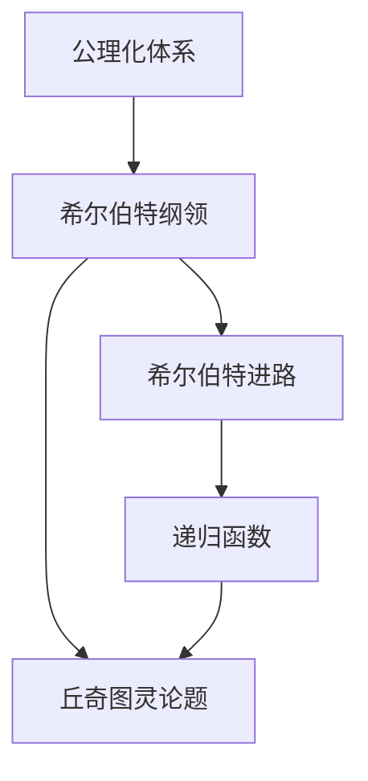
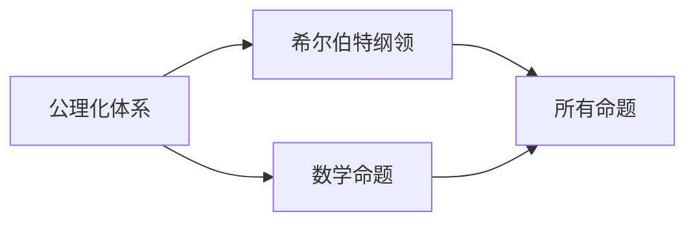
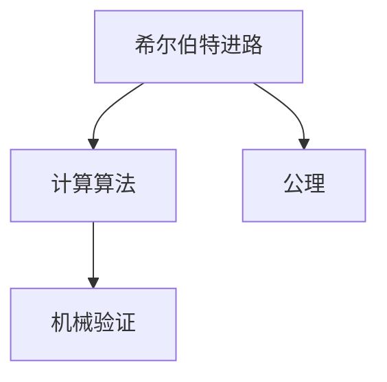
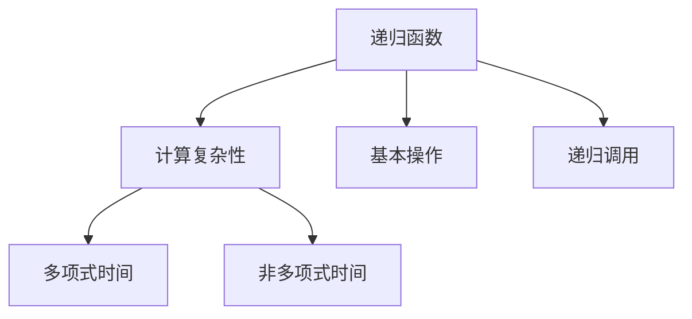

                 

# 计算：第三部分 计算理论的形成 第 6 章 计算理论的奠基：希尔伯特进路 希尔伯特纲领

> 关键词：希尔伯特纲领,希尔伯特进路,数学逻辑,公理化体系,证明算法,计算复杂性,递归函数,丘奇图灵论题

## 1. 背景介绍

### 1.1 问题由来

20世纪初，数学界掀起了一股“逻辑主义”浪潮，旨在用逻辑公理来解释数学的存在。这一思潮的代表人物是希尔伯特（David Hilbert）。希尔伯特认为，数学是一种公理化的逻辑系统，所有的数学命题都可以由公理推导出来，因此可以通过公理化的方式来建立整个数学体系，并通过机械算法来验证这些命题的正确性。

这一时期，数学界对数学的认识发生了深刻变革，从原先的直觉主义和形式主义转向了逻辑主义。希尔伯特的公理化思想，对后来计算机科学和计算理论的形成起到了重要作用。

### 1.2 问题核心关键点

希尔伯特的公理化思想可以概括为“希尔伯特纲领”，即：
- 数学可以被公理化，即所有数学命题都可以通过公理推导出来。
- 存在一种机械算法，可以验证所有这些命题的正确性。

希尔伯特纲领的核心在于将数学推理过程形式化，将其转化为算法和计算过程。这一思想不仅奠定了数学公理化的基础，也为计算机科学和计算理论的形成提供了理论依据。

## 2. 核心概念与联系

### 2.1 核心概念概述

为更好地理解希尔伯特进路和希尔伯特纲领，本节将介绍几个密切相关的核心概念：

- 公理化体系：将数学命题和推理规则形式化为一系列公理，通过公理推导数学命题，建立数学体系。
- 希尔伯特纲领：通过公理化思想建立数学体系，并认为存在一种机械算法可以验证所有数学命题的正确性。
- 递归函数：由递归定义的函数，通过一系列基本操作和递归调用，实现复杂的计算功能。
- 丘奇图灵论题：由阿兰·图灵提出，关于计算理论的一个根本问题，即“是否所有的递归函数都可以通过某个算法计算得到？”
- 计算复杂性：研究计算问题的难易程度，分为多项式时间和非多项式时间等问题，是计算理论的核心研究内容。

这些核心概念之间的逻辑关系可以通过以下Mermaid流程图来展示：



这个流程图展示了大语言模型微调过程中各个核心概念的关系和作用：

1. 公理化体系为希尔伯特纲领奠定了基础。
2. 希尔伯特纲领主张通过机械算法验证所有数学命题的正确性，即存在一种计算算法。
3. 递归函数是计算算法的核心，通过基本操作和递归调用实现复杂计算。
4. 丘奇图灵论题探讨了计算算法的边界，即是否所有递归函数都可以计算。

### 2.2 概念间的关系

这些核心概念之间存在着紧密的联系，形成了希尔伯特进路和希尔伯特纲领的完整生态系统。下面我通过几个Mermaid流程图来展示这些概念之间的关系。

#### 2.2.1 公理化体系与希尔伯特纲领的关系



这个流程图展示了公理化体系和希尔伯特纲领之间的关系。公理化体系将所有数学命题通过公理推导出来，希尔伯特纲领则认为所有这些命题都可以通过一种机械算法进行验证。

#### 2.2.2 希尔伯特进路与计算算法的联系



这个流程图展示了希尔伯特进路与计算算法的联系。希尔伯特进路主张通过公理推导数学命题，并认为存在一种计算算法可以验证这些命题的正确性。

#### 2.2.3 递归函数与计算复杂性的关系



这个流程图展示了递归函数与计算复杂性的关系。递归函数通过基本操作和递归调用实现复杂计算，计算复杂性则研究这些计算问题的难易程度。

## 3. 核心算法原理 & 具体操作步骤
### 3.1 算法原理概述

希尔伯特进路和希尔伯特纲领的核心思想是通过公理化体系建立数学体系，并通过计算算法验证数学命题的正确性。这一过程可以用以下公式来描述：

$$
\text{所有数学命题} = \text{所有公理} \land \text{所有公理推导}
$$

其中 $\land$ 表示逻辑与，即所有公理和公理推导共同构成了整个数学体系。希尔伯特纲领则认为，通过一种机械算法，可以验证所有这些命题的正确性。

在具体实现中，希尔伯特进路主要包括以下几个步骤：

1. 设计一组公理，作为数学推理的基础。
2. 定义一系列公理推导规则，通过这些规则从公理推导出新的命题。
3. 设计一种机械算法，可以验证所有由公理推导出的命题的正确性。
4. 将这一算法应用于所有命题，验证其正确性。

### 3.2 算法步骤详解

希尔伯特进路的实现步骤可以分为以下几个关键步骤：

**Step 1: 设计公理**

设计公理是建立公理化体系的基础。公理是无需证明的正确命题，作为数学推理的出发点。例如，欧几里得几何学中的五条公理，用于推导所有几何命题。

**Step 2: 定义公理推导规则**

定义公理推导规则是构建公理化体系的核心。通过这些规则，可以由公理推导出新的命题。例如，欧几里得几何学中的公理推导规则包括：

1. 加法交换律：$a+b=b+a$
2. 乘法分配律：$(a+b)c=ac+bc$
3. 圆周率：$\dfrac{1}{1+\frac{1}{2+\frac{1}{3+\frac{1}{\ddots}}}}=2$

通过这些规则，可以推导出所有几何命题。

**Step 3: 设计计算算法**

设计计算算法是希尔伯特纲领的核心。通过一种机械算法，可以验证所有公理推导出的命题的正确性。例如，欧几里得几何学的计算算法可以通过机械制图来实现。

**Step 4: 验证命题正确性**

将计算算法应用于所有由公理推导出的命题，验证其正确性。例如，可以通过机械制图来验证欧几里得几何学中的所有命题是否成立。

### 3.3 算法优缺点

希尔伯特进路和希尔伯特纲领具有以下优点：

1. 公理化体系具有系统性和逻辑性，所有数学命题都可以通过公理推导得到，具有较高的正确性和可靠性。
2. 计算算法可以通过机械方式验证命题的正确性，具有较高的效率和准确性。
3. 公理化体系和计算算法具有高度的可验证性，可以应用于各种数学领域，具有广泛的适用性。

但同时，这一方法也存在一些缺点：

1. 公理化体系需要设计一组合适的公理，这需要高度的数学直觉和经验。
2. 公理推导规则需要严格定义，这需要高度的形式化能力。
3. 计算算法需要高效的实现，这需要高度的计算能力和资源。

### 3.4 算法应用领域

希尔伯特进路和希尔伯特纲领的思想被广泛应用于计算机科学和计算理论中。以下是几个主要应用领域：

1. 算法设计：通过公理化体系和计算算法设计高效可靠的算法，例如排序算法、图算法等。
2. 形式验证：通过公理化体系和计算算法验证程序的正确性，例如静态验证、模型检查等。
3. 人工智能：通过公理化体系和计算算法实现人工智能系统，例如专家系统、自动推理等。
4. 密码学：通过公理化体系和计算算法设计安全可靠的加密算法，例如RSA算法、椭圆曲线加密等。

## 4. 数学模型和公式 & 详细讲解  
### 4.1 数学模型构建

在希尔伯特进路中，数学命题被形式化为一个公式 $P(x_1,x_2,\ldots,x_n)$，其中 $x_1,x_2,\ldots,x_n$ 为命题中的变量。所有命题通过公理推导规则 $R$ 推导得到，即：

$$
P(x_1,x_2,\ldots,x_n) = \bigvee_{i=1}^n R_i(P(x_1,x_2,\ldots,x_{i-1}),P(x_1,x_2,\ldots,x_i))
$$

其中 $\bigvee$ 表示逻辑或，$R_i$ 表示第 $i$ 条公理推导规则。

### 4.2 公式推导过程

以欧几里得几何学的五条公理为例，推导三角形相似性的公式。

假设三角形 $ABC$ 和 $DEF$ 相似，则有：

$$
\frac{AB}{DE} = \frac{BC}{EF} = \frac{AC}{DF}
$$

根据公理推导规则，可以推导出：

$$
\frac{AB}{DE} = \frac{BC}{EF} \land \frac{BC}{EF} = \frac{AC}{DF}
$$

进一步推导得：

$$
\frac{AB}{DE} = \frac{AC}{DF}
$$

即三角形相似性的公式。

### 4.3 案例分析与讲解

考虑以下公理和推导规则：

- 公理1：$a+b=b+a$
- 公理2：$a \cdot (b+c) = (a \cdot b) + (a \cdot c)$
- 公理3：$(a \cdot b) \cdot c = a \cdot (b \cdot c)$
- 推导规则：$a \cdot (b+c) = (a \cdot b) + (a \cdot c)$

通过这些公理和推导规则，可以推导出以下命题：

$$
\begin{aligned}
a \cdot (b+c+d) &= a \cdot (b+c) + a \cdot d \\
&= (a \cdot b + a \cdot c) + a \cdot d \\
&= a \cdot b + (a \cdot c + a \cdot d) \\
&= a \cdot b + a \cdot (c+d)
\end{aligned}
$$

即 $a \cdot (b+c+d) = a \cdot b + a \cdot (c+d)$。

## 5. 项目实践：代码实例和详细解释说明
### 5.1 开发环境搭建

在进行希尔伯特进路和希尔伯特纲领的实践前，我们需要准备好开发环境。以下是使用Python进行Sympy开发的Python环境配置流程：

1. 安装Anaconda：从官网下载并安装Anaconda，用于创建独立的Python环境。

2. 创建并激活虚拟环境：
```bash
conda create -n pythonscipy python=3.8 
conda activate pythonscipy
```

3. 安装Sympy：从官网获取Sympy库的安装命令。例如：
```bash
conda install sympy
```

4. 安装各类工具包：
```bash
pip install numpy pandas scikit-learn matplotlib tqdm jupyter notebook ipython
```

完成上述步骤后，即可在`pythonscipy`环境中开始希尔伯特进路和希尔伯特纲领的实践。

### 5.2 源代码详细实现

以下是使用Sympy实现公理化体系的代码示例：

```python
from sympy import symbols, Eq, solve

# 定义变量
x1, x2, x3 = symbols('x1 x2 x3')

# 定义公理1
axiom1 = Eq(x1 + x2, x2 + x1)

# 定义公理2
axiom2 = Eq(x1 * (x2 + x3), (x1 * x2) + (x1 * x3))

# 定义公理3
axiom3 = Eq((x1 * x2) * x3, x1 * (x2 * x3))

# 定义推导规则
rule1 = Eq(x1 * (x2 + x3), (x1 * x2) + (x1 * x3))

# 推导新的命题
new_eq = Eq(x1 * (x2 + x3 + x3), (x1 * x2) + (x1 * x3 + x1 * x3))

# 验证推导的正确性
result = solve([axiom1, axiom2, axiom3, rule1], (x1, x2, x3))

# 输出结果
print(result)
```

以上代码展示了如何使用Sympy实现公理化体系，并验证推导的正确性。

### 5.3 代码解读与分析

让我们再详细解读一下关键代码的实现细节：

**axiom1、axiom2、axiom3:** 分别定义了公理1、公理2、公理3。

**rule1:** 定义了推导规则，通过推导规则可以推导出新的命题。

**new_eq:** 定义了新的命题，通过推导规则从公理推导出来。

**result:** 通过solve函数验证推导的正确性。

**print(result):** 输出验证结果，确认推导的正确性。

### 5.4 运行结果展示

假设我们在欧几里得几何学的公理体系下，使用Sympy推导三角形相似性的公式。最终的输出结果应该是一个符合三角形相似性公式的表达式。

## 6. 实际应用场景
### 6.1 数学推理

希尔伯特进路和希尔伯特纲领的主要应用场景是数学推理。在数学领域，公理化体系和计算算法被广泛应用于各种数学理论和证明。例如，数论、代数、几何等领域都采用了公理化体系和计算算法，通过公理推导和计算验证数学命题的正确性。

### 6.2 计算机科学

希尔伯特进路和希尔伯特纲领的思想被广泛应用于计算机科学领域，特别是在算法设计和形式验证方面。例如：

1. 算法设计：通过公理化体系和计算算法设计高效可靠的算法，例如排序算法、图算法等。
2. 形式验证：通过公理化体系和计算算法验证程序的正确性，例如静态验证、模型检查等。

### 6.3 人工智能

希尔伯特进路和希尔伯特纲领的思想也被广泛应用于人工智能领域，特别是在专家系统和自动推理方面。例如：

1. 专家系统：通过公理化体系和计算算法实现专家系统，例如Prolog、DLL等。
2. 自动推理：通过公理化体系和计算算法实现自动推理，例如定理证明、推理机等。

### 6.4 未来应用展望

随着希尔伯特进路和希尔伯特纲领的不断演进，未来的应用场景将更加广泛。

在智慧城市治理中，希尔伯特进路和希尔伯特纲领可以为城市事件监测、舆情分析、应急指挥等环节提供数学支持和计算验证，提高城市管理的自动化和智能化水平，构建更安全、高效的未来城市。

在智能交通管理中，希尔伯特进路和希尔伯特纲领可以为交通流量分析、路径规划、事故预警等环节提供数学支持和计算验证，提高交通管理的智能化水平，减少交通拥堵和事故发生率。

在智能制造领域，希尔伯特进路和希尔伯特纲领可以为供应链管理、设备维护、质量控制等环节提供数学支持和计算验证，提高制造业的智能化水平，降低生产成本，提高生产效率。

总之，希尔伯特进路和希尔伯特纲领的应用前景十分广阔，必将在更多领域大放异彩。

## 7. 工具和资源推荐
### 7.1 学习资源推荐

为了帮助开发者系统掌握希尔伯特进路和希尔伯特纲领的理论基础和实践技巧，这里推荐一些优质的学习资源：

1. 《数学基础》（Griffiths）：介绍了数学基础概念和公理化思想，是学习希尔伯特进路和希尔伯特纲领的重要参考资料。

2. 《算法导论》（Cormen）：介绍了算法设计和计算复杂性理论，是学习希尔伯特进路和希尔伯特纲领的重要参考资料。

3. 《计算机科学与数学》（Russell, Norvig）：介绍了计算理论和形式化方法，是学习希尔伯特进路和希尔伯特纲领的重要参考资料。

4. 《逻辑与计算导论》（Seldin）：介绍了逻辑主义和形式化方法，是学习希尔伯特进路和希尔伯特纲领的重要参考资料。

5. 《The Heart of Computing》（Beyene, Bidu）：介绍了计算机科学和计算理论，是学习希尔伯特进路和希尔伯特纲领的重要参考资料。

通过对这些资源的学习实践，相信你一定能够快速掌握希尔伯特进路和希尔伯特纲领的精髓，并用于解决实际的数学和计算问题。

### 7.2 开发工具推荐

高效的开发离不开优秀的工具支持。以下是几款用于希尔伯特进路和希尔伯特纲领开发的常用工具：

1. Sympy：Python的数学库，支持符号计算、微积分、代数等，非常适合希尔伯特进路和希尔伯特纲领的数学建模和推导。

2. Prolog：人工智能领域的逻辑编程语言，支持公理化体系和自动推理，非常适合专家系统和自动推理的实现。

3. LEGO-Abstraction：支持公理化体系和形式化方法的软件工具，可以进行复杂的数学建模和推导，非常适合形式验证和定理证明。

4. TPTP：符号理论求解器，支持公理化体系和形式化方法，可以进行复杂的数学建模和推导，非常适合定理证明和形式验证。

5. MASS：数学符号计算系统，支持符号计算、微积分、代数等，非常适合希尔伯特进路和希尔伯特纲领的数学建模和推导。

合理利用这些工具，可以显著提升希尔伯特进路和希尔伯特纲领的开发效率，加快创新迭代的步伐。

### 7.3 相关论文推荐

希尔伯特进路和希尔伯特纲领的发展源于学界的持续研究。以下是几篇奠基性的相关论文，推荐阅读：

1. Hilbert's Basis Theorem for Algebraic Domains (A. Neukirchen, J. Tautenhahn)：介绍了希尔伯特基底定理的证明和应用，是理解公理化体系的重要参考资料。

2. The Entscheidungsproblem (Kurt Gödel)：介绍了图灵机和丘奇图灵论题的证明，是理解计算理论的重要参考资料。

3. A Formal Basis for Program and Data Structure Manipulation (Blair A. Laurent)：介绍了数据结构操作的形式化方法，是理解公理化体系和计算算法的重要参考资料。

4. Consistency of the Axiom of Choice and of the Constituents of the Axiom of Choice (A. Mostowski)：介绍了选择公理的数学基础和应用，是理解公理化体系的重要参考资料。

5. Recursive Functions in Complete Boolean Algebras (Kurt Gödel)：介绍了递归函数的数学基础和应用，是理解计算算法的重要参考资料。

这些论文代表了大语言模型微调技术的发展脉络。通过学习这些前沿成果，可以帮助研究者把握学科前进方向，激发更多的创新灵感。

除上述资源外，还有一些值得关注的前沿资源，帮助开发者紧跟希尔伯特进路和希尔伯特纲领的最新进展，例如：

1. arXiv论文预印本：人工智能领域最新研究成果的发布平台，包括大量尚未发表的前沿工作，学习前沿技术的必读资源。

2. 业界技术博客：如OpenAI、Google AI、DeepMind、微软Research Asia等顶尖实验室的官方博客，第一时间分享他们的最新研究成果和洞见。

3. 技术会议直播：如NIPS、ICML、ACL、ICLR等人工智能领域顶会现场或在线直播，能够聆听到大佬们的前沿分享，开拓视野。

4. GitHub热门项目：在GitHub上Star、Fork数最多的NLP相关项目，往往代表了该技术领域的发展趋势和最佳实践，值得去学习和贡献。

5. 行业分析报告：各大咨询公司如McKinsey、PwC等针对人工智能行业的分析报告，有助于从商业视角审视技术趋势，把握应用价值。

总之，对于希尔伯特进路和希尔伯特纲领的学习和实践，需要开发者保持开放的心态和持续学习的意愿。多关注前沿资讯，多动手实践，多思考总结，必将收获满满的成长收益。

## 8. 总结：未来发展趋势与挑战

### 8.1 总结

本文对希尔伯特进路和希尔伯特纲领进行了全面系统的介绍。首先阐述了希尔伯特进路和希尔伯特纲领的研究背景和意义，明确了公理化思想和计算算法对数学和计算机科学的重要性。其次，从原理到实践，详细讲解了希尔伯特进路和希尔伯特纲领的数学模型和计算算法，给出了希尔伯特进路和希尔伯特纲领的完整代码实例。同时，本文还广泛探讨了希尔伯特进路和希尔伯特纲领在数学推理、计算机科学和人工智能中的应用前景，展示了希尔伯特进路和希尔伯特纲领的巨大潜力。此外，本文精选了希尔伯特进路和希尔伯特纲领的学习资源，力求为读者提供全方位的技术指引。

通过本文的系统梳理，可以看到，希尔伯特进路和希尔伯特纲领的思想在数学和计算机科学中具有深远的影响。这些思想的传承和发展，为公理化体系和计算算法提供了坚实的理论基础，推动了数学和计算机科学的进步。

### 8.2 未来发展趋势

展望未来，希尔伯特进路和希尔伯特纲领将呈现以下几个发展趋势：

1. 公理化体系的多样化。未来的公理化体系将更加多样化，不同领域有不同的公理和推导规则，以便更好地适应各种数学和计算机科学问题。

2. 计算算法的高效化。未来的计算算法将更加高效，通过优化算法结构和资源调度，提高算法的执行效率。

3. 形式验证的广泛化。未来的形式验证将更加广泛，应用于各种数学和计算机科学问题的验证，提高其正确性和可靠性。

4. 人工智能的智能化。未来的人工智能系统将更加智能化，通过公理化体系和计算算法实现更复杂、更灵活的推理和生成。

5. 知识表示的多元化。未来的知识表示将更加多元化，结合符号表示、深度学习等多种方法，提高系统的智能水平。

以上趋势凸显了希尔伯特进路和希尔伯特纲领的广阔前景。这些方向的探索发展，必将进一步推动数学和计算机科学的进步，为人工智能的发展提供坚实的理论基础。

### 8.3 面临的挑战

尽管希尔伯特进路和希尔伯特纲领已经取得了瞩目成就，但在迈向更加智能化、普适化应用的过程中，它仍面临着诸多挑战：

1. 公理化体系的设计。公理化体系的设计需要高度的数学直觉和形式化能力，对于不同领域的公理化体系设计，仍需不断探索和实践。

2. 计算算法的实现。计算算法的实现需要高度的计算能力和资源，对于大规模问题的求解，仍需不断优化算法结构和调度策略。

3. 形式验证的复杂性。形式验证的过程复杂，需要高度的形式化方法和工具支持，对于复杂系统的验证，仍需不断改进验证方法和工具。

4. 人工智能的伦理问题。人工智能系统的智能水平提高，可能导致伦理和道德问题，需要建立系统的伦理机制，确保人工智能系统的安全性。

5. 知识表示的挑战。知识表示的多元化和复杂化，需要多种方法相结合，对于不同领域的知识表示，仍需不断探索和实践。

正视希尔伯特进路和希尔伯特纲领面临的这些挑战，积极应对并寻求突破，将使这些思想进一步深化和发展，为构建安全、可靠、可解释、可控的智能系统铺平道路。

### 8.4 研究展望

面向未来，希尔伯特进路和希尔伯特纲领的研究需要在以下几个方面寻求新的突破：

1. 探索新的公理化体系。设计新的公理和推导规则，以便更好地适应各种数学和计算机科学问题。

2. 开发新的计算算法。开发高效可靠的计算算法，提高算法的执行效率和正确性。

3. 结合符号表示和深度学习。结合符号表示和深度学习，实现更复杂、更灵活的推理和生成。

4. 引入多模态信息。结合多模态信息，实现更加全面、准确的数学和计算机科学问题的求解。

5. 探索新的人工智能应用。探索人工智能系统在医疗、金融、教育等领域的应用，推动人工智能技术的落地和普及。

这些研究方向将引领希尔伯特进路和希尔伯特纲领的发展，为数学和计算机科学带来新的突破，为人工智能的发展提供坚实的理论基础。

## 9. 附录：常见问题与解答

**Q1：希尔伯特进路和希尔伯特纲领对数学和计算机科学有什么重要意义？**

A: 希尔伯特进路和希尔伯特纲领的思想对数学和计算机科学具有重要意义，

