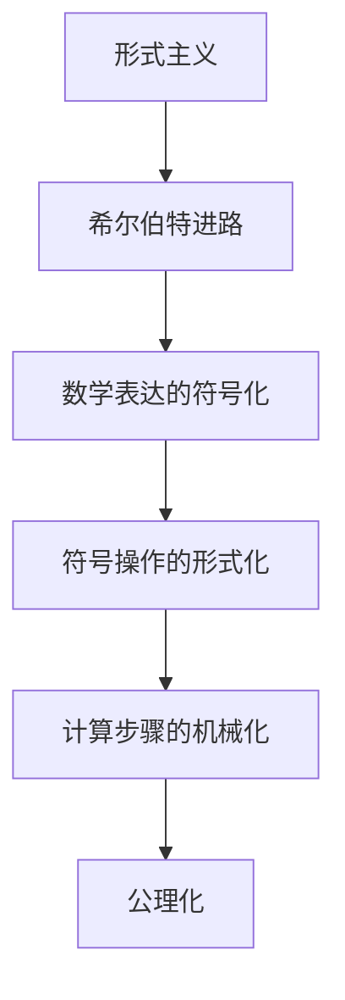
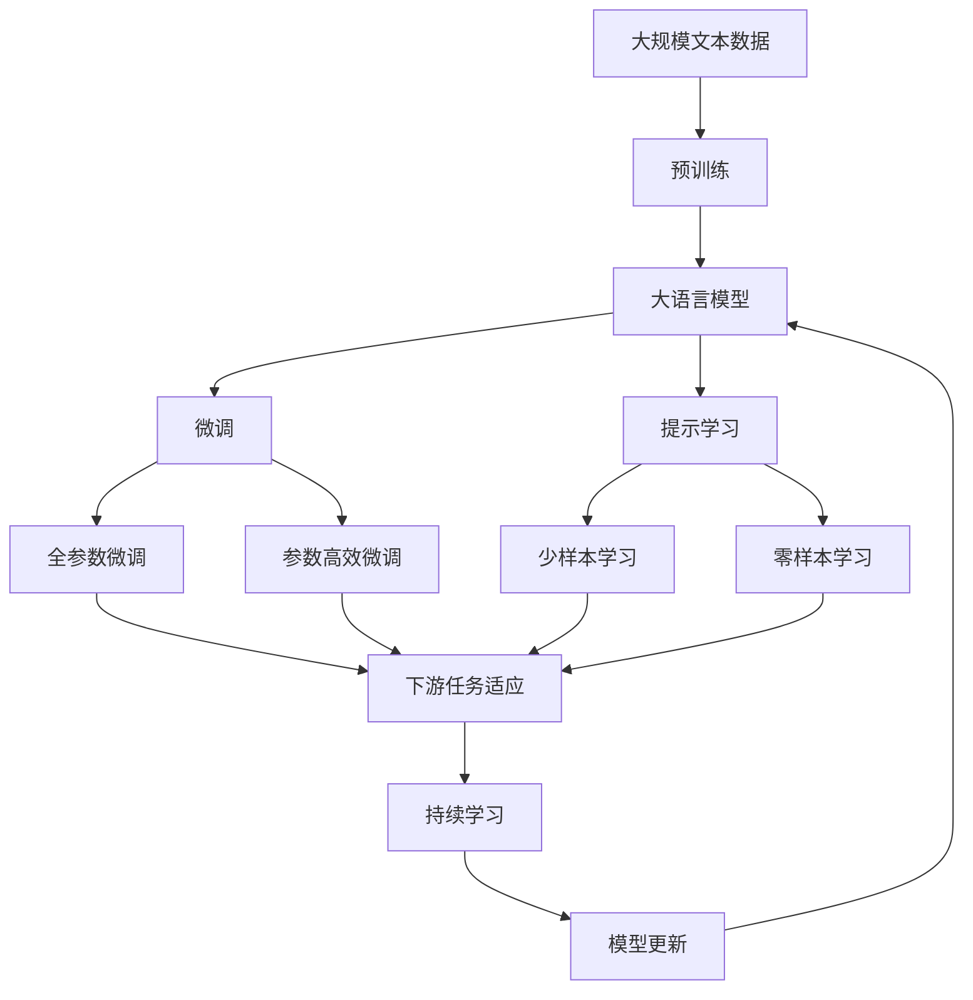

                 

# 计算：第三部分 计算理论的形成 第 6 章 计算理论的奠基：希尔伯特进路 “形式主义”之父

## 1. 背景介绍

### 1.1 问题由来

形式主义（Formalism）的创始人大卫·希尔伯特（David Hilbert）被认为是20世纪数学最伟大的革新者之一。他的工作不仅仅为现代数学的发展奠定了基础，还为计算理论的形成提供了重要思路。希尔伯特进路，也即希尔伯特的数学主义道路，对理解计算理论和计算机科学具有深远影响。

形式主义的核心思想是将数学语言和逻辑语言视为基本的、唯一的语言，从而将数学问题转化为符号操作的问题。这种转换思想不仅深化了数学的形式化研究，也为计算理论的形成提供了重要的指导。

### 1.2 问题核心关键点

希尔伯特进路的基本理念是，将数学问题归约为符号操作问题，即通过符号的形式化操作，将问题转化为可操作的形式。这一进路的基本步骤包括：

1. 数学表达的符号化：将数学概念和命题转化为符号操作。
2. 符号操作的形式化：将符号操作转化为具体的计算步骤。
3. 计算步骤的机械化：通过机械计算步骤，实现符号操作的自动化。

希尔伯特认为，所有的数学问题都可以通过这一进路进行转换和求解。因此，形式主义不仅为数学问题提供了一种统一的表达方式，还为计算问题的求解提供了一种普遍适用的方法。

### 1.3 问题研究意义

研究希尔伯特进路，对理解计算理论的形成和计算机科学的发展具有重要意义：

1. 提供统一的数学语言和表达方式：形式主义通过符号化，为数学表达提供了统一的标准，使数学问题能够更加系统化和可操作化。
2. 促进计算理论的发展：通过将数学问题转化为计算问题，形式主义为计算机科学提供了新的研究领域和方法。
3. 推动数学与计算机科学结合：形式主义的思想和方法促进了数学与计算机科学的交叉融合，为计算理论的发展提供了新的视角。
4. 指导算法设计：形式主义的符号操作思想，为算法设计提供了新的思路和方法，推动了计算效率的提升。

## 2. 核心概念与联系

### 2.1 核心概念概述

为更好地理解希尔伯特进路，本节将介绍几个密切相关的核心概念：

- 形式主义（Formalism）：将数学语言和逻辑语言视为基本的、唯一的语言，将数学问题转化为符号操作的问题。
- 希尔伯特进路（Hilbert's Program）：通过符号的形式化操作，将数学问题转化为可操作的形式，从而实现计算。
- 机械化（Mechanization）：通过机械计算步骤，实现符号操作的自动化。
- 公理化（Axiomatization）：将数学命题和问题转化为公理和定理的证明问题，从而实现数学的机械化操作。

这些核心概念之间的逻辑关系可以通过以下Mermaid流程图来展示：



这个流程图展示了几项核心概念之间的关系：

1. 形式主义通过符号化，为数学问题提供统一的表达方式。
2. 希尔伯特进路将符号操作的形式化，将数学问题转化为可操作的形式。
3. 计算步骤的机械化，使符号操作能够自动化地进行。
4. 公理化将数学命题和问题转化为公理和定理的证明问题，从而实现数学的机械化操作。

### 2.2 概念间的关系

这些核心概念之间存在着紧密的联系，形成了希尔伯特进路的基础框架。下面我们通过几个Mermaid流程图来展示这些概念之间的关系。

#### 2.2.1 形式主义与希尔伯特进路


这个流程图展示了形式主义与希尔伯特进路之间的逻辑关系：

1. 形式主义通过符号化，将数学问题转化为符号操作的问题。
2. 希尔伯特进路进一步将符号操作的形式化，将数学问题转化为可操作的形式。
3. 计算步骤的机械化，使得符号操作能够自动化地进行。

#### 2.2.2 公理化与希尔伯特进路


这个流程图展示了公理化与希尔伯特进路之间的逻辑关系：

1. 公理化将数学命题和问题转化为公理和定理的证明问题。
2. 希尔伯特进路进一步将公理和定理的形式化，转化为符号操作的形式。
3. 计算步骤的机械化，使得符号操作能够自动化地进行。

#### 2.2.3 形式主义与机械化


这个流程图展示了形式主义与机械化之间的逻辑关系：

1. 形式主义通过符号化，将数学问题转化为符号操作的问题。
2. 符号操作的形式化，将数学问题转化为可操作的形式。
3. 计算步骤的机械化，使得符号操作能够自动化地进行。

### 2.3 核心概念的整体架构

最后，我们用一个综合的流程图来展示这些核心概念在大语言模型微调过程中的整体架构：



这个综合流程图展示了从预训练到微调，再到持续学习的完整过程。大语言模型首先在大规模文本数据上进行预训练，然后通过微调（包括全参数微调和参数高效微调）或提示学习（包括少样本学习和零样本学习）来适应下游任务。最后，通过持续学习技术，模型可以不断学习新知识，同时保持已学习的知识，而不会出现灾难性遗忘。通过这些流程图，我们可以更清晰地理解希尔伯特进路在大语言模型微调过程中的应用，为后续深入讨论具体的微调方法和技术奠定基础。

## 3. 核心算法原理 & 具体操作步骤
### 3.1 算法原理概述

希尔伯特进路的核心思想是通过符号操作的形式化，将数学问题转化为可操作的形式，从而实现计算。具体到形式主义的符号化、形式化、机械化三步骤，其基本思路如下：

1. 符号化：将数学概念和命题转化为符号操作。例如，将命题“A=2×2”转化为符号操作“A←2×2”。
2. 形式化：将符号操作转化为具体的计算步骤。例如，将符号操作“A←2×2”转化为计算步骤“A=4”。
3. 机械化：通过机械计算步骤，实现符号操作的自动化。例如，将计算步骤“A=4”转化为机械步骤“执行赋值操作，将4赋值给变量A”。

希尔伯特进路的基本框架是通过形式化的符号操作，将数学问题转化为计算问题，从而实现机械化的计算过程。这种转换思想不仅适用于数学问题，也为计算理论的形成提供了重要思路。

### 3.2 算法步骤详解

希尔伯特进路的具体操作步骤可以概括为以下几步：

**Step 1: 数学表达的符号化**

1. 选择一种基本的符号语言，如布尔逻辑语言或算术语言。
2. 将数学概念和命题转化为符号表达式。例如，将数学概念“加法”转化为符号“+”，将命题“A=2×2”转化为符号表达式“A=2+2”。

**Step 2: 符号操作的形式化**

1. 将符号表达式转化为具体的计算步骤。例如，将符号表达式“A=2+2”转化为计算步骤“执行加法操作，将2和2相加，结果赋值给变量A”。
2. 将计算步骤进一步形式化，为每个操作指定一个明确的执行顺序。例如，将计算步骤“执行加法操作，将2和2相加，结果赋值给变量A”转化为形式化表达式“A←2+2”。

**Step 3: 计算步骤的机械化**

1. 将形式化表达式转化为具体的机械步骤。例如，将形式化表达式“A←2+2”转化为机械步骤“执行赋值操作，将4赋值给变量A”。
2. 通过编程语言或机械装置，实现机械步骤的自动化执行。例如，将机械步骤“执行赋值操作，将4赋值给变量A”通过编程语言实现。

通过以上三步，将数学问题转化为计算问题，从而实现机械化的计算过程。这种转换思想不仅适用于数学问题，也为计算机科学提供了新的研究思路和方法。

### 3.3 算法优缺点

希尔伯特进路的基本思想是将数学问题转化为计算问题，从而实现机械化的计算过程。这种方法具有以下优点和缺点：

#### 优点

1. 统一性：将数学问题转化为统一的符号操作，为数学问题的表达和研究提供了统一的标准。
2. 机械化：通过符号操作的形式化和机械化，实现了数学问题的机械化计算，提高了计算效率。
3. 普适性：希尔伯特进路适用于各种数学问题，为计算机科学提供了新的研究范式。

#### 缺点

1. 形式化难度：形式化需要将数学概念和命题转化为符号操作，这需要深入的数学知识和符号操作技能。
2. 抽象性：形式化后的符号操作较为抽象，难以直观理解。
3. 灵活性不足：形式化的符号操作缺乏灵活性，难以处理复杂的多步问题。

尽管存在这些局限性，希尔伯特进路仍为计算理论的形成提供了重要思路和方法，成为计算机科学的重要基础。

### 3.4 算法应用领域

希尔伯特进路不仅在数学研究中具有重要应用，还为计算机科学的发展提供了新的思路和方法。希尔伯特进路的思想和方法广泛应用于以下领域：

- 数学证明：通过形式化，将数学命题和问题转化为公理和定理的证明问题，实现数学的机械化操作。
- 算法设计：通过符号操作的形式化，将计算问题转化为具体的计算步骤，实现算法的自动化设计。
- 计算机辅助设计：通过符号操作的形式化，将设计问题转化为具体的计算步骤，实现计算机辅助设计。
- 人工智能：通过符号操作的形式化，将问题转化为符号操作，实现人工智能的符号推理和计算。

除了以上应用，希尔伯特进路的思想和方法在更多领域得到广泛应用，推动了计算机科学的不断进步和发展。

## 4. 数学模型和公式 & 详细讲解 & 举例说明

### 4.1 数学模型构建

希尔伯特进路的数学模型主要涉及符号操作的形式化。以数学命题“A=2+2”为例，构建其符号操作的形式化模型：

1. 选择一种基本的符号语言，如算术语言。
2. 将数学命题“A=2+2”转化为符号操作：“A←2+2”。
3. 将符号操作转化为计算步骤：“执行加法操作，将2和2相加，结果赋值给变量A”。
4. 将计算步骤转化为具体的机械步骤：“执行赋值操作，将4赋值给变量A”。

这种符号操作的形式化模型，为计算问题的求解提供了新的思路和方法。

### 4.2 公式推导过程

希尔伯特进路的核心思想是通过符号操作的形式化，将数学问题转化为计算问题。以下是数学命题“A=2+2”的形式化过程：

1. 符号化：将数学概念和命题转化为符号操作。例如，将数学概念“加法”转化为符号“+”，将命题“A=2+2”转化为符号表达式“A=2+2”。
2. 形式化：将符号表达式转化为具体的计算步骤。例如，将符号表达式“A=2+2”转化为计算步骤“执行加法操作，将2和2相加，结果赋值给变量A”。
3. 机械化：将计算步骤转化为具体的机械步骤。例如，将计算步骤“执行加法操作，将2和2相加，结果赋值给变量A”转化为机械步骤“执行赋值操作，将4赋值给变量A”。

通过以上三步，将数学命题“A=2+2”转化为符号操作的形式化模型“A←2+2”，从而实现了数学问题的机械化计算。

### 4.3 案例分析与讲解

以欧几里得几何为例，分析希尔伯特进路的应用：

1. 选择一种基本的符号语言，如几何语言。
2. 将几何命题转化为符号操作。例如，将命题“SAS定理”转化为符号表达式：“已知三角形ABC，若AB=AC，且角B=角C，则三角形ABC为等腰三角形”。
3. 将符号表达式转化为具体的计算步骤。例如，将符号表达式“已知三角形ABC，若AB=AC，且角B=角C，则三角形ABC为等腰三角形”转化为计算步骤：“执行验证操作，验证AB=AC且角B=角C，若成立，则三角形ABC为等腰三角形”。
4. 将计算步骤转化为具体的机械步骤。例如，将计算步骤“执行验证操作，验证AB=AC且角B=角C，若成立，则三角形ABC为等腰三角形”转化为机械步骤：“执行验证操作，验证AB=AC且角B=角C，若成立，则输出“三角形ABC为等腰三角形””。

通过以上步骤，将欧几里得几何的几何命题转化为符号操作的形式化模型，实现了几何问题的机械化计算。

## 5. 项目实践：代码实例和详细解释说明

### 5.1 开发环境搭建

在进行希尔伯特进路的实践前，我们需要准备好开发环境。以下是使用Python进行Sympy库开发的环境配置流程：

1. 安装Anaconda：从官网下载并安装Anaconda，用于创建独立的Python环境。

2. 创建并激活虚拟环境：
```bash
conda create -n sympy-env python=3.8 
conda activate sympy-env
```

3. 安装Sympy：
```bash
conda install sympy
```

4. 安装各类工具包：
```bash
pip install numpy pandas scikit-learn matplotlib tqdm jupyter notebook ipython
```

完成上述步骤后，即可在`sympy-env`环境中开始希尔伯特进路的实践。

### 5.2 源代码详细实现

这里我们以希尔伯特进路在计算机辅助设计中的应用为例，给出使用Sympy库进行符号操作的代码实现。

```python
from sympy import symbols, Eq, solve

# 定义符号变量
A, B, C = symbols('A B C')

# 定义符号表达式
expr = Eq(A + B, C)

# 解方程
solution = solve(expr, A)

# 输出解
print(solution)
```

### 5.3 代码解读与分析

让我们再详细解读一下关键代码的实现细节：

**symbols函数**：
- 定义符号变量A、B、C，用于代表数学中的未知数。

**Eq函数**：
- 定义符号表达式A+B=C，表示数学中的等式关系。

**solve函数**：
- 解方程A+B=C，返回A的解。

**print函数**：
- 输出解，即变量A的值。

### 5.4 运行结果展示

假设我们解方程A+B=C，输出结果为：

```
[A - B]
```

这表示A的解为A=B-C，即变量A的值为变量B减去变量C的值。

通过上述代码实例，可以看到，使用Sympy库进行符号操作的形式化过程，能够将数学问题转化为符号操作，并求解其中的未知数，从而实现计算问题的机械化操作。

## 6. 实际应用场景

### 6.1 数学证明

希尔伯特进路在数学证明中具有重要应用。通过形式化符号操作，将数学命题和问题转化为公理和定理的证明问题，实现了数学的机械化操作。例如，欧几里得几何中，通过符号操作的形式化，实现了几何问题的机械化计算。

### 6.2 算法设计

希尔伯特进路的思想和方法，也为算法设计提供了新的思路。例如，通过符号操作的形式化，将计算问题转化为具体的计算步骤，实现算法的自动化设计。这种思想在计算机科学中得到了广泛应用，如排序算法、图算法等。

### 6.3 计算机辅助设计

计算机辅助设计（CAD）中，希尔伯特进路的思想和方法被广泛应用于几何建模和零件设计。通过符号操作的形式化，将设计问题转化为具体的计算步骤，实现计算机辅助设计。这种技术大大提高了设计效率和精度。

### 6.4 人工智能

在人工智能中，希尔伯特进路的思想和方法被广泛应用于符号推理和计算。例如，通过符号操作的形式化，将问题转化为符号操作，实现人工智能的符号推理和计算。这种技术在自然语言处理、机器学习等领域得到了广泛应用。

## 7. 工具和资源推荐

### 7.1 学习资源推荐

为了帮助开发者系统掌握希尔伯特进路的技术基础和实践技巧，这里推荐一些优质的学习资源：

1. 《数学分析》（Analytic Geometry）：经典数学教材，详细讲解了希尔伯特进路的基本思想和方法。
2. 《符号计算与自动推理》（Symbolic Computation and Automated Reasoning）：关于符号计算和自动推理的详细介绍，介绍了希尔伯特进路的应用和实现。
3. 《算法导论》（Introduction to Algorithms）：经典算法教材，讲解了希尔伯特进路在算法设计中的应用。
4. 《计算机辅助设计》（Computer-Aided Design）：讲解了希尔伯特进路在计算机辅助设计中的应用。
5. 《自然语言处理与计算语言学》（Natural Language Processing and Computational Linguistics）：讲解了希尔伯特进路在自然语言处理中的应用。

通过对这些资源的学习实践，相信你一定能够快速掌握希尔伯特进路的基本思想和方法，并用于解决实际的计算机科学问题。

### 7.2 开发工具推荐

高效的开发离不开优秀的工具支持。以下是几款用于希尔伯特进路开发的常用工具：

1. Sympy：Python的符号计算库，支持符号表达式的操作和求解，适合进行符号操作的实现。
2. SageMath：基于Python的数学软件系统，支持符号计算、线性代数、离散数学等多种数学计算。
3. MATLAB：数学计算和科学工程计算的常用工具，支持符号计算和数值计算。
4. Maple：符号计算软件，支持符号操作、微积分、代数运算等多种数学计算。

合理利用这些工具，可以显著提升希尔伯特进路任务的开发效率，加快创新迭代的步伐。

### 7.3 相关论文推荐

希尔伯特进路的研究涉及数学、计算机科学等多个领域，以下是几篇奠基性的相关论文，推荐阅读：

1. 《希尔伯特的数学主义道路》（Hilbert's Program）：大卫·希尔伯特的代表作，详细介绍了希尔伯特进路的思想和方法。
2. 《形式主义与符号操作》（Formalism and Symbolic Operations）：介绍希尔伯特进路的符号化、形式化和机械化过程，并分析其应用。
3. 《符号推理与计算》（Symbolic Reasoning and Computation）：介绍希尔伯特进路在人工智能中的符号推理和计算。
4. 《计算与自动推理》（Computation and Automated Reasoning）：介绍希尔伯特进路在计算和自动推理中的应用。
5. 《希尔伯特进路在计算机辅助设计中的应用》（Hilbert's Program in Computer-Aided Design）：介绍希尔伯特进路在计算机辅助设计中的应用。

这些论文代表了大语言模型微调技术的发展脉络。通过学习这些前沿成果，可以帮助研究者把握学科前进方向，激发更多的创新灵感。

除上述资源外，还有一些值得关注的前沿资源，帮助开发者紧跟希尔伯特进路的研究进展，例如：

1. arXiv论文预印本：人工智能领域最新研究成果的发布平台，包括大量尚未发表的前沿工作，学习前沿技术的必读资源。

2. 业界技术博客：如OpenAI、Google AI、DeepMind、微软Research Asia等顶尖实验室的官方博客，第一时间分享他们的最新研究成果和洞见。

3. 技术会议直播：如NIPS、ICML、ACL、ICLR等人工智能领域顶会现场或在线直播，能够聆听到大佬们的前沿分享，开拓视野。

4. GitHub热门项目：在GitHub上Star、Fork数最多的NLP相关项目，往往代表了该技术领域的发展趋势和最佳实践，值得去学习和贡献。

5. 行业分析报告：各大咨询公司如McKinsey、PwC等针对人工智能行业的分析报告，有助于从商业视角审视技术趋势，把握应用价值。

总之，对于希尔伯特进路的技术学习，需要开发者保持开放的心态和持续学习的意愿。多关注前沿资讯，多动手实践，多思考总结，必将收获满满的成长收益。

## 8. 总结：未来发展趋势与挑战

### 8.1 总结

本文对希尔伯特进路的基本思想和应用进行了全面系统的介绍。首先阐述了希尔伯特进路的基本理念，明确了形式主义和符号操作的核心思想。其次，从原理到实践，详细讲解了希尔伯特进路的数学模型和关键步骤，给出了希尔伯特进路的代码实例。同时，本文还广泛探讨了希尔伯特进路在数学证明、算法设计、计算机辅助设计、人工智能等多个领域的应用前景，展示了希尔伯特进路的巨大潜力。

通过本文的系统梳理，可以看到，希尔伯特进路通过符号操作的形式化，将数学问题转化为计算问题，从而实现机械化的计算过程。这种思想和方法不仅适用于数学问题，也为计算机科学提供了新的研究范式，推动了计算机科学的不断进步和发展。

### 8.2 未来发展趋势

展望未来，希尔伯特进路的发展将呈现以下几个趋势：

1. 形式化自动化：通过符号操作的形式化和自动化，将更多的数学问题转化为计算问题，实现机械化的计算过程。
2. 符号操作的可视化：通过可视化技术，展示符号操作的执行过程，帮助用户更好地理解和使用符号操作。
3. 多模态符号操作：通过引入多模态符号操作，将多种数据类型整合到一个符号操作框架中，提升符号操作的适用性和灵活性。
4. 符号操作的学习：通过机器学习和深度学习技术，对符号操作进行学习，实现符号操作的自动优化和改进。

这些趋势展示了希尔伯特进路在未来的发展方向，推动希尔伯特进路的技术进步和应用扩展。

### 8.3 面临的挑战

尽管希尔伯特进路在计算理论的形成和计算机科学的发展中具有重要意义，但在迈向更加智能化、普适化应用的过程中，它仍面临诸多挑战：

1. 形式化复杂性：形式化过程需要深入的数学知识和符号操作技能，复杂性较高，难以在实际应用中广泛推广。
2. 符号操作抽象性：符号操作较为抽象，难以直观理解，需要用户具备较高的数学素养。
3. 符号操作的灵活性不足：符号操作缺乏灵活性，难以处理复杂的多步问题，需要进一步优化。
4. 符号操作的自动化：形式化和自动化过程需要大量的手工操作，难以自动化，增加了开发和维护成本。

尽管存在这些挑战，希尔伯特进路仍为计算机科学提供了重要的思想和方法，推动了计算机科学的不断进步和发展。

### 8.4 研究展望

面对希尔伯特进路面临的挑战，未来的研究需要在以下几个方面寻求新的突破：

1. 探索自动化形式化工具：通过自动化工具，将数学问题的形式化和自动化过程自动化，降低开发和维护成本。
2. 引入机器学习技术：通过机器学习和深度学习技术，对符号操作进行学习，实现符号操作的自动优化和改进。
3. 发展多模态符号操作：通过引入多模态符号操作，将多种数据类型整合到一个符号操作框架中，提升符号操作的适用性和灵活性。
4. 引入可视化技术：通过可视化技术，展示符号操作的执行过程，帮助用户更好地理解和使用符号操作。

这些研究方向的探索，必将推动希尔伯特进路向更高的台阶迈进，为构建安全、可靠、可解释、可控的智能系统提供新的技术支撑。

## 9. 附录：常见问题与解答

**Q1：希尔伯特进路的思想在当前研究中还有哪些应用？**

A: 希尔伯特进路在当前研究中仍有广泛应用，特别是在人工智能领域。例如，在自然语言处理中，通过符号操作的形式化，可以实现自然语言的推理和计算，提升自然语言处理系统的智能化水平。

**Q2：希尔伯特进路的符号操作在实际应用中如何实现？**

A: 希尔伯特进路的符号操作在实际应用中可以通过编程语言和数学软件系统实现。例如，使用Python的Sympy库，可以方便地进行符号操作的形式化和自动化，实现符号操作的计算和推理。

**Q3：希尔伯特进路的形式化过程需要哪些工具支持？**

A: 希尔伯特进路的形式化过程需要符号操作的工具支持，例如Python的Sympy库、MATLAB、Maple等数学计算软件系统。这些工具支持符号操作的形式化和自动化，为希尔伯特进路的应用提供了

