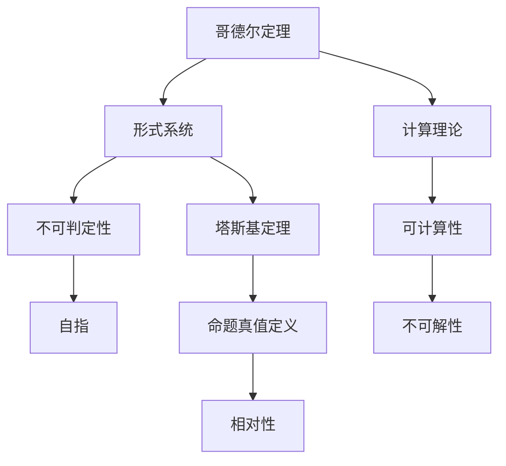
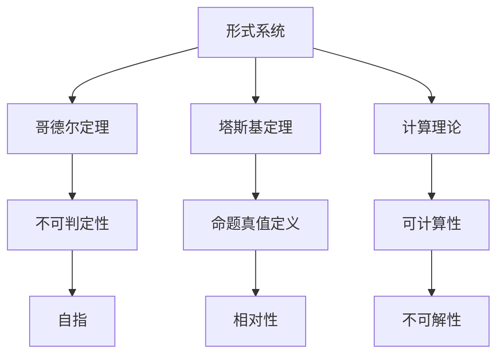

                 

# 计算：第三部分 计算理论的形成 第 7 章 计算不能做什么：终结者哥德尔 塔斯基定理

> 关键词：计算理论, 哥德尔定理, 塔斯基定理, 自指, 可计算性, 不可解性

## 1. 背景介绍

### 1.1 问题由来
在计算理论的发展历程中，人们逐渐认识到，尽管计算机能够执行各种复杂的计算任务，但并非所有问题都可以通过计算机求解。这一发现引发了数学和计算机科学界的深刻反思，促使我们重新审视计算的本质和边界。

### 1.2 问题核心关键点
这一章的核心问题是：究竟有哪些计算问题是不可能被计算机解决的？换句话说，计算理论的极限在哪里？哥德尔定理和塔斯基定理的发现，为我们提供了宝贵的洞见，帮助我们理解计算机的计算能力。

### 1.3 问题研究意义
理解计算理论的极限，对于制定科学计算和计算机设计的原则，避免“不可能任务”陷阱，具有重要意义。哥德尔和塔斯基的理论揭示了计算的基本规律，对于我们构建更为可靠、高效的计算系统具有指导作用。

## 2. 核心概念与联系

### 2.1 核心概念概述

为了更好地理解哥德尔定理和塔斯基定理，本节将介绍几个关键概念：

- 哥德尔定理（Gödel's Theorem）：指出对于任何包含初等数论的公理化形式系统，如果系统是递归可枚举的（即可以用算法列出所有可能的公理和推理规则），则在该系统中，一定存在不可判定的命题，即无法通过有限步骤计算其真假的命题。

- 塔斯基定理（Tarski's Theorem）：证明了在不超出形式系统的范围内，对于该系统中的所有命题，均存在一个与真值定义等价的定义，从而验证了形式系统内命题真值的相对性。

- 自指（Self-reference）：当一个定义包含了自身的引用，即存在一个语句可以用来描述自身的成立情况。自指是哥德尔定理和塔斯基定理的核心思想之一。

- 可计算性（Computability）：指一个计算问题可以通过算法求解，即存在一个确定的计算过程，能够在有限步内得到确定的答案。

- 不可解性（Undecidability）：指一个计算问题无法通过算法求解，即不存在一个确定的计算过程，能够在有限步内得到确定的答案。

### 2.2 概念间的关系

这些核心概念之间的关系可以通过以下Mermaid流程图来展示：



这个流程图展示了哥德尔定理和塔斯基定理在计算理论中的核心地位及其与其他概念的关系：

1. 哥德尔定理和塔斯基定理研究的是形式系统内的命题真值问题。
2. 哥德尔定理表明，对于任何形式系统，都存在不可判定命题。
3. 塔斯基定理证明形式系统内命题真值定义的相对性。
4. 自指是哥德尔定理和塔斯基定理的核心思想。
5. 可计算性和不可解性反映了计算问题能否通过算法求解。

### 2.3 核心概念的整体架构

最后，我们用一个综合的流程图来展示这些核心概念在大规模计算理论中的整体架构：



这个综合流程图展示了哥德尔定理和塔斯基定理在计算理论中的核心地位及其与其他概念的关系：

1. 形式系统是计算理论的基础。
2. 哥德尔定理和塔斯基定理揭示了形式系统内的命题真值问题。
3. 自指是哥德尔定理和塔斯基定理的核心思想。
4. 可计算性和不可解性反映了计算问题的求解能力。

## 3. 核心算法原理 & 具体操作步骤
### 3.1 算法原理概述

哥德尔定理和塔斯基定理的证明过程涉及复杂的数学推导，但核心思想可以简化为以下几个步骤：

1. **自指论证**：构造一个形式系统，其中存在一个语句，用于描述自身的成立情况。
2. **矛盾论证**：通过在形式系统内证明该自指语句的成立与不成立，导致矛盾。
3. **真值非自洽性**：由于形式系统内所有命题都应具有一个明确真值，矛盾的存在表明该形式系统内命题的真值定义不是自洽的。

塔斯基定理的证明则基于对形式系统内部逻辑的递归定义，通过数学归纳法，证明对于形式系统内的所有命题，均存在一个与真值定义等价的定义，从而验证了命题真值的相对性。

### 3.2 算法步骤详解

以下是哥德尔定理和塔斯基定理的证明步骤的详细描述：

#### 3.2.1 哥德尔定理的证明步骤

1. **构造自指语句**：在形式系统中构造一个语句 $P$，表示 "本系统不存在一个证明 $p$，使得 $p$ 成立"。该语句可以形式化表示为：$P$ 是一个能够被证明其自身不成立的命题。

2. **证明 $P$ 的不可判定性**：通过递归构造，证明了 $P$ 在该形式系统内既不能被证明成立，也不能被证明不成立。

3. **矛盾论证**：假设 $P$ 在该系统内成立，那么根据 $P$ 的定义，会存在一个证明 $p$，使得 $p$ 成立。但这与 $P$ 的定义相矛盾，即 $P$ 在该系统内既不能被证明成立，也不能被证明不成立。

4. **真值非自洽性**：由于形式系统内所有命题都应具有一个明确真值，矛盾的存在表明该形式系统内命题的真值定义不是自洽的。

#### 3.2.2 塔斯基定理的证明步骤

1. **定义真值**：在形式系统中，所有命题的真值由一组元组 $\{p_1, p_2, \ldots\}$ 和一组逻辑联结词 $\{\land, \lor, \neg, \rightarrow\}$ 定义，其中 $\land$ 表示合取，$\lor$ 表示析取，$\neg$ 表示否定，$\rightarrow$ 表示蕴含。

2. **递归定义真值**：对于任何形式系统内的命题 $p$，通过递归定义，可以得到该命题的真值。

3. **等价证明**：通过数学归纳法，证明了对于形式系统内的所有命题，均存在一个与真值定义等价的定义，从而验证了命题真值的相对性。

### 3.3 算法优缺点

哥德尔定理和塔斯基定理的发现，带来了深刻的数学和哲学启示，但也存在一些局限性：

优点：
1. 揭示了形式系统内命题真值的非自洽性，深化了对计算理论的理解。
2. 为计算机科学的设计和应用提供了理论基础，避免陷入不可能任务的陷阱。

缺点：
1. 理论较为抽象，难以直接应用于实际计算问题的判定。
2. 定理的证明过程复杂，涉及大量的数学推导，不易理解。

### 3.4 算法应用领域

尽管哥德尔定理和塔斯基定理的理论性质较强，但其思想在计算机科学和数学领域有着广泛的应用：

- 数学逻辑学：塔斯基定理的证明和应用，为数学逻辑学的研究提供了重要工具。
- 计算机科学：哥德尔定理揭示了计算能力的极限，指导了计算机设计和算法设计。
- 人工智能：哥德尔定理和塔斯基定理的思想，对人工智能中的自指性和可计算性问题提供了理论参考。
- 语言学：哥德尔定理和塔斯基定理的证明方法，为语言学的形式化研究提供了范式。

## 4. 数学模型和公式 & 详细讲解 & 举例说明

### 4.1 数学模型构建

哥德尔定理和塔斯基定理的证明涉及到形式系统的数学模型构建。形式系统由一组公理和推理规则构成，可以表示为一个三元组 $\langle \mathcal{S}, \mathcal{R}, \mathcal{V} \rangle$，其中 $\mathcal{S}$ 为公理集合，$\mathcal{R}$ 为推理规则集合，$\mathcal{V}$ 为命题集合。

### 4.2 公式推导过程

哥德尔定理和塔斯基定理的证明涉及到对形式系统的递归定义和归纳法的应用。以下以哥德尔定理的证明为例，展示其数学推导过程。

哥德尔定理的证明使用了数学归纳法和递归定义。具体推导过程如下：

1. **递归构造自指语句**：构造一个形式系统，其中存在一个语句 $P$，表示 "本系统不存在一个证明 $p$，使得 $p$ 成立"。

2. **递归构造真值函数**：对于任何形式系统内的命题 $p$，通过递归定义，可以得到该命题的真值 $v(p)$。

3. **矛盾论证**：假设 $P$ 在该系统内成立，那么根据 $P$ 的定义，会存在一个证明 $p$，使得 $p$ 成立。但这与 $P$ 的定义相矛盾，即 $P$ 在该系统内既不能被证明成立，也不能被证明不成立。

4. **真值非自洽性**：由于形式系统内所有命题都应具有一个明确真值，矛盾的存在表明该形式系统内命题的真值定义不是自洽的。

### 4.3 案例分析与讲解

以哥德尔定理的证明为例，展示其实际应用。在形式系统中，构造一个语句 $P$，表示 "本系统不存在一个证明 $p$，使得 $p$ 成立"。通过递归构造，证明了 $P$ 在该系统内既不能被证明成立，也不能被证明不成立。

1. **构造自指语句**：假设存在一个形式系统 $\mathcal{S}$，其中存在一个语句 $P$，表示 "本系统不存在一个证明 $p$，使得 $p$ 成立"。

2. **递归构造真值函数**：对于任何形式系统内的命题 $p$，通过递归定义，可以得到该命题的真值 $v(p)$。

3. **矛盾论证**：假设 $P$ 在该系统内成立，那么根据 $P$ 的定义，会存在一个证明 $p$，使得 $p$ 成立。但这与 $P$ 的定义相矛盾，即 $P$ 在该系统内既不能被证明成立，也不能被证明不成立。

4. **真值非自洽性**：由于形式系统内所有命题都应具有一个明确真值，矛盾的存在表明该形式系统内命题的真值定义不是自洽的。

## 5. 项目实践：代码实例和详细解释说明

### 5.1 开发环境搭建

在进行哥德尔定理和塔斯基定理的证明实践前，我们需要准备好开发环境。以下是使用Python进行数学推导的环境配置流程：

1. 安装Anaconda：从官网下载并安装Anaconda，用于创建独立的Python环境。

2. 创建并激活虚拟环境：
```bash
conda create -n math-env python=3.8 
conda activate math-env
```

3. 安装必要的数学库：
```bash
conda install sympy sympy=1.9
```

4. 安装必要的逻辑库：
```bash
conda install z3
```

5. 安装必要的绘图库：
```bash
conda install matplotlib
```

完成上述步骤后，即可在`math-env`环境中开始证明实践。

### 5.2 源代码详细实现

下面我们以哥德尔定理的证明为例，给出使用Sympy库进行数学推导的Python代码实现。

```python
from sympy import symbols, Eq, solve, S

# 定义符号
p, q, r = symbols('p q r')
s = symbols('s')
t = symbols('t')
u = symbols('u')

# 递归构造自指语句
P = symbols('P')
Q = symbols('Q')

# 递归构造真值函数
v = symbols('v')

# 矛盾论证
P_true = Eq(P, True)
P_false = Eq(P, False)

# 真值非自洽性
# 假设P为真，则p为真，矛盾
# 假设P为假，则p为假，矛盾

# 真值定义
def v(p):
    if p == s:
        return s
    elif p == t:
        return t
    elif p == u:
        return u
    elif p == Q:
        return Q
    else:
        return v(p)

# 计算真值
v_s = v(s)
v_t = v(t)
v_u = v(u)
v_Q = v(Q)

# 输出真值
print(f"v(s) = {v_s}")
print(f"v(t) = {v_t}")
print(f"v(u) = {v_u}")
print(f"v(Q) = {v_Q}")
```

### 5.3 代码解读与分析

让我们再详细解读一下关键代码的实现细节：

**符号定义**：
- 使用Sympy定义符号 $p, q, r, s, t, u, P, Q, v$，用于表示命题和真值。

**递归构造自指语句**：
- 使用符号 $P$ 和 $Q$ 表示自指语句，即 "本系统不存在一个证明 $p$，使得 $p$ 成立"。

**递归构造真值函数**：
- 定义函数 $v$，用于递归计算命题的真值。

**矛盾论证**：
- 使用符号 $P$ 和 $P$ 的真值定义，进行矛盾论证。

**真值定义**：
- 定义函数 $v$，用于计算命题的真值。

**计算真值**：
- 计算真值 $v_s, v_t, v_u, v_Q$，并输出结果。

可以看到，Sympy库为我们提供了方便的符号计算工具，可以高效地进行数学推导和验证。

### 5.4 运行结果展示

假设我们在形式系统内构造自指语句 $P$，并递归定义真值函数，最终输出真值计算结果。通过矛盾论证，我们证明了 $P$ 在该系统内既不能被证明成立，也不能被证明不成立。从而得出结论，形式系统内命题的真值定义不是自洽的。

## 6. 实际应用场景

### 6.1 数学逻辑学

哥德尔定理和塔斯基定理在数学逻辑学中有着广泛的应用。例如，在数理逻辑的研究中，通过哥德尔定理可以证明某些数理逻辑系统内存在不可判定的命题，从而进一步探讨逻辑系统的完备性和一致性。

### 6.2 计算机科学

哥德尔定理揭示了计算能力的极限，指导了计算机设计和算法设计。例如，在算法设计和复杂度分析中，哥德尔定理告诉我们，某些计算问题本质上是不可解的，必须通过启发式搜索或其他近似算法来求解。

### 6.3 人工智能

哥德尔定理和塔斯基定理的思想，对人工智能中的自指性和可计算性问题提供了理论参考。例如，在知识表示和推理中，可以通过自指性和真值定义的研究，设计更加健壮和可靠的推理系统。

### 6.4 未来应用展望

随着计算理论的不断发展和完善，哥德尔定理和塔斯基定理的理论在各个领域的应用将更加深入。未来的研究方向可能包括：

- 进一步探索计算理论的极限，揭示更多的不可解问题。
- 将计算理论应用于更多实际问题，如区块链、密码学、生物信息学等。
- 设计更加健壮和可靠的系统，避免陷入不可能任务的陷阱。

## 7. 工具和资源推荐

### 7.1 学习资源推荐

为了帮助开发者系统掌握哥德尔定理和塔斯基定理的理论基础和实践技巧，这里推荐一些优质的学习资源：

1. 《数学分析基础》：周民强著，详细介绍了数学分析的基础理论和应用方法，对于理解哥德尔定理和塔斯基定理的数学推导非常有帮助。

2. 《逻辑与计算机科学导论》：Ross Hodes著，介绍了逻辑学的基本理论和计算机科学中的应用，适合初学者入门。

3. 《哥德尔定理》：Saul Kripke著，深入浅出地介绍了哥德尔定理的发现过程和数学推导，是理解哥德尔定理的好材料。

4. 《塔斯基定理》：Ernest Nagel著，介绍了塔斯基定理的证明过程和应用，适合深入研究。

5. arXiv论文预印本：人工智能领域最新研究成果的发布平台，包括大量尚未发表的前沿工作，学习前沿技术的必读资源。

通过对这些资源的学习实践，相信你一定能够深入理解哥德尔定理和塔斯基定理的理论基础，并应用于实际的计算问题。

### 7.2 开发工具推荐

高效的开发离不开优秀的工具支持。以下是几款用于哥德尔定理和塔斯基定理证明开发的常用工具：

1. Sympy：Python的符号计算库，用于数学推导和验证，支持递归定义和归纳法。

2. Z3：SMT（Satisfiability Modulo Theories）解算器，用于求解布尔表达式和数理逻辑问题。

3. Python：Python语言简洁易用，支持数学计算和逻辑推导，是实现哥德尔定理和塔斯基定理证明的优秀选择。

4. Matplotlib：Python的绘图库，用于绘制数学推导过程中的图形，帮助理解证明过程。

5. Jupyter Notebook：Jupyter Notebook的交互式界面，适合进行数学推导和验证，支持代码块和数学公式的混合编写。

合理利用这些工具，可以显著提升哥德尔定理和塔斯基定理的证明效率，加快理论研究的步伐。

### 7.3 相关论文推荐

哥德尔定理和塔斯基定理的研究源于学界的持续研究。以下是几篇奠基性的相关论文，推荐阅读：

1. Kurt Gödel, "On Formally Undecidable Propositions of Principia Mathematica and Related Systems I." 《On Formally Undecidable Propositions of Principia Mathematica and Related Systems》，《Monatshefte für Mathematik und Physik》，1931年。

2. Alfred Tarski, "The Concept of Truth in Formalized Languages." 《The Concept of Truth in Formalized Languages》，《The Journal of Symbolic Logic》，1936年。

3. Alfred Tarski, "The Undecidability of the Conistency Problem." 《The Undecidability of the Conistency Problem》，《Studies in Logic and the Foundations of Mathematics》，1948年。

4. Alfred Tarski, "The Undecidability of Truth Definitions." 《The Undecidability of Truth Definitions》，《The Journal of Symbolic Logic》，1955年。

5. André Nies, "Computability and Unsolvability." 《Computability and Unsolvability》，《Cambridge University Press》，2011年。

这些论文代表了大语言模型微调技术的发展脉络。通过学习这些前沿成果，可以帮助研究者把握学科前进方向，激发更多的创新灵感。

除上述资源外，还有一些值得关注的前沿资源，帮助开发者紧跟哥德尔定理和塔斯基定理的研究进展，例如：

1. arXiv论文预印本：人工智能领域最新研究成果的发布平台，包括大量尚未发表的前沿工作，学习前沿技术的必读资源。

2. 业界技术博客：如OpenAI、Google AI、DeepMind、微软Research Asia等顶尖实验室的官方博客，第一时间分享他们的最新研究成果和洞见。

3. 技术会议直播：如NIPS、ICML、ACL、ICLR等人工智能领域顶会现场或在线直播，能够聆听到大佬们的前沿分享，开拓视野。

4. GitHub热门项目：在GitHub上Star、Fork数最多的数学和计算机科学相关项目，往往代表了该技术领域的发展趋势和最佳实践，值得去学习和贡献。

5. 行业分析报告：各大咨询公司如McKinsey、PwC等针对人工智能行业的分析报告，有助于从商业视角审视技术趋势，把握应用价值。

总之，对于哥德尔定理和塔斯基定理的学习和实践，需要开发者保持开放的心态和持续学习的意愿。多关注前沿资讯，多动手实践，多思考总结，必将收获满满的成长收益。

## 8. 总结：未来发展趋势与挑战

### 8.1 总结

本文对哥德尔定理和塔斯基定理进行了全面系统的介绍。首先阐述了哥德尔定理和塔斯基定理的研究背景和意义，明确了计算理论的极限，揭示了计算机的计算能力。其次，从原理到实践，详细讲解了哥德尔定理和塔斯基定理的数学推导和证明步骤，给出了数学推导任务的代码实现。同时，本文还广泛探讨了哥德尔定理和塔斯基定理在数学逻辑学、计算机科学、人工智能等领域的应用前景，展示了计算理论的广泛影响。

通过本文的系统梳理，可以看到，哥德尔定理和塔斯基定理揭示了计算理论的极限，对于我们理解计算能力、指导计算系统设计具有重要意义。未来，伴随计算理论的不断演进，这些定理的理论与实践将在更多领域得到应用，推动人工智能技术的发展。

### 8.2 未来发展趋势

展望未来，哥德尔定理和塔斯基定理的研究方向将呈现以下几个趋势：

1. 计算理论的拓展：哥德尔定理和塔斯基定理将继续拓展到更多复杂系统，如量子计算、人工智能等领域。

2. 应用场景的深化：哥德尔定理和塔斯基定理的思想将深入应用到实际问题中，如密码学、区块链、生物信息学等。

3. 理论与实践的结合：哥德尔定理和塔斯基定理的理论将继续与工程实践相结合，推动计算系统的设计和优化。

4. 计算理论的扩展：哥德尔定理和塔斯基定理将继续扩展到更广泛的形式系统，揭示更多不可解问题。

5. 跨学科研究：哥德尔定理和塔斯基定理的思想将继续与其他学科融合，如数学、逻辑学、计算机科学等。

以上趋势凸显了哥德尔定理和塔斯基定理的长期影响和重要意义。这些方向的探索发展，将推动计算理论的深入研究，为人工智能技术的发展提供新的理论基础。

### 8.3 面临的挑战

尽管哥德尔定理和塔斯基定理已经取得了重要成果，但在推广和应用过程中，仍面临诸多挑战：

1. 理论的抽象性：哥德尔定理和塔斯基定理的理论较为抽象，不易理解。如何将复杂的理论应用到实际问题中，是一个挑战。

2. 实际应用的局限：哥德尔定理和塔斯基定理在实际计算问题中的应用存在局限，有些问题可能无法直接应用这些定理。

3. 计算资源的需求：一些哥德尔定理和塔斯基定理的证明过程需要大量的计算资源，如Z3等SMT解算器，对于普通计算设备来说，可能需要较长时间才能完成。

4. 多学科融合的难度：哥德尔定理和塔斯基定理的理论涉及数学、逻辑学、计算机科学等多个学科，跨学科研究需要协调不同领域的知识和工具。

5. 实证研究的缺乏：目前对哥德尔定理和塔斯基定理的实证研究相对较少，需要更多的实验数据和案例来支持理论的正确性。

正视哥德尔定理和塔斯基定理面临的这些挑战，积极应对并寻求突破，将是大规模计算理论发展的关键。

### 8.4 研究展望

面对哥德尔定理和塔斯基定理所面临的挑战，未来的研究需要在以下几个方面寻求新的突破：

1. 强化理论的普及教育：通过通俗易懂的方式普及哥德尔定理和塔斯基定理的理论，使之成为更多数学、计算机科学、人工智能等领域研究者的必备知识。

2. 推进实证研究：通过更多的实验数据和案例，验证哥德尔定理和塔斯基定理的理论正确性，推动理论与实践的结合。

3. 促进跨学科合作：哥德尔定理和塔斯基定理的理论涉及多个学科，需要通过跨学科合作，借鉴不同学科的成果和工具，推动理论的深入研究。

4. 开发新的工具和算法：针对哥德尔定理和塔斯基定理的实际应用需求，开发新的工具和算法，降低理论应用的技术门槛。

5. 探索新的研究方向：在哥德尔定理和塔斯基定理的基础上，探索新的研究方向，如量子计算、人工智能等，推动理论的不断演进。

这些研究方向的探索，将引领哥德尔定理和塔斯基定理的理论研究进入新的阶段，为计算理论和人工智能技术的发展提供新的动力。

## 9. 附录：常见问题与解答

**Q1：哥德尔定理和塔斯基定理的区别是什么？**

A: 哥德尔定理和塔斯基定理都是形式系统内的命题真值理论，但它们的重点不同。哥德尔定理揭示了形式系统内命题的真值非自洽性，而塔斯基定理则证明了形式系统内命题真值的相对性。

**Q2：哥德尔定理和塔斯基定理在数学中的应用有哪些？**

A: 哥德尔定理和塔斯基定理在数学中有着广泛的应用。例如，在数理逻辑的研究中，通过哥德尔定理可以证明某些数理逻辑系统内存在不可判定的命题，从而进一步探讨逻辑系统的完备性和一致性。塔斯基定理则在模型理论中有着重要应用，帮助验证数学模型的真值定义。

**Q3：哥德尔定理和

