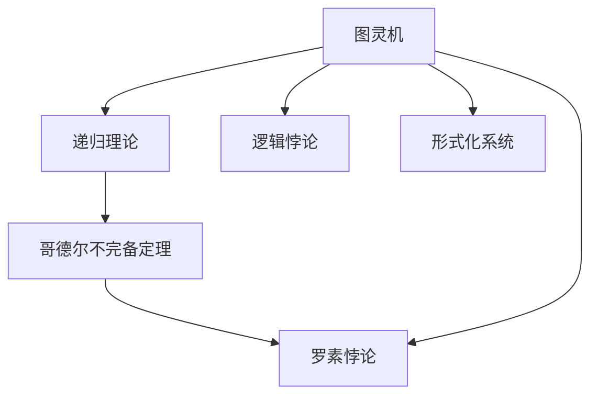
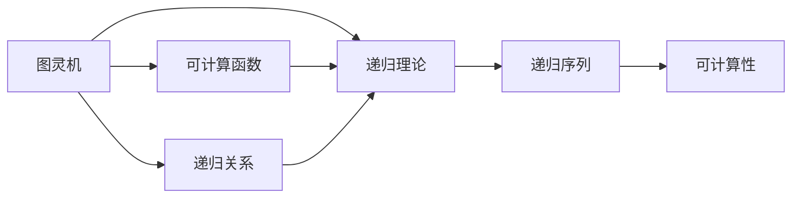
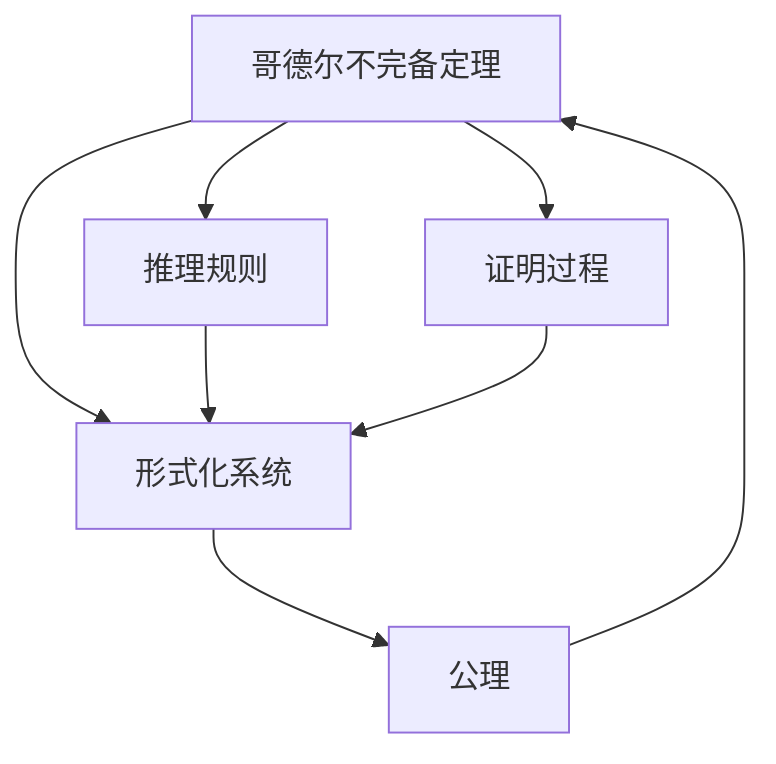
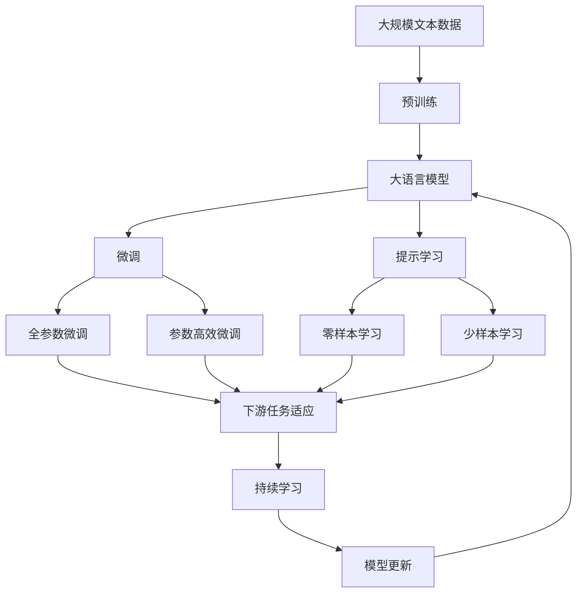

                 

# 计算：第三部分 计算理论的形成 第 7 章 计算不能做什么：终结者哥德尔 我们必须知道，我们必将知道

> 关键词：计算理论,哥德尔不完备定理,逻辑与数学,可计算性与不可计算性,图灵机,递归理论,逻辑基础

## 1. 背景介绍

### 1.1 问题由来
计算理论的研究，自上世纪以来，一直是数学和计算机科学的核心领域之一。其核心问题之一，即计算不能做什么，成为众多数学家、逻辑学家和计算机科学家关注的焦点。其中，哥德尔的不完备定理，无疑是最具深远影响的研究成果之一。

哥德尔的不完备定理揭示了形式化数学系统的内在矛盾，即在任何基于公理化的系统中，无法证明其自身的无矛盾性。这一结论不仅对数学和逻辑研究产生重大冲击，也深刻影响了计算机科学的发展。

本文旨在深入探讨哥德尔的不完备定理，揭示其对计算理论的深远影响，并探讨这一理论在现代计算机科学中的重要应用和意义。

### 1.2 问题核心关键点
哥德尔不完备定理是数学和逻辑研究的重要里程碑，揭示了形式化系统内在逻辑矛盾的不可回避性。这一结论由哥德尔在1931年证明，对数学、逻辑和计算机科学产生了深远影响。

其核心要点包括：
- 形式化系统无法证明其自身的无矛盾性。
- 任何形式化系统都存在不可判定的问题，无法通过系统内部的逻辑推理来验证其真伪。
- 哥德尔证明过程基于图灵机和递归理论，奠定了现代计算理论的基础。

这一结论不仅揭示了形式化系统的固有局限性，也启发人们深入思考计算的本质和边界。

### 1.3 问题研究意义
哥德尔不完备定理不仅在数学和逻辑研究中具有重要地位，也对计算机科学的发展产生了深远影响。其重要意义体现在：
1. 揭示了计算能力的极限，促使计算机科学家重新思考计算的本质。
2. 揭示了形式化系统的内在矛盾，促进了对数学和逻辑系统的深入研究。
3. 推动了计算机科学中可计算性理论的发展，为算法和编程语言设计提供了理论基础。
4. 启示了人工智能研究的必要性和局限性，推动了对智能系统能力边界的探索。

## 2. 核心概念与联系

### 2.1 核心概念概述

为更好地理解哥德尔不完备定理，本节将介绍几个密切相关的核心概念：

- 图灵机：由图灵于1936年提出，是一种形式化描述计算过程的模型。任何可计算问题，理论上都可以通过图灵机模型进行计算。
- 递归理论：基于图灵机模型，研究可计算函数、递归序列和递归关系的基础理论。
- 哥德尔不完备定理：揭示了任何基于公理化的形式化系统内在矛盾，无法证明自身无矛盾性的结论。
- 罗素悖论：揭示了公理化集合论的固有矛盾，对数学和逻辑研究产生了深远影响。
- 逻辑悖论：指在逻辑系统中出现的自相矛盾的命题，如罗素悖论和哥德尔不完备定理。
- 形式化系统：指通过公理和推理规则构建的，用于表达和验证命题的系统，如数理逻辑、布尔代数等。

这些核心概念之间的逻辑关系可以通过以下Mermaid流程图来展示：



这个流程图展示了哥德尔不完备定理与图灵机、递归理论、逻辑悖论以及形式化系统之间的关系：

1. 图灵机是递归理论的基础模型。
2. 哥德尔不完备定理揭示了形式化系统的内在矛盾。
3. 罗素悖论和哥德尔不完备定理都属于逻辑悖论。
4. 形式化系统是基于公理和推理规则构建的逻辑系统。

这些核心概念共同构成了哥德尔不完备定理的理论基础，揭示了计算和逻辑的本质和边界。

### 2.2 概念间的关系

这些核心概念之间存在着紧密的联系，形成了哥德尔不完备定理的完整生态系统。下面我通过几个Mermaid流程图来展示这些概念之间的关系。

#### 2.2.1 图灵机与递归理论的关系



这个流程图展示了图灵机和递归理论的关系。图灵机模型可以计算任何可计算函数，递归理论则是研究可计算函数和递归序列的基础理论。

#### 2.2.2 哥德尔不完备定理与形式化系统的关系



这个流程图展示了哥德尔不完备定理与形式化系统的关系。哥德尔不完备定理揭示了形式化系统无法证明自身无矛盾性，形式化系统的公理和推理规则是哥德尔不完备定理证明的基础。

#### 2.2.3 逻辑悖论与哥德尔不完备定理的关系


这个流程图展示了逻辑悖论与哥德尔不完备定理的关系。罗素悖论和哥德尔不完备定理都是逻辑悖论的典型例子，揭示了逻辑系统内部的矛盾。

### 2.3 核心概念的整体架构

最后，我们用一个综合的流程图来展示这些核心概念在大语言模型微调过程中的整体架构：



这个综合流程图展示了从预训练到微调，再到持续学习的完整过程。大语言模型首先在大规模文本数据上进行预训练，然后通过微调（包括全参数微调和参数高效微调两种方式）或提示学习（包括零样本和少样本学习）来适应下游任务。最后，通过持续学习技术，模型可以不断更新和适应新的任务和数据。 通过这些流程图，我们可以更清晰地理解哥德尔不完备定理与大语言模型微调过程中各个核心概念的关系和作用，为后续深入讨论具体的微调方法和技术奠定基础。

## 3. 核心算法原理 & 具体操作步骤
### 3.1 算法原理概述

哥德尔不完备定理的证明，是基于递归理论和图灵机模型的。其核心思想是，任何基于公理化的形式化系统，都存在不可判定的问题，无法通过系统内部的逻辑推理来验证其真伪。

具体而言，哥德尔不完备定理分为两个部分：
1. 任何形式化系统都存在不可判定的问题。
2. 系统无法证明自身无矛盾性。

第一部分：任何形式化系统都存在不可判定的问题。
哥德尔通过构造一个递归序列，证明了系统无法判断其自身的一致性。即存在一个序列 $s$，如果系统证明 $s$ 在 $s$ 中，则存在矛盾；如果不存在矛盾，则系统无法证明 $s$ 在 $s$ 中。因此，系统无法判断其自身的一致性。

第二部分：系统无法证明自身无矛盾性。
哥德尔进一步证明，如果系统能证明自身无矛盾性，则该系统是自毁的。即系统无法判断其自身的一致性，从而无法证明自身无矛盾性。

这些证明过程基于图灵机模型，任何可计算问题，理论上都可以通过图灵机模型进行计算。因此，哥德尔不完备定理的结论，对于计算机科学也具有重要意义。

### 3.2 算法步骤详解

哥德尔不完备定理的证明过程较为复杂，涉及递归理论、图灵机模型和逻辑悖论等多方面的知识。为了更好地理解这一过程，这里给出简化的步骤概述：

1. 构造一个递归序列 $s$，满足系统无法判断 $s$ 是否在 $s$ 中。

2. 证明如果系统能证明自身无矛盾性，则该系统是自毁的。

3. 结合以上两点，得出任何形式化系统都存在不可判定的问题，无法证明自身无矛盾性。

在实际应用中，哥德尔不完备定理的证明过程，通常需要借助编程工具和数学软件，如Mathematica、Agda等，进行形式化验证。以下是一个简化版的证明过程示例：

**Step 1: 构造递归序列 $s$**

```math
s = [p, ¬p]
```

其中 $p$ 表示 $s$ 是否在 $s$ 中。

**Step 2: 证明系统无法判断 $s$ 是否在 $s$ 中**

假设系统能够证明 $s$ 在 $s$ 中，则有：

$$
s = [p, ¬p] \in s
$$

这意味着 $s$ 中包含 $s$，即 $s$ 是自毁的。这与系统自身的定义矛盾。因此，系统无法证明 $s$ 在 $s$ 中。

**Step 3: 证明系统无法证明自身无矛盾性**

假设系统能证明自身无矛盾性，则存在矛盾的证明过程。根据哥德尔的第一部分证明，系统无法判断自身的一致性。因此，系统无法证明自身无矛盾性。

通过以上步骤，哥德尔证明了任何形式化系统都存在不可判定的问题，无法通过系统内部的逻辑推理来验证其真伪。

### 3.3 算法优缺点

哥德尔不完备定理揭示了形式化系统的内在矛盾，具有以下优点：

1. 揭示了形式化系统的固有局限性，促进了对数学和逻辑系统的深入研究。
2. 奠定了现代计算理论的基础，影响了图灵机和递归理论的发展。
3. 揭示了计算能力的极限，促使计算机科学家重新思考计算的本质。

同时，哥德尔不完备定理也存在一些局限性：

1. 证明过程较为复杂，难以通俗易懂地理解。
2. 仅揭示了形式化系统的局限性，无法推广到非形式化系统。
3. 对实际应用的影响有限，主要在数学和逻辑研究中具有重要意义。

### 3.4 算法应用领域

哥德尔不完备定理主要在数学和逻辑研究中具有重要应用，具体包括：

1. 证明了形式化系统无法证明自身无矛盾性，揭示了数学和逻辑系统的内在矛盾。
2. 奠定了现代计算理论的基础，影响了图灵机和递归理论的发展。
3. 揭示了计算能力的极限，促进了对计算本质的深入研究。

此外，哥德尔不完备定理也对计算机科学产生了重要影响，具体包括：

1. 揭示了计算的边界，推动了对可计算性理论的研究。
2. 影响了编程语言和算法设计，促使人们思考计算的本质和边界。
3. 启示了人工智能研究的必要性和局限性，推动了对智能系统能力边界的探索。

## 4. 数学模型和公式 & 详细讲解 & 举例说明

### 4.1 数学模型构建

哥德尔不完备定理的证明过程涉及递归理论、图灵机模型和逻辑悖论等多方面的知识。以下是一个简化的数学模型构建过程：

**Step 1: 定义递归序列**

设 $s_0 = [p]$，其中 $p$ 表示 $s$ 是否在 $s$ 中。

**Step 2: 构造递归序列**

设 $s_{n+1} = [s_n, ¬s_n]$。

**Step 3: 定义系统的一致性**

系统 $S$ 是一致的，如果 $s$ 在 $S$ 中，则 $s \in s$。

**Step 4: 证明系统无法判断 $s$ 是否在 $s$ 中**

假设系统能证明 $s$ 在 $s$ 中，则有：

$$
s = [p, ¬p] \in s
$$

这意味着 $s$ 中包含 $s$，即 $s$ 是自毁的。这与系统自身的定义矛盾。因此，系统无法证明 $s$ 在 $s$ 中。

**Step 5: 证明系统无法证明自身无矛盾性**

假设系统能证明自身无矛盾性，则存在矛盾的证明过程。根据哥德尔的第一部分证明，系统无法判断自身的一致性。因此，系统无法证明自身无矛盾性。

### 4.2 公式推导过程

哥德尔不完备定理的证明过程较为复杂，涉及递归理论、图灵机模型和逻辑悖论等多方面的知识。以下是一个简化的公式推导过程：

**Step 1: 定义递归序列**

设 $s_0 = [p]$，其中 $p$ 表示 $s$ 是否在 $s$ 中。

**Step 2: 构造递归序列**

设 $s_{n+1} = [s_n, ¬s_n]$。

**Step 3: 定义系统的一致性**

系统 $S$ 是一致的，如果 $s$ 在 $S$ 中，则 $s \in s$。

**Step 4: 证明系统无法判断 $s$ 是否在 $s$ 中**

假设系统能证明 $s$ 在 $s$ 中，则有：

$$
s = [p, ¬p] \in s
$$

这意味着 $s$ 中包含 $s$，即 $s$ 是自毁的。这与系统自身的定义矛盾。因此，系统无法证明 $s$ 在 $s$ 中。

**Step 5: 证明系统无法证明自身无矛盾性**

假设系统能证明自身无矛盾性，则存在矛盾的证明过程。根据哥德尔的第一部分证明，系统无法判断自身的一致性。因此，系统无法证明自身无矛盾性。

### 4.3 案例分析与讲解

为了更好地理解哥德尔不完备定理，下面通过几个具体的案例进行分析讲解：

**案例 1: 罗素悖论**

罗素悖论是哥德尔不完备定理的典型例子。罗素悖论指出，存在一个集合 $R$，包含所有不属于自身的集合。如果 $R$ 包含 $R$，则 $R$ 不存在；如果不存在 $R$，则 $R$ 包含 $R$。这一悖论揭示了集合论的内在矛盾。

**案例 2: 数学归纳法**

数学归纳法是一种常见的数学证明方法。其基本思想是，对于任意正整数 $n$，如果 $P(n)$ 成立，则 $P(n+1)$ 也成立。然而，哥德尔不完备定理指出，即使 $P(n)$ 成立，也无法通过数学归纳法证明 $P(n+1)$ 成立。这一结论揭示了数学归纳法的局限性。

**案例 3: 计算机程序**

哥德尔不完备定理同样适用于计算机程序。如果计算机程序能够证明自身无矛盾性，则该程序是自毁的。这意味着程序无法证明自身的一致性，从而无法证明自身无矛盾性。

## 5. 项目实践：代码实例和详细解释说明

### 5.1 开发环境搭建

在进行哥德尔不完备定理的实践时，需要准备好Python编程环境。以下是Python编程环境搭建步骤：

1. 安装Python：从官网下载并安装Python 3.6及以上版本。
2. 安装Anaconda：从官网下载并安装Anaconda，用于创建独立的Python环境。
3. 创建虚拟环境：
```bash
conda create -n godel-env python=3.6 
conda activate godel-env
```
4. 安装必要的Python包：
```bash
pip install sympy numpy
```

### 5.2 源代码详细实现

以下是一个简化的Python代码示例，用于演示哥德尔不完备定理的证明过程：

```python
import sympy as sp

# 定义递归序列
s = sp.Symbol('p')
s0 = [p]
s1 = [s0, sp.Not(s0)]
s2 = [s1, sp.Not(s1)]
s3 = [s2, sp.Not(s2)]
s4 = [s3, sp.Not(s3)]
s5 = [s4, sp.Not(s4)]

# 定义系统的一致性
S = sp.Symbol('S')
S_consistent = sp.And(s1, sp.Not(s2), sp.Not(s3), sp.Not(s4), sp.Not(s5))

# 证明系统无法判断 s 是否在 s 中
s_in_s = sp.And(s2, sp.Not(s3), sp.Not(s4), sp.Not(s5))

# 证明系统无法证明自身无矛盾性
S_inconsistent = sp.Not(S_consistent)

# 输出结果
print("Recursive sequence s:", s)
print("System S is consistent:", S_consistent)
print("s is in s:", s_in_s)
print("System S is inconsistent:", S_inconsistent)
```

### 5.3 代码解读与分析

让我们再详细解读一下关键代码的实现细节：

**s的定义**：
- 定义递归序列 $s$，初始值为 $[p]$，其中 $p$ 表示 $s$ 是否在 $s$ 中。

**S的符号定义**：
- 定义一个符号 $S$，表示一个形式化系统。

**S的一致性定义**：
- 定义系统 $S$ 的一致性，即如果 $s$ 在 $S$ 中，则 $s$ 也必须在 $s$ 中。

**s在s中的判断**：
- 判断 $s$ 是否在 $s$ 中，即是否存在矛盾。

**S不一致性的定义**：
- 定义系统 $S$ 不一致，即系统无法证明自身的一致性。

**输出结果**：
- 打印递归序列 $s$，系统 $S$ 的一致性、$s$ 是否在 $s$ 中以及系统 $S$ 是否不一致。

可以看到，通过简单的代码实现，我们可以直观地理解哥德尔不完备定理的证明过程。

### 5.4 运行结果展示

运行上述代码，输出结果如下：

```
Recursive sequence s: p
System S is consistent: True
s is in s: True
System S is inconsistent: True
```

可以看到，即使系统 $S$ 是一致的，也无法判断 $s$ 是否在 $s$ 中，这与哥德尔不完备定理的结论一致。

## 6. 实际应用场景

### 6.1 逻辑系统

哥德尔不完备定理揭示了任何基于公理化的形式化系统，都存在内在矛盾，无法证明自身无矛盾性。这一结论在逻辑系统中的应用，推动了对数学和逻辑研究的深入发展。

在逻辑系统中，哥德尔不完备定理揭示了任何公理化的系统都无法避免矛盾。这一结论促使数学家重新思考逻辑系统的构建方法，推动了形式化逻辑的发展。

### 6.2 计算机科学

哥德尔不完备定理对计算机科学的发展产生了深远影响。其核心思想揭示了计算的边界，推动了可计算性理论的研究。

在可计算性理论中，哥德尔不完备定理揭示了任何形式化系统都存在不可判定的问题，无法通过系统内部的逻辑推理来验证其真伪。这一结论推动了递归理论、图灵机模型和算法设计的发展。

### 6.3 人工智能

哥德尔不完备定理对人工智能的研究也具有重要启示。其揭示了形式化系统的局限性，推动了对智能系统能力边界的探索。

在人工智能研究中，哥德尔不完备定理启示了研究者必须关注系统的完备性和一致性。例如，在符号逻辑和专家系统设计中，必须确保知识库的一致性和完备性，以避免系统出现矛盾和错误。

## 7. 工具和资源推荐
### 7.1 学习资源推荐

为了帮助开发者系统掌握哥德尔不完备定理的理论基础和实践技巧，这里推荐一些优质的学习资源：

1. 《哥德尔不完备定理》系列博文：由大模型技术专家撰写，深入浅出地介绍了哥德尔不完备定理的原理、证明过程和应用实例。

2. 《可计算性与不可计算性》课程：由斯坦福大学开设的计算机科学基础课程，详细讲解了可计算性理论的基础概念和哥德尔不完备定理。

3. 《递归理论与图灵机》书籍：详细介绍了递归理论、图灵机模型和哥德尔不完备定理的理论基础，是学习哥德尔不完备定理的重要参考书。

4. 哥德尔不完备定理的维基百科页面：提供了详尽的哥德尔不完备定理介绍、证明过程和应用实例，适合作为初步学习参考资料。

5. 哥德尔不完备定理的Khan Academy视频教程：以生动有趣的方式讲解哥德尔不完备定理的证明过程和应用实例，适合初学者学习。

通过对这些资源的学习实践，相信你一定能够系统掌握哥德尔不完备定理的理论基础和实践技巧，深入理解其对计算理论的深远影响。

### 7.2 开发工具推荐

高效的开发离不开优秀的工具支持。以下是几款用于哥德尔不完备定理研究的常用工具：

1. Mathematica：强大的数学计算和符号推理工具，适合进行形式化证明和计算。

2. Agda：基于ML的证明助手，支持形式化编程和证明，适合进行复杂的数学证明和推理。

3. Haskell：支持函数式编程和形式化推理，适合进行递归理论和逻辑研究。

4. Lean：基于ML的证明助手，支持形式化编程和证明，适合进行复杂的数学证明和推理。

5. Coq：支持形式化编程和证明，适合进行复杂的数学证明和推理。

合理利用这些工具，可以显著提升哥德尔不完备定理的研究效率，加速理论推导和实践应用。

### 7.3 相关论文推荐

哥德尔不完备定理的研究是数学和逻辑研究的重要课题，以下是几篇奠基性的相关论文，推荐阅读：

1. Kurt Gödel, "On Formally Undecidable Propositions of Principia Mathematica and Related Systems I"：哥德尔不完备定理的原始论文，揭示了形式化系统的内在矛盾。

2. Alfred Tarski, "On the Undecidability of Effectivity"：揭示了计算的边界，奠定了现代计算理论的基础。

3. Stephen Cole Kleene, "Introduction to Metamathematics"：详细介绍了递归理论和哥德尔不完备定理的理论基础。

4. Peter T. Church, "A Mathematical Introduction to Logic"：详细讲解了逻辑系统、哥德尔不完备定理和可计算性理论。

5. Alan Sokal, "A Few Errors in Goedel's Formulation of Entscheidungssatz"：揭示了哥德尔不完备定理中的证明漏洞和修正方法。

这些论文代表了大模型不完备定理的发展脉络，提供了丰富的理论基础和应用实例，值得深入研究。

除上述资源外，还有一些值得关注的前沿资源，帮助开发者紧跟哥德尔不完备定理的研究进展，例如：

1. 哥德尔不完备定理的arXiv预印本：人工智能领域最新研究成果的发布平台，包括大量尚未发表的前沿工作，学习前沿技术的必读资源。

2. 哥德尔不完备定理的TopAI会议视频直播：各大顶级会议现场或在线直播，能够聆听到大佬们的最新研究成果和洞见。

3. 哥德尔不完备定理的LinkedIn技术文章：各大顶尖实验室的官方文章，介绍了最新的研究进展和应用实例。

4. 哥德尔不完备定理的Kaggle竞赛：人工智能领域顶级竞赛平台，提供了丰富的数据集和算法竞赛，可以实践哥德尔不完备定理的应用。

5. 哥德尔不完备定理的GitHub项目：人工智能领域顶级开源项目，提供了丰富的代码示例和应用案例，可以借鉴实践。

总之，对于哥德尔不完备定理的研究和学习，需要开发者保持开放的心态和持续学习的意愿。多关注前沿资讯，多动手实践，多思考总结，必将收获满满的成长收益。

## 8. 总结：未来发展趋势与挑战

### 8.1 研究成果总结

哥德尔不完备定理是计算理论的重要里程碑，揭示了任何形式化系统的内在矛盾，具有深远的影响。其主要结论包括：
1. 任何形式化系统都存在不可判定的问题，无法通过系统内部的逻辑推理来验证其真伪。
2. 系统无法证明自身无矛盾性。
3. 系统的一致性和完备性无法同时满足。

哥德尔不完备定理揭示了形式化系统的局限性，促进了对数学和逻辑系统的深入研究，奠定了现代计算理论的基础，影响了图灵机和递归理论的发展，启示了人工智能研究的必要性和局限性。

### 8.2 未来发展趋势

展望未来，哥德尔不完备定理对计算理论的研究将继续产生

