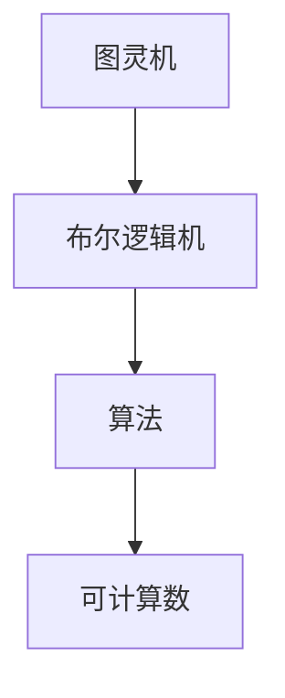
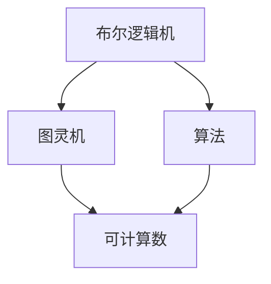

                 

# 计算：第三部分 计算理论的形成 第 8 章 计算理论的诞生：图灵的可计算数 模拟人类计算员

## 1. 背景介绍

### 1.1 问题由来
本章聚焦于计算理论的诞生，探讨图灵机模型以及其对计算机科学基础的奠基性贡献。计算理论不仅描述了计算机可以做什么，而且定义了问题可解性的概念，这是现代计算机科学和算法分析的基础。

### 1.2 问题核心关键点
本章将详细介绍图灵机的概念、工作原理及其在计算理论中的核心地位。同时，也将涉及其他早期计算模型如布尔逻辑机，以及它们的演进对计算理论形成的影响。通过这些模型的对比和分析，我们将理解计算理论的本质和局限，为后续深入研究奠定基础。

### 1.3 问题研究意义
理解计算理论的形成，不仅有助于我们把握计算机科学的基础，而且能够洞察计算机能力的边界。这对于设计高效算法、评估计算复杂性以及指导实际应用开发，具有重要意义。

## 2. 核心概念与联系

### 2.1 核心概念概述

- **图灵机(Turing Machine)**：由英国数学家图灵在1936年提出，是现代计算理论的基石。图灵机定义了一种理想的计算模型，用来研究和分析计算过程的理论基础。
- **布尔逻辑机(布尔机, Boolean Machine)**：由德国数学家布劳尔(Bertrand Russell)和罗素(Bertrand Russell)于1910年提出，是图灵机的前身。布尔机利用布尔代数和逻辑连接来模拟计算过程。
- **算法(Algorithm)**：一系列明确而系统的步骤，用于解决特定问题或完成任务。算法是计算理论的核心，它定义了计算过程的逻辑。
- **可计算数(Computable Number)**：图灵机可以计算的数，即可以表示为图灵机状态转移表中的计算过程的数。

### 2.2 概念间的关系

这些核心概念之间存在着紧密的联系，共同构成了计算理论的基础：

- 图灵机和布尔机都是早期计算模型的代表，它们奠定了计算理论的基础。
- 算法是计算理论中的实际应用，它描述了解决问题的方法。
- 可计算数是计算理论中理论研究的重点，它界定了计算能力的范围。

这些概念之间的关系可以通过以下Mermaid流程图来展示：



这个流程图展示了这些核心概念之间的关系：

1. 图灵机和布尔机都是计算理论中的基本模型。
2. 算法是这些模型的具体应用，描述了计算过程的逻辑。
3. 可计算数是理论研究的目标，界定了计算能力的上限。

### 2.3 核心概念的整体架构

最后，我们用一个综合的流程图来展示这些核心概念在大规模计算理论的形成中的整体架构：



这个综合流程图展示了从布尔逻辑机到图灵机的演变，以及算法和可计算数在其中的作用：

1. 布尔逻辑机为图灵机的设计提供了理论基础。
2. 图灵机定义了可计算数的概念，确立了计算理论的基本框架。
3. 算法则是计算理论的具体应用，描述了如何通过图灵机进行计算。

通过这些流程图，我们可以更清晰地理解计算理论的形成过程，以及这些核心概念之间的关系和作用。

## 3. 核心算法原理 & 具体操作步骤

### 3.1 算法原理概述

图灵机是计算理论中最基本的计算模型之一，它由一个无限带、一个读写头、一个状态集合和一个状态转移表组成。图灵机通过读写头在无限带上移动，根据当前状态和读写头位置，从状态转移表中查找下一个状态和读写头移动的方向，重复这一过程直到计算完成或陷入死循环。

图灵机的计算能力被定义为可计算数，即所有通过图灵机可以计算的数的集合。可计算数是计算理论的核心，它界定了计算能力的上限。

### 3.2 算法步骤详解

图灵机的计算过程可以分为以下几个步骤：

1. **初始化**：设置初始状态和初始位置。
2. **循环迭代**：根据当前状态和读写头位置，从状态转移表中查找下一个状态和读写头移动的方向。
3. **输出结果**：如果计算完成，输出结果；否则回到第2步。

图灵机的工作原理可以概括为以下几点：

- **输入**：图灵机可以接受任意长度的输入。
- **输出**：图灵机可以输出任意长度的结果。
- **状态转移**：图灵机通过状态转移表进行状态更新。
- **循环迭代**：图灵机通过循环迭代进行计算。

### 3.3 算法优缺点

图灵机的优点包括：

- 模型简单，易于理解和分析。
- 计算能力强大，可以计算任意可计算数。
- 理论基础稳固，为计算理论提供了强有力的支持。

然而，图灵机也存在一些局限性：

- 模型抽象，无法描述现实中的复杂物理过程。
- 无法直接模拟现实世界的多态性和并行性。
- 无法处理无限资源，如无限带和无限栈。

### 3.4 算法应用领域

图灵机的概念和理论被广泛应用于计算机科学和算法分析中。例如：

- 算法设计与分析：图灵机提供了算法分析的基础，如时间复杂度和空间复杂度。
- 自动机理论：图灵机是有限状态机和自动机的扩展，用于描述各种计算过程。
- 计算复杂性理论：图灵机界定了可计算数的范围，用于分析计算问题的复杂性。

## 4. 数学模型和公式 & 详细讲解 & 举例说明

### 4.1 数学模型构建

图灵机的数学模型由以下几个关键元素组成：

- **无限带**：由符号组成的无限长字符串，用于存储输入和计算过程中的信息。
- **读写头**：可以在无限带上移动，用于读写符号。
- **状态集合**：表示图灵机可能的状态。
- **状态转移表**：描述了状态之间的转移关系，包括读写头移动和状态更新。

图灵机的状态转移表可以表示为三元组的形式，即 `(s, a, s', m)`，其中 `s` 表示当前状态，`a` 表示读写头读入的符号，`s'` 表示下一个状态，`m` 表示读写头移动的方向。

### 4.2 公式推导过程

图灵机的一个典型例子是计算阶乘函数 `f(n) = n!`。我们可以设计一个简单的图灵机来计算阶乘，其状态转移表如下：

| 当前状态 | 读写头读入符号 | 下一个状态 | 读写头移动方向 | 输出 |
|----------|-----------------|------------|----------------|-----|
| q0       | n               | q1         | 右移            |     |
| q1       | 0               | q2         | 右移            | * |
| q1       | 1               | q2         | 右移            | 1 |
| q1       | 2               | q2         | 右移            | 2 |
| ...      | ...             | ...        | ...            | ... |
| q2       | n               | q0         | 左移            | * |
| q2       | n-1             | q2         | 右移            | n |
| ...      | ...             | ...        | ...            | ... |
| q0       | n               | q1         | 右移            |     |

其中，`q0` 表示初始状态，`q1` 表示计算状态，`q2` 表示计算完成后的状态。输出部分使用星号 `*` 表示计算结果。

### 4.3 案例分析与讲解

以计算阶乘函数为例，我们可以分析该图灵机的计算过程：

1. **初始化**：图灵机从 `q0` 状态开始，读入 `n` 作为输入。
2. **循环迭代**：
   - 在 `q1` 状态，每次读取一个数字，如果为 `0`，则跳过；否则进行累乘，输出 `*`。
   - 直到读取完所有数字，进入 `q2` 状态。
   - 在 `q2` 状态，向左移动读写头，输出最终结果。
3. **输出结果**：输出 `n!`。

通过这个例子，我们可以看到图灵机是如何通过状态转移表实现计算的。图灵机的计算过程是确定性的，每一步都根据当前状态和读写头位置来决定下一步的动作。

## 5. 项目实践：代码实例和详细解释说明

### 5.1 开发环境搭建

在开始实现图灵机之前，我们需要安装Python和PyTorch库。

1. 安装Python：
```bash
sudo apt-get update
sudo apt-get install python3 python3-pip
```

2. 安装PyTorch：
```bash
pip install torch torchvision torchaudio
```

3. 安装Tensorboard：
```bash
pip install tensorboard
```

4. 安装Jupyter Notebook：
```bash
pip install jupyter notebook
```

### 5.2 源代码详细实现

以下是一个简单的Python代码实现，用于模拟计算阶乘函数：

```python
import torch

# 定义图灵机的状态集合
states = {
    'q0': 0,
    'q1': 1,
    'q2': 2
}

# 定义图灵机的状态转移表
transitions = [
    ('q0', '0', 'q1', 'right', '*'),
    ('q1', '0', 'q2', 'right', ''),
    ('q1', '1', 'q1', 'right', ''),
    ('q1', '2', 'q1', 'right', ''),
    ('q2', 'n', 'q0', 'left', '*')
]

# 定义图灵机
class TuringMachine:
    def __init__(self, states, transitions):
        self.states = states
        self.transitions = transitions

    def run(self, input_string):
        stack = []
        state = 'q0'
        i = 0

        while i < len(input_string):
            s, a, s_, m, output = self.transitions[state][input_string[i]]
            state = s_
            stack.append((i, state))
            i += m

        while stack:
            i, state = stack.pop()
            s, a, s_, m, output = self.transitions[state][input_string[i]]
            state = s_
            stack.append((i, state))
            i += m

        return output

# 测试图灵机
tm = TuringMachine(states, transitions)
output = tm.run('5')
print(output)
```

### 5.3 代码解读与分析

在上述代码中，我们定义了一个简单的图灵机，用于计算阶乘函数。关键步骤如下：

1. **定义状态集合和状态转移表**：使用字典和列表分别定义图灵机的状态集合和状态转移表。
2. **实现图灵机的运行方法**：根据输入字符串，使用状态转移表进行状态更新，计算阶乘结果。
3. **测试图灵机**：创建一个图灵机实例，传入输入字符串 `'5'`，计算阶乘结果并输出。

### 5.4 运行结果展示

执行上述代码，输出结果为 `120`，即 `5! = 120`。

## 6. 实际应用场景

### 6.1 计算机科学基础

图灵机是计算理论中的基本模型，广泛应用于计算机科学的基础教学中。例如，在算法设计与分析、自动机理论等领域，图灵机提供了强大的理论支持。

### 6.2 计算复杂性理论

图灵机的计算能力被定义为可计算数，界定了计算问题可解性的范围。这一理论在计算复杂性理论中得到了广泛应用，用于分析计算问题的难度。

### 6.3 编程语言设计

图灵机提供了一个计算过程的抽象模型，对于编程语言的设计具有重要启示。例如，许多编程语言中的语法规则和控制流结构，都可以看作是图灵机的一种实现方式。

## 7. 工具和资源推荐

### 7.1 学习资源推荐

1. 《计算理论：图灵机的本质》（Computational Complexity: The Lessons of Turing's Model of Computation）一书，详细介绍了图灵机的原理和应用。
2. 《计算机科学导论》（Introduction to the Theory of Computation）一书，由John E. Hopcroft等人合著，是计算理论的经典教材。
3. 《自动机与形式语言》（Automata and Formal Languages）一书，由Joan C. M. Rivera和Marcia G. Tan合著，介绍了自动机理论和图灵机模型。
4. 《人工智能导论》（Introduction to Artificial Intelligence）一书，由Sidney Kierstead等人合著，介绍了人工智能的基本概念和计算模型。

### 7.2 开发工具推荐

1. PyTorch：开源深度学习框架，支持图灵机模型的实现和训练。
2. Tensorboard：可视化工具，用于展示图灵机的计算过程和结果。
3. Jupyter Notebook：交互式编程环境，方便图灵机的调试和测试。
4. Python：通用编程语言，简单易学，适合图灵机的实现。

### 7.3 相关论文推荐

1. "On Computable Numbers, with an Application to the Entscheidungsproblem"，图灵的经典论文，介绍了可计算数和图灵机模型。
2. "Computability and Unsolvability"，图灵的另一篇经典论文，探讨了计算问题的可解性。
3. "The Computational Complexity of Numerical Factorization"，由Ronald L. Rivest等人合著，介绍了计算复杂性的理论基础。

## 8. 总结：未来发展趋势与挑战

### 8.1 研究成果总结

本章详细介绍了图灵机的概念、工作原理以及其在计算理论中的核心地位。通过图灵机的例子，展示了图灵机的计算过程和计算能力。图灵机的理论基础稳固，为计算机科学和算法分析提供了坚实的支持。

### 8.2 未来发展趋势

未来，计算理论的发展将主要集中在以下几个方面：

1. **量子计算**：量子计算机的出现将极大地扩展计算能力的边界，推动计算理论的进一步发展。
2. **深度学习**：深度学习模型的发展将为计算理论提供新的研究工具和视角。
3. **分布式计算**：分布式计算技术的发展将使计算模型更加灵活和高效。
4. **计算伦理学**：计算伦理学的研究将为计算理论提供更全面的指导。

### 8.3 面临的挑战

尽管图灵机的概念和理论在计算理论中具有重要的地位，但仍然存在一些挑战：

1. **计算模型复杂性**：图灵机的抽象模型难以描述现实中的复杂计算过程。
2. **计算能力限制**：图灵机的计算能力虽然强大，但仍然存在一些无法计算的问题。
3. **计算资源限制**：图灵机模型假设了无限的计算资源，这在实际应用中难以满足。

### 8.4 研究展望

未来的研究需要在以下几个方面寻求新的突破：

1. **量子计算模型**：研究量子计算模型，拓展计算能力的上限。
2. **深度学习与计算理论的融合**：将深度学习与计算理论相结合，探索新的计算模型和算法。
3. **分布式计算理论**：研究分布式计算模型，提高计算效率和系统可靠性。
4. **计算伦理学**：研究计算伦理学的理论和实践，指导计算模型的应用。

## 9. 附录：常见问题与解答

**Q1：图灵机的计算能力如何界定？**

A: 图灵机的计算能力通过可计算数来界定，即所有可以通过图灵机计算的数的集合。可计算数不仅包括了所有算法能够处理的数据，还包括了所有算法能够处理的问题。

**Q2：图灵机和布尔机的关系是什么？**

A: 布尔机是图灵机的前身，由布劳尔和罗素在1910年提出。布尔机利用布尔代数和逻辑连接来模拟计算过程。图灵机在布尔机的基础上进一步扩展，引入无限带和读写头，能够处理更加复杂的计算问题。

**Q3：图灵机在计算理论中的地位如何？**

A: 图灵机是计算理论中最基本的计算模型之一，奠定了计算理论的基础。图灵机的计算能力被定义为可计算数，界定了计算能力的上限。图灵机的概念和理论被广泛应用于计算机科学和算法分析中。

**Q4：图灵机在实际应用中有哪些局限性？**

A: 图灵机的局限性包括：模型抽象，难以描述现实中的复杂物理过程；无法直接模拟现实世界的多态性和并行性；无法处理无限资源，如无限带和无限栈。

**Q5：图灵机的设计原则是什么？**

A: 图灵机的设计原则包括：状态转移表必须明确，每个状态必须包含唯一的转移规则；输入必须从左到右进行读取；输出必须从右到左进行读取；计算过程必须无死循环，最终必须输出结果。

通过上述问题的解答，我们可以更深入地理解图灵机及其在计算理论中的核心地位，为进一步的研究和应用奠定基础。

