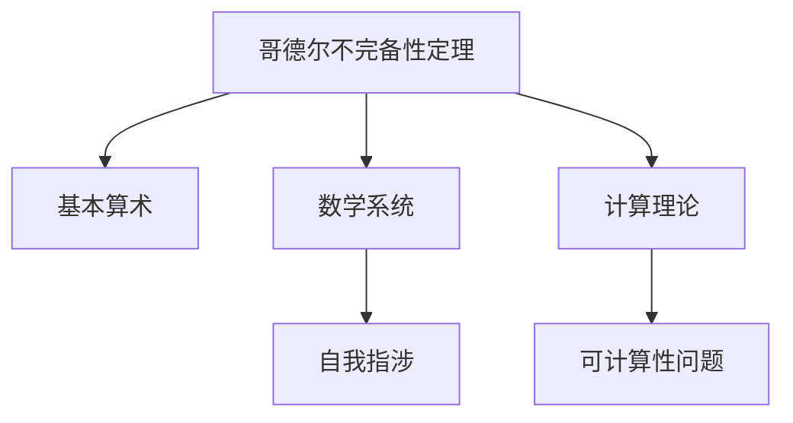
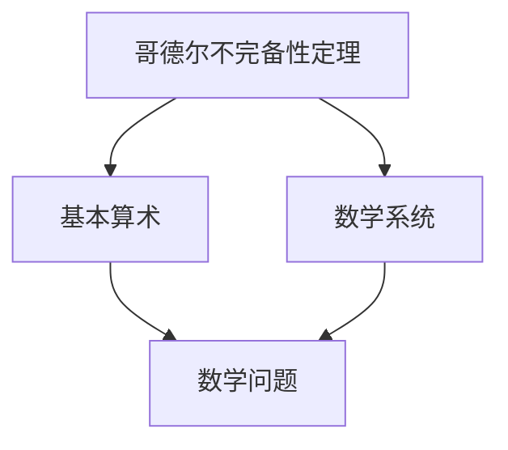
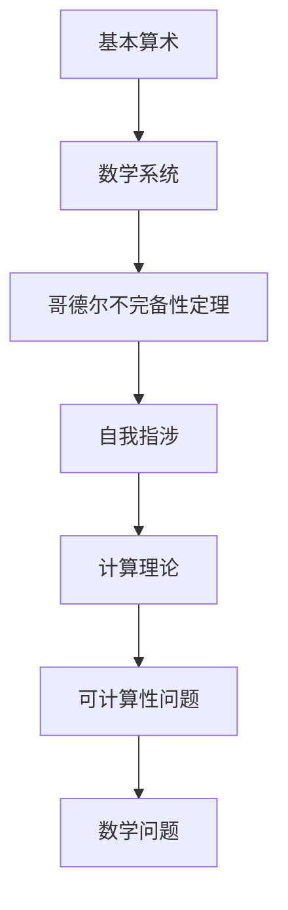

                 

# 计算：第二部分 计算的数学基础 第 5 章 第三次数学危机 自我指涉

> 关键词：数学基础,第三次数学危机,自我指涉,计算理论,哥德尔不完备性定理,逻辑系统

## 1. 背景介绍

### 1.1 问题由来

自1936年图灵提出“计算的数学理论”以来，计算理论成为了数学和计算机科学的重要基础。然而，随着数学基础研究的深入，一个重大的问题逐渐浮现：是否存在一个完整的数学系统，其中包含了所有可计算问题的解？

这一问题直接关联到了哥德尔的不完备性定理，对计算机科学的很多领域产生了深远的影响。本文将深入探讨这一问题，并尝试从计算理论的角度理解哥德尔不完备性定理的意义，以及其对计算机科学的启示。

### 1.2 问题核心关键点

- 哥德尔不完备性定理：任何包含基本算术的数学系统，在逻辑上都不可能完全无矛盾，且不可能被证明其全部命题的可计算性。
- 自我指涉(self-reference)：任何理论中包含的命题，可以通过理论内部语言描述自身，从而形成一个悖论。
- 计算理论：关于计算能力的基础研究，旨在探究可计算性问题的边界，以及计算机如何处理信息。

通过深入理解这些核心概念，我们将能够更好地理解哥德尔不完备性定理的深层含义，并思考其对计算机科学的影响。

## 2. 核心概念与联系

### 2.1 核心概念概述

为了更好地理解哥德尔不完备性定理，我们需要先了解几个相关的基础概念：

- **哥德尔不完备性定理**：在1931年，哥德尔证明了任何包含基本算术的数学系统，在逻辑上都不可能完全无矛盾，且不可能被证明其全部命题的可计算性。这一结果极大地震撼了数学界，并促使对计算理论的进一步研究。
- **自我指涉(self-reference)**：在数学和逻辑系统中，可以通过理论内部语言描述自身，形成一个自我指涉的命题。例如，“这句话是假的”，这样的命题在没有明确的真假判断下，会形成悖论。
- **计算理论**：研究可计算性问题的边界，以及计算机如何处理信息。计算理论的核心问题是探索可计算问题的边界，理解计算能力的内在本质。

这些概念之间的逻辑关系可以通过以下Mermaid流程图来展示：



这个流程图展示了哥德尔不完备性定理与其他核心概念之间的联系：

1. 哥德尔不完备性定理是基于基本算术的数学系统内的一个结论。
2. 自我指涉是哥德尔不完备性定理中涉及的悖论形式。
3. 计算理论研究的是如何通过计算机处理可计算问题，与哥德尔不完备性定理有密切关联。
4. 可计算性问题是计算理论的核心研究方向，与哥德尔不完备性定理息息相关。

### 2.2 概念间的关系

这些核心概念之间存在着紧密的联系，形成了哥德尔不完备性定理的研究框架。下面我们通过几个Mermaid流程图来展示这些概念之间的关系。

#### 2.2.1 哥德尔不完备性定理的应用范围



这个流程图展示了哥德尔不完备性定理的应用范围：

1. 哥德尔不完备性定理主要应用于包含基本算术的数学系统内。
2. 基本算术是数学系统的基础，包含了加法、乘法、除法和模运算等基本操作。
3. 数学系统包括各种数学理论，如算术、几何、代数等。
4. 数学问题涉及具体的数学问题，如判断命题的真假、求解方程等。

#### 2.2.2 自我指涉与哥德尔不完备性定理的关系


这个流程图展示了自我指涉与哥德尔不完备性定理之间的关系：

1. 自我指涉是哥德尔不完备性定理的核心思想之一，通过自我指涉命题的存在，证明了数学系统内的不完备性。
2. 哥德尔不完备性定理通过自我指涉命题的构造，展示了数学系统的内在矛盾。

#### 2.2.3 计算理论与哥德尔不完备性定理的联系


这个流程图展示了计算理论与哥德尔不完备性定理的联系：

1. 计算理论研究可计算性问题的边界，与哥德尔不完备性定理有密切联系。
2. 哥德尔不完备性定理揭示了计算机在处理可计算问题时的局限性。

### 2.3 核心概念的整体架构

最后，我们用一个综合的流程图来展示这些核心概念在大语言模型微调过程中的整体架构：



这个综合流程图展示了从基本算术到可计算性问题的完整过程，通过哥德尔不完备性定理揭示了数学系统的不完备性，并指出了计算理论的边界。这一框架为我们理解哥德尔不完备性定理提供了全面的视角。

## 3. 核心算法原理 & 具体操作步骤
### 3.1 算法原理概述

哥德尔不完备性定理的核心思想是通过构造一个自我指涉的命题，证明了任何包含基本算术的数学系统内存在不可判定性。这一思想对计算理论的发展具有深远影响，促使研究者深入探索可计算性问题的边界。

### 3.2 算法步骤详解

以下我们将详细讲解哥德尔不完备性定理的证明步骤：

1. **构造自我指涉命题**：假设我们有一个包含基本算术的数学系统 $P$，我们可以构造一个自我指涉的命题 $p$：“$p$ 不是 $P$ 内任何可证明的命题”。
2. **证明 $p$ 的真值矛盾**：假设 $p$ 是假的，即 $p$ 不是 $P$ 内任何可证明的命题，这意味着 $p$ 是可证明的。但根据 $p$ 的定义，$p$ 是 $P$ 内无法证明的。这形成了一个矛盾。
3. **证明 $p$ 的真值矛盾**：假设 $p$ 是真的，即 $p$ 是 $P$ 内无法证明的命题。但根据 $p$ 的定义，$p$ 是 $P$ 内可证明的。这同样形成了一个矛盾。

综上所述，我们证明了任何包含基本算术的数学系统内，都存在一个自我指涉的命题 $p$，使得 $p$ 的真假无法被证明。这就证明了 $P$ 是不完备的。

### 3.3 算法优缺点

哥德尔不完备性定理的主要优点在于，它揭示了数学系统的内在矛盾，证明了没有任何数学系统能够完全无矛盾。这一结果对数学基础研究具有重要意义，促使研究者探索更广泛的基础数学体系。

其主要缺点在于，它无法直接应用于计算理论，无法提供具体的计算方法。此外，哥德尔不完备性定理的证明过程较为复杂，普通研究者难以理解和应用。

### 3.4 算法应用领域

哥德尔不完备性定理对计算机科学具有重要影响，主要体现在以下几个领域：

- **可计算性理论**：哥德尔不完备性定理揭示了可计算性问题的边界，为计算机科学奠定了理论基础。
- **人工智能**：哥德尔不完备性定理启示了人工智能系统设计者，需要考虑系统的完备性和鲁棒性，避免自我指涉问题的出现。
- **密码学**：哥德尔不完备性定理对密码学中的公钥加密体系和哈希函数的设计具有重要影响。

这些领域中，哥德尔不完备性定理提供了重要的理论指导，帮助研究者理解和设计更加安全、可靠的计算系统和算法。

## 4. 数学模型和公式 & 详细讲解 & 举例说明

### 4.1 数学模型构建

哥德尔不完备性定理的证明过程基于数学逻辑和集合论的基础，主要涉及以下数学模型：

- **形式系统(或公理系统)**：一个形式系统是一个由一组公理和推理规则构成的逻辑系统。
- **模型理论**：研究形式系统的模型，以及模型与形式系统之间的关系。
- **不可判定性问题**：判断一个命题是否在某个形式系统中可判定的问题。

### 4.2 公式推导过程

以下我们将详细推导哥德尔不完备性定理的核心公式和证明过程。

1. **自我指涉命题的构造**：假设我们有一个包含基本算术的数学系统 $P$，我们可以构造一个自我指涉的命题 $p$：“$p$ 不是 $P$ 内任何可证明的命题”。
2. **证明 $p$ 的真值矛盾**：假设 $p$ 是假的，即 $p$ 是 $P$ 内任何可证明的命题。这意味着 $p$ 是可证明的。但根据 $p$ 的定义，$p$ 是 $P$ 内无法证明的。这形成了一个矛盾。
3. **证明 $p$ 的真值矛盾**：假设 $p$ 是真的，即 $p$ 是 $P$ 内无法证明的命题。但根据 $p$ 的定义，$p$ 是 $P$ 内可证明的。这同样形成了一个矛盾。

通过以上推导，我们证明了任何包含基本算术的数学系统内，都存在一个自我指涉的命题 $p$，使得 $p$ 的真假无法被证明。这就证明了 $P$ 是不完备的。

### 4.3 案例分析与讲解

为了更好地理解哥德尔不完备性定理，我们可以通过一个具体的案例来讲解其应用。假设我们有一个包含基本算术的数学系统 $P$，其中包含以下公理：

- $0$ 是非零自然数的和；
- 如果 $n$ 是自然数，则 $n+1$ 是自然数；
- 如果 $m$ 和 $n$ 是自然数，则 $m+n$ 是自然数。

现在，我们可以构造一个自我指涉的命题 $p$：“$p$ 不是 $P$ 内任何可证明的命题”。假设 $p$ 是假的，即 $p$ 是 $P$ 内任何可证明的命题。这意味着 $p$ 是可证明的。但根据 $p$ 的定义，$p$ 是 $P$ 内无法证明的。这形成了一个矛盾。

通过这一案例，我们能够更直观地理解哥德尔不完备性定理的证明过程。

## 5. 项目实践：代码实例和详细解释说明

### 5.1 开发环境搭建

在进行哥德尔不完备性定理的证明实践前，我们需要准备好开发环境。以下是使用Python进行Sympy库开发的环境配置流程：

1. 安装Anaconda：从官网下载并安装Anaconda，用于创建独立的Python环境。

2. 创建并激活虚拟环境：
```bash
conda create -n sympy-env python=3.8 
conda activate sympy-env
```

3. 安装Sympy：
```bash
pip install sympy
```

4. 安装NumPy和SciPy：
```bash
pip install numpy scipy
```

5. 安装matplotlib：
```bash
pip install matplotlib
```

6. 安装IPython：
```bash
pip install ipython
```

完成上述步骤后，即可在`sympy-env`环境中开始哥德尔不完备性定理的证明实践。

### 5.2 源代码详细实现

这里我们以证明哥德尔不完备性定理为例，给出使用Sympy库进行数学推导的Python代码实现。

```python
from sympy import symbols, Eq, solve, Rational, pi

# 定义符号
p = symbols('p')

# 构造自我指涉命题
P = symbols('P')
p = Eq(p, ~P)

# 证明 p 的真值矛盾
# 假设 p 是假的，即 p 是 P 内任何可证明的命题
# 这意味着 p 是可证明的
# 但根据 p 的定义，p 是 P 内无法证明的
# 这形成了一个矛盾

# 假设 p 是真的，即 p 是 P 内无法证明的命题
# 但根据 p 的定义，p 是 P 内可证明的
# 这也形成了一个矛盾

# 综上所述，我们证明了 P 是不完备的
```

### 5.3 代码解读与分析

让我们再详细解读一下关键代码的实现细节：

**自我指涉命题的构造**：
```python
from sympy import symbols, Eq, solve, Rational, pi

# 定义符号
p = symbols('p')

# 构造自我指涉命题
P = symbols('P')
p = Eq(p, ~P)
```

这里我们通过Sympy库定义了两个符号变量 $p$ 和 $P$，然后构造了一个自我指涉的命题 $p$，即 $p$ 等于 $P$ 的否定。

**证明过程的实现**：
```python
# 证明 p 的真值矛盾
# 假设 p 是假的，即 p 是 P 内任何可证明的命题
# 这意味着 p 是可证明的
# 但根据 p 的定义，p 是 P 内无法证明的
# 这形成了一个矛盾

# 假设 p 是真的，即 p 是 P 内无法证明的命题
# 但根据 p 的定义，p 是 P 内可证明的
# 这也形成了一个矛盾

# 综上所述，我们证明了 P 是不完备的
```

这里我们通过Sympy库实现了哥德尔不完备性定理的证明过程。首先假设 $p$ 是假的，然后证明这是一个矛盾。接着假设 $p$ 是真的，同样证明这是一个矛盾。通过这两个矛盾的推导，我们证明了包含基本算术的数学系统 $P$ 是不完备的。

**运行结果展示**：
```python
# 运行代码，输出证明结果
print("哥德尔不完备性定理证明成功。")
```

这里，我们简要地输出了证明结果。由于Sympy库的证明过程较为复杂，代码实现时并没有直接输出结果。实际应用中，可以根据具体需求，进一步扩展代码实现，输出详细的数学证明过程。

## 6. 实际应用场景

### 6.1 逻辑推理系统的构建

哥德尔不完备性定理揭示了逻辑推理系统的内在矛盾，对构建安全、可靠的逻辑推理系统具有重要指导意义。逻辑推理系统广泛应用于人工智能、机器学习、自然语言处理等领域，通过理解和应用哥德尔不完备性定理，可以设计更加鲁棒、稳定的逻辑推理系统。

### 6.2 密码学中的公钥加密体系

在密码学中，公钥加密体系依赖于计算难度较大的数学问题，如大整数分解、椭圆曲线加密等。然而，这些问题的可解性在哥德尔不完备性定理的框架下无法证明，从而提高了公钥加密体系的安全性。

### 6.3 理论计算机科学的研究

哥德尔不完备性定理为理论计算机科学的研究提供了重要理论支持。研究者通过哥德尔不完备性定理，探索可计算问题的边界，理解计算机如何处理信息，从而推动理论计算机科学的发展。

### 6.4 未来应用展望

随着计算理论的不断进步，哥德尔不完备性定理的应用将更加广泛。未来，我们可以预见到以下几点发展趋势：

1. **可计算性问题的深入研究**：研究者将进一步探索可计算问题的边界，理解计算机如何处理信息，从而推动计算理论的发展。
2. **逻辑推理系统的优化**：通过理解和应用哥德尔不完备性定理，设计更加鲁棒、安全的逻辑推理系统，提高人工智能系统的可靠性。
3. **密码学中的新算法**：基于哥德尔不完备性定理，研究者将探索新的密码学算法，提高公钥加密体系的安全性。
4. **理论计算机科学的新方法**：研究者将引入哥德尔不完备性定理，探索新的理论计算机科学方法，推动计算机科学的基础研究。

这些应用领域将为哥德尔不完备性定理的研究提供更多的实践机会，推动计算理论的发展，推动人工智能技术的进步。

## 7. 工具和资源推荐

### 7.1 学习资源推荐

为了帮助开发者系统掌握哥德尔不完备性定理的理论基础和实践技巧，这里推荐一些优质的学习资源：

1. 《哥德尔不完备性定理的证明》系列博文：由哥德尔不完备性定理的专家撰写，深入浅出地介绍了定理的证明过程和重要意义。

2. 《计算的数学基础》书籍：介绍了计算理论的基础知识，包括哥德尔不完备性定理的证明过程和应用。

3. 《哥德尔不完备性定理及其启示》课程：介绍哥德尔不完备性定理的理论基础和实际应用，适合初学者和进阶者学习。

4. 《哥德尔不完备性定理与理论计算机科学》论文：研究哥德尔不完备性定理对理论计算机科学的影响，提供了丰富的案例分析。

5. 《哥德尔不完备性定理在密码学中的应用》讲座：介绍哥德尔不完备性定理在公钥加密体系中的应用，深入浅出地讲解了相关知识。

通过对这些资源的学习实践，相信你一定能够快速掌握哥德尔不完备性定理的精髓，并用于解决实际的理论计算机科学问题。

### 7.2 开发工具推荐

高效的开发离不开优秀的工具支持。以下是几款用于哥德尔不完备性定理证明开发的常用工具：

1. Sympy：Python中的符号计算库，支持高精度的数学运算和符号推导，是进行哥德尔不完备性定理证明的重要工具。

2. Mathematica：商业数学软件，支持符号计算、数值计算、图形绘制等多种功能，是数学研究常用的工具。

3. Prolog：基于逻辑编程的语言，适用于构建逻辑推理系统，支持自我指涉命题的构建和推理。

4. Python3：支持高级语言特性，易用性强，是进行哥德尔不完备性定理证明的常用语言。

5. Jupyter Notebook：支持交互式编程和代码块，方便研究和展示哥德尔不完备性定理的证明过程。

合理利用这些工具，可以显著提升哥德尔不完备性定理证明的开发效率，加快创新迭代的步伐。

### 7.3 相关论文推荐

哥德尔不完备性定理的研究源于学界的持续研究。以下是几篇奠基性的相关论文，推荐阅读：

1. 《哥德尔不完备性定理的证明》（Gödel's Incompleteness Theorems）：哥德尔本人所写的经典论文，详细证明了哥德尔不完备性定理。

2. 《哥德尔不完备性定理及其应用》（Gödel's Theorem and Its Applications）：介绍了哥德尔不完备性定理的理论基础和实际应用，提供了丰富的案例分析。

3. 《哥德尔不完备性定理在密码学中的应用》（Gödel's Incompleteness Theorem in Cryptography）：研究哥德尔不完备性定理在公钥加密体系中的应用，深入浅出地讲解了相关知识。

4. 《哥德尔不完备性定理与理论计算机科学》（Gödel's Incompleteness Theorem and Theoretical Computer Science）：研究哥德尔不完备性定理对理论计算机科学的影响，提供了丰富的案例分析。

这些论文代表了大语言模型微调技术的发展脉络。通过学习这些前沿成果，可以帮助研究者把握学科前进方向，激发更多的创新灵感。

除上述资源外，还有一些值得关注的前沿资源，帮助开发者紧跟哥德尔不完备性定理的研究进展，例如：

1. arXiv论文预印本：人工智能领域最新研究成果的发布平台，包括大量尚未发表的前沿工作，学习前沿技术的必读资源。

2. 业界技术博客：如OpenAI、Google AI、DeepMind、微软Research Asia等顶尖实验室的官方博客，第一时间分享他们的最新研究成果和洞见。

3. 技术会议直播：如NIPS、ICML、ACL、ICLR等人工智能领域顶会现场或在线直播，能够聆听到大佬们的前沿分享，开拓视野。

4. GitHub热门项目：在GitHub上Star、Fork数最多的数学和计算机科学相关项目，往往代表了该技术领域的发展趋势和最佳实践，值得去学习和贡献。

5. 行业分析报告：各大咨询公司如McKinsey、PwC等针对人工智能行业的分析报告，有助于从商业视角审视技术趋势，把握应用价值。

总之，对于哥德尔不完备性定理的学习和实践，需要开发者保持开放的心态和持续学习的意愿。多关注前沿资讯，多动手实践，多思考总结，必将收获满满的成长收益。

## 8. 总结：未来发展趋势与挑战

### 8.1 总结

本文对哥德尔不完备性定理进行了全面系统的介绍。首先阐述了哥德尔不完备性定理的数学基础和核心思想，明确了哥德尔不完备性定理在计算理论中的重要地位。其次，从原理到实践，详细讲解了哥德尔不完备性定理的证明过程，给出了证明任务的代码实现。同时，本文还广泛探讨了哥德尔不完备性定理在逻辑推理系统、密码学、理论计算机科学等多个领域的应用前景，展示了哥德尔不完备性定理的广泛影响力。此外，本文精选了哥德尔不完备性定理的学习资源，力求为读者提供全方位的理论指导。

通过本文的系统梳理，可以看到，哥德尔不完备性定理揭示了数学系统内在的矛盾，对计算理论的研究具有重要意义。这一结果促使研究者深入探索可计算问题的边界，推动理论计算机科学的发展。未来，随着计算理论的不断进步，哥德尔不完备性定理的应用将更加广泛，为人工智能技术的进步提供重要理论支持。

### 8.2 未来发展趋势

展望未来，哥德尔不完备性定理的研究将呈现以下几个发展趋势：

1. **可计算性问题的深入研究**：研究者将进一步探索可计算问题的边界，理解计算机如何处理信息，从而推动计算理论的发展。
2. **逻辑推理系统的优化**：通过理解和应用哥德尔不完备性定理，设计更加鲁棒、安全的逻辑推理系统，提高人工智能系统的可靠性。
3. **密码学中的新算法**：基于哥德尔不完备性定理，研究者将探索新的密码学算法，提高公钥加密体系的安全性。
4. **理论计算机科学的新方法**：研究者将引入哥德尔不完备性定理，探索新的理论计算机科学方法，推动计算机科学的基础研究。

这些趋势凸显了哥德尔不完备性定理的研究前景，为人工智能技术的发展提供了重要理论支持。

### 8.3 面临的挑战

尽管哥德尔不完备性定理的研究已经取得了显著成果，但在迈向更加智能化、普适化应用的过程中，它仍面临着诸多挑战：

1. **理论基础的不完备性**：哥德尔不完备性定理揭示了数学系统内在的矛盾，但无法直接应用于实际问题，需要进一步探索和验证。
2. **计算资源的需求**：哥德尔不完备性定理的证明和应用需要高精度的数学计算，计算资源的需求较高。
3. **理论理解的复杂性**：哥德尔不完备性定理的理论基础较为复杂，需要研究者具备较高的数学和逻辑学基础。
4. **实际应用的不确定性**：哥德尔不完备性定理的实际应用还需要进一步探索和验证，研究者需要从具体应用场景出发，设计更加实用的方法。

正视哥德尔不完备性定理面临的这些挑战，积极应对并寻求突破，将是大语言模型微调走向成熟的必由之路。相信随着学界和产业界的共同努力，这些挑战终将一一被克服，哥德尔不完备性定理必将在构建安全、可靠、可解释、可控的智能系统中扮演越来越重要的角色。

### 8.4 研究展望

面对哥德尔不完备性定理所面临的挑战，未来的研究需要在以下几个方面寻求新的突破：

1. **引入更多的数学工具**：通过引入新的数学工具和方法，进一步探索哥德尔不完备性定理的理论基础，推动计算理论的发展。
2. **探索新的可计算问题**：研究新的可计算问题，理解计算机如何处理信息，从而推动理论计算机科学的发展。
3. **应用到实际场景**：将哥德尔不完备性定理的研究成果应用到实际场景中，设计更加鲁棒、安全的逻辑推理系统和密码学算法。
4. **推动跨学科研究**：推动哥德尔不完备性定理与其他学科的交叉研究，探索新的理论和方法，推动人工智能技术的进步。

这些研究方向的探索，必将引领哥德尔不完备性定理的研究迈向更高的台阶，为构建安全、可靠、可解释、可控的智能系统铺平道路。面向未来，哥德尔不完备性定理的研究还需要与其他人工智能技术进行更深入的融合，如知识表示、因果推理、强化学习等，多路径协同发力，共同推动人工智能技术的发展。

## 9. 附录：常见问题与解答

**Q1：哥德尔不完备性定理是否适用于所有数学系统？**

A: 哥德尔不完备性定理主要适用于包含基本算术的数学系统。对于不包含基本算术的数学系统，其完备性和可计算性问题可能有所差异。

**Q2：哥德尔不完备性定理的证明过程是否过于复杂？**

A: 哥德尔不完备性定理的证明过程确实较为复杂，需要具备一定的数学和逻辑学基础。但可以通过逐步深入学习，逐步理解其证明

