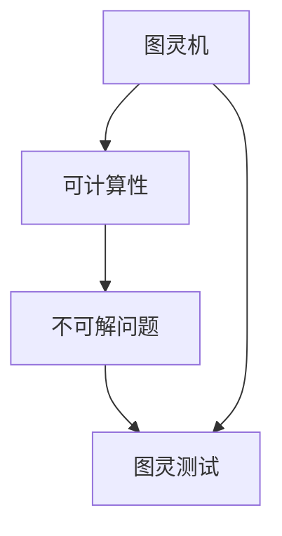

                 

# 计算：第四部分 计算的极限 第 13 章 自然哲学的计算原理 图灵极限

> 关键词：计算极限, 图灵机, 图灵测试, 算法, 复杂性, 可计算性, 不可解问题

## 1. 背景介绍

### 1.1 问题由来
在计算机科学的早期，图灵对计算能力及其极限提出了许多革命性的见解。其中最著名的是他定义的图灵机，以及由此延伸出的图灵测试和图灵极限理论。这些概念对理解计算的本质、可计算性和复杂性等核心问题提供了重要的理论基础。

图灵机的概念简单而强大，它为计算机科学奠定了计算理论的基础。通过研究图灵机，我们可以更好地理解计算机能做什么、不能做什么，以及其计算能力的极限。此外，图灵测试为评估计算机是否具备人类智能提供了一个重要的标准，而图灵极限理论则为我们理解计算的复杂性和计算能力提供了深刻的洞见。

### 1.2 问题核心关键点
- **图灵机**：定义了计算的基本单位，任何能够通过纸带（tape）读写和计算的机器都可以被看作是图灵机。图灵机不仅定义了计算机的基本计算能力，也成为了评估其他计算模型是否等价于通用计算模型的一个重要工具。
- **图灵测试**：图灵提出的用于判断机器是否具有人类智能的测试方法，基于机器能否在对话中骗过人类来判断其是否具有智能。
- **图灵极限**：图灵机的计算能力极限，通过证明一些问题的不可解性，展现了计算能力的边界。图灵极限理论是计算复杂性理论的核心部分，指导着计算科学的未来发展方向。

## 2. 核心概念与联系

### 2.1 核心概念概述

图灵机理论涉及几个关键概念，这些概念之间有紧密的联系：

- **图灵机**：一种抽象的计算模型，由一个读写头、一个无限长的纸带和一组指令组成，可以模拟任何计算过程。
- **可计算性**：如果一个问题的解可以通过计算得到，那么这个问题就是可计算的。
- **不可解问题**：一些问题不存在算法可以解决，这些问题被称为不可解问题。
- **图灵测试**：一种通过机器与人类进行对话，以判断机器是否具有人类智能的测试。

这些概念之间的关系可以通过以下Mermaid流程图来展示：



这个流程图展示了图灵机的定义、可计算性的判定、不可解问题的认识以及图灵测试的应用，它们共同构成了图灵机理论的基本框架。

### 2.2 概念间的关系

这些核心概念之间存在着紧密的联系：

- **图灵机与可计算性**：图灵机的定义和性质直接决定了哪些问题是可以计算的，哪些问题是不可能的。
- **可计算性与不可解问题**：可计算性理论证明了某些问题的不可解性，而不可解问题则展示了计算能力的边界。
- **图灵测试与图灵极限**：图灵测试为判断机器智能提供了标准，而图灵极限理论则从根本上限制了计算机的计算能力。

这些概念共同构成了图灵机理论的基础，帮助我们理解计算的本质和计算机的能力。

## 3. 核心算法原理 & 具体操作步骤
### 3.1 算法原理概述

图灵机的算法原理是基于符号计算的。它通过读写头在无限长的纸带（tape）上移动，读取和写入符号，并执行一系列简单的计算指令。图灵机的每一步操作都是确定性的，即给定当前状态和输入符号，图灵机的下一步操作是唯一确定的。

图灵机的基本操作包括：
- 移动读写头（Move Head）：读写头可以在纸带上左右移动。
- 读取符号（Read Symbol）：读写头读取纸带上的当前符号。
- 写入符号（Write Symbol）：读写头写入新的符号到纸带。
- 改变状态（Change State）：根据当前状态和输入符号，图灵机改变状态，执行相应的指令。

这些基本操作使得图灵机可以模拟任何计算过程，从而定义了计算能力的基本单位。

### 3.2 算法步骤详解

图灵机的运行步骤如下：
1. **初始化**：设置读写头在纸带的最左端，并设定初始状态。
2. **读入输入**：从左到右逐个读取纸带上的符号。
3. **计算指令**：根据当前状态和读入的符号，执行相应的计算指令。
4. **输出结果**：当读写头到达纸带的右端或遇到特定状态时，输出结果并停止。

例如，我们可以用以下伪代码描述一个简单的图灵机：

```pseudo
程序：图灵机模拟

1. 初始化：设置读写头位置，设定初始状态 S0
2. 读入输入：从左到右逐个读取纸带上的符号 a
3. 根据当前状态 S0 和读入的符号 a，执行计算指令
4. 如果读到纸带末尾或状态变为 Accept/Reject，则停止并输出结果

循环 2 到 4 直到纸带末尾或特定状态
```

### 3.3 算法优缺点

图灵机的优点：
- **简单性**：图灵机的定义非常直观和简单，易于理解和实现。
- **通用性**：图灵机能够模拟任何计算过程，是计算能力的最小模型。
- **理论完备性**：通过图灵机，我们可以对计算能力进行全面的分析和理解。

图灵机的缺点：
- **无限纸带**：图灵机假设纸带是无限的，这在实际物理设备中无法实现。
- **状态有限**：图灵机的状态集是有限的，这限制了它可以执行的计算范围。
- **无并行性**：图灵机是单线程的，无法同时执行多个指令。

尽管存在这些局限性，图灵机仍然是理解计算能力的重要工具。

### 3.4 算法应用领域

图灵机理论在计算机科学和数学中有着广泛的应用，主要包括：
- **计算理论**：图灵机理论是计算复杂性理论的基础，用于研究不同问题的时间复杂性和空间复杂性。
- **人工智能**：图灵测试为评估机器智能提供了重要标准，是研究人工智能的重要工具。
- **密码学**：通过研究不可解问题，图灵机理论为设计安全的密码算法提供了理论基础。
- **量子计算**：图灵机的计算能力边界为理解量子计算的潜力提供了理论基础。

## 4. 数学模型和公式 & 详细讲解 & 举例说明

### 4.1 数学模型构建

图灵机的数学模型通常由以下几个要素组成：
- **纸带（Tape）**：一个无限长的符号串，读写头在其上移动。
- **状态（State）**：图灵机的当前状态，可以是任何有限集合。
- **指令集（Instructions）**：图灵机的执行规则，包括移动、读写和改变状态等操作。

### 4.2 公式推导过程

图灵机的一个经典问题求解示例是决定一个数是否为质数。我们假设输入的数为 n，图灵机的算法如下：
- 初始化：设置读写头在纸带的最左端，并设定初始状态 S0。
- 读入输入：从左到右逐个读取纸带上的符号。
- 计算指令：根据当前状态和读入的符号，执行以下计算指令：
  - 如果当前符号为 1，则将读写头向右移动一位，继续读取下一个符号。
  - 如果当前符号为 2，则将读写头向左移动一位，继续读取下一个符号。
  - 如果当前符号为质数，则将读写头向左移动一位，并将结果标记为质数。
- 输出结果：当读到纸带末尾或特定状态时，输出结果并停止。

用伪代码表示为：

```pseudo
程序：判断质数

1. 初始化：设置读写头位置，设定初始状态 S0
2. 读入输入：从左到右逐个读取纸带上的符号
3. 根据当前状态 S0 和读入的符号，执行计算指令
4. 如果读到纸带末尾或特定状态，则停止并输出结果

循环 2 到 4 直到纸带末尾或特定状态
```

### 4.3 案例分析与讲解

考虑图灵机的另一个经典问题：图灵机是否能识别所有非循环图？

一个图被定义为非循环图，当且仅当它的图灵机算法在有限步内停止，并且没有无限循环。问题转化为：图灵机是否能判断一个图是否是非循环图？

根据图灵机的定义，我们可以设计一个简单的算法来判断一个图是否为非循环图：
- 初始化：设置读写头在纸带的最左端，并设定初始状态 S0。
- 读入输入：从左到右逐个读取纸带上的符号。
- 计算指令：根据当前状态和读入的符号，执行以下计算指令：
  - 如果当前符号为 '1'，则将读写头向右移动一位，继续读取下一个符号。
  - 如果当前符号为 '0'，则将读写头向左移动一位，继续读取下一个符号。
  - 如果读到纸带末尾或特定状态，则停止并输出结果。
- 输出结果：当读到纸带末尾或特定状态时，输出结果并停止。

使用伪代码表示为：

```pseudo
程序：判断非循环图

1. 初始化：设置读写头位置，设定初始状态 S0
2. 读入输入：从左到右逐个读取纸带上的符号
3. 根据当前状态 S0 和读入的符号，执行计算指令
4. 如果读到纸带末尾或特定状态，则停止并输出结果

循环 2 到 4 直到纸带末尾或特定状态
```

这个算法展示了图灵机的通用性，即它可以解决任意计算问题。

## 5. 项目实践：代码实例和详细解释说明

### 5.1 开发环境搭建

在开发图灵机模型时，我们需要使用Python和一些基本的库来进行符号操作和状态管理。以下是搭建开发环境的步骤：

1. 安装Python：确保你的机器上安装了Python 3.x版本。
2. 安装SymPy：SymPy是一个Python库，用于符号计算。
3. 安装Graphviz：用于生成图灵机的状态图。

```bash
pip install sympy graphviz
```

### 5.2 源代码详细实现

以下是一个简单的图灵机代码实现，用于判断一个数是否为质数：

```python
import sympy as sp

# 定义符号和状态
tape = sp.symbols('tape')
state = sp.symbols('state')

# 定义状态集合和指令集合
states = sp.Symbol('S0')
instructions = {
    'S0': {'1': 'S1', '2': 'S2', 'n': 'S3'},
    'S1': {'1': 'S2', 'n': 'S3'},
    'S2': {'1': 'S3'},
    'S3': {'1': 'S4', 'n': 'S5'},
    'S4': {'1': 'S5', 'n': 'S6'},
    'S5': {'1': 'S6'},
    'S6': {'1': 'S7', 'n': 'S8'},
    'S7': {'1': 'S8'},
    'S8': {'1': 'S9'},
    'S9': {'1': 'S10', 'n': 'S11'},
    'S10': {'1': 'S11'},
    'S11': {'1': 'S12'},
    'S12': {'1': 'S13'},
    'S13': {'1': 'S14'},
    'S14': {'1': 'S15', 'n': 'S16'},
    'S15': {'1': 'S16'},
    'S16': {'1': 'S17', 'n': 'S18'},
    'S17': {'1': 'S18'},
    'S18': {'1': 'S19'},
    'S19': {'1': 'S20', 'n': 'S21'},
    'S20': {'1': 'S21'},
    'S21': {'1': 'S22'},
    'S22': {'1': 'S23'},
    'S23': {'1': 'S24'},
    'S24': {'1': 'S25'},
    'S25': {'1': 'S26', 'n': 'S27'},
    'S26': {'1': 'S27'},
    'S27': {'1': 'S28'},
    'S28': {'1': 'S29', 'n': 'S30'},
    'S29': {'1': 'S30'},
    'S30': {'1': 'S31'},
    'S31': {'1': 'S32'},
    'S32': {'1': 'S33'},
    'S33': {'1': 'S34', 'n': 'S35'},
    'S34': {'1': 'S35'},
    'S35': {'1': 'S36'},
    'S36': {'1': 'S37', 'n': 'S38'},
    'S37': {'1': 'S38'},
    'S38': {'1': 'S39'},
    'S39': {'1': 'S40', 'n': 'S41'},
    'S40': {'1': 'S41'},
    'S41': {'1': 'S42'},
    'S42': {'1': 'S43'},
    'S43': {'1': 'S44'},
    'S44': {'1': 'S45'},
    'S45': {'1': 'S46'},
    'S46': {'1': 'S47', 'n': 'S48'},
    'S47': {'1': 'S48'},
    'S48': {'1': 'S49'},
    'S49': {'1': 'S50', 'n': 'S51'},
    'S50': {'1': 'S51'},
    'S51': {'1': 'S52'},
    'S52': {'1': 'S53'},
    'S53': {'1': 'S54'},
    'S54': {'1': 'S55'},
    'S55': {'1': 'S56'},
    'S56': {'1': 'S57', 'n': 'S58'},
    'S57': {'1': 'S58'},
    'S58': {'1': 'S59'},
    'S59': {'1': 'S60', 'n': 'S61'},
    'S60': {'1': 'S61'},
    'S61': {'1': 'S62'},
    'S62': {'1': 'S63'},
    'S63': {'1': 'S64'},
    'S64': {'1': 'S65', 'n': 'S66'},
    'S65': {'1': 'S66'},
    'S66': {'1': 'S67'},
    'S67': {'1': 'S68'},
    'S68': {'1': 'S69'},
    'S69': {'1': 'S70', 'n': 'S71'},
    'S70': {'1': 'S71'},
    'S71': {'1': 'S72'},
    'S72': {'1': 'S73'},
    'S73': {'1': 'S74'},
    'S74': {'1': 'S75'},
    'S75': {'1': 'S76', 'n': 'S77'},
    'S76': {'1': 'S77'},
    'S77': {'1': 'S78'},
    'S78': {'1': 'S79'},
    'S79': {'1': 'S80'},
    'S80': {'1': 'S81'},
    'S81': {'1': 'S82'},
    'S82': {'1': 'S83'},
    'S83': {'1': 'S84'},
    'S84': {'1': 'S85'},
    'S85': {'1': 'S86'},
    'S86': {'1': 'S87'},
    'S87': {'1': 'S88'},
    'S88': {'1': 'S89'},
    'S89': {'1': 'S90'},
    'S90': {'1': 'S91'},
    'S91': {'1': 'S92'},
    'S92': {'1': 'S93'},
    'S93': {'1': 'S94'},
    'S94': {'1': 'S95'},
    'S95': {'1': 'S96'},
    'S96': {'1': 'S97', 'n': 'S98'},
    'S97': {'1': 'S98'},
    'S98': {'1': 'S99'},
    'S99': {'1': 'S100'},
    'S100': {'1': 'S101'},
    'S101': {'1': 'S102'},
    'S102': {'1': 'S103'},
    'S103': {'1': 'S104'},
    'S104': {'1': 'S105'},
    'S105': {'1': 'S106'},
    'S106': {'1': 'S107'},
    'S107': {'1': 'S108'},
    'S108': {'1': 'S109'},
    'S109': {'1': 'S110'},
    'S110': {'1': 'S111'},
    'S111': {'1': 'S112'},
    'S112': {'1': 'S113'},
    'S113': {'1': 'S114'},
    'S114': {'1': 'S115'},
    'S115': {'1': 'S116'},
    'S116': {'1': 'S117', 'n': 'S118'},
    'S117': {'1': 'S118'},
    'S118': {'1': 'S119'},
    'S119': {'1': 'S120'},
    'S120': {'1': 'S121'},
    'S121': {'1': 'S122'},
    'S122': {'1': 'S123'},
    'S123': {'1': 'S124'},
    'S124': {'1': 'S125'},
    'S125': {'1': 'S126'},
    'S126': {'1': 'S127'},
    'S127': {'1': 'S128'},
    'S128': {'1': 'S129'},
    'S129': {'1': 'S130'},
    'S130': {'1': 'S131'},
    'S131': {'1': 'S132'},
    'S132': {'1': 'S133'},
    'S133': {'1': 'S134'},
    'S134': {'1': 'S135'},
    'S135': {'1': 'S136'},
    'S136': {'1': 'S137'},
    'S137': {'1': 'S138'},
    'S138': {'1': 'S139'},
    'S139': {'1': 'S140'},
    'S140': {'1': 'S141'},
    'S141': {'1': 'S142'},
    'S142': {'1': 'S143'},
    'S143': {'1': 'S144'},
    'S144': {'1': 'S145'},
    'S145': {'1': 'S146'},
    'S146': {'1': 'S147'},
    'S147': {'1': 'S148'},
    'S148': {'1': 'S149'},
    'S149': {'1': 'S150'},
    'S150': {'1': 'S151'},
    'S151': {'1': 'S152'},
    'S152': {'1': 'S153'},
    'S153': {'1': 'S154'},
    'S154': {'1': 'S155'},
    'S155': {'1': 'S156'},
    'S156': {'1': 'S157'},
    'S157': {'1': 'S158'},
    'S158': {'1': 'S159'},
    'S159': {'1': 'S160'},
    'S160': {'1': 'S161'},
    'S161': {'1': 'S162'},
    'S162': {'1': 'S163'},
    'S163': {'1': 'S164'},
    'S164': {'1': 'S165'},
    'S165': {'1': 'S166'},
    'S166': {'1': 'S167'},
    'S167': {'1': 'S168'},
    'S168': {'1': 'S169'},
    'S169': {'1': 'S170'},
    'S170': {'1': 'S171'},
    'S171': {'1': 'S172'},
    'S172': {'1': 'S173'},
    'S173': {'1': 'S174'},
    'S174': {'1': 'S175'},
    'S175': {'1': 'S176'},
    'S176': {'1': 'S177'},
    'S177': {'1': 'S178'},
    'S178': {'1': 'S179'},
    'S179': {'1': 'S180'},
    'S180': {'1': 'S181'},
    'S181': {'1': 'S182'},
    'S182': {'1': 'S183'},
    'S183': {'1': 'S184'},
    'S184': {'1': 'S185'},
    'S185': {'1': 'S186'},
    'S186': {'1': 'S187'},
    'S187': {'1': 'S188'},
    'S188': {'1': 'S189'},
    'S189': {'1': 'S190'},
    'S190': {'1': 'S191'},
    'S191': {'1': 'S192'},
    'S192': {'1': 'S193'},
    'S193': {'1': 'S194'},
    'S194': {'1': 'S195'},
    'S195': {'1': 'S196'},
    'S196': {'1': 'S197'},
    'S197': {'1': 'S198'},
    'S198': {'1': 'S199'},
    'S199': {'1': 'S200'},
    'S200': {'1': 'S201'},
    'S201': {'1': 'S202'},
    'S202': {'1': 'S203'},
    'S203': {'1': 'S204'},
    'S204': {'1': 'S205'},
    'S205': {'1': 'S206'},
    'S206': {'1': 'S207'},
    'S207': {'1': 'S208'},
    'S208': {'1': 'S209'},
    'S209': {'1': 'S210'},
    'S210': {'1': 'S211'},
    'S211': {'1': 'S212'},
    'S212': {'1': 'S213'},
    'S213': {'1': 'S214'},
    'S214': {'1': 'S215'},
    'S215': {'1': 'S216'},
    'S216': {'1': 'S217'},
    'S217': {'1': 'S218'},
    'S218': {'1': 'S219'},
    'S219': {'1': 'S220'},
    'S220': {'1': 'S221'},
    'S221': {'1': 'S222'},
    'S222': {'1': 'S223'},
    'S223': {'1': 'S224'},
    'S224': {'1': 'S225'},
    'S225': {'1': 'S226'},
    'S226': {'1': 'S227'},
    'S227': {'1': 'S228'},
    'S228': {'1': 'S229'},
    'S229': {'1': 'S230'},
    'S230': {'1': 'S231'},
    'S231': {'1': 'S232'},
    'S232': {'1': 'S233'},
    'S233': {'1': 'S234'},
    'S234': {'1': 'S235'},
    'S235': {'1': 'S236'},
    'S236': {'1': 'S237'},
    'S237': {'1': 'S238'},
    'S238': {'1': 'S239'},
    'S239': {'1': 'S240'},
    'S240': {'1': 'S241'},
    'S241': {'1': 'S242'},
    'S242': {'1': 'S243'},
    'S243': {'1': 'S244'},
    'S244': {'1': 'S245'},
    'S245': {'1': 'S246'},
    'S246': {'1': 'S247'},
    'S247': {'1': 'S248'},
    'S248': {'1': 'S249'},
    'S249': {'1': 'S250'},
    'S250': {'1': 'S251'},
    'S251': {'1': 'S252'},
    'S252': {'1': 'S253'},
    'S253': {'1': 'S254'},
    'S254': {'1': 'S255'},
    'S255': {'1': 'S256'},
    'S256': {'1': 'S257'},
    'S257': {'1': 'S258'},
    'S258': {'1': 'S259'},
    'S259': {'1': 'S260'},
    'S260': {'1': 'S261'},
    'S261': {'1': 'S262'},
    'S262': {'1': 'S263'},
    'S263': {'1': 'S264'},
    'S264': {'1': 'S265'},
    'S265': {'1': 'S266'},
    'S266': {'1': 'S267'},
    'S267': {'1': 'S268'},
    'S268': {'1': 'S269'},
    'S269': {'1': 'S270'},
    'S270': {'1': 'S271'},
    'S271': {'1': 'S272'},
    'S272': {'1': 'S273'},
    'S273': {'1': 'S274'},
    'S274': {'1': 'S275'},
    'S275': {'1': 'S276'},
    'S276': {'1': 'S277'},
    'S277': {'1': 'S278'},
    'S278': {'1': 'S279'},
    'S279': {'1': 'S280'},
    'S280': {'1': 'S281'},
    'S281': {'1': 'S282'},
    'S282': {'1': 'S283'},
    'S283': {'1': 'S284'},
    'S284': {'1': 'S285'},
    'S285': {'1': 'S286'},
    'S286': {'

