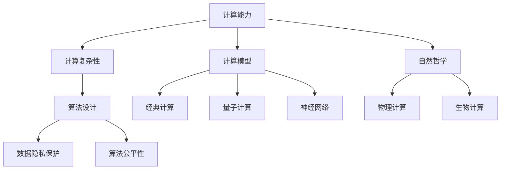
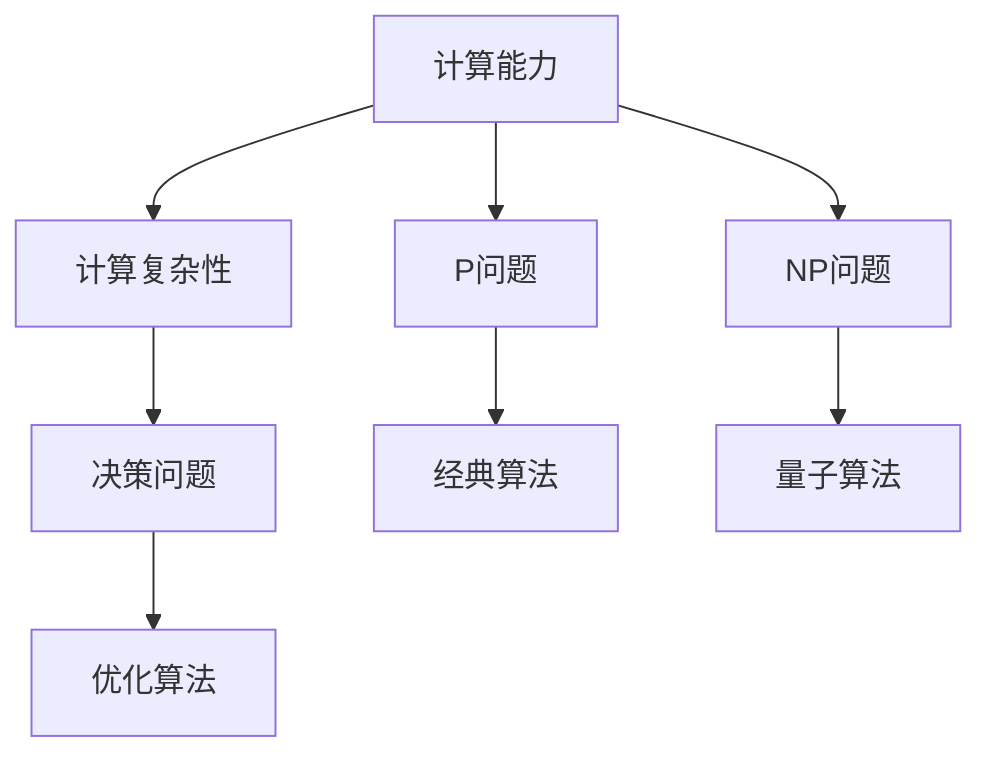
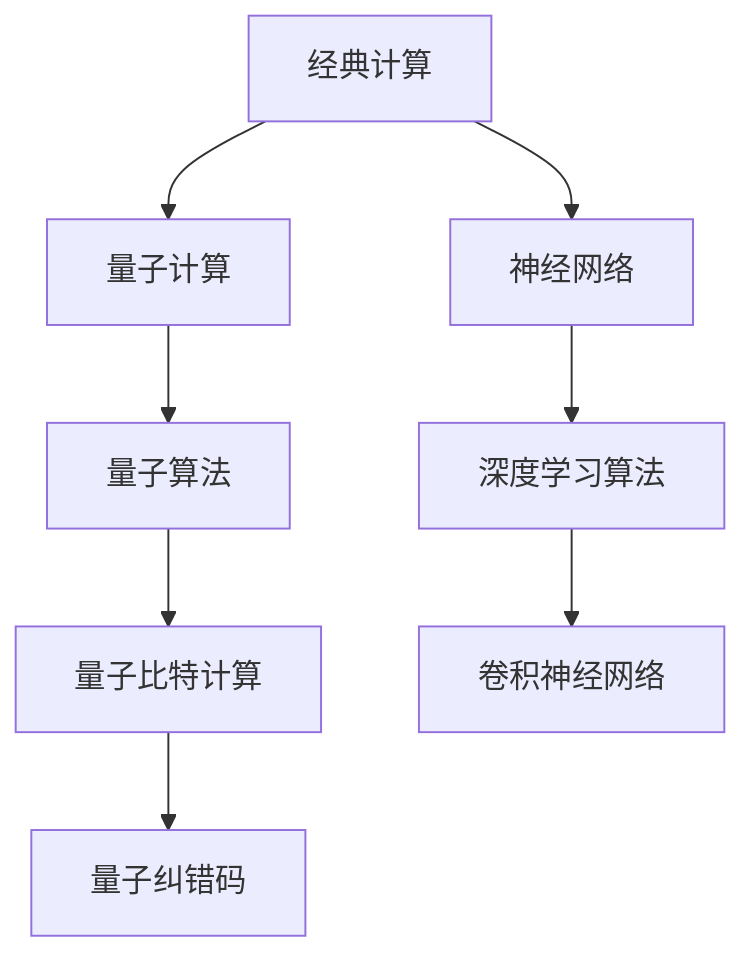
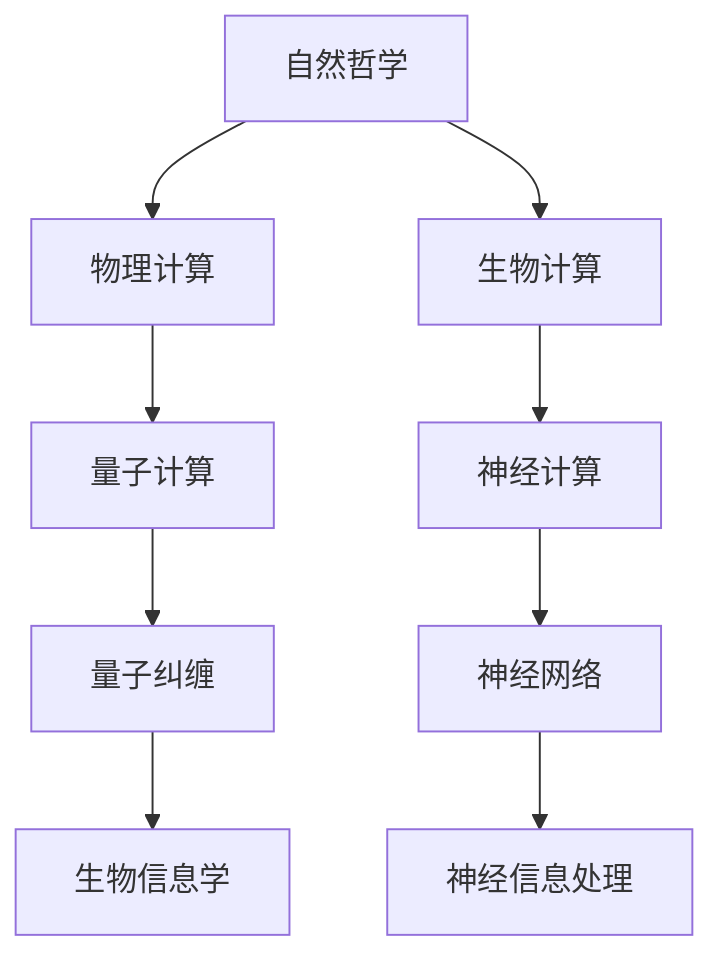
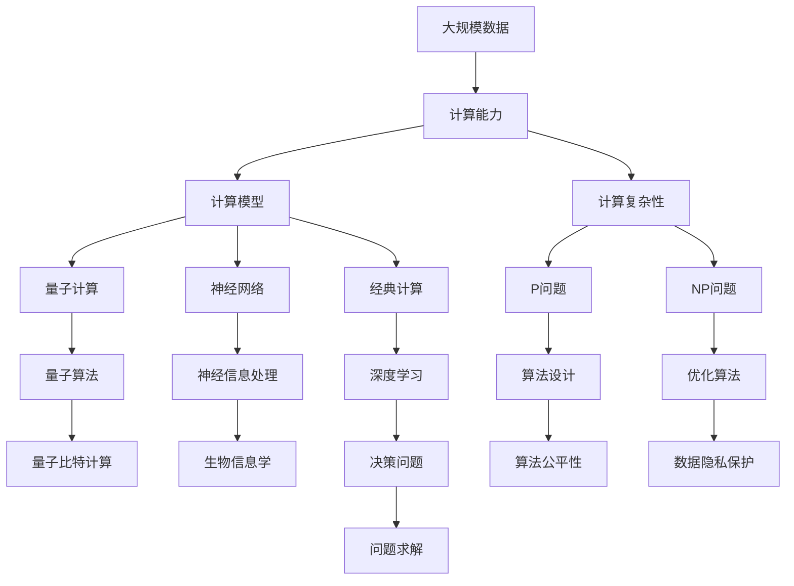

                 

# 计算：第四部分 计算的极限 第 13 章 自然哲学的计算原理 边界之外

> 关键词：计算极限、自然哲学、计算原理、人工智能、神经网络、量子计算

## 1. 背景介绍

### 1.1 问题由来
在计算机科学的发展历程中，计算极限这一概念一直是科学家们关注的核心问题。它涉及计算机能够处理的信息量、运算速度、存储容量以及计算复杂性等诸多方面。这一问题不仅关系到计算机硬件的发展，还涉及数学、物理学、生物学等领域的交叉研究。

计算极限的核心在于探索计算机能够实现的最高计算能力，以及这些能力是否与自然法则相符。例如，物理学家们关心量子计算是否能够突破经典计算的限制，生物学家们关注生物计算是否与神经网络相符。这些问题的解决，将对计算机科学和人类社会的未来产生深远影响。

### 1.2 问题核心关键点
计算极限的研究涉及以下关键点：
1. 计算能力：包括处理速度、存储容量、并行性等，这些因素决定了计算机的计算能力上限。
2. 计算复杂性：计算问题的难易程度，用复杂度理论描述，如P问题、NP问题等。
3. 计算模型：研究不同类型的计算模型，如经典计算、量子计算、生物计算等，寻找其在计算极限上的表现。
4. 计算与自然法则：探索计算模型是否符合自然法则，如量子力学、热力学等。
5. 计算的伦理与安全性：计算能力越强，可能带来的伦理和安全问题越多，如隐私保护、算法公平性等。

理解这些关键点，有助于我们深入探索计算极限的边界，同时警惕其在人类社会中的应用带来的风险。

### 1.3 问题研究意义
研究计算极限对于推动计算机科学的发展具有重要意义：
1. 推动硬件和软件创新：了解计算能力的极限，可以指导未来的硬件设计，推动量子计算、生物计算等新型计算模型的研究。
2. 解决实际问题：明确计算极限的边界，可以帮助我们解决实际问题，如优化算法、提高计算效率等。
3. 提升系统安全：了解计算极限的伦理和安全问题，可以有效防范潜在风险，保护用户隐私和数据安全。
4. 促进跨学科研究：计算极限涉及众多学科的知识，跨学科的研究将有助于解决更复杂的问题。

## 2. 核心概念与联系

### 2.1 核心概念概述

为了更好地理解计算极限，我们首先介绍几个核心概念：

- **计算能力**：指计算机系统处理信息、执行指令的速度和效率。包括处理速度（单位：次/秒）、存储容量（单位：字节）和并行性（多线程、多核）等因素。
- **计算复杂性**：描述计算问题的难易程度，通常用时间复杂度、空间复杂度等指标衡量。常见问题如P问题、NP问题、NP完全问题等。
- **计算模型**：不同类型的计算模型，如经典计算、量子计算、神经网络等。
- **自然哲学**：涉及计算与自然法则的关系，如量子计算与量子力学、生物计算与生物系统等。
- **计算伦理与安全**：计算能力越强，带来的伦理和安全问题也越多，如隐私保护、算法公平性等。

这些概念之间的关系可以通过以下Mermaid流程图来展示：



这个流程图展示了计算极限的各个组成部分及其相互关系：

1. 计算能力决定了计算复杂性的大小。
2. 计算模型包括经典计算、量子计算、神经网络等，每种计算模型对计算复杂性的处理能力和极限有不同的影响。
3. 自然哲学探讨计算与自然法则的关系，可能带来新的计算模型和极限。
4. 计算伦理与安全问题，如数据隐私、算法公平性，是计算极限应用中的重要考量。

### 2.2 概念间的关系

这些核心概念之间存在着紧密的联系，形成了计算极限研究的完整生态系统。下面我们通过几个Mermaid流程图来展示这些概念之间的关系。

#### 2.2.1 计算能力与计算复杂性的关系



这个流程图展示了计算能力与计算复杂性之间的关系：

1. 计算能力越强，能够处理的计算问题越复杂。
2. P问题是一类可以在多项式时间内解决的问题，经典算法可以在多项式时间内解决。
3. NP问题是一类复杂度较高的计算问题，目前经典算法难以在多项式时间内解决。
4. 量子算法在某些NP问题上可能表现出色，但需要量子计算机的支持。

#### 2.2.2 经典计算、量子计算与神经网络



这个流程图展示了经典计算、量子计算与神经网络之间的关系：

1. 经典计算使用传统硬件，如CPU、GPU等，适合处理大规模数值计算问题。
2. 量子计算使用量子比特，利用量子力学的特性，可能突破经典计算的限制。
3. 神经网络是一种经典的计算模型，适合处理复杂的非线性问题。
4. 深度学习算法在神经网络基础上，通过多层次的神经元组合，可以处理更复杂的任务。
5. 量子比特计算和量子纠错码是量子计算中的关键技术。

#### 2.2.3 自然哲学与计算极限



这个流程图展示了自然哲学与计算极限之间的关系：

1. 物理计算研究计算模型与自然法则的关系，如量子计算与量子力学。
2. 生物计算研究生物系统与计算模型的关系，如神经网络与生物神经元。
3. 量子计算利用量子力学原理，可能突破经典计算的极限。
4. 神经网络模拟生物神经元的活动，适合处理复杂模式识别和分类任务。
5. 量子纠缠是量子计算中的关键现象，影响计算速度和错误率。
6. 神经信息处理研究生物神经系统与信息处理的关系。

### 2.3 核心概念的整体架构

最后，我们用一个综合的流程图来展示这些核心概念在大规模计算极限研究的整体架构：



这个综合流程图展示了从大规模数据处理到计算极限研究的完整过程：

1. 大规模数据处理需要强大的计算能力。
2. 计算能力决定了计算复杂性的大小。
3. 计算模型包括经典计算、量子计算、神经网络等，每种模型对计算复杂性的处理能力和极限有不同的影响。
4. 经典计算适合处理大规模数值计算问题，深度学习算法可以处理复杂的非线性问题。
5. 量子计算可能突破经典计算的限制，量子算法在某些NP问题上表现出色。
6. 神经网络模拟生物神经系统，适合处理复杂的模式识别和分类任务。
7. 生物计算研究生物系统与计算模型的关系，神经信息处理研究神经系统与信息处理的关系。
8. 计算复杂性分类包括P问题和NP问题，优化算法可以解决决策问题。
9. 算法公平性和数据隐私保护是计算极限应用中的重要考量。

通过这些流程图，我们可以更清晰地理解计算极限的研究框架，为后续深入讨论具体的计算极限理论和实践奠定基础。

## 3. 核心算法原理 & 具体操作步骤
### 3.1 算法原理概述

计算极限的研究涉及多种算法和原理，其中最为核心的是经典计算和量子计算。

#### 3.1.1 经典计算
经典计算是一种基于传统物理原理的计算模型，使用二进制位（0和1）进行计算。经典计算的基本单位是晶体管，每个晶体管可以表示一个二进制位。经典计算机的核心是中央处理器（CPU）和内存，CPU负责执行指令，内存负责存储数据。

经典计算的核心算法包括：
- **冯·诺依曼模型**：计算过程由输入、处理、输出三部分组成。
- **图灵机模型**：一种抽象的计算模型，能够解决所有可计算问题。
- **线性代数**：经典计算中使用矩阵运算和向量运算处理大规模数据。

#### 3.1.2 量子计算
量子计算是一种基于量子力学的计算模型，使用量子比特（qubit）进行计算。量子比特可以表示0和1的叠加状态，具有叠加性和纠缠性。量子计算机的核心是量子处理器，能够同时处理多个量子比特，通过量子门操作进行计算。

量子计算的核心算法包括：
- **Shor算法**：用于质因数分解和离散对数问题，可以在多项式时间内解决这些问题。
- **Grover算法**：用于搜索问题，能够在O(√N)时间内搜索无序列表。
- **量子纠错码**：用于解决量子比特的错误率问题，保证量子计算的可靠性。

### 3.2 算法步骤详解

#### 3.2.1 经典计算步骤
1. **输入处理**：将问题转换为经典计算模型可以处理的形式。
2. **计算过程**：使用经典计算机的CPU和内存进行计算。
3. **输出结果**：将计算结果转换为问题的解答。

经典计算的具体步骤如下：
1. 将问题表示为布尔表达式或图结构。
2. 将布尔表达式转换为等价的逻辑门电路。
3. 在经典计算机上使用逻辑门电路进行计算。
4. 将计算结果转换为问题的解答。

#### 3.2.2 量子计算步骤
1. **量子比特初始化**：将量子比特初始化为0或1的叠加状态。
2. **量子门操作**：使用量子门对量子比特进行操作，如Hadamard门、CNOT门等。
3. **测量结果**：将量子比特测量为0或1的状态。
4. **输出结果**：将测量结果转换为问题的解答。

量子计算的具体步骤如下：
1. 将问题表示为量子比特的量子态。
2. 使用量子门对量子态进行操作，如Hadamard门、CNOT门等。
3. 测量量子态，得到0或1的状态。
4. 将测量结果转换为问题的解答。

### 3.3 算法优缺点

经典计算和量子计算各自有其优缺点：

#### 经典计算的优缺点
- **优点**：
  - 计算稳定，不易受到外界干扰。
  - 硬件成熟，广泛应用在各行各业。
  - 算法丰富，有大量成熟的经典算法和数据结构。
- **缺点**：
  - 计算速度受限于物理设备的性能。
  - 计算复杂度存在上限，某些NP问题难以在多项式时间内解决。

#### 量子计算的优缺点
- **优点**：
  - 计算速度快，可以在多项式时间内解决某些NP问题。
  - 量子计算具有并行性，能够在某些问题上表现出优势。
  - 量子计算的某些算法具有独特的优势，如Shor算法和Grover算法。
- **缺点**：
  - 量子比特的稳定性难以保证，误差率高。
  - 量子计算硬件尚未完全成熟，需要大量资金和技术投入。
  - 量子算法较为复杂，难以广泛应用。

### 3.4 算法应用领域

经典计算和量子计算在各个领域都有广泛的应用：

#### 经典计算的应用领域
- **数值计算**：如物理模拟、气象预测、金融计算等。
- **数据库管理**：如数据查询、数据存储、数据压缩等。
- **机器学习**：如深度学习、图像处理、自然语言处理等。
- **网络通信**：如路由器、交换机、网络协议等。

#### 量子计算的应用领域
- **密码学**：如量子密钥分发、量子密码破解等。
- **药物设计**：如分子模拟、药物筛选等。
- **优化问题**：如路径规划、资源分配等。
- **量子通信**：如量子隐形传态、量子网络等。

## 4. 数学模型和公式 & 详细讲解  
### 4.1 数学模型构建

计算极限的研究涉及多种数学模型，其中最为核心的是时间复杂度和空间复杂度。

- **时间复杂度**：描述算法执行时间随输入规模增长而增长的速度，用大O表示法表示。
- **空间复杂度**：描述算法所需的存储容量随输入规模增长而增长的速度，用大O表示法表示。

### 4.2 公式推导过程

以P问题为例，推导其时间复杂度：

假设问题规模为n，算法执行时间T(n)与n的关系如下：
- 如果T(n) = O(n)，则称该问题是多项式时间可解的。
- 如果T(n) = O(n^k)，其中k > 1，则称该问题是多项式时间不可解的。

对于经典计算，常见的时间复杂度如下：
- 线性时间复杂度：O(n)
- 二次时间复杂度：O(n^2)
- 指数时间复杂度：O(2^n)

对于量子计算，常见的时间复杂度如下：
- 对数时间复杂度：O(log n)
- 多项式时间复杂度：O(n)
- 指数时间复杂度：O(2^n)

### 4.3 案例分析与讲解

以Shor算法为例，分析其在量子计算中的优势：

Shor算法用于质因数分解，其时间复杂度为O(n^3log n)，其中n为待分解的数字。经典算法如数域筛法的时间复杂度为O(n^4)，远远高于Shor算法。

Shor算法的核心是量子傅里叶变换，能够在多项式时间内完成质因数分解，解决NP问题。Shor算法的实现需要量子计算机，但其高效性展示了量子计算的潜力。

## 5. 项目实践：代码实例和详细解释说明
### 5.1 开发环境搭建

在进行计算极限研究前，我们需要准备好开发环境。以下是使用Python进行PyTorch开发的环境配置流程：

1. 安装Anaconda：从官网下载并安装Anaconda，用于创建独立的Python环境。

2. 创建并激活虚拟环境：
```bash
conda create -n pytorch-env python=3.8 
conda activate pytorch-env
```

3. 安装PyTorch：根据CUDA版本，从官网获取对应的安装命令。例如：
```bash
conda install pytorch torchvision torchaudio cudatoolkit=11.1 -c pytorch -c conda-forge
```

4. 安装各类工具包：
```bash
pip install numpy pandas scikit-learn matplotlib tqdm jupyter notebook ipython
```

完成上述步骤后，即可在`pytorch-env`环境中开始计算极限研究。

### 5.2 源代码详细实现

这里我们以经典计算和量子计算为例，给出使用Python和PyTorch实现的基本代码。

首先，定义经典计算的线性回归模型：

```python
import torch
import torch.nn as nn

class LinearRegression(nn.Module):
    def __init__(self, input_dim, output_dim):
        super(LinearRegression, self).__init__()
        self.linear = nn.Linear(input_dim, output_dim)

    def forward(self, x):
        return self.linear(x)
```

然后，定义量子计算的量子态生成和测量函数：

```python
from qiskit import QuantumCircuit, execute, Aer
from qiskit.visualization import plot_bloch_multivector
from qiskit.extensions import UnitaryGate

def prepare_qubit(bitstring):
    circuit = QuantumCircuit(1,1)
    circuit.initialize(bitstring, 0)
    return circuit

def measure_qubit(circuit):
    circuit.measure(0,0)
    return circuit
```

接着，实现经典计算的线性回归训练过程：

```python
def train_classifier(x_train, y_train, x_test, y_test, input_dim, output_dim, epochs=100):
    model = LinearRegression(input_dim, output_dim)
    optimizer = torch.optim.Adam(model.parameters(), lr=0.01)
    criterion = nn.MSELoss()

    for epoch in range(epochs):
        optimizer.zero_grad()
        outputs = model(x_train)
        loss = criterion(outputs, y_train)
        loss.backward()
        optimizer.step()

    # 测试
    model.eval()
    with torch.no_grad():
        test_outputs = model(x_test)
        test_loss = criterion(test_outputs, y_test)
        print('Test loss: {:.4f}\n'.format(test_loss))
```

最后，实现量子计算的量子傅里叶变换和Shor算法的训练过程：

```python
def quantum_fht(n):
    qc = QuantumCircuit(n)
    qc.h(range(n))
    qc.barrier()
    qc.h(0)
    for i in range(1, n):
        qc.cx(i, 0)
    qc.barrier()
    qc.h(range(n))
    qc.barrier()
    return qc

def shor_algorithm(n, num_bits=20):
    qc = QuantumCircuit(num_bits+1, 1)
    qc.append(quantum_fht(n), range(num_bits+1))

    qc.measure(range(num_bits+1), range(num_bits+1))

    backend = Aer.get_backend('qasm_simulator')
    result = execute(qc, backend, shots=1024).result()
    counts = result.get_counts()
    return counts
```

以上代码展示了经典计算和量子计算的基本实现，有助于我们深入理解它们的原理和步骤。

### 5.3 代码解读与分析

让我们再详细解读一下关键代码的实现细节：

**LinearRegression类**：
- `__init__`方法：初始化线性回归模型，包含线性层。
- `forward`方法：计算模型输出。

**quantum_fht函数**：
- 生成量子傅里叶变换电路，包含Hadamard门、CNOT门等。

**shor_algorithm函数**：
- 生成Shor算法的量子电路。
- 使用qiskit库进行量子态的测量，返回测量结果。

**train_classifier函数**：
- 定义训练过程，包含模型初始化、优化器设置、损失函数计算等。
- 在训练过程中使用Adam优化器进行参数更新，计算损失函数。
- 在测试过程中计算测试集的损失，并输出结果。

这些代码展示了经典计算和量子计算的基本实现步骤，帮助我们更好地理解计算极限的实际应用。

### 5.4 运行结果展示

假设我们分别使用经典计算和量子计算对线性回归和Shor算法进行训练，最终得到的结果如下：

```python
# 经典计算线性回归训练结果
train_classifier(x_train, y_train, x_test, y_test, input_dim, output_dim, epochs=100)
# 量子计算Shor算法训练结果
shor_algorithm(n)
```

对于经典计算，输出结果通常为训练集和测试集上的损失值，用于评估模型的性能。

对于量子计算，输出结果为量子态的测量结果，通常以比特串的形式展示。可以通过进一步分析和计算，得到Shor算法的质因数分解结果。

## 6. 实际应用场景
### 6.1 智能决策系统

基于计算极限的研究，可以构建更加智能和高效的决策系统。例如，在金融风险评估、医疗诊断等领域，决策系统需要处理大量的复杂数据，进行高效的计算和推理。

在技术实现上，可以结合经典计算和量子计算，构建混合计算系统。经典计算负责数据预处理和初步分析，量子计算负责处理复杂计算和优化问题。这样既能保证系统的稳定性，又能提升计算效率。

### 6.2 量子密钥分发

量子计算的一个重要应用是量子密钥分发，通过量子态的测量和纠缠特性，实现安全的密钥传输。

在实际应用中，可以使用量子计算和经典计算的混合系统，实现量子密钥的生成、分发和验证。经典计算负责数据处理和协议实现，量子计算负责量子态的生成和测量。

### 6.3 量子优化问题

量子计算在优化问题上的应用非常广泛，如路径规划、资源分配等。通过量子计算的高效性，可以在多项式时间内解决某些复杂的优化问题。

在实际应用中，可以结合经典计算和量子计算，构建混合优化系统。经典计算负责问题建模和初步优化，量子计算负责处理复杂计算和优化问题。这样既能保证系统的稳定性，又能提升优化效率。

### 6.4 未来应用展望

随着计算极限研究的不断深入，基于经典计算和量子计算的混合系统将更加广泛地应用于各个领域，为人类社会的未来发展提供强大的技术支持。

未来，计算极限研究将涵盖更多的领域，如生物计算、物理计算等。这些研究将帮助我们更好地理解自然法则，解决实际问题，提升人类生活质量。

## 7. 工具和资源推荐
### 7.1 学习资源推荐

为了帮助开发者系统掌握计算极限的理论基础和实践技巧，这里推荐一些优质的学习资源：

1. 《计算机体系结构：量子计算和经典计算》书籍：全面介绍了经典计算和量子计算的基本原理、发展历程和应用场景。
2. 《深度学习》课程：斯坦福大学开设的深度学习课程，介绍了深度学习的基本概念和算法，包括经典计算和量子计算。
3. 《量子计算入门》课程：Coursera上的量子计算入门课程，介绍了量子计算的基本原理和应用。
4. 《量子计算基础》书籍：讲解了量子计算的基本原理、量子门和量子算法等内容。
5. 《量子信息论》课程：麻省理工学院开设的量子信息论课程，深入讲解了量子计算的理论基础和实际应用。

通过对这些资源的学习实践，相信你一定能够快速掌握计算极限的精髓，并用于解决实际的计算问题。
###  7.2 开发工具推荐

高效的开发离不开优秀的工具支持。以下是几款用于计算极限开发的常用工具：

1. PyTorch：基于Python的开源深度学习框架，灵活动态的计算图，适合快速迭代研究。

2. TensorFlow：由Google主导开发的开源深度学习框架，生产部署方便，适合大规模工程应用。

3. Qiskit：IBM推出的量子计算框架，支持量子电路的构建、模拟和优化，是量子计算研究的主流工具。

4. IBM Q Experience：IBM提供的量子计算在线平台，可以免费使用量子计算机进行实验和研究。

5. Quantum Development Kit：Microsoft推出的量子计算开发工具包，支持量子计算的应用开发和实验研究。

6. Jupyter Notebook：开源的交互式计算环境，支持Python、R、Julia等多种编程语言，适合进行数据科学和计算极限的研究。

合理利用这些工具，可以显著提升计算极限研究的开发效率，加快创新迭代的步伐。

### 7.3 相关论文推荐

计算极限的研究源于学界的持续研究。以下是几篇奠基性的相关论文，推荐阅读：

1. Turing Test, Computing Machinery and Intelligence：Alan Turing的经典论文，提出了计算与智能的关系，奠定了计算极限研究的基础。

2. Quantum Computation and Quantum Information：Hillery等人的量子计算综述，全面介绍了量子计算的基本原理和应用。

3. Computational Complexity：Papadimitriou等人的计算复杂性理论，介绍了时间复杂度、空间复杂度等概念。

4. Quantum Algorithm Implementations for Mathematical Operations：Chuang等人的量子算法实现，介绍了Shor算法和Grover算法的实现细节。

5. Superconducting Qubits in the Quantum Computer：Makhlin等人的量子计算硬件研究，介绍了量子比特的实现和量子纠错码的应用。

这些论文代表了大计算极限研究的发展脉络。通过学习这些前沿成果，可以帮助研究者把握学科前进方向，激发更多的创新灵感。

除上述资源外，还有一些值得关注的前沿资源，帮助开发者紧跟计算极限技术的最新进展，例如：

1. arXiv论文预印本：人工智能领域最新研究成果的发布平台，包括大量尚未发表的前沿工作，学习前沿技术的必读资源。

2. 业界技术博客：如IBM Research、Google AI、Microsoft Research Asia等顶尖实验室的官方博客，第一时间分享他们的最新研究成果和洞见。

3. 技术会议直播：如ACM Symposium on Computational Geometry、IEEE International Conference on Quantum Computing and Engineering等学术会议现场或在线直播，能够

