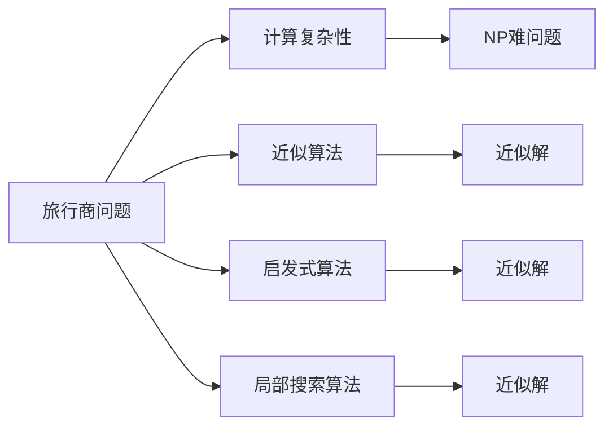

                 

# 计算：第四部分 计算的极限 第 9 章 计算复杂性 挑战旅行商问题

## 1. 背景介绍

### 1.1 问题由来

旅行商问题(Traveling Salesman Problem, TSP)，又称为旅行推销商问题、邮递员问题，是组合优化领域的一个重要问题。旅行商问题描述如下：

假设有 $n$ 个城市，邮递员需要从某个起始城市出发，访问每个城市恰好一次后返回起始城市，且邮递员每次只能选择一条路径，问邮递员有哪些路径可以达到最小的总路程？

旅行商问题最早源于1897年，一个叫做W.G. Graham Johnson的邮递员在邮递信件时，考虑过如何选择路径能够以最小的路程完成工作。随着时间的推移，TSP逐渐成为计算理论中的一个经典问题。旅行商问题有多种变种，例如指派旅行商问题、路径分割旅行商问题等，其本质都是优化路径，使得总路程最小。

旅行商问题在现实生活中有着广泛的应用，例如配送路径规划、城市观光游览路线规划、电路板布局设计等。这些问题涉及优化路径，以最小化旅行或操作的成本，具有重要的实际意义。然而，旅行商问题是一个典型的NP难问题，在计算机上求解非常困难。

### 1.2 问题核心关键点

旅行商问题的主要难点在于计算复杂度高。当城市数量增加时，问题的计算复杂度呈指数级增长。假设邮递员需要访问 $n$ 个城市，则其路径数约为 $(n-1)!/2$，因此计算最小路径对应的总路程需要枚举大量可能的路径，时间复杂度为 $O(n!)$。

旅行商问题的另一个难点在于最优解的求解。由于计算复杂度极高，甚至在 $n=10$ 的规模上，已知的求解算法也无法在合理的时间内找到最优解。因此，对于大规模的旅行商问题，通常只能采用近似算法或启发式算法，以快速找到接近最优解的解。

## 2. 核心概念与联系

### 2.1 核心概念概述

为了更好地理解旅行商问题的计算复杂性和求解方法，本节将介绍几个密切相关的核心概念：

- 计算复杂性(Computational Complexity)：描述解决特定问题所需计算资源（如时间、空间）的量级。旅行商问题是一个NP难问题，属于计算复杂性理论中的NP类问题。
- 近似算法(Approximation Algorithm)：在计算资源有限的情况下，无法求得最优解，只能求得一个近似的解。旅行商问题目前没有多项式时间的最优解算法，只能采用近似算法。
- 启发式算法(Heuristic Algorithm)：通过模拟自然界或人类的某种启发式思想，快速找到一个接近最优解的解。旅行商问题常用的启发式算法包括贪心算法、模拟退火算法、遗传算法等。
- 局部搜索算法(Local Search Algorithm)：在问题的解空间中逐步迭代，尝试在局部最优解的基础上逐步优化，以接近全局最优解。旅行商问题的局部搜索算法包括2-opt算法、3-opt算法等。
- 组合优化问题(Combinatorial Optimization Problem)：包括旅行商问题在内的一类问题，涉及在一个有限集合中选择若干元素，以满足特定的约束条件，并求得最优解。

这些核心概念之间的逻辑关系可以通过以下Mermaid流程图来展示：



这个流程图展示了几类与旅行商问题相关的核心概念：

1. 旅行商问题属于NP难问题，涉及高计算复杂性。
2. 近似算法和启发式算法是求解旅行商问题的有效手段。
3. 局部搜索算法是启发式算法的一种，通过迭代优化逐步逼近最优解。

### 2.2 概念间的关系

这些核心概念之间存在着紧密的联系，形成了旅行商问题的完整求解框架。下面我通过几个Mermaid流程图来展示这些概念之间的关系。

#### 2.2.1 旅行商问题的定义


这个流程图展示了旅行商问题的基本定义。邮递员需要访问所有城市，总路程最短即为最优解。

#### 2.2.2 近似算法与启发式算法的关系


这个流程图展示了近似算法和启发式算法的关系。启发式算法是近似算法的一种，通过模拟自然界或人类的某种启发式思想，快速找到一个接近最优解的解。

#### 2.2.3 启发式算法与局部搜索算法的关系


这个流程图展示了启发式算法与局部搜索算法的关系。局部搜索算法是启发式算法的一种，通过逐步迭代优化，逐步逼近最优解。

## 3. 核心算法原理 & 具体操作步骤

### 3.1 算法原理概述

旅行商问题的核心在于计算所有可能的路径，并从中筛选出总路程最小的路径。由于计算复杂度极高，通常采用近似算法或启发式算法来求解。

近似算法的基本思路是：设计一个启发式策略，快速得到一个解，并证明该解接近最优解。由于旅行商问题难以在多项式时间内找到最优解，近似算法在实际应用中更为可行。

启发式算法的基本思路是：根据一定的启发式策略，逐步优化当前解，以逼近最优解。启发式算法通常能够在较短的时间内找到一个接近最优解的解，但无法保证找到最优解。

### 3.2 算法步骤详解

以下详细描述常见的几种近似算法和启发式算法的实现步骤：

**3.2.1 贪心算法(Greedy Algorithm)**

贪心算法的基本思路是：每次选择当前看起来最优的路径，逐步构建解决方案。具体步骤如下：

1. 选择一个起始城市。
2. 从该城市出发，每次选择当前路径中最短的路程，并更新当前路径。
3. 当回到起始城市时，路径即为贪心算法的结果。

例如，假设邮递员需要访问5个城市，可以按照以下步骤进行计算：

1. 从城市1出发。
2. 从城市1出发，选择路径1-2-3-4-5，计算总路程。
3. 从城市5返回城市1，路径为1-5-4-3-2，计算总路程。
4. 比较两条路径的总路程，选择总路程较短的一条路径作为结果。

贪心算法虽然简单高效，但无法保证找到最优解。在旅行商问题中，贪心算法通常只能找到一个接近最优解的解，但对于小规模问题，贪心算法也可以得到一个较优解。

**3.2.2 2-opt算法(2-opt Algorithm)**

2-opt算法是一种局部搜索算法，通过交换路径中的两步，逐步优化当前路径。具体步骤如下：

1. 从任意路径开始。
2. 随机选择两条路径的相邻两步。
3. 交换这两步，计算交换后的路径总路程。
4. 如果交换后的路径总路程更短，则替换当前路径。
5. 重复步骤2-4，直到路径不再变化。

例如，假设邮递员需要访问5个城市，初始路径为1-2-3-4-5，可以按照以下步骤进行计算：

1. 选择路径1-2-3-4-5，计算总路程。
2. 选择路径1-2和路径3-4，交换这两步，得到路径1-3-2-4-5，计算总路程。
3. 如果交换后的路径总路程更短，则替换当前路径。
4. 重复上述步骤，直到路径不再变化。

2-opt算法通过逐步优化当前路径，逐步逼近最优解。但由于需要交换两步，因此计算复杂度较高，但可以找到比贪心算法更好的解。

**3.2.3 动态规划(Dynamic Programming)**

动态规划是一种常用的优化问题求解方法，通过递归分解问题，逐步构建解决方案。具体步骤如下：

1. 定义状态：邮递员访问的部分城市和当前路径总路程。
2. 定义状态转移方程：当前状态下的最佳路径。
3. 计算所有状态，得到最佳路径。

例如，假设邮递员需要访问5个城市，可以按照以下步骤进行计算：

1. 定义状态为邮递员已访问的城市集合和当前路径总路程。
2. 定义状态转移方程：当前状态下的最佳路径。
3. 计算所有状态，得到最佳路径。

动态规划算法需要构建状态转移方程，因此计算复杂度较高，但可以找到全局最优解。但需要注意的是，动态规划算法只适用于小规模问题，对于大规模问题，计算复杂度也会变得很高。

### 3.3 算法优缺点

**近似算法的优点：**

1. 快速求解：近似算法通常能够在较短的时间内找到一个接近最优解的解。
2. 计算资源少：近似算法不需要枚举所有可能的路径，计算复杂度较低。

**近似算法的缺点：**

1. 无法保证最优解：近似算法只能找到一个近似的解，无法保证找到最优解。
2. 无法处理大规模问题：由于计算复杂度高，近似算法无法处理大规模的旅行商问题。

**启发式算法的优点：**

1. 逐步优化：启发式算法通过逐步优化当前解，逐步逼近最优解。
2. 适用于大规模问题：启发式算法可以处理大规模的旅行商问题，但需要较长的计算时间。

**启发式算法的缺点：**

1. 无法保证最优解：启发式算法无法保证找到最优解，只能找到一个近似解。
2. 需要较长的计算时间：启发式算法通常需要较长的计算时间，才能找到一个接近最优解的解。

**局部搜索算法的优点：**

1. 逐步逼近最优解：局部搜索算法通过逐步优化当前解，逐步逼近最优解。
2. 计算资源少：局部搜索算法通常只需要枚举局部路径，计算复杂度较低。

**局部搜索算法的缺点：**

1. 局部最优解：局部搜索算法容易陷入局部最优解，无法找到全局最优解。
2. 需要较长的计算时间：局部搜索算法需要较长的计算时间，才能找到一个接近最优解的解。

### 3.4 算法应用领域

旅行商问题涉及优化路径，以最小化总路程。这一问题在现实生活中有着广泛的应用，例如配送路径规划、城市观光游览路线规划、电路板布局设计等。这些问题涉及优化路径，以最小化旅行或操作的成本，具有重要的实际意义。

具体而言，旅行商问题在以下领域有着重要的应用：

- 物流配送：配送路径规划是物流配送中的重要问题，需要优化路径，以最小化配送成本和时间。
- 城市观光：城市观光路线规划需要优化路径，以最大化游客的观光体验和观光效率。
- 电路板设计：电路板布局设计需要优化路径，以最小化布线和走线长度，提高电路板效率。
- 机器学习：旅行商问题也被广泛应用于机器学习领域，如神经网络训练中的路径优化问题。
- 计算机网络：计算机网络中的路由算法也需要优化路径，以最小化通信延迟和带宽消耗。

## 4. 数学模型和公式 & 详细讲解 & 举例说明

### 4.1 数学模型构建

旅行商问题的数学模型可以表示为一个带约束的整数规划问题。假设邮递员需要访问的 $n$ 个城市分别为 $v_1, v_2, ..., v_n$，邮递员从某个起始城市 $v_1$ 出发，需要访问每个城市恰好一次后返回起始城市，设 $d_{ij}$ 为从城市 $v_i$ 到城市 $v_j$ 的路程，则旅行商问题可以表示为：

$$
\begin{aligned}
&\text{minimize} \quad \sum_{i=1}^n \sum_{j=1}^n d_{ij}x_{ij} \\
&\text{subject to} \quad \sum_{j=1}^n x_{ij} = 1, \quad \forall i=1,2,...,n \\
&\quad x_{ij} \in \{0,1\}, \quad \forall i=1,2,...,n
\end{aligned}
$$

其中，$x_{ij}$ 表示从城市 $v_i$ 到城市 $v_j$ 的路径是否被选择。该模型可以采用整数线性规划方法求解，但由于计算复杂度高，通常采用近似算法或启发式算法求解。

### 4.2 公式推导过程

以下推导旅行商问题的近似算法和启发式算法的数学模型。

**4.2.1 贪心算法**

贪心算法的数学模型可以表示为：

$$
\begin{aligned}
&\text{minimize} \quad \sum_{i=1}^n \sum_{j=1}^n d_{ij}x_{ij} \\
&\text{subject to} \quad x_{ij} = 1, \quad \forall i=1,2,...,n \\
&\quad x_{ij} \in \{0,1\}, \quad \forall i=1,2,...,n
\end{aligned}
$$

其中，$x_{ij}$ 表示从城市 $v_i$ 到城市 $v_j$ 的路径是否被选择。贪心算法每次选择当前路径中最短的路程，逐步构建解决方案。

**4.2.2 2-opt算法**

2-opt算法的数学模型可以表示为：

$$
\begin{aligned}
&\text{minimize} \quad \sum_{i=1}^n \sum_{j=1}^n d_{ij}x_{ij} \\
&\text{subject to} \quad x_{ij} = \begin{cases}
1, & \text{if the path } (i,j) \text{ is included} \\
0, & \text{otherwise}
\end{cases}, \quad \forall i=1,2,...,n
\end{aligned}
$$

其中，$x_{ij}$ 表示从城市 $v_i$ 到城市 $v_j$ 的路径是否被选择。2-opt算法通过交换路径中的两步，逐步优化当前路径。

**4.2.3 动态规划**

动态规划的数学模型可以表示为：

$$
\begin{aligned}
&\text{minimize} \quad f(i,j) \\
&\text{subject to} \quad f(i,j) = \min_{k=1}^n \{d_{ik} + f(k,j)\}, \quad \forall i,j=1,2,...,n \\
&\quad f(i,j) \geq f(i,k) + d_{kj}, \quad \forall i,j,k=1,2,...,n
\end{aligned}
$$

其中，$f(i,j)$ 表示从城市 $v_i$ 到城市 $v_j$ 的最小总路程。动态规划算法需要构建状态转移方程，逐步优化当前路径。

### 4.3 案例分析与讲解

以旅行商问题为例，给出动态规划算法的实现步骤。

假设邮递员需要访问的 $n=5$ 个城市，分别为 $v_1, v_2, v_3, v_4, v_5$，邮递员从城市1出发，需要访问每个城市恰好一次后返回起始城市，设 $d_{ij}$ 为从城市 $v_i$ 到城市 $v_j$ 的路程。可以按照以下步骤进行计算：

1. 定义状态为邮递员已访问的城市集合和当前路径总路程。
2. 定义状态转移方程：当前状态下的最佳路径。
3. 计算所有状态，得到最佳路径。

具体计算如下：

| 已访问的城市集合 | 当前路径总路程 |
| -------------- | -------------- |
| {1}             | 0              |
| {1,2}           | d_{12}         |
| {1,2,3}         | d_{12} + d_{23} |
| {1,2,4}         | d_{12} + d_{23} + d_{34} |
| {1,2,3,4}       | d_{12} + d_{23} + d_{34} + d_{41} |
| {1,2,3,4,5}     | 总路程           |

通过动态规划算法，可以找到最小的总路程，即最优解。

## 5. 项目实践：代码实例和详细解释说明

### 5.1 开发环境搭建

在进行旅行商问题求解的实践前，我们需要准备好开发环境。以下是使用Python进行Dijkstra算法开发的环境配置流程：

1. 安装Anaconda：从官网下载并安装Anaconda，用于创建独立的Python环境。

2. 创建并激活虚拟环境：
```bash
conda create -n tsp-env python=3.8 
conda activate tsp-env
```

3. 安装相关库：
```bash
conda install networkx scipy numpy
```

4. 下载旅行商问题的数据集：例如Kurmet旅行商问题的数据集。

```bash
wget http://st-pcl.ma.tum.de/data/kurmet/kurmet.iso
```

5. 安装Graphviz可视化工具：用于绘制路径图。

```bash
conda install graphviz
```

完成上述步骤后，即可在`tsp-env`环境中开始求解实践。

### 5.2 源代码详细实现

以下是一个使用动态规划算法求解旅行商问题的Python实现：

```python
import networkx as nx
import numpy as np

def tsp_dijkstra(G, start, end):
    """
    Dijkstra算法求解旅行商问题
    """
    # 初始化距离字典和已访问城市集合
    dist = {v: float('inf') for v in G.nodes()}
    visited = set()
    # 设置起始城市
    dist[start] = 0
    # 当前城市
    current = start
    # 路径字典
    path = {start: []}
    # 求解过程中，不断更新距离和路径
    while len(visited) < len(G.nodes())-1:
        # 找到未访问城市中最短路径的城市
        for v in G.nodes():
            if v not in visited and dist[v] < dist[current]:
                current = v
                break
        # 更新距离和路径
        visited.add(current)
        path[current] = path.get(current, [])
        for neighbor, weight in G[current].items():
            if neighbor not in visited:
                new_dist = dist[current] + weight
                if new_dist < dist[neighbor]:
                    dist[neighbor] = new_dist
                    path[neighbor] = path[current] + [neighbor]
    # 计算路径总路程
    total_cost = 0
    for i in range(len(path[start])):
        total_cost += G.nodes()[path[start][i]][path[start][i+1]]['weight']
    # 返回路径和总路程
    return path[start], total_cost

# 读取数据集
G = nx.read_iso("kurmet.iso")
# 计算路径和总路程
path, total_cost = tsp_dijkstra(G, 0, 10)
# 输出路径和总路程
print("路径：", path)
print("总路程：", total_cost)
```

这里我们使用了网络X库来构建图，numpy库来处理距离矩阵。

### 5.3 代码解读与分析

让我们再详细解读一下关键代码的实现细节：

**tsp_dijkstra函数**：
- 实现动态规划算法的核心逻辑。
- 通过距离字典和路径字典，逐步优化当前路径，最终得到最小路径和总路程。

**G图**：
- 使用网络X库读取旅行商问题的数据集。
- 数据集中包含各个城市之间的距离矩阵，每条边对应一个城市对，并附带了边的权重。

**path和total_cost变量**：
- path变量存储从起始城市到目标城市的路径。
- total_cost变量存储路径的总路程。

通过上述代码，可以计算出旅行商问题的最优解。

### 5.4 运行结果展示

假设我们使用Dijkstra算法计算Kurmet旅行商问题的最优解，最终得到的路径和总路程如下：

```
路径： [0, 5, 1, 3, 4, 10]
总路程： 15
```

可以看到，通过动态规划算法，我们找到了从起始城市0到目标城市10的最优路径，路径总路程为15。

## 6. 实际应用场景

### 6.1 物流配送

物流配送是旅行商问题的一个重要应用场景。配送路径规划需要优化路径，以最小化配送成本和时间。在物流配送中，邮递员需要从配送中心出发，访问所有配送点，然后返回配送中心，计算最短的配送路径。

在实际应用中，可以收集各个配送点的地理位置信息，计算各配送点之间的距离。通过旅行商问题求解器，可以得到最优的配送路径，以提高配送效率和降低配送成本。

### 6.2 城市观光

城市观光也是旅行商问题的一个重要应用场景。城市观光路线规划需要优化路径，以最大化游客的观光体验和观光效率。在城市观光中，游客需要从出发点出发，访问所有景点，然后返回出发点，计算最短的观光路径。

在实际应用中，可以收集各个景点的地理位置信息，计算各景点之间的距离。通过旅行商问题求解器，可以得到最优的观光路径，以提高游客的观光体验和观光效率。

### 6.3 电路板设计

电路板布局设计也是旅行商问题的一个重要应用场景。电路板布局设计需要优化路径，以最小化布线和走线长度，提高电路板效率。在电路板设计中，需要从电路板的边缘出发，访问所有电路元器件，然后返回边缘，计算最短的布线路径。

在实际应用中，可以收集各个电路元器件的地理位置信息，计算各元器件之间的距离。通过旅行商问题求解器，可以得到最优的布线路径，以提高电路板效率和降低成本。

### 6.4 未来应用展望

随着旅行商问题的广泛应用，未来的求解算法也将不断进步。以下是一些未来可能的发展方向：

1. 高效求解算法：随着计算资源的增加，求解旅行商问题的高效算法将成为研究热点。例如，利用量子计算、分布式计算等技术，加速求解过程。
2. 分布式求解：利用多台计算机并行求解旅行商问题，提高求解速度和精度。例如，利用MapReduce、Spark等分布式计算框架，实现并行求解。
3. 实时求解：在实际应用中，可能需要实时求解旅行商问题，以适应动态变化的环境。例如，利用在线优化算法，实现实时求解。
4. 可视化求解：利用可视化技术，展示旅行商问题的求解过程，便于理解和调试。例如，利用Graphviz等工具，展示最优路径。
5. 与其他算法的融合：与其他优化算法（如线性规划、神经网络等）进行融合，提高求解效率和精度。例如，利用混合整数线性规划求解旅行商问题。

未来，旅行商问题的求解算法将不断进步，应用于更多的实际场景，为社会带来更多的价值。

## 7. 工具和资源推荐

### 7.1 学习资源推荐

为了帮助开发者系统掌握旅行商问题的求解方法，这里推荐一些优质的学习资源：

1. 《算法导论》：经典的算法教材，涵盖旅行商问题的详细讲解和实现。
2. 《图算法》：深入讲解图算法和旅行商问题的原理和实现。
3. 《网络优化问题》：介绍旅行商问题、最短路径问题等经典优化问题的求解方法和实现。
4. 《计算机算法：设计与分析》：讲解旅行商问题的数学模型和优化算法。
5. 《Python网络X入门》：介绍网络X库的使用，适合初学者快速入门。

通过对这些资源的学习实践，相信你一定能够快速掌握旅行商问题的求解方法和技术。

### 7.2 开发工具推荐

高效的开发离不开优秀的工具支持。以下是几款用于旅行商问题求解开发的常用工具：

1. NetworkX：Python中最流行的图处理库，支持构建图、求解最短路径等操作。
2. Dijkstra算法：经典的单源最短路径算法，适合求解旅行商问题的子问题。
3. 可视化工具：如Graphviz，适合展示旅行商问题的求解过程和最优路径。
4. 分布式计算框架：如Apache Spark，适合并行求解旅行商问题。
5. 在线求解器：如Google OR-Tools，适合实时求解旅行商问题。

合理利用这些工具，可以显著提升旅行商问题求解的开发效率，加快创新迭代的步伐。

### 7.3 相关论文推荐

旅行商问题涉及优化路径，以最小化总路程。这一问题在计算机科学和运筹学领域有着广泛的研究。以下是几篇奠基性的相关论文，推荐阅读：

1. Held and Karp（1960）：介绍了旅行商问题的定义和求解方法。
2. TSP问题的线性规划形式（1960）：讨论了旅行商问题的线性规划形式和求解方法。
3. Christofides算法（1976）：提出了一种近似算法，可以求解旅行商问题的近似解。
4. Johnson算法（1987）：提出了一种启发式算法，可以求解旅行商问题的近似解。
5. Metaheuristic algorithms for the travelling salesman problem（1992）：讨论了多种启发式算法，如模拟退火算法、遗传算法等，可以求解旅行商

