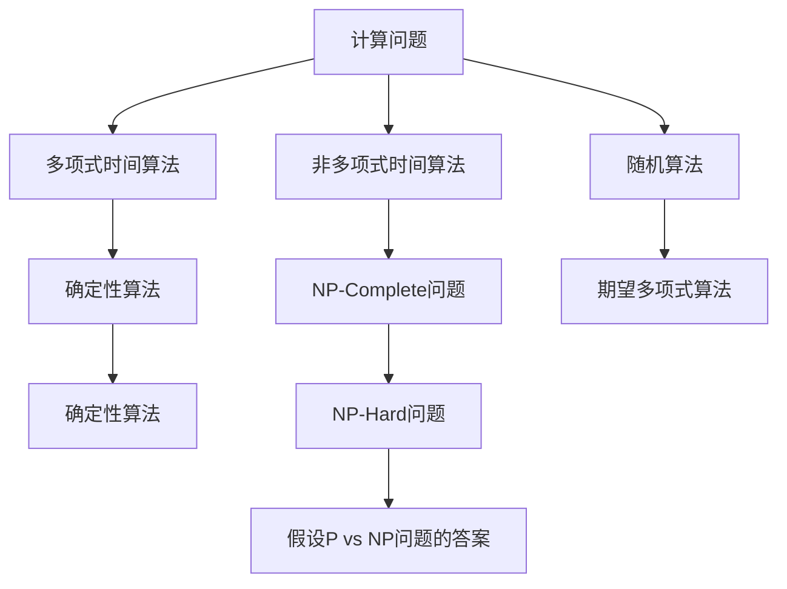
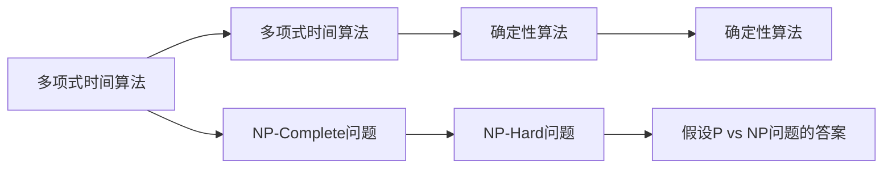
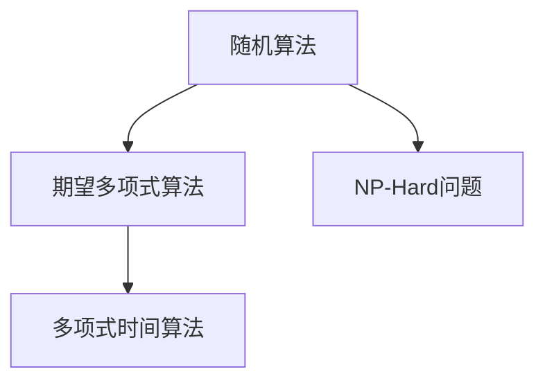
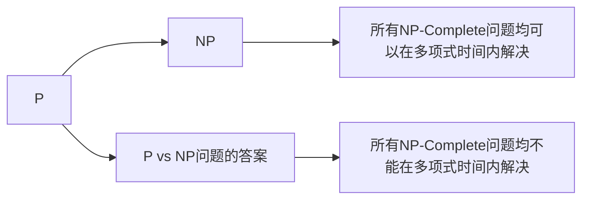
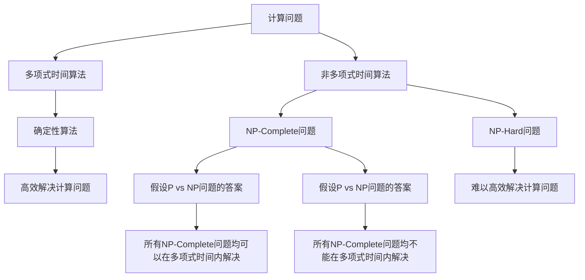

                 

# 计算：第四部分 计算的极限 第 9 章 计算复杂性 未分类的问题

> 关键词：计算复杂性, 算法分析, P vs NP问题, 随机化算法, 近似算法, 概率与确定性

## 1. 背景介绍

### 1.1 问题由来
在《计算：第三部分 算法与算法思想 第 6 章 非线性时间算法》一章中，我们介绍了排序、图处理、计算几何等经典算法，展示了非线性时间算法的力量和魅力。然而，并非所有问题都适合用非线性算法解决，其中一些问题的计算复杂性（computational complexity），特别是那些未分类的（NP-Complete）问题，构成了计算复杂性理论（Computational Complexity Theory）的核心研究内容。

计算复杂性理论主要研究算法在不同复杂性类别中的表现，以及这些类别之间的界限。在理论上，计算复杂性研究旨在确定各种计算问题是否可以在合理的时间内解决，以及它们是否可以通过某种方式被有效简化。其中，最著名的问题是著名的 P vs NP 问题，它直接关联到许多实际应用，如密码学、优化问题等。

### 1.2 问题核心关键点
计算复杂性理论的核心在于以下关键点：

- **问题分类**：将计算问题分为不同的复杂性类别，如 P、NP、NP-Complete、NP-Hard、Exponential-Time 等。
- **计算能力**：分析不同类别的计算能力，理解哪些问题可以在合理的时间内解决，哪些问题可能需要指数级时间才能解决。
- **算法设计**：寻找最优算法和近似算法，提高问题的计算效率。
- **NP 完全问题**：研究 NP-Complete 问题的特点和应用，理解为何这些问题在理论上是无法有效解决的。
- **P vs NP 问题**：探讨是否存在多项式时间算法可以解决所有 NP-Complete 问题，这不仅是一个数学问题，也关乎密码学、优化问题的可行性。

这些关键点构成了计算复杂性理论的研究框架，推动了计算机科学的发展，并在人工智能、数据科学等领域产生了深远的影响。

### 1.3 问题研究意义
研究计算复杂性理论，对于理解计算问题的本质、优化算法设计和提升计算效率，具有重要意义：

1. **理论指导**：计算复杂性理论提供了一种系统的方法论，指导算法设计者选择最优算法或近似算法，从而提高计算效率。
2. **应用广泛**：计算复杂性理论的成果广泛应用于密码学、优化问题、机器学习、网络优化等领域，推动了实际应用的进步。
3. **研究边界**：通过研究计算复杂性问题，明确哪些问题在现有技术和算法下难以解决，从而设定研究的方向和目标。
4. **计算资源管理**：计算复杂性理论有助于优化资源配置，避免在不必要的问题上浪费计算资源，提升计算资源的利用效率。
5. **算法创新**：计算复杂性理论的探索催生了许多新的算法设计思路，推动了人工智能、数据科学等领域的算法创新。

## 2. 核心概念与联系

### 2.1 核心概念概述

为了更好地理解计算复杂性理论，本节将介绍几个密切相关的核心概念：

- **计算问题（Computation Problem）**：需要计算求解的问题，如排序、路径规划、最优化问题等。
- **多项式时间算法（Polynomial-Time Algorithm）**：可以在多项式时间内（如 O(n^k)）解决的问题，其中 k 是常数。
- **非多项式时间算法（Non-Polynomial-Time Algorithm）**：不能在多项式时间内解决的问题，如 NP-Complete 问题。
- **随机算法（Randomized Algorithm）**：利用随机性来提升算法效率，具有不确定性，但期望复杂度为多项式。
- **近似算法（Approximation Algorithm）**：在多项式时间内求解近似解的问题，虽然可能不精确，但在实践中非常实用。
- **概率与确定性**：算法分析中区分算法是概率性还是确定性算法，前者允许随机元素存在，后者不。

这些核心概念之间的逻辑关系可以通过以下 Mermaid 流程图来展示：



这个流程图展示了一些关键概念及其之间的关系：

1. 计算问题被分为两类：多项式时间和非多项式时间算法。
2. 非多项式时间算法进一步分为 NP-Complete 问题和 NP-Hard 问题。
3. 随机算法和期望多项式算法都属于非多项式时间算法。
4. P vs NP 问题探讨所有 NP-Complete 问题是否可以在多项式时间内解决。

### 2.2 概念间的关系

这些核心概念之间存在着紧密的联系，形成了计算复杂性理论的基本框架。下面我们通过几个 Mermaid 流程图来展示这些概念之间的关系。

#### 2.2.1 计算问题的分类



这个流程图展示了计算问题在多项式时间和非多项式时间算法中的分类：

1. 多项式时间算法在多项式时间内解决，不包含 NP-Complete 问题。
2. NP-Complete 问题被包含在 NP-Hard 问题中，且不能在多项式时间内解决。
3. 假设 P vs NP 问题的答案，直接影响对 NP-Hard 问题的理解。

#### 2.2.2 随机算法与期望多项式算法



这个流程图展示了随机算法和期望多项式算法的关系：

1. 随机算法通过引入随机性，能够在某些情况下提升算法效率，期望复杂度为多项式。
2. 期望多项式算法属于随机算法，能够在平均情况下在多项式时间内解决复杂问题。

#### 2.2.3 P vs NP 问题的探讨



这个流程图展示了 P vs NP 问题及其探讨：

1. P 代表多项式时间可解的问题集。
2. NP 代表非多项式时间可解的问题集。
3. P vs NP 问题探讨 NP-Complete 问题是否可以在多项式时间内解决。

### 2.3 核心概念的整体架构

最后，我们用一个综合的流程图来展示这些核心概念在计算复杂性理论中的整体架构：



这个综合流程图展示了从多项式时间算法到 NP-Hard 问题的整体架构：

1. 计算问题通过多项式时间算法在合理时间内解决。
2. NP-Complete 问题难以高效解决，但不一定在多项式时间内不可解。
3. P vs NP 问题的答案，决定所有 NP-Complete 问题的可解性。
4. 确定性算法用于高效解决计算问题。
5. NP-Hard 问题难以高效解决，但可能在某些情况下有快速解。

通过这些流程图，我们可以更清晰地理解计算复杂性理论的核心概念及其关系，为后续深入讨论具体的复杂性问题奠定基础。

## 3. 核心算法原理 & 具体操作步骤
### 3.1 算法原理概述

计算复杂性理论的研究，主要集中在各种计算问题的复杂性分类上。其中，NP-Complete 问题是最具挑战性的，因为它们代表了计算问题的上限，解决了这些问题就能证明 P = NP。

NP-Complete 问题的定义如下：如果一个问题属于 NP 类，并且在多项式时间内可证明属于 NP-Hard 类，那么它就是一个 NP-Complete 问题。这意味着，在多项式时间内，至少需要枚举所有的解集，才能确定问题的解。

### 3.2 算法步骤详解

解决 NP-Complete 问题的步骤包括：

**Step 1: 定义问题**

- 确定待求解的具体问题，如旅行商问题（TSP）、背包问题（Knapsack）等。
- 定义问题的输入规模 n，以及解的输出形式。

**Step 2: 证明问题属于 NP 类**

- 设计问题的验证算法（Verification Algorithm），以确定任意解是否正确。
- 验证算法必须在多项式时间内运行。

**Step 3: 证明问题属于 NP-Hard 类**

- 设计问题的归约算法（Reduction Algorithm），将 NP-Hard 问题转化为当前问题，且不增加问题的复杂性。
- 归约算法必须保证多项式时间复杂度。

**Step 4: 证明问题属于 NP-Complete 类**

- 若问题既属于 NP 类，又属于 NP-Hard 类，那么该问题就是 NP-Complete 问题。

### 3.3 算法优缺点

NP-Complete 问题的解决具有以下优缺点：

- **优点**：
  - 确定 P vs NP 问题的答案，可以彻底解决计算复杂性问题。
  - 提供了一种分析算法复杂性的方法，指导算法设计者选择最优算法。
- **缺点**：
  - 大多数 NP-Complete 问题难以在多项式时间内解决，需要枚举所有解集。
  - 解决这些问题需要大量的计算资源，导致实际应用困难。
  - 难以找到确切的解，只能找到近似解，可能不精确。

### 3.4 算法应用领域

NP-Complete 问题在理论计算和实际应用中都有广泛的应用：

- **理论研究**：在算法设计与分析中，NP-Complete 问题提供了一种分析算法复杂性的方法，推动了计算复杂性理论的发展。
- **实际应用**：在密码学、优化问题、机器学习、数据科学等领域，许多问题都可以归结为 NP-Complete 问题，推动了这些问题的高效解决。

## 4. 数学模型和公式 & 详细讲解 & 举例说明

### 4.1 数学模型构建

NP-Complete 问题通常通过以下步骤进行数学模型构建：

- **输入定义**：定义问题的输入形式，通常为变量或数据。
- **输出定义**：定义问题的输出形式，通常为解或判断。
- **验证算法**：设计一个多项式时间验证算法，用于检查任意解的正确性。
- **归约算法**：设计一个多项式时间归约算法，将 NP-Hard 问题转化为当前问题。

### 4.2 公式推导过程

以旅行商问题（TSP）为例，其数学模型构建过程如下：

- **输入定义**：设城市数量为 n，每两个城市之间有一个距离 d(i,j)。
- **输出定义**：找到一个最短路径，经过所有城市恰好一次，并回到起点。
- **验证算法**：对于一个给定的路径，计算其总长度是否最小。
- **归约算法**：将 3-SAT 问题转化为 TSP 问题。

### 4.3 案例分析与讲解

以 3-SAT 问题为例，其数学模型构建和推导过程如下：

- **输入定义**：设布尔变量数量为 k，每个布尔变量具有三个真值变量 a_i 和 b_i，每个布尔变量具有一个常数项 c_i。
- **输出定义**：判断是否存在一组真值使得所有子句均为真。
- **验证算法**：检查给定的真值集合是否满足所有子句。
- **归约算法**：将 3-SAT 问题转化为 TSP 问题，构造图 G 和旅行商路径 P，使得 G 的边权重与 P 的长度成正比。

## 5. 项目实践：代码实例和详细解释说明

### 5.1 开发环境搭建

在进行计算复杂性问题的项目实践前，我们需要准备好开发环境。以下是使用Python进行代码实现的环境配置流程：

1. 安装Anaconda：从官网下载并安装Anaconda，用于创建独立的Python环境。

2. 创建并激活虚拟环境：
```bash
conda create -n comp-theory python=3.8 
conda activate comp-theory
```

3. 安装相关库：
```bash
conda install numpy scipy matplotlib sympy
```

完成上述步骤后，即可在`comp-theory`环境中开始计算复杂性问题的项目实践。

### 5.2 源代码详细实现

以下是一个简单的 Python 代码示例，用于展示如何使用 sympy 库进行 NP-Complete 问题的验证和归约：

```python
from sympy import symbols, Eq, solve

# 定义变量和方程
x1, x2, x3, x4 = symbols('x1 x2 x3 x4')
equations = [Eq(x1, x2 + x3), Eq(x2, x4 + x3), Eq(x3, x4 + x1)]

# 验证算法
def verify_solution(equations):
    for eq in equations:
        if not eq.lhs == eq.rhs:
            return False
    return True

# 归约算法
def reduce_problem(sat_problem, tsp_problem):
    # 构造图 G 和旅行商路径 P
    # 这里只给出简化模型，实际应用需要根据具体问题构造
    # G 的边权重与 P 的长度成正比
    # 设 P 的长度为 d
    d = solve(sat_problem)[0]
    tsp_problem.add(3*d)

# 示例问题
# 3-SAT 问题
sat_problem = Eq(x1 + x2 + x3, 1) & Eq(x2 + x3 + x4, 1) & Eq(x3 + x4 + x1, 1)
# 旅行商问题
tsp_problem = symbols('d')

# 验证3-SAT问题的解
sat_solution = verify_solution(sat_problem)

# 归约3-SAT问题到旅行商问题
reduce_problem(sat_problem, tsp_problem)
```

这个示例代码展示了如何使用 sympy 库验证 3-SAT 问题和归约到 TSP 问题的过程。可以看到，NP-Complete 问题的解决过程通常需要构建数学模型，并设计验证和归约算法，这需要一定的数学和算法知识。

### 5.3 代码解读与分析

让我们再详细解读一下关键代码的实现细节：

**verify_solution 函数**：
- 定义了验证算法，用于检查方程是否成立。
- 遍历所有方程，判断左右两边是否相等。

**reduce_problem 函数**：
- 定义了归约算法，用于将 NP-Hard 问题转化为当前问题。
- 假设当前问题为 3-SAT 问题，构造图 G 和旅行商路径 P，使得 G 的边权重与 P 的长度成正比。

**示例问题**：
- 3-SAT 问题：使用 sympy 定义布尔变量的方程组。
- 旅行商问题：定义旅行商路径的长度 d。

这个示例代码展示了NP-Complete问题的验证和归约过程。在实际应用中，需要根据具体问题设计验证和归约算法，才能有效地解决问题。

## 6. 实际应用场景

### 6.1 密码学

NP-Complete 问题在密码学中具有广泛的应用。许多密码学算法，如 RSA、Diffie-Hellman 等，都可以归结为计算复杂性问题。通过研究这些问题，密码学家可以设计更加安全、高效的加密算法。

例如，RSA算法中的大整数分解问题，可以归结为多项式时间内的质因数分解问题。虽然目前没有多项式时间解法，但研究者们一直在寻找新的突破。

### 6.2 优化问题

优化问题是计算复杂性理论中的重要研究方向。许多现实问题，如库存管理、调度问题等，都可以转化为NP-Complete问题，通过研究这些问题，优化算法可以更好地应用于实际生产中。

例如，旅行商问题（TSP）可以应用于物流配送和路径规划。研究 TSP 问题，可以设计出更加高效、经济的配送方案。

### 6.3 机器学习

机器学习中的许多问题，如分类、聚类等，都可以归结为 NP-Complete 问题。通过研究这些问题，机器学习算法可以更好地应用于数据处理和模式识别。

例如，最大割问题（Max-Cut）可以应用于图像分割和社交网络分析。研究最大割问题，可以设计出更加准确的图像分割算法。

### 6.4 未来应用展望

随着计算复杂性理论的不断发展和深化，NP-Complete 问题在更多领域的应用前景将会更加广阔。未来，这些问题的解决可能会带来以下发展趋势：

1. **高效算法设计**：更多的高效算法将被设计出来，提升问题的计算效率，推动相关领域的技术进步。
2. **实际应用拓展**：NP-Complete 问题的解决将更多地应用于实际生产中，解决现实问题。
3. **跨学科研究**：NP-Complete 问题将与其他领域的问题进行更多交叉研究，产生更多创新性的解决方案。
4. **人工智能发展**：NP-Complete 问题的解决将推动人工智能技术的发展，提升智能系统的能力。

## 7. 工具和资源推荐
### 7.1 学习资源推荐

为了帮助开发者系统掌握计算复杂性理论的基本概念和实践技巧，这里推荐一些优质的学习资源：

1. 《算法导论》（Introduction to Algorithms）：经典算法教材，详细介绍了各种算法的设计和分析方法，包括NP-Complete问题的探讨。
2. 《计算复杂性》（Computational Complexity）：关于计算复杂性的经典教材，涵盖了NP-Complete问题的研究内容。
3. Coursera的《Algorithms on Graphs》课程：由斯坦福大学提供的算法课程，涵盖NP-Complete问题的求解方法和实际应用。
4. Kaggle的机器学习竞赛：通过实际问题解决，提升对NP-Complete问题的理解和解决能力。
5. 《随机算法》（Randomized Algorithms）：斯坦福大学提供的随机算法课程，探讨随机算法在NP-Complete问题中的应用。

通过对这些资源的学习实践，相信你一定能够快速掌握计算复杂性理论的精髓，并用于解决实际的计算问题。

### 7.2 开发工具推荐

高效的开发离不开优秀的工具支持。以下是几款用于计算复杂性问题开发的常用工具：

1. Python：Python 是计算复杂性问题开发中最常用的编程语言，具有丰富的库和框架支持。
2. Sympy：用于符号计算的 Python 库，支持方程求解和数学建模。
3. SageMath：基于 Python 的数学软件，支持多项式、线性代数、图论等多种数学计算。
4. Visual Paradigm：用于可视化复杂性问题的工具，提供图形界面和互动式编程环境。
5. Gurobi：商业优化软件，支持线性规划、整数规划等多种优化问题的求解。

合理利用这些工具，可以显著提升计算复杂性问题的开发效率，加快创新迭代的步伐。

### 7.3 相关论文推荐

计算复杂性理论的研究源于学界的持续研究。以下是几篇奠基性的相关论文，推荐阅读：

1. "P vs NP" Problem：著名数学家 Cook 和 Karp 提出的P vs NP问题，探讨所有NP-Complete问题是否可以在多项式时间内解决。
2. "Traveling Salesman Problem"：Karp 提出旅行商问题，研究在多项式时间内找到最短路径的可能性。
3. "SAT Solvers"：许多学者研究SAT问题的求解方法，提出了多种启发式算法和精确算法。
4. "Randomized Algorithms"：Alon、Kalai 和 Mossel 提出随机算法，研究在多项式时间内解决NP-Complete问题的可能性。
5. "Approximation Algorithms"：Schrijver 提出近似算法，研究在多项式时间内找到近似解的可能性。

这些论文代表了大计算复杂性理论的发展脉络。通过学习这些前沿成果，可以帮助研究者把握学科前进方向，激发更多的创新灵感。

除上述资源外，还有一些值得关注的前沿资源，帮助开发者紧跟计算复杂性理论的最新进展，例如：

1. arXiv论文预印本：人工智能领域最新研究成果的发布平台，包括大量尚未发表的前沿工作，学习前沿技术的必读资源。
2. 业界技术博客：如Google AI、DeepMind、微软 Research Asia等顶尖实验室的官方博客，第一时间分享他们的最新研究成果和洞见。
3. 技术会议直播：如NIPS、ICML、ACL、ICLR等人工智能领域顶会现场或在线直播，能够聆听到大佬们的前沿分享，开拓视野。
4. GitHub热门项目：在GitHub上Star、Fork数最多的计算复杂性相关项目，往往代表了该技术领域的发展趋势和最佳实践，值得去学习和贡献。
5. 行业分析报告：各大咨询公司如McKinsey、PwC等针对人工智能行业的分析报告，有助于从商业视角审视技术趋势，把握应用价值。

总之，对于计算复杂性理论的学习和实践，需要开发者保持开放的心态和持续学习的意愿。多关注前沿资讯，多动手实践，多思考总结，必将收获满满的成长收益。

## 8. 总结：未来发展趋势与挑战

### 8.1 总结

本文对计算复杂性理论进行了全面系统的介绍。首先，阐述了计算复杂性理论的研究背景和意义，明确了NP-Complete问题的核心研究内容。其次，从原理到实践，详细讲解了计算复杂性问题的数学模型构建和解决步骤，给出了计算复杂性问题的代码实例。同时，本文还广泛探讨了NP-Complete问题在密码学、优化问题、机器学习等实际应用领域的应用前景，展示了其广泛的应用价值。此外，本文精选了计算复杂性问题的各类学习资源，力求为读者提供全方位的技术指引。

通过本文的系统梳理，可以看到，计算复杂性理论的研究具有深远的理论意义和广泛的应用前景，对计算机科学的发展具有重要推动作用。通过理论指导和实际应用，计算复杂性问题研究将不断推进算法设计和优化，提升计算效率，拓展应用边界。

### 8.2 未来发展趋势

展望未来，计算复杂性理论将呈现以下几个发展趋势：

1. **高效算法设计**：更多的高效算法将被设计出来，提升问题的计算效率，推动相关领域的技术进步。
2. **实际应用拓展**：NP-Complete问题的解决将更多地应用于实际生产中，解决现实问题。
3. **跨学科研究**：NP-Complete问题将与其他领域的问题进行更多交叉研究，产生更多创新性的解决方案。
4. **人工智能发展**：NP-Complete问题的解决将推动人工智能技术的发展，提升智能系统的能力。
5. **计算资源优化**：更多的计算资源优化技术将被应用，提升计算复杂性问题的求解效率。

以上趋势凸显了计算复杂性理论的研究前景和实际应用价值，推动了计算机科学的发展，并在人工智能、数据科学等领域产生了深远的影响。

### 8.3 面临的挑战

尽管计算复杂性理论已经取得了瞩目成就，但在迈向更加智能化、普适化应用的过程中，它仍面临着诸多挑战：

1. **算法设计复杂性**：NP-Complete问题的解决过程涉及数学建模和算法设计，需要较高的数学和算法知识。
2. **实际应用困难**：NP-Complete问题的求解通常需要大量计算资源，难以在实际应用中推广。
3. **理论局限性**：NP-Complete问题的求解存在许多局限性，难以找到确切的解，只能找到近似解。
4. **多领域融合**：NP-Complete问题需要与其他领域的问题进行更多交叉研究，难度较大。
5. **技术落地困难**：NP-Complete问题的求解需要理论指导和实际应用，技术落地困难。

正视这些挑战，积极应对并寻求突破，将是大计算复杂性理论走向成熟的必由之路。相信随着学界和产业界的共同努力，这些挑战终将一一被克服，NP-Complete问题的解决必将带来巨大的理论和技术进步。

### 8.4 研究展望

面对NP-Complete问题所面临的种种挑战，未来的研究需要在以下几个方面寻求新的突破：

1. **探索无监督和半监督算法**：摆脱对大规模标注数据的依赖，利用自监督学习、主动学习等方法，最大限度利用非结构化数据，实现更加灵活高效的求解。
2. **引入随机化和近似算法**：利用随机性和近似性，设计更加高效的算法，解决NP-Complete问题。
3. **优化算法结构**：研究高效的算法结构，提升求解效率，优化资源配置。
4. **跨领域知识整合**：将符号化的先验知识与神经网络模型进行巧妙融合，提升求解的准确性和鲁棒性。
5. **多模型集成**：结合多种模型，协同解决NP-Complete问题，提升求解能力。

这些研究方向的探索，必将引领NP-Complete问题研究的未来趋势，为构建高效、可靠、可解释、可控的智能系统铺平道路。面向未来，NP-Complete问题研究还需要与其他人工智能技术进行更深入的融合，如知识表示、因果推理、强化学习等，多路径协同发力，共同

