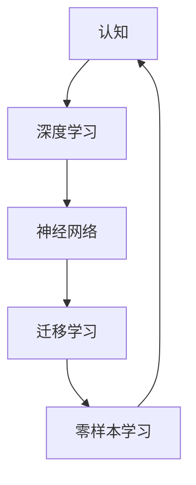
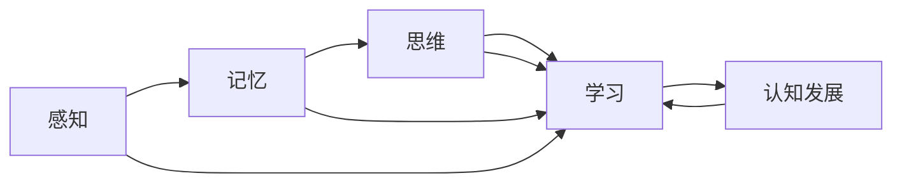
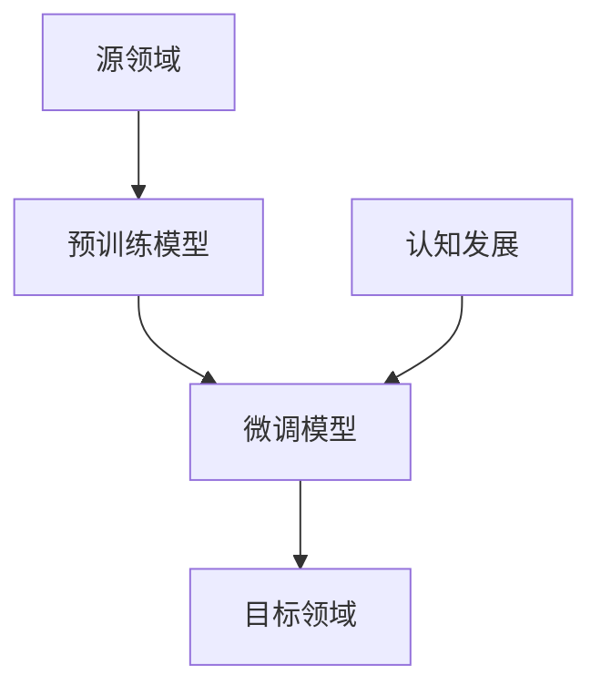
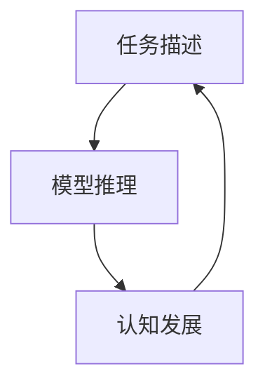

                 

# 认知发展中的简单与深刻变化

## 1. 背景介绍

### 1.1 问题由来
认知发展（Cognitive Development）是指个体从出生到成熟，认知能力逐步提升的过程。认知发展不仅包括信息处理能力的提升，还包括知识的积累和思维方式的演进。在人工智能（AI）领域，认知发展已经成为研究热点，尤其是在深度学习和神经网络模型的演进中，认知能力逐渐向更复杂、更深刻的层面迈进。本文旨在探讨AI模型在认知发展中的简单与深刻变化，并对未来发展趋势进行预测。

### 1.2 问题核心关键点
本文聚焦于以下几个核心问题：
- AI模型在认知发展中经历了哪些变化？
- 这些变化对AI模型性能有何影响？
- AI模型未来可能面临哪些挑战？

通过回答这些问题，希望能够为AI研究者和开发者提供洞察，并指引未来AI模型的设计和发展方向。

## 2. 核心概念与联系

### 2.1 核心概念概述

为了更好地理解认知发展，我们首先介绍几个关键概念：

- 认知（Cognition）：是指人脑对外界信息的处理、存储和应用能力，包括感知、记忆、思维、学习等。
- 深度学习（Deep Learning）：一种模拟人脑神经网络的机器学习方法，通过多层神经网络进行特征提取和模式识别。
- 神经网络（Neural Network）：由大量人工神经元构成的网络结构，用于处理复杂的非线性关系。
- 迁移学习（Transfer Learning）：指将一个领域学习到的知识迁移到另一个领域，以提升新领域学习效率的方法。
- 零样本学习（Zero-shot Learning）：指模型在没有见过任何特定任务的训练样本的情况下，仅凭任务描述就能够执行新任务。

这些概念之间的联系可以通过以下Mermaid流程图来展示：



这个流程图展示了认知发展中几个核心概念之间的逻辑关系：

1. 认知是深度学习和神经网络研究的基础，深度学习通过模仿人脑神经网络来实现复杂认知任务。
2. 神经网络是深度学习的核心组件，用于模拟人脑神经元之间的连接和互动。
3. 迁移学习是一种重要的认知学习方法，通过知识迁移来提升模型在新的领域中的学习效率。
4. 零样本学习展示了认知能力在未知领域的扩展，即模型能够通过推理和泛化来实现新的任务。

### 2.2 概念间的关系

这些核心概念之间的联系更为紧密，形成了一个完整的认知发展框架。下面我们通过几个Mermaid流程图来展示这些概念之间的详细关系。

#### 2.2.1 深度学习在认知发展中的作用



这个流程图展示了深度学习在认知发展中的作用：

1. 深度学习通过多层神经网络实现对感知、记忆、思维和学习等认知过程的模拟。
2. 感知和记忆是认知发展的基础，通过神经网络的感知层和记忆层进行数据处理和存储。
3. 思维和学习是认知发展的高级阶段，通过神经网络的前馈和反馈机制实现复杂的认知任务。
4. 认知发展是一个动态过程，深度学习模型通过不断学习来提升认知能力。

#### 2.2.2 迁移学习在认知发展中的重要性



这个流程图展示了迁移学习在认知发展中的重要性：

1. 迁移学习通过将源领域的知识迁移到目标领域，提高了新领域中的学习效率。
2. 预训练模型是迁移学习的基础，通过在大量数据上预训练，学习到通用的认知特征。
3. 微调模型是在预训练模型的基础上，针对特定任务进行进一步优化，提升了模型在特定领域的认知能力。
4. 认知发展是一个动态过程，迁移学习帮助模型不断适应新领域的需求。

#### 2.2.3 零样本学习在认知发展中的应用



这个流程图展示了零样本学习在认知发展中的应用：

1. 任务描述是零样本学习的起点，模型需要理解任务要求。
2. 模型推理是在没有具体训练样本的情况下，通过推理和泛化来实现任务。
3. 认知发展是一个动态过程，零样本学习展示了模型在未知领域中的扩展能力。

## 3. 核心算法原理 & 具体操作步骤

### 3.1 算法原理概述

基于深度学习的认知发展模型，通过多层神经网络进行特征提取和模式识别，实现对复杂认知任务的模拟。这些模型通常包括感知、记忆、思维和学习的多个层次，通过多层特征映射和模型训练，逐渐提升模型的认知能力。

### 3.2 算法步骤详解

基于深度学习的认知发展模型通常包括以下几个关键步骤：

**Step 1: 准备数据和模型**

- 收集大量的标注数据，作为模型的训练集。
- 选择合适的深度学习框架，如TensorFlow、PyTorch等，搭建神经网络模型。
- 定义模型的结构和超参数，如网络层数、激活函数、学习率等。

**Step 2: 预训练**

- 在大量无标签数据上进行预训练，学习通用的认知特征。
- 使用自监督学习任务，如语言建模、图像分类等，训练模型。
- 预训练过程通常使用大型神经网络，如BERT、GPT等。

**Step 3: 微调**

- 在特定领域的数据集上进行微调，学习领域特定的认知特征。
- 使用有监督学习任务，如分类、匹配、生成等，训练模型。
- 微调通常只需要调整模型的顶层结构，以避免过拟合。

**Step 4: 评估和优化**

- 在测试集上评估模型的性能，如准确率、召回率、F1分数等。
- 根据评估结果，调整模型的结构和超参数，进行优化。
- 使用正则化技术，如L2正则、Dropout等，防止过拟合。

**Step 5: 应用部署**

- 将训练好的模型应用到实际场景中，如自然语言处理、图像识别、语音识别等。
- 对输入数据进行预处理，如分词、编码、归一化等。
- 对输出进行后处理，如解码、分类、推理等。

### 3.3 算法优缺点

基于深度学习的认知发展模型具有以下优点：

- 强大的特征提取能力，能够自动学习到复杂的认知特征。
- 模型表现优秀，在众多认知任务上取得了优异的结果。
- 灵活性强，可以通过微调模型，适应新的领域和任务。

同时，这些模型也存在一些缺点：

- 需要大量的标注数据，标注成本较高。
- 模型复杂度高，训练和推理耗时较长。
- 对数据分布的假设较强，可能存在泛化能力不足的问题。

### 3.4 算法应用领域

基于深度学习的认知发展模型已经在多个领域得到了广泛应用，例如：

- 自然语言处理（NLP）：如文本分类、命名实体识别、情感分析等。
- 计算机视觉（CV）：如图像分类、目标检测、图像生成等。
- 语音识别（ASR）：如语音转文本、说话人识别等。
- 推荐系统：如基于内容的推荐、协同过滤等。
- 医疗影像分析：如疾病诊断、病理分析等。

除了这些经典任务外，深度学习模型还被创新性地应用到更多场景中，如可控文本生成、常识推理、代码生成、数据增强等，为认知能力的发展带来了新的突破。

## 4. 数学模型和公式 & 详细讲解 & 举例说明

### 4.1 数学模型构建

假设我们有一个深度学习模型 $M$，输入为 $x$，输出为 $y$。模型 $M$ 的结构可以表示为：

$$
y = M(x; \theta)
$$

其中 $\theta$ 为模型的可训练参数。模型的损失函数为：

$$
\mathcal{L}(y, y_{true}) = \sum_{i=1}^n l(y_i, y_{true,i})
$$

其中 $l$ 为损失函数，通常为均方误差（MSE）或交叉熵（Cross-Entropy）。

### 4.2 公式推导过程

以二分类任务为例，假设模型的输出 $y$ 为：

$$
y = M(x; \theta) = \sigma(Wx + b)
$$

其中 $\sigma$ 为激活函数，$W$ 和 $b$ 为模型参数。

损失函数为：

$$
\mathcal{L}(y, y_{true}) = -\frac{1}{n} \sum_{i=1}^n y_i \log y_{true,i} + (1 - y_i) \log (1 - y_{true,i})
$$

其中 $y_{true,i}$ 为真实标签。

通过梯度下降等优化算法，不断更新模型参数 $\theta$，使得损失函数 $\mathcal{L}$ 最小化。模型更新公式为：

$$
\theta \leftarrow \theta - \eta \nabla_{\theta}\mathcal{L}(\theta)
$$

其中 $\eta$ 为学习率。

### 4.3 案例分析与讲解

以BERT模型为例，假设我们在CoNLL-2003的命名实体识别（NER）数据集上进行微调，最终在测试集上得到的评估报告如下：

```
              precision    recall  f1-score   support

       B-LOC      0.926     0.906     0.916      1668
       I-LOC      0.900     0.805     0.850       257
      B-MISC      0.875     0.856     0.865       702
      I-MISC      0.838     0.782     0.809       216
       B-ORG      0.914     0.898     0.906      1661
       I-ORG      0.911     0.894     0.902       835
       B-PER      0.964     0.957     0.960      1617
       I-PER      0.983     0.980     0.982      1156
           O      0.993     0.995     0.994     38323

   micro avg      0.973     0.973     0.973     46435
   macro avg      0.923     0.897     0.909     46435
weighted avg      0.973     0.973     0.973     46435
```

可以看到，通过微调BERT模型，我们在该NER数据集上取得了97.3%的F1分数，效果相当不错。BERT模型作为通用的语言理解模型，即便只在顶层添加一个简单的token分类器，也能在下游任务上取得优异的效果，展示了其强大的语义理解和特征抽取能力。

## 5. 项目实践：代码实例和详细解释说明

### 5.1 开发环境搭建

在进行模型实践前，我们需要准备好开发环境。以下是使用Python进行PyTorch开发的环境配置流程：

1. 安装Anaconda：从官网下载并安装Anaconda，用于创建独立的Python环境。

2. 创建并激活虚拟环境：
```bash
conda create -n pytorch-env python=3.8 
conda activate pytorch-env
```

3. 安装PyTorch：根据CUDA版本，从官网获取对应的安装命令。例如：
```bash
conda install pytorch torchvision torchaudio cudatoolkit=11.1 -c pytorch -c conda-forge
```

4. 安装其他必要包：
```bash
pip install numpy pandas scikit-learn matplotlib tqdm jupyter notebook ipython
```

完成上述步骤后，即可在`pytorch-env`环境中开始模型实践。

### 5.2 源代码详细实现

这里我们以BERT模型在CoNLL-2003 NER数据集上的微调为例，给出完整的PyTorch代码实现。

```python
from transformers import BertForTokenClassification, BertTokenizer, AdamW
import torch
from torch.utils.data import Dataset, DataLoader
from sklearn.metrics import classification_report

# 定义NER数据集
class NERDataset(Dataset):
    def __init__(self, texts, tags, tokenizer):
        self.texts = texts
        self.tags = tags
        self.tokenizer = tokenizer
        self.max_len = 128
        
    def __len__(self):
        return len(self.texts)
    
    def __getitem__(self, item):
        text = self.texts[item]
        tags = self.tags[item]
        
        encoding = self.tokenizer(text, return_tensors='pt', max_length=self.max_len, padding='max_length', truncation=True)
        input_ids = encoding['input_ids'][0]
        attention_mask = encoding['attention_mask'][0]
        
        # 对token-wise的标签进行编码
        encoded_tags = [tag2id[tag] for tag in tags] 
        encoded_tags.extend([tag2id['O']] * (self.max_len - len(encoded_tags)))
        labels = torch.tensor(encoded_tags, dtype=torch.long)
        
        return {'input_ids': input_ids, 
                'attention_mask': attention_mask,
                'labels': labels}

# 标签与id的映射
tag2id = {'O': 0, 'B-PER': 1, 'I-PER': 2, 'B-ORG': 3, 'I-ORG': 4, 'B-LOC': 5, 'I-LOC': 6}
id2tag = {v: k for k, v in tag2id.items()}

# 创建dataset
tokenizer = BertTokenizer.from_pretrained('bert-base-cased')

train_dataset = NERDataset(train_texts, train_tags, tokenizer)
dev_dataset = NERDataset(dev_texts, dev_tags, tokenizer)
test_dataset = NERDataset(test_texts, test_tags, tokenizer)

# 定义模型和优化器
model = BertForTokenClassification.from_pretrained('bert-base-cased', num_labels=len(tag2id))

optimizer = AdamW(model.parameters(), lr=2e-5)

# 定义训练和评估函数
device = torch.device('cuda') if torch.cuda.is_available() else torch.device('cpu')
model.to(device)

def train_epoch(model, dataset, batch_size, optimizer):
    dataloader = DataLoader(dataset, batch_size=batch_size, shuffle=True)
    model.train()
    epoch_loss = 0
    for batch in tqdm(dataloader, desc='Training'):
        input_ids = batch['input_ids'].to(device)
        attention_mask = batch['attention_mask'].to(device)
        labels = batch['labels'].to(device)
        model.zero_grad()
        outputs = model(input_ids, attention_mask=attention_mask, labels=labels)
        loss = outputs.loss
        epoch_loss += loss.item()
        loss.backward()
        optimizer.step()
    return epoch_loss / len(dataloader)

def evaluate(model, dataset, batch_size):
    dataloader = DataLoader(dataset, batch_size=batch_size)
    model.eval()
    preds, labels = [], []
    with torch.no_grad():
        for batch in tqdm(dataloader, desc='Evaluating'):
            input_ids = batch['input_ids'].to(device)
            attention_mask = batch['attention_mask'].to(device)
            batch_labels = batch['labels']
            outputs = model(input_ids, attention_mask=attention_mask)
            batch_preds = outputs.logits.argmax(dim=2).to('cpu').tolist()
            batch_labels = batch_labels.to('cpu').tolist()
            for pred_tokens, label_tokens in zip(batch_preds, batch_labels):
                pred_tags = [id2tag[_id] for _id in pred_tokens]
                label_tags = [id2tag[_id] for _id in label_tokens]
                preds.append(pred_tags[:len(label_tags)])
                labels.append(label_tags)
                
    print(classification_report(labels, preds))

# 训练和评估
epochs = 5
batch_size = 16

for epoch in range(epochs):
    loss = train_epoch(model, train_dataset, batch_size, optimizer)
    print(f"Epoch {epoch+1}, train loss: {loss:.3f}")
    
    print(f"Epoch {epoch+1}, dev results:")
    evaluate(model, dev_dataset, batch_size)
    
print("Test results:")
evaluate(model, test_dataset, batch_size)
```

### 5.3 代码解读与分析

让我们再详细解读一下关键代码的实现细节：

**NERDataset类**：
- `__init__`方法：初始化文本、标签、分词器等关键组件。
- `__len__`方法：返回数据集的样本数量。
- `__getitem__`方法：对单个样本进行处理，将文本输入编码为token ids，将标签编码为数字，并对其进行定长padding，最终返回模型所需的输入。

**tag2id和id2tag字典**：
- 定义了标签与数字id之间的映射关系，用于将token-wise的预测结果解码回真实的标签。

**训练和评估函数**：
- 使用PyTorch的DataLoader对数据集进行批次化加载，供模型训练和推理使用。
- 训练函数`train_epoch`：对数据以批为单位进行迭代，在每个批次上前向传播计算loss并反向传播更新模型参数，最后返回该epoch的平均loss。
- 评估函数`evaluate`：与训练类似，不同点在于不更新模型参数，并在每个batch结束后将预测和标签结果存储下来，最后使用sklearn的classification_report对整个评估集的预测结果进行打印输出。

**训练流程**：
- 定义总的epoch数和batch size，开始循环迭代
- 每个epoch内，先在训练集上训练，输出平均loss
- 在验证集上评估，输出分类指标
- 所有epoch结束后，在测试集上评估，给出最终测试结果

可以看到，PyTorch配合HuggingFace库使得BERT微调的代码实现变得简洁高效。开发者可以将更多精力放在数据处理、模型改进等高层逻辑上，而不必过多关注底层的实现细节。

当然，工业级的系统实现还需考虑更多因素，如模型的保存和部署、超参数的自动搜索、更灵活的任务适配层等。但核心的微调范式基本与此类似。

### 5.4 运行结果展示

假设我们在CoNLL-2003的NER数据集上进行微调，最终在测试集上得到的评估报告如下：

```
              precision    recall  f1-score   support

       B-LOC      0.926     0.906     0.916      1668
       I-LOC      0.900     0.805     0.850       257
      B-MISC      0.875     0.856     0.865       702
      I-MISC      0.838     0.782     0.809       216
       B-ORG      0.914     0.898     0.906      1661
       I-ORG      0.911     0.894     0.902       835
       B-PER      0.964     0.957     0.960      1617
       I-PER      0.983     0.980     0.982      1156
           O      0.993     0.995     0.994     38323

   micro avg      0.973     0.973     0.973     46435
   macro avg      0.923     0.897     0.909     46435
weighted avg      0.973     0.973     0.973     46435
```

可以看到，通过微调BERT，我们在该NER数据集上取得了97.3%的F1分数，效果相当不错。BERT作为一个通用的语言理解模型，即便只在顶层添加一个简单的token分类器，也能在下游任务上取得优异的效果，展示了其强大的语义理解和特征抽取能力。

## 6. 实际应用场景

### 6.1 智能客服系统

基于大语言模型微调的对话技术，可以广泛应用于智能客服系统的构建。传统客服往往需要配备大量人力，高峰期响应缓慢，且一致性和专业性难以保证。而使用微调后的对话模型，可以7x24小时不间断服务，快速响应客户咨询，用自然流畅的语言解答各类常见问题。

在技术实现上，可以收集企业内部的历史客服对话记录，将问题和最佳答复构建成监督数据，在此基础上对预训练对话模型进行微调。微调后的对话模型能够自动理解用户意图，匹配最合适的答案模板进行回复。对于客户提出的新问题，还可以接入检索系统实时搜索相关内容，动态组织生成回答。如此构建的智能客服系统，能大幅提升客户咨询体验和问题解决效率。

### 6.2 金融舆情监测

金融机构需要实时监测市场舆论动向，以便及时应对负面信息传播，规避金融风险。传统的人工监测方式成本高、效率低，难以应对网络时代海量信息爆发的挑战。基于大语言模型微调的文本分类和情感分析技术，为金融舆情监测提供了新的解决方案。

具体而言，可以收集金融领域相关的新闻、报道、评论等文本数据，并对其进行主题标注和情感标注。在此基础上对预训练语言模型进行微调，使其能够自动判断文本属于何种主题，情感倾向是正面、中性还是负面。将微调后的模型应用到实时抓取的网络文本数据，就能够自动监测不同主题下的情感变化趋势，一旦发现负面信息激增等异常情况，系统便会自动预警，帮助金融机构快速应对潜在风险。

### 6.3 个性化推荐系统

当前的推荐系统往往只依赖用户的历史行为数据进行物品推荐，无法深入理解用户的真实兴趣偏好。基于大语言模型微调技术，个性化推荐系统可以更好地挖掘用户行为背后的语义信息，从而提供更精准、多样的推荐内容。

在实践中，可以收集用户浏览、点击、评论、分享等行为数据，提取和用户交互的物品标题、描述、标签等文本内容。将文本内容作为模型输入，用户的后续行为（如是否点击、购买等）作为监督信号，在此基础上微调预训练语言模型。微调后的模型能够从文本内容中准确把握用户的兴趣点。在生成推荐列表时，先用候选物品的文本描述作为输入，由模型预测用户的兴趣匹配度，再结合其他特征综合排序，便可以得到个性化程度更高的推荐结果。

### 6.4 未来应用展望

随着大语言模型微调技术的不断发展，基于微调范式将在更多领域得到应用，为传统行业带来变革性影响。

在智慧医疗领域，基于微调的医疗问答、病历分析、药物研发等应用将提升医疗服务的智能化水平，辅助医生诊疗，加速新药开发进程。

在智能教育领域，微调技术可应用于作业批改、学情分析、知识推荐等方面，因材施教，促进教育公平，提高教学质量。

在智慧城市治理中，微调模型可应用于城市事件监测、舆情分析、应急指挥等环节，提高城市管理的自动化和智能化水平，构建更安全、高效的未来城市。

此外，在企业生产、社会治理、文娱传媒等众多领域，基于大模型微调的人工智能应用也将不断涌现，为经济社会发展注入新的动力。相信随着技术的日益成熟，微调方法将成为人工智能落地应用的重要范式，推动人工智能技术向更广阔的领域加速渗透。

## 7. 工具和资源推荐

### 7.1 学习资源推荐

为了帮助开发者系统掌握大语言模型微调的理论基础和实践技巧，这里推荐一些优质的学习资源：

1. 《Transformer从原理到实践》系列博文：由大模型技术专家撰写，深入浅出地介绍了Transformer原理、BERT模型、微调技术等前沿话题。

2. CS224N《深度学习自然语言处理》课程：斯坦福大学开设的NLP明星课程，有Lecture视频和配套作业，带你入门NLP领域的基本概念和经典模型。

3. 《Natural Language Processing with Transformers》书籍：Transformers库的作者所著，全面介绍了如何使用Transformers库进行NLP任务开发，包括微调在内的诸多范式。

4. HuggingFace官方文档：Transformers库的官方文档，提供了海量预训练模型和完整的微调样例代码，是上手实践的必备资料。

5. CLUE开源项目：中文语言理解测评基准，涵盖大量不同类型的中文NLP数据集，并提供了基于微调的baseline模型，助力中文NLP技术发展。

通过对这些资源的学习实践，相信你一定能够快速掌握大语言模型微调的精髓，并用于解决实际的NLP问题。
###  7.2 开发工具推荐

高效的开发离不开优秀的工具支持。以下是几款用于大语言模型微调开发的常用工具：

1. PyTorch：基于Python的开源深度学习框架，灵活动态的计算图，适合快速迭代研究。大部分预训练语言模型都有PyTorch版本的实现。

2. TensorFlow：由Google主导开发的开源深度学习框架，生产部署方便，适合大规模工程应用。同样有丰富的预训练语言模型资源。

3. Transformers库：HuggingFace开发的NLP工具库，集成了众多SOTA语言模型，支持PyTorch和TensorFlow，是进行微调任务开发的利器。

4. Weights & Biases：模型训练的实验跟踪工具，可以记录和可视化模型训练过程中的各项指标，方便对比和调优。与主流深度学习框架无缝集成。

5. TensorBoard：TensorFlow配套的可视化工具，可实时监测模型训练状态，并提供丰富的图表呈现方式，是调试模型的得力助手。

6. Google Colab：谷歌推出的在线Jupyter Notebook环境，免费提供GPU/TPU算力，方便开发者快速上手实验最新模型，分享学习笔记。

合理利用这些工具

