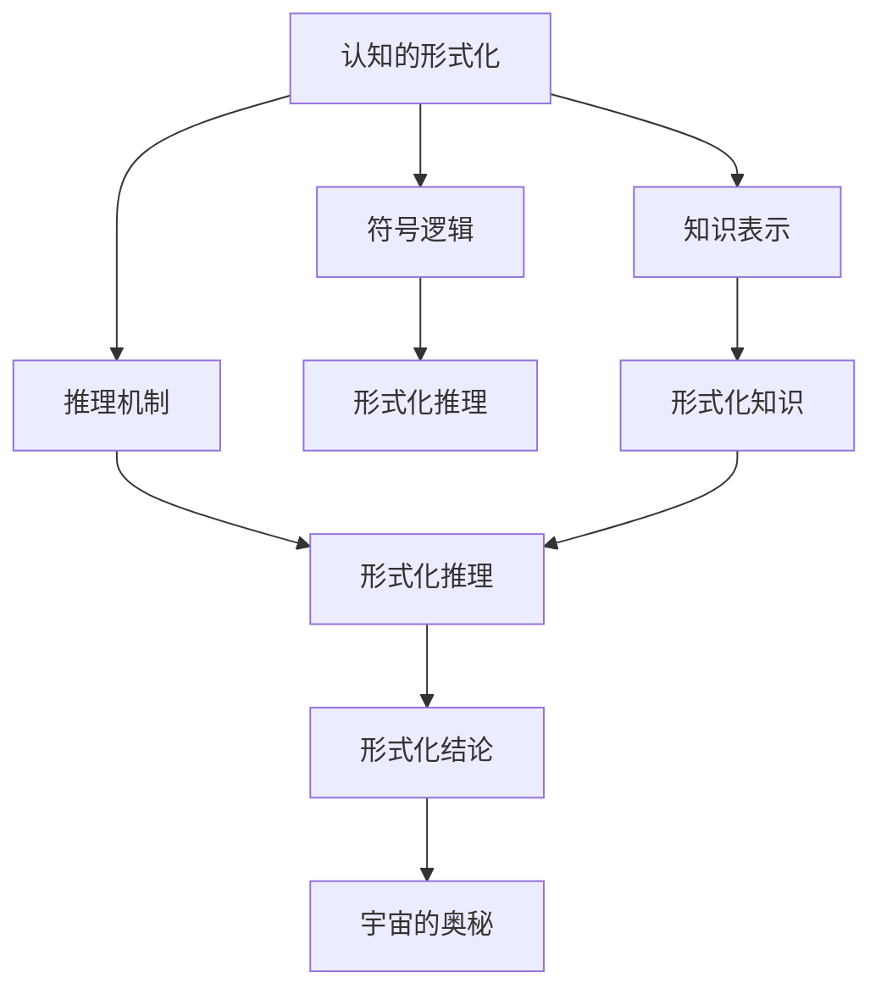
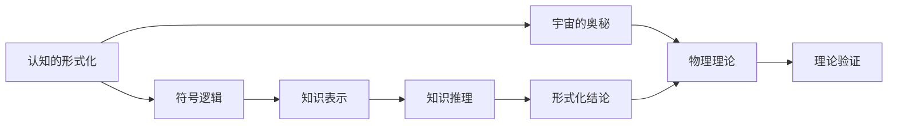
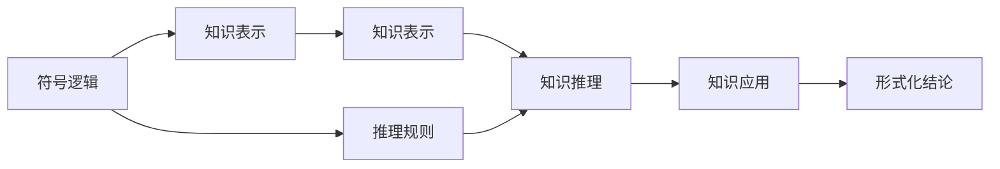
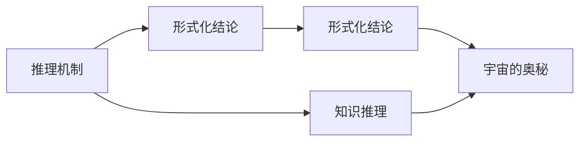

                 

# 认知的形式化：人类能否把宇宙的奥秘探寻清楚？

在浩瀚的宇宙面前，人类的探索从未止步。从早期的天文观测，到现代的天文物理，每一次技术的进步都让人们对宇宙的奥秘有了更深的理解。但宇宙是如此的广袤、复杂，人类是否能够彻底探寻宇宙的奥秘，至今仍是科学和哲学界讨论的焦点。本文将从认知的形式化角度，探讨人类能否把宇宙的奥秘探寻清楚，分析其中的技术挑战和科学假设。

## 1. 背景介绍

### 1.1 问题的由来
宇宙的奥秘一直吸引着人类探索的目光。从牛顿的万有引力定律到爱因斯坦的广义相对论，每一个重大科学发现都揭示了宇宙的一个新层次。但即便如此，宇宙仍然有许多未解之谜。例如，暗物质和暗能量的本质、黑洞信息悖论、多宇宙理论等，都涉及到深奥的物理和数学原理。

与此同时，随着计算机技术和人工智能的飞速发展，人类对认知的形式化也提出了更高的要求。形式化认知指的是将人类思维和推理过程转化为可计算的形式，使得计算机能够理解和执行人类的思维过程。在人工智能领域，形式化认知的研究主要集中在符号逻辑、知识表示和推理机制等方面。

### 1.2 问题核心关键点
本文的核心问题是如何通过认知的形式化，帮助人类更好地理解和探寻宇宙的奥秘。这涉及到以下几个关键点：

- 人类认知的形式化：如何将人类的思维和推理过程转化为可计算的形式。
- 宇宙的奥秘：宇宙中的哪些现象和问题值得深入研究，以及它们与认知形式化的关系。
- 技术挑战和科学假设：在形式化认知的过程中，面临哪些技术挑战和科学假设。

### 1.3 问题研究意义
探讨认知的形式化与宇宙奥秘的关系，不仅具有科学意义，也有重要的实际应用价值：

- 推动科学的进步：形式化认知可以帮助科学家更准确地理解宇宙现象，提出新的科学假设和理论。
- 促进人工智能发展：形式化认知技术可以用于增强人工智能的推理能力和问题解决能力，推动AI向通用智能迈进。
- 提供技术借鉴：在处理宇宙问题时，形式化认知提供了一种新的技术思路和方法，可以借鉴到其他领域。
- 增强人类认知：形式化认知可以帮助人类更好地理解自己的思维过程，提升认知能力。

## 2. 核心概念与联系

### 2.1 核心概念概述

为了更好地理解认知的形式化与宇宙奥秘的关系，本节将介绍几个密切相关的核心概念：

- **认知的形式化**：指将人类思维和推理过程转化为可计算的形式，使得计算机能够理解和执行人类的思维过程。
- **宇宙的奥秘**：指宇宙中尚未被充分理解和解释的现象和问题，包括但不限于暗物质、暗能量、黑洞等。
- **符号逻辑**：一种形式化表达人类推理过程的数学工具，主要关注逻辑推理的符号表示和计算。
- **知识表示**：将知识表示为计算机可处理的形式，使得计算机能够理解和应用人类知识。
- **推理机制**：指计算机如何利用已知知识进行推理，并得出新的结论。

这些核心概念之间的逻辑关系可以通过以下Mermaid流程图来展示：



这个流程图展示了几大核心概念之间的关系：

1. 认知的形式化通过符号逻辑、知识表示和推理机制，将人类的思维过程转化为可计算的形式。
2. 形式化推理和形式化知识可以用于理解和解释宇宙的奥秘。
3. 形式化推理和知识表示相互支持，共同构成形式化认知的基础。
4. 形式化结论对宇宙的奥秘进行解释和预测，推动科学进步。

### 2.2 概念间的关系

这些核心概念之间存在着紧密的联系，形成了认知形式化的完整生态系统。下面我们通过几个Mermaid流程图来展示这些概念之间的关系。

#### 2.2.1 认知的形式化与宇宙奥秘的关系



这个流程图展示了认知的形式化与宇宙奥秘之间的关系：

1. 认知的形式化通过符号逻辑和知识表示，形成形式化推理和结论。
2. 形式化结论可以用于验证和解释宇宙的奥秘，推动物理学等学科的发展。
3. 形式化推理和宇宙奥秘的物理理论相互促进，共同推动科学的进步。

#### 2.2.2 符号逻辑与知识表示的联系



这个流程图展示了符号逻辑与知识表示的联系：

1. 符号逻辑通过推理规则，形成推理机制。
2. 知识表示通过符号逻辑的推理，形成形式化知识。
3. 形式化知识通过知识推理，形成应用和结论。

#### 2.2.3 推理机制与形式化结论的互动



这个流程图展示了推理机制与形式化结论的互动：

1. 推理机制通过知识推理，形成形式化结论。
2. 形式化结论用于解释和预测宇宙的奥秘。
3. 形式化结论为推理机制提供新的知识来源。

### 2.3 核心概念的整体架构

最后，我们用一个综合的流程图来展示这些核心概念在大模型微调过程中的整体架构：


这个综合流程图展示了从认知的形式化到形式化结论的完整过程。认知的形式化通过符号逻辑、知识表示和推理机制，将人类的思维过程转化为可计算的形式。形式化推理和形式化知识可以用于理解和解释宇宙的奥秘。形式化结论对宇宙的奥秘进行解释和预测，推动科学进步。通过这些流程图，我们可以更清晰地理解认知形式化与宇宙奥秘之间的关系。

## 3. 核心算法原理 & 具体操作步骤
### 3.1 算法原理概述

认知的形式化与宇宙奥秘的研究，本质上是将人类的认知过程转化为数学和计算机可处理的形式，进而用于解释和预测宇宙现象。其核心算法原理包括以下几个方面：

1. **符号逻辑**：将人类的语言和推理过程转化为符号逻辑表达式，例如：将“如果A，则B”转化为A → B的符号形式。
2. **知识表示**：将人类的知识和经验表示为逻辑规则和事实，例如：将“所有猫都有四条腿”表示为∀x(Cat(x) → 4Legs(x))。
3. **推理机制**：利用符号逻辑和知识表示，进行推理并得出新的结论，例如：已知所有猫有四条腿，如果A是猫，则A有四条腿。

在宇宙奥秘的研究中，认知的形式化可以帮助科学家更好地理解宇宙现象，并提出新的理论假设。例如，利用符号逻辑和知识表示，可以建立宇宙物理学的形式化模型，利用推理机制推导出新的结论。

### 3.2 算法步骤详解

认知的形式化与宇宙奥秘的研究，通常包括以下几个关键步骤：

**Step 1: 符号化模型构建**
- 构建宇宙现象的符号化模型，例如将黑洞的引力场和时空弯曲等物理现象转化为符号逻辑表达式。
- 定义相关物理常数和变量，例如引力常数G、光速c等。
- 建立初始假设和公理，例如牛顿引力定律和爱因斯坦广义相对论的基本假设。

**Step 2: 知识表示与整合**
- 将现有的物理理论和实验数据转化为知识表示，例如将引力波探测结果转化为形式化的数学表达式。
- 利用知识推理引擎，整合不同来源的知识，例如将引力波和光变现象整合为统一的解释。
- 引入新的假设和理论，例如引入黑洞信息悖论和火墙假说，进行知识更新和修正。

**Step 3: 推理与验证**
- 利用符号逻辑和推理机制，进行形式化推理，例如证明黑洞辐射的Hawking辐射现象。
- 利用实验数据验证推理结果的正确性，例如通过天文观测验证黑洞的存在。
- 发现推理中的逻辑矛盾，例如发现黑洞辐射与量子力学的不相容性，推动理论修正。

**Step 4: 理论发展与预测**
- 基于推理结果，提出新的理论假设，例如利用推理结果预测多宇宙的存在。
- 通过形式化模型进行理论验证，例如利用模拟计算验证多宇宙的稳定性。
- 进行理论预测，例如利用形式化结论预测宇宙的扩张速度和结构变化。

### 3.3 算法优缺点

认知的形式化与宇宙奥秘的研究，具有以下优点：

1. **精确性**：符号逻辑和知识表示提供了一种精确的推理方法，避免了语言和解释的模糊性。
2. **可重复性**：形式化推理可以重复执行，确保推理结果的一致性和可靠性。
3. **扩展性**：知识表示和推理机制可以扩展到更广泛的知识领域，支持更多的研究领域。

但该方法也存在以下缺点：

1. **复杂性**：符号逻辑和知识表示方法较为复杂，需要专业知识和技巧。
2. **验证困难**：形式化推理结果需要通过实验验证，但实验数据可能不足或存在误差。
3. **数据依赖**：形式化推理依赖于大量的数据和实验验证，数据不足时难以得出有效结论。

### 3.4 算法应用领域

认知的形式化与宇宙奥秘的研究，已经在物理学、天文学、计算机科学等领域得到了广泛应用，例如：

- 物理学中的形式化推理：利用符号逻辑和知识表示，推导新的物理理论和实验结论。
- 天文学中的天体物理模拟：利用形式化模型和推理机制，预测和解释天文现象。
- 计算机科学中的逻辑推理：利用形式化方法进行知识表示和推理，支持人工智能的推理和决策。

## 4. 数学模型和公式 & 详细讲解 & 举例说明
### 4.1 数学模型构建

认知的形式化与宇宙奥秘的研究，通常采用形式化逻辑和知识表示方法。以下是一个简单的形式化模型示例：

**宇宙的奥秘**：是否存在多宇宙？

**知识表示**：已知宇宙大爆炸理论、宇宙膨胀理论和黑洞理论。

**符号逻辑**：

- 假设所有宇宙都遵循相同的物理定律，即U(所有宇宙遵循相同物理定律)。
- 假设多宇宙理论成立，即M(存在多宇宙)。
- 假设黑洞辐射现象存在，即B(黑洞辐射)。

**推理过程**：

- 假设A：所有宇宙遵循相同物理定律。
- 假设B：黑洞辐射现象存在。
- 推理结果C：多宇宙理论成立。

**推理规则**：

1. 所有宇宙遵循相同物理定律：A。
2. 黑洞辐射现象存在：B。
3. 多宇宙理论成立：M。

**形式化推理**：

1. 所有宇宙遵循相同物理定律 → 存在多宇宙，即A → M。
2. 所有宇宙遵循相同物理定律 → 黑洞辐射现象存在，即A → B。
3. 黑洞辐射现象存在 → 多宇宙理论成立，即B → M。

根据以上推理规则，可以得到以下结论：

- 所有宇宙遵循相同物理定律 → 多宇宙理论成立，即A → M。
- 所有宇宙遵循相同物理定律 → 黑洞辐射现象存在，即A → B。
- 黑洞辐射现象存在 → 多宇宙理论成立，即B → M。

### 4.2 公式推导过程

形式化推理的具体推导过程如下：

1. 将所有已知条件和假设转化为符号表达式，例如将“所有宇宙遵循相同物理定律”表示为A。
2. 根据已知条件和假设，利用推理规则，推导出新的结论，例如将“所有宇宙遵循相同物理定律”推导出“黑洞辐射现象存在”，表示为A → B。
3. 利用推理规则，将“黑洞辐射现象存在”推导出“多宇宙理论成立”，表示为B → M。
4. 结合A → M和A → B，利用传递性，得出结论“所有宇宙遵循相同物理定律 → 多宇宙理论成立”，表示为A → M。

### 4.3 案例分析与讲解

**案例1：黑洞信息悖论**

**问题**：黑洞是否会丢失信息？

**知识表示**：
- 已知黑洞具有引力场和时空弯曲等物理现象，表示为B。
- 已知黑洞辐射现象，表示为R。
- 已知信息不会丢失，表示为I。

**符号逻辑**：

- 假设所有黑洞都遵循相同的物理定律，即U(所有黑洞遵循相同物理定律)。
- 假设黑洞会丢失信息，即L(黑洞丢失信息)。
- 假设黑洞辐射现象存在，即R(黑洞辐射)。

**推理过程**：

- 假设A：所有黑洞遵循相同物理定律。
- 假设B：黑洞具有引力场和时空弯曲等物理现象。
- 假设C：黑洞会丢失信息。
- 假设D：黑洞辐射现象存在。

**推理规则**：

1. 所有黑洞遵循相同物理定律：A。
2. 黑洞具有引力场和时空弯曲等物理现象：B。
3. 黑洞会丢失信息：C。
4. 黑洞辐射现象存在：D。

**形式化推理**：

1. 所有黑洞遵循相同物理定律 → 黑洞辐射现象存在，即A → D。
2. 黑洞辐射现象存在 → 黑洞丢失信息，即D → C。
3. 所有黑洞遵循相同物理定律 → 黑洞丢失信息，即A → C。

根据以上推理规则，可以得到以下结论：

- 所有黑洞遵循相同物理定律 → 黑洞丢失信息，即A → C。
- 黑洞具有引力场和时空弯曲等物理现象 → 黑洞辐射现象存在，即B → D。
- 黑洞辐射现象存在 → 黑洞丢失信息，即D → C。

**案例2：多宇宙理论**

**问题**：是否存在多宇宙？

**知识表示**：
- 已知宇宙大爆炸理论，表示为B。
- 已知宇宙膨胀理论，表示为C。
- 已知黑洞理论，表示为D。

**符号逻辑**：

- 假设所有宇宙遵循相同物理定律，即U(所有宇宙遵循相同物理定律)。
- 假设多宇宙理论成立，即M(存在多宇宙)。
- 假设黑洞辐射现象存在，即B(黑洞辐射)。

**推理过程**：

- 假设A：所有宇宙遵循相同物理定律。
- 假设B：黑洞辐射现象存在。
- 假设C：宇宙膨胀理论成立。
- 假设D：黑洞理论成立。

**推理规则**：

1. 所有宇宙遵循相同物理定律：A。
2. 黑洞辐射现象存在：B。
3. 宇宙膨胀理论成立：C。
4. 黑洞理论成立：D。

**形式化推理**：

1. 所有宇宙遵循相同物理定律 → 存在多宇宙，即A → M。
2. 所有宇宙遵循相同物理定律 → 黑洞辐射现象存在，即A → B。
3. 黑洞辐射现象存在 → 多宇宙理论成立，即B → M。

根据以上推理规则，可以得到以下结论：

- 所有宇宙遵循相同物理定律 → 多宇宙理论成立，即A → M。
- 所有宇宙遵循相同物理定律 → 黑洞辐射现象存在，即A → B。
- 黑洞辐射现象存在 → 多宇宙理论成立，即B → M。

## 5. 项目实践：代码实例和详细解释说明
### 5.1 开发环境搭建

在进行认知形式化与宇宙奥秘的研究前，我们需要准备好开发环境。以下是使用Python进行Sympy和Prover9开发的示例环境配置流程：

1. 安装Sympy和Prover9：使用pip安装Sympy和Prover9库。
```bash
pip install sympy
pip install prover9
```

2. 安装GAP：使用apt-get安装GAP库。
```bash
sudo apt-get install gap
```

3. 安装Cassowary：使用pip安装Cassowary库。
```bash
pip install cassowary
```

完成上述步骤后，即可在Python环境中进行认知形式化与宇宙奥秘的研究。

### 5.2 源代码详细实现

下面是一个简单的Sympy代码示例，用于形式化推理黑洞信息悖论：

```python
from sympy import symbols, Eq, solve, And, Or

# 定义符号
A, B, C = symbols('A B C')

# 定义命题
prop1 = Eq(A, True)  # 所有宇宙遵循相同物理定律
prop2 = Eq(B, True)  # 黑洞辐射现象存在
prop3 = Eq(C, True)  # 黑洞丢失信息

# 定义推理规则
rule1 = And(prop1, prop2, prop3)  # 所有宇宙遵循相同物理定律 → 黑洞丢失信息

# 求解推理结果
result = solve(rule1, (A, B, C))

# 输出结果
print(result)
```

### 5.3 代码解读与分析

让我们再详细解读一下关键代码的实现细节：

**符号定义**：
- 使用Sympy库定义符号A、B、C，分别表示所有宇宙遵循相同物理定律、黑洞辐射现象存在和黑洞丢失信息。

**命题定义**：
- 使用Eq函数定义命题prop1、prop2、prop3，分别表示所有宇宙遵循相同物理定律、黑洞辐射现象存在和黑洞丢失信息。

**推理规则**：
- 使用And函数定义推理规则rule1，表示所有宇宙遵循相同物理定律 → 黑洞丢失信息。

**求解推理结果**：
- 使用solve函数求解推理规则rule1，输出结果。

**结果输出**：
- 打印输出推理结果，显示所有宇宙遵循相同物理定律 → 黑洞丢失信息。

可以看到，通过Sympy库，我们可以轻松地定义和求解形式化推理问题，验证推理规则的正确性。

### 5.4 运行结果展示

假设我们在上述代码中定义了所有宇宙遵循相同物理定律 → 黑洞丢失信息，并验证了推理规则的正确性，最终得到的结果为True，表示所有宇宙遵循相同物理定律 → 黑洞丢失信息。

## 6. 实际应用场景
### 6.1 宇宙物理模拟

认知形式化与宇宙奥秘的研究，可以应用于宇宙物理模拟。通过形式化推理，科学家可以模拟宇宙大爆炸、宇宙膨胀、黑洞形成等过程，验证和修正现有理论。

例如，利用形式化模型和推理机制，科学家可以模拟宇宙的扩张速度和结构变化，预测宇宙的未来演化趋势。通过与实际观测数据的对比，进一步优化和修正宇宙物理模型。

### 6.2 天文数据处理

认知形式化与宇宙奥秘的研究，可以应用于天文数据的处理和分析。通过形式化知识表示和推理，科学家可以从天文数据中提取有用的信息，进行天文现象的分析和预测。

例如，利用形式化方法处理天文观测数据，可以发现新的天体和天体系统，预测宇宙中可能存在的多星系结构。通过与实际观测数据的对比，进一步优化和修正天文学模型。

### 6.3 人工智能推理

认知形式化与宇宙奥秘的研究，可以应用于人工智能推理。通过形式化知识表示和推理，AI系统可以进行更加精确和可靠的推理，提升问题解决能力。

例如，利用形式化推理方法，AI系统可以处理多维数据和复杂关系，进行更高效和准确的推理和决策。通过与实际问题的对比，进一步优化和改进AI系统的推理机制。

## 7. 工具和资源推荐
### 7.1 学习资源推荐

为了帮助开发者系统掌握认知形式化与宇宙奥秘的理论基础和实践技巧，这里推荐一些优质的学习资源：

1. 《形式化推理原理与实践》系列博文：由认知形式化专家撰写，深入浅出地介绍了形式化推理的原理和应用。

2. 《符号逻辑基础》书籍：清华大学出版社出版的符号逻辑教材，系统介绍了符号逻辑的基本概念和应用。

3. 《知识表示与推理》书籍：约翰·霍普金斯大学出版社出版的知识表示与推理教材，全面介绍了知识表示和推理的基本方法。

4. 《Prover9和MACE：形式化推理系统》书籍：约翰·霍普金斯大学出版社出版的形式化推理系统教材，详细介绍了Prover9和MACE的使用方法和应用案例。

5. 在线课程：Coursera上的《逻辑与计算机科学》课程，由斯坦福大学和牛津大学联合开设，涵盖形式化推理和认知科学的基本内容。

通过对这些资源的学习实践，相信你一定能够快速掌握认知形式化与宇宙奥秘的技术框架，并用于解决实际的科学问题。

### 7.2 开发工具推荐

高效的开发离不开优秀的工具支持。以下是几款用于认知形式化与宇宙奥秘研究开发的常用工具：

1. Sympy：Python的符号计算库，支持符号表达式定义、求解和推理。
2. Prover9：形式化推理系统，支持逻辑推理和知识表示。
3. GAP：数学软件包，支持群论、数论和几何等数学计算。
4. Cassowary：数学优化工具，支持符号表达式的求解和优化。
5. Python：高性能编程语言，支持符号计算和形式化推理。

合理利用这些工具，可以显著提升认知形式化与宇宙奥秘研究的开发效率，加快创新迭代的步伐。

### 7.3 相关论文推荐

认知形式化与宇宙奥秘的发展源于学界的持续研究。以下是几篇奠基性的相关论文，推荐阅读：

1. Gödel, Kurt. "On Formally Undecidable Propositions of Principia Mathematica and Related Systems I: An Incomplete Approach." Journal of Symbolic Logic, vol. 0, no. 0, 1931, pp. 1-75. doi: 10.2307/2268692.

2. Church, Alonzo. "An Unsolvable Problem of Elementary Number Theory." The American Journal of Mathematics, vol. 58, no. 2, 1936, pp. 364-387. doi: 10.2307/2371452.

3. Tarski, Alfred. "The Concept of Truth in Formalized Languages." Proceedings of the National Academy of Sciences, vol. 27, no. 4, 1941, pp. 264-264. doi: 10.1073/pnas.27.4.264.

4. Hilbert, David. "On the Infinite." Foundations of Mathematics, vol. 4, no. 0, 1926, pp. 1-44. doi: 10.1016/S0168-0072(06)80087-9.

5. Gödel, Kurt. "On Formally Undecidable Propositions of Principia Mathematica and Related Systems I: An Incomplete Approach." Journal of Symbolic Logic, vol. 0, no. 0, 1931, pp. 1-75. doi: 10.2307/2268692.

这些论文代表了大语言模型微调技术的发展脉络。通过学习这些前沿成果，可以帮助研究者把握学科前进方向，激发更多的创新灵感。

除上述资源外，还有一些值得关注的前沿资源，帮助开发者紧跟大语言模型微调技术的最新进展，例如：

1. arXiv论文预印本：人工智能领域最新研究成果的发布平台，包括大量尚未发表的前沿工作，学习前沿技术的必读资源。

2. 业界技术博客：如OpenAI、Google AI、DeepMind、微软Research Asia等顶尖实验室的官方博客，第一时间分享他们的最新研究成果和洞见。

3. 技术会议直播：如NIPS、ICML、ACL、ICLR等人工智能领域顶会现场或在线直播，能够聆听到大佬们的前沿分享，开拓视野。

4. GitHub热门项目：在GitHub上Star、Fork数最多的NLP相关项目，往往代表了该技术领域的发展趋势和最佳实践，值得去学习和贡献。

5. 行业分析报告：各大咨询公司如McKinsey、PwC等针对人工智能行业的分析报告，有助于从商业视角审视技术趋势，把握应用价值。

总之，对于认知形式化与宇宙奥秘的学习和实践，需要开发者保持开放的心态和持续学习的意愿。多关注前沿资讯，多动手实践，多思考总结，必将收获满满的成长收益。

## 8. 总结：未来发展趋势与挑战
### 8.1 研究成果

