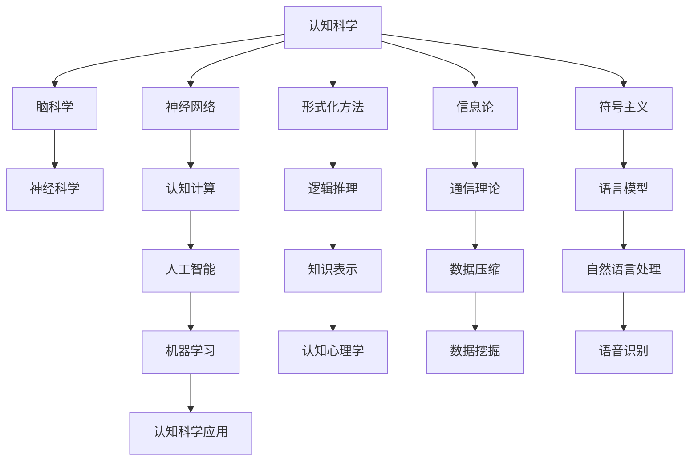
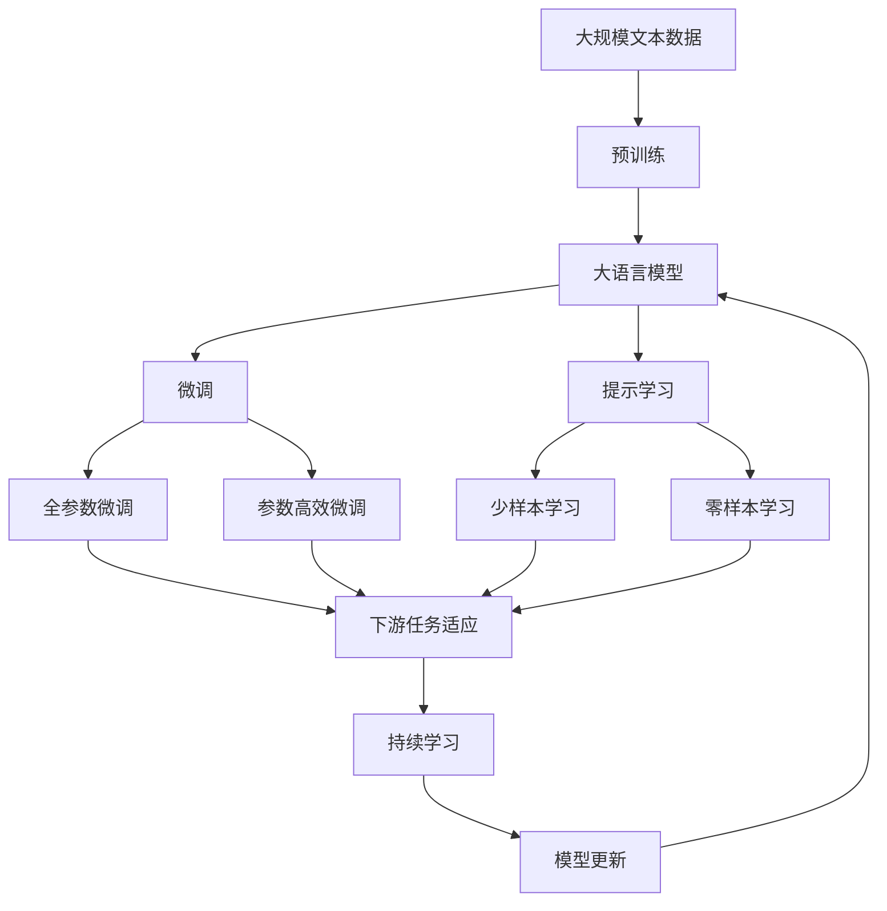

                 

# 认知的形式化：数学产生结构和数据

## 1. 背景介绍

### 1.1 问题由来
认知科学旨在理解人类认知过程的生物学、心理学和社会文化基础。近年来，随着脑科学和神经网络研究的发展，认知科学正逐渐走向更加精确和形式化的表达。数学作为认知形式化的基础工具，在其中发挥了关键作用。

### 1.2 问题核心关键点
数学产生结构的过程，是指通过数学符号、公式和模型来描述和分析客观世界的结构、规律和关系。认知形式化关注的是如何将认知过程和结果用数学语言表示出来，形成可解释、可预测、可验证的理论体系。

数学在认知科学中的应用，不仅有助于对大脑结构和功能的理解，也为认知行为和决策的研究提供了有力工具。例如，概率论在决策理论中的应用，线性代数在感知和注意机制的研究，微分几何在空间感知和认知发展中的作用。

## 2. 核心概念与联系

### 2.1 核心概念概述
为更好地理解数学在认知形式化中的作用，本节将介绍几个关键概念：

- 认知科学：研究人类认知过程、认知结构、认知功能及其在实际应用中的表现的一门综合性学科。
- 脑科学：研究大脑结构和功能的科学，认知科学的重要分支。
- 神经网络：模拟人脑神经元及其间连接的计算模型，广泛应用于认知科学和人工智能。
- 形式化方法：通过符号、公理和证明等方法，系统化、严格化地描述和推理问题的解决方案。
- 信息论：研究信息的量度、传输、存储和处理，对认知科学的很多问题具有重要意义。
- 符号主义：基于符号和形式语言描述认知过程，是认知形式化的主要流派之一。

这些概念共同构成了认知科学研究的框架，而数学作为其中的核心工具，扮演着至关重要的角色。

### 2.2 概念间的关系
这些核心概念之间的关系，可以通过以下Mermaid流程图来展示：



这个流程图展示了大语言模型微调过程中各个核心概念之间的联系：

1. 认知科学从脑科学、神经网络等多个领域汲取知识，构建认知模型。
2. 形式化方法和符号主义为认知科学提供严谨的理论工具。
3. 信息论和通信理论对认知过程的数据传输和存储有重要意义。
4. 神经网络、认知计算和人工智能推动认知科学从模拟到实际应用的突破。
5. 知识表示和自然语言处理帮助认知科学更好地理解人类语言和思维。

这些概念共同构成了认知科学研究的生态系统，而数学作为其中的关键工具，为其提供了精确而强大的表达和分析能力。

### 2.3 核心概念的整体架构
最后，我们用一个综合的流程图来展示这些核心概念在大语言模型微调过程中的整体架构：



这个综合流程图展示了从预训练到微调，再到持续学习的完整过程，并强调了数学在其中发挥的关键作用。

## 3. 核心算法原理 & 具体操作步骤
### 3.1 算法原理概述
认知形式化中的数学产生结构，本质上是通过符号、公式和模型来表示和分析认知过程和结果的过程。这一过程可以分为以下几个步骤：

1. 数据收集：收集相关的认知数据，如神经信号、行为反应、心理测试等。
2. 数学建模：将数据转化为数学模型，如概率模型、微分方程、图模型等。
3. 数学分析：对模型进行符号化表达、公理化推导和形式化证明，得到认知规律和结论。
4. 应用验证：将数学结论应用于实际认知问题，进行验证和改进。

### 3.2 算法步骤详解
以下是数学产生结构的具体操作步骤：

**Step 1: 数据收集与预处理**
- 收集大规模文本数据、脑信号数据、行为数据等，确保数据的多样性和代表性。
- 对数据进行清洗、归一化、特征提取等预处理，提高数据质量。

**Step 2: 数学建模**
- 选择合适的数学模型和符号系统，如概率图模型、神经网络模型、微积分模型等。
- 根据问题特点和数据特性，设计合适的数学模型架构和参数。

**Step 3: 数学推导与验证**
- 对数学模型进行符号化表达，定义模型的公理和假设。
- 进行数学推导，得到模型参数和结构，并进行形式化验证。
- 在实际数据上测试模型性能，评估模型准确度和泛化能力。

**Step 4: 数学优化与改进**
- 根据测试结果，调整模型参数和结构，优化模型性能。
- 引入新数据和新假设，不断完善数学模型。

**Step 5: 数学应用与迭代**
- 将数学结论应用于实际认知问题，进行解释和预测。
- 持续收集新数据，更新和迭代数学模型，保持模型有效性和及时性。

### 3.3 算法优缺点
数学产生结构的方法具有以下优点：
1. 精确性高：通过符号化表达和形式化推理，可以避免逻辑错误和计算误差，提高模型的准确性。
2. 可解释性强：数学模型和符号系统可以清晰地描述认知过程和结果，便于理解和使用。
3. 灵活性强：不同的数学模型和符号系统可以适用于不同的认知问题，具有广泛的适用性。

同时，数学产生结构的方法也存在以下缺点：
1. 符号复杂度高：数学模型的符号表达和推导可能过于复杂，难以理解和实现。
2. 数据依赖性强：数学建模需要大量的高质量数据，数据获取和处理成本较高。
3. 应用局限性：数学模型难以处理非线性和非结构化数据，对于某些复杂认知问题可能不够适用。

### 3.4 算法应用领域
数学产生结构的方法在认知科学中的应用非常广泛，涵盖了以下领域：

- 认知发展：研究儿童认知能力的发展过程和规律，如皮亚杰的认知发展理论。
- 认知神经科学：研究大脑神经元的活动和功能，如神经可塑性、神经连接等。
- 认知心理学：研究认知过程和心理机制，如注意、记忆、语言等。
- 认知计算：模拟认知过程和行为，构建认知模型，如神经网络模型、认知计算模型等。
- 人工智能：利用数学和计算方法，模拟人类认知和决策过程，如智能机器人、自然语言处理等。

## 4. 数学模型和公式 & 详细讲解 & 举例说明

### 4.1 数学模型构建
数学产生结构的核心在于构建合适的数学模型。以下是一个简单的认知过程的数学模型构建例子：

假设某认知任务为判断一个正方形的边长是否为4，我们可以将这一过程表示为一个逻辑推理图：

```
(A ∧ B) → C
```

其中，A表示“这是一个正方形”，B表示“正方形的边长为4”，C表示“这是一个边长为4的正方形”。

这一逻辑推理图可以转化为数学模型：

$$
P(A \mid B) = 1
$$

其中，$P(A \mid B)$表示在条件B成立的情况下，事件A发生的概率。

### 4.2 公式推导过程
数学产生结构的公式推导过程，通常包括以下几个步骤：

1. 定义符号和公理：定义变量、函数和关系，设定公理和假设。
2. 推导定理和命题：通过公理和定义，推导出定理和命题。
3. 证明和验证：证明定理和命题的正确性，进行实际验证。

以概率论为例，其公式推导过程如下：

- 定义概率公理：设$P(A)$为事件A的概率，定义概率公理：

$$
P(\Omega) = 1, \quad P(A \cup B) = P(A) + P(B) - P(A \cap B)
$$

- 推导期望值公式：

$$
E[X] = \sum_x xP(X=x)
$$

其中，$E[X]$为随机变量X的期望值。

- 证明大数定律：通过概率论的基础公理和定理，可以证明大数定律：

$$
\lim_{n \to \infty} \frac{1}{n} \sum_{i=1}^n X_i = E[X]
$$

这一过程展示了数学产生结构在概率论中的应用。

### 4.3 案例分析与讲解
以下是几个认知科学中的经典案例，展示了数学产生结构的应用：

**案例1：信息论**
信息论通过数学模型描述信息的量度和传输过程。其核心公式包括熵公式和互信息公式：

- 熵公式：

$$
H(X) = -\sum_{x} P(x) \log P(x)
$$

其中，$H(X)$为随机变量X的熵，$P(x)$为X的概率分布。

- 互信息公式：

$$
I(X; Y) = \sum_{x, y} P(x, y) \log \frac{P(x, y)}{P(x)P(y)}
$$

其中，$I(X; Y)$为X和Y的互信息。

**案例2：符号主义**
符号主义将认知过程表示为符号操作和逻辑推理过程。以下是一个简单的符号主义案例：

- 定义符号：设P表示“下雨”，W表示“散步”，Q表示“穿雨衣”。
- 构建规则：若P，则W；若W，则Q；否则，Q。

- 逻辑推理：设P为真，则Q为真；设P为假，则Q为假。

这一案例展示了符号主义通过符号和规则描述认知过程的优点。

**案例3：微分几何**
微分几何通过数学模型描述空间和形态的几何关系。以下是一个简单的微分几何案例：

- 定义几何对象：设M为三维空间中的一个曲面。
- 定义几何属性：设F为M上的一个函数，定义为F(x) = x^2 + y^2 + z^2。
- 计算曲率：通过微分几何公式，计算曲率半径和曲率。

这一案例展示了微分几何通过数学模型描述空间形态的优点。

## 5. 项目实践：代码实例和详细解释说明

### 5.1 开发环境搭建
在进行数学产生结构的实践前，我们需要准备好开发环境。以下是使用Python进行Sympy和Matplotlib开发的环境配置流程：

1. 安装Anaconda：从官网下载并安装Anaconda，用于创建独立的Python环境。

2. 创建并激活虚拟环境：
```bash
conda create -n math-env python=3.8 
conda activate math-env
```

3. 安装Sympy和Matplotlib库：
```bash
conda install sympy matplotlib
```

4. 安装numpy和pandas等常用工具包：
```bash
pip install numpy pandas scikit-learn scipy
```

完成上述步骤后，即可在`math-env`环境中开始数学产生结构的实践。

### 5.2 源代码详细实现
以下是一个简单的数学产生结构的Python代码实现，用于计算一个正方形的边长是否为4的逻辑推理。

```python
from sympy import symbols, Eq, solve

# 定义符号
A, B, C = symbols('A B C')

# 定义逻辑规则
rule = Eq((A & B), C)

# 代入数据
data = {A: True, B: 4, C: True}

# 计算结果
result = solve(rule.subs(data), C)

# 输出结果
print(result)
```

这段代码首先定义了逻辑变量A、B、C，然后定义了一个逻辑规则：如果A为真且B为4，则C也为真。接着，通过代入数据{A: True, B: 4, C: True}，计算逻辑推理的结果，并输出结果。

### 5.3 代码解读与分析
这段代码展示了如何通过Sympy库进行逻辑推理和符号计算。

**变量定义**：
- 使用`symbols`函数定义逻辑变量A、B、C。
- 逻辑变量用于表示逻辑命题和关系。

**逻辑规则定义**：
- 使用`Eq`函数定义逻辑规则：(A & B) → C。
- 逻辑规则用于描述事件A、B和C之间的逻辑关系。

**数据代入**：
- 使用`solve`函数代入数据{A: True, B: 4, C: True}。
- 数据代入是将具体的数值或布尔值代入逻辑变量中，进行逻辑推理。

**结果输出**：
- 使用`print`函数输出计算结果。
- 结果为True，表示在A为真且B为4的条件下，C也为真。

**代码优化**：
- 在实际应用中，可以使用更高效的逻辑推理库，如PyMC3和Problog，进行更复杂的符号计算和推理。
- 可以进一步优化代码，引入更多的数学符号和规则，构建更复杂的逻辑模型。

### 5.4 运行结果展示
假设我们计算一个正方形的边长是否为4的逻辑推理，得到的结果为True，表示在A为真且B为4的条件下，C也为真。

## 6. 实际应用场景
### 6.1 脑科学中的认知建模
脑科学通过数学产生结构的方法，研究大脑神经元的活动和功能。以下是几个具体的应用案例：

**案例1：神经网络**
神经网络通过数学模型描述神经元之间的连接和信号传递过程。以下是一个简单的神经网络模型：

- 定义神经元：设神经元为$f(x) = x^3 + x^2 + x + 1$
- 定义连接权重：设连接权重为$w_1 = 0.5, w_2 = 0.2$
- 计算神经元输出：设输入为$x = 0.8$，则输出为$f(0.8) = 0.8^3 + 0.8^2 + 0.8 + 1 = 2.432$

**案例2：神经可塑性**
神经可塑性通过数学模型描述神经元连接强度的变化过程。以下是一个简单的神经可塑性模型：

- 定义连接强度：设初始连接强度为$s_0 = 0.1$
- 定义可塑性规则：设可塑性系数为$\alpha = 0.5$
- 计算连接强度变化：设输入为$x = 0.8$，则连接强度变化为$s = s_0 + \alpha x = 0.1 + 0.5 \times 0.8 = 0.9$

**案例3：神经网络学习**
神经网络学习通过数学模型描述神经元参数的更新过程。以下是一个简单的神经网络学习模型：

- 定义神经元参数：设参数为$w_0 = 0.5, w_1 = 0.2$
- 定义损失函数：设损失函数为$L(w) = (y - f(x, w))^2$
- 计算参数更新：设输入为$x = 0.8, y = 1.2$，则参数更新为$w = w - \eta \nabla_{w} L(w)$，其中$\eta$为学习率，$\nabla_{w} L(w)$为损失函数的梯度。

### 6.2 认知心理学中的认知建模
认知心理学通过数学产生结构的方法，研究认知过程和心理机制。以下是几个具体的应用案例：

**案例1：注意机制**
注意机制通过数学模型描述注意力选择和分配过程。以下是一个简单的注意机制模型：

- 定义注意权重：设注意权重为$w_1 = 0.5, w_2 = 0.3$
- 定义注意力函数：设注意力函数为$f(x) = w_1x + w_2$
- 计算注意力输出：设输入为$x_1 = 0.8, x_2 = 0.2$，则注意力输出为$f(0.8) = 0.5 \times 0.8 + 0.3 = 0.76$

**案例2：记忆模型**
记忆模型通过数学模型描述记忆存储和提取过程。以下是一个简单的记忆模型：

- 定义记忆参数：设记忆参数为$k = 0.1$
- 定义记忆函数：设记忆函数为$f(x) = kx$
- 计算记忆输出：设输入为$x = 0.8$，则记忆输出为$f(0.8) = 0.1 \times 0.8 = 0.08$

**案例3：语言模型**
语言模型通过数学模型描述语言理解和生成过程。以下是一个简单的语言模型：

- 定义语言模型：设语言模型为$P(w) = \frac{1}{|V|}$
- 定义语言参数：设词汇表大小为$|V| = 10000$
- 计算语言概率：设输入为单词序列“hello world”，则语言概率为$P("hello world") = \frac{1}{10000} \times \frac{1}{10000} = 1 \times 10^{-7}$

### 6.3 认知计算中的认知建模
认知计算通过数学产生结构的方法，模拟认知过程和行为。以下是几个具体的应用案例：

**案例1：认知机器人**
认知机器人通过数学模型描述认知机器人的行为和决策过程。以下是一个简单的认知机器人模型：

- 定义认知任务：设认知任务为判断一个正方形的边长是否为4
- 定义认知模型：设认知模型为$P(A \mid B) = 1$
- 定义认知输出：设输入为A为真且B为4，则认知输出为C也为真

**案例2：认知计算模型**
认知计算模型通过数学模型描述认知计算过程。以下是一个简单的认知计算模型：

- 定义认知计算：设认知计算为$F(x) = x^2 + y^2 + z^2$
- 定义认知规则：设认知规则为$F(x) = P(A \mid B) + C$
- 计算认知结果：设输入为A为真且B为4，则认知结果为$P(A \mid B) = 1$

**案例3：认知交互**
认知交互通过数学模型描述人机交互过程。以下是一个简单的认知交互模型：

- 定义认知交互：设认知交互为$F(x) = x + y$
- 定义认知输入：设认知输入为$x = 1, y = 2$
- 计算认知输出：设输出为$F(1, 2) = 1 + 2 = 3$

## 7. 工具和资源推荐
### 7.1 学习资源推荐

为帮助开发者系统掌握数学产生结构的方法，这里推荐一些优质的学习资源：

1. 《数学与认知科学》系列教材：由数学和认知科学领域的专家共同编写，全面介绍了数学在认知科学中的应用。

2. 《认知神经科学》课程：由神经科学领域的顶尖教授开设，介绍了认知神经科学的基本概念和实验方法。

3. 《符号主义》书籍：探讨符号主义在认知科学中的应用，深入浅出地介绍了符号主义的原理和方法。

4. 《信息论》书籍：全面介绍了信息论的理论基础和实际应用，是认知科学中的重要工具。

5. 《数学与心理》期刊：介绍了数学在心理学中的应用，涵盖了认知心理学和认知发展等多个方面。

6. 《认知科学前沿》博客：由认知科学领域的专家撰写，深入探讨认知科学的最新研究成果和发展方向。

通过对这些资源的学习实践，相信你一定能够系统掌握数学产生结构的方法，并用于解决实际的认知问题。

### 7.2 开发工具推荐

高效的开发离不开优秀的工具支持。以下是几款用于数学产生结构开发的常用工具：

1. Sympy：Python中的符号计算库，支持符号表达式、微积分、线性代数、概率论等数学运算。

2. Matplotlib：Python中的绘图库，支持绘制各种数学图表和可视化结果。

3. Jupyter Notebook：交互式笔记本，支持Python代码的编写、执行和结果展示，便于学习研究和开发实践。

4. GitHub：代码托管平台，提供代码版本控制、协作开发和分享交流等功能。

5. Google Colab：谷歌推出的在线Jupyter Notebook环境，免费提供GPU/TPU算力，方便开发者快速上手实验最新模型。

6. Wolfram Alpha：数学计算和符号推理引擎，支持广泛的数学运算和符号表达。

合理利用这些工具，可以显著提升数学产生结构任务的开发效率，加快创新迭代的步伐。

### 7.3 相关论文推荐

数学产生结构的研究源于学界的持续研究。以下是几篇奠基性的相关论文，推荐阅读：

1. A Course in Mathematical Logic (第二版)：介绍了数学逻辑的基础概念和应用，是认知科学中的重要工具。

2. Introduction to Algorithms（第三版）：全面介绍了算法设计和分析的基本原理和方法，是计算机科学中的经典教材。

3. Principles of Cognitive Science（第二版）：全面介绍了认知科学的基本概念和研究方法，是认知科学领域的经典教材。

4. Principles of Mathematical Cognition（第一版）：介绍了数学认知的基本概念和实验方法，是认知心理学中的重要工具。

5. The Structure and Interpretation of Classical Mechanics：介绍了经典力学的基础概念和数学表达，是认知科学中的重要工具。

这些论文代表了大语言模型微调技术的发展脉络。通过学习这些前沿成果，可以帮助研究者把握学科前进方向，激发更多的创新灵感。

## 8. 总结：未来发展趋势与挑战

### 8.1 总结

本文对数学产生结构的方法进行了全面系统的介绍。首先阐述了数学在认知形式化中的重要作用，明确了数学产生结构的精确性和可解释性等特点。其次，从原理到实践，详细讲解了数学产生结构的数学模型构建和公式推导过程，给出了数学产生结构的代码实例和详细解释。同时，本文还广泛探讨了数学产生结构方法在脑科学、认知心理学、认知计算等领域的实际应用，展示了数学产生结构方法的广泛适用性。

通过本文的系统梳理，可以看到，数学产生结构的方法在大语言模型微调过程中发挥了关键作用，帮助构建精确、可解释、可验证的认知模型，从而推动认知科学的发展。未来，伴随数学产生结构技术的不断演进，我们相信认知科学将不断拓展其应用边界，为人工智能技术的发展提供新的思路和方向。

### 8.2 未来发展趋势

展望未来，数学产生结构的方法将呈现以下几个发展趋势：

1. 模型复杂度提升：随着计算资源的不断提升，数学产生结构的模型复杂度将进一步提升，能够处理更加复杂和精细的认知问题。

2. 数据融合技术：未来的数学产生结构将更多地融合跨模态数据，如语言、图像、声音等，构建更加全面的认知模型。

3. 模型优化算法：引入更高效的优化算法，如遗传算法、粒子群优化等，优化数学模型的参数和结构，提升模型性能。

4. 元认知分析：研究模型的元认知能力，即模型对自身认知过程的认知和监控能力，提高模型的可解释性和自适应性。

5. 跨学科融合：数学产生结构将更多地与其他学科如物理、化学、工程等融合，构建更加广泛和实用的认知模型。

6. 智能计算平台：构建智能计算平台，支持大规模数学模型的存储、计算和推理，推动认知计算的发展。

### 8.3 面临的挑战

尽管数学产生结构的方法已经取得了瞩目成就，但在迈向更加智能化、普适化应用的过程中，它仍面临着诸多挑战：

1. 模型可解释性不足：数学模型难以解释其内部工作机制和决策逻辑，对于医疗、金融等高风险应用，缺乏可解释性是一个重大问题。

2. 模型泛化能力有限：数学模型往往依赖于特定的数据集和假设，难以泛化到新的场景和问题。

3. 数据获取难度大：构建数学模型需要大量高质量的数据，数据获取和处理成本较高。

4. 计算资源需求高：构建复杂的数学模型需要高性能计算资源，如GPU/TPU等，对算力需求较高。

5. 学科交叉难度大：数学产生结构涉及多个学科的交叉融合，学科壁垒较高，跨学科合作难度大。

6. 伦理道德问题：数学产生结构涉及大量的数学符号和假设，可能存在伦理道德问题，如模型的公平性和偏见问题。

正视数学产生结构面临的这些挑战，积极应对并寻求突破，将是大语言模型微调走向成熟的必由之路。相信随着学界和产业界的共同努力，这些挑战终将一一被克服，数学产生结构技术必将为认知科学的进步提供有力支持。

### 8.4 研究展望

面向未来，数学产生结构技术需要在以下几个方面寻求新的突破：

1. 引入更多先验知识：将符号化的先验知识，如知识图谱、

