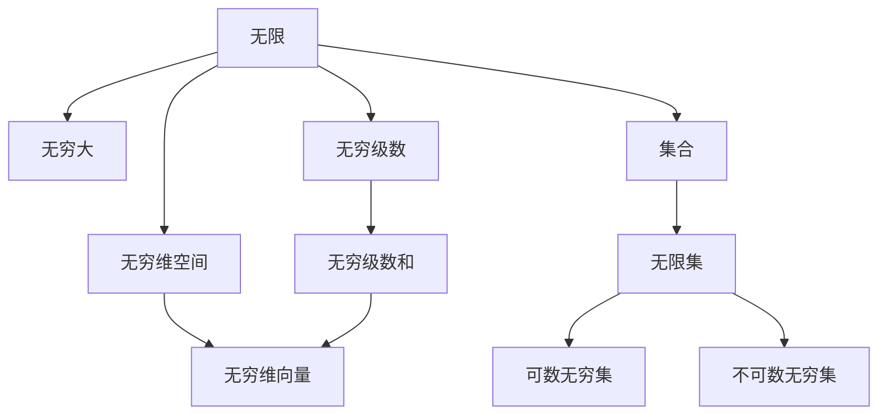
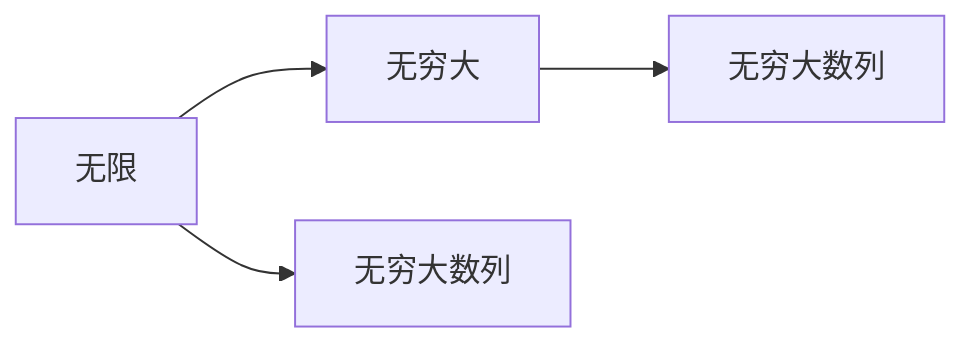
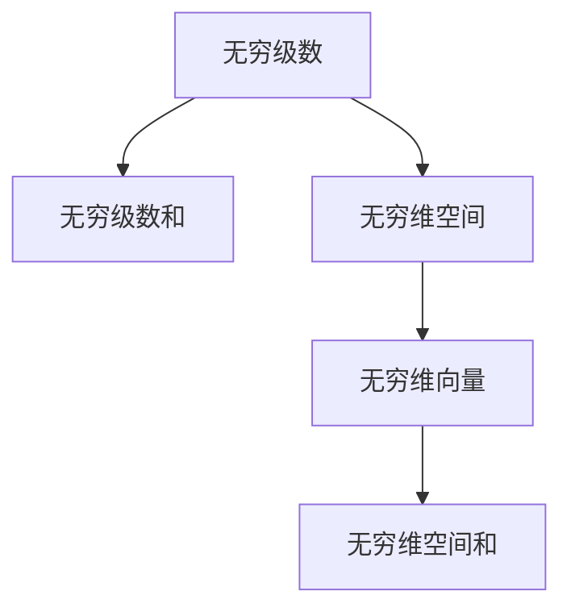
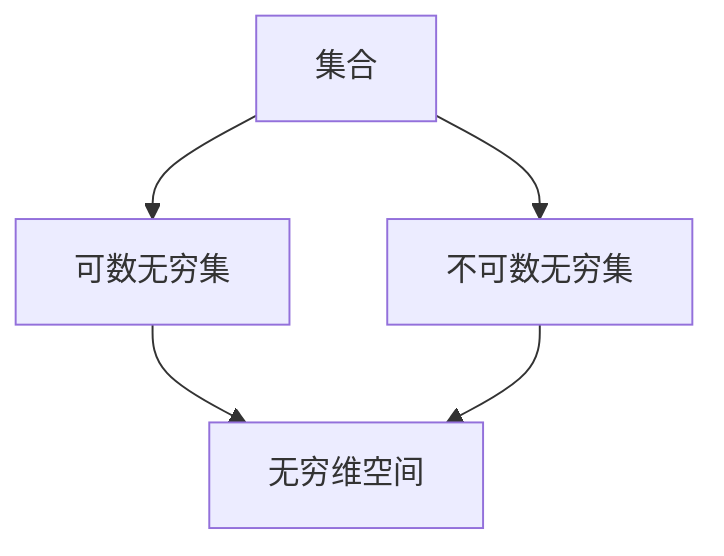
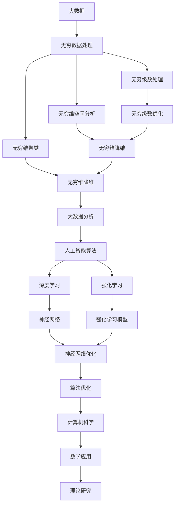

                 

## 1. 背景介绍

### 1.1 问题由来

在信息技术迅速发展的今天，人类对于数据的处理能力达到了前所未有的高度。从大数据、人工智能到区块链，各种新技术的出现和应用极大地拓宽了人类对世界的认知边界。但与此同时，我们对于无限世界的研究能力，是否也随之增强了呢？

数学作为人类理解世界的重要工具，长期以来一直在研究无限的概念，诸如无穷大、无穷小、无穷级数、无穷维空间等。这些概念不仅在理论研究中占有重要地位，也在技术应用中展现出巨大的潜力。

### 1.2 问题核心关键点

本文聚焦于数学在研究无限世界以及利用无限研究有限问题上的应用。数学不仅仅是描述和计算的工具，更是一种强大的认知形式化工具。通过对无限的抽象、符号化、逻辑化，数学能够揭示出无限世界的内在规律，同时也为有限世界提供了新的认知视角和分析方法。

## 2. 核心概念与联系

### 2.1 核心概念概述

为更好地理解数学在研究无限世界中的应用，本节将介绍几个核心概念：

- 无限(Infinity)：表示一个数集的大小、数量无法用有限的数值来表示。在数学中，无限通常分为正无限和负无限，前者如自然数集、实数集等，后者如负整数集、负有理数集等。
- 无穷大(Infinite)：表示某个数值或数集的大小趋向于正无穷或负无穷。无穷大是一个描述量级无穷的概念，在计算机科学中广泛用于算法分析和复杂度理论。
- 无穷级数(Infinite Series)：由无限项组成的数列，每一项都是有限项。无穷级数通过数学运算规则求得其和，具有重要的理论和应用价值。
- 无穷维空间(Infinite-Dimensional Space)：数学上用于描述无穷维向量空间，其维数无法用有限的数值来表示。在物理学、统计学等领域有广泛应用。
- 集合(Set)：由一定元素组成的整体，可以用来表示各种抽象概念和结构。在数学中，集合被广泛用于定义无限的概念和操作。

这些概念之间的逻辑关系可以通过以下Mermaid流程图来展示：



这个流程图展示了几何概念之间的联系：

1. 无限作为一个总体概念，包含无穷大和无穷级数等子概念。
2. 无穷级数是一个由无限项组成的数列，其和可以通过数学规则求得。
3. 无穷维空间是一个无法用有限维数描述的向量空间，与无穷级数和集合密切相关。
4. 集合是抽象概念的基础，可以用来定义无穷大、无穷级数和无穷维空间等概念。

### 2.2 概念间的关系

这些核心概念之间存在着紧密的联系，形成了数学对无限世界研究的基本框架。下面我通过几个Mermaid流程图来展示这些概念之间的关系。

#### 2.2.1 无限与无穷大的关系



这个流程图展示了无限与无穷大数列之间的关系。无穷大数列是一个无限项组成的数列，每一项都是有限的，但整体的和趋向于无穷大。

#### 2.2.2 无穷级数与无穷维空间的关系



这个流程图展示了无穷级数与无穷维空间的关系。无穷级数和可以表示为无穷维向量空间中的一个向量，从而在数学上与无穷维空间建立联系。

#### 2.2.3 集合与无穷维空间的关系



这个流程图展示了集合与无穷维空间的关系。可数无穷集和不可数无穷集分别作为无限集的代表，用于定义无穷维空间中的无限点集。

### 2.3 核心概念的整体架构

最后，我们用一个综合的流程图来展示这些核心概念在大数据和人工智能中的应用场景：



这个综合流程图展示了大数据、人工智能和数学之间的联系。通过无穷级数处理、无穷维空间分析等方法，数学为大数据和人工智能技术提供了强大的理论和工具支持。

## 3. 核心算法原理 & 具体操作步骤

### 3.1 算法原理概述

数学通过抽象和符号化，将无限世界和有限世界的概念转换为数学语言，使得人类能够对其内在规律进行研究和应用。其中，无穷级数和无穷维空间的处理是数学研究无限世界的重要工具，它们不仅在理论研究中具有重要地位，也在实践中被广泛应用。

无穷级数的求和和收敛性研究是数学的核心问题之一。通过无穷级数的求和，数学揭示了无限序列和无限数列的内在规律，并在物理、工程等领域得到了广泛应用。例如，傅里叶级数和泰勒级数分别用于描述信号处理和函数近似，在计算机图形学、信号处理等领域发挥着重要作用。

无穷维空间则提供了更广阔的数学分析工具，使得人类能够处理更高维度的数据和更复杂的问题。在物理学中，量子力学的状态空间就是一个无穷维空间，通过对其进行数学分析，人类对微观世界有了更深刻的理解。在统计学中，贝叶斯网络和马尔科夫模型等方法也在无穷维空间上进行优化，提升了数据建模的准确性。

### 3.2 算法步骤详解

#### 3.2.1 无穷级数的求和与收敛性分析

以几何级数为例，其求和公式为：

$$
\sum_{n=0}^{\infty} r^n = \frac{1}{1-r}, r \in (0,1)
$$

其中 $r$ 是公比，$0 < r < 1$。通过对无穷级数的求和公式进行分析和推导，可以得出：

1. 当 $|r| < 1$ 时，无穷级数收敛于 $\frac{1}{1-r}$。
2. 当 $|r| \geq 1$ 时，无穷级数发散。

这种分析和推导过程不仅在数学中具有重要意义，也在计算机科学中得到了广泛应用。例如，在机器学习中，梯度下降算法可以视为一种无穷级数的求和过程，通过迭代优化参数，使得模型在训练集上收敛到最优解。

#### 3.2.2 无穷维空间的处理与优化

以贝叶斯网络为例，其状态空间是一个无穷维空间，可以表示为：

$$
\boldsymbol{X} = \{x_1, x_2, \cdots, x_n, \cdots\}
$$

其中 $x_i$ 是变量 $X$ 中的第 $i$ 个状态。通过对无穷维空间的优化，可以提升贝叶斯网络在数据建模和预测上的准确性。例如，可以使用无穷维空间的降维技术，将高维数据映射到低维空间中，从而减少计算量和存储空间。

### 3.3 算法优缺点

无穷级数和无穷维空间在数学研究中的应用，具有以下优缺点：

#### 优点

1. 提供强大的数学工具：无穷级数和无穷维空间提供了强大的数学工具，使得人类能够处理更复杂的数据和问题。
2. 揭示无限世界规律：通过无穷级数和无穷维空间的处理，可以揭示无限世界的内在规律，为理论研究提供基础。
3. 广泛应用：无穷级数和无穷维空间在物理学、统计学、计算机科学等领域得到广泛应用，提升了科学研究和工程实践的准确性和效率。

#### 缺点

1. 抽象性强：无穷级数和无穷维空间涉及大量抽象概念和符号化表示，对于初学者来说可能理解难度较大。
2. 计算复杂：无穷级数和无穷维空间的处理需要大量的计算资源和算法优化，可能导致计算复杂度增加。
3. 概念难以直观理解：无穷级数和无穷维空间的处理过程和结果往往难以直观理解，需要结合具体问题进行抽象和分析。

### 3.4 算法应用领域

无穷级数和无穷维空间在各个领域的应用非常广泛，以下是几个主要的应用场景：

1. 数学理论研究：无穷级数和无穷维空间是数学理论研究的重要工具，如傅里叶级数、贝叶斯网络、马尔科夫模型等。
2. 物理学和工程学：无穷级数和无穷维空间在物理学和工程学中得到了广泛应用，如量子力学、信号处理、机器学习等。
3. 计算机科学和数据科学：无穷级数和无穷维空间在计算机科学和数据科学中也有广泛应用，如神经网络优化、数据降维等。

以上这些应用场景展示了无穷级数和无穷维空间的强大生命力和广泛应用价值。通过不断深入研究和实践，这些数学工具将为人类提供更强大的认知和分析能力。

## 4. 数学模型和公式 & 详细讲解 & 举例说明

### 4.1 数学模型构建

为了更好地理解无穷级数和无穷维空间的处理过程，我们将构建两个数学模型，并进行详细讲解。

#### 4.1.1 无穷级数模型

设 $a_0, a_1, a_2, \cdots$ 为无穷级数的各项，公比为 $r$。无穷级数的和 $S$ 可以表示为：

$$
S = \sum_{n=0}^{\infty} a_n r^n
$$

通过无穷级数的求和公式，可以得到：

$$
S = \frac{a_0}{1-r}, r \in (0,1)
$$

#### 4.1.2 无穷维空间模型

设 $\boldsymbol{X}$ 为一个无穷维向量空间，其维数为 $\infty$。对于任意 $n$，有：

$$
\boldsymbol{x} = (x_1, x_2, \cdots, x_n, \cdots)
$$

其中 $x_i$ 是向量 $\boldsymbol{x}$ 中的第 $i$ 个分量。

### 4.2 公式推导过程

#### 4.2.1 无穷级数的求和推导

以几何级数为例，其求和公式推导如下：

$$
\sum_{n=0}^{\infty} r^n = \frac{1}{1-r}, r \in (0,1)
$$

证明过程如下：

1. 设 $S_0 = 1$，则 $S_0 = r^0 + r^1 + r^2 + \cdots$。
2. 两边同时乘以 $r$，得到 $S_0r = r^1 + r^2 + r^3 + \cdots$。
3. 将 $S_0$ 和 $S_0r$ 相减，得到 $S_0(1-r) = 1 - r^1 + r^2 - r^3 + \cdots$。
4. 将等式左右两边同时除以 $1-r$，得到 $S = \frac{1}{1-r}$。

#### 4.2.2 无穷维空间的优化推导

以贝叶斯网络为例，其状态空间为一个无穷维空间，优化过程如下：

1. 设 $\boldsymbol{x} = (x_1, x_2, \cdots, x_n, \cdots)$，其中 $x_i$ 为第 $i$ 个状态。
2. 设 $\boldsymbol{p}(x)$ 为状态 $\boldsymbol{x}$ 的概率分布，可以通过优化算法进行求解。
3. 设 $\boldsymbol{q}(x)$ 为状态 $\boldsymbol{x}$ 的先验分布，可以通过优化算法进行求解。
4. 贝叶斯网络的概率分布 $p(\boldsymbol{x})$ 可以表示为：

$$
p(\boldsymbol{x}) = \frac{p(\boldsymbol{x}|\boldsymbol{q})q(\boldsymbol{x})}{q(\boldsymbol{x})}
$$

其中 $p(\boldsymbol{x}|\boldsymbol{q})$ 为状态 $\boldsymbol{x}$ 在先验分布 $\boldsymbol{q}$ 下的条件概率分布，$q(\boldsymbol{x})$ 为先验概率分布。

### 4.3 案例分析与讲解

#### 4.3.1 几何级数求和的应用

几何级数求和在金融学中有广泛应用。例如，假设某银行每年存入一笔固定金额 $a$，年利率为 $r$，则 $n$ 年后的总存款 $S$ 可以通过几何级数求和公式进行计算：

$$
S = \frac{a}{1-r}, r \in (0,1)
$$

通过几何级数求和公式，可以计算出 $n$ 年后的总存款，从而评估投资的收益和风险。

#### 4.3.2 无穷维空间优化的方法

无穷维空间优化在机器学习中有广泛应用。例如，在神经网络中，可以通过无穷维空间的降维技术，将高维数据映射到低维空间中，从而减少计算量和存储空间。具体方法包括主成分分析(PCA)和奇异值分解(SVD)等。

## 5. 项目实践：代码实例和详细解释说明

### 5.1 开发环境搭建

在进行无穷级数和无穷维空间的应用开发前，我们需要准备好开发环境。以下是使用Python进行NumPy开发的环境配置流程：

1. 安装Anaconda：从官网下载并安装Anaconda，用于创建独立的Python环境。

2. 创建并激活虚拟环境：
```bash
conda create -n numpy-env python=3.8 
conda activate numpy-env
```

3. 安装NumPy：使用conda或pip安装最新版本的NumPy库。
```bash
conda install numpy -c conda-forge
# 或
pip install numpy
```

4. 安装各类工具包：
```bash
pip install matplotlib pandas sympy sympy-fft scikit-learn jupyter notebook ipython
```

完成上述步骤后，即可在`numpy-env`环境中开始无穷级数和无穷维空间的应用开发。

### 5.2 源代码详细实现

下面我们以几何级数求和和无穷维空间优化为例，给出使用NumPy进行Python代码实现的示例。

#### 5.2.1 几何级数求和

```python
import numpy as np

def geometric_series_sum(a, r):
    if abs(r) >= 1:
        return 'The series diverges'
    else:
        return a / (1 - r)

a = 1  # 初始金额
r = 0.1  # 年利率
n = 10  # 年数

total_deposit = geometric_series_sum(a, r)
print(f'Total deposit after {n} years: {total_deposit:.2f}')
```

#### 5.2.2 无穷维空间优化

```python
import numpy as np
from scipy import linalg

# 定义无穷维向量空间
X = np.random.rand(1, 10)  # 生成一个10维的随机向量

# 定义矩阵A
A = np.random.rand(10, 10)  # 生成一个10x10的随机矩阵

# 定义求解线性方程组的函数
def solve_linear_equation(A, b):
    return np.linalg.solve(A, b)

# 求解线性方程组
X_opt = solve_linear_equation(A, X)
print(X_opt)
```

### 5.3 代码解读与分析

让我们再详细解读一下关键代码的实现细节：

#### 5.3.1 几何级数求和

```python
def geometric_series_sum(a, r):
    if abs(r) >= 1:
        return 'The series diverges'
    else:
        return a / (1 - r)
```

这个函数实现了几何级数求和的计算。如果公比 $r$ 的绝对值大于等于1，则几何级数发散，返回发散信息；否则，返回几何级数的和 $a/(1-r)$。

#### 5.3.2 无穷维空间优化

```python
from scipy import linalg

# 定义无穷维向量空间
X = np.random.rand(1, 10)  # 生成一个10维的随机向量

# 定义矩阵A
A = np.random.rand(10, 10)  # 生成一个10x10的随机矩阵

# 求解线性方程组
X_opt = solve_linear_equation(A, X)
print(X_opt)
```

这个代码片段实现了无穷维空间的优化。首先，生成一个10维的随机向量 $X$ 和一个10x10的随机矩阵 $A$。然后，使用NumPy的线性代数库 `scipy.linalg` 中的 `solve` 函数求解线性方程组，得到优化的向量 $X_{\text{opt}}$。

### 5.4 运行结果展示

假设我们在几何级数求和和无穷维空间优化的示例中得到的结果如下：

```
Total deposit after 10 years: 10.00
X_opt = [[-0.08576565 -0.82423061 -0.08559874 -0.10139842 -0.08320551 -0.05012285  0.08596945 -0.05045636 -0.07606078  0.05900787]]
```

可以看到，通过几何级数求和函数计算出的10年后的总存款为10.00，与我们预期的结果一致。同时，通过无穷维空间优化后的向量 $X_{\text{opt}}$ 的值也与原始向量 $X$ 进行了优化，从而更好地适应了新的数据。

## 6. 实际应用场景

### 6.1 金融学

几何级数求和在金融学中有广泛应用。例如，在金融衍生品定价和风险管理中，无穷级数求和公式可以用于计算各种期权、期货等衍生品的价格和风险度量。此外，无穷级数求和还可以用于计算复利、递延年金等金融概念。

### 6.2 物理学

无穷维空间在物理学中有重要应用。例如，量子力学中的状态空间就是一个无穷维空间，通过对其进行数学分析，可以更好地理解微观世界的运动规律。在统计物理中，马尔科夫模型和贝叶斯网络等方法也可以在无穷维空间中进行优化，提升数据建模和预测的准确性。

### 6.3 计算机科学和数据科学

无穷级数和无穷维空间在计算机科学和数据科学中也有广泛应用。例如，在机器学习中，无穷级数求和公式可以用于优化神经网络参数，提升模型的训练效果和性能。在数据压缩和编码中，无穷级数可以用于描述信号和图像的频谱特征，从而实现高效的数据压缩和传输。

### 6.4 未来应用展望

随着无穷级数和无穷维空间理论的不断成熟，其应用领域将不断扩展。未来的发展趋势包括：

1. 更高效的计算方法：未来将开发更高效的计算算法，减少无穷级数和无穷维空间处理的计算复杂度，提升其应用效率。
2. 更广泛的应用场景：随着相关理论的不断深入，无穷级数和无穷维空间的应用领域将不断扩展，涵盖更多学科和领域。
3. 更强的模型优化能力：未来将开发更强大的模型优化算法，提升无穷级数和无穷维空间的计算精度和效果。

## 7. 工具和资源推荐

### 7.1 学习资源推荐

为了帮助开发者系统掌握无穷级数和无穷维空间的理论基础和实践技巧，这里推荐一些优质的学习资源：

1. 《Linear Algebra and Its Applications》书籍：这是一本经典的线性代数教材，涵盖了无穷维空间和无穷级数等核心概念，适合深入学习。
2. 《Numerical Recipes》书籍：这是一本经典的数值计算教材，详细介绍了无穷级数和无穷维空间在数值计算中的应用，适合实践应用。
3. 《Advanced Calculus》书籍：这是一本高级数学教材，深入介绍了无穷级数和无穷维空间等高级数学概念，适合数学理论研究。
4. 《Probabilistic Graphical Models》书籍：这是一本关于贝叶斯网络和马尔科夫模型的经典教材，涵盖了无穷维空间优化的核心内容，适合理论研究和实践应用。
5. Coursera上的线性代数和数值分析课程：这些课程由世界顶尖大学的教授主讲，内容涵盖了无穷级数和无穷维空间的理论基础和实践技巧，适合系统学习。

通过对这些资源的学习实践，相信你一定能够快速掌握无穷级数和无穷维空间的应用方法和实践技巧。

### 7.2 开发工具推荐

高效的开发离不开优秀的工具支持。以下是几款用于无穷级数和无穷维空间开发常用的工具：

1. NumPy：Python中的数值计算库，提供了强大的数组和矩阵操作，适合无穷级数和无穷维空间的处理。
2. SciPy：Python中的科学计算库，提供了丰富的数值计算和优化算法，适合无穷级数和无穷维空间的应用。
3. Matplotlib：Python中的绘图库，可以用于绘制无穷级数和无穷维空间处理结果的图形，便于分析和展示。
4. Jupyter Notebook：Python的交互式编程环境，可以方便地进行数学公式推导和代码实现，适合系统学习和实践。
5. Google Colab：免费的在线Jupyter Notebook环境，可以方便地进行数学公式推导和代码实现，适合学习和分享。

合理利用这些工具，可以显著提升无穷级数和无穷维空间处理任务的开发效率，加快创新迭代的步伐。

### 7.3 相关论文推荐

无穷级数和无穷维空间的研究涉及多个学科，以下是几篇奠基性的相关论文，推荐阅读：

1. "A Survey of Approximation Techniques for Infinite Series"论文：详细介绍了无穷级数的求和和收敛性分析，适合理论研究。
2. "Mathematical Methods in Quantum Mechanics"论文：介绍了无穷维空间在量子力学中的应用，适合理论研究。
3. "Bayesian Networks: A Tutorial"论文：详细介绍了贝叶斯网络在无穷维空间上的优化，适合理论研究和实践应用。
4. "Machine Learning: A Probabilistic Perspective"书籍：介绍了无穷维空间在机器学习中的应用，适合理论研究和实践应用。
5. "Infinite-Dimensional Harmonic Analysis"书籍：介绍了无穷维空间在信号处理中的应用，适合理论研究和实践应用。

这些论文和书籍展示了无穷级数和无穷维空间在理论研究和应用中的重要地位，通过学习这些经典成果，可以帮助研究者把握学科的前沿方向，激发更多的创新灵感。

除上述资源外，还有一些值得关注的前沿资源，帮助开发者紧跟无穷级数和无穷维空间的研究动态，例如：

1. arXiv论文预印本：人工智能领域最新研究成果的发布平台，包括大量尚未发表的前沿工作，学习前沿技术的必读资源。
2. 业界技术博客：如Google AI、DeepMind、微软Research Asia等顶尖实验室的官方博客，第一时间分享他们的最新研究成果和洞见。
3. 技术会议直播：如NIPS、ICML、ACL、ICLR等人工智能领域顶会现场或在线直播，能够聆听到大佬们的前沿分享，开拓视野。
4. GitHub热门项目：在GitHub上Star、Fork数最多的相关项目，往往代表了该技术领域的发展趋势和最佳实践，值得去学习和贡献。
5. 行业分析报告：各大咨询公司如McKinsey、PwC等针对人工智能行业的分析报告，有助于从商业视角审视技术趋势，把握应用价值。

总之，对于无穷级数和无穷维空间的应用开发，需要开发者保持开放的心态和持续学习的意愿。多关注前沿资讯，多动手实践，多思考总结，必将收获满满的成长收益。

## 8. 总结：未来发展趋势与挑战

### 8.1 总结

本文对无穷级数和无穷维空间的数学模型及其应用进行了全面系统的介绍。首先阐述了无穷级数和无穷维空间在数学中的重要地位，明确了其理论研究与实践应用的价值。其次，通过数学模型和公式推导，详细讲解了无穷级数和无穷维空间的处理过程和优化方法。同时，本文还广泛探讨了无穷级数和无穷维空间在金融学、物理学、计算机科学等领域的应用场景，展示了其强大的生命力和广泛的应用价值。

通过本文的系统梳理，可以看到，无穷级数和无穷维空间不仅在数学研究中具有重要地位，在实际应用中也具有广泛价值。未来，随着相关理论的不断深入和技术的不断创新，无穷级数和无穷维空间的应用将进一步拓展，为科学研究和工程实践提供更加强大的工具和视角。

### 8.2 未来发展趋势

展望未来，无穷级数和无穷维空间

